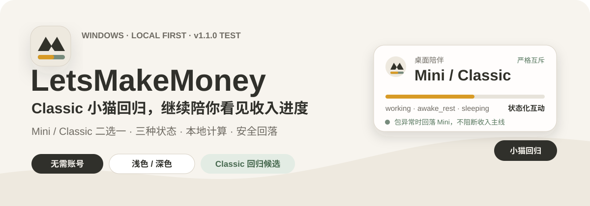
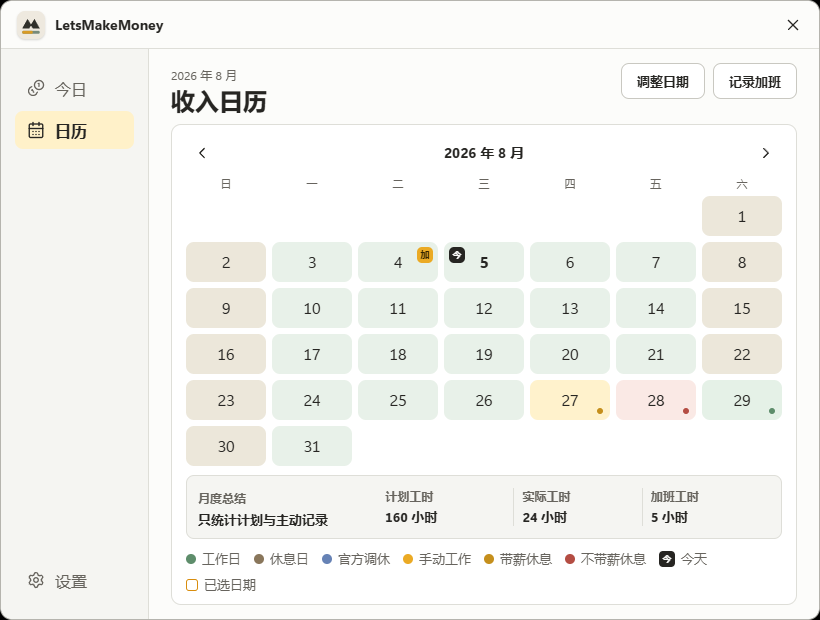

<div align="center">
  
</div>

<div align="center">
  <a href="README.md">简体中文</a> ·
  <a href="https://github.com/NzyZzz1998/LetsMakeMoney/releases">Download stable</a> ·
  <a href="doc/current.md">Project status</a> ·
  <a href="doc/releases/v1.1.0/README.md">v1.1.0 candidate</a>
</div>

## What is today's work worth?

LetsMakeMoney is a local-first Windows earnings-progress utility. Configure a monthly salary, work schedule, and rest pattern, and it turns that abstract monthly number into today's estimated earnings, work progress, the next stage countdown, and monthly hour summaries.

The Mini view stays quietly on the desktop. In v1.1.0, users may explicitly switch to the Classic orange cat companion; Mini and Classic are mutually exclusive. Open the full workbench only when you need to adjust a date, record overtime, or inspect the month. No account is required; salary, schedule, overtime, and logs remain on the local machine.

## Real interface

<div align="center">
  
  <br>
  <sub>Real v1.0.8 Windows product baseline with demonstration data; the v1.1.0 Classic companion is not represented by an old screenshot.</sub>
</div>

<table>
  <tr>
    <th align="center">Mini earnings view</th>
    <th align="center">Earnings calendar and monthly hours</th>
  </tr>
  <tr>
    <td align="center"></td>
    <td align="center"></td>
  </tr>
</table>

<p align="center"><sub>All screenshots come from the v1.0.8 Windows application. Amounts, dates, and hours are demonstration data.</sub></p>

## Core experience

| See progress at a glance | Understand each workday | Keep the desktop private | Run locally and reliably |
| --- | --- | --- | --- |
| Today's earnings, stage countdown, and progress | Single weekend, double weekend, alternating weeks, and overnight shifts | Mini retracts sensitive amounts at a work-area edge | Transactional configuration, recovery, and diagnostics |
| Daily schedule, daily rate, hourly rate, and monthly total | Official calendar data, estimated years, and manual date overrides | Hover to reveal, leave to retract, tray to recover | Light/dark themes with local persistence |
| Per-day overtime and monthly hour summaries | Paid rest, unpaid rest, and adjusted workdays | Mini hides while the workbench is open | UI and transparent hit testing calibrated at three DPI levels |
| Mini / Classic companion choice | Three Classic base states with state-specific feedback | Transparent pixels pass through | Package failures safely fall back to Mini |

## Start in three steps

1. Download the latest stable portable Zip from [Releases](https://github.com/NzyZzz1998/LetsMakeMoney/releases).
2. Extract it, run `LetsMakeMoney.exe`, and enter your salary, rest pattern, and schedule.
3. Use Mini for live progress; open the workbench, Settings, or onboarding from the system tray.

There is currently no installer or silent update. Update checks only proceed after user confirmation.

## v1.1.0 candidate

> [!IMPORTANT]
> v1.1.0 is being synchronized to the test branch for continued acceptance. It is not a public stable release. Classic size continuity is improved, but direct-machine drag feel remains unverified.

| Fact | Current status |
| --- | --- |
| Public stable release | [v1.0.7 Stable](https://github.com/NzyZzz1998/LetsMakeMoney/releases/tag/v1.0.7) |
| Local v1.0 closeout | `v1.0.8` annotated tag, preserved as historical identity |
| Current development candidate | Exact version `v1.1.0` |
| Candidate purpose | Classic-only desktop companion return; Mini remains the default |
| Current clean candidate | `V110-20260813T081246Z-f5ae4ac3-clean` |
| Candidate Zip SHA256 | `E79D3716400D74E9E2F5419700B97630F273AA67761982081AED07E8C87C6EB7` |
| Automated gates | Current gate, 91 Rust tests, Clippy, frontend build, and package audit passed |
| Manual verdict | Partial pass; remote observation cannot establish direct-machine drag quality |

The v1.1.0 candidate adds:

- Classic working, awake-rest, and sleeping states with state-specific click feedback.
- 500ms hold-to-run dragging, responsive direction changes, release settling, and per-frame hit regions.
- Strict Mini/Classic exclusion and workbench leases that restore only the previously active companion.
- Safe Mini fallback when the Classic manifest, atlas, or hashes fail validation.
- A sanitized runtime package containing only production atlases, hit data, manifests, and required license summaries.

See the [v1.1.0 verification record](doc/releases/v1.1.0/verification.md) for candidate hashes and acceptance boundaries. A local candidate does not replace a published Release.

### Not yet verified

- Direct-machine grab continuity, drag responsiveness, rapid direction reversal, and interaction recovery after screenshot or focus interruption.
- Every tray context-menu command, process termination after Exit, and Settings / Modal input locking with abnormal-close recovery.
- The complete hold-and-drag chain at 125% and 150% DPI; visibility and transparent hit testing are already covered.
- Controlled corruption of the package embedded in the exact desktop EXE; isolated bad-package fixtures pass 3/3.
- Windows 10 and multi-display environments.

## Data and privacy

```text
%APPDATA%\io.letsmakemoney.windows\
```

- No account is required; salary, schedule, date overrides, and overtime are not uploaded.
- Diagnostic summaries redact machine-specific paths.
- Mini can retract amounts at the left or right work-area edge and retain only a non-monetary stage label.
- Years outside the bundled official calendar are clearly marked as estimates; the app never invents official holidays or adjusted workdays.
- Classic is enabled only after an explicit user choice. Its animation assets are not MIT-licensed; see the [visual asset license](ASSETS_LICENSE.md).
- The historical desktop-pet release remains available as [`v0.9-beta`](https://github.com/NzyZzz1998/LetsMakeMoney/releases/tag/v0.9-beta) as a historical baseline.

## Support boundary

- **Stable release verified:** Windows 11 x86_64, single display, 100% / 125% / 150% DPI.
- **v1.1.0 candidate:** UI visibility and transparent hit testing pass at all three DPI levels; direct-machine drag remains pending.
- **Runtime requirement:** Microsoft Edge WebView2 Runtime.
- **Best effort:** Windows 10 x86_64; no real-device or VM evidence is currently available.
- **Not verified:** multi-display setups are excluded from the verified-pass statement.

The complete v1.1.0 interaction verdict requires direct-machine input evidence recorded in the [verification record](doc/releases/v1.1.0/verification.md).

## Run from source

### Requirements

- Node.js 22+
- Python 3.12
- Rust 1.97.1 with the MSVC toolchain
- Visual Studio 2022 Build Tools with Desktop development with C++
- Windows SDK and Microsoft Edge WebView2 Runtime

```powershell
git clone https://github.com/NzyZzz1998/LetsMakeMoney.git
cd LetsMakeMoney\apps\windows-v1
npm install
npm run tauri dev
```

### Verify and package

```powershell
# Repository root: the only current verification entry point
powershell -ExecutionPolicy Bypass -File .\scripts\verify_windows_current.ps1

# Create an isolated local v1.1.0 candidate without replacing published assets
powershell -ExecutionPolicy Bypass -File .\scripts\package_v110.ps1
```

Local candidates are written only to `.artifacts\candidates\v1.1.0\<candidate-id>\`. A same-named local Zip does not establish GitHub Release identity; published downloads must be verified against the Releases page and its SHA256 file.

## Repository map

```text
apps/windows-v1/       Tauri 2 + React 19 Windows client
shared/                Official calendar and shared data
scripts/               Current gate, packaging, and compliance checks
doc/current.md         Current project fact source
doc/releases/v1.1.0/   v1.1.0 candidate, acceptance, and release preparation
```

## Contributing and license

Code, documentation, tests, and Windows-experience improvements are welcome. Start with the [contributing guide](CONTRIBUTING.md), [Code of Conduct](CODE_OF_CONDUCT.md), and [security policy](SECURITY.md).

Project-authored code and documentation use the [MIT License](LICENSE). The Classic cat and its derived runtime assets are not MIT-licensed and may only ship with official LetsMakeMoney source and binaries; see [ASSETS_LICENSE.md](ASSETS_LICENSE.md) and [THIRD_PARTY_NOTICES.md](THIRD_PARTY_NOTICES.md).
