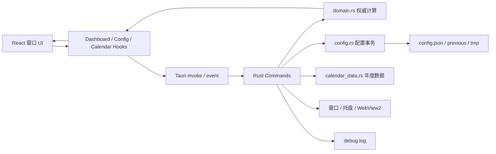

# LetsMakeMoney 架构审计报告

> 审计对象：`main`
> 审计基线：`eb57e0b3af726f552afe68acccaa927345714da9`
> 审计日期：2026-07-30
> 技术栈：Rust、Tauri 2、React 19、TypeScript
> 结论性质：发布后增量治理基线，不是重写提案

## 1. 审计结论

LetsMakeMoney 已具备可继续演进的领域底座，不需要重新实现收入计算，也不适合推倒重写。

当前最主要的长期维护风险集中在应用编排层：

1. 前端 `App.tsx` 和 `model.ts` 同时承担界面、Tauri 调用、状态编排、浏览器降级计算与时间生命周期。
2. Rust `lib.rs` 同时承担 command、窗口构建、WebView2 生命周期、托盘、配置事务编排和启动流程。
3. 配置文件本身已经版本化并具备迁移、备份、校验和事务写入，但窗口位置持久化与 Settings 保存仍可能竞争写入。
4. Mini、Workbench 等 WebView 已有隐藏暂停与配置更新事件，但缺少统一的前端运行时端口和清晰的“每窗口状态 / 跨窗口事实”边界。
5. 业务时间入口分散在多个 React 文件，给跨夜、睡眠恢复、系统时间和时区变化增加了证明成本。
6. 自动验证中仍有大量“源代码必须包含某段文本”的结构性检查，重构时容易出现行为正确但门禁误报。
7. `cargo test` 当前通过，但 `cargo clippy --all-targets -- -D warnings` 有 4 项失败；标准 PowerShell 验证脚本也无法发现本机已安装的外部 Rust 工具链。

总体判断：

- **领域正确性基础：良好**
- **用户数据保护基础：良好**
- **前端模块边界：需要治理**
- **Rust 系统集成边界：需要治理**
- **多窗口状态边界：可用但需要收敛**
- **构建与质量门禁：部分可复现**
- **适合采用的策略：测试先行、逐片迁移、行为等价、随时可回滚**

## 2. 证据状态

本文只使用以下证据状态：

- **已确认**：由当前代码、测试或实际命令直接证明。
- **高度可能**：调用关系和并发顺序形成明确风险，但尚无生产复现。
- **待确认**：需要长期运行、真实 Windows 或故障注入。
- **主观判断**：架构取舍，不代表已发生缺陷。

## 3. 当前目录与职责

### 3.1 仓库级结构

| 路径 | 当前职责 | 判断 |
| --- | --- | --- |
| `apps/windows-v1/` | Windows v1 产品源码、测试和 Tauri 工程 | 当前主产品 |
| `scripts/` | 构建、验证、打包、发布辅助 | 正式发布链路 |
| `doc/releases/` | 各版本事实、需求、验收和发布记录 | 历史事实源 |
| `doc/user-guide/` | 用户说明与真实截图材料 | 用户文档 |
| `doc/prototypes/` | 历史和当前交互原型 | 设计证据，不是运行事实 |
| `spikes/v1.0-ui/` | v1.0 技术 Spike 及工具链兼容内容 | 仍被脚本引用，不能直接归档 |

数据库影响：**无数据库**。当前持久化由本地 JSON、内置日历数据和日志文件完成。

### 3.2 前端真实结构

| 文件 | 行数（约） | 当前职责 |
| --- | ---: | --- |
| `src/App.tsx` | 1380 | 所有窗口、页面、交互、拖动、Tauri 命令和部分日期格式化 |
| `src/model.ts` | 1029 | Dashboard 状态、权威同步、本地 tick、日历加载、浏览器降级和 React hooks |
| `src/styles.css` | 436 | 全应用视觉和窗口密度 |
| `src/configModel.ts` | 209 | 配置类型、校验、读写、草稿状态和主题预览 |
| `src/authoritativeSync.ts` | 206 | 可测试的秒级推进与时间环境判断 |
| `src/presentation.ts` | 212 | 阶段与文案映射 |
| `src/calendarState.ts` | 约 100 | 日历加载状态机 |
| `src/dashboardLifecycle.ts` | 约 80 | 显隐生命周期状态机 |
| `src/dateOverrideState.ts` | 约 70 | 日期调整状态 |
| `src/theme.ts` | 约 60 | 主题应用和跨窗口预览事件 |

已有的纯函数模块是继续治理的重要基础，不应被新状态库替换。

### 3.3 Rust 真实结构

| 文件 | 行数（约） | 当前职责 |
| --- | ---: | --- |
| `src-tauri/src/lib.rs` | 1327 | commands、窗口、托盘、WebView2、配置编排、启动和退出 |
| `src-tauri/src/domain.rs` | 1193 | 收入、工作日、跨夜、日期调整和日历领域计算 |
| `src-tauri/src/config.rs` | 750 | 配置模型、迁移、校验、事务保存、回滚 |
| `src-tauri/src/calendar_data.rs` | 355 | 内置中国大陆官方日历数据加载与校验 |
| `src-tauri/src/support.rs` | 229 | 日志、诊断摘要、更新响应 |
| `src-tauri/src/platform.rs` | 124 | Windows 能力、窗口位置和托盘常量 |

`domain.rs` 虽然较长，但当前仍是相对内聚的权威领域层。优先级高于“按文件行数强行拆分”的，是先把外围调用与基础设施职责移出 `lib.rs` 和 React 组件。

## 4. 产品与工程数据流

当前主要问题不在 `Domain`，而在 `UI → Hooks → Invoke` 和 `Commands → Windows/Config/Log` 的边界过于集中。

## 5. 领域与计算审计

### 5.1 已具备能力

**已确认**

`domain.rs` 已覆盖：

- 单休、双休、大小周。
- 大小周显式锚点和周类型。
- 普通工作日、法定节假日、官方调休工作日。
- 手动工作日、带薪休息、不带薪休息。
- 普通日班、零休息和跨夜班次。
- owner date。
- 月薪分配、日薪、时薪、今日收益和分币守恒。
- 休息期间收入冻结。
- 下一个工作日。

Rust 测试基线：`38/38` 通过。

### 5.2 当前风险

#### ARCH-001：浏览器降级逻辑复制了简化版领域规则

- **证据状态：已确认**
- **严重度：Major**
- **证据：** `src/model.ts:161-379`
- **现象：** 前端自行实现工作日、收入、阶段和日历预览，只覆盖双休式周末和固定 `08:00-18:00 / 12:00-14:00` 的部分场景。
- **影响：** 浏览器预览、测试环境和真实 Rust 权威结果可能漂移；未来增加收入模式时会出现第二套计算核心。
- **建议：** 浏览器 fallback 只用于展示固定演示状态，并明确标记非权威；业务预览测试改为调用纯领域合同或固定 fixture，不继续扩展前端计算。

#### ARCH-002：Rust/TypeScript 数据合同手工重复

- **证据状态：已确认**
- **严重度：Major**
- **证据：** `src/model.ts:39-126`、`src/configModel.ts`、`src-tauri/src/domain.rs`、`src-tauri/src/config.rs`
- **影响：** Rust 新增字段时，前端可能编译通过但运行时缺字段或误解枚举。
- **建议：** 先建立合同 fixture 与序列化兼容测试；后续评估生成 TypeScript 类型，但本轮不引入大型绑定生成器。

## 6. 前端审计

### 6.1 组件边界

#### ARCH-003：`App.tsx` 是窗口路由、UI 和系统调用的集中点

- **证据状态：已确认**
- **严重度：Major**
- **证据：** `src/App.tsx` 约 1380 行；直接调用 `show_app_window`、`hide_app_window`、`move_app_window`、`window_drag_origin`、`platform_capabilities`、诊断、更新和退出 commands。
- **影响：** 任一窗口改动都提高全应用回归范围；组件难以在浏览器和测试中独立渲染。
- **建议：** 先抽 `runtime/` 与 `services/`，再按窗口抽 `features/mini`、`features/workbench`、`features/settings`、`features/wizard`。不在一个版本内搬完。

#### ARCH-004：`model.ts` 同时是领域适配器、运行时服务、Store 和 Hook

- **证据状态：已确认**
- **严重度：Major**
- **证据：** `src/model.ts:135-1011`
- **影响：** 时间变化、网络/命令失败、日历加载和 React 生命周期互相影响；测试只能绕过 React 直接测部分 helper。
- **建议：** 分为：
  - `domain/contracts.ts`
  - `services/dashboardService.ts`
  - `services/calendarService.ts`
  - `stores/dashboardStore.ts`
  - `hooks/useDashboard.ts`
  - `utils/dateTime.ts`

### 6.2 运行时适配

#### ARCH-005：`isTauri()` 与 Tauri 调用分散

- **证据状态：已确认**
- **严重度：Minor**
- **证据：** `model.ts:135`、`configModel.ts:74`、`theme.ts:10`
- **影响：** fallback 策略、错误映射和测试替身不一致。
- **建议：** 建立单一 `runtime/appRuntime.ts`，暴露 `isDesktop`、`invoke`、`listen`、`emit`；业务服务只依赖端口。

### 6.3 时间入口

#### ARCH-006：业务时间入口分散

- **证据状态：已确认**
- **严重度：Major**
- **证据：** `App.tsx` 与 `model.ts` 多处直接 `new Date()` / `Date.now()`。
- **影响：** 跨夜、时区变化、睡眠恢复和可重复测试的证明成本高。
- **建议：** 建立 `TimeService`，提供 `now()`、`wallClockMs()`、`localDateKey()`、`monthKey()`、`timeZoneOffset()`。UI 纯格式化可继续消费 `Date`，业务判定必须由服务或 Rust 权威结果提供。

### 6.4 多窗口状态

#### ARCH-007：多窗口各自维护 Dashboard 生命周期

- **证据状态：已确认**
- **严重度：Minor**
- **证据：** 每个 WebView 都执行 `useDashboard()`；已有 `lmm:window-hidden` / `shown` 和 `lmm://configuration-updated`。
- **影响：** 多窗口可产生重复权威同步，但隐藏窗口已经暂停 timer。
- **既有结论：** v1.0.3 性能 Spike 未证明需要共享快照或单一永久所有者。
- **建议：** 不引入跨 WebView 全局状态库。先建立每窗口 Store、统一事件合同和服务端口；未来只有测量达到门槛才考虑共享快照。

## 7. Rust 后端审计

### 7.1 Command 层

#### ARCH-008：`lib.rs` 混合应用层与系统集成

- **证据状态：已确认**
- **严重度：Major**
- **证据：** `src-tauri/src/lib.rs:119-1327`
- **现象：** 21 个 command 与窗口构建、位置策略、WebView2 suspend/resume、托盘、单实例、配置日志和启动流程共存。
- **影响：** Windows 生命周期改动和普通业务 command 共享编译与审阅上下文；测试对 `lib.rs` 文本位置形成依赖。
- **建议：** 逐步拆成：
  - `commands/`
  - `services/`
  - `repositories/`
  - `models/`
  - `system/`

第一批只移动无窗口依赖的收入、日历和配置应用服务；Windows 窗口代码在 characterization tests 完成前保持原位。

### 7.2 配置系统

#### ARCH-009：配置版本化已经存在，不应重复建设

- **证据状态：已确认**
- **严重度：Suggestion**
- **证据：** `src-tauri/src/config.rs`
- **现状：**
  - 当前 `config_version = 8`。
  - 支持 v5、v6、v7 到 v8 迁移。
  - 有 `tmp`、read-back 校验、`previous` 备份、原子替换和失败回滚。
  - 测试覆盖迁移、失败保护、无变化和非法主题回退。
- **建议：** 提取 `CURRENT_CONFIG_VERSION`，建立显式迁移注册表和 repository 端口；没有字段变化时不增加版本号。

#### ARCH-010：Mini 位置保存可能覆盖并发 Settings 保存

- **证据状态：高度可能**
- **严重度：Major**
- **证据：** `src-tauri/src/lib.rs:1006-1060`
- **现象：** 位置保存先克隆内存配置、释放锁，再从磁盘加载并整份保存；Settings 保存也会整份写入配置。
- **风险序列：**
  1. 位置线程克隆旧内存草稿。
  2. Settings 保存新配置。
  3. 位置线程以旧草稿覆盖磁盘。
- **建议：** 所有配置写入使用同一写入协调器；位置保存只能 patch `mini_window_position`，并在同一锁/事务边界内合并最新配置。

### 7.3 日志

#### ARCH-011：日志器按调用重复构造

- **证据状态：已确认**
- **严重度：Minor**
- **证据：** `append_log` 与保存命令多次创建 `RotatingLogger`。
- **影响：** 逻辑分散，测试和依赖注入困难；尚无证据表明存在性能故障。
- **建议：** 后续将 logger 作为 managed state 或服务端口。不是当前 P0。

### 7.4 Windows 生命周期

#### ARCH-012：窗口与 WebView2 代码属于高风险区

- **证据状态：已确认**
- **严重度：Major**
- **证据：** `lib.rs:401-958`
- **现状：** 已覆盖窗口按需创建、DPI、隐藏/恢复、WebView2 suspend/resume、托盘找回和关闭隐藏。
- **风险：** 这些逻辑与 command/启动代码交织，且现有 Python 门禁按函数名从 `lib.rs` 抽取函数体。
- **建议：** 先将门禁升级为模块级或行为级，再拆 `system/windows.rs` 和 `system/tray.rs`。

## 8. Calendar Provider 审计

#### ARCH-013：当前中国日历加载器是实现，不是端口

- **证据状态：已确认**
- **严重度：Minor**
- **证据：** `src-tauri/src/calendar_data.rs`
- **现状：** 已有来源、manifest、SHA256、年度完整性和 estimated coverage。
- **建议：** 引入轻量 `CalendarProvider` trait，当前实现为 `EmbeddedChinaCalendarProvider`。不要为未计划的国家提前建设下载器、网络层或插件系统。

## 9. 测试与质量门禁

### 9.1 已有可执行行为测试

**已确认**

- Calendar state：11/11
- Authoritative sync：25/25
- Dashboard lifecycle：8/8
- Rust：38/38
- TypeScript strict 与 Vite production build：通过

### 9.2 结构性测试风险

#### ARCH-014：大量 Python 测试绑定具体文件和源码文本

- **证据状态：已确认**
- **严重度：Major**
- **证据：** `tests/verify_m*.py`、`verify_v10*.py`、`verify_webview_suspend_v103.py`
- **影响：** 函数行为不变但移动文件即可失败，阻碍安全拆分。
- **建议：**
  1. 先保留历史门禁。
  2. 为新服务补真正可执行测试。
  3. 将新门禁绑定导出合同和运行结果。
  4. 旧文本门禁只在对应行为已有替代证据后退役。

### 9.3 Clippy 与工具链

#### ARCH-015：Clippy 严格门禁当前失败

- **证据状态：已确认**
- **严重度：Major**
- **实际结果：** 4 项：
  - `manual_range_patterns`
  - `clone_on_copy` 两项
  - `useless_format`
- **建议：** 最小代码修正，不改变行为，并加入正式验证。

#### ARCH-016：工具解析无法发现已安装外部 Rust 工具链

- **证据状态：已确认**
- **严重度：Major**
- **证据：** `scripts/v10_tools.ps1` 只搜索仓库 Spike 工具链或 PATH；本机工具链位于 `D:\Work\Software\lmm-v103-toolchain`。
- **影响：** 标准验证脚本在 Web 测试通过后仍会提前失败。
- **建议：** 支持显式环境变量和用户 rustup/cargo 标准目录，输出最终选择来源；不要写死某个开发者绝对路径。

## 10. 风险优先级

| 优先级 | ID | 原因 |
| --- | --- | --- |
| P0 | ARCH-010 | 可能覆盖用户最新配置，直接涉及数据安全 |
| P0 | ARCH-003 / 004 / 005 | 阻碍后续功能和测试隔离，是所有前端治理前置 |
| P0 | ARCH-015 / 016 | 当前工程要求与真实门禁不一致 |
| P1 | ARCH-006 | 时间可信性和可测试性 |
| P1 | ARCH-008 | Rust 长期维护与 Windows 风险隔离 |
| P1 | ARCH-014 | 安全重构的测试前置 |
| P2 | ARCH-013 | 多国家日历的扩展端口 |
| P2 | Growth / AI 端口 | 仅设计，不在当前产品代码中预埋空实现 |

## 11. 不应进行的优化

- 不新建第二套收入计算核心。
- 不用 Zustand/Redux 取代已经可用的 React 状态，除非出现经测量的跨窗口需求。
- 不把多窗口强制改成单一共享 WebView 状态。
- 不一次性拆完 `App.tsx`、`model.ts` 和 `lib.rs`。
- 不为了 Calendar Provider 引入联网服务。
- 不为了 AI 预留而引入 AI SDK、密钥或云端依赖。
- 不提升配置版本但不改变数据合同。
- 不移动 Windows 原生生命周期代码，除非已有行为级回归门禁。

## 12. 第一阶段结论

项目具备进入增量架构治理的条件。建议从以下四个可独立回滚的切片开始：

1. 前端 runtime/service 端口与可替换测试。
2. 配置写入串行化和版本常量。
3. TimeService 与业务时间入口收敛。
4. Rust 应用服务与 Calendar Provider 最小边界。

每个切片必须先添加会失败的测试，再实施，再运行完整门禁。
