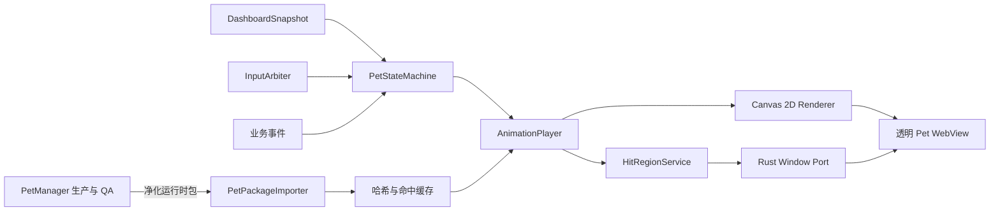
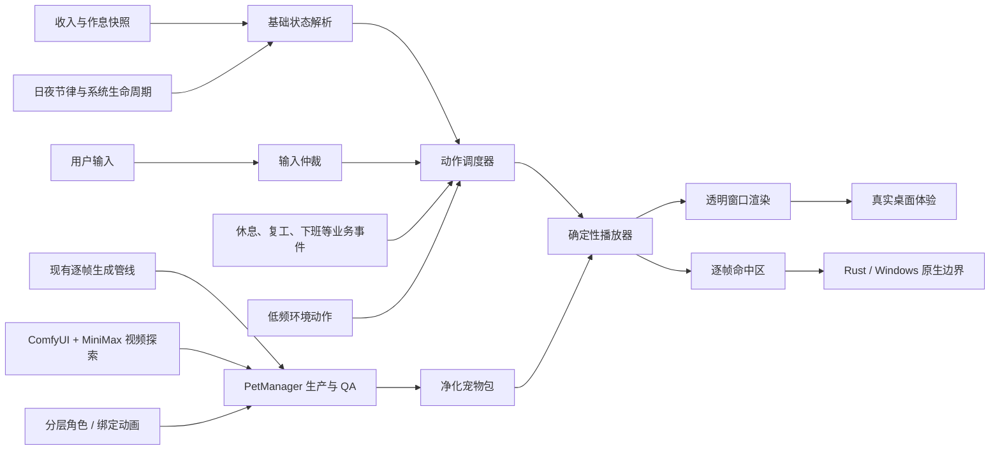
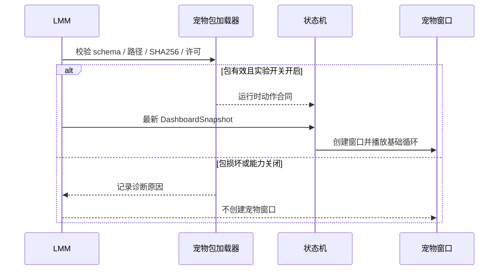

入口判断：/review

# LetsMakeMoney 桌宠动画系统深度重构 Review

> 主路径：产品与工程专项 Review
> 辅助路径：动画质量审查、宠物包生产合同审查、生成技术 Spike 评估
> 审查对象：LetsMakeMoney 历史桌宠运行时、当前 Tauri/React 主线、PetManager 自定义动作管线、Classic 与多多候选资产、本机秋叶 ComfyUI 环境
> 证据边界：本稿不代表桌宠恢复、不代表候选素材发布，也不改变 v1.0.8 的版本身份

> 文档状态：方案评审稿
> 适用范围：当前 Tauri/React Windows 主线与未来可选桌宠能力
> 不代表：桌宠已恢复、素材已发布、v1.0.8 候选身份发生变化

## 1. 结论先行

推荐采用 **方案 B：混合桌宠沙盒**。

它保留当前 Rust + Tauri + React 产品主线，将桌宠作为默认关闭、可独立回滚的透明窗口能力接入。PetManager 继续负责素材生产和 QA，LetsMakeMoney 只消费通过哈希、许可和人工审查门禁的净化运行时包。

推荐顺序不是“先换一批更好看的帧”，而是：

1. 先统一现有 UI 动效令牌和 reduced-motion 行为。
2. 建立纯函数动画状态机、单调时钟和确定性回放测试。
3. 建立 PetManager 运行时包适配器，不按 `pet_id` 写特判。
4. 在隔离沙盒窗口中完成播放、输入、拖动和动态命中。
5. Classic 作为技术锚点，多多作为身份一致性与自然动作质量对照；公开默认宠物必须等真实桌面验收后再决定。
6. 通过真实 Windows 门禁后，才讨论是否向用户开放。

本轮的核心判断是：**旧版失败并非单一素材问题，也不是单一状态机问题，而是“动作语义、素材生产、运行时触发、桌面交互和验收门禁”五个环节没有形成闭环。** 只替换图集会再次得到一套技术上可播放、长期使用却生硬和重复的桌宠。

## 2. 当前真实基线

### 2.1 当前产品 UI 动效

当前 v1 主线已经具备一套轻量 UI 动效，但尚未形成独立的 motion system：

| 能力 | 当前证据 | 判断 |
| --- | --- | --- |
| 控件反馈 | 按钮、输入、开关和图标使用约 90-160ms 过渡 | 可保留，需统一令牌 |
| 收入进度 | 进度条使用 220ms `width` 过渡 | 视觉可用，后续改为 transform 驱动 |
| Mini 隐私收起 | 600ms 延迟、180ms 过渡、generation/token 保护 | 是成熟状态机，不应和桌宠播放状态混在一起 |
| 窗口拖动 | `requestAnimationFrame` 合并原生位置更新 | 可作为桌宠移动的原生窗口端口参考 |
| 生命周期 | Rust 发送 `lmm:window-hidden` / `lmm:window-shown` | 可作为暂停、恢复和重同步入口 |
| 减少动态效果 | 已支持 `prefers-reduced-motion` | 必须继续保留 |

当前缺口：

- 动效时长与缓动仍散落在 CSS 中。
- 弹层、Toast、错误恢复、窗口切换缺少统一进入/退出合同。
- 收入进度使用布局属性动画，不是性能最稳的 transform 路径。
- UI 动效与未来逐帧桌宠动画没有明确隔离边界。

### 2.2 历史桌宠运行时

历史 v0.9 已经证明了关键产品语义，但不应直接复活旧 Godot 实现：

- 基础状态：`working`、`awake_rest`、`sleeping`。
- 单击：根据当前基础状态选择不同反馈。
- 双击：已从产品语义中移除。
- 长按达到 500ms 后进入跑动/拖动链路。
- 业务事件：休息开始、恢复工作、下班庆祝。
- 动作结束后重新计算最新基础状态，不能恢复过期状态。
- 旧版固定 1.55 秒恢复曾导致长动作截断、短动作空等。
- 拖动结束不得再被识别为单击。
- 命中区应随实际帧透明轮廓变化，透明区域继续穿透。

这些语义可复用，旧引擎、旧 timer 和旧资源加载方式不可直接复用。

### 2.3 PetManager 已批准候选

Classic 与多多目前都是 **已批准、ready=true、published=false** 的候选，不是已经发布的 LMM 运行时资产。

| 项目 | Classic | 多多 |
| --- | --- | --- |
| Motion manifest SHA256 | `8DD24D0A65DF896D25DF484868D4FDFE92DCBD5B8033F6AF94E80E640B3D3247` | `AAFE57B1E912E9306F7E01E14001160543DEE1A1FC9D1A51F5EFC7780C69ABB1` |
| 逻辑画布 | 192x208 | 192x208 |
| 锚点 | 0.5, 0.95 | 0.5, 0.95 |
| 脚底基线 | 198 | 198 |
| 图集 | 8x8 + 8x1 | 8x8 + 8x1 |
| 审查状态 | approved | approved |
| 发布状态 | false | false |

动作合同：

| 动作 | 帧数 | 时长 | 语义 |
| --- | ---: | ---: | --- |
| `working_loop` | 16 | 1520ms | 工作基础循环 |
| `working_ack` | 8 | 870ms | 工作状态单击反馈 |
| `rest_ack` | 8 | 960ms | 清醒休息单击反馈 |
| `sleep_ack` | 8 | 1320ms | 睡眠状态单击反馈 |
| `run_prepare` | 8 | 760ms | 长按后准备移动 |
| `run_stop` | 8 | 900ms | 释放后的收势 |
| `lunch_relief` | 8 | 1180ms | 进入休息事件 |
| `lunch_return` | 8 | 890ms | 返回工作事件 |

仍未闭合的运行时合同：

- `awake_rest` 与 `sleeping` 基础循环仍依赖旧 fixed-pro fallback。
- 当前 motion 包没有独立 `run_loop`，只有准备和停止动作。
- manifest 没有发布态运行时命中蒙版合同。
- 两个候选均未完成 Tauri/WebView2 真实播放、暂停恢复和原生透明命中验收。

## 3. 不可破坏的边界

1. 当前 v1 主线继续是无桌宠、可独立发布的收入工具。
2. 不恢复 Godot，不把旧运行时直接搬入 Tauri。
3. PetManager 是生产与 QA 工具，不是产品运行时。
4. LMM 不复制 PetManager 的源工程、生成尝试、QA 工作区或本机路径。
5. 运行时不得出现 `if pet_id == ...` 一次性逻辑。
6. UI 动效与桌宠逐帧动画使用不同的时钟、令牌和状态域。
7. 任一桌宠故障不得影响收入、配置、日历、托盘和窗口找回。
8. 未通过公开门禁前，桌宠默认关闭且不写入正式用户配置。

## 4. 四套方案

### 4.1 方案 A：只建设 UI Motion Foundation

内容：

- 集中 `motion-fast`、`motion-normal`、缓动和 reduced-motion 令牌。
- 统一按钮、弹层、Toast、错误、进度和 Mini 隐私过渡。
- 将高频进度变化改为 transform 驱动。
- 增加 Playwright 和真实 Windows 动效回归。

优点：风险最低，能立刻改善现有产品质感。
缺点：不解决桌宠播放、输入和命中问题。
预计：1-2 周。
结论：无论选择哪条桌宠路线都应先做。

### 4.2 方案 B：混合桌宠沙盒，推荐

内容：

- 当前 Tauri 主程序不变，增加独立透明 `pet` WebView 窗口。
- TypeScript 负责纯状态机、动作选择、逐帧时钟和 Canvas 2D 渲染。
- Rust 负责包哈希验证、透明窗口、窗口移动、原生命中区和生命周期。
- 通过 feature flag 或 Lab 配置影子接入，默认关闭。
- Classic 先接入，多多只验证同一导入器和同一状态机。

优点：兼顾视觉能力、开发速度、可测试性和回滚。
缺点：WebView2 与 Win32 命中区仍需真实 Spike。
预计：4-6 周形成可验收沙盒，公开 Beta 需再过门禁。
结论：当前最佳平衡。

### 4.3 方案 C：完整可复用动画运行时

内容：

- 独立 Rust/TypeScript animation runtime。
- 确定性时钟、状态图、回放工具、包版本迁移和多角色支持。
- 完整命中缓存、资源热切换、性能采样和故障隔离。
- 为后续多宠物、更多事件和可视化调试预留能力。

优点：长期能力最完整。
缺点：很容易演变成新产品平台，验证成本高。
预计：8-12 周以上。
结论：适合作为 v2 目标，不建议当前直接开工。

### 4.4 方案 D：原生 GPU 渲染 Spike

内容：

- 用 wgpu/Skia 或独立原生子窗口渲染桌宠。
- WebView 只负责产品 UI，桌宠完全原生绘制。

优点：帧控制、透明合成和性能上限最高。
缺点：Win32 命中、Tauri 生命周期、DPI 和输入桥接复杂度最大。
预计：先做 1-2 周 Spike，完整实现时间不可承诺。
结论：仅当 Canvas 2D 真实基准不达标时继续。

## 5. 方案比较

| 维度 | A UI 基础 | B 混合沙盒 | C 完整运行时 | D 原生 GPU |
| --- | ---: | ---: | ---: | ---: |
| 现有产品风险 | 低 | 中低 | 高 | 高 |
| 视觉上限 | 中 | 高 | 高 | 最高 |
| 输入/命中可控性 | 不适用 | 高 | 高 | 最高 |
| 交付速度 | 快 | 中 | 慢 | 不确定 |
| 回滚能力 | 高 | 高 | 中 | 中低 |
| 与 PetManager 合同匹配 | 无 | 高 | 最高 | 中 |
| 当前推荐 | 必做基础 | **推荐主线** | v2 方向 | 条件 Spike |

## 6. 推荐架构



### 6.1 前端模块

```text
features/pet/
  PetWindow.tsx
  petStateMachine.ts
  petAnimationPlayer.ts
  petInputArbiter.ts
  petPackageAdapter.ts
  petHitRegionCache.ts
  petRuntimeTypes.ts
  tests/
```

### 6.2 Rust 模块

```text
src-tauri/src/pet/
  commands.rs
  package_validator.rs
  window_port.rs
  hit_region.rs
  diagnostics.rs
```

Rust 不决定“该播放哪个动作”，TypeScript 不直接操作 Win32。两侧只通过类型化 IPC 合同交互。

## 7. 播放时钟合同

禁止每帧使用独立 `setTimeout`。播放器使用：

- `performance.now()` 单调时钟。
- `requestAnimationFrame` 驱动。
- 累计 elapsed time 消费 manifest 中逐帧 `durationMs`。
- 休眠或窗口隐藏后不补播过期帧；恢复时重新解析当前基础状态。
- 每个动作请求携带递增 token，晚到完成事件直接丢弃。
- 超时保护为 manifest 总时长加 `max(500ms, 25%)`。
- oneshot 结束后重新解析最新基础状态，不恢复旧快照。

## 8. 状态与动作语义

### 8.1 基础状态

| 状态 | 触发 | 默认动作 |
| --- | --- | --- |
| `working` | 当前业务时间处于有效工作段 | `working_loop` |
| `awake_rest` | 休息、下班后清醒时段、普通休息日 | 待补正式基础循环，未补前使用安全 fallback |
| `sleeping` | 23:00-07:30 且不与用户计划工作重叠 | 使用已批准 sleeping fallback；后续可补独立 loop |

### 8.2 交互动作

| 输入 | working | awake_rest | sleeping |
| --- | --- | --- | --- |
| 单击 | `working_ack` | `rest_ack` | `sleep_ack` |
| 双击 | 无独立语义 | 无独立语义 | 无独立语义 |
| 长按 500ms | `run_prepare` -> 移动 | 同左 | sleeping 先唤醒或拒绝，需产品确认 |
| 释放移动 | `run_stop` -> 重算基础状态 | 同左 | 同左 |

### 8.3 业务事件

| 事件 | 动作 | 结束状态 |
| --- | --- | --- |
| 休息开始 | `lunch_relief` | `awake_rest` |
| 恢复工作 | `lunch_return` | `working` |
| 下班 | celebration 候选 | `awake_rest` |
| 环境动作 | 低优先级 ambient | 回到当时最新基础状态 |

优先级：系统隐藏/模态锁 > 拖动链路 > 必须立即收敛的基础状态切换 > 单击 > 可排队业务事件 > ambient > 基础循环。业务边界事件不能静默丢失，但允许在短交互结束后、TTL 有效期内补播。

## 9. 输入仲裁

- 按下后记录单调时间、屏幕坐标和 pointer id。
- 位移不超过 8 逻辑像素且小于 500ms：释放时发送单击。
- 达到 500ms：进入 `run_prepare`，之后位移驱动原生窗口。
- 已进入移动链路后，释放只发送 `run_stop`，禁止再发送单击。
- 右键菜单、模态窗口和包切换期间锁定输入。
- 指针方向只用于朝向；近似垂直移动保留最后一个水平朝向。
- 连续输入按优先级打断或排队，不允许两个 oneshot 同时拥有播放权。

## 10. 动态命中区

推荐分两阶段：

1. 导入时从 atlas alpha 一次性编译每帧命中缓存，缓存键包含 manifest 和 atlas SHA256。
2. PetManager schema 后续增加可选的预计算命中数据，LMM 仍保留兼容编译路径。

运行时要求：

- 帧切换后两个渲染帧内更新原生命中区。
- 透明像素不得扩大成整张画布可点击。
- 菜单、模态和拖动期间暂时禁用点击穿透，退出后成对恢复。
- 命中编译失败时使用受限矩形 fallback，并写入诊断日志；不得整窗吞点击。

## 11. 包合同

净化运行时包只允许包含：

- `pet-package.json`
- `motion-manifest.json`
- 已引用 atlas
- 许可与来源摘要
- SHA256 清单
- 可选命中缓存

不得包含：

- 生成提示词和尝试历史
- review 页面、Contact Sheet 或完整日志
- PetManager 项目源文件
- 本机绝对路径
- 未使用的素材和中间帧

fallback 顺序按语义而不是宠物身份解析：

1. 请求动作
2. 当前基础状态的包内 fallback
3. 已批准 fixed-pro fallback
4. 内置安全占位

## 12. 分阶段实施与停止门禁

### M0 合同与刻画测试

- 固定 UI 动效基线、历史状态语义和两个 manifest。
- 建立播放器、输入和 fallback 的失败测试。
- 决定 `run_loop` 与 awake_rest 基础循环的素材缺口。

停止门禁：manifest 无法无特判映射，或现有候选动作不能形成完整基础循环。

### M1 UI Motion Foundation

- 集中 motion tokens。
- 统一弹层、反馈和进度动效。
- 完成 reduced-motion 与 Playwright 回归。

停止门禁：任何视觉优化破坏键盘、焦点或 Mini 隐私状态机。

### M2 包适配与沙盒播放器

- 只在开发沙盒加载净化包。
- Canvas 2D 播放逐帧时长。
- 隐藏、恢复和系统时间跳变后正确收敛。

目标基线：60Hz 显示下无明显跳帧；120Hz 录屏可证明时长不受刷新率影响；空闲 CPU 和内存阈值在 Spike 前锁定。

停止门禁：Canvas 2D 无法稳定合成或 WebView2 资源增长不可控，转 D Spike。

### M3 状态机、输入与命中区

- 接入业务状态、单击、长按移动、菜单锁和动态命中。
- 建立确定性回放和随机输入序列测试。

停止门禁：拖动误判单击、透明区吞点击、晚到事件恢复旧状态中的任一项无法闭合。

### M4 Classic 影子接入

- 默认关闭，仅开发/验收入口可见。
- 录制工作、休息、睡眠、输入和业务事件证据。
- 旧产品路径不加载宠物资源。

停止门禁：收入、配置、日历、托盘或窗口找回发生回归。

### M5 多多兼容与回滚

- 使用同一导入器、状态机和命中服务。
- 不补多多专用分支。
- 包损坏后回到 Classic/安全占位，不影响主程序。

停止门禁：需 `pet_id` 特判才能通过，或回滚后配置不可恢复。

### M6 是否开放 Beta

只有以下证据齐全才进入讨论：

- Windows 11 单显示器真实验收。
- 100%/125%/150% DPI。
- 60Hz/120Hz 播放证据。
- 睡眠恢复、时间跳变、托盘和窗口找回。
- 至少两小时稳定运行。
- reduced-motion、资源损坏和回滚。

## 13. 测试矩阵

| 层级 | 必测内容 |
| --- | --- |
| 纯 TypeScript | 逐帧时钟、token、状态优先级、fallback、输入仲裁、随机序列 |
| Rust | 包哈希、路径安全、窗口移动、命中区、生命周期和错误映射 |
| 集成 | manifest -> atlas -> player -> hit region -> native window |
| Playwright | UI motion、reduced-motion、沙盒控制台和可见状态 |
| Computer Use | 真实透明窗口、拖动、菜单、点击穿透、托盘、DPI |
| 人工视觉 | 帧间抖动、脚底线、比例跳变、动作语义和长期舒适度 |

## 14. 需要项目所有者后续确认

1. 桌宠回归后是默认关闭的可选能力，还是一个独立版本的核心卖点。
2. 首轮公开候选只开放 Classic，还是 Classic 与多多一起开放；本 Review 不替项目所有者决定。
3. 下班庆祝、休息切换等业务事件动作是否允许用户整体关闭，默认建议允许关闭。

## 15. 当前建议

现在可以先为 B 完成 M0 合同与独立技术 Spike，并把 A 的 UI Motion Foundation 作为并行但隔离的基础工作。不要直接进入 C，也不要因为 Contact Sheet 或单段 GIF 观感提升就恢复用户可见桌宠。B 在播放器、输入仲裁、命中区和真实桌面长时间门禁通过前保持开发沙盒；任一门禁失败都能完整删除沙盒模块，不影响当前 v1 主线。

## 16. 产品与工程地图



这张图中的每一段都必须独立过门禁。PetManager 的 `approved` 只证明候选素材通过了对应审查，不自动证明 LMM 的输入、命中、窗口生命周期和长期桌面体验已经通过。

## 17. Review 判断与根因

### 17.1 总体判断

现有方案具备继续推进的工程基础，但**不具备直接恢复桌宠的条件**。推荐保留“独立透明 WebView 沙盒”架构，将重构重点从“多生成几个动作”调整为以下四件事：

1. 先补齐能自然连续运行的基础循环和拖动链路。
2. 把动作触发改成基础状态、交互层和业务事件层三层组合。
3. 把 AI 视频定位为动作探索与关键姿势来源，而非可直接发布的逐帧资产。
4. 在 PetManager 的技术 QA 之外新增 LMM 产品级长时间验收。

### 17.2 根因分层

| 层级 | 已确认问题 | 为什么会显得生硬 |
| --- | --- | --- |
| 动作集合 | 缺少独立 `run_loop`，`awake_rest` 与 `sleeping` 基础循环仍依赖旧 fallback | 状态链路不完整，拖动只有起势和收势，中段缺少真实运动 |
| 动作语义 | Classic 的工作与休息转换仍偏电脑道具叙事 | 桌面宠物像在执行脚本，不像自然生活在桌面上 |
| 动作多样性 | 每种基础状态只有一个主要循环或少量反馈 | 长期运行时重复感很快暴露 |
| 触发逻辑 | 历史实现重事件、轻节律，短时间内可能连续抢占 | 动作频率不自然，业务时间点会造成突兀切换 |
| 素材生产 | 早期扁平合成图需要从像素反推角色与道具蒙版 | 产生缩放、缺肢、边缘污染和道具突然出现 |
| QA 边界 | 哈希、帧数、脚底线和单段 GIF 可通过，但未证明真实桌面长期观感 | 技术正确不等于动作自然、耐看和不打扰 |
| 运行环境 | 批准候选尚未在 Tauri/WebView2 透明窗口中验收 | Alpha、DPI、刷新率和命中区仍可能改变最终观感 |

## 18. 关键发现

| ID | 现象 | 严重度 | 证据状态 | 证据来源 | 用户影响 | 最小验证或调整 | 建议去向 |
| --- | --- | --- | --- | --- | --- | --- | --- |
| ANIM-REV-001 | 宠物包 `approved` 与 LMM 产品可用之间缺少正式门禁 | Blocker | 已确认 | PetManager review 状态与 LMM 历史验收 | 可能再次发布“能播但不好用”的桌宠 | 分离资产门禁与产品门禁 | 进入 `/idea` |
| ANIM-REV-002 | 缺少 `run_loop`，拖动链路不完整 | Blocker | 已确认 | 两个 motion manifest | 长按拖动无法形成连续跑动观感 | 生成或绑定正式持续循环 | 进入 `/idea` |
| ANIM-REV-003 | `awake_rest`、`sleeping` 缺少本轮独立基础循环 | Major | 已确认 | manifest 与 fixed-pro fallback | 大部分非工作时间只能重复旧动作 | 各补至少一个低能耗正式循环 | 进入 `/idea` |
| ANIM-REV-004 | Classic 的电脑道具动作与“自然小猫玩耍”方向冲突 | Major | 已确认 | Classic Contact Sheet 与历史反馈 | 动作显得刻意、机械，角色不像桌宠 | 工作状态改用活跃玩耍隐喻 | 进入 `/idea` |
| ANIM-REV-005 | 多多动作语义更自然，但仍未证明连续跑动和长期耐看 | Major | 已确认 | 多多 S5.5 候选 | 单段预览好看，桌面常驻可能仍重复 | 30 分钟编排预览与真实沙盒验证 | 继续验证 |
| ANIM-REV-006 | 早期扁平图层反推导致角色缩放与缺失 | Major | 已确认 | motion quality roadmap、S4/S5 修复历史 | 帧间跳变和肢体异常直接破坏品质 | 强制角色层、道具层、头部测量层 | 进入 `/idea` |
| ANIM-REV-007 | 业务事件、单击、ambient 和状态边界缺少产品级排队与 TTL 合同 | Major | 高度可能 | v0.9 状态语义与当前方案 | 事件抢占或补播过期动画会显得突兀 | 三层状态机与去重键回放测试 | 进入 `/idea` |
| ANIM-REV-008 | 现有 QA 未覆盖重复疲劳、桌面侵扰和状态序列观感 | Major | 已确认 | QA 以单动作、边界图和 GIF 为主 | 用户长时间使用后仍可能关闭桌宠 | 增加 15/30 分钟编排和 2 小时产品门禁 | 进入 `/idea` |
| ANIM-REV-009 | Tauri/WebView2 的透明合成、逐帧命中和 DPI 尚未取证 | Blocker | 已确认 | 当前 v1 无宠物运行时 | 透明区吞点击、模糊或高资源占用 | 独立 Canvas 2D 沙盒 Spike | 技术 Spike |
| ANIM-REV-010 | 本机秋叶 ComfyUI 可运行工作流，但 MiniMax 节点属于云 API 调用 | Minor | 已确认 | 本机节点源码与官方文档 | 不能把它当成本地免费模型路线 | 将其定义为可复现编排前端 | 技术 Spike |
| ANIM-REV-011 | “MiniMax H3”未在当前官方模型列表中得到确认 | Minor | 已确认 | MiniMax 官方模型/API 文档 | 误用模型名会导致流程不可复现 | 在 Spike 前锁定真实 model id | 继续验证 |
| ANIM-REV-012 | 原始 AI 视频无法直接满足透明层、循环接缝、锚点和命中合同 | Blocker | 高度可能 | 现有图层与 QA 修复证据 | 直接发布会出现漂移、背景边缘与命中不准 | 视频只作为动作源，必须二次稳定与烘焙 | 进入 `/idea` |
| ANIM-REV-013 | 当前生成管线对单次动作较强，对常驻基础循环自然度证明不足 | Major | 已确认 | Classic/多多候选与 roadmap | 常驻动作决定绝大多数使用观感 | 基础循环优先使用分层绑定路线 | 进入 `/idea` |
| ANIM-REV-014 | 现有状态语义和运行时测试可复用，但旧 Godot 代码不适配当前主线 | Major | 已确认 | v0.9 文档与 v1 技术栈 | 直接复活会制造双技术栈和维护负担 | 只迁移合同、夹具和验收用例 | 进入 `/idea` |

## 19. 目标动作目录（18 项）

### 19.1 设计原则

- 基础动作负责“常驻不烦”，交互动作负责“回应用户”，业务动作负责“表达时间边界”。
- 每个动作必须有明确起点、运动峰值、回落和目标基础状态。
- 单击只保留一次语义，不恢复双击。
- 长按与拖动是一条连续交互，不再拆成两个无关功能。
- 画面不使用电脑作为默认工作道具；`working` 只表示用户工作期间的安静陪伴，以低幅玩耍和观察表达，不要求小猫表演工作。
- 跑动链只用于长按拖拽，不进入工作态基础循环或 ambient 调度。
- 可水平镜像的动作只生成一套；只有身份特征、光照或道具方向不允许镜像时才生成左右两套。

### 19.2 收官动作矩阵

| 类别 | 动作 ID | 必需性 | 建议规格 | 触发与频率 | 中断规则 | 结束与回退 | 推荐生产方式 |
| --- | --- | --- | --- | --- | --- | --- | --- |
| 基础 | `working_play_loop_a` | 必须 | 16/24 帧，2.0-3.2s loop | 工作中默认 | 可被交互、拖动、边界事件中断 | 回到当前 working 变体 | 分层绑定/关键姿势 |
| 基础 | `working_play_loop_b` | 必须 | 16/24 帧，2.4-4.0s loop | 工作中随机变体，至少 20s 不重复 | 同上 | 同上 | 分层绑定/关键姿势 |
| 基础 | `awake_rest_loop` | 必须 | 16/24 帧，2.5-5.0s loop | 清醒休息默认 | 可被交互、拖动、ambient 中断 | 回到 awake_rest | 分层绑定 |
| 基础 | `sleeping_loop` | 必须 | 16/24 帧，3.0-6.0s loop | 23:00-07:30 且不覆盖用户班次 | 单击只触发轻反馈；拖动先唤醒 | 回到 sleeping 或最新基础状态 | 分层绑定 |
| 交互 | `working_ack` | 必须 | 8-12 帧，0.7-1.2s oneshot | working 单击，冷却 700ms | 可打断 ambient；不可打断拖动 | 最新基础状态 | 现有管线/AI 一次性动作 |
| 交互 | `rest_ack` | 必须 | 8-12 帧，0.8-1.3s | awake_rest 单击 | 同上 | 最新基础状态 | 现有管线/AI 一次性动作 |
| 交互 | `sleep_ack` | 必须 | 8-12 帧，1.0-1.6s | sleeping 单击 | 不完全唤醒 | sleeping 或最新状态 | 现有管线/AI 一次性动作 |
| 拖动 | `wake_to_run` | 条件必须 | 6-10 帧，0.4-0.8s | sleeping 长按满 500ms | 仅系统锁可中断 | `run_prepare` | 关键姿势/分层绑定 |
| 拖动 | `run_prepare` | 必须 | 8 帧，0.5-0.8s | 长按满 500ms | 松开可跳到安全收势 | `run_loop` | 现有动作可再审 |
| 拖动 | `run_loop` | 必须 | 12/16 帧，0.6-1.0s loop | 窗口发生有效水平移动 | 释放后安全结束当前步态 | `run_stop` | 分层绑定，禁止原视频直出 |
| 拖动 | `run_stop` | 必须 | 8 帧，0.6-1.0s | 松开拖动 | 系统隐藏可中止 | 最新基础状态 | 现有动作可再审 |
| 业务 | `work_start` | 建议 | 8-12 帧，0.8-1.4s | 进入工作边界，一次 | 拖动优先；可在 TTL 内排队 | working | AI 一次性动作/关键姿势 |
| 业务 | `break_relief` | 必须 | 8-12 帧，0.9-1.5s | 进入休息边界，一次 | 拖动优先；去重 | awake_rest | 去电脑后的新动作 |
| 业务 | `break_return` | 必须 | 8-12 帧，0.8-1.3s | 恢复工作边界，一次 | 同上 | working | 去电脑后的新动作 |
| 业务 | `work_end_celebrate` | 必须 | 12-16 帧，1.2-2.2s | 下班边界，一次 | 用户可关闭；拖动优先 | awake_rest | AI 一次性动作，人工精修 |
| ambient | `working_observe` | 建议 | 8-12 帧 | working，30-90s 随机 | 任意显式交互可中断 | working | 现有管线 |
| ambient | `rest_groom` | 建议 | 12-16 帧 | awake_rest，45-120s | 同上 | awake_rest | 分层/AI 动作源 |
| ambient | `rest_stretch` | 建议 | 12-16 帧 | awake_rest，45-120s | 同上 | awake_rest | 分层/AI 动作源 |
| ambient | `sleep_twitch` | 建议 | 6-10 帧 | sleeping，60-180s | 单击可中断 | sleeping | 分层绑定 |
| 观察 | `pointer_follow` | 可选 | 3-5 个离散方向姿势 | awake_rest，指针进入半径且稳定 250ms | 任意动作立即关闭 | awake_rest | 关键姿势，不做高频逐帧追踪 |

### 19.3 基础循环的变体规则

- `working` 至少两个主循环；`awake_rest` 和 `sleeping` 各至少一个主循环。
- 调度器使用可记录 seed，禁止连续选择同一 ambient。
- 10 分钟内 ambient 总占空比建议不超过 12%，业务动作不计入。
- 同一动作完成后设置独立冷却；失败或被中断不立即重试。
- reduced-motion 下停用 ambient、pointer follow 和庆祝，只保留低帧率基础呼吸与必要状态切换。

> 2026-08-12 产品决定：`working_pounce` 的历史源与隔离重建均保留为负向证据，但该动作因与安静陪伴语义不符从必需目录退役，且不要求补位。

## 20. 三层状态机与触发优先级

### 20.1 状态域

```text
BaseState   = working | awake_rest | sleeping
ActionLayer = none | interaction | business | ambient | drag
InputState  = idle | pressed | dragging | menu_locked | modal_locked
WindowState = visible | hidden | suspended | restoring
```

基础状态由 DashboardSnapshot、用户班次、日期状态和本地时间推导；动作层不得反向修改收入或日历业务数据。

### 20.2 统一优先级

1. 窗口隐藏、应用退出、模态和菜单锁。
2. 已确认进入的长按拖动链路。
3. 基础状态已经失效、必须立即收敛的边界切换。
4. 用户单击反馈。
5. 可在 TTL 内排队的业务事件。
6. ambient 与 pointer follow。
7. 基础循环。

### 20.3 业务事件去重

事件键建议为：

```text
businessDate + eventType + boundaryTimestamp + scheduleRevision
```

- 同一键只消费一次。
- 窗口隐藏或系统睡眠期间不累计补播多个事件。
- 恢复时只播放仍在 180 秒 TTL 内且对当前状态有意义的最新事件；否则直接进入最新基础状态。
- 配置变更导致边界变化时，旧 revision 的待播事件全部失效。

## 21. 关键触发流程

### 21.1 启动与恢复



宠物失败时不显示错误弹窗阻塞用户；诊断页可查看失败原因，收入工具继续运行。

### 21.2 单击

1. `pointerdown` 记录 pointer id、单调时间、位置和基础状态 token。
2. 500ms 内释放且位移未超过 8 逻辑像素，解析当前最新基础状态。
3. 选择对应 `*_ack`，打断 ambient，不打断拖动和系统锁。
4. 动作完成或超时后重新解析基础状态。
5. 不等待第二次点击，不产生双击延迟。

### 21.3 长按与拖动

```mermaid
stateDiagram-v2
    [*] --> Pressed
    Pressed --> Click: 小于 500ms 且位移小
    Pressed --> Preparing: 满 500ms
    Preparing --> Running: 有效拖动
    Preparing --> Stopping: 未移动即释放
    Running --> Running: 更新原生窗口位置与朝向
    Running --> Stopping: 释放
    Stopping --> Base: 收势完成或安全超时
    Click --> Base
```

- sleeping 长按先经过 `wake_to_run`；如首轮不制作该动作，则 sleeping 长按直接进入静态唤醒姿势再 `run_prepare`，不得瞬移。
- `run_loop` 只按移动方向调整朝向，速度决定帧率的变化需限制在 0.85x-1.2x，避免高速抖动。
- 释放后 `run_stop` 使用最后移动方向；拖动链路全程抑制单击。

### 21.4 右键菜单与模态窗口

- 打开前冻结当前动作时间点或在 120ms 内收敛到安全基础姿势。
- 暂停点击穿透并锁定输入；关闭后成对恢复。
- 菜单期间到达的业务边界只保留最新有效事件。
- 菜单关闭不自动触发单击、ambient 或旧动作恢复。

### 21.5 业务边界

- 休息开始：`break_relief` -> `awake_rest_loop`。
- 恢复工作：`break_return` -> `working_play_loop_*`。
- 下班：`work_end_celebrate` -> `awake_rest_loop`。
- 用户关闭业务动画时，直接切换基础状态并写入轻量状态日志，不播放替代动画。

### 21.6 隐藏、睡眠、时间跳变

- 隐藏或 Windows 睡眠时暂停 rAF、ambient scheduler 和逐帧命中更新。
- 恢复时丢弃旧播放游标，重置单调时钟样本并拉取权威快照。
- 系统时间向前或向后跳变后重新推导基础状态；不补播跨过的所有帧和事件。
- 包切换、DPI 变化和窗口找回期间进入 `restoring`，渲染安全静态姿势。

## 22. PetManager 生产合同复盘

### 22.1 可直接复用

- custom action profile 编译与 fixed-pro 哈希绑定。
- 8/16 帧及跨图集分片。
- 每帧时长、锚点、脚底基线、逻辑画布、动作方向和回退字段。
- Contact Sheet、真实时长 GIF、边界衔接图与哈希绑定人工审查。
- `approved / ready / published` 三态门禁。
- 缺少人工 review 时拒绝发布。

### 22.2 必须补充

| 合同 | 当前缺口 | vNext 要求 |
| --- | --- | --- |
| 动作角色 | 只有动作名，产品语义不够强 | 增加 `role: base/interaction/business/ambient/drag` |
| 状态边界 | 部分动作缺 source/target 明示 | 每个 oneshot 强制 sourceState/targetState |
| 中断 | 运行时只能依赖外部规则 | manifest 声明 interrupt class、safe exit 和 queue policy |
| 变体 | 基础循环缺少自然轮换 | 支持 variants、weight、cooldown、maxRepeat |
| 镜像 | 是否安全镜像未被硬约束 | 强制 `mirrorSafe`，默认 false |
| 命中 | 尚无发布态逐帧命中合同 | 可选预计算 alpha mask/rects，并绑定 atlas hash |
| 产品 QA | 只验证短动作和边界 | 新增编排时间线、重复疲劳和真实桌面记录 |
| 来源 | 生成细节在工作区，但发布包不携带 | 外部证据保留 workflow/model/seed/input hash，运行时只带摘要 |

### 22.3 禁止继续使用的生产方式

- 从已经遮挡的扁平合成图反推完整角色层。
- 为每只宠物写专用裁切、缩放或动作回退分支。
- 只依据 Contact Sheet 决定循环动作通过。
- 用 GIF 黑边或色键残留判断运行时全 Alpha 结果。
- 为左右移动分别生成两套近似动作，但没有证明不能安全镜像。

## 23. 动画生成路线比较

| 路线 | 最适合 | 优点 | 主要问题 | 本轮判断 |
| --- | --- | --- | --- | --- |
| 现有 PetManager 逐帧管线 | 点击反馈、短业务动作、固定姿势 | 合同成熟、可哈希、可人工审查 | 长循环自然度和连续运动弱 | 保留并升级 |
| 分层角色/2D 绑定 | 呼吸、尾巴、睡眠、跑动循环 | 身份稳定、循环平滑、可重复 | 前期拆层和绑定成本高 | 基础循环首选 |
| ComfyUI + MiniMax 视频 | 探索动作弧线、关键姿势、一次性动作 | 动作想象力和连续性较强 | 云 API、身份漂移、无透明层、不可直接循环 | 作为动作源 Spike |
| 全部 AI 逐帧直出 | 快速获得大量画面 | 初看丰富 | 抖动、变形、命中和长期一致性最差 | 不采用 |
| 原生程序化动画 | 呼吸、轻微摇尾、弹性位移 | 稳定、成本低 | 表现力有限，容易僵硬 | 仅作辅助 |

推荐路线是 **分层绑定基础循环 + AI 辅助一次性动作 + PetManager 统一规范化与 QA**。

## 24. 秋叶 ComfyUI + MiniMax 可行性

### 24.1 本机事实

- 完整秋叶环境位于 `D:\Work\Software\ComfyUIaaaki\ComfyUI-aki-v3`。
- 内置 `MinimaxHailuoVideoNode` 标记为 API node，并通过代理接口创建 MiniMax 视频任务。
- 本机未发现对应的大体积 MiniMax 视频模型权重，因此“本地尝试”指本地运行 ComfyUI 工作流，生成推理由云端 API 完成。
- 当前安装节点默认模型为 `MiniMax-Hailuo-02`；官方当前 API 还列出 `MiniMax-Hailuo-2.3` 与 `MiniMax-Hailuo-2.3-Fast`。
- “MiniMax H3”不是本 Review 能从官方文档确认的 model id，后续必须以实际节点和官方 API 枚举为准。

### 24.2 适合做什么

1. 用已批准正面图或固定关键姿势做 image-to-video。
2. 探索扑球、伸懒腰、梳毛、庆祝等动作弧线。
3. 使用首帧/末帧约束验证动作能否回到基础姿势。
4. 批量生成少量候选供人工选取关键姿势和节奏参考。

### 24.3 不适合直接做什么

- 直接把 6 秒或 10 秒 MP4 拆帧后发布。
- 依赖视频生成保留透明背景和逐帧命中区。
- 把 seed 当成绝对可复现保证。
- 用单个视频同时解决身份、循环接缝、锚点、基线和低频桌面舒适度。
- 将 ComfyUI 本地界面误写为模型本地推理或免费离线能力。

### 24.4 建议 Spike 工作流

```mermaid
flowchart LR
    Ref["批准角色参考与关键姿势"] --> Workflow["锁定 ComfyUI workflow JSON"]
    Workflow --> Hailuo["MiniMax 图生视频候选"]
    Hailuo --> Select["人工筛选动作弧线"]
    Select --> Key["提取关键姿势，不直接收全部视频帧"]
    Key --> Layer["重建完整角色层 / 道具层 / 测量层"]
    Layer --> Stabilize["身份、尺度、脚底线、Alpha 稳定"]
    Stabilize --> Retime["重定时与循环接缝"]
    Retime --> PMQA["PetManager 图集与产品 QA"]
```



每个生成任务必须记录：

- 官方 model id 与 API/节点版本。
- workflow JSON SHA256、提示词、负面约束、输入图 SHA256。
- seed（如节点接受）、分辨率、时长、生成时间、任务 ID 的脱敏摘要。
- 候选、拒绝原因、最终关键姿势来源。
- 是否经过人工重绘、分层、稳定和补帧。

### 24.5 Spike 停止条件

对单个动作最多进行 3 轮、每轮最多 8 个候选。出现以下任一情况即停止该路线，切换分层绑定或人工关键姿势：

- 角色身份连续两轮仍明显漂移。
- 出现不可修复的多肢、缺肢、尾巴或脸部变形。
- 关键姿势无法回到目标基础状态。
- 道具遮挡导致无法恢复完整角色层。
- 为修复一个动作需要新增宠物专用算法分支。
- 生成和人工修复成本高于直接制作分层动作。

## 25. 完整生产流程

### G0 动作规格冻结

- 固定角色身份表：正面、侧面、背面、面部、尾巴、花纹和禁改项。
- 固定逻辑画布、脚底线、锚点、阴影、默认朝向和安全镜像规则。
- 为每个动作写 movement beats：起势、峰值、回落、首尾状态。
- 先冻结首轮必需动作，不批量生成可选 ambient。

### G1 基础循环生产

- 将完整角色拆分为头、身体、前后肢、尾巴、耳朵、眼睛和可选道具层。
- `working_play_loop_*`、`awake_rest_loop`、`sleeping_loop`、`run_loop` 采用关键姿势 + 绑定/插值制作。
- 插值只用于运动辅助，最终输出逐帧仍需人工检查轮廓和体积。
- 首尾姿势、速度曲线和脚底接触必须锁定。

### G2 一次性动作探索

- 现有 PetManager 生成方式与 ComfyUI/MiniMax 并行做小样，不提前押注单一路线。
- AI 视频只用于动作弧线和关键姿势；每个接受动作必须重建完整 RGBA 角色层。
- `working_ack`、`rest_ack`、`sleep_ack`、`break_*`、`work_end_celebrate` 优先进入这一阶段。

### G3 规范化与稳定

- 角色几何只依据 character layer/head mask 计算，道具不参与角色缩放。
- 固定脚底线与锚点；必要时只修最小问题帧。
- 统一色彩空间、Alpha、边缘去色和画布裁切。
- 删除没有动作价值的重复帧，再按运动节奏重定时。

建议自动门禁：

| 指标 | 建议阈值 | 说明 |
| --- | ---: | --- |
| 脚底线漂移 | <= 2 逻辑像素 | 跳跃动作需单独声明例外 |
| 相邻头部尺度变化 | 基础循环 <= 2%，oneshot <= 4% | 只依据 head mask |
| 相邻角色宽高变化 | <= 5% | 有透视动作需人工批准 |
| 高置信度色键残留 | 0 | 不代表人工边缘审查可省略 |
| 未声明透明空帧 | 0 | 故意淡出必须写入动作合同 |
| 图集槽位污染 | 0 | 邻格像素不得泄漏 |

### G4 动作级 QA

- Contact Sheet、真实时长 GIF、浅/深审查底色、首尾叠帧和方向镜像。
- 人工审查身份、肢体、运动弧线、动作语义、节奏和首尾状态。
- `motion-review.json` 只能由人工审查产生。

### G5 编排级 QA

新增 15 分钟确定性编排预览，至少包含：

- 三种基础状态各连续运行 3 分钟。
- 各基础状态下单击 10 次。
- 长按/拖动/释放 5 次，覆盖左右方向。
- 休息开始、恢复工作、下班事件各 2 次。
- ambient 去重、冷却、被打断和恢复。
- 菜单、隐藏、恢复和时间跳变。

### G6 净化运行时包

- 只打包 manifest、atlas、许可摘要、哈希和可选命中缓存。
- 生成工作区、任务 ID、提示词、失败候选和 QA 页面留在 PetManager 证据区。
- 运行时包使用相对路径并通过路径逃逸检查。

### G7 LMM 影子沙盒

- 默认关闭，不出现在正式 Settings。
- 使用真实 DashboardSnapshot，但状态机只读，不得修改主业务数据。
- Classic 与多多使用同一导入器和同一状态机。
- 记录 60Hz/120Hz、100%/125%/150% DPI、CPU、内存、Alpha 与点击穿透证据。

## 26. 产品级验收门禁

### 26.1 视觉评分

每项 1-5 分；任一项低于 4 分不得进入用户可见 Beta：

- 角色身份稳定。
- 动作语义可识别。
- 运动弧线自然。
- 循环接缝不可察觉。
- 基础状态之间衔接自然。
- 长期重复不明显。
- 被打断和恢复不突兀。
- 桌面常驻不遮挡、不抢注意力。

### 26.2 真实桌面行为

- 三种状态单击各 10 次，反馈正确且不延迟双击判断。
- 长按 500ms、移动、方向翻转、释放各 5 次，无单击误判。
- 菜单/模态打开期间动画和点击穿透成对暂停、恢复。
- 透明区域可穿透，可见动作伸展区域可命中。
- 窗口隐藏、系统睡眠、时间跳变恢复后 2 秒内进入正确基础状态。
- 包损坏时宠物关闭或回退，核心产品继续可用。

### 26.3 长期运行

- 每只候选先完成 30 分钟录屏审查，再做至少 2 小时稳定运行。
- 不出现 timer 重复注册、内存持续无界增长、日志高频刷屏或动作卡死。
- 业务动作不重复补播，ambient 不连续重复。
- 2 小时结束后输入、命中、拖动、托盘和窗口找回仍可用。

## 27. 分阶段路线与交付物

| 阶段 | 目标 | 交付物 | 继续门槛 |
| --- | --- | --- | --- |
| R0 Review 收口 | 冻结语义与边界 | 本文、证据索引、候选动作表 | 项目所有者批准 `/idea` 入口 |
| R1 Motion Bible | 锁定角色和动作规格 | 身份表、动作 beats、禁改项 | Classic/多多均可无特判描述 |
| R2 生成 Spike | 比较现有管线、绑定、MiniMax | 每路 2 个同动作样例及成本记录 | 至少一条路线通过身份和循环门禁 |
| R3 基础循环 | 补齐四类常驻动作 | working x2、rest、sleep、run | 30 分钟编排不显机械重复 |
| R4 一次性动作 | 补齐交互和业务事件 | ack、break、celebrate | 动作级和边界级 QA 通过 |
| R5 运行时沙盒 | 验证 Tauri/WebView2 | 播放器、输入、命中、日志 | 真实 Windows 行为门禁通过 |
| R6 影子接入 | 验证主产品隔离 | 开发开关、回滚、稳定性证据 | 主业务零回归 |
| R7 Beta 决策 | 决定是否公开 | 验收报告与范围决策 | 项目所有者明确批准 |

## 28. 进入 `/idea` 的候选点

1. 动画能力是独立可选模块，还是未来版本的核心产品卖点。
2. 首轮宠物范围：Classic 单宠、Classic + 多多，或只做运行时不公开宠物选择。
3. 采用“绑定基础循环 + AI 一次性动作”的混合生产路线。
4. ComfyUI/MiniMax 仅作为动作源 Spike，并设置 3x8 候选停止条件。
5. 业务事件动画默认开启但允许整体关闭。
6. pointer follow 作为后置能力，不阻塞第一轮运行时。
7. 宠物设置是否独立于 v1 主 Settings，以便整模块回滚。
8. PetManager 增加产品级编排 QA 与净化包发布阶段。

## 29. 下一模型接手摘要

1. 当前推荐是 Tauri 独立透明 WebView 沙盒，不恢复 Godot；核心产品必须能完全不加载宠物模块。
2. PetManager 的 Classic 与多多候选均为 `approved / ready / unpublished`，资产通过不等于产品通过。
3. 首轮必须补齐 `working` 双循环、`awake_rest_loop`、`sleeping_loop` 和 `run_loop`，并重做去电脑的休息/复工动作。
4. 生成主线为分层绑定基础循环 + AI 辅助一次性动作；秋叶 ComfyUI 的 MiniMax 节点是云 API 编排，不是已确认的本地 H3 模型。
5. 进入实现前先走 `/idea`，锁定宠物定位、公开范围和业务事件开关，再形成 PRD 与技术 Spike 合同。

## 30. 证据索引

### 本地证据

- `E:\codex\LetsMakeMoney\doc\releases\v0.8\pet-animation-next-version-review.md`
- `E:\codex\LetsMakeMoney\doc\releases\v0.9\petmanager-animation-review.md`
- `E:\codex\LetsMakeMoney\doc\releases\v0.9\pet-package-contract-gap.md`
- `E:\codex\LetsMakeMoney\doc\releases\v0.9\pet-animation-play-first-revision.md`
- `E:\codex\LetsMakeMoney\doc\releases\v1.0\pet-retirement-audit.md`
- `E:\codex\PetManager\docs\hatch-pet-pro-custom-actions-design.md`
- `E:\codex\PetManager\skills\hatch-pet-pro\references\custom-action-contract.md`
- `E:\codex\PetManager\skills\hatch-pet-pro\references\motion-quality-roadmap.md`
- `E:\codex\PetManager\projects\letsmakemoney-classic-pro\workspace\custom-actions-s4\motion-s4.3-lunch-return-quality`
- `E:\codex\PetManager\projects\duoduo-cat\workspace\custom-actions-s5\motion-s5.5-gif-edge-preview`
- `D:\Work\Software\ComfyUIaaaki\ComfyUI-aki-v3\ComfyUI\comfy_api_nodes\nodes_minimax.py`

### 官方在线证据

- ComfyUI MiniMax Hailuo 节点：<https://docs.comfy.org/built-in-nodes/MinimaxHailuoVideoNode>
- MiniMax 视频生成指南：<https://platform.minimax.io/docs/guides/video-generation>
- MiniMax 图生视频 API：<https://platform.minimax.io/docs/api-reference/video-generation-i2v>
- MiniMax 当前模型说明：<https://platform.minimax.io/docs/guides/models-intro>
