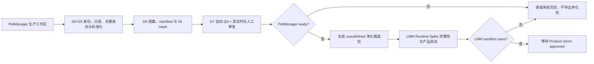

入口判断：/prd

# LetsMakeMoney 宠物包 vNext 合同

> 内部代号：`pet-return`
> 文档类型：正式推进型数据、资源与兼容合同
> 上游：`PET-FR-008`、`PET-FR-009`、`PET-FR-010`
> 当前候选 schema：外层 `package-index.json` 为 `schemaVersion: 1`，内部 `motion-manifest.json` 为 `schemaVersion: 2`
> 当前状态：可供 Quality/Runtime Spike 生成 fixture；不是正式发布格式
> 最后更新：2026-08-10

## 1. 目的与所有权

- PetManager 拥有角色生产源文件、生成记录、人工重建、QA 和净化打包。
- LMM 只消费已净化、未发布或已发布的运行时包，不复制素材生产逻辑。
- `PetManager ready` 只证明包级质量；不等于 `LMM sandbox pass` 或 `Product return approved`。
- Classic 与多多使用同一个 schema、解析器、验证器、fallback 和状态机，禁止 `pet_id` 分支。

## 2. 包分层

| 分层 | 所在仓库 | 可含内容 | 禁止进入 LMM |
| --- | --- | --- | --- |
| 生产工作区 | PetManager | 原始图、Prompt、失败尝试、分层源、蒙版、脚本、人工修复源 | 整个目录均不得复制 |
| QA 工作区 | PetManager | GIF、Contact Sheet、边界图、审查表、指标和失败历史 | 原始 QA 中间文件不得随包发布 |
| 净化候选包 | PetManager 输出 | manifest、atlas/frames、hit masks、许可与脱敏来源摘要 | 绝对路径、Prompt、API Key、个人信息 |
| LMM 运行时包 | LMM 沙盒资源目录 | 通过完整性与许可验证的净化包 | 未验证生产源、未知许可素材、失败候选 |

## 3. 目录结构

```text
<pet-package>/
  package-index.json
  motion-manifest.json
  assets/
    atlas-00.webp
    atlas-01.webp
  hitmasks/
    atlas-00.hitmask.json
    atlas-01.hitmask.json
  evidence/
    source-evidence.json
    license.json
    provenance.json
```

规则：

1. 路径必须是 UTF-8 相对路径，使用 `/`，不得包含盘符、UNC、`..`、符号链接或目录逃逸。
2. 运行时包不得包含可执行文件、脚本、workflow、Prompt、失败尝试或生成服务凭据。
3. 所有 JSON 使用 UTF-8、无 BOM、确定性键顺序；打包前进行 canonical serialization。
4. `package-index.json` 绑定 manifest 哈希；manifest 的 `sha256.files` 绑定其余全部运行时文件，避免 manifest 自哈希循环。

## 4. package-index.json

```json
{
  "schemaVersion": 1,
  "packageVersion": "0.2.0-sandbox.4",
  "petId": "letsmakemoney-classic-pro",
  "manifest": "motion-manifest.json",
  "manifestSha256": "<64 uppercase hex>",
  "packageTreeSha256": "<64 uppercase hex>",
  "status": "approved",
  "ready": true,
  "published": false
}
```

### 字段规则

| 字段 | 规则 |
| --- | --- |
| `schemaVersion` | 包索引信封当前仅接受整数 `1`；它与 motion manifest 的 schema 独立演进，未知版本拒绝加载 |
| `packageVersion` | SemVer；沙盒候选必须带 prerelease 后缀 |
| `petId` | 小写 ASCII、数字和短横线；仅作身份，不参与运行时分支 |
| `manifest` | manifest 相对路径，必须落在包根目录内；当前净化包固定为 `motion-manifest.json` |
| `manifestSha256` | manifest 文件字节 SHA256 |
| `packageTreeSha256` | 按规范化路径排序后的 `path + NUL + fileSha256` 汇总哈希 |
| `status` | 人工审查状态；进入 G8 的候选必须为 `approved` |
| `ready` | PetManager 包级门禁；进入 G8 的候选必须为 `true`，但不代表 LMM 产品通过 |
| `published` | Spike 与未公开候选必须为 `false` |

## 5. motion-manifest.json 根合同

```json
{
  "schemaVersion": 2,
  "packageVersion": "0.2.0-sandbox.1",
  "petId": "letsmakemoney-classic",
  "displayName": "Classic",
  "logicalSize": { "width": 192, "height": 208 },
  "anchor": { "x": 0.5, "y": 0.95 },
  "footBaselineY": 198,
  "visualOffset": { "x": 0, "y": 0 },
  "safeFallback": {
    "baseState": "awake_rest",
    "asset": "assets/atlas-00.webp",
    "frame": { "x": 0, "y": 0, "width": 256, "height": 256 },
    "hitMask": "hitmasks/atlas-00.hitmask.json#safe-awake-rest"
  },
  "actions": [],
  "sourceEvidence": "evidence/source-evidence.json",
  "license": "evidence/license.json",
  "provenance": "evidence/provenance.json",
  "sha256": {
    "algorithm": "SHA-256",
    "files": {}
  }
}
```

根级 `logicalSize`、`anchor`、`footBaselineY` 和 `visualOffset` 是默认值；动作可覆盖，但覆盖必须在 QA 中说明理由并通过状态边界检查。

## 6. Action 定义

```json
{
  "id": "working_ack",
  "sourceState": "working",
  "targetState": "working",
  "semanticRole": "ack",
  "playbackKind": "oneshot",
  "variantGroup": "working_ack",
  "weight": 1,
  "cooldownMs": 600,
  "maxConsecutive": 1,
  "maxRuntimeMs": 1500,
  "safeExitFrames": [7],
  "mirrorSafe": true,
  "directionVariants": {},
  "anchor": { "x": 0.5, "y": 0.95 },
  "footBaselineY": 198,
  "logicalSize": { "width": 192, "height": 208 },
  "visualOffset": { "x": 0, "y": 0 },
  "fallback": "working_play_loop_a",
  "frames": []
}
```

### 6.1 必需字段

| 字段 | 约束 |
| --- | --- |
| `id` | 包内唯一；使用 PRD 动作目录中的稳定标识 |
| `sourceState` | `working` / `awake_rest` / `sleeping` / `dragging` 或兼容数组 |
| `targetState` | 同上；拖拽停止可使用 `latest_base_state` |
| `semanticRole` | `base_loop` / `ambient` / `ack` / `business` / `drag_transition` / `drag_loop` |
| `playbackKind` | `loop` / `oneshot`；禁止从动作名推断 |
| `variantGroup` | 同组参与权重、冷却和连续次数约束 |
| `weight` | 正有限数；同组只比较相对权重 |
| `cooldownMs` | 非负整数；从完成或中断时起算 |
| `maxConsecutive` | 正整数；首轮 ambient 和 ack 默认候选为 1 |
| `frames[].durationMs` | 正整数；每帧显式提供，不允许全局 FPS 替代 |
| `safeExitFrames` | 去重、升序、合法索引；oneshot 至少包含末帧 |
| `maxRuntimeMs` | 大于名义总时长并有有限上界，用于超时保护 |
| `anchor` | 归一化坐标，x/y 范围 0-1 |
| `footBaselineY` | 逻辑画布内整数像素 |
| `logicalSize` | 正整数宽高；运行时显示合同，不等于图集格尺寸 |
| `visualOffset` | 逻辑像素偏移，状态边界必须验证 |
| `mirrorSafe` | 布尔值；不得缺省为 true |
| `directionVariants` | 不可安全镜像时提供 `left` / `right` 动作引用 |
| `fallback` | 包内 action ID、包级安全帧或 `hide_sandbox` |

### 6.2 Frame 定义

```json
{
  "frameId": "working_ack-000",
  "asset": "assets/atlas-00.webp",
  "rect": { "x": 0, "y": 512, "width": 256, "height": 256 },
  "durationMs": 100,
  "hitMask": "hitmasks/atlas-00.hitmask.json#working_ack-000",
  "sha256": "<可选的独立帧像素摘要>"
}
```

- `rect` 不得越过图集边界或与错误槽位重叠。
- `durationMs` 候选范围 33-1000ms；超出时必须由人工审查说明，不得静默截断。
- 透明空帧必须显式声明为过渡意图，否则 validator 拒绝。
- `hitMask` 对所有可互动帧必需；纯安全静态帧也必须有 mask。

## 7. hitMask 合同

首选格式为 `alpha-rle-v1`，由 PetManager 基于最终标准化 RGBA 帧确定性生成，而不是 LMM 运行时猜测。

```json
{
  "format": "alpha-rle-v1",
  "logicalWidth": 192,
  "logicalHeight": 208,
  "alphaThreshold": 24,
  "masks": {
    "working_ack-000": {
      "runs": [[1200, 18], [1390, 26]],
      "sha256": "<mask payload hash>"
    }
  }
}
```

规则：

1. `runs` 采用行优先一维索引，区间不得重叠、越界或无序。
2. `alphaThreshold` 为包级确定值；不得由用户环境动态改变。
3. 镜像帧的 mask 由运行时按逻辑画布镜像；仅 `mirrorSafe=true` 时允许。
4. mask 尺寸必须与 `logicalSize` 一致；DPI 缩放由 Windows 原生桥处理。
5. mask 缺失、损坏或哈希不符时不得退化为永久完整矩形命中。
6. Runtime Spike 可比较位图、RLE 和原生区域性能；若更换格式，必须升级 schema 小版本并回写本合同。

## 8. 方向合同

| 条件 | 运行时行为 |
| --- | --- |
| `mirrorSafe=true` | 允许用同一动作与 hit mask 水平镜像 |
| `mirrorSafe=false` 且提供左右变体 | 按方向选择声明的 action ID |
| `mirrorSafe=false` 且缺方向变体 | 保持默认朝向，不伪造镜像；拖拽质量门禁不通过 |

运行时不得因 `petId`、角色毛色或动作名称自行决定镜像安全性。

## 9. fallback 图

验证器构建有向图并检查：

- 所有引用存在。
- 不存在环。
- source/target state 兼容。
- 路径最终到达可用基础循环、安全静态帧或 `hide_sandbox`。
- 遍历次数以动作总数为上限；超过即视为环或损坏。

规范回退顺序：

```text
请求动作
  -> action.fallback
  -> 当前 BaseState 首选基础循环
  -> 当前 BaseState 安全静态帧
  -> package.safeFallback
  -> hide_sandbox
```

## 10. 来源、许可与 provenance

### 10.1 source-evidence.json

仅保留脱敏摘要：

```json
{
  "identityBoardId": "classic-identity-v3",
  "identityBoardSha256": "...",
  "approvedSourceActions": ["classic-s4.3"],
  "manualReviewIds": ["S4.3", "pet-return-gold-r1"],
  "sourceFiles": [
    { "role": "identity_reference", "sha256": "..." }
  ]
}
```

不得包含本机绝对路径、用户名、照片 EXIF、Prompt 全文或失败候选图片。

### 10.2 license.json

必须声明：

- `licenseId` 或项目所有者自有声明。
- 角色身份、基础图、生成输出和人工重建各自权利来源。
- 是否允许 GitHub 仓库、Release 和商业软件再分发。
- 第三方模型/API 的披露与再分发限制。
- 审批人、审批日期、证据摘要哈希。

许可字段缺失、含糊或不允许再分发时，LMM 拒绝加载。

### 10.3 provenance.json

```json
{
  "productionMethods": ["layered-keyframes", "manual-reconstruction"],
  "aiAssisted": true,
  "aiUsage": "motion-reference-only",
  "provider": "<confirmed provider or null>",
  "model": "<confirmed model id or null>",
  "humanReconstruction": true,
  "reviewStatus": "approved",
  "reviewEvidenceSha256": "..."
}
```

`PET-DEC-004` 决定公开披露形式；无论公开决策如何，内部运行时包都必须保留真实来源摘要。

## 11. 完整性验证顺序

1. 拒绝超出包根目录的路径和符号链接。
2. 校验 `package-index.json` schema。
3. 校验 manifest 字节哈希。
4. 校验 manifest schema，未知字段按 strict schema 拒绝。
5. 校验 `sha256.files` 与所有资产、mask、证据文件。
6. 校验 `packageTreeSha256`。
7. 校验图集格式、尺寸、透明通道和槽位。
8. 校验 frame、duration、safe exit、fallback、direction 和 hit mask。
9. 校验许可与 provenance。
10. 只在全部通过后建立不可变运行时索引。

验证失败不得部分加载“看起来还能用”的动作。

## 12. schema 升级与兼容

### 12.1 包索引 v1 与动作 manifest v2

- 外层包索引当前固定为 v1，负责包身份、manifest 路径、审核状态和树哈希；内部动作 manifest 固定为 v2，负责动作、逐帧时长、命中与来源合同。两者的 `schemaVersion` 不得混为同一版本号。
- Classic S4.3 和多多 S5.5 属于旧合同证据，不是 motion manifest v2 正式包。
- Runtime Spike 可使用只存在于测试目录的 v1 adapter，把旧包映射为最小 fixture；adapter 不得进入生产加载路径。
- 旧包缺少 `run_loop`、逐帧命中或许可字段时必须显示缺口，不得生成虚假默认值冒充 v2 ready。

### 12.2 manifest v2 小版本

- 新增 manifest 可选字段可提升 `packageVersion`，保持 motion manifest `schemaVersion: 2`；不得因此擅自提升包索引 schema。
- 修改字段语义、必需性、命中格式或哈希算法必须提升 schema 大版本。
- 解析器只接受明确支持的 schema；未知版本记录错误并回退到已验证旧包或关闭沙盒。

### 12.3 回滚

- LMM 保存最近一份通过验证的包身份和哈希，不保存生产工作区。
- 新包失败时不污染旧包索引，继续使用最近有效包。
- 无有效包时隐藏桌宠，主应用保持零宠物行为。
- 回滚只切换已验证包版本，不修改用户收入配置或 Dashboard 数据。

## 13. 净化发布流程



## 14. PetManager 验证责任

| 门禁 | 自动验证 | 人工验证 |
| --- | --- | --- |
| 身份 | identity hash、画布、关键点 | 五官、耳尾、体态与角色辨识 |
| 几何 | 脚底线 <=2px；基础循环相邻头部 <=2%；oneshot <=4%；整体尺寸 <=5% | 肉眼无比例跳变和漂移 |
| 透明 | 色键残留 0、空帧/污染 0、alpha 合法 | 轮廓无明显白黑毛边 |
| 节奏 | duration 总和、循环边界数值 | 真实时长 GIF 自然、无空等/截断 |
| 语义 | source/target/role 完整 | 动作符合工作、休息、睡眠和拖拽语义 |
| 包 | schema、哈希、路径、许可、fallback | 审查材料与最终包身份一致 |

## 15. LMM 运行时责任

- 只读解析，不修改包内容。
- 在内存中建立 immutable action index。
- 按逐帧 duration 播放并同步 hit mask。
- 只按字段调度，不读取 Prompt、QA 或生产元数据做业务分支。
- 记录包身份、manifest 哈希、fallback 和拒绝原因。
- 包错误只影响桌宠沙盒，不修改收入配置、不弹出阻塞主线的强制窗口。

## 16. 测试矩阵

| fixture | 预期 |
| --- | --- |
| 合法 Classic v2 | 全部通过，建立索引 |
| 合法多多 v2 | 使用同一解析器通过 |
| manifest 哈希不符 | 整包拒绝，保留旧有效包 |
| 图集缺失/尺寸错误 | 整包拒绝 |
| 动作缺失 | 请求时按声明 fallback；P0 动作缺失则包不具备 gold ready |
| fallback 成环 | schema/语义验证失败 |
| hit mask 缺失或越界 | 不允许矩形命中；整包或该 P0 动作拒绝 |
| `mirrorSafe=false` 无方向变体 | 不擅自镜像，拖拽门禁失败 |
| license/provenance 缺失 | 整包拒绝 |
| 绝对路径/`..`/symlink | 安全拒绝并记录 |
| 未知 schema | 不迁移用户数据，回退旧有效包或隐藏 |
| petId 更换 | 行为逻辑不变，仅身份/素材变化 |

## 17. 无数据库影响

本合同不新增数据库。包身份、用户选择和 feature flag 未来如进入正式产品，只能作为版本化本地配置字段；生产源、QA 与 Prompt 不进入用户配置。

## 18. 继续、停止与回写

### 继续条件

- schema、哈希、路径、fallback、hit mask、许可和 provenance fixture 全部通过。
- Classic 与多多能由同一解析器加载，不出现角色特判。
- Runtime Spike 能消费 unpublished 候选包且故障不影响主线。

### 停止条件

- 必须把生产工作区整体复制进 LMM 才能运行。
- 需要按 `petId` 修正锚点、动作名、方向或 fallback。
- 动态命中只能依赖完整矩形窗口。
- 许可或 AI 来源无法明确。

### 回写位置

- schema 变化回写本文件和 `pet-return-traceability.md`。
- 黄金样片冻结值回写本文件 Action/Profile fixture 与 `pet-return-prd.md` 动作矩阵。
- 实际运行时适配结论回写 `pet-return-runtime-spike.md`，不得直接改成正式产品合同。
