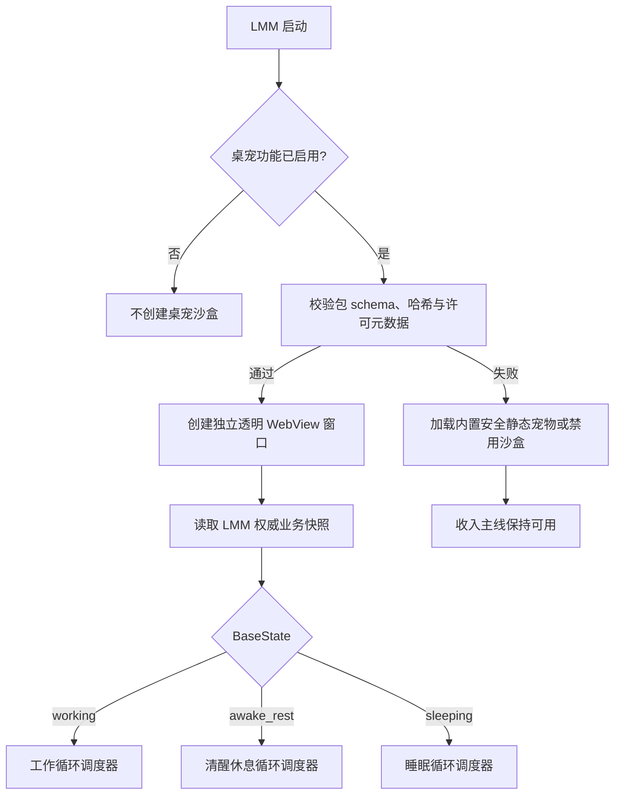
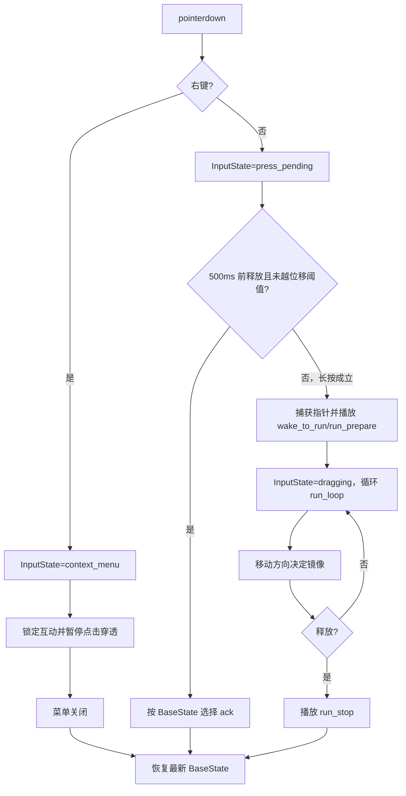
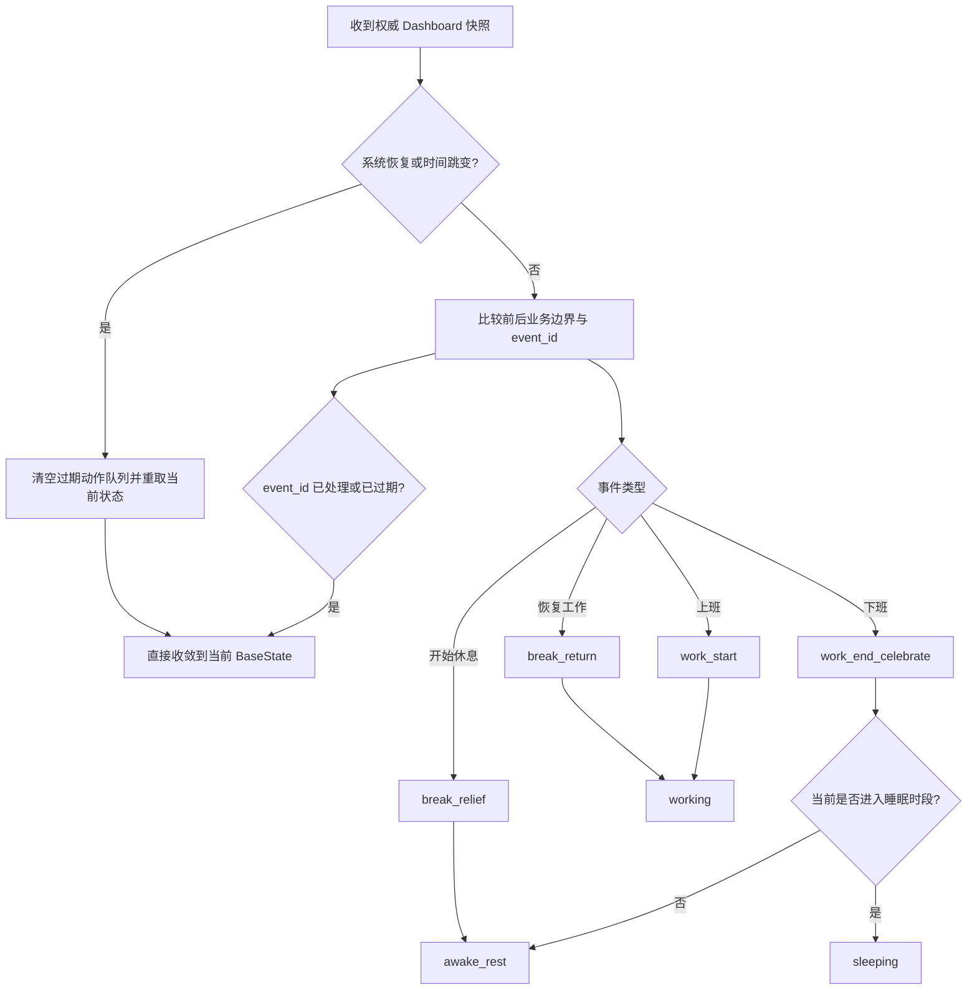
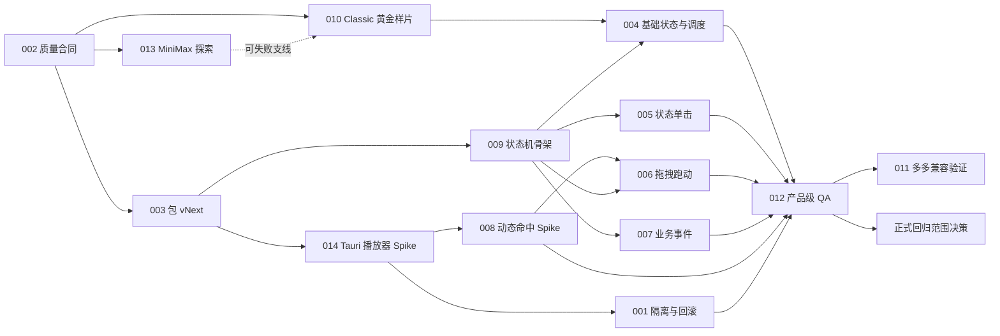

入口判断：/idea

# LetsMakeMoney 桌宠回归专项需求池

> 内部代号：`pet-return`
> 形成日期：2026-08-10
> 产品仓库：`E:\codex\LetsMakeMoney`
> 素材与 QA 仓库：`E:\codex\PetManager`
> 动作探索环境：`D:\Work\Software\ComfyUIaaaki\ComfyUI-aki-v3`
> 当前结论：桌宠回归方向成立，但**尚不具备直接进入正式产品开发的条件**。可以并行进入 `/prd` 的合同澄清和 P0 技术/质量 Spike；在质量样片、透明窗口、输入仲裁和长期观看门禁全部通过前，桌宠只能存在于独立开发沙盒。

## PRD 追踪状态

- 当前阶段：`/prd` 合同已形成，等待项目所有者确认；两条 Spike 均未授权、未执行。
- 产品状态：v1 正式产品继续保持零宠物主线；本专项不是用户可见功能开发。
- PRD：[桌宠回归沙盒 PRD](pet-return-prd.md)
- 状态机：[桌宠运行时状态机合同](pet-runtime-state-machine.md)
- 包合同：[宠物包 vNext 合同](pet-package-vnext-contract.md)
- Spike：[Runtime](pet-return-runtime-spike.md) / [Quality](pet-return-quality-spike.md)
- 追踪：[桌宠回归专项追踪矩阵](pet-return-traceability.md)
- 阻塞：`PET-DEC-001` 至 `PET-DEC-005` 尚未确认，不能冻结公开范围；这不阻塞不依赖相关决策的 Spike 合同评审。

## Idea 阶段判断

桌宠不是一个“把旧素材接回去”的小功能，而是一条由素材生产、动作语义、播放器、输入仲裁、透明窗口、业务事件和长期观感共同决定的产品链路。历史下线原因已经有重复、跨项目的证据：

1. 旧 Godot 运行时采用固定 `1.55s` 恢复，短动作产生空等，长动作被截断。
2. 单击、双击、长按、拖拽和右键菜单之间缺少稳定仲裁，交互动作与基础状态语义脱节。
3. Classic S4.3 与多多 S5.5 虽已通过 PetManager 的包级门禁，但现有动作集合缺少 `run_loop`、多基础循环、低重复调度和完整产品编排证据。
4. Classic 工作与休息转换仍明显依赖电脑道具；后续产品决定进一步收敛为“用户工作时安静陪伴”，不要求小猫表演工作或持续高幅玩耍。
5. 多多 S5.5 的语义与画面自然度优于 Classic，但“单个 GIF 好看”尚不能证明透明桌面窗口中连续观看 30 分钟仍自然。
6. 当前 v1 正式产品已主动移除宠物能力，代码与验证器仍包含零宠物合同。任何回归都必须可关闭、可卸载、可回滚，且不能污染收入主线。

因此，本阶段的正确目标不是“上线桌宠”，而是证明以下四件事：

- **素材质量可持续**：不是偶然生成一条好 GIF，而是动作、变体和状态边界可以稳定生产。
- **编排质量可持续**：动作不会机械重复，不会在错误状态触发，不会补播过期事件。
- **交互质量可持续**：单击、长按拖拽、右键菜单、透明命中和窗口边缘行为可靠。
- **工程隔离可持续**：桌宠沙盒崩溃、资源损坏或被关闭时，收入、日历、Settings、托盘和更新链路不受影响。

**阶段结论：小范围推进。** 允许先做动作合同、Classic 黄金样片和 Tauri 透明 WebView 沙盒 Spike；完整桌宠回归只有在 P0 门禁通过后才能进入正式 PRD 范围冻结。

## 上游证据摘要

### 证据地图

| 证据 | 已确认事实 | 对本阶段的约束 |
| --- | --- | --- |
| `doc/architecture/animation-rearchitecture-options.md` | 方案 B 得分与隔离性最优；旧运行时同时存在固定时长、动态命中缺失和职责混杂 | 不恢复 Godot；采用独立 Tauri 透明 WebView 沙盒 |
| `doc/releases/v0.8/pet-animation-next-version-review.md` | 单击/双击动作与基础状态关系弱，固定恢复时间造成截断或空等 | 取消双击；按真实完成事件恢复 |
| `doc/releases/v0.9/petmanager-animation-review.md` | PetManager 可生产包，但 LMM 运行时合同缺少中断、状态感知和动态命中 | 包级 ready 不能代替产品级通过 |
| `doc/releases/v0.9/pet-package-contract-gap.md` | 缺少安全退出帧、变体、权重、冷却、连续重复限制和命中蒙版 | 必须升级运行时包 schema，禁止 `pet_id` 特判 |
| `doc/releases/v1.0/pet-retirement-audit.md` | v1 已安全下线桌宠，正式产品按无宠物运行 | 回归必须 feature-gated、可卸载、可回滚 |
| PetManager `hatch-pet-pro-custom-actions-design.md` | 已有 Profile、逐帧时长、图集、锚点、脚底线和独立视觉审查管线 | 继续复用生产与 QA，不在 LMM 中复制生成逻辑 |
| PetManager `custom-action-contract.md` | 分层证据要求完整角色层、独立道具层和可选头部蒙版，禁止颜色反推分层 | 新动作必须从源头提供分层证据 |
| PetManager `motion-quality-roadmap.md` | 已确认道具影响角色缩放、跨动作边界漂移、内部色键残留和“测试通过但观感差” | 质量门禁必须同时覆盖帧、动作边界和真实时长播放 |
| Classic S4.3 | 8 个动作、逐帧时长、统一 192×208 逻辑尺寸，approved/ready 但 unpublished | 可作旧合同基线，不可直接作为回归素材 |
| 多多 S5.5 | 8 个动作、玩耍语义更自然、分层午休动作已修复，approved/ready 但 unpublished | 用于通用合同兼容验证，不先于 Classic 黄金样片进入 LMM |
| 本机 ComfyUI `nodes_minimax.py` | MiniMax 节点通过 Comfy.org API，模型标识为 `MiniMax-Hailuo-02`，支持 6/10 秒与 768P/1080P 组合 | 它不是本地离线模型，只能作为有成本、有许可门禁的动作探索工具 |
| v1 当前源码与验证器 | 正式生产代码无宠物运行时；迁移会移除旧宠物字段；M1-M6 验证包含 no-pet 断言 | 沙盒实验不得直接混入 current gate，正式回归时必须显式重写零宠物合同 |

### 已确认、推断与待证

| 类型 | 结论 |
| --- | --- |
| 已确认 | 旧桌宠的粗糙感不是单一素材问题，播放器、输入和状态编排同样有缺陷。 |
| 已确认 | Classic S4.3 与多多 S5.5 均缺少真正的 `run_loop`，现有拖拽动作链不完整。 |
| 已确认 | 两套包只有一个 `working_loop`，无法证明长期低重复观看。 |
| 已确认 | PetManager 的技术审查状态为 ready/approved，并不表示已 published 或已通过 LMM 产品验收。 |
| 高度可能 | 多多的玩耍语义比 Classic 电脑语义更符合本轮方向，但需在统一沙盒与相同调度策略下做盲测。 |
| 待确认 | Tauri 透明 WebView 能否在 Windows 11 的 DPI、透明像素命中、点击穿透和拖拽中同时达到稳定体验。 |
| 待确认 | MiniMax/Hailuo 是否能显著改善运动弧与姿态过渡，并保持角色身份和尺度。 |
| 待确认 | 30 分钟低重复调度能否让桌宠自然存在，而不重新变成高频视觉干扰。 |

## 产品目标与非目标

### 产品目标

- 让桌宠成为收入工具的低干扰情绪反馈层，而不是主业务窗口的装饰插件。
- 让每个基础状态具有清楚、不同、可长期观看的动作语义。
- 让单击和拖拽反馈与当前状态相关，且操作结果稳定可预期。
- 让业务节点只在正确时机播放一次，休眠恢复或系统时间跳变不补播过期动作。
- 让素材生产、运行时消费和产品 QA 形成可复用合同，Classic 与多多不需要角色专用代码。

### 非目标

- 本阶段不恢复用户可见桌宠入口。
- 不制作宠物市场、在线下载、创作者平台或主题扩展。
- 不让 AI 视频直接成为产品素材。
- 不恢复双击动作，不将所有交互映射为庆祝。
- 不恢复 Godot 桌宠运行时，不重写 LMM 收入主线。
- 不为 Classic 和多多分别维护两套播放器或状态机。

## 候选需求总览

> 评分顺序：用户痛点、场景清晰、证据强度、频率/紧迫性、核心目标、差异化、成本可控、验证速度；满分 40。成本可控性低于 3 分时，即使总分较高也必须先拆 Spike。

| ID | 标题 | 分数 | 分档与证据闸门 | 优先级 | 推荐去向 |
| --- | --- | ---: | --- | --- | --- |
| PET-IDEA-001 | 可卸载桌宠沙盒与回滚边界 | 34 | 通过 | P0 | 进入 PRD + 技术 Spike |
| PET-IDEA-002 | 动画质量基准与角色一致性合同 | 38 | 通过 | P0 | 进入 PRD |
| PET-IDEA-003 | 宠物包 vNext 运行时合同 | 35 | 通过 | P0 | 进入 PRD |
| PET-IDEA-004 | 三基础状态与低重复调度器 | 34 | 通过 | P1 | P0 通过后进入 PRD |
| PET-IDEA-005 | 状态感知单击反馈 | 33 | 通过 | P1 | 进入 PRD |
| PET-IDEA-006 | 长按拖拽跑动全链路 | 32 | 成本 2，触发拆分门禁 | P1 | 技术 Spike 后进入 PRD |
| PET-IDEA-007 | 业务事件动作与去重 | 28 | 部分通过 | P1 | 小范围 PRD |
| PET-IDEA-008 | 动态透明命中与点击穿透 | 32 | 成本 2，触发拆分门禁 | P0 | 技术 Spike |
| PET-IDEA-009 | 事件驱动动画编排状态机 | 35 | 成本 2，触发拆分门禁 | P0 | 分阶段 PRD + Spike |
| PET-IDEA-010 | Classic 黄金质量样片 | 34 | 成本 2，限一只一组动作 | P0 | 立即做质量 Spike |
| PET-IDEA-011 | 多多通用合同兼容验证 | 28 | 部分通过 | P2 | Classic 通过后验证 |
| PET-IDEA-012 | 产品级视觉与稳定性门禁 | 35 | 通过 | P0 | 进入 PRD |
| PET-IDEA-013 | ComfyUI + MiniMax 动作探索 | 23 | 证据 2，最高继续验证 | P2 | 有界 Spike |
| PET-IDEA-014 | Tauri 透明 WebView 播放器 Spike | 33 | 通过 | P0 | 立即技术 Spike |
| PET-IDEA-015 | 指针注视与方向跟随 | 18 | 证据 2，最高继续验证 | P2 | 后置验证 |
| PET-IDEA-016 | 多宠物平台、下载与市场 | 10 | 未通过 | 不排期 | 暂不处理 |

## 候选需求详单

### PET-IDEA-001 可卸载桌宠沙盒与回滚边界

| 字段 | 内容 |
| --- | --- |
| 问题 | 桌宠曾被完整下线；若直接重新混入主窗口和配置事务，资源、窗口或动画故障会重新威胁收入主线。 |
| 证据 | v1 迁移与 M1-M6 验证明确删除/禁止宠物能力；历史 Godot 运行时职责耦合。 |
| 证据状态 | 已确认，证据强度 4/5。 |
| 用户价值 | 用户可以完全关闭桌宠；沙盒故障时收入、日历、设置、托盘和更新仍可用。 |
| 动作范围 | 不定义具体动作，只定义播放器启停、资源卸载、状态恢复和回滚。 |
| 运行时影响 | 新增独立透明窗口、独立资源目录、feature flag、进程内故障隔离和窗口生命周期。 |
| PetManager 影响 | 仅交付净化包，不参与 LMM 运行时。 |
| 依赖 | PET-IDEA-003、014。 |
| 风险 | Tauri 同进程 WebView 仍可能共享部分故障面；需要定义“窗口故障”和“应用故障”的真实边界。 |
| 成本 | 中；成本可控性 3/5。 |
| 测试缺口 | 尚无透明沙盒崩溃、包损坏、窗口关闭与主链路共存证据。 |
| 停止条件 | 沙盒关闭或资源损坏仍能阻塞主窗口启动、配置保存或托盘找回。 |
| 推荐去向 | 进入 `/prd`，同时以最小空播放器做技术 Spike。 |

### PET-IDEA-002 动画质量基准与角色一致性合同

| 字段 | 内容 |
| --- | --- |
| 问题 | 历史门禁证明“文件完整”，却不能阻止粗糙轮廓、比例跳变、姿态突变和机械节奏。 |
| 证据 | Classic/多多多轮修复记录、`motion-quality-roadmap.md`、用户多次否决动画观感。 |
| 证据状态 | 已确认，证据强度 5/5。 |
| 用户价值 | 直接解决桌宠被下线的首要原因。 |
| 动作范围 | 覆盖所有基础循环、一次性动作、状态边界和拖拽链。 |
| 运行时影响 | 播放器需读取逐帧时长、锚点、脚底线和安全退出帧。 |
| PetManager 影响 | 新增角色身份板、轮廓/头部/身体尺度度量、动作边界对照和真实时长审查。 |
| 依赖 | 无，所有动作候选的前置。 |
| 风险 | 主观审美无法完全自动化；必须保留项目所有者视觉门禁。 |
| 成本 | 中；成本可控性 4/5。 |
| 测试缺口 | 现有审查未覆盖统一沙盒的 30 分钟编排观感。 |
| 停止条件 | 单动作技术指标通过但真实时长观看仍显得僵硬、身份漂移或状态边界突兀。 |
| 推荐去向 | 进入 `/prd`，作为任何素材生产的 P0 前置合同。 |

### PET-IDEA-003 宠物包 vNext 运行时合同

| 字段 | 内容 |
| --- | --- |
| 问题 | schema v1 有帧、时长、锚点和 fallback，但缺少变体、权重、冷却、最大连续次数、安全退出、命中蒙版和来源/目标状态。 |
| 证据 | 两份现有 manifest 与 package gap 均可复核。 |
| 证据状态 | 已确认，证据强度 5/5。 |
| 用户价值 | 避免播放器按角色写特判，让新动作和新角色可预测接入。 |
| 动作范围 | 全动作元数据与运行时资源。 |
| 运行时影响 | manifest 解析、schema 验证、哈希、fallback 图、包禁用和默认安全包。 |
| PetManager 影响 | 编译器、schema、QA、净化发布器同步升级。 |
| 依赖 | PET-IDEA-002。 |
| 风险 | 一次定义过多字段会拖慢样片；应先冻结最小 vNext，再允许可选扩展。 |
| 成本 | 中；成本可控性 3/5。 |
| 测试缺口 | 尚无 Classic 与多多对同一 vNext schema 的双包验证。 |
| 停止条件 | 必须通过 `pet_id` 分支才能正确播放或回退。 |
| 推荐去向 | 进入 `/prd`；先用 Classic 编译，再用多多验证通用性。 |

### PET-IDEA-004 三基础状态与低重复调度器

| 字段 | 内容 |
| --- | --- |
| 问题 | 现有包只有一个 `working_loop`，awake_rest/sleeping 依赖旧 fixed-pro fallback，长期观看必然高重复。 |
| 证据 | S4.3 与 S5.5 manifest；用户明确指出 idle 低频、rest 高频和动作机械。 |
| 证据状态 | 已确认，证据强度 4/5。 |
| 用户价值 | 桌宠在工作、清醒休息和睡眠时呈现不同节奏，降低视觉疲劳。 |
| 动作范围 | `working` 至少 2 个基础循环；`awake_rest` 与 `sleeping` 各 1 个基础循环和至少 2 个低频环境动作。 |
| 运行时影响 | 权重、冷却、最大连续次数、随机种子和可复现诊断。 |
| PetManager 影响 | 支持同一语义多个 variant 及变体 QA。 |
| 依赖 | PET-IDEA-002、003、009、010。 |
| 风险 | 动作越多越容易身份和尺度漂移；数量不能先于质量。 |
| 成本 | 中；成本可控性 3/5。 |
| 测试缺口 | 尚无 30 分钟动作频次、连续重复率和干扰感记录。 |
| 停止条件 | 增加动作后身份一致性下降，或 30 分钟内仍明显出现同一动作扎堆。 |
| 推荐去向 | P0 样片和状态机通过后进入 `/prd`。 |

### PET-IDEA-005 状态感知单击反馈

| 字段 | 内容 |
| --- | --- |
| 问题 | 旧方案单击/双击大量复用庆祝动作，与当前基础状态无关。 |
| 证据 | 历史原型反馈和现有 `working_ack/rest_ack/sleep_ack` 动作语义。 |
| 证据状态 | 已确认，证据强度 4/5。 |
| 用户价值 | 用户点击时得到符合工作、休息或睡眠状态的自然回应。 |
| 动作范围 | 仅单击：`working_ack`、`rest_ack`、`sleep_ack`；双击明确取消。 |
| 运行时影响 | 点击延迟不再等待双击窗口；按 BaseState 查动作并回到原状态。 |
| PetManager 影响 | 三类 ack 必须有不同姿态和情绪，不得换名复用同一序列。 |
| 依赖 | PET-IDEA-003、009。 |
| 风险 | sleeping ack 过强会破坏睡眠氛围；working ack 过频会干扰基础动作。 |
| 成本 | 小；成本可控性 4/5。 |
| 测试缺口 | 每状态连续点击 10 次的完整播放、中断和恢复证据。 |
| 停止条件 | 状态反馈肉眼不可区分，或点击仍与拖拽/右键误判。 |
| 推荐去向 | 进入 `/prd`。 |

### PET-IDEA-006 长按拖拽跑动全链路

| 字段 | 内容 |
| --- | --- |
| 问题 | 现有包只有 `run_prepare` 和 `run_stop`，没有移动期间持续播放的 `run_loop`；旧输入逻辑容易把拖拽误判为点击。 |
| 证据 | 两份 manifest 与历史用户反馈。 |
| 证据状态 | 已确认，证据强度 4/5。 |
| 用户价值 | 长按拖动表现为朝移动方向跑动，形成连贯、可理解的桌宠交互。 |
| 动作范围 | sleeping 可选 `wake_to_run`；必需 `run_prepare`、`run_loop`、`run_stop`。左右方向优先使用安全镜像，不重复生成两套动作。 |
| 运行时影响 | 500ms 长按、位移阈值、方向更新、指针捕获、释放收势、窗口位置与 DPI。 |
| PetManager 影响 | 新增真正可循环的跑动动作、镜像安全字段和停止衔接预览。 |
| 依赖 | PET-IDEA-003、008、009、010、014。 |
| 风险 | 成本可控性 2/5；透明窗口移动、指针捕获和帧动画组合风险高。 |
| 成本 | 大。 |
| 测试缺口 | 尚无 Tauri 沙盒的长按、方向拖动、窗口边缘和释放证据。 |
| 停止条件 | 500ms 后仍不能稳定进入 prepare，拖拽误触单击，或 run_loop 与窗口位移明显打滑。 |
| 推荐去向 | 先做输入与占位动画 Spike，通过后再进完整 PRD。 |

### PET-IDEA-007 业务事件动作与去重

| 字段 | 内容 |
| --- | --- |
| 问题 | 业务事件若直接监听每次 Dashboard 刷新，会重复播放；睡眠恢复和系统时间跳变还可能补播已过期事件。 |
| 证据 | v1 的秒级/权威同步机制与历史桌宠事件设计；尚无新沙盒实测。 |
| 证据状态 | 高度可能，证据强度 3/5。 |
| 用户价值 | 上班、休息、复工和下班只在正确边界出现一次，不突然庆祝旧事件。 |
| 动作范围 | `work_start`、`break_relief`、`break_return`、`work_end_celebrate`。庆祝只保留下班事件。 |
| 运行时影响 | 业务事件 ID、owner date、有效窗口、去重持久化、队列和过期丢弃。 |
| PetManager 影响 | 增加事件动作的 source/target state 和安全结束姿态。 |
| 依赖 | PET-IDEA-003、009。 |
| 风险 | 边界定义错误会影响跨夜班次；不应复算业务规则，只消费主应用快照。 |
| 成本 | 中；成本可控性 3/5。 |
| 测试缺口 | 睡眠跨边界、系统时间前后跳和重复快照的去重证据。 |
| 停止条件 | 同一业务边界播放两次，或恢复后播放已经失效的动作。 |
| 推荐去向 | 小范围进入 `/prd`，不阻塞最小播放器样片。 |

### PET-IDEA-008 动态透明命中与点击穿透

| 字段 | 内容 |
| --- | --- |
| 问题 | 旧运行时按纹理静态扫描并缓存命中区，动作伸展后区域不同步，透明区域可能吞点击。 |
| 证据 | v0.8/v0.9 Review 与旧实现。 |
| 证据状态 | 已确认，证据强度 4/5。 |
| 用户价值 | 可见猫咪能点、透明区域能穿透，菜单和模态期间仍可操作。 |
| 动作范围 | 所有帧和所有窗口交互状态。 |
| 运行时影响 | 帧级命中蒙版、低频轮廓更新、点击穿透暂停/恢复、DPI 变换。 |
| PetManager 影响 | 运行时包需提供逐帧压缩 hit mask 或可确定生成的 alpha 证据。 |
| 依赖 | PET-IDEA-003、014。 |
| 风险 | 成本可控性 2/5；逐帧原生窗口区域更新可能造成性能或抖动。 |
| 成本 | 大。 |
| 测试缺口 | WebView 透明像素是否能满足 Windows 原生命中要求尚未证明。 |
| 停止条件 | 必须把整个矩形窗口设为可点击，或命中更新造成明显 CPU/输入抖动。 |
| 推荐去向 | P0 技术 Spike；必要时将 WebView 仅用于渲染、命中交给小型原生桥。 |

### PET-IDEA-009 事件驱动动画编排状态机

| 字段 | 内容 |
| --- | --- |
| 问题 | 旧实现混合基础状态、交互动作、拖拽、窗口和计时器，固定恢复时间破坏真实动作时长。 |
| 证据 | 旧 `pet.gd` Review、1.55 秒恢复事实、包内逐帧时长。 |
| 证据状态 | 已确认，证据强度 5/5。 |
| 用户价值 | 动作完整播放、按规则打断、结束后回到正确状态，异常也不会卡死。 |
| 动作范围 | 全部基础、交互、拖拽、业务和环境动作。 |
| 运行时影响 | 分离 BaseState、ActionLayer、InputState、WindowState；监听真实完成事件并保留超时保险。 |
| PetManager 影响 | manifest 提供 interruptPolicy、safeExitFrame、source/target、fallback。 |
| 依赖 | PET-IDEA-003、014。 |
| 风险 | 成本可控性 2/5；状态组合多，若一次实现全部容易重演旧耦合。 |
| 成本 | 大。 |
| 测试缺口 | 晚到完成事件、动作超时、快速状态切换和资源损坏的组合测试。 |
| 停止条件 | 需要固定全局时长恢复，或无法从任意异常状态确定性回到 BaseState。 |
| 推荐去向 | 分阶段 PRD：先基础循环/单击，再拖拽/业务事件。 |

### PET-IDEA-010 Classic 黄金质量样片

| 字段 | 内容 |
| --- | --- |
| 问题 | 没有一个在产品目标、动作自然度和运行时编排上都通过的新基准。 |
| 证据 | Classic S4.3 技术合格但电脑语义和粗糙观感未满足当前方向。 |
| 证据状态 | 已确认，证据强度 4/5。 |
| 用户价值 | 用最小素材投入验证“这次动画真的能变好”，避免先造完整系统再发现观感仍差。 |
| 动作范围 | 第一片：`working_play_loop_a` + `working_ack` + `run_prepare/run_loop/run_stop`，禁止电脑道具。第二片仅在第一片通过后增加 rest/sleep。 |
| 运行时影响 | 使用 PET-IDEA-014 最小播放器展示逐帧时长和真实状态恢复。 |
| PetManager 影响 | 按 vNext Profile 生产、标准化、QA 和净化包。 |
| 依赖 | PET-IDEA-002、003。 |
| 风险 | 成本可控性 2/5；生成轮次容易无限扩张。 |
| 成本 | 大，但已通过严格切片控制。 |
| 测试缺口 | 尚无新方向样片。 |
| 停止条件 | 三轮定向生产后仍无法同时满足身份、轮廓、尺度、语义和循环接缝；停止 AI 路线并转绑定/手工关键帧。 |
| 推荐去向 | 立即执行质量 Spike，是桌宠回归的第一道门。 |

### PET-IDEA-011 多多通用合同兼容验证

| 字段 | 内容 |
| --- | --- |
| 问题 | 仅用 Classic 可能掩盖角色专用假设；多多现有动作更自然，但不能因此先做多宠物产品。 |
| 证据 | 多多 S5.5 包与此前分层修复记录。 |
| 证据状态 | 已确认，证据强度 3/5。 |
| 用户价值 | 证明 vNext 包与播放器可跨角色复用。 |
| 动作范围 | 先复用已有多多技术包验证解析；Classic 质量合同稳定后再补等价最小动作。 |
| 运行时影响 | 禁止 `pet_id == duoduo` 分支。 |
| PetManager 影响 | 同一 schema、编译器、QA 和净化发布器。 |
| 依赖 | PET-IDEA-003、009、010、014。 |
| 风险 | 过早补齐多多动作会把质量 Spike 扩成多角色生产。 |
| 成本 | 中；成本可控性 3/5。 |
| 测试缺口 | 同一播放器下的双包差异测试。 |
| 停止条件 | 需要角色专用运行时代码才能适配。 |
| 推荐去向 | Classic 黄金样片通过后进入兼容验证，不阻塞首轮。 |

### PET-IDEA-012 产品级视觉与稳定性门禁

| 字段 | 内容 |
| --- | --- |
| 问题 | PetManager ready 只证明素材包满足生产合同，不能证明桌面产品长期好看、交互稳定。 |
| 证据 | 历史上素材/测试通过后仍被用户否决；已有自动 QA 与实际产品体验存在落差。 |
| 证据状态 | 已确认，证据强度 5/5。 |
| 用户价值 | 阻止粗糙、机械或不可靠桌宠再次公开回归。 |
| 动作范围 | 全动作、全状态和完整编排。 |
| 运行时影响 | 可诊断事件、回放种子、动作计数、超时与资源回退。 |
| PetManager 影响 | 输出可复核 QA 证据，保留源文件与失败尝试但不进入 LMM 净化包。 |
| 依赖 | PET-IDEA-002、003、004、005、006、008、009、014。 |
| 风险 | 30 分钟观感带主观性；需固定任务与评分项，而非“看起来不错”。 |
| 成本 | 中；成本可控性 3/5。 |
| 测试缺口 | 当前没有统一产品沙盒的 30 分钟和 2 小时证据。 |
| 停止条件 | 任一关键动作、输入、透明命中、30 分钟观感或 2 小时稳定门禁失败。 |
| 推荐去向 | 进入 `/prd`，作为正式回归硬门禁。 |

### PET-IDEA-013 ComfyUI + MiniMax 动作探索

| 字段 | 内容 |
| --- | --- |
| 问题 | 现有逐帧生成难以稳定表达自然运动弧，但 MiniMax 在本项目角色一致性和可控端点上没有证据。 |
| 证据 | 本机 ComfyUI 节点存在；节点通过 API 调用 `MiniMax-Hailuo-02`，非本地离线推理。 |
| 证据状态 | 待确认，证据强度 2/5，触发证据闸门。 |
| 用户价值 | 若有效，可用于观察、扑捉、伸展等一次性动作的运动参考。 |
| 动作范围 | 只探索一个 P0 黄金样片动作，不生成全动作包。 |
| 运行时影响 | 无；输出不得直接进产品。 |
| PetManager 影响 | 只接收人工筛选后的关键姿态/运动弧参考，再重建为分层帧。 |
| 依赖 | PET-IDEA-002、010。 |
| 风险 | API 成本、身份漂移、不可控帧、许可与 AI 标识义务。 |
| 成本 | 中；成本可控性 3/5。 |
| 测试缺口 | 真实模型可用性、单轮成本、授权边界和产出成功率尚未核对完成。 |
| 停止条件 | 每动作最多 3 轮、每轮 8 个候选；24 个候选后无一同时通过身份、尺度、语义和端点，则停止并转绑定/手工关键帧。 |
| 推荐去向 | 仅技术/素材探索 Spike，不进入正式 PRD 功能范围。 |

### PET-IDEA-014 Tauri 透明 WebView 播放器 Spike

| 字段 | 内容 |
| --- | --- |
| 问题 | 方案 B 的透明渲染、逐帧时长、窗口移动、点击穿透和 DPI 组合尚未在 v1 技术栈中证明。 |
| 证据 | 当前 v1 已使用 Tauri 多窗口，但没有宠物透明沙盒。 |
| 证据状态 | 高度可能，证据强度 3/5。 |
| 用户价值 | 在不污染产品主线的情况下尽早否决不可行的运行时路线。 |
| 动作范围 | 先播放 Classic 现有包和占位 run_loop；不要求新素材。 |
| 运行时影响 | 独立窗口、透明背景、逐帧调度、完成事件、隐藏/恢复、资源错误回退。 |
| PetManager 影响 | 无生产改动，先消费现有 manifest。 |
| 依赖 | PET-IDEA-001、003。 |
| 风险 | WebView 适合渲染但不一定适合动态透明命中；可能需要小型原生桥。 |
| 成本 | 中；成本可控性 3/5。 |
| 测试缺口 | Windows 11 100%/125%/150% DPI、透明命中、移动和长时稳定。 |
| 停止条件 | 无法稳定透明、逐帧时序误差肉眼可见、主窗口被沙盒故障拖垮，或必须恢复 Godot。 |
| 推荐去向 | 立即技术 Spike。 |

### PET-IDEA-015 指针注视与方向跟随

| 字段 | 内容 |
| --- | --- |
| 问题 | 注视鼠标能提升生命感，但高频更新可能抖动、干扰睡眠和增加素材复杂度。 |
| 证据 | 旧方案有方向跟随设想，未形成稳定产品证据。 |
| 证据状态 | 待确认，证据强度 2/5。 |
| 用户价值 | 中低频提升陪伴感。 |
| 动作范围 | 首轮仅考虑头/眼方向离散档位，不做全身 IK。 |
| 运行时影响 | 指针采样、死区、节流、睡眠/菜单禁用。 |
| PetManager 影响 | 可能需要方向变体或独立头部层。 |
| 依赖 | PET-IDEA-004、008、009、012。 |
| 风险 | 容易抢占基础动作并产生持续注视的压迫感。 |
| 成本 | 大；成本可控性 2/5。 |
| 测试缺口 | 用户是否觉得自然，以及性能和抖动数据。 |
| 停止条件 | 30 分钟观看中被评价为干扰、抖动或“总盯着人”。 |
| 推荐去向 | 后置候选，不阻塞首轮回归。 |

### PET-IDEA-016 多宠物平台、下载与市场

| 字段 | 内容 |
| --- | --- |
| 问题 | 当前连单一桌宠的质量与交互都未重新证明，平台能力没有真实用户证据。 |
| 证据 | 只有现成两套角色包和未来想象，没有需求/留存数据。 |
| 证据状态 | 待确认，证据强度 1/5，触发证据闸门。 |
| 用户价值 | 目前不明确。 |
| 动作范围 | 会无限扩展角色、动作、许可和兼容矩阵。 |
| 运行时影响 | 下载、签名、版本、缓存、更新和安全沙箱。 |
| PetManager 影响 | 需要发行平台和第三方作者合同。 |
| 依赖 | 所有前置门禁。 |
| 风险 | 严重偏离“先证明动画与交互质量”。 |
| 成本 | 超大；成本可控性 0/5。 |
| 测试缺口 | 几乎全部缺失。 |
| 停止条件 | 当前即停止，不进入 pet-return。 |
| 推荐去向 | 暂不处理。 |

## 压力测试结果

### 评分明细

| ID | 痛点 | 场景 | 证据 | 频率 | 目标 | 差异化 | 成本 | 验证 | 总分 |
| --- | ---: | ---: | ---: | ---: | ---: | ---: | ---: | ---: | ---: |
| 001 | 5 | 5 | 4 | 4 | 5 | 4 | 3 | 4 | 34 |
| 002 | 5 | 5 | 5 | 5 | 5 | 5 | 4 | 4 | 38 |
| 003 | 5 | 5 | 5 | 4 | 5 | 4 | 3 | 4 | 35 |
| 004 | 5 | 5 | 4 | 5 | 5 | 4 | 3 | 3 | 34 |
| 005 | 4 | 5 | 4 | 4 | 4 | 4 | 4 | 4 | 33 |
| 006 | 5 | 5 | 4 | 4 | 5 | 4 | 2 | 3 | 32 |
| 007 | 4 | 5 | 3 | 3 | 4 | 3 | 3 | 3 | 28 |
| 008 | 5 | 5 | 4 | 4 | 5 | 4 | 2 | 3 | 32 |
| 009 | 5 | 5 | 5 | 5 | 5 | 5 | 2 | 3 | 35 |
| 010 | 5 | 5 | 4 | 5 | 5 | 4 | 2 | 4 | 34 |
| 011 | 3 | 4 | 3 | 3 | 4 | 4 | 3 | 4 | 28 |
| 012 | 5 | 5 | 5 | 5 | 5 | 4 | 3 | 3 | 35 |
| 013 | 3 | 4 | 2 | 2 | 3 | 2 | 3 | 4 | 23 |
| 014 | 5 | 5 | 3 | 4 | 5 | 4 | 3 | 4 | 33 |
| 015 | 2 | 3 | 2 | 2 | 2 | 2 | 2 | 3 | 18 |
| 016 | 2 | 2 | 1 | 1 | 2 | 1 | 0 | 1 | 10 |

### 压力测试判断

- 高分项 006、008、009、010 的成本可控性均低于 3，不能直接按完整范围开发，必须先做小型 Spike。
- 013 的证据强度为 2，即使技术看起来有潜力，最高结论只能是“继续验证”。
- 015 同时缺用户价值和技术证据，保留为未来方向。
- 016 未通过，当前不应占用任何正式版本容量。
- 桌宠回归的最小可行证据不是“动作数量”，而是 **一个质量样片 + 一个可靠播放器 + 一套可复核门禁**。

## 动作矩阵

> 下表中的帧数、时长、权重和冷却是 `/idea` 阶段的**候选初始范围**，用于约束样片和压力测试；必须在 Classic 黄金样片后由 `/prd` 和 Profile 冻结，不能伪装成已验证参数。

| 层级 | 动作 ID | 适用状态 | 建议规格 | 播放/权重 | 冷却与连续限制 | 中断、恢复与回退 |
| --- | --- | --- | --- | --- | --- | --- |
| 基础 | `working_play_loop_a` | working | 16–24 帧，2.4–4.0s | loop；候选权重 45% | 同一变体最多连续 1 次 | 可被点击、拖拽、业务事件打断；回退 `working_safe` |
| 基础 | `working_play_loop_b` | working | 16–24 帧，2.8–4.5s | loop；候选权重 35% | 与 A 交替优先 | 同上 |
| 环境 | `working_observe` | working | 8–12 帧，1.2–2.0s | oneshot；候选 12% | 环境动作全局 45–120s 随机冷却 | 安全退出后回到 working 调度 |
| 交互 | `working_ack` | working | 8–12 帧，0.8–1.2s | 单击 oneshot | 点击冷却候选 0.6s | 完整播放或经 safe exit 回 working |
| 基础 | `awake_rest_loop` | awake_rest | 16–24 帧，3.0–5.0s | loop；主循环 | 不适用 | 可被 rest 动作、点击、拖拽、复工打断 |
| 环境 | `rest_groom` | awake_rest | 16–24 帧，2.5–4.0s | oneshot；候选 55% | 环境动作全局 45–120s；自身不连续 | 回 `awake_rest_loop` |
| 环境 | `rest_stretch` | awake_rest | 12–16 帧，1.5–2.5s | oneshot；候选 45% | 同上 | 回 `awake_rest_loop` |
| 交互 | `rest_ack` | awake_rest | 8–12 帧，0.9–1.4s | 单击 oneshot | 点击冷却候选 0.6s | 回 `awake_rest_loop` |
| 基础 | `sleeping_loop` | sleeping | 16–24 帧，4.0–6.0s | loop；低振幅 | 不适用 | 只允许睡眠互动、拖拽唤醒和强制状态切换打断 |
| 环境 | `sleep_twitch` | sleeping | 8–12 帧，1.0–1.8s | 耳/尾轻动 oneshot | 候选 90–240s 冷却 | 回 `sleeping_loop` |
| 交互 | `sleep_ack` | sleeping | 8–12 帧，1.0–1.6s | 单击 oneshot | 点击冷却候选 1.0s | 反馈幅度小，回 `sleeping_loop` |
| 拖拽 | `wake_to_run` | sleeping | 6–10 帧，0.6–1.0s | 条件 oneshot | 每次拖拽至多一次 | 缺失时回退 `run_prepare`，不可阻塞拖拽 |
| 拖拽 | `run_prepare` | working/awake_rest | 8–12 帧，0.6–0.9s | 长按 500ms 后 oneshot | 每次拖拽一次 | 进入 `run_loop`；窗口先捕获指针 |
| 拖拽 | `run_loop` | dragging | 8–12 帧，0.55–0.90s/循环 | 持续 loop | 随拖动方向镜像；禁止频繁重启动画 | 释放进入 `run_stop` |
| 拖拽 | `run_stop` | dragging 释放 | 8–12 帧，0.8–1.2s | oneshot | 每次拖拽一次 | 完整收势后恢复拖拽前或当前权威 BaseState |
| 业务 | `work_start` | → working | 8–12 帧，0.8–1.4s | 边界 oneshot | 每业务事件 ID 一次 | 过期丢弃；回 working |
| 业务 | `break_relief` | working → awake_rest | 12–16 帧，1.2–2.0s | 边界 oneshot | 每业务事件 ID 一次 | 回 awake_rest；不得依赖电脑道具 |
| 业务 | `break_return` | awake_rest → working | 12–16 帧，1.2–2.0s | 边界 oneshot | 每业务事件 ID 一次 | 回 working |
| 业务 | `work_end_celebrate` | working → awake_rest | 16–24 帧，1.8–3.0s | 唯一庆祝动作 | owner date + 边界去重 | 过期不补播；回 awake_rest |
| 后置 | `pointer_follow` | working/awake_rest | 离散 3–5 方向或头部层 | 非连续动作 | 死区 + 节流；睡眠禁用 | 失败立即回基础循环；不阻塞首轮 |

### 动作语义规则

1. `working` 表示用户工作期间的安静陪伴，以低幅玩耍、观察和状态回应为主，不以电脑、键盘、金币、扑跳或跑动表演工作。
2. `awake_rest` 表达“清醒但放松”，充分复用理毛、伸展、坐卧和轻微观察。
3. `sleeping` 只使用低振幅循环；点击反馈不得直接变成站立庆祝。
4. 庆祝只用于 `work_end_celebrate`，不作为通用点击或错误回退。
5. 左右跑动优先通过 `mirrorSafe=true` 的单动作镜像；只有镜像造成身份/道具错误时才允许生产方向变体。
6. 所有一次性动作必须声明 source state、target state、safe exit、fallback 和最大时长。

## 触发与优先级矩阵

### 四域状态

| 状态域 | 候选值 | 单一职责 |
| --- | --- | --- |
| `BaseState` | working / awake_rest / sleeping | 由 LMM 权威业务快照决定长期状态 |
| `ActionLayer` | base_loop / ambient / ack / business / drag_transition / drag_loop | 决定当前播放动作，不修改业务状态 |
| `InputState` | idle / press_pending / dragging / context_menu | 管理 500ms 长按、位移阈值、指针捕获和菜单 |
| `WindowState` | visible / hidden / click_through / modal_locked / degraded | 管理窗口可见性、输入保护和故障降级 |

### 优先级

| 优先级 | 触发 | 行为 | 被打断规则 |
| ---: | --- | --- | --- |
| 100 | 系统隐藏、功能关闭、沙盒故障 | 停止可见播放，保存权威 BaseState；必要时销毁窗口 | 不可被低优先级覆盖 |
| 90 | 右键菜单、Settings/Modal 锁定 | 暂停新互动和点击穿透切换，维持安全静态/循环帧 | 关闭后恢复，不补播输入 |
| 80 | 长按成立并进入拖拽 | 走 wake/prepare → loop → stop | 可中断 ack/ambient；业务事件排队或过期 |
| 70 | 权威 BaseState 强制变化 | 取消不再合法的环境动作，走状态转换 | 不应截断拖拽收势；完成后收敛到最新状态 |
| 60 | 单击状态反馈 | 播放当前 BaseState 对应 ack | 可被拖拽和系统状态中断 |
| 50 | 有效业务事件 | 去重后播放对应一次性动作 | 点击/拖拽期间排队；超过有效窗口丢弃 |
| 30 | 环境动作 | 权重 + 冷却 + 最大连续次数调度 | 任意显式交互可中断 |
| 10 | 基础循环 | 持续填充当前状态 | 被所有更高层动作暂时覆盖 |

### 关键触发合同

| 场景 | 前置 | 触发 | 成功结果 | 失败/异常结果 |
| --- | --- | --- | --- | --- |
| 启动 | 桌宠开关启用、包通过哈希/schema | 创建沙盒，加载安全包，读取最新 BaseState | 从安全首帧进入对应基础循环 | 包失败则禁用该包并使用内置安全静态宠物；主应用继续启动 |
| 单击 | InputState=idle，非菜单/模态 | pointerdown 后在 500ms 前释放且位移未过阈值 | 状态感知 ack，完成后回最新 BaseState | 动作缺失按 fallback；超时恢复基础状态 |
| 长按拖拽 | pointerdown 保持 500ms | 捕获指针，prepare 后随移动进入 run_loop | 方向镜像，释放后完整 run_stop | 拖拽优先，禁止派发 click；晚到完成事件丢弃 |
| 右键菜单 | 可交互可见区 | 进入 context_menu，锁定互动与穿透 | 菜单关闭后恢复最新 BaseState | 菜单异常关闭也必须释放锁 |
| 休息 | working 边界进入 rest | 生成唯一 event_id | break_relief → awake_rest | 睡眠恢复后事件已过期则直接进入 awake_rest |
| 复工 | rest 边界进入 working | 生成唯一 event_id | break_return → working | 若当前拖拽则排队；过期直接 working |
| 下班 | working 边界结束 | owner date + boundary 去重 | work_end_celebrate → awake_rest/sleeping | 不补播过期庆祝；夜间直接收敛 sleeping |
| 睡眠/时间恢复 | 系统恢复或 wall-clock 跳变 | 重新拉取权威快照，清空过期队列 | 直接进入当前真实 BaseState | 同步失败保留最后有效状态并标记 degraded，不循环重播业务事件 |

## Mermaid 流程图

### 启动与基础状态

### 点击、长按、拖拽与菜单

### 休息、复工、下班与系统恢复

## 宠物包 vNext 最小合同

| 字段 | 必需性 | 说明 |
| --- | --- | --- |
| `schemaVersion`、`packageVersion`、`petId` | 必需 | 版本化解析；不允许由 `petId` 决定行为 |
| `sourceState`、`targetState` | 一次性动作必需 | 明确动作从何处开始、结束后回到哪里 |
| `semanticRole` | 必需 | base / ambient / interaction / drag / business / transition |
| `variantGroup`、`weight` | 变体必需 | 支持低重复调度 |
| `cooldownMs`、`maxConsecutive` | ambient/interaction 必需 | 防止机械重复 |
| `frames[].durationMs` | 必需 | 真实逐帧时长，禁止固定总恢复计时器 |
| `safeExitFrames` | 可中断动作必需 | 指定可安全退出的帧索引；至少有结束安全帧 |
| `maxRuntimeMs` | 必需 | 仅作异常超时保险，不替代完成事件 |
| `anchor`、`footBaselineY`、`logicalSize`、`visualOffset` | 必需 | 统一尺度、脚底线和窗口定位 |
| `mirrorSafe`、`directionVariants` | 拖拽动作必需 | 优先安全镜像；不安全时声明方向变体 |
| `hitMask` 或确定性 alpha-mask 引用 | 交互帧必需 | 支持动态透明命中，不将整张图设为可点击 |
| `fallback` | 必需 | 动作缺失、损坏或状态不合法时的确定性回退 |
| `sourceEvidence` | 必需 | 角色层、头部层、道具层、来源状态、目标状态、生成/重建记录 |
| `license`、`provenance`、`sha256` | 发布必需 | 授权、来源、完整性和再分发边界 |

## 动画生成路线

### 生产原则

1. 基础循环优先使用分层角色、绑定、关键姿态和可控补间，确保头身比例、脚底线与循环接缝稳定。
2. AI 只辅助一次性动作的运动弧、关键姿态和创意探索；通过后仍需重建为可控帧。
3. 每个动作先写动作规格，再生成：起始姿态、动作意图、运动弧、接触点、结束姿态、安全退出帧和禁止项。
4. 不从扁平图颜色反推角色/道具层；输入必须提供完整 `character_rgba`，道具必须独立 `prop_rgba`。
5. 工作动作默认无电脑。确需道具时，道具生命周期必须独立且不能影响角色尺度。

### G0-G8 管线

| Gate | 输入 | 动作 | 产物 | 失败处理 |
| --- | --- | --- | --- | --- |
| G0 身份锁定 | 角色源图、许可、现有 fixed-pro | 建立正/侧、表情、花纹、尾巴、耳朵和比例身份板 | `identity-bible.json` + 参考图 | 身份来源不清则停止 |
| G1 动作规格 | 动作矩阵 | 冻结 source/target、帧数范围、时长、镜像、道具、safe exit | `action-profile.json` | 语义与状态冲突则退回需求 |
| G2 分层输入 | 完整角色、道具、头部蒙版 | 校验 RGBA、尺寸、哈希、路径和污染 | layer evidence | 禁止颜色推断 fallback |
| G3 关键姿态 | 绑定/手工/AI 参考 | 选定起始、蓄力、主动作、缓冲和结束 | storyboard/contact sheet | 三轮仍身份漂移则换生产路线 |
| G4 补间与稳帧 | 关键姿态 | 生成中间帧，统一角色尺度、脚底线和运动弧 | incoming frames | 不接受局部扭曲和空帧 |
| G5 标准化 | incoming frames | 去背景、统一 canvas、anchor、baseline、色键残留 | normalized frames | 锁定动作哈希不得被无关改动 |
| G6 打包 | normalized frames + profile | atlas、逐帧时长、vNext manifest、hit mask | unpublished runtime package | schema/hash 不通过即拒绝 |
| G7 素材 QA | package | GIF、Contact Sheet、边界图、循环接缝、方向/镜像 | review_pending evidence | 人工 review 前不得 ready |
| G8 产品 QA | LMM 沙盒 + package | 30 分钟编排、输入、透明命中、DPI、2 小时稳定 | product acceptance evidence | 失败则继续留在沙盒 |

### 质量门禁

| 类别 | 硬门禁 |
| --- | --- |
| 几何 | 脚底线漂移 ≤2px；基础循环相邻头部尺度变化 ≤2%；一次性动作 ≤4%；角色整体相邻尺寸变化 ≤5% |
| 透明 | 色键/蓝绿残留 0；无未声明空帧；无相邻槽位污染；轮廓无明显白/黑毛边 |
| 身份 | 耳、眼、花纹、尾巴、四肢数量和脸型一致；不得以镜像破坏身份特征 |
| 节奏 | 有预备、主动作、缓冲和恢复；循环首尾无跳帧；逐帧时长按真实节奏审查 |
| 状态边界 | source 末帧、动作首尾、target 首帧同时对照；姿态与尺度自然连续 |
| 编排 | 同一环境动作不连续；冷却可追踪；业务事件不重复；过期事件不补播 |
| 交互 | 每基础状态单击 10 次；拖拽 5 次；拖拽不派发 click；菜单/模态锁成对恢复 |
| 产品 | 30 分钟视觉审查各维度至少 4/5；2 小时无卡死、timer 重复、命中漂移、CPU/内存持续异常增长 |

## ComfyUI + MiniMax Spike 合同

### 本机事实

- 本机 ComfyUI 版本为 `0.9.2`。
- `nodes_minimax.py` 使用隐藏的 `api_key_comfy_org`，调用 API 模型 `MiniMax-Hailuo-02`；这不是本地显卡上的离线 MiniMax 模型。
- 节点提供 6/10 秒和 768P/1080P 选项，其中代码限制 Hailuo-02 的 1080P 仅 6 秒。
- 节点当前价格徽标显示 768P/6s 约 0.28 美元、768P/10s 约 0.56 美元、1080P/6s 约 0.49 美元；执行前仍需以官方实时价格为准。
- API Key 只能进入节点凭据，不得写入工作流 JSON、日志、截图、仓库或 QA 证据。

### 最小实验

| 项目 | 合同 |
| --- | --- |
| 首个动作 | `working_pounce` 已退役；若未来重启 AI 探索，必须重新立项选择与陪伴语义一致的一次性动作 |
| 输入 | Classic 身份板、起始姿态、结束姿态、运动语义、禁用电脑/多肢/身份漂移提示 |
| 轮次 | 每动作最多 3 轮，每轮 8 个候选，共 24 个 |
| 输出用途 | 只做运动弧和关键姿态参考，不直接切帧进产品 |
| 单候选门槛 | 身份一致、头身尺度稳定、动作语义清楚、起止姿态可重建、无明显肢体错误 |
| 继续条件 | 24 个内至少 1 个同时满足全部门槛，且重建成本低于从零绑定/手工制作 |
| 停止条件 | 24 个后无合格候选，或 API/许可/标识要求无法满足发布边界 |
| 回退 | 分层绑定 + 手工关键姿态；PetManager 保持唯一正式打包与 QA 入口 |

### 成本上限

按本机节点当前价格徽标估算，若全部使用 768P/6s，单动作 24 个候选约 6.72 美元。该数字只用于 Spike 预算上限，执行前必须重新核对官方价格；不因已经花费预算而放宽质量门槛。

### 许可与合规门禁

- 执行前核对 MiniMax/Comfy.org 当前服务条款、生成内容权利、可再分发范围和 AI 生成内容标识义务。
- 用户拥有输入角色素材与照片的必要权利；不得上传无权使用的第三方素材。
- 生成尝试的 prompt、模型标识、时间、任务 ID、人工筛选和重建记录保留在 PetManager 源项目，净化包只保留必要 provenance 摘要。

## 产品级验收门禁

### 动作级

- 每个动作完整播放一次，逐帧时长与 manifest 一致。
- 基础循环连续播放 20 次无可见接缝积累。
- 动作首尾与 source/target 状态边界通过对照图和真实时长 GIF。
- 镜像动作不改变非对称身份特征。
- 缺动作、坏图集、坏 manifest、哈希不符时走确定性 fallback。

### 编排级

- working、awake_rest、sleeping 各连续观察至少 10 分钟，总计 30 分钟。
- 记录每个动作触发次数、连续重复次数、冷却命中和被打断原因。
- 业务边界事件只播放一次；系统睡眠/恢复、时间前后跳不补播过期事件。
- 新权威 BaseState 到达后，允许当前拖拽完成收势，但最终必须收敛到最新状态。
- 晚到 `animation_finished` 不得终止新动作或错误恢复旧状态。

### 产品级

- working、awake_rest、sleeping 各单击 10 次。
- 长按 500ms + 拖拽 5 次，覆盖左右方向、短距离、长距离和窗口边缘。
- 拖拽后立即单击、动作播放中再次输入、动作中打开右键菜单。
- 透明头部、身体、尾巴、伸展区域可点；透明空白能穿透。
- 菜单、Settings 和 Modal 打开期间点击穿透暂停，关闭后成对恢复。
- Windows 11 单显示器 100%、125%、150% DPI 下位置、清晰度、命中和脚底线稳定。
- 连续运行 2 小时，无动画卡死、重复 timer、日志刷屏、命中漂移和持续异常资源增长。
- 沙盒被强制关闭或包被受控损坏后，LMM 收入主线继续可用。

### 判定分层

| 结论 | 含义 |
| --- | --- |
| PetManager ready | 素材包通过生产与视觉门禁，仍未证明产品编排 |
| LMM sandbox pass | 播放、输入、透明命中和隔离通过，仍未批准用户可见回归 |
| Product return approved | 30 分钟观感、2 小时稳定、项目所有者视觉审查和回滚演练全部通过 |

任一 P0 门禁失败，结论只能是“继续留在开发沙盒”，不得通过缩小测试描述为正式回归。

## 最小方案

目标：用最少投入回答“这次是否有机会真正解决动画粗糙和交互不佳”。

包含：

- PET-IDEA-002 动画质量合同。
- PET-IDEA-003 vNext 最小包合同。
- PET-IDEA-010 Classic 黄金样片第一片。
- PET-IDEA-014 最小透明播放器 Spike。
- PET-IDEA-012 中与样片相关的动作级 QA。

不包含：公开入口、多多新动作、业务事件、动态命中完整实现、pointer_follow。

成功出口：Classic 的工作循环、状态单击和完整拖拽链在沙盒中通过真实时长视觉审查；否则停止桌宠回归，保留 v1 无宠物产品。

## 推荐方案

目标：在仍保持默认产品隔离的前提下，完成一个具备正式回归资格的桌宠沙盒。

包含：

- 最小方案全部内容。
- PET-IDEA-001 可卸载沙盒与回滚。
- PET-IDEA-004 三基础状态和低重复调度。
- PET-IDEA-005 状态感知单击。
- PET-IDEA-006 长按拖拽全链路。
- PET-IDEA-007 业务事件和去重。
- PET-IDEA-008 动态透明命中与点击穿透。
- PET-IDEA-009 事件驱动状态机。
- PET-IDEA-011 多多兼容验证，但不提前开放多宠物产品。
- PET-IDEA-012 完整产品门禁。
- PET-IDEA-013 作为可失败的探索支线，不成为关键依赖。

成功出口：Classic 通过所有门禁，多多证明合同通用，项目所有者批准产品观感后，才进入下一阶段讨论用户可见回归方式与版本号。

## 过大方案

以下内容不进入 `pet-return`：

- 多宠物商店、在线下载、宠物市场、作者上传和远程更新。
- 大规模角色主题与动作付费体系。
- 原生 GPU 动画引擎整体重写。
- 恢复 Godot 或同时维护 Godot/WebView 两套运行时。
- 一次性为 Classic、多多及更多宠物补齐全部动作。
- 高级骨骼 IK、实时物理、跨显示器自由漫游和复杂环境感知。

原因：这些能力不能先回答“动画是否自然、交互是否可靠”，反而会放大许可、兼容、性能和 QA 成本。

## P0 / P1 / P2

### P0：先证明能不能做好

- PET-IDEA-001 可卸载沙盒与回滚边界。
- PET-IDEA-002 动画质量合同。
- PET-IDEA-003 vNext 包合同。
- PET-IDEA-008 动态命中技术可行性。
- PET-IDEA-009 事件驱动状态机骨架。
- PET-IDEA-010 Classic 黄金样片。
- PET-IDEA-012 产品级门禁。
- PET-IDEA-014 Tauri 播放器 Spike。

### P1：形成完整首轮体验

- PET-IDEA-004 三基础状态与低重复调度。
- PET-IDEA-005 状态感知单击。
- PET-IDEA-006 长按拖拽跑动链。
- PET-IDEA-007 业务事件和去重。

### P2：验证扩展性，不阻塞回归

- PET-IDEA-011 多多兼容验证。
- PET-IDEA-013 ComfyUI + MiniMax 探索。
- PET-IDEA-015 pointer_follow。
- PET-IDEA-016 不排期。

## 依赖图

## 承重假设与最小实验

| 假设 | 当前证据 | 最小实验 | 继续阈值 | 停止/转向阈值 |
| --- | --- | --- | --- | --- |
| 新生产路线能显著改善粗糙感 | 历史失败强，成功证据不足 | Classic 黄金样片，同一动作对比 S4.3 | 身份、几何、节奏、语义、循环均 ≥4/5 | 三轮仍任一核心项 <4/5，转绑定/手工或停止回归 |
| Tauri WebView 可承载透明桌宠 | v1 多窗口可用，但无透明命中证据 | 最小窗口播放现有包，测 3 DPI、穿透、移动 | 时序稳定、透明可用、主线隔离 | 必须矩形吞点击或故障拖垮主线，重新评估小型原生渲染桥 |
| 多动作调度能降低机械感 | 有产品判断，无长期数据 | 固定随机种子做 30 分钟编排审查 | 无连续同环境动作；观感各项 ≥4/5 | 动作更多但更跳、更吵或仍高频重复，减少动作并重做节奏 |
| vNext 包能跨角色复用 | Classic/多多结构接近 | 同一播放器载入两包 | 无 `pet_id` 特判且 fallback 一致 | 需要角色专用代码，退回包合同修正 |
| MiniMax 能降低运动设计成本 | 只有工具可用事实 | 单动作最多 24 候选 | 至少 1 个可低成本重建的合格参考 | 无合格候选或合规不清，停止 API 路线 |

## 需要项目所有者确认的问题

以下问题不阻塞 P0 质量/技术 Spike，但会影响后续正式 PRD 范围：

1. 若 Classic 和多多都通过，首个公开回归版本是只开放 Classic，还是同时提供两只宠物选择？
2. 正式回归时，桌宠对已有 v1 用户默认关闭还是默认开启？本需求池建议默认关闭，由用户主动启用。
3. `work_start/break_relief/break_return/work_end_celebrate` 是否都默认开启，还是提供一个“业务事件动作”总开关？
4. 是否接受将 AI 辅助生成与重建来源写入宠物包 provenance 和项目发布说明？
5. 已关闭：`working_pounce` 因与安静陪伴语义不匹配退役且无需补位；本轮不执行 MiniMax 动作探索。

## 是否具备进入 /prd 和技术 Spike 的条件

### `/prd`

**部分具备。** 以下内容证据充分，可进入合同型 PRD：

- 动画质量基准。
- 宠物包 vNext 最小 schema。
- 四域状态机和输入优先级。
- 沙盒隔离、禁用、回滚与产品级门禁。
- Classic 黄金样片的验收规格。

以下内容应在 Spike 后再冻结实现 PRD：

- 动态透明命中的具体实现。
- 长按拖拽的原生/WebView 职责边界。
- 最终帧数、时长、权重和冷却参数。
- MiniMax 是否保留为正式生产辅助路线。

### 技术与质量 Spike

**已具备。** 建议并行启动两条互不阻塞的最小工作流：

1. **运行时 Spike**：现有包 + Tauri 透明 WebView，先证明真实逐帧时长、完成事件、透明窗口、拖拽和故障隔离。
2. **质量 Spike**：Classic 黄金样片，先完成无电脑 `working_play_loop_a`、状态单击和完整 run 链的动作规格与样片。

## 下一阶段建议

下一阶段不是完整开发，而是 `/prd + spike` 双轨：

1. PRD 冻结包 vNext、状态机、输入、回滚和验收合同。
2. PetManager 只生产 Classic 黄金样片，不扩展多多新动作。
3. LMM 只建不可公开、默认关闭的透明沙盒播放器。
4. 两条 Spike 都通过后，再决定是否启动推荐方案的完整开发。
5. 任一关键门禁失败，保留 v1 无宠物产品，不以已投入成本推动回归。

## 参考来源

- 本地证据以本文件“证据地图”列出的 LMM、PetManager 文档和 S4.3/S5.5 产物为准。
- MiniMax Hailuo Video 官方使用说明：<https://platform.minimax.io/docs/guides/video-generation>
- MiniMax 官方视频价格：<https://platform.minimax.io/docs/guides/pricing-video>
- ComfyUI MiniMax Hailuo 节点说明：<https://docs.comfy.org/built-in-nodes/MinimaxHailuoVideoNode>
- MiniMax Open Platform 服务条款：<https://platform.minimax.io/protocol/terms-of-service>
