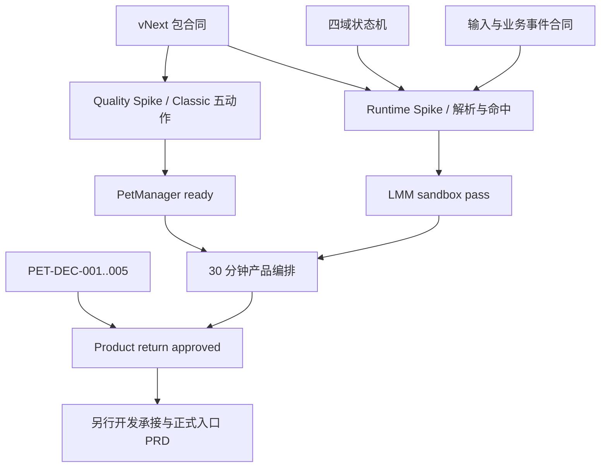

入口判断：/prd

# LetsMakeMoney 桌宠回归专项追踪矩阵

> 内部代号：`pet-return`
> 当前状态：Quality S2.2、Runtime S1.9、S2.2 vNext G8 与 Runtime 产品化准备已独立通过；Classic-only 本地产品候选已获项目所有者批准并完成 100% DPI 真实 GUI 验证，产品包仍为 `published:false`，公开发布待补证
> 上游：`doc/architecture/pet-return-idea-pool.md`
> 下游：Runtime Spike、Quality Spike；通过后才允许讨论开发承接
> 当前事实源：本文件只保存索引与状态，正式合同以对应 PRD/专项文档为准
> 最后更新：2026-08-12

## 1. 状态枚举

| 状态 | 含义 |
| --- | --- |
| `contract_ready` | 合同已定义，尚未执行 |
| `decision_blocked` | 被项目所有者决策阻塞 |
| `spike_pending` | 已有可执行 Spike 合同，未授权或未开始 |
| `deferred` | 明确后置，不阻塞首轮 |
| `out_of_scope` | 不进入 pet-return 首轮 |
| `pass` / `partial` / `fail` / `blocked` | 仅在真实 Spike/验收后使用 |

## 2. Idea -> FR -> 交付物

| Idea | 候选需求 | PRD/去向 | 主合同 | 当前状态 |
| --- | --- | --- | --- | --- |
| `PET-IDEA-001` | 可卸载桌宠沙盒与回滚边界 | `PET-FR-001` | `pet-return-prd.md`、Runtime Spike | `pass`：仅限隔离 G8 与零宠物主线保护 |
| `PET-IDEA-002` | 动画质量基准与角色一致性 | `PET-FR-009`、`PET-FR-010` | Quality Spike | `partial`：S2.2、Batch A 与 Batch B 两项陪伴动作已通过；扑跳因语义不符退役；剩余六项已完成来源审计并进入 Profile 人工审批门禁 |
| `PET-IDEA-003` | 宠物包 vNext | `PET-FR-008` | `pet-package-vnext-contract.md` | `contract_ready` |
| `PET-IDEA-004` | 三基础状态与低重复调度 | `PET-FR-002`、`PET-FR-003`、`PET-FR-006` | 状态机、主 PRD | `partial`：Batch A 覆盖休息与睡眠，Batch B 覆盖工作期间陪伴；完整调度未验证 |
| `PET-IDEA-005` | 状态感知单击反馈 | `PET-FR-004` | 状态机、Runtime Spike | `pass`：三种 BaseState 压力通过 |
| `PET-IDEA-006` | 长按拖拽跑动全链路 | `PET-FR-003`、`PET-FR-004` | 状态机、两条 Spike | `pass`：左右方向、释放收势与样片均通过 |
| `PET-IDEA-007` | 业务事件动作与去重 | `PET-FR-005` | 状态机、主 PRD | `profile_review_pending`：四个无道具业务事件 Profile 已编译；总开关仍未确认，未开始生成 |
| `PET-IDEA-008` | 动态透明命中与点击穿透 | `PET-FR-007` | 包合同、状态机、Runtime Spike | `pass`：S1.9 三档 DPI 可见/透明点位通过，普通帧不再调用 `SetWindowRgn` |
| `PET-IDEA-009` | 事件驱动动画编排状态机 | `PET-FR-002` | 状态机、Runtime Spike | `partial`：S2.2 输入、完成与 30 分钟初步编排通过，完整目录未验证 |
| `PET-IDEA-010` | Classic 黄金质量样片 | `PET-FR-009`、`PET-FR-010` | Quality Spike | `pass`：S2.2 approved / ready:true / published:false |
| `PET-IDEA-011` | 多多通用合同兼容验证 | `PET-FR-008`、`PET-FR-012` | 包合同 | `contract_ready`；仅兼容验证 |
| `PET-IDEA-012` | 产品级视觉与稳定性门禁 | `PET-FR-012` | 主 PRD、两条 Spike | `partial`：隔离 G8 的三档 DPI、坏包和两小时门禁通过；完整动作目录与正式产品编排未验证 |
| `PET-IDEA-013` | ComfyUI + MiniMax 动作探索 | `PET-FR-011` | Quality Spike | `decision_blocked`：披露、动作与预算未确认 |
| `PET-IDEA-014` | Tauri 透明 WebView 播放器 Spike | `PET-FR-001/002/004/007/012` | Runtime Spike | `pass`：S1.9 与隔离 G8 Gate 2 通过；不代表正式产品入口通过 |
| `PET-IDEA-015` | 指针注视与方向跟随 | 后置候选 | 主 PRD动作矩阵 | `deferred` |
| `PET-IDEA-016` | 多宠物平台、下载与市场 | 非目标 | 无 | `out_of_scope` |

## 3. FR 追踪

| FR | 需求 | 主要表达物 | 自动验证 | 人工/Computer Use | 阻塞门禁 |
| --- | --- | --- | --- | --- | --- |
| `PET-FR-001` | 可卸载沙盒与主线隔离 | 生命周期表、故障隔离时序 | 窗口/包故障 fixture、真实 HWND 生命周期测试 | 隐藏、恢复、销毁、主线健康 | LMM sandbox pass |
| `PET-FR-002` | 四域状态机与真实完成 | 四域模型、转换表、实例 token | 组合状态、超时、晚到事件 | 可见动作恢复 | LMM sandbox pass |
| `PET-FR-003` | 动作目录与候选参数 | 动作矩阵 | Profile/schema | 真实时长 GIF | PetManager ready |
| `PET-FR-004` | 输入仲裁 | 500ms、位移、菜单锁 | 499/500/501ms fixture | 单击10次、拖拽5次 | LMM sandbox pass |
| `PET-FR-005` | 业务事件与去重 | event ID、有效窗口、队列 | 去重/过期/恢复 fixture | 业务边界演示 | LMM sandbox pass |
| `PET-FR-006` | 低重复调度 | 权重、冷却、固定 seed | 确定序列与连续次数 | 30分钟审查 | Product return approved |
| `PET-FR-007` | 动态命中与穿透 | hitMask、WindowState | mask/DPI/故障 fixture | 三 DPI 点位测试 | LMM sandbox pass |
| `PET-FR-008` | 宠物包 vNext | schema、哈希、许可、fallback | Classic/多多/坏包 fixture | 包身份复核 | PetManager ready |
| `PET-FR-009` | Classic 黄金样片 | 五动作 Profile、边界板 | 几何/透明/循环指标 | 评分 >=4/5 | PetManager ready |
| `PET-FR-010` | PetManager G0-G8 | 生产与 QA 流程 | G0-G7 validators | 真实时长审查、G8 | 三层门禁 |
| `PET-FR-011` | MiniMax 有界探索 | 三轮预算/停止合同 | 凭据与净化扫描 | 候选动作人工筛选 | 不直接形成 ready |
| `PET-FR-012` | 三层验收与停止 | 验收矩阵、回滚 | current gate、2h 记录 | 30m、三 DPI、所有者批准 | Product return approved |

## 4. 历史证据 -> 当前合同

| 历史证据 | 继承事实 | 当前承接 | 禁止误用 |
| --- | --- | --- | --- |
| `doc/releases/v0.8/pet-animation-next-version-review.md` | 固定恢复时长、交互语义弱 | `PET-FR-002/004` | 不恢复固定 1.55s |
| `doc/releases/v0.9/petmanager-animation-review.md` | 包能生产但产品编排不足 | `PET-FR-008/010/012` | PM ready 不等于产品通过 |
| `doc/releases/v0.9/pet-package-contract-gap.md` | safe exit、变体、冷却、命中缺失 | vNext 包合同 | 不用旧 manifest 冒充 v2 |
| `doc/releases/v1.0/pet-retirement-audit.md` | v1 零宠物主线已稳定 | `PET-FR-001/012` | Spike 不改正式默认行为 |
| Classic S4.3 | 逐帧时长、锚点、脚底线、8动作 | Runtime fixture、质量对照 | unpublished 旧包不是正式回归包 |
| 多多 S5.5 | 同类包与更自然的玩耍语义 | 通用解析器兼容 fixture | 不先于 Classic 黄金样片公开 |
| PetManager custom action 设计 | Profile、分层、QA 与人工门禁 | `PET-FR-008/010` | 不复制生产管线到 LMM |
| 当前 LMM Tauri 多窗口 | WebView 生命周期基础可复用 | Runtime Spike | 不等于透明命中已证明 |

## 5. 决策门禁

| 决策 | 问题 | 推荐 | 阻塞范围 | 当前状态 |
| --- | --- | --- | --- | --- |
| `PET-DEC-001` | 首次公开只提供 Classic，还是 Classic + 多多 | Classic only | 多多正式 QA 延后 | 已关闭：首轮仅 Classic |
| `PET-DEC-002` | 正式回归后默认关闭还是开启 | 默认关闭 | 配置迁移、Settings 与发布文案 | 已关闭：默认 Mini，用户显式二选一 |
| `PET-DEC-003` | 是否提供业务事件动作总开关 | 提供 | 业务事件未进入首轮 12 动作 | 延后：不阻塞首轮精简候选 |
| `PET-DEC-004` | 是否披露 AI 辅助和人工重建摘要 | 接受并披露 | 新增 AI 素材的 provenance 与发布说明 | 当前包已关闭：provenance 声明本轮未新生成；后续 AI 素材重新审批 |
| `PET-DEC-005` | MiniMax 首个探索动作 | 不执行 | 无；`working_pounce` 已因语义不符退役，未来若重启 AI 探索须重新立项 | 已关闭 |

`PET-DEC-001`、`PET-DEC-002`、`PET-DEC-004` 与 `PET-DEC-005` 已在首轮精简范围关闭；`PET-DEC-003` 随业务事件整体延后，不阻塞 Classic 12 动作候选，但公开发布时必须在发布说明中明确无业务事件动作。

## 6. 验收 ID

| 验收 ID | 目标 | 对应 FR | 证据 | 当前状态 |
| --- | --- | --- | --- | --- |
| `PET-ACC-001` | 桌宠关闭/销毁不影响主线 | 001 | 故障注入、主线冒烟 | automated_pass |
| `PET-ACC-002` | 逐帧时长和真实完成 | 002 | frame timing、桌面日志 | pass |
| `PET-ACC-003` | 超时与晚到事件无害 | 002 | 状态机组合测试 | automated_pass |
| `PET-ACC-004` | 单击按 BaseState 区分 | 004 | 每状态10次 | pass |
| `PET-ACC-005` | 500ms 拖拽与完整收势 | 004 | 5次、左右方向 | pass |
| `PET-ACC-006` | 业务事件一次且不过期补播 | 005 | event ledger、睡眠恢复 | pending |
| `PET-ACC-007` | 30分钟低重复 | 006 | 固定seed报告、审查表 | pending |
| `PET-ACC-008` | 三 DPI 动态透明命中 | 007 | hit-test matrix、Runtime 事件 | pass：100%/125%/150% 可见点接收、透明点穿透，P0 为 0 |
| `PET-ACC-009` | vNext 包完整性和坏包回退 | 008 | parser/validator fixture | pass：坏 manifest/atlas 桌面注入安全降级，恢复有效包后收敛 |
| `PET-ACC-010` | Classic 五动作质量 | 009/010 | APNG、Contact Sheet、项目所有者签核 | pass：S2.2 |
| `PET-ACC-011` | Classic/多多无 petId 特判 | 008 | 同解析器测试 | pending |
| `PET-ACC-012` | 两小时稳定 | 012 | 资源曲线、日志 | pass：7203.7 秒、121 样本无 P0，观察窗后外部 UI 负载复验仍通过 |
| `PET-ACC-013` | 零宠物回滚 | 001/012 | current gate、配置对比 | automated_pass |
| `PET-ACC-014` | AI 分支凭据/许可/预算 | 011 | 脱敏核对摘要 | decision_blocked |
| `PET-ACC-015` | 隐藏暂停、单次恢复与原生故障 fail-closed | 001/007 | Node 组合测试、真实 Win32 HWND 集成测试 | automated_pass；桌面快捷键焦点探针不可判定 |
| `PET-ACC-016` | 沙盒 MSVC 干净构建可复现 | 001/012 | 三次同路径干净构建、PE/RSDS 差异分析、`/Brepro` 合同 | pass：三次目标 SHA256 一致 |
| `PET-ACC-017` | Batch A 清醒休息与睡眠动作质量 | 003/009/010 | APNG、Contact Sheet、状态边界、决定文件 | pass：仅批次级；完整目录仍关闭 |
| `PET-ACC-018` | Batch B 陪伴动作质量与失败隔离 | 003/009/010 | APNG、Contact Sheet、状态边界、扑跳拒绝与退役证据 | pass：两个陪伴动作已获批；扑跳退役且无需补位，批次 ready |
| `PET-ACC-019` | 正式产品候选互斥、渲染、单击、命中与拖拽 | 001/002/004/007/012 | 100% DPI Computer Use、debug.log、配置对比 | partial_pass：真实 GUI 主链路通过，125%/150% 与同候选 2h 待补 |
| `PET-ACC-020` | 正式发布候选身份与发布补证 | 001/007/008/012 | 干净提交、三 DPI、2h、托盘、坏包 | pending |

## 7. 三层门禁

### Gate 1：PetManager ready

当前签核分层：无电脑 Classic S2.2 五动作黄金样片为 `true`；Batch A 五个清醒休息与睡眠动作、Batch B 两个工作期间陪伴动作均为 `batchReady:true`；`working_pounce` 已退役且无需补位；18 动作完整目录的 `PetManager ready = false`。

必须具备：

- 五个黄金动作及 vNext 净化包。
- schema、图集、逐帧 duration、safe exit、hit mask、哈希、许可与 provenance 通过。
- 真实时长 GIF、Contact Sheet、边界图和人工评分通过。
- 状态为 `approved / ready:true / published:false`。

不证明：透明窗口、输入、长期产品编排和主线隔离。

### Gate 2：LMM sandbox pass

当前签核：`true`，仅限 S1.9 + S2.2 的隔离 G8 承重范围。

必须具备：

- Runtime Spike 和 G8 通过。
- 逐帧播放、状态机、输入、动态命中、三 DPI、故障隔离和两小时运行通过。
- 零宠物回滚演练通过。
- 隐藏时原生轮询暂停、恢复单 timer、原生故障 fail-closed 与沙盒构建可复现性通过。

不证明：用户希望桌宠公开回归或公开默认值合理。

### Gate 3：Product return approved

当前签核分为两层：`Product candidate approved = true`，`Public release approved = false`。Classic 包为 `approved / ready:true / productReturnApproved:true / published:false`，Settings 已允许用户在默认 Mini 与 Classic 之间严格二选一；本地产品候选 100% DPI 主链路已验证，但尚未取得公开发布批准。

必须具备：

- Gate 1、Gate 2 全部通过。
- 30 分钟长期观感和项目所有者视觉审查通过。
- 首轮精简范围决策已关闭或明确延后，不再隐式扩大到多多和业务事件。
- 正式入口、设置、Mini 默认值与回滚基础设施已完成；仍须从干净提交构建同一候选，补齐三 DPI、两小时、托盘与坏包桌面回退，更新发布说明后再申请公开发布。

## 8. P0/P1/P2

| 优先级 | 内容 | 状态 |
| --- | --- | --- |
| P0 | 沙盒隔离、状态机、透明命中、vNext、Classic 五动作、两条 Spike、三层门禁与正式互斥基础设施 | Quality pass / Runtime S1.9 pass / G8 pass / formal current gate pass / product candidate approved / public release pending |
| P1 | 完整动作目录、业务事件、Classic 扩展、多多正式兼容 QA | Batch A、Batch B 均已通过；扑跳已退役且无需补位；A2、C 已完成来源审计和 Profile 编译，等待人工批准后生产 |
| P2 | pointer_follow、多宠物公开选择 | deferred |
| 非目标 | 宠物市场、下载系统、主题扩展、Godot 恢复、原生 GPU 整体重写 | out of scope |

## 9. 依赖图

## 10. 原型与 UI 门禁

本阶段不恢复用户可见入口，因此没有正式产品 UI 可供冻结。若 Gate 1 与 Gate 2 通过并进入公开回归 PRD，必须补齐以下门禁：

| 原型交付门禁 | 本轮要求 |
| --- | --- |
| 交付文件 | 先锁定项目对象；点名该对象内已提供或已核对的原型并更新，未知路径写“待提供”，不得从其他项目猜测；写明“本轮不以低保真线框替代” |
| 状态与出口 | 覆盖正常、空、错、禁用、加载及保存、取消、关闭 |
| 模拟边界 | 区分模拟数据、假行为和真实能力；Agent 演示不证明真实用户采用 |
| 浏览器验证 | 用真实浏览器检查桌面/窄屏、关键交互、控制台及页面脚本错误 |
| 结论回写 | 写明回写 PRD 的位置与规则，并列出必须保护的既有体验 |

当前只允许 Runtime Spike 使用开发沙盒画面；它不是产品高保真原型。

## 11. 事实源与更新规则

| 事实 | 唯一完整事实源 | 本文件只记录 |
| --- | --- | --- |
| 产品与动作范围 | `pet-return-prd.md` | FR/状态索引 |
| 运行时转换 | `pet-runtime-state-machine.md` | 对应验收 ID |
| 包 schema | `pet-package-vnext-contract.md` | schema 状态 |
| Runtime 执行 | `pet-return-runtime-spike.md` | 结果与证据入口 |
| Quality 执行 | `pet-return-quality-spike.md` | 结果与证据入口 |
| 当前公开产品 | `doc/current.md` | 仅确认仍为零宠物主线 |

更新规则：真实执行后只把结果、证据入口和阻塞状态回写本文件，不复制完整日志或测试正文。

## 12. 当前结论

- PRD、状态机、包 vNext 与两条 Spike 的合同具备执行条件。
- 两条 Spike 已完成独立实施与人工审查；Quality S2.2 已通过。Runtime S1.9 通过真实三档 DPI、动态命中、输入、故障隔离、两小时稳定运行及观察窗后的外部 UI 负载复验，承重运行时门禁成立。
- `PetManager ready = true（仅限无电脑 Classic S2.2 五动作）`；`Runtime Spike pass = true`；`LMM sandbox pass = true（仅隔离 G8 承重范围）`。三者不得互相替代，也不得替代正式产品批准。
- G8 已直接使用 S2.2 vNext 包；旧 S4.3 电脑夹具仅保留为 historical，不是当前联调或产品素材。
- S1.9 以逐帧 alpha mask 和顶层指针感知穿透关闭普通帧同步 `SetWindowRgn` 阻塞；100%/125%/150%、坏 manifest/atlas、7203.7 秒稳定运行及原失败外部 UI 负载均通过，普通帧 P0 阈值未放宽。
- 隐藏 timer、错误诊断和沙盒构建可复现性债务已通过产品化准备验证关闭；S1.9 锁定候选仍保持历史证据身份，不由新构建替换。
- 完整动作目录 Batch A 五动作和 Batch B 的 `working_play_loop_b`、`working_observe` 已获项目所有者批准。`working` 定义为用户工作期间的安静陪伴；`working_pounce` 因语义不符退役且无需补位，旧尺度失败和隔离重建继续作为负向证据。当前六个动作仍为 `generation_required`；来源审计和 A2/C 编译 Profile 已完成，但未获生成批准，完整目录仍关闭。
- 下一步先人工批准 Batch A2 编译 Profile，再按理毛、伸展顺序生产；A2 路线通过后才生产业务事件。跑动三动作只用于长按拖拽，不得重新进入工作态调度，也不得直接恢复正式入口。
- 四项公开决策未关闭，正式产品范围仍为 `decision_blocked`。
- 当前产品继续保持零宠物主线，不存在“桌宠功能开发中”或“即将上线”的事实。
