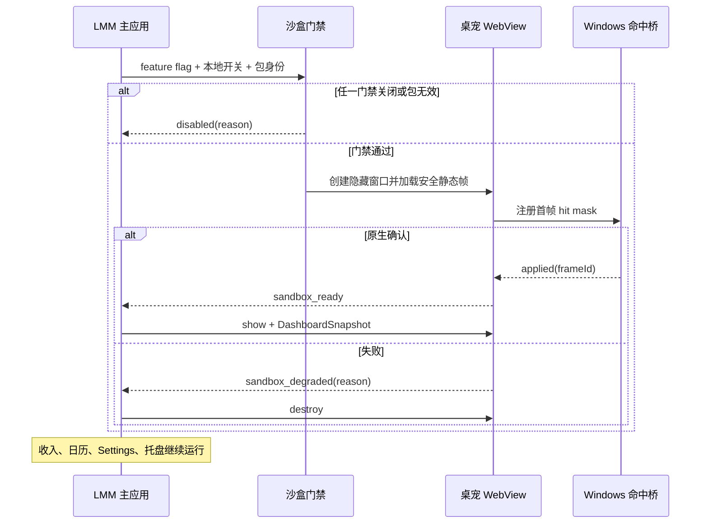
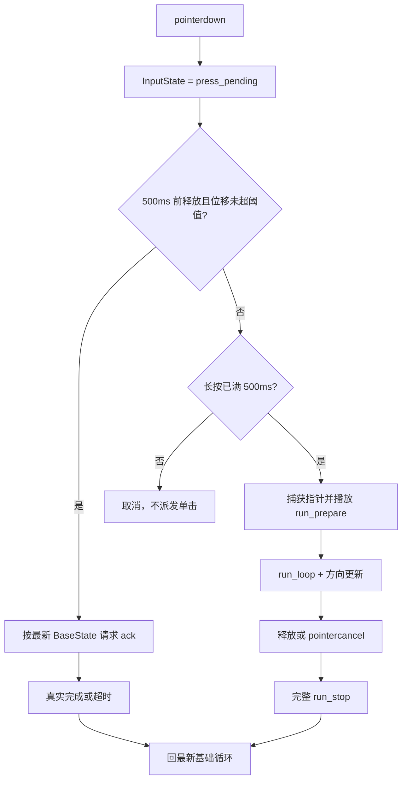
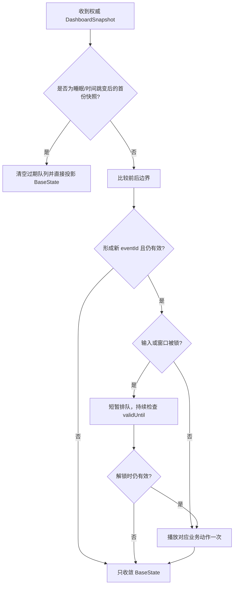

入口判断：/prd

# LetsMakeMoney 桌宠运行时状态机合同

> 内部代号：`pet-return`
> 文档类型：正式推进型状态与交互合同
> 上游：`PET-FR-002`、`PET-FR-004`、`PET-FR-005`、`PET-FR-006`、`PET-FR-007`
> 当前状态：可供 Runtime Spike 实施；不得据此恢复正式产品入口
> 最后更新：2026-08-12

## 1. 设计原则

1. 桌宠不计算工资、班次或工作日，只消费 LMM 权威 `DashboardSnapshot`。
2. 基础状态、一次性动作、输入和窗口生命周期是四个正交域，不用一个字符串同时表达全部状态。
3. 播放器以逐帧时长和真实 `animation_finished` 为准，禁止固定全局恢复时长。
4. 每次动作都有唯一 `actionInstanceId`；完成、超时和晚到事件只能影响自己的实例。
5. 无论任何动作如何结束，运行时最终收敛到最新权威 `BaseState`。
6. 隐藏、卸载、包损坏或状态机异常时，优先关闭桌宠沙盒，不能阻断收入主线。
7. `working` 只表示用户工作期间的安静陪伴，使用低干扰循环、观察与状态回应；`run_prepare`、`run_loop`、`run_stop` 只属于长按拖拽链，不能被工作态环境调度器调用。

## 2. 四域模型

| 状态域 | 枚举 | 唯一职责 |
| --- | --- | --- |
| `BaseState` | `working` / `awake_rest` / `sleeping` | 表达当前业务与昼夜对应的稳定姿态 |
| `ActionLayer` | `base_loop` / `ambient` / `ack` / `business` / `drag_transition` / `drag_loop` | 表达当前播放内容，不改变权威业务事实 |
| `InputState` | `idle` / `press_pending` / `dragging` / `context_menu` | 仲裁单击、长按拖拽和菜单锁 |
| `WindowState` | `visible` / `hidden` / `click_through` / `modal_locked` / `degraded` | 管理窗口可见性、原生命中和故障降级 |

### 2.1 运行时组合状态

运行时快照至少包含：

```ts
type PetRuntimeState = {
  baseState: "working" | "awake_rest" | "sleeping";
  actionLayer: "base_loop" | "ambient" | "ack" | "business" | "drag_transition" | "drag_loop";
  inputState: "idle" | "press_pending" | "dragging" | "context_menu";
  windowState: "visible" | "hidden" | "click_through" | "modal_locked" | "degraded";
  activeAction: ActionInstance | null;
  authoritativeSnapshotId: string | null;
  lastTrustedSnapshotAt: string | null;
  queuedBusinessEvent: BusinessEvent | null;
};
```

`windowState` 在实现中可拆为可见性、命中锁和故障标志，但对外诊断必须能映射回上述五种规范状态。

## 3. Dashboard 到 BaseState 的投影

### 3.1 权威输入

- 使用当前 v1 已有 `DashboardSnapshot.phase`、`ownerDate`、`nextBoundaryKind`、`nextBoundarySeconds` 和计划时间。
- 每份快照必须带单调递增的本地接收序号 `snapshotRevision`；相同或更旧序号不得覆盖新状态。
- 桌宠模块不得自行读取月薪、休息模式或官方日历来推算阶段。

### 3.2 投影矩阵

| Dashboard phase | 额外条件 | BaseState | 说明 |
| --- | --- | --- | --- |
| `working` | 无 | `working` | 用户工作期间的安静陪伴循环，不表演“工作”或跑动 |
| `lunch` | 包括夜班休息 | `awake_rest` | 用户可见语义统一为“休息” |
| `before_work` | 23:00-07:30 且计划工作区间不覆盖当前时刻 | `sleeping` | 夜间纯睡眠 |
| `before_work` | 其他 | `awake_rest` | 清醒等待 |
| `after_work` | 23:00-07:30 且计划工作区间不覆盖当前时刻 | `sleeping` | 下班后的夜间睡眠 |
| `after_work` | 其他 | `awake_rest` | 清醒休息 |
| `rest_day` / `paid_rest` / `unpaid_rest` | 同上夜间条件 | `sleeping` | 休息日夜间睡眠 |
| `rest_day` / `paid_rest` / `unpaid_rest` | 其他 | `awake_rest` | 休息日清醒活动 |
| `loading` | 有最后可信快照 | 保留上一 BaseState | WindowState 标记 `degraded`，不补播事件 |
| `loading` | 无可信快照 | `awake_rest` | 只显示安全静态帧 |
| `error` | 有最后可信快照 | 保留上一 BaseState | 不循环重试动作 |
| `error` | 无可信快照 | `awake_rest` | 安全静态帧，等待权威同步 |

### 3.3 昼夜优先级

1. 真实 `working` 和 `lunch` 高于固定夜间窗口。
2. 23:00-07:30 只在当前没有计划工作覆盖时允许投影为 `sleeping`。
3. owner date 为前一天的跨夜班次继续按权威 phase 投影，不按自然日期强制睡眠。
4. 系统时间、时区或睡眠恢复后先重新获取权威快照，再更新 BaseState；不基于恢复前计时器补算。

## 4. 请求优先级

数字越大优先级越高。相同优先级按先到先处理；业务事件另受去重与过期约束。

| 优先级 | 请求 | 处理规则 |
| ---: | --- | --- |
| 100 | 沙盒关闭、系统隐藏、卸载、包失效 | 硬中断并释放输入、命中和计时器 |
| 90 | 右键菜单、Settings 或 Modal 锁 | 不接受新互动；命中锁成对暂停/恢复 |
| 80 | 已成立的长按拖拽 | 在安全退出点中断 ack、ambient；业务事件短暂排队 |
| 70 | 权威 BaseState 强制收敛 | 不允许旧动作恢复到过时状态 |
| 60 | 当前状态单击 ack | 可中断 ambient；受点击冷却限制 |
| 50 | 有效业务事件 | 去重后播放；遇拖拽/菜单可短排队 |
| 30 | ambient | 受权重、冷却和连续次数限制 |
| 10 | base loop | 无更高请求时持续播放 |

## 5. ActionInstance 合同

```ts
type ActionInstance = {
  actionInstanceId: string;
  actionId: string;
  requestedAtMonotonicMs: number;
  sourceBaseState: BaseState;
  expectedTargetState: BaseState;
  frameIndex: number;
  startedAtMonotonicMs: number;
  deadlineAtMonotonicMs: number;
  interruptPolicy: "hard_only" | "safe_exit" | "immediate";
  completionStatus: "playing" | "finished" | "interrupted" | "timed_out";
};
```

- `actionInstanceId` 每次请求新建，动作名相同也不得复用。
- `deadlineAtMonotonicMs = started + maxRuntimeMs`；不得以墙上时间判断动画超时。
- `animation_finished(actionInstanceId)` 只在最后一帧完整显示完毕后派发一次。
- 已完成、已中断或非当前实例的完成事件属于晚到事件，只记录 `pet_action_late_finished_ignored`。
- 超时后停止当前帧调度，记录最后帧与耗时，走 fallback 并回最新 BaseState。

## 6. 播放器状态机

### 6.1 逐帧播放

1. 校验动作及全部帧。
2. 创建 `actionInstanceId` 并记录 `started`。
3. 显示第 0 帧，按 `frames[0].durationMs` 安排下一帧。
4. 每次推进前检查实例 ID、窗口状态、超时和中断请求。
5. loop 动作在末帧完成后从第 0 帧继续；oneshot 动作在末帧时长结束后触发真实完成。
6. 完成后读取最新 BaseState，不使用动作开始时缓存的旧 BaseState。

### 6.2 中断类型

| 类型 | 示例 | 行为 |
| --- | --- | --- |
| 硬中断 | 隐藏、销毁、包失效、窗口故障 | 立即停帧、释放指针与命中、取消队列，不播放收势 |
| 安全退出 | ambient 被 ack/drag/状态切换打断 | 播放到最近 `safeExitFrames`；超过当前动作 `maxRuntimeMs` 则超时回退 |
| 拖拽释放 | `run_loop` -> `run_stop` | 在当前循环安全退出点切换，必须完整播放 `run_stop` |
| 基础循环切换 | loop A -> loop B | 仅在循环边界或安全退出帧切换 |
| 不可中断 | `run_prepare` 的关键起跑段 | 仅允许系统硬中断；具体不可中断帧由黄金样片冻结 |

### 6.3 fallback 顺序

1. 动作自身 `fallback`。
2. 当前 BaseState 的首选基础循环。
3. 当前 BaseState 的安全静态帧。
4. 包级安全静态帧。
5. 隐藏桌宠沙盒并记录拒绝原因。

fallback 图存在环、跨越不兼容状态或哈希失效时，整包拒绝加载。

## 7. 输入仲裁

### 7.1 候选参数

| 参数 | PRD 候选值 | 冻结条件 |
| --- | ---: | --- |
| 长按成立时间 | 500ms | Runtime Spike 三 DPI 操作通过 |
| 单击最大位移 | 6 CSS px | Runtime Spike 误触矩阵通过；按 DPI 转设备像素 |
| 方向死区 | 4 CSS px | 跑动朝向无高频翻转 |
| 点击冷却 | 600ms；sleep ack 候选 1000ms | Quality Spike 观感确认 |

除 500ms 外，其余值仍是候选参数；Spike 只可在对应证据通过后回写本节，不得在实现中形成无文档常量。

### 7.2 单击

1. `pointerdown` 且未锁定时进入 `press_pending`，保存指针 ID、起点和单调时间。
2. 500ms 前释放、累计位移未超过阈值、未触发右键或指针取消，才派发 ack。
3. ack 按当前最新 BaseState 映射：`working_ack` / `rest_ack` / `sleep_ack`。
4. 取消双击；浏览器 `dblclick` 不绑定业务动作，第二次单击仅按冷却规则处理。

### 7.3 长按与拖拽

1. 保持 500ms 且位移未触发取消后，捕获指针并进入 `dragging`。
2. sleeping 可先走可选 `wake_to_run`；否则直接 `run_prepare`。
3. `run_prepare` 完成后进入 `run_loop`；窗口位置随指针移动，动画方向由水平位移决定。
4. `mirrorSafe=true` 时使用安全镜像；否则必须使用 `directionVariants`，不得运行时擅自镜像。
5. 位移超过单击阈值后，无论是否最终进入 run，都不得派发单击。
6. 释放或 `pointercancel` 后进入 `run_stop`；除硬中断外必须完整播放。
7. `run_stop` 完成后释放指针捕获，回最新 BaseState。

### 7.4 菜单与模态

- 右键打开菜单时进入 `context_menu`，取消待定单击和未成立长按。
- Settings、Wizard、确认框或产品 Modal 打开时进入 `modal_locked`。
- 锁定期间不接受单击、长按、ambient 或业务动作；正在播放的一次性动作允许在不影响命中的情况下完成，否则在安全退出点回基础帧。
- 关闭、异常关闭、失焦和窗口销毁都必须走同一 `unlockInteraction(lockToken)`；只释放匹配 token，避免旧事件解开新锁。
- 暂停与恢复点击穿透日志必须成对；未成对时进入 `degraded` 并隐藏沙盒。

## 8. 业务事件状态机

### 8.1 事件结构

```ts
type BusinessEvent = {
  eventId: string;
  ownerDate: string;
  eventType: "work_start" | "break_relief" | "break_return" | "work_end";
  boundaryAt: string;
  createdAt: string;
  validUntil: string;
  sourceSnapshotRevision: number;
};
```

规范 ID：

```text
sha256(ownerDate + "|" + eventType + "|" + boundaryAt)
```

### 8.2 生成与消费

- 只比较相邻权威 Dashboard 快照，确认跨越业务边界后生成事件。
- 有效窗口：`2 × authoritativeSyncInterval + 5s`，并不得跨过下一业务边界。
- 已存在于本次沙盒会话处理账本的 `eventId` 直接丢弃。
- 拖拽、ack、菜单或模态期间最多保留一个最新有效业务事件；新事件替换旧事件前先检查业务顺序。
- 睡眠恢复、系统时间跳变、时区变化、沙盒重启或长时间隐藏后，先丢弃所有过期队列，再拉取权威快照；不得补播恢复前事件。
- 业务事件总开关属于 `PET-DEC-003`，未确认前 Spike 固定开启仅用于测试，不形成公开默认值。

### 8.3 动作映射

| 事件 | 动作 | 目标状态 | 语义限制 |
| --- | --- | --- | --- |
| `work_start` | `work_start` | working | 不使用庆祝语义 |
| `break_relief` | `break_relief` | awake_rest | 表达放松，不表现下班 |
| `break_return` | `break_return` | working | 表达恢复工作 |
| `work_end` | `work_end_celebrate` | 最新 awake_rest/sleeping | 唯一允许的通用庆祝动作 |

## 9. 低重复调度器

调度器的时钟和 RNG 必须可注入；QA 使用固定 seed，真实运行使用本地随机 seed，均不得影响业务状态。

```text
候选动作
  -> 过滤当前 BaseState 不兼容项
  -> 过滤冷却未结束项
  -> 过滤达到 maxConsecutive 项
  -> 过滤当前窗口/输入不允许项
  -> 按 weight 抽样
  -> 记录选择与拒绝原因
```

规则：

- `working` 必须有至少两个基础循环；同一循环不得连续被重新选择。
- 同一 ambient 不得连续出现；无合格 ambient 时继续基础循环，不强行触发。
- `maxConsecutive` 对相同 `variantGroup` 生效。
- 冷却从动作完成或中断时开始，不能从请求时开始。
- 30 分钟 QA 必须分别覆盖 working、awake_rest、sleeping 各至少 10 分钟。

## 10. 动态命中与 WindowState

### 10.1 帧同步

1. 每个显示帧携带 `frameId` 与 hit mask 引用。
2. WebView 显示新帧后，把该帧逻辑区域、缩放和 mask 版本发送给原生桥。
3. 原生桥确认应用成功后记录 `hitmask_applied(frameId)`。
4. 新帧尚未确认时沿用上一份有效 mask；不得扩大为完整窗口矩形。
5. 连续失败、mask 哈希不符或延迟超过当前帧时长时进入 `degraded`，切安全静态帧；仍失败则隐藏沙盒。

### 10.2 状态规则

| WindowState | 可见 | 可互动 | 点击穿透 | 计时器 |
| --- | --- | --- | --- | --- |
| `visible` | 是 | 可见像素 | 透明区穿透 | 运行 |
| `click_through` | 是 | 否 | 整窗穿透 | 动画可运行 |
| `modal_locked` | 是或暂停帧 | 否 | 暂停穿透并由锁管理 | ambient/业务暂停 |
| `hidden` | 否 | 否 | 不适用 | 全部暂停 |
| `degraded` | 安全静态帧或隐藏 | 仅确认过的安全命中 | 禁止矩形兜底 | 仅健康检查 |

## 11. 合法转换表

| 当前 | 事件 | 下一状态 | 动作 |
| --- | --- | --- | --- |
| 任意 BaseState + base loop | 合格 ambient | 同 BaseState + ambient | 播放一次，完成后回基础循环 |
| 任意 BaseState + idle | 合格单击 | 同 BaseState + ack | 状态感知 ack |
| sleeping + press_pending | 500ms 成立 | dragging + drag_transition | 可选 wake_to_run -> run_prepare |
| working/awake_rest + press_pending | 500ms 成立 | dragging + drag_transition | run_prepare |
| dragging + run_prepare | 真实完成 | dragging + drag_loop | run_loop |
| dragging + run_loop | pointerup/cancel | dragging + drag_transition | run_stop |
| dragging + run_stop | 真实完成 | 最新 BaseState + base_loop | 释放捕获 |
| 任意可见状态 | 右键菜单 | context_menu + modal_locked | 锁互动 |
| context_menu | 菜单关闭/异常关闭 | idle + visible | 恢复成对穿透 |
| 任意 | 窗口隐藏/销毁 | hidden | 硬中断并清理 |
| 任意 | 包失效/命中桥持续失败 | degraded | 安全帧或隐藏 |

## 12. 时序图

### 12.1 启动与故障隔离



### 12.2 单击与拖拽



### 12.3 业务边界与恢复



## 13. 日志合同

| 类别 | 必需事件 | 必需字段 |
| --- | --- | --- |
| 状态 | `pet_base_state_projected` / `pet_base_state_changed` | snapshot revision、phase、owner date、from/to、reason |
| 动作 | `pet_action_requested/started/finished/interrupted/timed_out/recovered` | instance ID、action ID、layer、frame、elapsed、reason |
| 晚到 | `pet_action_late_finished_ignored` | old/current instance ID、action ID |
| 输入 | `pet_input_press_pending/click/drag_started/drag_direction/drag_released` | pointer ID、duration、distance、direction、DPI |
| 锁 | `pet_input_locked/unlocked` | lock token、source、paired result |
| 业务 | `pet_business_event_created/queued/played/duplicate/expired/dropped` | event ID、owner date、type、boundary、validUntil |
| 调度 | `pet_scheduler_selected/rejected` | seed hash、candidate、cooldown、consecutive、reason |
| 命中 | `pet_hitmask_applied/update_failed/passthrough_suspended/restored` | frame ID、mask hash、DPI、latency、lock token |

日志不得包含原始 Prompt、API Key、绝对素材源路径或未脱敏用户数据。

## 14. 自动测试与人工验收

### 14.1 自动测试

- 所有合法/非法四域组合。
- 三类 BaseState 投影与跨夜、休息、loading/error fixture。
- 真实逐帧完成、超时、旧实例晚到完成和中断。
- 500ms 前后、位移阈值边界、拖拽后立即点击、重复 pointercancel。
- 相同 `eventId` 去重、过期丢弃、睡眠恢复不补播。
- 固定 seed 产生确定动作序列；冷却与 `maxConsecutive` 生效。
- hit mask 帧同步失败不退化为矩形命中。
- 隐藏/显示、菜单/模态锁成对释放。

### 14.2 Computer Use 与人工

- 每个 BaseState 单击 10 次，反馈明显不同且无双击等待。
- 长按拖拽 5 次，覆盖左右方向、短长距离、窗口边缘和动作中再次输入。
- 右键菜单、Settings、Modal 打开和异常关闭。
- 100%、125%、150% DPI 的可见像素命中与透明穿透。
- 30 分钟编排观察及 2 小时稳定运行。

## 15. 继续、停止与回写

### 继续条件

- 自动状态组合测试通过。
- Runtime Spike 证明真实逐帧时长、输入仲裁和动态命中可行。
- 状态机故障可降级或销毁沙盒，主线无功能回归。

### 停止条件

- 必须把整个矩形窗口设为可点击才能互动。
- 晚到事件能覆盖最新状态，或业务事件无法稳定去重。
- 拖拽持续误判为单击，或 run_stop 无法可靠完成。
- 桌宠故障导致收入、日历、Settings、托盘或更新链路异常。

### 回写位置

- Runtime 参数回写本文件第 7、10 节。
- 黄金样片参数回写 `pet-return-prd.md` 动作矩阵和 `pet-package-vnext-contract.md`。
- 任何 P0 失败都回写 `pet-return-traceability.md`，状态保持沙盒阻塞。
