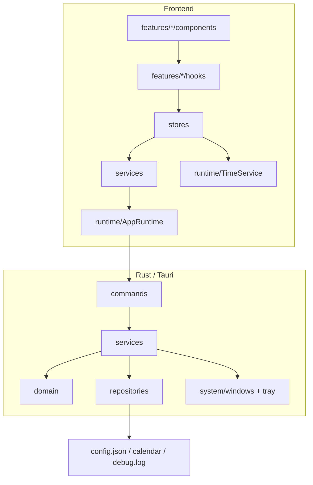

# LetsMakeMoney v2.0 架构设计

> “v2.0”表示目标架构代号，不代表立即改变产品版本号，也不要求一次迁移完成。

## 1. 设计原则

优先级：

1. 用户数据安全
2. 收入计算可信
3. Windows 生命周期稳定
4. 可测试和可回滚
5. 模块边界清晰
6. 扩展能力

约束：

- 保持 Windows 10/11、Tauri 2、React 19 和 TypeScript strict。
- 保持现有 command 名、配置文件位置和用户操作。
- 保持 v1.0.3 已发布行为。
- 不引入无必要的大型依赖。
- 每次只迁移一个垂直切片。

## 2. 目标全景



## 3. 前端目标结构

```text
src/
  app/
    App.tsx
    windowRouter.ts
  domain/
    contracts.ts
    mappers.ts
  runtime/
    appRuntime.ts
    timeService.ts
  services/
    configurationService.ts
    dashboardService.ts
    calendarService.ts
    windowService.ts
    supportService.ts
  stores/
    dashboardStore.ts
    configurationStore.ts
  features/
    mini/
      MiniWindow.tsx
      useMiniWindow.ts
    workbench/
      WorkbenchWindow.tsx
      TodayView.tsx
      CalendarView.tsx
    settings/
      SettingsWindow.tsx
      useSettingsDraft.ts
    wizard/
      WizardWindow.tsx
      useWizardFlow.ts
  ui/
    Button.tsx
    WindowFrame.tsx
    ...
  utils/
    format.ts
    dateTime.ts
```

### 3.1 组件规则

组件允许：

- 接收已经可展示的数据。
- 发出语义动作。
- 管理仅与视觉交互有关的本地状态。

组件禁止：

- 拼装多条 Tauri command 调用链。
- 计算工作日、收入或 owner date。
- 直接读写配置文件。
- 决定系统时间变化后的恢复策略。

### 3.2 Hook 规则

Hook 负责把 Store 和组件连接起来，不直接拥有基础设施：

```ts
export function useSalaryProgress() {
  return useDashboardStore(state => state.snapshot);
}
```

### 3.3 Service 规则

Service 表达用例，而不是窗口：

```ts
interface DashboardService {
  loadSnapshot(now: Date): Promise<DashboardSnapshot>;
  loadMonth(month: string): Promise<CalendarMonth>;
}
```

Service 依赖 `AppRuntime`，因此浏览器测试可以替换命令响应，不再复制收入算法。

## 4. 收入领域模型

现有 `domain.rs` 是权威计算核心。目标不是再建一套类，而是形成稳定 facade：

```rust
pub struct IncomeRequest {
    pub schedule: SalarySchedule,
    pub calendar: CalendarData,
    pub owner_date: String,
    pub now: BusinessTime,
}

pub struct IncomeSnapshot {
    pub today: TodaySnapshot,
    pub month: MonthSalary,
    pub calendar_days: Vec<CalendarDay>,
    pub next_workday: Option<String>,
}

pub trait IncomeCalculator {
    fn calculate(&self, request: IncomeRequest) -> Result<IncomeSnapshot, DomainError>;
}
```

第一阶段可以由 `DefaultIncomeCalculator` 组合现有纯函数，不修改算法。

未来多份收入、时薪、自由职业或项目收入应通过新的 `IncomeSource` 模型进入 Domain，不得让 UI 增加条件分支。

## 5. Rust 目标结构

```text
src-tauri/src/
  lib.rs                    # Builder 与模块装配
  commands/
    income.rs
    calendar.rs
    configuration.rs
    support.rs
    windows.rs
  services/
    income_service.rs
    calendar_service.rs
    configuration_service.rs
  repositories/
    config_repository.rs
    calendar_repository.rs
    log_repository.rs
  domain/
    income.rs
    schedule.rs
    calendar.rs
    time.rs
  system/
    windows.rs
    tray.rs
    webview_lifecycle.rs
    single_instance.rs
  models/
    runtime_state.rs
```

迁移顺序：

1. 先新增 service，command 名和参数不变。
2. 再移动无 Windows 依赖的 command。
3. 更新测试从文件文本转为导出合同。
4. 最后移动窗口、托盘和 WebView2。

## 6. 配置版本与迁移

### 6.1 当前事实

当前已经存在 `config_version = 8`、v5/v6/v7 迁移、备份和事务保存。

### 6.2 目标合同

```rust
pub const CURRENT_CONFIG_VERSION: u32 = 8;

pub trait ConfigMigration {
    fn source_version(&self) -> u32;
    fn target_version(&self) -> u32;
    fn migrate(&self, source: Value) -> Result<Value, ConfigError>;
}
```

迁移规则：

- 每个版本有独立 fixture。
- 迁移后必须经过当前 schema 校验。
- 失败时保留原文件并生成脱敏诊断。
- 没有字段变化时不得提升版本。
- 所有写入通过 `ConfigRepository` 串行化。
- 窗口位置等运行时 patch 必须基于最新配置合并。

## 7. 状态同步设计

### 7.1 状态分类

| 状态 | 所有权 | 同步方式 |
| --- | --- | --- |
| ConfigState | Rust 持久化事实 | 保存后广播 revision |
| CalendarState | 每窗口缓存，可重建 | 配置 revision / 月份触发 |
| RuntimeState | 每窗口 | hidden/shown/focus |
| DashboardSnapshot | 每窗口最近可信快照 | 本地 tick + 权威同步 |
| ThemePreview | 临时跨窗口 | 事件，保存失败回滚 |

### 7.2 不采用的方案

当前不采用单一永久同步窗口，也不引入跨 WebView Redux/Zustand。原因：

- 隐藏生命周期已减少无效同步。
- 现有性能证据未达到重构门槛。
- 单点 owner 会引入退出、重建和窗口顺序问题。

### 7.3 一致性增强

配置广播增加单调递增 `revision`：

```ts
type ConfigurationUpdated = {
  revision: number;
  source: "settings" | "wizard" | "date_override" | "window_position";
};
```

窗口只接受更新 revision 更大的事件；恢复时仍从 Rust 重新读取。

## 8. TimeService

### 8.1 前端端口

```ts
export interface TimeService {
  now(): Date;
  wallClockMs(): number;
  timeZoneOffsetMinutes(): number;
  localDateKey(date: Date): string;
  monthKey(date: Date): string;
}
```

### 8.2 规则

- 业务同步只从 `TimeService` 取时间。
- 系统时间跳变使用 wall clock 与 monotonic 采样组合识别。
- owner date 最终由 Rust Domain 决定。
- UI 不从本地时间自行判断收入阶段。
- 测试使用 `FixedTimeService`。

## 9. Calendar Provider

```rust
pub trait CalendarProvider {
    fn coverage(&self, year: i32) -> Result<CalendarDatasetResponse, CalendarError>;
}

pub struct EmbeddedChinaCalendarProvider;
```

当前只交付中国大陆实现。Provider 的价值是隔离来源与领域计算，不代表近期支持美国、日本或在线服务。

新增国家时必须同时提供：

- 数据来源与许可。
- schema 与完整性校验。
- 年度覆盖和 fallback。
- 时区、周末和法定调休规则。
- 发布包验证。

## 10. Growth 能力边界

Growth 不进入当前实现，只定义只读领域事件：

```text
workday.completed
income.daily_target_reached
income.monthly_milestone_reached
streak.updated
```

未来 Achievement 与 Daily Summary 只能消费 Domain 事件，不得重新计算收入。

潜在产品：

- 今日完成工作。
- 连续工作 7 天。
- 月度收入里程碑。
- 每日摘要和周度趋势。

在进入 PRD 前必须验证打开频率、用户价值和隐私边界。

## 11. AI 能力边界

当前不接入任何 AI SDK。

未来端口：

```ts
interface InsightsService {
  summarize(input: Readonly<InsightDataset>): Promise<InsightResult>;
}
```

安全规则：

- AI 只能读取经过用户确认的聚合数据。
- AI 不直接读写 `config.json`、日志或系统 API。
- AI 不能调用 repository。
- 所有修改建议必须回到标准配置事务并经用户确认。
- 默认本地关闭，明确展示数据范围与去向。

可行方向：

- 收入趋势解释。
- 工作节奏总结。
- 异常配置提醒。
- 用户主动触发的周报。

## 12. 渐进实施计划

### P0

#### P0-1 前端 Runtime 与 Service 边界

- 建立 `AppRuntime`。
- 合并 `isTauri()`。
- 将配置、窗口和 Dashboard commands 封装为 service。
- 先补 adapter 行为测试。

回滚：恢复原直接 `invoke`，command 合同不变。

#### P0-2 领域 facade

- 用应用服务组合现有 `domain.rs`。
- 不修改计算公式。
- 建立 Rust/TS 合同 fixture。

回滚：commands 直接调用旧纯函数。

#### P0-3 配置写入协调

- 提取当前版本常量。
- 所有配置写入串行化。
- 位置保存使用字段 patch。
- 补并发写入测试。

回滚：保留原 `config.rs` 事务 API。

### P1

#### P1-1 每窗口 Store

- 从 `useDashboard` 抽 controller/store。
- React hook 只订阅 Store。
- 保留原同步周期与事件名。

#### P1-2 TimeService

- 替换业务路径中的直接系统时间。
- 注入固定时钟测试跨夜、睡眠、时区。

#### P1-3 Rust 分层

- 先移动 income/calendar/config service。
- Windows system 模块最后迁移。

### P2

#### P2-1 Calendar Provider

- 引入 trait 与中国实现。
- 不增加新国家。

#### P2-2 Growth 领域事件设计

- 只写 RFC 和数据边界。

#### P2-3 AI Port 设计

- 只写 RFC、隐私和权限合同。

## 13. 质量门禁

每个切片必须：

1. 新增失败测试。
2. 确认测试因缺少目标能力失败。
3. 最小实现。
4. 新测试通过。
5. 全量回归。
6. 更新变更记录。

完成门禁：

```text
TypeScript strict
前端行为测试
Vite production build
cargo test
cargo clippy --all-targets -- -D warnings
Python 发布合同检查
git diff --check
真实 Windows 关键路径（涉及窗口时）
```

## 14. 商业化路线建议

### 阶段 1：可信与留存

- 收入计算和日历可信说明。
- Daily Summary。
- 可导出的本地统计。
- 明确数据完全本地。

### 阶段 2：多收入模型

- 时薪。
- 多份收入。
- 项目收入。
- 目标与里程碑。

要求先扩 Domain，不在 UI 叠条件。

### 阶段 3：可选高级能力

- 高级统计与历史趋势。
- 用户主动触发的 AI 总结。
- 企业/团队能力必须另立数据和隐私架构，不复用个人配置文件。

商业化不应以账户和云同步作为默认前提。当前“本地、轻量、可信”本身是差异化价值。

## 15. 架构决策摘要

| 决策 | 结果 |
| --- | --- |
| 是否重写 | 否 |
| 是否新建收入计算器 | 否，包装现有 Rust Domain |
| 是否立即上全局状态库 | 否 |
| 是否立即共享跨窗口快照 | 否 |
| 是否升级配置版本 | 仅在字段合同变化时 |
| 是否实现 Calendar Provider | 是，最小 trait |
| 是否实现 Growth | 当前只设计事件 |
| 是否接入 AI | 否，只定义安全端口 |
| 是否先拆 Windows 生命周期 | 否，先补行为门禁 |

## 16. 本轮落地状态

本节记录实际代码状态，避免将目标架构误读为已经全部完成。

### 已落地

- 前端 `domain / runtime / services / hooks / features / utils` 最小边界。
- 统一 Tauri Runtime Adapter。
- 配置纯领域模型与 v8 显式迁移合同。
- Dashboard、配置、窗口和支持服务。
- TimeService 与固定时钟测试入口。
- WindowFrame、MiniWindow 和拖动 hook。
- Rust 配置 Repository、配置 Service、Income Service 与 income commands。
- Calendar Provider 最小 trait 和中国内置实现。
- 架构行为测试、结构门禁和可配置 Cargo 解析。

### 有意暂缓

- **跨 WebView 单一 Store**：当前隐藏窗口生命周期已经控制 timer，尚无足够证据证明共享 Store 的收益高于一致性迁移风险。
- **Windows 生命周期全面拆分**：`lib.rs` 仍作为 Tauri composition root；托盘、窗口和 WebView2 边界需先补真实 Windows 行为门禁。
- **配置 revision 广播**：当前配置更新事件会触发权威重载，未增加新的持久化字段和协议版本。
- **Growth 与 AI**：只保留接口和权限设计，不增加用户数据、不接第三方 SDK。

### 与产品版本的关系

“v2.0 架构”是渐进式目标架构代号，不代表软件产品版本已经升级。当前业务版本、配置版本、发布身份和用户数据合同均保持不变。
