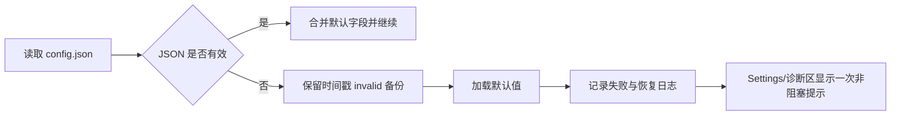
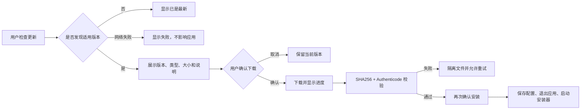

# LetsMakeMoney 当前高保真交互原型说明

## 追踪信息

- 当前状态：v0.9 完整 PRD 对照原型，待项目所有者确认
- 当前稳定基线：Windows v0.8 Beta
- 目标版本：Windows v0.9 Beta
- 当前分支：`main`
- 原型入口：`doc/prototypes/index.html`
- 需求入口：`doc/releases/v0.9/prd.md`
- 最后更新：2026-07-18

## 1. 原型目标

本原型按当前产品能力组织，不复述 v0.1 至 v0.4 的历史演进。它同时承担三种用途：

1. 展示当前 Windows v0.8 已验证的桌宠、Panel、菜单、Settings、Wizard、诊断和发布基线。
2. 表达 v0.9 的工资与作息、渐进配置、Panel/今日详情和全界面视觉方向。
3. 表达 Classic/多多通用宠物包、事件驱动状态机、输入仲裁、动态命中与回滚门禁。

原型不是营销页，也不是 Godot 运行代码。开发后的界面不要求逐像素复制 HTML，但必须遵守信息层级、控件密度、状态语义和职责边界。

## 2. 当前产品地图

| 模块 | 当前基线 | v0.6 原型表达 |
|---|---|---|
| 桌宠窗口 | 透明无边框、橘猫 v2、点击穿透、托盘找回 | 保留现有结构，不做动画素材大修 |
| Panel | 暖色金币计数器和薪资便签，支持折叠/展开 | 只允许有证据的对齐、稳定尺寸和边缘定位修正 |
| 桌宠右键菜单 | 设置、向导、窗口模式、宠物、关于、退出 | 明确为桌宠上下文菜单 |
| 原生托盘菜单 | 显隐、设置、关于、退出 | 明确为窗口找回和生命周期菜单 |
| Settings | 工资、桌宠、显示、面板、通用五页签 | 通用页增加“诊断与支持”轻量区域 |
| Wizard | 欢迎、薪资、角色、确认四步 | 只修共享控件残留差异 |
| 日志 | `debug.log`，部分关键事件仅 Debug 可见 | 关键语义默认可观察、2 MB 轮换、截图按需生成 |
| 自动验证 | v0.5 脚本可能在 Parser/Error 后仍显示通过 | 阻塞错误必须非零退出 |
| 配置与自启动 | JSON 配置、Run 注册表、自启动和恢复默认已存在 | 增加损坏恢复与高信任路径验证口径 |
| 发布 | `main` 上 `v0.6-beta` 为当前发布基线 | v0.7 完整 PRD 与原型待确认，尚未进入开发或打包 |

## 3. 视觉方向

继续使用“温暖桌面小挂件 / 橘猫金币小票便签风”：

- 页面和弹层：奶油底、白纸层、低透明暖棕边框。
- 文字：深咖啡主文字、暖棕辅助文字。
- 强调：金币黄；成功使用柔和绿色；失败使用克制红棕。
- 控件：紧凑、清楚、低阴影，不使用 Godot 默认深色 popup。
- 产品气质：可爱但不幼稚，像桌面偏好小工具，不像后台管理系统。

v0.6 不建立主题系统，不增加第三套视觉语言，也不重新设计 Settings / Wizard 结构。

## 4. 原型导航

| 视图 | 用途 |
|---|---|
| 总览 | 当前桌宠、Panel 和透明窗口关系 |
| 桌宠主界面 | 小猫状态、互动、拖拽和穿透边界 |
| Panel 便签 | 折叠/展开和屏幕边缘状态 |
| 右键菜单与托盘 | 当前菜单和二级入口 |
| 设置面板 | 五页签和通用页诊断入口 |
| 首次向导 | 四步配置流程 |
| 共享控件基线 | v0.5 已验证的控件、保存反馈与恢复基线 |
| v0.6 诊断与验证 | v0.6 新增或变化的真实产品/验收表达 |
| Debug 与验证 | 输入日志和调试窗口用途 |
| 发布包 | 当前 v0.5 发布基线和 v0.6 阶段状态 |

## 5. 当前功能交互

### 5.1 桌宠与 Panel

原型快捷按钮可以：

- 展开或收起 Panel。
- 在工作中、休息中和待机中切换。
- 模拟小猫点击反馈。
- 预览 Panel 靠近右侧或底部时的位置变化。

真实应用继续保护：

- hover、状态感知单击、长按拖拽跑动和右键菜单。双击不再拥有独立产品动作。
- 小猫和 Panel 为交互区域，其余透明区域尽量穿透。
- Panel 展开不遮挡小猫，靠近屏幕边缘时改变展开方向。

### 5.2 桌宠右键菜单

```text
隐藏到托盘
────────
设置
重新运行向导
窗口模式 >
  置顶悬浮
  融入桌面（实验）
选择宠物 >
  橘猫 v2
  橘猫 v1
  小猫旧素材
────────
关于 LetsMakeMoney
退出
```

该菜单服务桌宠当前上下文。窗口模式和选择宠物继续使用二级入口。

### 5.3 原生托盘菜单

```text
显示窗口 / 隐藏窗口
────────
设置
关于 LetsMakeMoney
────────
退出
```

该菜单服务窗口找回和生命周期。托盘不增加向导、宠物选择、窗口模式或诊断入口。设置、关于和退出在两个菜单中重复是有意的可找回设计。

### 5.4 Settings

五个页签保持不变：

| 页签 | 真实设置 |
|---|---|
| 工资 | 月薪、休息模式、上班时间、下班时间、每日工作小时数 |
| 桌宠 | 当前角色 |
| 显示 | 透明度、缩放、窗口模式、纯桌宠模式 |
| 面板 | 今日已赚、本月累计、时薪、工作进度、状态 |
| 通用 | Debug、开机自启、关闭隐藏、重置位置、恢复默认、诊断与支持 |

说明性和诊断性内容继续使用低视觉权重，不作为大卡片或新的独立页签。

### 5.5 Wizard

四个步骤保持不变：

1. 欢迎。
2. 薪资、休息模式和工作时间。
3. 选择宠物。
4. 确认并完成。

v0.6 只修共享控件接入后的明确残差，不改变字段、保存逻辑或流程顺序。

## 6. v0.6 高保真视图

### 6.1 诊断与支持

入口：Settings → 通用 → 诊断与支持。

原型提供：

- “打开应用数据目录”。
- “复制诊断摘要”。
- 成功状态。
- 日志缺失状态。
- 操作失败状态。
- 禁用状态。
- 配置损坏后已恢复默认值的单次非阻塞提示。
- 脱敏摘要预览。

摘要允许展示版本、系统、配置版本、宠物 ID、运行模式、native health、日志存在性和诊断目录大小；不展示薪资、工作时间、窗口坐标、用户名、完整路径或原始日志。

反馈区域初始隐藏，操作后显示并在约 2.6 秒后自动收起，不保留“等待操作”占位。原型按钮只模拟反馈，不读取、复制或上传本机真实数据。

真实实现只有在剪贴板写入后读回内容与本次脱敏摘要完全一致时才能显示复制成功；无法写入、无法读回或内容不一致均显示失败。

### 6.2 菜单职责

“菜单职责”子视图并列展示桌宠右键菜单与托盘菜单，帮助开发和验收确认：

- 哪些能力是桌宠上下文。
- 哪些能力是窗口找回和生命周期。
- 哪些重复入口是有意保留。
- 诊断入口不进入任一菜单。

### 6.3 验证基线

该子视图用 M0 至 M4 流程表达非 UI 工程任务：

| 模块 | 内容 | 优先级 |
|---|---|---|
| M0 | 事实、版本、原型和文档同步 | P0 |
| M1 | 日志、轮换、截图门控和可信脚本退出 | P0 |
| M2 | 外部托盘脚本、菜单职责和轻量诊断 | P1 |
| M3 | 有证据的 Panel/菜单/共享控件精修 | P2 |
| M4 | 自启动、损坏配置和恢复默认专项验证 | P1 |

原型明确自动与人工验收边界：

- 自动：错误文本、退出码、PostMessage 链路、窗口显隐、任务栏样式、配置和注册表。
- 人工：真实通知区点击、真实注销/重启、2K 显示清晰度和整体视觉观感。

### 6.4 体验对照

体验对照不是自由 UI 改版清单，而是范围保护矩阵：

| 对象 | 允许 | 不允许 |
|---|---|---|
| Panel | 对齐、稳定尺寸、低幅动效、边缘定位 | 信息架构重写 |
| 小猫 | 与 Panel 间距、命中边界 | 动画帧和素材大修 |
| 菜单 | 分组、hover、checked、submenu 定位 | 新菜单框架 |
| Settings/Wizard | 共享控件状态和尺寸残差 | 结构与流程重做 |

共享控件状态采用纵向规范清单表达，每行固定为“中文状态名、单一控件示例、状态说明”。不再使用窄双列卡片混排按钮和输入框，避免中文竖排、错误态溢出和不同组件尺寸互相挤压。

任何修改都要有当前截图、日志、录屏或实际复现证据，并在开发后提供前后对照。

## 7. 状态与失败表达

原型必须覆盖以下状态：

- 控件：normal、hover、pressed、focus、disabled、selected、expanded、error。
- Settings：保存成功、无变化、保存失败。
- 诊断：打开成功、复制成功、日志缺失、失败、禁用。
- 配置：不存在、部分旧配置、损坏恢复、不可写。
- native：托盘不可用、点击穿透不可用、任务栏能力不可用。
- 验证：通过、阻塞错误失败、人工待补证。

Parser Error、Script Error、Failed to load 和 Invalid call 等阻塞错误不得与“通过”同时出现。

Settings 与 Wizard 的取消、关闭和失败状态还必须保护进入前配置与宠物运行态；Settings 保存或恢复默认涉及开机启动注册表时，失败必须执行补偿，不得只恢复界面文本。

## 8. 非 UI 流程

### 8.1 托盘自动验收


该流程不增加应用内测试 UI，也不把验证脚本放进正式发布包。

原生托盘菜单由 Windows 消息窗口显示，不属于 Godot Popup/Modal 的点击穿透暂停范围。只有桌宠右键菜单、Godot 二级 Popup、Settings 和 Wizard 需要成对的穿透暂停/恢复。

### 8.2 配置损坏恢复



### 8.3 日志与截图治理

- `debug.log` 达到 2 MB 后轮换为 `debug.log.1`。
- 只保留当前日志和一个备份。
- 普通模式不生成交互截图。
- Debug 或隔离验证环境仍可按需采集截图。
- 现有截图不自动删除。

## 9. 原型验收步骤

1. 直接打开 `doc/prototypes/index.html`。
2. 逐项切换左侧导航，确认所有图片加载。
3. 在“设置面板”切换五个页签，确认通用页包含诊断区域。
4. 在“v0.6 诊断与验证”切换四个子视图。
5. 点击“打开应用数据目录”“复制诊断摘要”以及成功/缺失/失败状态按钮。
6. 检查桌宠右键和托盘菜单条目是否符合职责表。
7. 缩窄浏览器窗口，确认卡片、菜单、表格和文字不横向溢出。
8. 确认页面没有 v0.4 测试态、test 分支、v0.4 发布包或“v0.5 待打 tag”等旧口径。

## 10. 与项目文档的对应关系

| 文件 | 用途 |
|---|---|
| `doc/current.md` | 当前项目唯一状态入口；开发 v0.6 时需要同步阶段 |
| `doc/releases/v0.6/idea-pool.md` | 九项主线来源和证据 |
| `doc/releases/v0.6/prd.md` | v0.6 范围与验收事实源 |
| `doc/prototypes/index.html` | 高保真交互与非 UI 流程表达 |
| `doc/prototypes/prototype-spec.md` | 本原型的结构、状态和范围说明 |
| `doc/releases/v0.5/verification.md` | v0.5 已验证基线和 v0.6 问题来源 |
| `doc/logs/v0.5-bugfix-log.md` | 托盘、保存失败和语义日志历史证据 |

## 11. 历史 v0.6 门禁记录

以下文件已在 v0.6 阶段生成，本节仅保留历史对应关系：

- `doc/releases/v0.6/dev_plan_v0.6.md`
- `doc/releases/v0.6/progress_v0.6.md`

v0.7 当前门禁以第 12、13 节和 `doc/releases/v0.7/prd.md` 为准。

## 12. v0.7 公开与可信分发原型

### 12.1 目标与范围

v0.7 视图在现有暖色桌面小挂件设计语言内表达公开仓库与 Windows 分发新增体验，不重新设计桌宠、Panel、Settings 或 Wizard。它覆盖真正需要 UI 的安装、更新、版本设置和许可入口；Git 历史审计、CI、构建 bootstrap 和 Main/native 治理使用门禁列表与流程表达，不伪装成应用设置。

### 12.2 导航与交互

左侧新增“v0.7 公开与分发”，内部包含五个子视图：

| 子视图 | 作用 | 可交互状态 |
|---|---|---|
| 首次安装 | 当前用户安装、许可边界、安装选项和完成 | 下一步、上一步、取消、成功 |
| 版本更新 | 发现更新、下载、校验和失败 | 无更新、下载中、签名/哈希失败 |
| 版本设置 | 更新通道、检查偏好和手动检查 | 正常、禁用、选择 |
| 许可说明 | MIT 代码、受限视觉素材、第三方声明、便携版说明 | 文档入口 |
| 公开门禁 | 历史审计、构建、签名和规划状态 | 通过、待关闭、阻塞对象 |

### 12.3 安装流程规范

- 安装器采用与应用一致的奶油纸面、金币黄和深咖啡文字，但不伪装成应用内弹窗。
- 默认仅当前用户安装到 `%LOCALAPPDATA%\Programs\LetsMakeMoney`，不要求管理员权限。
- 安装版与便携 Zip 共用 `%APPDATA%\LetsMakeMoney`。
- 卸载默认保留配置和日志；删除数据必须由用户主动勾选并再次确认。
- 安装器没有有效 Authenticode 签名时不得成为公开 Release 附件。
- 取消与失败必须明确说明旧程序和用户配置没有被破坏。

### 12.4 更新流程规范



Beta 默认接收 Beta 与稳定版；稳定版只接收稳定版。v0.7 不支持静默下载、静默安装、差分更新或后台替换程序。

### 12.5 许可表达

- “MIT 代码”和“受限视觉素材”必须并列展示，不能将整个仓库概括成 MIT。
- 第三方声明必须从关于页、README 和发布包到达。
- v0.7 暂不接受外部素材文件贡献，避免授权边界继续扩大。

### 12.6 非 UI 门禁

“公开门禁”视图只用于开发和验收对照，不进入正式应用。A-E 全部通过前仓库保持私有：

1. 许可与资产权属无未知项。
2. 完整 Git 历史和当前树无未关闭敏感信息。
3. 干净环境可复现 native、Godot、测试和打包。
4. Main/native 状态矩阵无 v0.6 回归。
5. 签名安装器、便携 Zip 和更新链路通过真实 Windows 验收。
6. 双语文档、贡献和安全入口可用。
7. 多平台、主题和更多宠物规划完成评审，但没有被表述为已实现。

### 12.7 v0.7 原型验收

1. 打开 `doc/prototypes/index.html`，进入“v0.7 公开与分发”。
2. 走完安装四步，并分别验证上一步和取消。
3. 在“版本更新”依次触发已是最新、下载更新和校验失败。
4. 检查“版本设置”中的更新通道与禁用状态。
5. 确认 MIT、受限素材和第三方声明没有混成一套许可。
6. 确认公开门禁能区分“阻塞仓库公开”和“只阻塞安装器附件”。
7. 在 700、900、1440px 视口检查无横向溢出、裁切、文字竖排或组件混排。
8. 确认 v0.6 是当前发布基线，v0.7 仍为完整 PRD 待确认状态。

## 13. v0.7 文档对应关系

| 文件 | 用途 |
|---|---|
| `doc/releases/v0.7/idea-pool.md` | 上游范围、证据和项目所有者决策 |
| `doc/releases/v0.7/prd.md` | v0.7 完整范围、链路、影响和验收事实源 |
| `doc/prototypes/index.html` | v0.7 用户可见 UI 与非 UI 门禁交互表达 |
| `doc/prototypes/prototype-spec.md` | 原型结构、状态、文案和验收规则 |

## 14. v0.9 时间价值与桌宠体验重塑原型

### 14.1 原型范围

左侧“v0.9 体验与动画”是本轮完整 PRD 的高保真对照入口，包含四个子视图：

| 子视图 | 主要内容 | 交互 |
|---|---|---|
| Panel 与今日详情 | 折叠/展开 Panel、工作/午休/夜间、今日时间线 | 切换状态、展开层级、打开详情 |
| Wizard 与 Settings | 渐进式收入、上班、午休推算、宠物确认 | 点击步骤、上一步、下一步、保存反馈 |
| 宠物与动作 | Classic/多多、基础状态、状态感知单击、方向跑动、业务事件 | 切换宠物和动作，观察命中轮廓 |
| 状态机与门禁 | `working`、`awake_rest`、`sleeping`、输入/穿透/回滚 | 切换基础状态和门禁结果 |

### 14.2 信息架构

- Panel 只承担桌面扫视信息。折叠态显示今日金额和状态；展开态增加累计、时薪、进度和下一节点。
- 今日详情是独立普通窗口，承载完整今日指标、上班/午休/下班时间线、工作日解释和调整入口。
- Wizard 只显示当前问题。标准顺序是“收入与休息 -> 上班时间 -> 午休开始、时长与联动推算 -> 宠物与确认”。
- Settings 与 Wizard 共用字段、推算、校验和配置事务，但 Settings 按长期维护任务组织。

### 14.3 状态与动作表达

基础状态只有三类：

1. `working`：有效工作区间，目标基础循环为更积极、有节奏的玩耍动作，`making-money` 降级为低频赚钱反馈；禁止使用电脑和办公道具解释状态。
2. `awake_rest`：清醒非工作，包括午休、节假日和日间陪伴，复用 idle 类动作并加入理毛、哈欠和方向观察。
3. `sleeping`：23:00-07:30 且没有工作时段覆盖。

单击按基础状态选择不同回应；长按达到阈值后与拖拽合并为 `run_prepare -> running_left/right -> run_settle`，窗口跟随指针移动，释放后重新解析最新基础状态。午休、下班、收入里程碑和当天首次出现属于业务事件。双击不再拥有独立产品动作。原型中的代理 GIF 只表达节奏，不代表最终动画素材；最终实现必须按 PetManager manifest 的逐帧时长、锚点和动作语义播放。

### 14.4 宠物素材边界

- Classic 使用当前橘猫图像作为原型占位，不代表已完成默认替换。
- 多多使用文字身份占位，避免将 PetManager 的 QA、生产中间件或本机路径复制进 LMM。
- 实现阶段只允许复制经过净化、许可和哈希检查的运行时包。
- Pixel Pro、主题系统、宠物市场和在线下载不属于 v0.9 原型范围。

### 14.5 尺寸与视觉合同

| 对象 | 目标逻辑尺寸 | 关键约束 |
|---|---|---|
| Panel 折叠 | 236x64 | 金额和状态不因位数改变布局 |
| Panel 展开 | 304x224 | 屏幕边缘自动翻转，不遮挡宠物 |
| 今日详情 | 默认 500x700 | 单实例、普通窗口、默认无滚动、位置安全回落 |
| Settings | 720x540 | 任务分组、紧凑控件、内容可滚动 |
| Wizard | 760x560 | 当前问题优先，底部操作区稳定 |
| 右键菜单 | 220-260 宽 | 32-36 行高、submenu 与 checked 暖色统一 |

100%、125%、150% DPI 为发布前必测；175% 和 200% 做冒烟。文字、图标和窗口只允许一次系统缩放，不允许整窗位图拉伸。

### 14.6 失败与降级状态

原型和后续实现必须能表达：

- 节假日数据未覆盖：按休息制度计算并显示说明。
- 配置保存失败：保留输入和旧配置，不显示成功。
- 宠物包损坏：多多回退 Classic，Classic 回退 v0.8 橘猫链。
- 动画完成信号缺失：超时后回到重新解析的基础状态。
- 指针跟随 Spike 未通过：关闭跟随，不阻塞其他体验项。
- 动态轮廓 Spike 未通过：降级为动作级 union 区域，不允许整窗永久拦截点击。
- Classic 默认门禁失败：保持影子接入并回滚 v0.8 默认。

### 14.7 原型验收步骤

1. 打开 `doc/prototypes/index.html`，选择“v0.9 体验与动画”。
2. 在 Panel 视图切换展开/折叠、工作/午休/夜间，确认金额、状态、进度和下一节点同步变化。
3. 点击“查看今日详情”，确认右侧窗口保持完整时间线与调休说明。
4. 在 Wizard 视图逐步前进和返回，确认一次只展示当前问题，最终摘要全部为中文。
5. 在宠物视图切换 Classic/多多及六类动作入口，确认基础状态、状态单击、跑动和业务事件均有清晰说明。
6. 在状态机视图切换三个基础状态，并检查门禁通过、Spike 降级和 Classic 回滚三种结果。
7. 在 700、900、1440px 浏览器宽度检查无横向溢出、裁切、文字竖排或组件套圈。
8. 确认页面明确标注 Windows v0.8 为稳定基线、v0.9 为待确认 PRD，不将 Pixel、主题或宠物市场表述为已实现。

### 14.8 v0.9 文档对应关系

| 文件 | 用途 |
|---|---|
| `doc/releases/v0.9/idea-pool.md` | 推荐方案、压力测试和项目所有者决策 |
| `doc/releases/v0.9/prd.md` | 完整范围、业务状态、动作合同和验收事实源 |
| `doc/releases/v0.9/review.md` | Windows v0.8 与 iOS v0.1 体验证据 |
| `doc/releases/v0.9/petmanager-animation-review.md` | PetManager 与当前运行时证据 |
| `doc/releases/v0.9/pet-package-contract-gap.md` | 通用包、几何、时长、许可和回退差距 |
| `doc/prototypes/index.html` | v0.9 高保真交互对照 |

## 15. v0.9 全链路精修视觉候选

### 15.1 定位

`doc/prototypes/v0.9-polished/index.html` 是独立的产品体验审核入口。它不再把运行时合同、验收门禁和产品界面并排堆叠，而是按真实用户链路组织六个界面：

1. 桌面陪伴；
2. 今日详情；
3. 首次配置；
4. 偏好设置；
5. 宠物与动作；
6. 菜单与找回。

现有 `doc/prototypes/index.html` 继续承担需求合同、历史能力和验收矩阵的表达。本入口只定义“用户最终应该看到和感受到什么”，不代表 v0.9 候选包已经完成这些视觉效果。

### 15.2 设计原则

- 参考 `emil-design-eng` 的克制动效原则：交互反馈使用 120-220ms ease-out，按下缩放约 0.97，不用持续漂浮或装饰性动画。
- 参考 `ui-ux-pro-max` 的控件一致性原则：稳定字号、可见焦点、44px 左右触控目标、稳定金额数字和 reduced-motion 降级。
- 页面保持奶油纸面、金币黄、橘猫橙、柔和绿色和深咖啡文字，但通过白纸层、留白和边框建立层级，避免整页同一种米黄色。
- Panel 是桌面扫读入口，今日详情承载完整信息；Wizard 一次只问一个问题；Settings 按用户任务组织；桌宠菜单与托盘菜单职责分离。
- 本轮先审核 UI 全链路；PetManager 动画保持真实 atlas 可见，但动作节奏、语义映射和素材质量在后续与项目所有者单独对齐，不作为本轮 UI 通过条件。

### 15.3 关键交互

- 点击收入便签进入今日详情；切换工作/休息状态同步改变状态文案和进度。
- 点击橘猫触发轻量状态反馈。
- Wizard 支持四步前进、返回与完成，并展示自动推算结果。
- Settings 支持五个页签、开关、滑块、保存、恢复默认和内联反馈。
- 宠物页支持 Classic/多多切换及基础状态、状态感知单击、长按拖拽跑动和业务事件预览。
- 菜单页支持桌宠右键菜单与托盘菜单切换，并可跳转到对应产品界面。
- 顶部动效按钮可模拟减少动态效果。

### 15.4 审核重点

1. 六个界面是否像同一款 Windows 桌面小挂件，而不是后台工具或需求展示页。
2. Panel 与今日详情的信息层级是否清晰。
3. Wizard 的问题顺序、自动推算和中文文案是否自然。
4. Settings 的密度、控件尺寸和反馈是否足够精致。
5. Classic 与多多是否可以通过同一界面和运行时合同表达。
6. 桌宠右键菜单与托盘菜单的职责是否容易理解。
7. 在 700px、900px、1440px 宽度下是否无横向溢出、裁切、文字竖排或框中套框。

### 15.5 UI 审核稿 R3

本轮将六个页面收敛到真实 Windows 产品窗口合同：今日详情采用 500x700 逻辑像素，Wizard 采用 760x560，Settings 采用 720x540。今日详情保留金额、安排和月度摘要三个清晰区段，默认不出现滚动条；审核导航不再承担产品说明主体，顶部说明降级，主要视觉焦点回到实际窗口、Panel、控件和菜单。

统一调整包括：

- 使用白纸、暖纸、柔和绿色与金币黄建立层次，减少同色米黄堆叠；
- 今日详情不再堆叠三张同质卡片：主金额采用无框数据舞台，工作进度使用环形指标，日程延续为连续时间轴，月度摘要使用低对比指标带；
- Panel 使用带状态色边线的白纸收益票据，金额保持第一视觉，工作状态收进低对比绿色胶囊；
- Wizard 使用冷静绿步骤轨道与白纸问题区，选项和推算结果以状态色区分，金币黄只保留给主操作；
- Settings 使用下划线页签、连续分组行和冷静绿保存状态，去掉重复色块与框中套框；
- 桌宠右键菜单、托盘菜单、宠物选择和动作选择统一使用白纸表面与柔和绿色 hover/selected 状态，动画帧和动作映射保持不变；
- 主容器圆角收敛到 18px，业务卡片 10-14px，按钮和输入框 8-10px；
- 高频控件只保留 120-200ms 的颜色、透明度和按压反馈，弹出菜单从触发方向进入；
- Settings 行高、Wizard 问题区、Today 时间线和 Panel 金额均使用稳定尺寸与 tabular 数字；
- 100%、125%、150% DPI 仍是实现验收口径，HTML 只负责表达逻辑像素层级与响应式关系。

### 15.6 文件边界

| 文件 | 职责 |
|---|---|
| `doc/prototypes/v0.9-polished/index.html` | 六段全链路产品结构 |
| `doc/prototypes/v0.9-polished/styles.css` | 视觉 token、布局、控件和响应式规范 |
| `doc/prototypes/v0.9-polished/app.js` | 原型交互和状态演示 |

### 15.7 PetManager 动画嵌入

`doc/prototypes/v0.9-polished/` 已嵌入 PetManager 导出的运行时预览资产，而不是继续使用旧静态橘猫 PNG 或 CSS 假动作。

| 宠物 | 原始来源 | 原型内路径 | 用途 |
|---|---|---|---|
| Classic Pro | `<PetManager>/examples/letsmakemoney-classic-pro-complete/package` | `doc/prototypes/v0.9-polished/assets/classic/` | 默认橘猫候选动画预览 |
| 多多 | `<PetManager>/.worktrees/duoduo-base-image/examples/duoduo-cat-pro-complete/package` | `doc/prototypes/v0.9-polished/assets/duoduo/` | 多宠物合同与正式可选宠物预览 |

原型使用 `extra-actions.webp` + `actions.json`，通过 canvas 按 192x208 单元格裁帧播放 8 帧动作，并使用 `actions.json` 中的逐帧时长。下表是方向修订前的历史代理映射，只用于比较，不代表新发布候选：

| 产品语义 | PetManager 动作 | 播放规则 |
|---|---|---|
| `working` | `making-money` | 循环播放 |
| `awake_rest` | `eating` | 循环播放，作为清醒休息占位动作 |
| `sleeping` | `sleeping` | 循环播放 |
| 状态感知单击 | `celebrating` | 当前仅作节奏代理；最终按 `working`、`awake_rest`、`sleeping` 使用不同素材 |
| 长按拖拽跑动 | `making-money` | 当前仅作节奏代理；最终使用准备、方向跑动和停稳动作链 |
| 午休/下班事件 | `celebrating` | 单次播放后重新解析最新基础状态 |

这些文件只代表原型层的真实帧播放效果，不代表 Godot 运行时已经完成宠物包导入、动态命中区或状态机改造。

### 15.8 动画 1→N 方案审核页

`doc/prototypes/v0.9-polished/animation-one-to-many.html` 是动画专项的独立审核入口，用于同时呈现当前真实状态和目标 1→N 动作合同。它与主 UI 原型通过顶部“动画 1→N”入口互相跳转，但不修改主原型和 Godot 运行时的动画映射。

页面固定使用三种证据状态：

- **已有素材**：PetManager 最终交付包中已经存在对应物理动作；
- **明确复用**：允许复用已有动作，但必须由语义合同显式声明；
- **待生成**：目标动作名称和触发语义已定义，但图片尚未生成，页面只借现有 GIF 展示节奏并显示占位提示。

目标矩阵按基础循环、环境动作、状态感知单击、长按拖拽跑动和业务事件分层。语义槽不等同于同数量的独立图片；允许合同内复用，但禁止按照 `pet_id` 编写一次性映射。双击不再占用独立语义槽。

页面内嵌的 GIF 和 contact sheet 均来自 PetManager 的实际交付 QA：

| 宠物 | 原型证据路径 | 当前物理动作 |
|---|---|---|
| Classic Pro | `assets/animation-plan/classic/` | sleeping、eating、celebrating、making-money |
| 多多 | `assets/animation-plan/duoduo/` | sleeping、eating、celebrating、making-money |

审核页交互支持切换宠物、当前/目标映射、基础状态和语义动作槽。待生成槽点击后显示当前节奏代理，同时保留目标动作名，不得将代理 GIF 当作最终素材验收。

| 文件 | 职责 |
|---|---|
| `animation-one-to-many.html` | 当前差距、目标矩阵、运行合同与验收门禁 |
| `animation-one-to-many.css` | 动画审核页布局、证据状态和响应式表现 |
| `animation-one-to-many.js` | 宠物、映射模式、状态和动作槽切换 |
| `assets/animation-plan/` | 来自 PetManager 的历史 GIF 与 contact sheet 证据 |

### 15.9 玩耍优先动画修订

2026-07-21 起，动画原型不再把电脑、显示器、键盘、鼠标、办公桌或办公椅视为工作状态的合法视觉元素。`working` 通过更积极、有节奏的玩耍循环表达；`awake_rest` 使用观察、理毛、伸展和低频自娱；`sleeping` 使用呼吸与睡眠微动作。运行时动作 ID 保持不变，详细合同见 `doc/releases/v0.9/pet-animation-play-first-revision.md`。

动画页中现存带电脑的 Contact Sheet 只作为历史问题证据展示，必须明确标记为已淘汰视觉候选；在 PetManager 新素材通过人工审查前，不得将其解释为最终发布效果。

### 15.10 Windows 窗口质感审查稿 R1

`doc/prototypes/v0.9-polished/window-quality-review.html` 是从现有全链路原型中单独抽出的窗口质量合同。它不改变业务范围，集中验证 Panel、Settings、Wizard、今日详情与菜单能否落成同一套 Windows 桌面小工具语言。

本稿通过以下规则消除当前实现的廉价感：

- Panel 只保留一眼可读的信息，紧凑态为 `284x96`，展开态为 `316x204`，四角完整且不延伸到屏幕底边；
- Settings 为 `700x520` 单层白纸窗口，Tabs、内容和 Action Bar 共用一层表面，不再出现外框包裹内部窗口；
- Wizard 为 `720x520` 单壳结构，步骤轨道和任务内容直接组成窗口，不使用卡片套卡片；
- 今日详情、右键菜单和托盘菜单复用同一组颜色、圆角、阴影、行高与状态反馈；
- 16-24px 功能图标使用统一的细线矢量语言，不用位图代替；生成式位图仅用于 40px 以上的解释性状态图；
- 关键区域均带有 `data-review-id`，具体 Godot 落点见 `window-quality-selectors.md`。

| 文件 | 职责 |
|---|---|
| `window-quality-review.html` | 可交互窗口、控件状态、响应式和设计证据 |
| `window-quality-spec.md` | 视觉 token、窗口尺寸、组件与验收合同 |
| `window-quality-selectors.md` | HTML 审查选择器到 Godot 文件的精确映射 |
| `assets/window-quality-direction-r1.png` | Draw UI 生成的比例与层级方向图 |
| `assets/single-shell-explainer-r1.png` | Oil Visual 生成的单层窗口结构说明 |

该页面必须在 700px、900px、1440px 宽度检查无横向溢出、文字裁切、控件重叠和窗口套窗口。通过本页审核后，才将对应 `data-review-id` 逐项还原到 Godot；动画继续沿独立方案对齐。

### 15.11 Settings / Wizard 生产级高保真原型

`doc/prototypes/v0.9-polished/settings-wizard-high-fidelity.html` 将窗口质感审查稿转换为不带设计说明的真实产品链路，用于在 Godot 还原前确认结构与视觉同时成立。

- 默认在 Windows 桌面场景中打开 `700x520` Settings，支持工资、作息、桌宠、显示和通用五页签；
- 所有输入、选择、开关、滑块、恢复默认、无变化保存、保存成功和模拟失败均可操作；
- Wizard 使用 `720x520` 单壳结构，完整支持四步前进、返回、取消、关闭与完成；
- Panel 沿用已确认的紧凑版本，不在本原型中重新设计；
- 产品窗口保持单层白纸表面，原型工具栏与产品窗口严格分层，不得进入 Godot 产品界面；
- 原型不修改业务字段和保存语义，后续 Godot 实现需要按本页的尺寸、字体、控件状态、弹层、反馈与窗口合成逐项还原。

| 文件 | 职责 |
|---|---|
| `settings-wizard-high-fidelity.html` | 产品结构、真实文案和可访问语义 |
| `settings-wizard-high-fidelity.css` | 生产级窗口、字体、控件、弹层和状态视觉合同 |
| `settings-wizard-high-fidelity.js` | Settings 与 Wizard 的完整交互和反馈状态 |
