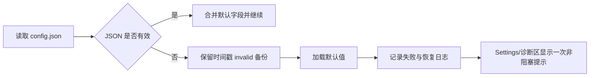

# LetsMakeMoney 当前高保真交互原型说明

## 追踪信息

- 当前状态：v0.6 完整 PRD 对照原型，待用户确认
- 当前发布基线：v0.5 Beta
- 目标版本：v0.6 Beta
- 当前分支：`main`
- 当前 tag：`v0.5-beta`
- 原型入口：`doc/prototypes/index.html`
- 需求入口：`doc/releases/v0.6/prd.md`
- 最后更新：2026-07-10

## 1. 原型目标

本原型按当前产品能力组织，不复述 v0.1 至 v0.4 的历史演进。它同时承担三种用途：

1. 展示当前 v0.5 已验证的桌宠、Panel、菜单、Settings、Wizard 和发布基线。
2. 表达 v0.6 确实存在 UI 变化的内容：轻量诊断、菜单职责、反馈状态和有限一致性修正。
3. 用流程和矩阵表达日志、脚本、托盘验收、自启动和配置恢复等非 UI 能力，避免伪造不存在的设置页面。

原型不是营销页，也不是 Godot 运行代码。开发后的界面不要求逐像素复制 HTML，但必须遵守信息层级、控件密度、状态语义和职责边界。

## 2. 当前产品地图

| 模块 | 当前基线 | v0.6 原型表达 |
|---|---|---|
| 桌宠窗口 | 透明无边框、橘猫 v2、点击穿透、托盘找回 | 保留现有结构，不做动画素材大修 |
| Panel | 暖色金币计数器和薪资便签，支持折叠/展开 | 只允许有证据的对齐、稳定尺寸和边缘定位修正 |
| 桌宠右键菜单 | 设置、向导、窗口模式、宠物、关于、退出 | 明确为桌宠上下文菜单 |
| 原生托盘菜单 | 显隐、设置、关于、退出 | 明确为窗口找回和生命周期菜单 |
| Settings | 工资、桌宠、显示、面板、通用五页签 | 通用页增加“诊断与支持”轻量区域 |
| Wizard | 欢迎、薪资、角色、确认四步 | 只修共享控件残留差异 |
| 日志 | `debug.log`，部分关键事件仅 Debug 可见 | 关键语义默认可观察、2 MB 轮换、截图按需生成 |
| 自动验证 | v0.5 脚本可能在 Parser/Error 后仍显示通过 | 阻塞错误必须非零退出 |
| 配置与自启动 | JSON 配置、Run 注册表、自启动和恢复默认已存在 | 增加损坏恢复与高信任路径验证口径 |
| 发布 | `main` 上 `v0.5-beta` 为当前基线 | v0.6 尚未进入开发、打包或发布 |

## 3. 视觉方向

继续使用“温暖桌面小挂件 / 橘猫金币小票便签风”：

- 页面和弹层：奶油底、白纸层、低透明暖棕边框。
- 文字：深咖啡主文字、暖棕辅助文字。
- 强调：金币黄；成功使用柔和绿色；失败使用克制红棕。
- 控件：紧凑、清楚、低阴影，不使用 Godot 默认深色 popup。
- 产品气质：可爱但不幼稚，像桌面偏好小工具，不像后台管理系统。

v0.6 不建立主题系统，不增加第三套视觉语言，也不重新设计 Settings / Wizard 结构。

## 4. 原型导航

| 视图 | 用途 |
|---|---|
| 总览 | 当前桌宠、Panel 和透明窗口关系 |
| 桌宠主界面 | 小猫状态、互动、拖拽和穿透边界 |
| Panel 便签 | 折叠/展开和屏幕边缘状态 |
| 右键菜单与托盘 | 当前菜单和二级入口 |
| 设置面板 | 五页签和通用页诊断入口 |
| 首次向导 | 四步配置流程 |
| 共享控件基线 | v0.5 已验证的控件、保存反馈与恢复基线 |
| v0.6 诊断与验证 | v0.6 新增或变化的真实产品/验收表达 |
| Debug 与验证 | 输入日志和调试窗口用途 |
| 发布包 | 当前 v0.5 发布基线和 v0.6 阶段状态 |

## 5. 当前功能交互

### 5.1 桌宠与 Panel

原型快捷按钮可以：

- 展开或收起 Panel。
- 在工作中、休息中和待机中切换。
- 模拟小猫点击反馈。
- 预览 Panel 靠近右侧或底部时的位置变化。

真实应用继续保护：

- hover、单击、双击、长按、拖拽和右键菜单。
- 小猫和 Panel 为交互区域，其余透明区域尽量穿透。
- Panel 展开不遮挡小猫，靠近屏幕边缘时改变展开方向。

### 5.2 桌宠右键菜单

```text
隐藏到托盘
────────
设置
重新运行向导
窗口模式 >
  置顶悬浮
  融入桌面（实验）
选择宠物 >
  橘猫 v2
  橘猫 v1
  小猫旧素材
────────
关于 LetsMakeMoney
退出
```

该菜单服务桌宠当前上下文。窗口模式和选择宠物继续使用二级入口。

### 5.3 原生托盘菜单

```text
显示窗口 / 隐藏窗口
────────
设置
关于 LetsMakeMoney
────────
退出
```

该菜单服务窗口找回和生命周期。托盘不增加向导、宠物选择、窗口模式或诊断入口。设置、关于和退出在两个菜单中重复是有意的可找回设计。

### 5.4 Settings

五个页签保持不变：

| 页签 | 真实设置 |
|---|---|
| 工资 | 月薪、休息模式、上班时间、下班时间、每日工作小时数 |
| 桌宠 | 当前角色 |
| 显示 | 透明度、缩放、窗口模式、纯桌宠模式 |
| 面板 | 今日已赚、本月累计、时薪、工作进度、状态 |
| 通用 | Debug、开机自启、关闭隐藏、重置位置、恢复默认、诊断与支持 |

说明性和诊断性内容继续使用低视觉权重，不作为大卡片或新的独立页签。

### 5.5 Wizard

四个步骤保持不变：

1. 欢迎。
2. 薪资、休息模式和工作时间。
3. 选择宠物。
4. 确认并完成。

v0.6 只修共享控件接入后的明确残差，不改变字段、保存逻辑或流程顺序。

## 6. v0.6 高保真视图

### 6.1 诊断与支持

入口：Settings → 通用 → 诊断与支持。

原型提供：

- “打开应用数据目录”。
- “复制诊断摘要”。
- 成功状态。
- 日志缺失状态。
- 操作失败状态。
- 禁用状态。
- 配置损坏后已恢复默认值的单次非阻塞提示。
- 脱敏摘要预览。

摘要允许展示版本、系统、配置版本、宠物 ID、运行模式、native health、日志存在性和诊断目录大小；不展示薪资、工作时间、窗口坐标、用户名、完整路径或原始日志。

反馈区域初始隐藏，操作后显示并在约 2.6 秒后自动收起，不保留“等待操作”占位。原型按钮只模拟反馈，不读取、复制或上传本机真实数据。

真实实现只有在剪贴板写入后读回内容与本次脱敏摘要完全一致时才能显示复制成功；无法写入、无法读回或内容不一致均显示失败。

### 6.2 菜单职责

“菜单职责”子视图并列展示桌宠右键菜单与托盘菜单，帮助开发和验收确认：

- 哪些能力是桌宠上下文。
- 哪些能力是窗口找回和生命周期。
- 哪些重复入口是有意保留。
- 诊断入口不进入任一菜单。

### 6.3 验证基线

该子视图用 M0 至 M4 流程表达非 UI 工程任务：

| 模块 | 内容 | 优先级 |
|---|---|---|
| M0 | 事实、版本、原型和文档同步 | P0 |
| M1 | 日志、轮换、截图门控和可信脚本退出 | P0 |
| M2 | 外部托盘脚本、菜单职责和轻量诊断 | P1 |
| M3 | 有证据的 Panel/菜单/共享控件精修 | P2 |
| M4 | 自启动、损坏配置和恢复默认专项验证 | P1 |

原型明确自动与人工验收边界：

- 自动：错误文本、退出码、PostMessage 链路、窗口显隐、任务栏样式、配置和注册表。
- 人工：真实通知区点击、真实注销/重启、2K 显示清晰度和整体视觉观感。

### 6.4 体验对照

体验对照不是自由 UI 改版清单，而是范围保护矩阵：

| 对象 | 允许 | 不允许 |
|---|---|---|
| Panel | 对齐、稳定尺寸、低幅动效、边缘定位 | 信息架构重写 |
| 小猫 | 与 Panel 间距、命中边界 | 动画帧和素材大修 |
| 菜单 | 分组、hover、checked、submenu 定位 | 新菜单框架 |
| Settings/Wizard | 共享控件状态和尺寸残差 | 结构与流程重做 |

共享控件状态采用纵向规范清单表达，每行固定为“中文状态名、单一控件示例、状态说明”。不再使用窄双列卡片混排按钮和输入框，避免中文竖排、错误态溢出和不同组件尺寸互相挤压。

任何修改都要有当前截图、日志、录屏或实际复现证据，并在开发后提供前后对照。

## 7. 状态与失败表达

原型必须覆盖以下状态：

- 控件：normal、hover、pressed、focus、disabled、selected、expanded、error。
- Settings：保存成功、无变化、保存失败。
- 诊断：打开成功、复制成功、日志缺失、失败、禁用。
- 配置：不存在、部分旧配置、损坏恢复、不可写。
- native：托盘不可用、点击穿透不可用、任务栏能力不可用。
- 验证：通过、阻塞错误失败、人工待补证。

Parser Error、Script Error、Failed to load 和 Invalid call 等阻塞错误不得与“通过”同时出现。

Settings 与 Wizard 的取消、关闭和失败状态还必须保护进入前配置与宠物运行态；Settings 保存或恢复默认涉及开机启动注册表时，失败必须执行补偿，不得只恢复界面文本。

## 8. 非 UI 流程

### 8.1 托盘自动验收


该流程不增加应用内测试 UI，也不把验证脚本放进正式发布包。

原生托盘菜单由 Windows 消息窗口显示，不属于 Godot Popup/Modal 的点击穿透暂停范围。只有桌宠右键菜单、Godot 二级 Popup、Settings 和 Wizard 需要成对的穿透暂停/恢复。

### 8.2 配置损坏恢复



### 8.3 日志与截图治理

- `debug.log` 达到 2 MB 后轮换为 `debug.log.1`。
- 只保留当前日志和一个备份。
- 普通模式不生成交互截图。
- Debug 或隔离验证环境仍可按需采集截图。
- 现有截图不自动删除。

## 9. 原型验收步骤

1. 直接打开 `doc/prototypes/index.html`。
2. 逐项切换左侧导航，确认所有图片加载。
3. 在“设置面板”切换五个页签，确认通用页包含诊断区域。
4. 在“v0.6 诊断与验证”切换四个子视图。
5. 点击“打开应用数据目录”“复制诊断摘要”以及成功/缺失/失败状态按钮。
6. 检查桌宠右键和托盘菜单条目是否符合职责表。
7. 缩窄浏览器窗口，确认卡片、菜单、表格和文字不横向溢出。
8. 确认页面没有 v0.4 测试态、test 分支、v0.4 发布包或“v0.5 待打 tag”等旧口径。

## 10. 与项目文档的对应关系

| 文件 | 用途 |
|---|---|
| `doc/current.md` | 当前项目唯一状态入口；开发 v0.6 时需要同步阶段 |
| `doc/releases/v0.6/idea-pool.md` | 九项主线来源和证据 |
| `doc/releases/v0.6/prd.md` | v0.6 范围与验收事实源 |
| `doc/prototypes/index.html` | 高保真交互与非 UI 流程表达 |
| `doc/prototypes/prototype-spec.md` | 本原型的结构、状态和范围说明 |
| `doc/releases/v0.5/verification.md` | v0.5 已验证基线和 v0.6 问题来源 |
| `doc/logs/v0.5-bugfix-log.md` | 托盘、保存失败和语义日志历史证据 |

## 11. 下一阶段门禁

完整 PRD 与本原型必须由用户确认后，才能生成：

- `doc/releases/v0.6/dev_plan_v0.6.md`
- `doc/releases/v0.6/progress_v0.6.md`

确认前不得修改业务代码、创建发布包、提交、推送或打 tag。
