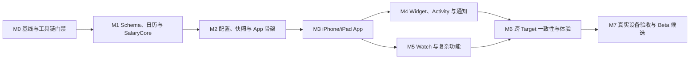

# LetsMakeMoney iOS v0.1 Beta 开发实施计划

## 追踪信息

- 当前状态：开发承接已建立，待项目所有者确认后进入实施
- 目标版本：`ios-v0.1-beta`
- 目标分支：`ios-main`
- 上游来源：`doc/releases/ios-v0.1/prd.md` 中 `FR-001` 至 `FR-014`
- 需求追踪：`doc/releases/ios-v0.1/traceability.md`
- 高保真交互原型：`doc/prototypes/ios-v0.1/index.html`
- 原型说明：`doc/prototypes/ios-v0.1/prototype-spec.md`
- 下游承接：`progress_ios-v0.1.md`、`doc/logs/dev_log_ios-v0.1.md`、后续 Acceptance
- 当前事实源：范围以 PRD 为准，实施顺序以本文为准，完成度以 progress 为准
- 最后更新：2026-07-13

## 1. 开发范围

### 1.1 版本目标

构建独立于 Windows 桌宠产品线的 Apple 首版：在 iPhone、iPad 和 Apple Watch 上，根据真实工作日、作息与午休计算今日收入和工作进度，并通过 App、Widget、Live Activity、灵动岛、Watch App 与复杂功能提供一致展示。

### 1.2 本次包含

- 纯 Swift 工资计算内核、离线节假日数据和跨端 JSON 测试向量。
- iPhone/iPad SwiftUI App、今日页、日历、设置和三步首次引导。
- App Group 配置、安全写入、损坏恢复与扩展只读快照。
- Widget、Live Activity、灵动岛、App Intents、本地通知和控制中心入口。
- Apple Watch App、WatchConnectivity、Smart Stack 与复杂功能。
- 浅色、深色、动态字体、VoiceOver、降低动态效果和简体中文本地化资源。
- `salary-schema v1` 规范与兼容测试。

### 1.3 本次不包含

- Windows 与 Apple 设备同步或配置口令导入导出。
- iCloud、CloudKit、账号、服务器、远程推送。
- 加班收入、加班时长、桌宠、主题、更多宠物和英文界面。
- macOS、Android 或其他平台客户端。

### 1.4 范围与环境保护

- Apple 实现统一放入仓库根目录 `apple/`，并在 `ios-main` 分支开发；不得改写 Windows 工资计算、Godot 场景、native DLL 或 Windows 发布链路。
- 可跨产品线共享的内容仅限 `salary-schema v1`、测试向量、节假日数据来源说明和算法契约。
- 首版优先使用 Apple 系统框架，不引入第三方依赖；新增依赖必须先完成必要性和许可证审查。
- Windows 当前环境可以编写文档、JSON 数据、跨端校验脚本和 Swift 源码，但不能作为 Apple Target 构建通过证据。
- iPad Swift Playgrounds 仅承担 App/计算原型门禁；Widget、Activity、Watch、多 Target、签名和 TestFlight 必须在 macOS/Xcode 环境验证。

## 2. 环境门禁

| 门禁 | 适用阶段 | 通过标准 | 当前状态 | 失败处理 |
| --- | --- | --- | --- | --- |
| G0 文档与契约 | M0 | PRD、原型、schema 边界和目录结构一致 | 可立即执行 | 阻止业务实现，回补文档 |
| G1 Swift 内核可执行 | M1 | `SalaryCore` 与测试向量在可用 Swift 工具链通过 | 待建立 | 允许继续数据准备，不允许接 UI |
| G2 iPad Playgrounds 可行性 | M2 前 | iPad 可打开 App 原型并运行计算快照 | 待真实 iPad 补证 | 若能力不足，转 macOS/Xcode，不伪造通过 |
| G3 macOS/Xcode 多 Target | M4 前 | App、Widget、Activity、Watch schemes 可构建测试 | 当前缺少环境 | 阻塞 M4-M7，不阻塞 M0-M3 的设计与纯模块 |
| G4 开发者签名 | M7 | App Group、Activity、Watch 与真机 entitlement 生效 | 待 Apple Developer Program | 阻塞完整 Beta，不阻塞本地内核开发 |
| G5 真实设备 | Acceptance | iPhone 16 Pro Max、iPad Pro M4、Watch Series 10 通过人工验收 | 待实现后执行 | 未补证不得发布完整 Beta |

## 3. PRD 对照

| PRD 需求 | 开发模块 | 主要里程碑 | 验收入口 |
| --- | --- | --- | --- |
| FR-001 工资计算内核 | `SalaryCore` | M1 | 单元测试、跨端测试向量 |
| FR-002 作息与工作日日历 | `SalaryCore`、配置模型 | M1、M2 | 规则组合与保存验证 |
| FR-003 三步首次引导 | App SwiftUI | M3 | UI 测试、真实设备操作 |
| FR-004 今日页与 iPad 布局 | App SwiftUI | M3 | Preview、尺寸矩阵、真机 |
| FR-005 日历与日期覆盖 | App、配置、计算内核 | M1、M3 | 优先级、保存/删除/取消测试 |
| FR-006 Widget | Widget Extension | M4 | 快照、时间线、尺寸矩阵 |
| FR-007 Live Activity 与灵动岛 | ActivityKit、Widget Extension | M4 | 状态机、权限、锁屏/灵动岛真机 |
| FR-008 Apple Watch App | Watch App、WatchConnectivity | M5 | 在线、离线、重连、跨日 |
| FR-009 Watch 复杂功能 | watchOS Widget Extension | M5 | 表盘族、Smart Stack、常亮 |
| FR-010 通知与系统快捷操作 | UserNotifications、App Intents | M4 | 权限、撤销、手动入口 |
| FR-011 配置、恢复与共享快照 | `LocalStore`、App Group | M2 | 安全写入、损坏、并发读取 |
| FR-012 外观与辅助功能 | Design System、全部 Targets | M3-M6 | 深浅色、动态字体、VoiceOver |
| FR-013 本地化结构 | String Catalog、全部 Targets | M2-M6 | 静态扫描、中文截断检查 |
| FR-014 salary-schema v1 | Schema、Codable、JSON vectors | M0-M1 | 双端解析与非法数据拒绝 |

## 4. 目标目录与模块

| 目标路径 | 职责 | 首次建立 |
| --- | --- | --- |
| `apple/README.md` | Apple 工程入口、环境与运行说明 | M0 |
| `apple/Packages/SalaryCore/` | 纯 Swift 计算、日历规则、不可变快照 | M1 |
| `apple/Shared/Models/` | 配置、快照、Activity、Watch Codable 模型 | M1-M2 |
| `apple/Shared/Resources/` | 节假日数据、String Catalog、共享颜色与图标 | M1-M3 |
| `apple/App/` | iPhone/iPad SwiftUI App、导航、设置、引导 | M2-M3 |
| `apple/WidgetExtension/` | 桌面/锁屏 Widget 与 Activity UI | M4 |
| `apple/WatchApp/` | Watch UI 与连接协调 | M5 |
| `apple/WatchWidgetExtension/` | 复杂功能与 Smart Stack | M5 |
| `apple/Tests/` | 集成、快照、配置与跨 Target 测试 | M1-M6 |
| `shared/salary-schema/v1/` | 跨端 schema、测试向量和说明 | M0-M1 |
| `scripts/apple/` | 数据校验、测试、构建、包身份和文档检查 | M0-M7 |
| `doc/releases/ios-v0.1/` | PRD、计划、进度、验证与发布事实 | 全程 |

Xcode 工程或 workspace 的实际生成方式由 M0 可行性 Spike 固定。不得在 Windows 上手写不可验证的 `.xcodeproj` 内容冒充可构建工程。

## 5. 实施顺序



- M0、M1 必须串行，先固定契约再实现算法。
- M2 依赖 M1 的配置与快照模型；M3 依赖 M2 的可靠存储。
- M4 与 M5 可在 M3 主路径稳定后并行，但都依赖 G3 macOS/Xcode 门禁。
- M6 统一跨 Target 状态、视觉和可访问性，不能在各 Target 尚未闭环时提前宣称完成。
- M7 只基于锁定构建和真实设备证据判断，缺少环境时保持“待补证”。

## 6. 里程碑任务拆解

### IOS01-M0 基线、分支与可行性

- 目标：建立独立 Apple 开发边界、目录契约和可执行环境门禁。
- 影响：分支策略、`apple/`、`shared/salary-schema/v1/`、`scripts/apple/`、开发文档。
- 关键任务：
  1. 记录当前 Windows `main` HEAD 与脏工作区，待用户授权后从确认基线创建 `ios-main`。
  2. 建立 Apple 目录说明，不复制 Windows 业务实现。
  3. 固定目标系统、Swift/Xcode 版本策略、bundle ID 与 App Group 占位配置；真实 Team ID 不提交。
  4. 在 iPad Swift Playgrounds 做 App/Package 能力 Spike，记录可做、不可做和迁移方式。
  5. 明确 Xcode workspace、Targets、Schemes、entitlements 与签名材料边界。
  6. 建立跨平台只读 schema/文档校验入口。
- 验证：目录边界扫描、绝对路径/秘密扫描、Markdown 链接、UTF-8、原型交互回归。
- 完成标准：G0 通过；G1/G2/G3/G4 的状态与责任人明确；未拥有的环境不写成通过。

### IOS01-M1 Schema、节假日与工资计算内核

- 目标：先得到可独立验证、无 UI 依赖的可信计算事实源。
- 影响：FR-001、FR-002、FR-005、FR-014；`SalaryCore`、JSON schema、节假日数据、测试向量。
- 关键任务：
  1. 定义 `salary-schema v1` JSON Schema、合法/非法样例和未知字段策略。
  2. 生成 2025-2027 中国大陆节假日/调休数据，记录官方来源、版本和校验和。
  3. 建立双休、单休、大小周锚点和手动覆盖优先级模型。
  4. 以整数最小货币单位实现月工作日、日薪、小时工资、今日收入和本月累计。
  5. 用本地时间和时区明确跨日、夏令时变化及当前时刻快照输入。
  6. 覆盖闰年、月工作日为 0、无效午休、越界年份、大小周无锚点、非计薪覆盖。
  7. 让 Swift 与跨端校验脚本读取同一组 JSON vectors。
- 验证：`swift test --package-path apple/Packages/SalaryCore`（有 Swift 环境时）、跨端 JSON 校验、变异样例失败测试。
- 完成标准：G1 通过；所有金额和状态输出可解释且不依赖 UI/系统扩展。

### IOS01-M2 配置、安全写入与共享快照

- 目标：建立 App、Widget、Activity 和 Watch 可共同依赖但权限清晰的数据层。
- 影响：FR-002、FR-011、FR-013、FR-014；App Group、Codable 模型、日志、迁移。
- 关键任务：
  1. 建立 `AppConfiguration`、`SalarySnapshot`、`ActivityState`、`WatchSnapshot` 模型。
  2. 实现草稿校验、无变化判断、临时文件写入、读回校验和原子替换。
  3. 损坏配置保留副本、恢复默认并给出可读提示。
  4. Widget/Activity 只读快照，禁止扩展直接修改主配置。
  5. Watch 只接收 iPhone 快照，不成为配置事实源。
  6. 建立结构化本地日志、轮换、路径和隐私脱敏规则。
  7. 建立 String Catalog，禁止主要用户文案散落硬编码。
- 验证：保存成功、无变化、失败、损坏、迁移、并发读、App Group 权限失败测试。
- 完成标准：配置失败不污染最后有效配置，所有 Target 获得同一快照身份。

### IOS01-M3 iPhone/iPad App、引导与日历

- 目标：实现用户可完整配置并理解工资计算的主 App。
- 影响：FR-003、FR-004、FR-005、FR-012；SwiftUI 导航、设计 Token、设置、引导、日历。
- 关键任务：
  1. 建立与原型一致的暖色设计 Token、共享控件状态和图标策略。
  2. 实现三步引导及下一步、上一步、取消、关闭、完成失败和重试。
  3. 实现 iPhone 今日/日历双标签与设置入口。
  4. 实现 iPad 横屏侧栏双栏、竖屏/窄分屏紧凑布局，保留今日安排。
  5. 实现日期详情、覆盖保存、删除、取消和影响摘要确认。
  6. 覆盖未配置、配置错误、越界年份、上班前、工作、午休、下班、休息日状态。
  7. 接入浅深色、动态字体、VoiceOver、降低动态效果和高对比度。
- 验证：SwiftUI Preview、UI 自动化、尺寸矩阵、iPhone/iPad 真机走查。
- 完成标准：App 主路径可独立使用；原型关键交互均有真实实现和错误出口。

### IOS01-M4 Widget、Live Activity、通知与快捷操作

- 目标：实现 Apple 生态高频入口，并保持系统限制下的信息诚实。
- 前置：G3、M2、M3 通过。
- 影响：FR-006、FR-007、FR-010、FR-012；WidgetKit、ActivityKit、App Intents、UserNotifications。
- 关键任务：
  1. 实现桌面小/中/大 Widget 和必要锁屏 accessory families。
  2. 建立时间线、最后更新时间、未配置、损坏和过期快照状态。
  3. 实现 Live Activity 工作、午休、完成和提前结束状态机。
  4. 用时间锚点与费率推导展示，不使用持续后台秒级定时器。
  5. 实现灵动岛紧凑/最小/展开区域与窄宽度降级。
  6. 实现通知首次请求、拒绝、撤销、系统设置跳转，不重复骚扰。
  7. 实现 App、Widget、控制中心和 App Intent 手动启停入口。
- 验证：快照测试、时间线测试、状态机单测、权限矩阵、锁屏/灵动岛真机。
- 完成标准：拒绝通知时手动入口仍可用；系统限流不产生错误金额或虚假秒级承诺。

### IOS01-M5 Apple Watch 与复杂功能

- 目标：让 Watch 成为只读进度伴侣和经 iPhone 确认的操作入口。
- 前置：G3、M2、M3 通过。
- 影响：FR-008、FR-009、FR-012；Watch App、WatchConnectivity、watchOS Widget。
- 关键任务：
  1. 实现今日收入、状态、安排、最近同步时间和指标切换。
  2. 工作态显示距离下班，午休态显示距离复工。
  3. 实现启动/结束 Activity 请求、iPhone 确认、超时和失败反馈。
  4. 实现离线快照、禁用操作、重连同步、跨日和重启恢复。
  5. 实现复杂功能与 Smart Stack 的指标 App Intent。
  6. 覆盖常亮显示、浅深色、数字可读性和 Series 10 尺寸。
- 验证：WatchConnectivity 编码与重试测试、模拟器、配对真机、表盘与 Smart Stack 人工检查。
- 完成标准：Watch 不伪造操作成功、不修改配置，离线状态有明确时间戳。

### IOS01-M6 跨 Target 一致性、质量与隐私

- 目标：消除 App、Widget、Activity 和 Watch 的事实与体验漂移。
- 影响：FR-001 至 FR-014 的集成验证、日志、辅助功能和文档。
- 关键任务：
  1. 为同一配置/时刻生成跨 Target 快照并比较金额、状态和进度。
  2. 检查 App Group 配置版本、节假日数据版本和快照身份。
  3. 扫描硬编码用户文案、乱码、未脱敏路径和敏感日志。
  4. 执行浅色、深色、动态字体、VoiceOver、降低动态效果矩阵。
  5. 执行时区变化、跨日、锁屏、重启、低电量和系统限流回归。
  6. 更新用户说明、已知限制、隐私说明与人工验证文档。
- 验证：自动集成、UI 测试、静态扫描、真实设备证据。
- 完成标准：所有 Target 对相同快照事实一致；不存在阻塞性可访问性或隐私问题。

### IOS01-M7 候选构建、真实设备验收与 Beta 收口

- 目标：基于锁定构建判断完整 Apple Beta 是否可发布。
- 前置：G4、M0-M6 通过。
- 影响：归档、签名、TestFlight、验证文档、release notes、tag。
- 关键任务：
  1. 锁定分支、HEAD、Xcode/SDK、签名身份、构建号和候选归档哈希。
  2. 在 iPhone 16 Pro Max 验收 App、Widget、Live Activity、灵动岛和通知。
  3. 在 iPad Pro M4 验收横竖屏、分屏、窗口尺寸和 Widget。
  4. 在 Watch Series 10 验收在线、离线、重连、复杂功能和 Smart Stack。
  5. 验收配置损坏、失败写入、跨日、重启、时区变化和低电量路径。
  6. 完成 TestFlight 外部 Beta 前隐私、权限、截图、描述和已知限制检查。
  7. Acceptance 通过后再等待用户授权 commit、push、tag 与发布。
- 验证：自动门禁 + Computer Use/模拟器 + 真实设备人工证据；未执行项只能写待补证。
- 完成标准：PRD 15.4 全部闭合，完整四类产品形态均无发布阻塞。

## 7. 测试与验收计划

### 7.1 自动化层

- Schema：合法/非法 JSON、未知字段、版本迁移、跨端测试向量。
- SalaryCore：月份边界、闰年、单双休、大小周、节假日、覆盖、午休、金额舍入。
- Storage：安全写入、无变化、失败、损坏、并发读、迁移和默认恢复。
- Extensions：Widget 快照/时间线、Activity 状态、App Intent、Watch 消息编码与重试。
- UI：引导、设置、日期覆盖、导航、权限拒绝、错误反馈和无障碍标识。
- 静态：本地化、UTF-8、隐私路径、秘密、硬编码文案、第三方依赖与许可。

### 7.2 目标验证入口

计划建立以下脚本；创建前不得把命令写成已通过：

```text
scripts/apple/check_schema.ps1       # Windows 可运行的 schema/JSON 校验
scripts/apple/verify_docs.ps1        # 文档、UTF-8、链接和范围扫描
scripts/apple/test_salary_core.sh    # macOS/Swift 工具链
scripts/apple/test_ios.sh            # iOS/iPadOS schemes
scripts/apple/test_extensions.sh     # Widget/Activity/App Intents
scripts/apple/test_watch.sh          # Watch schemes
scripts/apple/package_beta.sh        # 锁定归档与身份清单
```

### 7.3 人工验证

- iPhone：首次引导、今日、日历、设置、通知、Widget、锁屏、灵动岛。
- iPad：横屏 B+C、竖屏、分屏、今日安排保留、Widget。
- Watch：指标切换、今日安排、活动启停、离线、重连、复杂功能。
- 通用：浅深色、动态字体、VoiceOver、降低动态效果、时区与跨日。

### 7.4 回归范围

- Windows `main`、Godot 项目和 v0.7 发布产物仅做无差异/未受影响确认，不因 Apple 开发重复 Windows 全量验收。
- 共享 schema 或测试向量变化会使 Swift 与 Windows 对应契约证据失效，必须双端重测。
- Apple 任一 Target 改动只重开受影响 Target 与跨 Target 一致性测试；候选归档重建后产物身份类证据全部失效。

## 8. 开发日志约定

- 开发过程统一记录到 `doc/logs/dev_log_ios-v0.1.md`。
- 明确缺陷另建 `doc/logs/bugfix_log_ios-v0.1.md`，技术可行性探索另建 `doc/logs/spike_log_ios-v0.1.md`。
- `progress_ios-v0.1.md` 只记录任务状态、阻塞、最近验证和下一步，不记录排查流水。
- 每轮实施结束同步：完成任务 ID、验证结果、证据状态和失效条件。

## 9. 风险与回退

| 风险 | 影响 | 触发条件 | 回退/处理 |
| --- | --- | --- | --- |
| 无 macOS/Xcode | 多 Target、签名和 TestFlight 不可验证 | M4 开始前仍无环境 | 停在 M3 以前的可验证成果；取得云 Mac/实体 Mac 后继续 |
| Swift Playgrounds 能力不足 | iPad 原型无法承载预期结构 | G2 Spike 失败 | 保留纯 Swift Package 与原型，转 Xcode 工程，不维护两套业务实现 |
| 工资算法错误 | 破坏产品信任 | 测试向量或真实月份不一致 | 回退到最后通过的 SalaryCore commit，阻断全部展示层发布 |
| 节假日数据不可靠 | 工作日和日薪错误 | 来源/校验和缺失或年份越界 | 阻止数据更新；越界使用周休回退并明确提示 |
| App Group/并发读写失败 | Widget/Activity 读取脏配置 | 安全写入或快照测试失败 | 扩展只显示最后有效快照，禁止直接读取半成品 |
| 系统刷新受限 | 用户误解为实时失效 | Widget/Activity 刷新延迟 | 使用时间锚点和最后更新时间；不承诺每秒刷新 |
| WatchConnectivity 延迟 | 操作状态不确定 | 请求超时或离线 | 禁用/超时提示，不做乐观成功；保留最近快照 |
| 范围膨胀 | 首版无法闭环 | 加入同步、加班、宠物或主题 | 返回 PRD；不进入 ios-v0.1 实施 |

## 10. 当前开放问题与决策点

| 决策点 | 最晚确认时间 | 当前处理 |
| --- | --- | --- |
| Apple Developer Program 账号与 Team ID | M4 前 | 不提交真实 Team ID；缺少时阻塞 G4 |
| 可用 macOS/Xcode 环境 | M4 前 | M0 调研云 Mac/借用 Mac/后续购置，暂不假定已具备 |
| Bundle ID 与 App Group 正式值 | M2 前 | 先用文档占位，签名前由项目所有者确认 |
| 节假日官方数据维护责任 | M1 | 首版固定 2025-2027 数据版本，后续更新不自动联网 |
| TestFlight 内测成员与隐私信息 | M7 | 到候选验收阶段再确认，不影响 M0-M3 |

## 11. 开发承接完成标准

- [x] FR-001 至 FR-014 均映射到里程碑和验收入口。
- [x] 原型交互与实现任务存在对应关系。
- [x] Windows、iPad Playgrounds、macOS/Xcode 的证据边界已拆开。
- [x] 环境门禁、真实设备门禁和失败处理已定义。
- [x] 影响目录、实施顺序、验证、风险和回退已明确。
- [x] 加班、同步、宠物、主题和其他平台未进入实施范围。
- [ ] 项目所有者确认本文与 progress 后授权进入实施。
