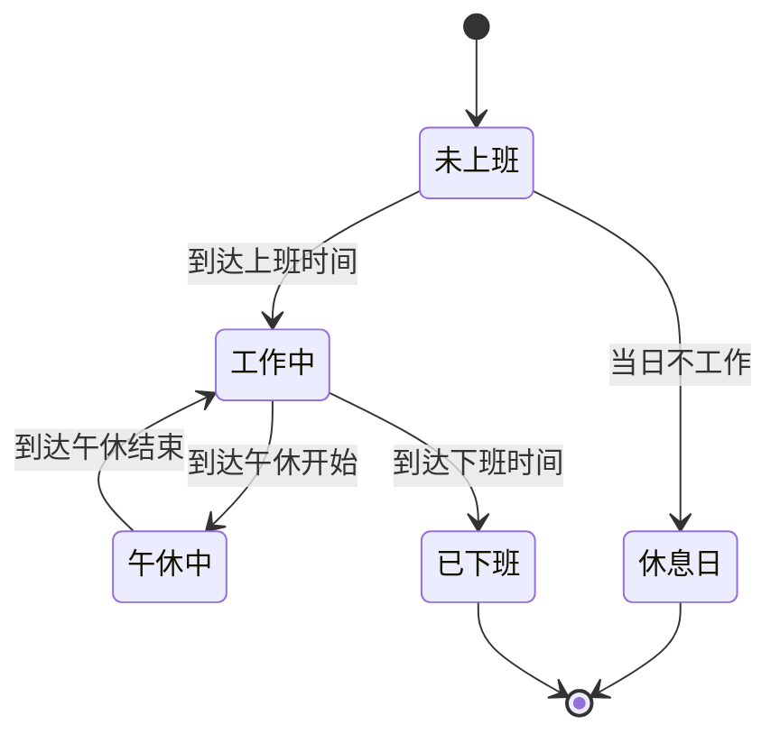
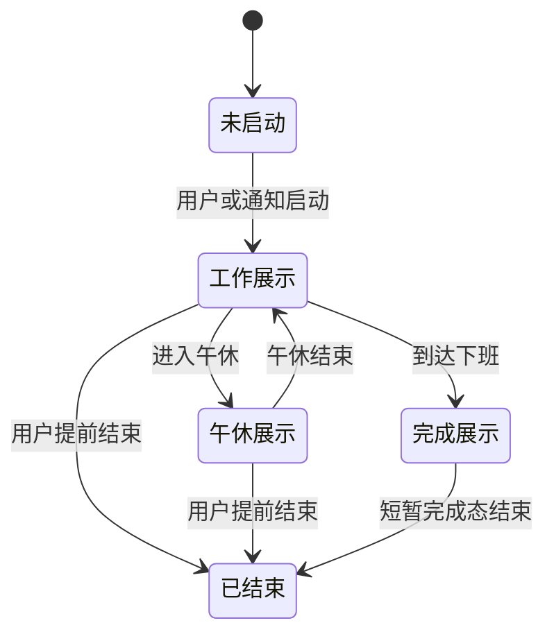

# LetsMakeMoney iOS v0.1 Beta 产品需求文档

## 追踪信息

- 当前状态：完整 PRD 已确认，进入开发承接
- 目标版本：`ios-v0.1-beta`
- 产品线：Apple 平台独立产品线
- 目标分支：`ios-main`（开发承接阶段创建）
- 上游来源：2026-07-13 iOS 产品探索、原型选择与需求确认
- 需求追踪：`doc/releases/ios-v0.1/traceability.md`
- 高保真原型：`doc/prototypes/ios-v0.1/index.html`
- 下游承接：`dev_plan_ios-v0.1.md`、`progress_ios-v0.1.md`
- 当前事实源：本文档
- 最后更新：2026-07-13

## 1. PRD 类型与成熟度

- PRD 类型：正式推进型
- 产品成熟度：首版 Beta
- 证据基础：Windows 版本已验证工资进度需求；项目所有者同时是目标设备用户，并已完成多轮范围、计算口径、设备形态与原型确认
- 原型门禁：已提供 iPhone、iPad、Widget、Live Activity 和 Apple Watch 的交互原型
- 开发授权：已获得开发承接授权；业务实现需在开发承接文档确认后开始

## 2. 背景与问题

LetsMakeMoney Windows 版将抽象的月薪换算为实时增长的今日收入，让工作时间具有可感知的反馈。Apple 设备具备 Widget、Live Activity、灵动岛和 Apple Watch 等高频、低打扰入口，适合把这一价值扩展为无需持续打开 App 的个人效率工具。

iOS 首版不复制 Windows 桌宠形态，而是解决三个更核心的问题：

1. 用户无法直观看到当前工作日已经赚取多少收入。
2. 现有计算容易忽略真实工作日、法定节假日、调休和午休，导致结果失真。
3. 用户需要在手机、平板、锁屏和手表之间快速查看同一份工作进度，但不希望注册账号或依赖服务器。

## 3. 产品定位

### 3.1 一句话介绍

一款在 Apple 设备上按真实工作日和有效工作时间，实时展示今日收入与工作进度的本地效率工具。

### 3.2 目标用户

- 使用月薪制、希望感知每日劳动回报的职场用户。
- 使用 iPhone、iPad 或 Apple Watch，希望低打扰查看工作进度的用户。
- 重视隐私，不愿为基础工资计算注册账号或上传数据的用户。

### 3.3 核心场景

- 上班后从 Widget、锁屏、灵动岛或手表查看今日已赚。
- 午休期间查看距离复工的时间，而不是看到错误增长的收入。
- 在日历中查看本月真实工作日，并修正特殊工作安排。
- 在 iPad 横屏中同时查看今日详情和月度工作日概览。

## 4. 版本目标与成功标准

### 4.1 版本目标

建立一条完整的 Apple 本地产品链路：配置工资与作息，按真实日历计算收入，通过 App、Widget、Live Activity 和 Apple Watch 持续展示，并在无网络、通知受限或 Watch 离线时可解释地降级。

### 4.2 成功标准

1. 给定相同配置和日期，Swift Salary Engine 与跨端 JSON 测试向量结果一致。
2. 午休、休息日、节假日和非计薪覆盖不会产生错误收入。
3. App、Widget、Live Activity 与 Watch 展示同一计算口径。
4. 用户拒绝通知后仍能手动使用 Live Activity。
5. Watch 离线时不伪造操作成功，并可显示最近同步快照。
6. iPhone 16 Pro Max、iPad Pro M4 和 Apple Watch Series 10 的真实设备主链路通过验收。
7. 浅色、深色、动态字体和 VoiceOver 均不存在阻塞性可用问题。

## 5. 方案收敛

### 5.1 候选方案

| 方案 | 范围 | 优点 | 代价 | 结论 |
| --- | --- | --- | --- | --- |
| 最小方案 | 仅 iPhone App | 最快验证计算 | 缺少高频入口，产品价值偏弱 | 不采用 |
| 标准方案 | App + Widget + Live Activity | 覆盖主要日常入口 | Watch 体验缺失 | 不采用 |
| 完整首版 | App + Widget + Live Activity + Watch | 产品闭环完整，适合 Apple 生态 | 目标和验收较多 | 采用 |

### 5.2 推荐实施方式

产品范围采用完整首版，工程实施采用分阶段交付：先构建纯 Swift 计算内核和 iPhone/iPad App，再接入 Widget、Live Activity、Watch App 与复杂功能。所有模块完成后才发布 `ios-v0.1-beta`。

### 5.3 优先级

| 模块 | 优先级 | 理由 |
| --- | --- | --- |
| 工资计算、工作日与午休 | P0 | 数据错误会直接破坏产品信任 |
| 配置、日历覆盖与恢复 | P0 | 是所有展示入口的事实源 |
| iPhone/iPad App | P0 | 配置与完整信息入口 |
| Widget 与 Live Activity | P0 | 首版核心日常价值 |
| Watch App 与复杂功能 | P0 | 已确认属于完整版本门禁 |
| 浅色/深色与辅助功能 | P1 | Apple 平台基础体验要求 |
| `salary-schema v1` 兼容边界 | P1 | 为未来口令迁移避免数据模型返工 |

## 6. 版本范围

### 6.1 本次包含

- iPhone 与 iPad SwiftUI App。
- 今日页、日历页、设置与三步首次引导。
- 真实工作日、单双休、大小周、法定节假日、调休和手动覆盖。
- 默认 08:00-18:00、12:00-14:00 午休、8 小时有效工时。
- 2025-2027 年中国大陆法定节假日及调休离线数据。
- 桌面 Widget、锁屏 Widget、Live Activity、灵动岛交互。
- Apple Watch App、Smart Stack 与 WidgetKit 复杂功能。
- 本地通知、App Intents 与控制中心快捷入口。
- App Group 本地共享数据、配置备份和损坏恢复。
- 浅色与深色模式、动态字体、VoiceOver 和降低动态效果。
- 简体中文界面及本地化资源结构。
- `salary-schema v1` 规范与跨端测试向量。

### 6.2 本次不包含

- Windows 与 Apple 设备实时同步。
- 配置口令的生成、导入或二维码能力。
- iCloud、CloudKit、账号、后端或远程推送服务。
- 桌宠、小猫动画和宠物交互。
- 加班计时、加班收入或加班统计。
- 主题切换系统。
- 英文界面。
- macOS、Android 和其他平台实现。

### 6.3 延后项

- iOS v0.2：手动开始/结束加班、工作日/休息日/法定节假日倍率、加班时长与收入分类统计。
- 后续版本：配置口令导入导出、二维码、英文、本地主题系统。
- 远期规划：Windows 与 Apple 设备之间的可选同步。

## 7. 平台与技术边界

- 目标系统：iOS、iPadOS、watchOS 26.5 及以上。
- 目标设备：iPhone 16 Pro Max、iPad Pro M4、Apple Watch Series 10。
- UI：SwiftUI。
- 系统扩展：WidgetKit、ActivityKit、App Intents、UserNotifications、WatchConnectivity。
- 共享存储：App Group 本地容器。
- 阶段一工具：iPad 上的 Swift Playgrounds，仅用于 App 与计算原型。
- 完整扩展、签名和 TestFlight：需要 Apple Developer Program 与 macOS/Xcode 构建环境。

Apple 官方文档确认 Swift Playgrounds 可在 iPad 上创建 SwiftUI App；WidgetKit 用于 Widget、Watch 复杂功能和 Smart Stack；ActivityKit 管理 Live Activity；WatchConnectivity 用于 iPhone 与 Watch 双向通信。正式开发仍需在开发承接阶段锁定实际 SDK 和签名能力。

官方技术依据：

- [Swift Playgrounds](https://developer.apple.com/documentation/swift-playgrounds)
- [Widget 与 Watch 复杂功能](https://developer.apple.com/documentation/widgetkit/creating-accessory-widgets-and-watch-complications)
- [ActivityKit](https://developer.apple.com/documentation/activitykit)
- [WatchConnectivity](https://developer.apple.com/documentation/watchconnectivity)

## 8. 核心数据规则

### 8.1 规则优先级

```text
手动日期覆盖 > 法定节假日/调休数据 > 单双休/大小周规则
```

### 8.2 月工作日与日薪

```text
月工作日 = 当月所有“应工作且计薪”的日期数量
日薪 = 月薪 ÷ 月工作日
标准小时工资 = 日薪 ÷ 标准有效工时
```

禁止以固定 20 天替代真实日历工作日。

### 8.3 今日收入

```text
今日收入 = 日薪 × 今日已完成有效工作秒数 ÷ 当日有效工作总秒数
```

- 午休不计入有效工作秒数。
- 上班前今日收入为 0。
- 下班后正常收入封顶为当日应得收入。
- 休息日和非计薪日今日收入为 0。
- 所有金额内部使用高精度十进制或整数最小货币单位计算，展示时统一舍入到两位小数。

### 8.4 本月累计

```text
本月累计 = 已完成计薪日期收入总和 + 今日实时收入
```

历史日期使用保存的日历规则与有效工时计算；当月配置变化的历史重算策略在开发承接时必须固定为行为测试，首版默认按当前月配置重算，不声称是工资记账凭证。

### 8.5 大小周

- 用户选择一个已知双休周的周六作为锚点。
- 由锚点按自然周奇偶推导双休周和单休周。
- 缺少锚点时禁止保存大小周配置。

### 8.6 特殊日期覆盖

用户可覆盖：

- 工作或休息。
- 计薪或不计薪。
- 当日有效工作时长。

计薪特殊工作日按有效时长比例计算，可以低于或高于标准日薪；它不等同于加班记录。

## 9. 功能需求

### FR-001 工资计算内核

- 类型：数据 / 计算
- 入口：所有需要收入、进度和状态的模块
- 主流程：读取配置、日历日期和当前本地时间，输出日薪、今日收入、本月累计、进度和状态
- 异常：月工作日为 0、时间区间无效或配置缺失时返回结构化错误，不输出误导金额
- 出口：不可变计算快照
- 数据来源：本地配置、离线节假日数据、手动覆盖
- 影响范围：Swift Package 或共享源码模块、App、Widget、Activity、Watch、JSON 测试向量；无后端、API 和数据库影响
- 验收：边界月份、闰年、午休、节假日、大小周和覆盖测试全部通过

### FR-002 作息与工作日日历

- 类型：配置 / 数据
- 入口：首次引导、设置、日历日期详情
- 默认：双休、08:00-18:00、午休 12:00-14:00、标准有效工时 8 小时
- 保存：只有时间关系和工作日规则合法时写入
- 取消/关闭：丢弃草稿，不改变有效配置
- 异常：午休不在上下班区间内、大小周无锚点时阻止保存并定位错误
- 影响范围：配置模型、日历 UI、计算内核、Widget/Activity/Watch 快照；无数据库影响
- 验收：所有配置组合可保存、取消、重启恢复，并产生可解释计算结果

### FR-003 三步首次引导

- 类型：UI / 交互
- 步骤一：月薪、币种、休息模式和大小周锚点
- 步骤二：上下班、午休和标准有效工时
- 步骤三：本月工作日、日薪和今日示例预览，确认后保存
- 下一步：校验当前步骤；失败时停留并显示字段错误
- 上一步：保留草稿
- 取消/关闭：首次启动时要求确认退出，退出后下次仍进入引导；重新配置时取消不改变配置
- 完成失败：保留草稿并允许重试
- 影响范围：iPhone/iPad App、配置事务、计算预览、本地化文案；不影响 Widget 展示直到完成保存
- 验收：完整、返回、取消、关闭、失败重试和重启路径均有测试

### FR-004 今日页与自适应 iPad 布局

- 类型：UI / 交互
- iPhone：底部“今日/日历”标签，设置入口位于导航栏
- iPad 横屏：侧栏“今日/日历/设置”，今日页双栏展示；左栏保留金额、进度、今日安排，右栏显示月历与月度摘要
- iPad 竖屏、窄分屏：切换为紧凑标签布局
- 状态：未上班、工作中、午休中、已下班、休息日、数据越界、配置错误
- 影响范围：SwiftUI 导航、尺寸类和窗口宽度适配、设计 Token、辅助功能；无数据库影响
- 验收：所有目标尺寸无裁切，横屏不得丢失今日安排

### FR-005 日历与手动日期覆盖

- 类型：UI / 数据
- 入口：日历页、今日页月历摘要
- 展示：工作日、休息日、法定节假日、调休日和手动覆盖具有可区分但无障碍可识别的状态
- 编辑：点击日期进入详情，可修改工作/休息、计薪状态和有效工时
- 保存：二次确认影响摘要；保存后刷新当前月和所有扩展快照
- 删除覆盖：二次确认后恢复下一级规则
- 数据越界：2025-2027 之外显示提示并按周休规则回退
- 影响范围：日历 UI、配置覆盖数组、计算内核、共享快照；无后端和数据库影响
- 验收：优先级、保存、删除、取消和越界回退结果正确

### FR-006 Widget

- 类型：系统扩展 / UI
- 尺寸：小、中、大及必要的锁屏 accessory families
- 内容：小组件展示金额与状态；中组件增加进度；大组件增加今日安排
- 交互：进入对应 App 页面，并提供受系统能力支持的 Live Activity 启动入口
- 刷新：按 WidgetKit 时间线和系统预算刷新；展示最后更新时间，不承诺秒级重绘
- 空状态：未配置时引导打开 App；配置损坏时不展示错误金额
- 影响范围：Widget Extension、App Group、App Intents、共享设计 Token；无远程服务
- 验收：各尺寸浅/深模式、过期数据、未配置和交互路径通过

### FR-007 Live Activity 与灵动岛

- 类型：系统扩展 / 状态机
- 入口：上班通知、App、Widget、控制中心、Watch
- 工作态：金额、进度、距离下班时间
- 午休态：隐藏金额，显示距离复工时间
- 完成态：到下班时间自动结束，短暂显示“今日工作完成”后交由系统清除
- 提前结束：用户确认后结束
- 通知被拒绝：只关闭自动提醒，其他手动入口继续可用
- 刷新：使用时间锚点和固定费率推导当前展示，不依赖持续后台定时器
- 影响范围：ActivityKit、Widget Extension、App Intents、通知权限、App Group；无推送服务器
- 验收：启动、午休切换、提前结束、自动完成、权限拒绝和系统限流路径通过

### FR-008 Apple Watch App

- 类型：watchOS UI / 通信
- 内容：今日收入、进度、状态、今日安排和最近同步时间
- 默认主指标：工作中显示距离下班；午休中显示距离复工
- 用户切换：可在 Watch App 中改为今日收入或进度百分比
- 操作：请求 iPhone 启动或结束 Live Activity，必须等待确认
- 离线：显示最近快照；禁用操作并提示“iPhone 当前不可用”
- 影响范围：Watch App target、WatchConnectivity、共享 Codable 模型、iPhone 协调器；Watch 不成为配置事实源
- 验收：在线请求、离线降级、重连同步、跨日和重启路径通过

### FR-009 Watch 复杂功能与 Smart Stack

- 类型：WidgetKit / watchOS
- 展示：距离下班、距离复工、今日收入或进度，取决于用户选择和当前状态
- 配置：通过 App Intent 选择默认指标
- 交互：点击打开 Watch App 对应详情
- 影响范围：watchOS Widget Extension、App Intents、Watch 快照；无数据库影响
- 验收：Series 10 常用表盘族、Smart Stack、浅深/常亮和离线快照可读

### FR-010 本地通知与系统快捷操作

- 类型：系统权限 / App Intents
- 通知：用户明确授权后在上班时间提醒；拒绝后不反复弹系统授权
- 快捷操作：App、Widget、控制中心和 Watch 可请求启动 Live Activity
- 权限页：显示通知和 Live Activity 可用状态，并提供系统设置跳转
- 影响范围：UserNotifications、App Intents、控制中心控件、设置页；不涉及远程推送
- 验收：授权、拒绝、撤销、手动启动和不可用降级均可解释

### FR-011 本地配置、恢复与共享快照

- 类型：数据 / 可靠性
- 事实源：iPhone/iPad 各自的本地 App Group 配置；二者不自动同步
- 写入：临时文件、校验、替换的安全写入流程
- 损坏：保留损坏副本，恢复默认配置并提示
- 扩展：Widget 与 Live Activity 读取只读快照；Watch 读取 iPhone 同步快照
- 无变化保存：明确反馈且不重复写盘
- 影响范围：App Group、文件模型、配置迁移、日志与诊断；无数据库、后端或云服务
- 验收：成功、无变化、失败、损坏、恢复、旧 schema 升级和并发读取测试通过

### FR-012 浅色、深色与辅助功能

- 类型：UI / 可访问性
- 浅色：暖白、深咖啡与克制金币黄
- 深色：暖黑、暖灰和低饱和金色，不使用简单反色
- 支持：动态字体、VoiceOver、降低动态效果、高对比度和数字等宽展示
- 影响范围：App、Widget、Live Activity、Watch、复杂功能和正式原型
- 验收：目标设备在两种外观和常用辅助功能组合下无内容缺失或不可操作

### FR-013 本地化结构

- 类型：工程 / 文案
- v0.1 仅提供简体中文
- 所有用户可见文案进入本地化资源，不在视图中散落硬编码
- 影响范围：所有 target 的字符串资源、错误文案和辅助功能标签
- 验收：静态扫描不存在未登记的主要用户文案；中文无乱码和截断

### FR-014 `salary-schema v1` 兼容规范

- 类型：数据契约 / 未来兼容
- 本版定义可迁移基础字段、版本号、校验边界和未知字段处理
- 本版不实现口令编码、加密、签名、二维码、导入或导出 UI
- 加班字段不预埋到运行配置，仅依靠 schema 版本扩展能力支持后续版本
- 影响范围：规范文档、Codable 模型边界和跨端 JSON 测试向量；不影响当前用户操作
- 验收：Windows 与 Swift 测试实现可读取同一组基础测试向量并拒绝非法数据

## 10. 数据与配置

### 10.1 配置模型

| 字段 | 类型 | 默认值 | 说明 |
| --- | --- | --- | --- |
| `schemaVersion` | 整数 | 1 | 配置结构版本 |
| `monthlySalaryMinor` | 整数 | 无 | 最小货币单位月薪 |
| `currencyCode` | 字符串 | `CNY` | ISO 4217 货币代码 |
| `restMode` | 枚举 | `doubleWeekend` | 双休、单休、大小周 |
| `alternatingAnchor` | 日期/空 | 空 | 大小周锚点 |
| `workStart` | 本地时间 | `08:00` | 上班时间 |
| `workEnd` | 本地时间 | `18:00` | 下班时间 |
| `lunchStart` | 本地时间 | `12:00` | 午休开始 |
| `lunchEnd` | 本地时间 | `14:00` | 午休结束 |
| `standardWorkSeconds` | 整数 | `28800` | 标准有效工时 8 小时 |
| `dateOverrides` | 数组 | 空 | 特殊日期覆盖 |
| `holidayDatasetVersion` | 字符串 | 内置版本 | 节假日数据身份 |
| `notificationPreference` | 枚举 | 未请求 | 应用层权限状态快照 |
| `watchMetric` | 枚举 | `remainingTime` | Watch 默认指标 |

### 10.2 配置兼容

- 读取旧版本时执行显式迁移，迁移前保留备份。
- 遇到未来版本时拒绝覆盖，并提示需要更新 App。
- 未知字段按兼容策略忽略但保留原始输入只用于导入预览；v0.1 无导入功能。
- iPhone 与 iPad 配置相互独立，不制造隐式同步预期。

### 10.3 日志与隐私

- 日志不得记录完整月薪、用户姓名、设备账号或可恢复的配置内容。
- 允许记录 schema 版本、计算状态、权限状态、错误类别和匿名 target 名称。
- 日志仅保存在本地，并提供受控轮换。

## 11. 状态流

### 11.1 工作状态



### 11.2 Live Activity



## 12. 交互与文案要求

- 主金额使用等宽数字，最多两位小数，避免刷新时布局跳动。
- 午休态不得继续展示实时增长金额，主文案为“午休中”，辅助信息为距离复工时间。
- 数据越界文案必须明确“当前年份暂无法定节假日数据，已按每周休息规则估算”。
- Watch 离线文案必须明确“显示最近同步数据”，操作按钮显示禁用原因。
- 保存反馈区分“已保存”“没有需要保存的更改”“保存失败，修改尚未丢失”。
- 所有危险删除操作需要确认，取消后不改变数据。

## 13. 原型要求

- 正式原型：`doc/prototypes/ios-v0.1/index.html`
- 覆盖 iPhone 今日页、iPad 横屏双栏、Widget、Live Activity、Watch、引导与日历状态。
- 支持浅色/深色切换和设备视图切换。
- 原型用于信息架构和视觉方向，不模拟系统精确刷新频率。
- 实现验收以原型的信息层级、状态和交互方向为准，不要求逐像素复刻系统容器。

## 14. 总体影响范围

- UI：新增 iOS、iPadOS、watchOS SwiftUI 界面及 Widget/Activity 扩展。
- 状态：新增工作状态、Live Activity 状态、Watch 在线状态和权限状态。
- 后端/API：不涉及。
- 数据库：不涉及；使用本地版本化文件和 App Group。
- 配置：新增 Apple 独立配置模型，不修改 Windows `config.json`。
- 日志：新增本地结构化日志和隐私边界。
- 权限：通知、Live Activity、App Group、Watch 配对通信和 App Intents。
- 文件：新增 Apple 工程、离线节假日数据、测试向量和本地化资源。
- 第三方依赖：首版优先只使用 Apple 系统框架；新增依赖必须单独审查许可与必要性。
- 既有体验：Windows 主分支和发行版不得因 Apple 开发被修改；共享仅限规范和测试向量。
- 发布：Apple 产品使用独立分支和 `ios-v0.1-beta` tag，不与 Windows 版本号混用。

## 15. 开发前验收设计

### 15.1 验证层级

- L0：PRD、schema、原型和测试向量静态检查。
- L1：单元测试、SwiftUI Preview、模拟器和自动化 UI 测试。
- L2：iPhone、iPad、Apple Watch 真实设备操作。
- L3：项目所有者连续使用验证，阻塞 Beta 发布而不阻塞早期开发。

### 15.2 自动验证

- Salary Engine 全量单元测试。
- 配置安全写入、迁移和损坏恢复测试。
- Widget 快照和 Activity 状态测试。
- WatchConnectivity 模型编码、离线和重试测试。
- 本地化、深浅色、动态字体与无障碍标识静态检查。

### 15.3 必须真实设备验证

- 通知授权、拒绝和撤销。
- Live Activity、锁屏、灵动岛和系统限流表现。
- Widget 刷新、交互与 App Group 数据一致性。
- Apple Watch 在线请求、离线降级、复杂功能和 Smart Stack。
- iPad 横竖屏、分屏和窗口尺寸变化。
- 跨日、锁屏、重启、低电量和时区变化。

### 15.4 发布通过标准

- 所有 P0 功能主路径通过。
- 工资计算不存在已知金额错误。
- App、Widget、Live Activity 和 Watch 无事实不一致。
- 无配置丢失、无法恢复或隐私泄露问题。
- 所有人工必测项有实际设备证据。
- 未实现能力未在 UI、README 或发布说明中宣称支持。

### 15.5 不通过处理

- 金额、日历、配置损坏或跨 target 数据不一致：发布阻塞，必须修复并全量回归。
- Widget/Watch 单一尺寸视觉问题：评估是否阻塞对应平台发布，不得伪装通过。
- 系统限制造成的刷新延迟：若符合 Apple 平台机制且文案无误，记录为已知限制。
- 缺少 Apple Developer Program、Mac 构建环境或真实 Watch 验证：可以推进阶段一原型，但不能发布完整 Beta。

## 16. 风险与开放问题

| 风险 | 影响 | 当前处理 |
| --- | --- | --- |
| 无本地 Mac | 完整扩展、签名和设备调试受限 | 阶段一使用 Swift Playgrounds；阶段二准备云 Mac 或其他 macOS 环境 |
| Widget/Activity 刷新受系统控制 | 无法保证每秒重绘 | 使用时间锚点推导，不作秒级刷新承诺 |
| 节假日数据仅覆盖三年 | 未来年份可能估算错误 | 明确提示并回退周休规则，后续版本更新数据 |
| iPhone/iPad 配置独立 | 用户可能期待同步 | 引导和设置中明确说明，未来用配置口令解决一次性迁移 |
| WatchConnectivity 非实时 | Watch 可能显示旧快照 | 显示最近同步时间，离线禁用操作 |
| 历史收入按当前月配置重算 | 不适合作为正式工资记账 | 产品定位明确为进度估算工具；后续版本评估历史快照 |

## 17. 完整 PRD 门禁检查

- [x] 版本目标、范围、延后项和非目标已明确。
- [x] App、Widget、Live Activity 与 Watch 的入口和出口已定义。
- [x] 保存、取消、关闭、失败、无变化和恢复路径已定义。
- [x] 数据来源、配置字段、优先级和兼容边界已定义。
- [x] 每项需求均包含独立影响范围。
- [x] UI/交互已有正式高保真原型入口。
- [x] 自动验证与真实设备验收边界已定义。
- [x] 加班、同步、主题和宠物未混入 v0.1。
- [x] 项目所有者完成本文档与正式原型复核。

## 18. 下一阶段建议

项目所有者确认 PRD 与正式原型后，生成：

- `doc/releases/ios-v0.1/dev_plan_ios-v0.1.md`
- `doc/releases/ios-v0.1/progress_ios-v0.1.md`
- `doc/logs/dev_log_ios-v0.1.md`

开发承接应先锁定 Swift Package/Playgrounds 与未来 Xcode 工程之间的迁移边界，再拆解阶段零计算内核和阶段一 iPad 原型任务。
