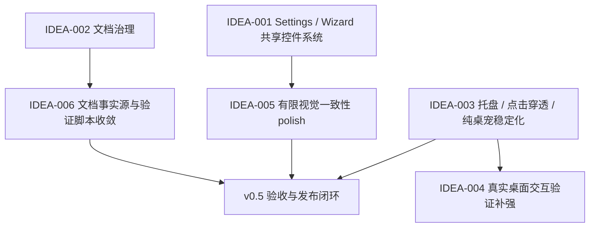

# LetsMakeMoney v0.5 Idea Pool

**阶段**: `/idea` 已完成，作为 v0.5 PRD 的输入来源。
**来源**: v0.4 review / acceptance / verification / progress / release docs
**当前用途**: 回溯 v0.5 为什么选择“偏好设置与桌宠边缘体验收敛版”。

## v0.5 主线判断

v0.5 不建议继续扩大桌宠底层能力范围。v0.4 已经把托盘、透明窗口、点击穿透、纯桌宠、Panel、Settings、Wizard、右键菜单、打包和日志体系跑通。下一版最值得做的是“收敛和统一”：把已经存在的 UI、控件、文档和验证体系整理成可维护的产品化基线。

建议主线：

> v0.5 Beta = 偏好设置与桌宠边缘体验收敛版

这不是继续加功能的版本，而是把 v0.4 最容易反复返工、最影响信任和质感的部分收束成标准。

## 为什么不是其他方向

- **主题系统**：当前真正的问题是控件不统一、窗口比例和状态不稳定，不是缺少多套主题。主题系统会放大维护成本。
- **安装器 / 自动更新**：v0.4 已有正式 zip beta 包，安装器和自动更新会引入权限、签名、回滚和安全提示等新问题。
- **更多宠物 / ComfyUI 正式化**：橘猫 v2 已可作为默认资源，ComfyUI 仍属于素材产能 Spike，不应进入 v0.5 主线。
- **多平台**：当前正式验证平台仍是 Windows x86_64。

## 候选需求总览

| ID | 候选项 | 类型 | 证据 | 价值判断 | 推荐去向 |
|---|---|---|---|---|---|
| IDEA-001 | Settings / Wizard 共享控件系统 | 体验 / UI 架构 | V04-OPT-001、V04-MAN-052 | 高价值 | 进入 PRD |
| IDEA-002 | progress 文档治理，拆出 dev-log / bugfix-log / spike-log | 文档债 | v0.4 progress 混入过程记录 | 高价值 | 现在直接做 |
| IDEA-003 | 托盘、点击穿透、纯桌宠边缘体验稳定化 | 稳定性 | V04-MAN-061 | 高价值 | 进入 PRD |
| IDEA-004 | 桌宠交互验证补强 | 验证债 | V04-MAN-072 | 中价值 | 继续验证 |
| IDEA-005 | Settings / Wizard / Panel / 菜单视觉一致性二阶段 polish | 品质 | v0.4 UI polish 多轮反馈 | 中价值 | 依赖 IDEA-001，有限进入 PRD |
| IDEA-006 | Debug 日志、验证脚本、release 文档事实源收敛 | 维护 | V04-MAN-073 与 release checklist | 中价值 | 小范围推进 |
| IDEA-007 | ComfyUI / 素材生成长期管线 | Spike | 素材探索记录 | 待验证 | 暂不做正式 v0.5 |

## 依赖关系

## 版本组合方案

### 最小方案

包含 IDEA-002、IDEA-006 的最小文档治理，以及 IDEA-004 的验证补强。不做 Settings/Wizard 共用控件和托盘稳定化。风险是用户可见体验提升有限，更像 v0.4 收尾文档版。

### 推荐方案

包含 IDEA-001、IDEA-003、IDEA-002、IDEA-006，并把 IDEA-005 限制为共享控件系统落地后的有限视觉一致性修复。推荐该方案，因为它同时解决 v0.4 暴露的两类根因：控件系统不统一，以及桌宠边缘体验需要信任兜底。

### 过大方案

在推荐方案基础上加入主题系统、安装器、自动更新、更多宠物、ComfyUI 正式素材管线和多平台支持。不推荐，范围会明显失控。

## 直接做事项：progress 文档治理

新增或维护：

- `doc/logs/README.md`
- `doc/logs/v0.4-dev-log.md`
- `doc/logs/v0.5-dev-log.md`
- `doc/logs/v0.5-bugfix-log.md`
- `doc/logs/v0.5-spike-log.md`
- `scripts/check_docs_status.ps1`

从 progress 迁出：开发流水、bugfix 根因、技术排查、素材生成 Spike、工具安装过程、临时路径。

progress 保留：版本目标、模块状态、最小任务 checklist、验收状态、发布前阻塞项。

## 分流结论

- 进入 PRD：IDEA-001、IDEA-003、IDEA-005 的有限范围、IDEA-006 的轻量范围。
- 现在直接做：IDEA-002。
- 继续验证：IDEA-004。
- 暂不做：IDEA-007、主题系统、安装器、自动更新、多平台、更多宠物。
