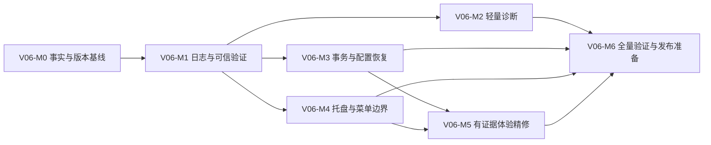

# LetsMakeMoney v0.6 Beta 开发实施计划

## 追踪信息

- 当前状态：开发承接已生成，待用户确认进入实现
- 目标版本：v0.6 Beta
- 上游来源：`IDEA-001` 至 `IDEA-009`、`FR-001` 至 `FR-009`、`REV-001` 至 `REV-010`
- 来源文件：`doc/releases/v0.6/idea-pool.md`、`doc/releases/v0.6/prd.md`
- 原型入口：`doc/prototypes/index.html`
- 原型说明：`doc/prototypes/prototype-spec.md`
- 状态看板：`doc/releases/v0.6/progress_v0.6.md`
- 开发日志：`doc/logs/dev_log_v0.6.md`
- 下游承接：`doc/releases/v0.6/verification.md`、Acceptance、Release
- 当前事实源：`doc/current.md`、本计划、`progress_v0.6.md`
- 最后更新：2026-07-10

## 1. 开发范围

### 1.1 版本目标

v0.6 是“发布后体验稳定与验证能力增强版”。实现目标不是增加大量产品功能，而是让 v0.5 已有桌宠能力更容易观察、复现、验证和维护，并完成一轮有证据边界的体验收敛。

### 1.2 本次包含

- 默认 info/debug/error 日志口径、2 MB 轮换和交互截图门控。
- 活跃验证脚本的阻塞错误识别、隔离环境和可信退出。
- 外部 PostMessage 托盘专项验收工具。
- Settings 通用页“打开应用数据目录”和“复制脱敏诊断摘要”。
- Settings 保存、恢复默认的 Config、注册表和运行态事务补偿。
- Wizard 取消、关闭和完成失败的状态恢复。
- 损坏配置备份、默认恢复和单次非阻塞提示。
- 桌宠右键菜单与原生托盘菜单职责分层。
- 有截图、日志或实机证据支持的 Panel、小猫、菜单、Settings/Wizard 有限精修。
- v0.6 文档、验证、打包和发布收口入口。

### 1.3 本次不包含

- 主题系统、安装器、自动更新或多平台支持。
- 更多宠物、宠物市场、动画素材大修。
- ComfyUI 正式产品化。
- 复杂诊断中心、远程上传、文本/Zip 诊断包。
- 应用内 tray test trigger 或可被正式用户误触的测试后门。
- Settings/Wizard 信息架构重做。
- 原生托盘菜单的 Godot Popup 穿透生命周期改造。

### 1.4 实施原则

1. 先固定版本、事实源、日志和验证基线，再开发用户可见诊断能力。
2. 先实现可恢复事务，再接入配置恢复、恢复默认和自启动专项验证。
3. 原生托盘验证使用外部脚本；现有 native 链路通过时不修改 C++。
4. UI 只修有证据差异；没有证据时以“已审查，无需修改”收口。
5. 每完成一个最小任务，同步更新 `progress_v0.6.md`；过程记录写入 `dev_log_v0.6.md`。
6. 自动化无法覆盖的 Windows 通知区、注销/登录和 2K 视觉路径保留人工验收。

## 2. PRD 与 Review 对照

| 需求 / 发现 | 开发模块 | 覆盖方式 |
|---|---|---|
| FR-001 日志与诊断产物治理 | V06-M1 | 日志等级、轮换、截图门控、语义事件 |
| FR-002 可信验证脚本 | V06-M1 | 统一错误扫描、隔离环境、非零退出 |
| FR-003 托盘外部验收 | V06-M4 | PostMessage 专项脚本、日志与窗口样式检查 |
| FR-004 事实与原型同步 | V06-M0、V06-M6 | 版本元数据、状态文档、原型和发布口径 |
| FR-005 轻量诊断 | V06-M2 | 打开目录、脱敏摘要、剪贴板读回、反馈状态 |
| FR-006 有证据体验精修 | V06-M5 | 证据矩阵、有限修改、前后截图 |
| FR-007 共享控件残差 | V06-M3、V06-M5 | 事务出口保护、控件状态和代表页回归 |
| FR-008 菜单职责分层 | V06-M4、V06-M5 | 菜单条目、二级菜单、穿透边界 |
| FR-009 高信任路径 | V06-M3 | 自启动、配置恢复、恢复默认、事务补偿 |
| REV-001 | V06-M3 | Config、注册表、宠物和窗口运行态补偿 |
| REV-002 | V06-M3 | Wizard 进入前快照和取消/失败恢复 |
| REV-003 | V06-M4 | Godot Popup/Modal 与原生托盘边界 |
| REV-004 | V06-M2 | 剪贴板写入后完整读回判定 |
| REV-005 | V06-M3、V06-M6 | 保存/取消/关闭/失败验收矩阵 |
| REV-006 | V06-M2、V06-M3 | 默认隐藏反馈和配置恢复提示 |
| REV-007 | V06-M1、V06-M6 | v0.4/v0.5/v0.6/M4/M5 活跃脚本治理 |
| REV-008 | V06-M0 | idea-pool 与 PRD 的轻量诊断口径统一 |
| REV-009 | V06-M0 | `application/config/version` 单一来源 |
| REV-010 | V06-M2 | `debug.log` 后 `debug.log.1` 有界扫描 |

## 3. 文件与模块影响

| 模块 / 文件 | 预计改动 | 说明 |
|---|---|---|
| `project.godot` | 修改 | 增加并维护 `application/config/version="0.6-beta"` |
| `src/autoload/platform.gd` | 修改 | 日志等级、轮换、失败降级和语义日志入口 |
| `src/autoload/config.gd` | 修改 | 配置恢复状态、invalid 备份、可验证持久化和事务辅助 |
| `src/autoload/pet_manager.gd` | 按需修改 | 提供可验证的当前宠物读取/恢复能力，不改状态模型 |
| `src/scenes/settings/settings_dialog.gd` | 修改 | 诊断区域、事务保存、恢复默认、取消/关闭和反馈 |
| `src/scenes/wizard/wizard_dialog.gd` | 修改 | 进入前快照、预览、取消/关闭/失败恢复和反馈 |
| `src/scenes/main/main.gd` | 修改 | info 语义日志、窗口策略、Popup/Modal 穿透回归 |
| `src/autoload/drag_resize_system.gd` | 按需修改 | 菜单职责、About 版本读取、Modal/Popup 信号回归 |
| `src/scenes/panel/panel.gd` | 证据触发 | 只修已确认的 Panel 体验差异 |
| `src/scenes/pet/pet.gd` | 修改 | 普通模式关闭交互截图；Debug/隔离验证保留 |
| `src/ui/warm_control_theme.gd` | 证据触发 | 只修 Settings/Wizard 共享控件残差 |
| `src/platform/windows_platform.gd` | 按需修改 | native health、任务栏/托盘日志、自启动真实状态 |
| `native/windows/src/*` | 条件性修改 | 只有真实验证失败且 GDScript 无法修复时进入 bugfix |
| `scripts/verification_common.ps1` | 预计新增 | 活跃脚本共享隔离、输出捕获、阻塞错误扫描和退出处理 |
| `scripts/verify_v06.gd/.ps1` | 新增 | v0.6 合同与主验证入口 |
| `scripts/verify_v06_tray.ps1` | 新增 | 外部 PostMessage 托盘专项验证 |
| `scripts/verify_v06_config.ps1` | 新增 | 配置、自启动、事务补偿专项验证 |
| `scripts/package_v06.ps1` | 新增 | 生成 v0.6 Windows x86_64 包体 |
| `scripts/verify_v06_package.ps1` | 新增 | manifest、checksum、包结构和烟测 |
| `scripts/check_docs_status.ps1` | 修改 | v0.6 版本、分支、tag、状态和旧口径扫描 |
| `doc/releases/v0.6/*` | 新增/更新 | status、verification、release checklist、发布说明入口 |
| `doc/current.md`、`README.md` | 分阶段更新 | 开发态与发布态事实同步 |
| `doc/prototypes/*` | 已更新/按证据更新 | 高保真原型和状态说明 |

## 4. 实施顺序



- 必须串行：M0 → M1；M1 完成前不得依赖新日志做专项验收。
- 可并行：M2、M3、M4 在 M1 完成后可并行，但同一文件的修改需顺序合并。
- M5 必须等待菜单职责与事务出口稳定，避免视觉修改掩盖行为问题。
- M6 只做验证、包体和事实同步，不新增功能。

## 5. 任务拆解

### V06-M0：事实、版本与开发基线

- 目标：让开发、运行、打包和文档使用同一 v0.6 事实。
- 实施要点：
  1. 在 `project.godot` 建立 `application/config/version`。
  2. 提供 Godot 和 PowerShell 的统一读取方式。
  3. 更新 `doc/current.md` 为 v0.6 开发态并建立版本文档入口。
  4. 扩展文档扫描，禁止旧 test/v0.4/待打 v0.5 tag 口径回流。
  5. 创建 v0.6 status、verification 和 release checklist 文档壳。
- 验证：版本值在 About、启动日志、诊断摘要模拟和 manifest 生成路径中可追溯到同一字段。
- 完成标准：M0 文档扫描通过，未修改 v0.5 历史结论。

### V06-M1：日志治理与可信验证

- 目标：普通模式可观察，验证脚本不能带阻塞错误报告通过。
- 实施要点：
  1. 重构日志写入为 info/debug/error，保留兼容 wrapper。
  2. 实现 2 MB 轮换，只保留 `debug.log` 和 `debug.log.1`。
  3. 日志目录/轮换失败写标准错误，但不阻塞桌宠主流程。
  4. 把 PRD 白名单语义事件提升到 info，坐标/命中/逐帧保留 debug。
  5. 普通模式停止交互截图，Debug 或隔离验证环境保留。
  6. 建立 PowerShell 共享验证 helper，统一隔离 APPDATA、输出捕获、错误扫描和退出码。
  7. 迁移 v0.4、v0.5、v0.6、M4、M5 和包验证入口；不迁移 v0.1-v0.3。
- 验证：注入 Parser Error、Script Error、autoload 失败和 Invalid call 时均非零退出；正常输出只出现一次通过摘要。
- 完成标准：真实用户 APPDATA 不变化，现有 `verify_v05.ps1` 的假通过被消除。

### V06-M2：轻量诊断与脱敏摘要

- 目标：用户可以安全打开数据目录和复制可核验的脱敏摘要。
- 实施要点：
  1. 在 Settings 通用页接入两个动作和默认隐藏反馈。
  2. 打开目录前确保目录存在，并按返回码显示成功/失败。
  3. 使用字段白名单生成摘要，禁止薪资、时间、坐标、用户名、绝对路径和原始日志。
  4. 有界扫描 `debug.log`，再扫描 `debug.log.1`，只提取事件存在性和最后时间。
  5. 剪贴板写入后完整读回比对；不能验证时保守显示失败。
  6. 反馈 2 至 3 秒自动隐藏，重复操作重新计时。
  7. 接入配置恢复单次非阻塞提示和 native 不可用降级文案。
- 验证：五次摘要抽检无敏感字段；日志缺失、native 缺失、剪贴板失败均有正确反馈。
- 完成标准：不生成 txt/Zip，不上传数据，不新增配置字段。

### V06-M3：Settings/Wizard 事务与配置恢复

- 目标：失败、取消和关闭不会留下半完成 Config、注册表或宠物运行态。
- 实施要点：
  1. 定义 Config、宠物、注册表和窗口运行态快照结构。
  2. 配置写入改为临时文件、读回验证、原子替换或同等安全方案。
  3. Settings 保存先验证外部能力，配置成功后再应用宠物和窗口运行态。
  4. 保存失败执行注册表、Config、宠物和窗口策略补偿，保留表单输入。
  5. 无变化保存零副作用；取消和关闭零副作用。
  6. 恢复默认共用事务，关闭自启动或补偿失败不得显示成功。
  7. Wizard 保存进入前快照；取消/关闭/完成失败恢复宠物和 Config。
  8. 损坏 JSON 保存时间戳 invalid 备份并加载默认值。
  9. 配置恢复提示仅在当前进程的 Settings 通用页首次打开时消费。
- 验证：专项脚本覆盖配置缺失、旧配置、损坏、不可写、自启动开关、恢复默认和补偿失败。
- 完成标准：任何失败状态与真实 Config、注册表和运行态一致。

### V06-M4：托盘、菜单与点击穿透边界

- 目标：托盘真实路径可重复验证，两类菜单职责和穿透边界稳定。
- 实施要点：
  1. 新增外部 PostMessage 脚本，查找 `LetsMakeMoneyTrayMessageWindow`。
  2. 发送与真实左键一致的消息，验证 pure pet 两种模式各 10 轮。
  3. 检查窗口显隐、AppWindow/ToolWindow、任务栏策略和语义日志。
  4. 测试前后恢复配置并结束测试进程。
  5. 桌宠右键保留上下文能力；托盘只保留找回、设置、关于和退出。
  6. Godot 右键 Popup/Modal 保持穿透暂停/恢复成对。
  7. 原生托盘菜单不新增 Godot popup 信号或测试入口。
  8. native 真实失败才进入条件性 C++ bugfix。
- 验证：脚本两种模式各 10 轮零失败；正式包不含测试工具；人工通知区至少补测 1 轮。
- 完成标准：菜单职责、显隐文案、任务栏策略和日志一致。

### V06-M5：有证据的体验与共享控件精修

- 目标：只修能证明的日常体验差异，不制造新一轮 UI 重做。
- 实施要点：
  1. 用 v0.5 发布包获取 Panel、Pet、菜单、Settings、Wizard 基线截图。
  2. 建立“证据编号 → 差异 → 修改 → 前后截图”矩阵。
  3. 审查 Panel 稳定尺寸、对齐、边缘定位和低幅动效。
  4. 审查小猫与 Panel 间距、命中边界，不修改动画帧和素材。
  5. 审查菜单 hover/checked/disabled/submenu 定位。
  6. 审查 Settings/Wizard 共享控件 normal/hover/pressed/focus/error/disabled/popup。
  7. 没有证据的项目标记“已审查，无需修改”。
- 验证：700/900/1440px 原型无溢出；Godot 实机在 2K 环境无裁切、套框或深色 popup 回归。
- 完成标准：全部代码改动均有证据编号，无范围外视觉重构。

### V06-M6：全量验证、包体与发布准备

- 目标：形成可进入 `/acceptance` 的 v0.6 Beta 候选包和证据入口。
- 实施要点：
  1. 创建 v0.6 主验证、专项验证、打包和包验证脚本。
  2. 运行 v0.6、v0.5、v0.4、M4、M5 和文档检查。
  3. 生成 `doc/releases/v0.6/verification.md` 可填写人工验证表。
  4. 截取 PRD 指定 UI、菜单、配置恢复和诊断状态。
  5. 生成 Windows x86_64 Zip、manifest 和 checksum。
  6. 更新 status、release checklist、release notes 和 changelog 为“待验收”，不提前写“可发布”。
  7. 移交 `/acceptance`，保留真实托盘、真实自启动和 2K 视觉人工补证。
- 验证：全部脚本可信退出，包体烟测通过，文档事实一致。
- 完成标准：只有 Acceptance 有权给出发布结论。

## 6. 测试与验收计划

### 6.1 自动验证命令

```powershell
powershell -ExecutionPolicy Bypass -File .\scripts\verify_v06.ps1
powershell -ExecutionPolicy Bypass -File .\scripts\verify_v06_tray.ps1
powershell -ExecutionPolicy Bypass -File .\scripts\verify_v06_config.ps1
powershell -ExecutionPolicy Bypass -File .\scripts\verify_v05.ps1
powershell -ExecutionPolicy Bypass -File .\scripts\verify_v04.ps1
powershell -ExecutionPolicy Bypass -File .\scripts\verify_m4.ps1
powershell -ExecutionPolicy Bypass -File .\scripts\verify_m5.ps1
powershell -ExecutionPolicy Bypass -File .\scripts\check_docs_status.ps1
powershell -ExecutionPolicy Bypass -File .\scripts\package_v06.ps1
powershell -ExecutionPolicy Bypass -File .\scripts\verify_v06_package.ps1
```

### 6.2 日志与配置检查

- `debug.log` / `.1` 轮换和事件等级。
- 普通模式截图数量不增长。
- Settings/Wizard 保存、取消、关闭和失败事件。
- 托盘、窗口策略、任务栏和穿透事件。
- Config invalid 备份、恢复提示和事务补偿。
- 注册表原值在专项测试后完整恢复。

### 6.3 Computer Use 与人工检查

- Computer Use：Settings、Wizard、Panel、右键菜单、二级菜单、诊断状态、配置恢复提示。
- 人工：通知区真实托盘左键/右键、pure pet 任务栏差异、注销/登录自启动、2K 清晰度。

### 6.4 回归范围

- 薪资计算、Panel 数据和折叠/展开。
- 单击、双击、长按、拖拽和右键。
- Settings 五页签、Wizard 四步骤。
- 托盘找回、纯桌宠、任务栏和点击穿透。
- v0.5 配置兼容和现有发布包结构。

## 7. 开发日志约定

- 开发过程写入 `doc/logs/dev_log_v0.6.md`。
- bug 修复过程如明显增多，再新增 `doc/logs/bugfix_log_v0.6.md`；技术探索同理使用 spike log。
- `progress_v0.6.md` 只记录 checklist、阻塞、最近验证和下一步。
- 每次日志记录包含目标、影响模块、关键决策、验证和待补证，不复制大段终端输出。

## 8. 风险与回退

| 风险 | 影响 | 控制与回退 |
|---|---|---|
| 日志重构导致启动期递归或写入失败 | 应用启动异常 | 保留兼容 wrapper；日志失败降级标准错误，不阻塞主流程 |
| 验证 helper 误判 warning | 大量脚本假失败 | 小型已审核 allowlist；未知错误默认失败；可回退单脚本迁移 |
| 配置原子替换在 Windows 失败 | 配置不可保存 | 保留旧文件和临时文件证据；回退旧实现前阻塞发布 |
| 事务补偿再次失败 | 注册表/运行态与配置不一致 | 记录补偿失败并阻塞发布，不显示成功 |
| 托盘脚本误操作用户状态 | 窗口或配置被改变 | 隔离 APPDATA、备份、finally 恢复、强制结束测试进程 |
| 诊断摘要泄露隐私 | 用户隐私风险 | 字段白名单和五次抽检；失败时回退复制入口 |
| 共享控件修改引发多页面回归 | Settings/Wizard 同时受影响 | 代表页前后截图和全页签回归；回退单个 helper |
| UI polish 范围蔓延 | v0.6 无法收口 | 证据门禁；无证据项允许零代码完成 |

## 9. 开放问题

- 无产品范围开放问题。
- 实现阶段若发现 Windows 文件替换、剪贴板读回或 PostMessage 参数存在平台限制，先记录到 dev log 并验证最小替代方案；不得静默扩大为新框架或测试后门。

## 10. 开发启动门禁

- [x] PRD、idea-pool 和原型已完成 REV-001 至 REV-010 最小修订。
- [x] FR-001 至 FR-009 均映射到开发模块。
- [x] 影响文件、验证命令、风险和回退已定义。
- [x] progress 与 dev log 已建立独立边界。
- [ ] 用户确认进入业务代码实现。
