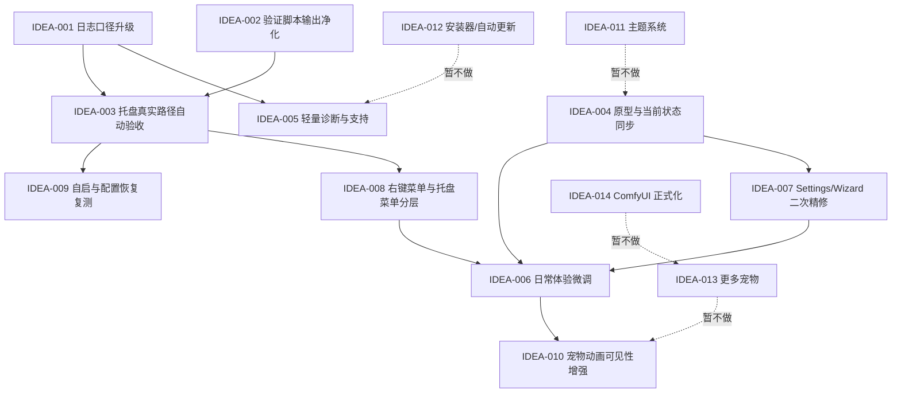

# LetsMakeMoney v0.6 Beta /idea 需求池

**创建日期**：2026-07-10
**当前基线版本**：v0.5 Beta
**当前项目状态**：v0.5 已通过发布前补证验收，`main` 已推送，tag 为 `v0.5-beta`
**本文件阶段**：`/idea`，只做候选需求池，不是 PRD

## 1. 总体判断

我建议 v0.6 Beta 暂定为“发布后体验稳定与验证能力增强版”。

理由：

- v0.5 已经把 Settings / Wizard / 托盘 / 纯桌宠 / 保存反馈做到了可发布，但验收记录里仍有几个“可发布但不够舒服”的尾巴。
- 当前证据最强的不是新功能，而是日志口径、验证脚本、托盘真实路径、原型口径、发布文档与真实运行体验之间的收敛。
- 产品仍是个人桌面小工具，过早进入主题系统、安装器、自动更新、多平台、更多宠物或 ComfyUI 正式化，会把项目从“能持续打磨的小工具”推向“维护负担很重的平台化系统”。

v0.6 的成功标准不应是“功能更多”，而应是：

- 发布后真实运行更可观察。
- 手动验收更少依赖解释和补证。
- 桌宠日常使用更顺。
- 文档和原型不再残留旧版本口径。
- 下一轮做新功能时，基础验证能力不拖后腿。

## 2. 证据来源

| 来源 | 证据内容 | 证据强度 |
|---|---|---|
| `doc/current.md` | v0.5 通过 / 可发布；列出 v0.6 建议优化日志口径和验证脚本输出质量 | 强 |
| `doc/releases/v0.5/verification.md` | 托盘、纯桌宠、Settings、Wizard 已通过；但托盘左键依赖 native 同路径补证，Computer Use 无法稳定直接点击通知区 | 强 |
| `doc/releases/v0.5/progress_v0.5.md` | v0.5 任务完成；已知说明包含 passthrough debug-only、verify_v05 headless parser 文本 | 强 |
| `doc/logs/v0.5-bugfix-log.md` | Settings 保存失败、Wizard 日志、托盘左键恢复都是 v0.5 关键 bugfix；托盘与 taskbar 缓存问题曾反复出现 | 强 |
| `doc/prototypes/prototype-spec.md` | 原型说明仍残留 v0.4、test 分支、v0.4 发布包等旧口径；说明当前原型需要和 v0.5 事实源同步 | 强 |
| `scripts/verify_v05.ps1` / `scripts/verify_v05.gd` | 验证脚本已存在，但文档记录 headless 输出不干净 | 中 |
| `src/` 代码结构 | `main.gd`、`platform.gd`、`windows_platform.gd`、Settings、Wizard、Warm Control、Config 已形成稳定模块边界 | 中 |
| 过往用户反馈 | 多轮反馈集中在 UI 精致度、窗口比例、托盘图标、菜单清晰度、交互不可见等体验细节 | 中 |

## 3. 候选需求总览

范围确认：用户已确认 IDEA-001 到 IDEA-009 全部列为 v0.6 主线开发。IDEA-010 保留为观察候选，是否纳入 v0.6 取决于后续发布包录屏复测；IDEA-011 到 IDEA-014 暂不做。

| ID | 候选需求 | 类型 | 证据强度 | 价值判断 | 当前分类 | 压力测试 | 推荐去向 |
|---|---|---|---|---|---|---|---|
| IDEA-001 | 发布后日志口径升级：让关键运行事件默认可观测 | 稳定性 / 验证 | 强 | 高 | 真问题 | 34/40 | v0.6 主线 |
| IDEA-002 | 验证脚本输出净化：消除 headless 噪音和误导性通过 | 工程质量 | 强 | 高 | 真问题 | 32/40 | v0.6 主线 |
| IDEA-003 | 托盘真实路径可自动验收能力 | 验证能力 / Windows native | 强 | 中高 | 真问题 | 30/40 | v0.6 主线 |
| IDEA-004 | 原型与当前状态再同步：v0.6 前清理旧口径 | 文档 / 原型 | 强 | 中高 | 真问题 | 31/40 | v0.6 主线 |
| IDEA-005 | 轻量诊断与支持：打开数据目录并复制脱敏摘要 | 支持 / 诊断 | 中 | 中高 | 值得继续 | 28/40 | v0.6 主线 |
| IDEA-006 | 桌宠日常体验微调：Panel、小猫、菜单的真实使用节奏 | UI/体验 | 中 | 中高 | 值得继续 | 27/40 | v0.6 主线 |
| IDEA-007 | 设置页 / 向导视觉二次精修，但只修一致性残留 | UI/体验 | 中 | 中 | 值得继续 | 26/40 | v0.6 主线 |
| IDEA-008 | 右键菜单与托盘菜单能力分层优化 | 信息架构 | 中 | 中 | 值得继续 | 25/40 | v0.6 主线 |
| IDEA-009 | 自动启动与配置恢复路径复测加强 | 稳定性 | 中 | 中 | 继续验证 | 23/40 | v0.6 主线 |
| IDEA-010 | 宠物动画与互动可见性增强 | 动画体验 | 中 | 中 | 继续验证 | 23/40 | 观察候选，可延后 v0.7 |
| IDEA-011 | 主题系统 | 新功能 / 外观 | 弱 | 低到中 | 暂不做 | 16/40 | 暂不做 |
| IDEA-012 | 安装器 / 自动更新 | 发布体系 | 弱 | 中但过早 | 暂不做 | 18/40 | 暂不做 |
| IDEA-013 | 更多宠物 / 宠物市场 | 内容扩展 | 弱 | 低到中 | 暂不做 | 15/40 | 暂不做 |
| IDEA-014 | ComfyUI 正式产品化为内置素材生成管线 | 工具链 / 内容生产 | 中 | 中但范围过大 | 暂不做 | 19/40 | 保留 spike，不进 v0.6 |

## 4. 推荐主线方案

### 最小方案

只做 IDEA-001、IDEA-002、IDEA-004。

包含：

- 日志口径升级。
- 验证脚本输出净化。
- 原型 / 文档口径同步。

判断：该方案已经被用户确认不作为 v0.6 范围，仅保留为范围收缩时的备选。

### 确认方案

做 IDEA-001 到 IDEA-009，作为 v0.6 主线开发。

包含：

- 关键日志默认可观测。
- 验证脚本输出净化。
- 托盘真实路径自动验收能力或等效调试入口。
- 原型与当前文档事实源同步。
- 轻量诊断与支持：打开应用数据目录、复制脱敏摘要，不生成诊断包。
- 桌宠日常体验微调。
- Settings / Wizard 一致性残留修复。
- 右键菜单与托盘菜单能力分层优化。
- 开机自启、配置损坏、恢复默认等低频高信任路径复测加强。

判断：这是当前 v0.6 的确认范围。它解决的是“发布后如果出问题，我们能不能看清楚、验清楚、复现清楚”，同时补一轮真实日常体验和低频信任路径。

### 过大方案

做 IDEA-001 到 IDEA-014，或把 IDEA-010 宠物动画大修、主题系统、安装器、更多宠物、ComfyUI 正式化全部纳入。

判断：不推荐。范围会从“稳定增强”膨胀到“平台化 + 内容生产 + 分发体系”，很容易把 v0.6 做成一个拖不完的大版本。
## 5. 需求详情

### IDEA-001：发布后日志口径升级：让关键运行事件默认可观测

- 原始来源：v0.5 验收文档明确指出 `passthrough_suspended` / `passthrough_resumed` 当前是 debug 级日志，默认 `debug_mode=false` 时不会每次写入。
- 输入类型：真问题 / 稳定性。
- 产品问题：发布后如果用户反馈 Settings、Wizard、右键菜单或托盘交互异常，普通模式日志可能缺少足够语义事件，排查会依赖复现和猜测。
- 证据盘点：
  - `doc/current.md` 和 `verification.md` 均把该项列为 v0.6 建议。
  - v0.5 已补齐 Settings / Wizard 语义日志，说明日志在验收中确实有价值。
  - 当前 passthrough 关键事件仍是 debug-only。
- 证据强度：强。
- 价值判断：高。它直接提升发布后可维护性和用户问题定位效率。
- 当前分类：真问题。
- 压力测试：34/40。

| 维度 | 分数 | 证据/理由 |
|---|---:|---|
| 用户痛点强度 | 4 | 点击穿透、模态窗口、托盘是核心路径，日志缺失会影响问题定位 |
| 目标用户/场景清晰度 | 4 | 发布后用户反馈异常时使用 |
| 证据强度 | 5 | v0.5 验收文档明确记录 |
| 频率/紧急性 | 4 | 不一定每天触发，但一旦出问题很难排查 |
| 核心目标贡献 | 5 | 支撑桌宠稳定性和可维护性 |
| 差异化/替代方案 | 4 | 可以用 debug_mode 替代，但普通用户不会主动开启 |
| 成本可控性 | 4 | 主要是日志分层和事件白名单 |
| 验证速度 | 4 | 可通过 debug.log 直接验证 |

- 推荐去向：进入 `/prd`。
- 最小下一步：定义“默认 info 级关键事件白名单”，例如 modal open/close、passthrough suspend/resume、tray left toggle、taskbar visibility decision、config save result。

### IDEA-002：验证脚本输出净化：消除 headless 噪音和误导性通过

- 原始来源：v0.5 多份文档记录 `verify_v05.ps1` 返回通过，但 Godot headless 仍可能输出 parser 文本。
- 输入类型：真问题 / 工程质量。
- 产品问题：验证脚本“通过但输出不干净”会降低 agent 和人工对验收结论的信任，也容易掩盖真正错误。
- 证据盘点：
  - `doc/current.md`、`status.md`、`verification.md`、release notes 均提到该问题。
  - scripts 目录存在多版 verify 脚本，后续仍会复用。
- 证据强度：强。
- 价值判断：高。不是用户功能，但直接影响发布质量。
- 当前分类：真问题。
- 压力测试：32/40。

| 维度 | 分数 | 证据/理由 |
|---|---:|---|
| 用户痛点强度 | 3 | 主要影响开发/验收，不直接影响终端用户 |
| 目标用户/场景清晰度 | 5 | 每次版本验收和 agent 接手都会用 |
| 证据强度 | 5 | 多份 v0.5 文档记录 |
| 频率/紧急性 | 4 | 每次验证都可能遇到 |
| 核心目标贡献 | 4 | 提升发布可信度 |
| 差异化/替代方案 | 3 | 可人工忽略噪音，但风险高 |
| 成本可控性 | 4 | 可拆成脚本环境隔离、输出过滤、失败判定三步 |
| 验证速度 | 4 | 跑脚本即可验证 |

- 推荐去向：进入 `/prd`。
- 最小下一步：先明确“干净验证”的标准：无 parser/runtime/error 文本，失败必须非零退出，日志文件可定位。

### IDEA-003：托盘真实路径可自动验收能力

- 原始来源：v0.5 验收中 Computer Use 无法稳定直接点击 Windows 通知区托盘图标，只能通过 native 同路径消息补证。
- 输入类型：验证能力 / Windows native。
- 产品问题：托盘是纯桌宠找回入口，但当前最终验收仍有一部分依赖“同路径补证 + 解释”。这对后续版本反复验证不够舒服。
- 证据盘点：
  - `verification.md` 明确写出 Computer Use 不能稳定直接点击通知区。
  - `v0.5-bugfix-log.md` 中托盘左键恢复曾多轮返工。
  - 托盘、纯桌宠、任务栏策略是核心可找回路径。
- 证据强度：强。
- 价值判断：中高。它不新增用户能力，但显著降低后续版本验收成本。
- 当前分类：真问题。
- 压力测试：30/40。

| 维度 | 分数 | 证据/理由 |
|---|---:|---|
| 用户痛点强度 | 4 | 托盘找回失败会直接影响可用性 |
| 目标用户/场景清晰度 | 4 | 纯桌宠隐藏/恢复路径 |
| 证据强度 | 5 | v0.5 验收和 bugfix-log 反复记录 |
| 频率/紧急性 | 3 | 验收高频，用户使用中中频 |
| 核心目标贡献 | 4 | 支撑桌宠安全找回 |
| 差异化/替代方案 | 3 | native 同路径补证可用，但不如真实点击 |
| 成本可控性 | 3 | 可能涉及 native 调试命令或测试入口 |
| 验证速度 | 4 | 做成脚本后验证快 |

- 推荐去向：进入 `/prd` 或先做技术 spike。
- 最小下一步：评估两种方案：
  - 方案 A：新增仅 debug/test 可用的 tray command trigger。
  - 方案 B：保留 PostMessage 测试脚本并标准化为验证工具。

### IDEA-004：原型与当前状态再同步：v0.6 前清理旧口径

- 原始来源：`doc/prototypes/prototype-spec.md` 仍出现 v0.4、test 分支、v0.4 发布包等旧口径。
- 输入类型：文档 / 原型。
- 产品问题：原型是后续 UI 和验收讨论入口，如果仍保留旧版本事实，会误导下一轮 agent 和人。
- 证据盘点：
  - prototype spec 当前写着“当前代码仍在 GitHub test 分支，尚未合并到 main”，但 v0.5 已在 `main` 且 tag 为 `v0.5-beta`。
  - 发布包说明仍提到 v0.4。
  - v0.5 文档已经完成收口，原型说明没有同步。
- 证据强度：强。
- 价值判断：中高。不会影响运行，但会影响后续需求判断和 UI 对照。
- 当前分类：真问题。
- 压力测试：31/40。

| 维度 | 分数 | 证据/理由 |
|---|---:|---|
| 用户痛点强度 | 3 | 主要影响协作和后续开发 |
| 目标用户/场景清晰度 | 5 | agent 接手、UI 讨论、验收准备 |
| 证据强度 | 5 | 文档中直接存在旧口径 |
| 频率/紧急性 | 4 | 每次进入 v0.6 都会读原型 |
| 核心目标贡献 | 4 | 支撑需求和验收一致 |
| 差异化/替代方案 | 3 | 可人工忽略，但容易误导 |
| 成本可控性 | 4 | 文档和原型同步，成本可控 |
| 验证速度 | 3 | 需要人工 review 原型 |

- 推荐去向：现在直接做，或作为 v0.6 的 M0 文档任务。
- 最小下一步：把 prototype spec 和原型页面全部切到 v0.5 后事实源，再预留 v0.6 候选入口。

### IDEA-005：轻量诊断与支持：打开数据目录并复制脱敏摘要

- 原始来源：v0.5 验收大量依赖 `%APPDATA%\LetsMakeMoney\config.json`、`debug.log`、发布包版本、窗口策略证据。
- 输入类型：支持 / 诊断。
- 产品问题：用户后续反馈问题时，手动让用户找配置和日志成本高，且容易漏关键信息。
- 证据盘点：
  - v0.5 验收和 bugfix 多次依赖 config/debug.log。
  - 当前文档已经明确配置和日志路径。
  - 尚无用户反馈证明真实用户会频繁上报问题，因此不是强证据。
- 证据强度：中。
- 价值判断：中高。对个人项目很实用，但要避免做成复杂反馈系统。
- 当前分类：值得继续。
- 压力测试：28/40。

| 维度 | 分数 | 证据/理由 |
|---|---:|---|
| 用户痛点强度 | 3 | 问题发生时很有用，但不是日常高频 |
| 目标用户/场景清晰度 | 4 | 用户反馈 bug、agent 接手验收 |
| 证据强度 | 3 | 内部验收强依赖日志，但缺少外部用户反馈 |
| 频率/紧急性 | 3 | 发布后问题排查中频 |
| 核心目标贡献 | 4 | 支撑稳定和可维护 |
| 差异化/替代方案 | 3 | 文档说明可替代，但不够顺 |
| 成本可控性 | 4 | 可先做“打开日志目录/复制诊断摘要” |
| 验证速度 | 4 | 可直接检查导出内容 |

- 推荐去向：小范围进入 `/prd`。
- 最小下一步：不要做上传系统，只做“打开日志目录”和“复制诊断摘要”两个轻动作。

### IDEA-006：桌宠日常体验微调：Panel、小猫、菜单的真实使用节奏

- 原始来源：历史多轮用户反馈集中在 Panel 清晰度、右键菜单质感、单击/双击动作可见性、窗口比例等体验问题。
- 输入类型：UI/体验。
- 产品问题：v0.5 重点是边缘体验和 Settings/Wizard 收敛，桌宠日常体验本身仍有可能存在“能用但不够顺”的细节。
- 证据盘点：
  - 历史反馈中多次出现“看不清”“不够精致”“动作不可见”“菜单像默认控件”。
  - v0.5 当前验收重点不是日常长时间使用。
  - 缺少 v0.5 发布后真实长时间使用反馈。
- 证据强度：中。
- 价值判断：中高，但应先验证，不宜直接大改。
- 当前分类：值得继续。
- 压力测试：27/40。

| 维度 | 分数 | 证据/理由 |
|---|---:|---|
| 用户痛点强度 | 4 | 桌宠和 Panel 是最高频可见体验 |
| 目标用户/场景清晰度 | 4 | 日常桌面常驻 |
| 证据强度 | 3 | 历史反馈充分，但缺少 v0.5 发布后反馈 |
| 频率/紧急性 | 4 | 高频可见 |
| 核心目标贡献 | 4 | 影响陪伴感和产品气质 |
| 差异化/替代方案 | 3 | 可先用观察清单替代大改 |
| 成本可控性 | 2 | UI/动画容易反复打磨失控 |
| 验证速度 | 3 | 需要截图和真实桌面使用 |

- 推荐去向：继续验证后进入 `/prd`。
- 最小下一步：做 30 分钟日常使用观察清单，只记录不舒服点，不先改。

### IDEA-007：设置页 / 向导视觉二次精修，但只修一致性残留

- 原始来源：v0.5 已做共享控件，但 Settings / Wizard UI 在历史上经历多轮返工。
- 输入类型：UI/体验。
- 产品问题：共享控件系统完成后，仍可能有局部 spacing、行高、弹窗层级、文案密度不一致。
- 证据盘点：
  - v0.5 PRD 和 progress 已把共享控件列为主线。
  - 当前验收通过，但没有明确说“所有视觉完全满意”。
  - 证据多来自历史反馈，不是 v0.5 发布后新证据。
- 证据强度：中。
- 价值判断：中。适合做有限 polish，不适合再开大 UI 重构。
- 当前分类：值得继续。
- 压力测试：26/40。

| 维度 | 分数 | 证据/理由 |
|---|---:|---|
| 用户痛点强度 | 3 | 影响精致度，但 v0.5 已可发布 |
| 目标用户/场景清晰度 | 4 | 设置和重新配置流程 |
| 证据强度 | 3 | 有历史反馈和 v0.5 主线，缺少新截图问题 |
| 频率/紧急性 | 3 | 设置页非高频 |
| 核心目标贡献 | 3 | 支撑整体质感 |
| 差异化/替代方案 | 3 | 可通过原型对照小修 |
| 成本可控性 | 3 | 若限制为一致性残留则可控 |
| 验证速度 | 4 | 截图对照即可 |

- 推荐去向：依赖新截图确认后决定。
- 最小下一步：只列“与共享控件不一致”的问题，不接受泛化的“更精致”。

### IDEA-008：右键菜单与托盘菜单能力分层优化

- 原始来源：历史 UI 反馈曾要求右键菜单去掉快速入口、改二级入口；v0.5 托盘/菜单仍是核心入口。
- 输入类型：信息架构 / 体验。
- 产品问题：右键菜单同时承担设置、向导、窗口模式、宠物选择、关于、退出和托盘隐藏，后续功能增加后可能变重。
- 证据盘点：
  - prototype spec 明确右键菜单和托盘能力。
  - 当前没有 v0.5 发布后“菜单难用”的新证据。
  - 菜单是核心入口，但不是当前阻塞。
- 证据强度：中。
- 价值判断：中。
- 当前分类：值得继续。
- 压力测试：25/40。

| 维度 | 分数 | 证据/理由 |
|---|---:|---|
| 用户痛点强度 | 3 | 菜单变重会影响找功能 |
| 目标用户/场景清晰度 | 4 | 桌宠右键和托盘右键 |
| 证据强度 | 3 | 有历史反馈，缺少新复测 |
| 频率/紧急性 | 3 | 中频入口 |
| 核心目标贡献 | 3 | 支撑可找回和配置入口 |
| 差异化/替代方案 | 3 | 可先文案/分组小调 |
| 成本可控性 | 3 | 菜单结构小改可控 |
| 验证速度 | 3 | 需要截图和实际点击 |

- 推荐去向：小范围验证。
- 最小下一步：对照当前菜单截图，判断是否真的有误点、难找或层级混乱。

### IDEA-009：自动启动与配置恢复路径复测加强

- 原始来源：v0.3-v0.5 中配置、开机自启、恢复默认、保存失败都曾是稳定性重点。
- 输入类型：验证 / 稳定性。
- 产品问题：开机自启和配置恢复属于低频但高信任路径，一旦失败会影响用户对桌宠常驻的信心。
- 证据盘点：
  - v0.5 验收重点未覆盖开机自启真实系统路径。
  - Config 保存失败已修复，说明配置路径值得继续关注。
  - 当前无明确 bug。
- 证据强度：中。
- 价值判断：中，但更像验证债。
- 当前分类：继续验证。
- 压力测试：23/40。

| 维度 | 分数 | 证据/理由 |
|---|---:|---|
| 用户痛点强度 | 3 | 失败时影响信任，但低频 |
| 目标用户/场景清晰度 | 3 | 开机启动、配置损坏恢复 |
| 证据强度 | 2 | 没有当前失败证据 |
| 频率/紧急性 | 2 | 低频 |
| 核心目标贡献 | 3 | 支撑常驻工具可信度 |
| 差异化/替代方案 | 3 | 可先补验证文档 |
| 成本可控性 | 4 | 验证为主，成本可控 |
| 验证速度 | 3 | 需要 Windows 启动项检查 |

- 推荐去向：继续验证，不急开发。
- 最小下一步：补一份“配置损坏 / 开机自启 / 恢复默认”手动验证清单。

### IDEA-010：宠物动画与互动可见性增强

- 原始来源：历史多轮反馈指出单击、双击动作不明显，橘猫帧质量和动作连贯性反复调整。
- 输入类型：动画体验。
- 产品问题：桌宠的核心情感价值来自小猫反馈，若动作不可见，互动会显得“没反应”。
- 证据盘点：
  - 历史反馈很强。
  - v0.4/v0.5 以后已有一定修复。
  - 缺少 v0.5 最新发布包下的专项复测结论。
- 证据强度：中。
- 价值判断：中。重要，但容易消耗大量时间。
- 当前分类：继续验证。
- 压力测试：23/40。

| 维度 | 分数 | 证据/理由 |
|---|---:|---|
| 用户痛点强度 | 4 | 直接影响桌宠反馈感 |
| 目标用户/场景清晰度 | 4 | 单击、双击、长按 |
| 证据强度 | 3 | 历史证据强，最新证据不足 |
| 频率/紧急性 | 3 | 中高频互动 |
| 核心目标贡献 | 4 | 支撑陪伴感 |
| 差异化/替代方案 | 2 | 可通过延长动画时间或更换帧小修 |
| 成本可控性 | 1 | 素材生成和逐帧修复容易失控 |
| 验证速度 | 2 | 需要录屏或逐帧复查 |

- 推荐去向：继续验证。若 v0.6 要做，只做“现有素材播放时长 / 触发保持时间 / 反馈强度”小修，不重新开素材大工程。
- 最小下一步：用 v0.5 发布包录制单击、双击、长按各 5 次，判断是否仍不可见。

### IDEA-011：主题系统

- 原始来源：历史讨论曾把主题列为未来规划。
- 输入类型：新功能 / 外观。
- 产品问题：用户可能希望未来有不同视觉风格，但当前没有证据表明这是 v0.6 的核心问题。
- 证据盘点：
  - 只有历史规划意向。
  - v0.5 已明确不做主题系统。
  - 当前更需要稳定、日志和验证能力。
- 证据强度：弱。
- 价值判断：低到中。
- 当前分类：暂不做。
- 压力测试：16/40。

- 推荐去向：暂不做。
- 最小下一步：保留为未来规划，等当前默认主题稳定且有真实用户提出“想切主题”再讨论。

### IDEA-012：安装器 / 自动更新

- 原始来源：发布体系自然会想到安装器和更新。
- 输入类型：发布能力。
- 产品问题：zip 包分发对普通用户不够丝滑，但安装器和自动更新会显著增加维护成本。
- 证据盘点：
  - 当前发布包 zip 已可用。
  - 没有真实用户分发反馈。
  - v0.5 明确不做。
- 证据强度：弱。
- 价值判断：中但过早。
- 当前分类：暂不做。
- 压力测试：18/40。

- 推荐去向：暂不做。
- 最小下一步：等出现“用户安装/更新困难”的真实反馈后，再先做安装说明或简易启动器，不直接上自动更新。

### IDEA-013：更多宠物 / 宠物市场

- 原始来源：桌宠产品自然有内容扩展想象。
- 输入类型：内容扩展。
- 产品问题：更多宠物能增加趣味，但当前项目的素材生产和动画质量还没有完全稳定。
- 证据盘点：
  - 当前已有橘猫 v2 和 fallback。
  - 历史素材生成过程反复返工。
  - 没有真实用户要求更多宠物。
- 证据强度：弱。
- 价值判断：低到中。
- 当前分类：暂不做。
- 压力测试：15/40。

- 推荐去向：暂不做。
- 最小下一步：如果要做，也应先把单一橘猫体验和素材管线稳定下来。

### IDEA-014：ComfyUI 正式产品化为内置素材生成管线

- 原始来源：历史已探索 ComfyUI、秋叶 ComfyUI、SpriteCook 等素材生成方案。
- 输入类型：工具链 / 内容生产。
- 产品问题：稳定素材生产能力有价值，但把 ComfyUI 正式产品化会大幅拉大项目范围。
- 证据盘点：
  - scripts 中已有 ComfyUI 检查、启动和收集候选脚本。
  - 历史素材生成确实用到这类工具。
  - 但当前产品用户并不需要在应用内生成素材。
- 证据强度：中。
- 价值判断：中但范围过大。
- 当前分类：暂不做。
- 压力测试：19/40。

- 推荐去向：保留 spike，不进 v0.6。
- 最小下一步：单独在平级 ComfyUI 会话或工具链文档里维护，不混入 LetsMakeMoney v0.6 主线。

## 6. 依赖关系

## 7. 分流建议

### v0.6 主线，建议进入 `/prd`

- IDEA-001：发布后日志口径升级。
- IDEA-002：验证脚本输出净化。
- IDEA-003：托盘真实路径可自动验收能力。
- IDEA-004：原型与当前状态再同步。
- IDEA-005：轻量诊断与支持。
- IDEA-006：桌宠日常体验微调。
- IDEA-007：Settings / Wizard 视觉二次精修。
- IDEA-008：右键菜单与托盘菜单能力分层优化。
- IDEA-009：自动启动与配置恢复路径复测加强。

### 观察候选，先不默认进入 v0.6 主线

- IDEA-010：宠物动画与互动可见性增强。

### 建议暂不做

- IDEA-011：主题系统。
- IDEA-012：安装器 / 自动更新。
- IDEA-013：更多宠物 / 宠物市场。
- IDEA-014：ComfyUI 正式产品化为内置素材生成管线。

## 8. 需要你确认的问题

1. 托盘自动验收能力是否允许加入一个仅 debug/test 使用的原生命令入口？
2. 轻量诊断已确认采用“打开应用数据目录 / 复制脱敏摘要”，不导出文本或 Zip。
3. 桌宠日常体验微调是否只做 Panel / 小猫 / 菜单的细节，不碰大视觉风格？
4. 宠物动画是否继续压后，还是 v0.6 至少做一次发布包下的录屏复测？

## 9. 我的推荐

用户已确认 v0.6 采用 `IDEA-001` 到 `IDEA-009` 全部主线开发的范围：

- 主线 1：日志口径升级。
- 主线 2：验证脚本输出净化。
- 主线 3：托盘真实路径自动验收或标准化补证工具。
- 主线 4：原型 / 文档当前状态同步。
- 主线 5：轻量诊断与支持，不生成诊断包。
- 主线 6：桌宠日常体验微调。
- 主线 7：Settings / Wizard 一致性残留修复。
- 主线 8：右键菜单与托盘菜单能力分层优化。
- 主线 9：开机自启、配置恢复、恢复默认等低频高信任路径复测加强。

边界仍然要保持清楚：宠物动画大修、主题系统、安装器、自动更新、更多宠物和 ComfyUI 正式化不进入 v0.6 主线。
