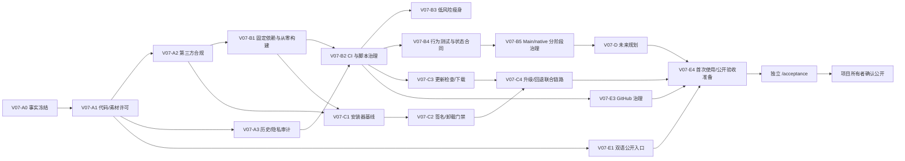

# LetsMakeMoney v0.7 Beta 开发实施计划

## 追踪信息

- 当前状态：开发承接已生成，待项目所有者确认进入实现
- 目标版本：v0.7 Beta
- 上游 IDEA：`IDEA-001` 至 `IDEA-017`
- 上游需求：`FR-001` 至 `FR-014`
- 来源文件：`doc/releases/v0.7/idea-pool.md`、`doc/releases/v0.7/prd.md`
- 追踪矩阵：`doc/releases/v0.7/traceability.md`
- 原型入口：`doc/prototypes/index.html`
- 原型说明：`doc/prototypes/prototype-spec.md`
- 状态看板：`doc/releases/v0.7/progress_v0.7.md`
- 开发日志：`doc/logs/dev_log_v0.7.md`
- 下游承接：v0.7 verification、Acceptance、公开仓库审批、Release
- 当前事实基线：`main` / `e6f25ae8cb4d9583aa3e629cb79416e278060117` / v0.6 Beta
- 最后更新：2026-07-11

## 1. 开发范围

### 1.1 版本目标

v0.7 是“开源公开、可信分发与可持续维护基线版”。本版不是普通功能迭代，而是将已经可用的 Windows 桌宠从个人私有项目转化为可安全公开、可复现构建、可接受贡献、可安装升级并能长期维护的 GitHub 项目。

### 1.2 本次包含

- MIT 代码许可、受限视觉素材许可和第三方 notices 的分层治理。
- 当前工作树与完整 Git 历史的敏感信息、路径、大文件和资产权属审计。
- 中英双语 README、贡献、安全、行为规范和 GitHub 模板。
- 固定 Godot、godot-cpp、Python、SCons、MSYS2/MinGW、Windows SDK 和 Inno Setup 工具链。
- 干净环境从 clone 到 native、Godot、测试、便携 Zip 和安装器的可复现链路。
- 最小 Windows CI、验证/打包脚本参数化与发布事实一致性。
- 有测试保护的 Settings 旧路径和公开仓库噪音清理。
- Main、Platform、WindowsPlatform、native bridge、托盘、窗口、穿透和任务栏状态所有权治理。
- 当前用户 Inno Setup 安装器、Authenticode 签名门禁和默认保留数据的卸载链路。
- GitHub Release 更新检查、通道、用户确认下载、SHA256/签名校验、安装与回退。
- 诊断白名单、路径边界、配置安全写入、native 故障降级和 Release 供应链安全。
- 多平台、主题系统、更多宠物三份规划文档，不包含实现。
- 公开前首次使用走查、真实 Windows GUI Acceptance 和仓库公开审批入口。

### 1.3 本次不包含

- iOS、Android、macOS 客户端或导出实现。
- 主题切换系统、新主题或第三套视觉语言。
- 新宠物、素材市场、动画大修或外部素材文件贡献。
- ComfyUI 产品化、模型、工作流或临时素材包公开。
- 静默更新、后台安装、差分补丁、自建更新服务器、Microsoft Store 或 MSIX。
- Git 历史重写、清洗或新建替代仓库。
- 一次性重写 Main/native。
- 数据库；当前项目无数据库，本版不新增数据库。

### 1.4 强制边界

1. V07-A 至 V07-E 全部完成并通过独立 Acceptance 前，仓库保持私有。
2. 安装器没有有效 Authenticode 签名时不得成为公开附件；便携 Zip 可独立验收。
3. Main/native 先补 characterization tests 与状态合同，再分切面治理；每个切面独立提交、验证和回退。
4. 清理任务必须有调用、资源、scene、signal、native 导出、配置和打包证据，不凭一次文本搜索删除。
5. progress 只更新 checklist、状态、阻塞和最近验证；过程进入 dev log，缺陷进入 bugfix log，技术探索进入 spike log。

## 2. PRD 与 IDEA 对照

| FR | IDEA | 开发模块 | 覆盖方式 |
|---|---|---|---|
| FR-001 | 001/002 | V07-A1 | MIT、受限素材许可、资产清单和入口链接 |
| FR-002 | 004 | V07-A2、V07-C1 | 第三方 notices、包内 LICENSES、打包门禁 |
| FR-003 | 003/006/012/013 | V07-A3 | 当前树/历史扫描、ignore、隐私和资产审计 |
| FR-004 | 007/015 | V07-E1/E2 | 双语 README、贡献、安全、行为规范与模板 |
| FR-005 | 005 | V07-B1 | 固定依赖 manifest、bootstrap、离线缓存、从零构建 |
| FR-006 | 008/010 | V07-B2 | Windows CI、脚本公共内核、隔离测试和可信退出 |
| FR-007 | 009/012 | V07-B3 | Settings 旧路径、实验/临时资产和历史脚本瘦身 |
| FR-008 | 011 | V07-B4/B5 | 行为测试、状态合同、分阶段 Main/native 治理 |
| FR-009 | 017 | V07-C1/C2 | Inno Setup、当前用户安装、签名、修复和卸载 |
| FR-010 | 017 | V07-C3/C4 | 更新通道、GitHub Release、下载校验、安装与回退 |
| FR-011 | 006/013 | V07-A3、V07-B5、V07-C4 | 诊断白名单、路径安全、配置恢复和能力降级 |
| FR-012 | 008/015 | V07-E2/E3 | GitHub Actions、模板、分支保护、Release 和安全报告 |
| FR-013 | 014 | V07-E4 | 干净 Windows 用户/VM 首次使用走查 |
| FR-014 | 016 | V07-D1/D2/D3 | 平台、主题、宠物规划文档评审 |

### 2.1 IDEA 完整映射

| IDEA | 承接模块 | 主要产物 |
|---|---|---|
| IDEA-001 | V07-A1 | MIT 代码许可 |
| IDEA-002 | V07-A1 | 受限视觉素材许可和资产清单 |
| IDEA-003 | V07-A3 | 完整 Git 历史公开审计 |
| IDEA-004 | V07-A2 | 第三方 notices 与包内许可 |
| IDEA-005 | V07-B1 | 固定依赖和从零 native 构建 |
| IDEA-006 | V07-A3、V07-B5 | 隐私门禁和运行时安全降级 |
| IDEA-007 | V07-E1 | 中英双语公开入口 |
| IDEA-008 | V07-B2、V07-E3 | Windows CI 和发布事实门禁 |
| IDEA-009 | V07-B3 | Settings 旧路径清理 |
| IDEA-010 | V07-B2 | 验证与打包脚本参数化 |
| IDEA-011 | V07-B4、V07-B5 | Main/native 状态合同与深度治理 |
| IDEA-012 | V07-A3、V07-B3 | 临时、实验和历史资产瘦身 |
| IDEA-013 | V07-B5 | 诊断字段白名单与降级日志 |
| IDEA-014 | V07-E4 | 开源首次使用验收 |
| IDEA-015 | V07-E2、V07-E3 | 社区治理、模板和安全入口 |
| IDEA-016 | V07-D1、V07-D2、V07-D3 | 多平台、主题和宠物规划 |
| IDEA-017 | V07-C1、V07-C2、V07-C3、V07-C4 | 安装器、签名、更新和回退 |

## 3. 总体架构与实施顺序



### 3.1 串行项

- A0 → A1/A2/A3：没有许可和事实冻结不得清理或公开。
- B1 → B2：CI 必须使用固定依赖。
- B2 → B4 → B5：Main/native 治理必须有可信测试和状态合同。
- C1 → C2：安装器结构稳定后再接签名与卸载门禁。
- C2/C3 → C4：签名安装器和更新下载都完成后才做联合升级。
- E4 → Acceptance → 公开：开发完成不能直接公开。

### 3.2 可并行项

- A2 第三方清单与 A3 历史审计可在 A1 边界明确后并行。
- E1 双语 README 与 B1/B2 可并行，但命令必须等构建链稳定后最终校对。
- D1-D3 三份规划可并行撰写。
- B3 低风险瘦身与 C1 安装器可在不同文件上并行，合并前统一跑回归。

## 4. 文件与模块影响

| 模块/文件 | 预计改动 | 责任与边界 |
|---|---|---|
| `LICENSE` | 新增 | MIT 代码许可，不覆盖受限素材 |
| `ASSETS_LICENSE.md` | 新增 | Logo、图标、宠物、动画和可提取视觉素材限制 |
| `THIRD_PARTY_NOTICES.md`、`LICENSES/` | 新增 | 第三方版本、来源、许可证、修改和分发状态 |
| `README.md`、`README.en.md` | 重写/新增 | 中文事实源、英文同步、用户和贡献者入口 |
| `CONTRIBUTING.md`、`CODE_OF_CONDUCT.md`、`SECURITY.md` | 新增 | 贡献边界、Contributor Covenant、安全私密报告 |
| `.gitignore`、`.gitattributes` | 修改 | 验收证据、缓存、发布展开目录、二进制和文本规范 |
| `.github/ISSUE_TEMPLATE/*`、`pull_request_template.md` | 新增 | Bug、Feature、PR 的证据和脱敏要求 |
| `.github/workflows/*` | 新增 | 文档、许可、secret、测试、native、包和 Release 门禁 |
| `scripts/build_native_windows.ps1` | 深度修改 | 去绝对路径、固定 bootstrap、工具身份、缓存和失败诊断 |
| `native/windows/dependencies.lock.json`（建议名） | 新增 | godot-cpp commit、URL、SHA256、工具链版本 |
| `native/windows/README.md` | 重写 | 从零/离线构建与故障排查 |
| `scripts/verification_common.ps1` | 修改 | 隔离、错误判定、参数化公共能力 |
| `scripts/package.ps1`、`verify_package.ps1`（建议名） | 新增 | 参数化公共内核；历史 wrapper 保留兼容入口 |
| `scripts/check_public_readiness.ps1` | 新增 | 许可、隐私、历史、路径、临时目录和事实门禁 |
| `src/scenes/settings/settings_dialog.gd` | 修改 | 移除已证实旧路径；接入版本与更新页/状态 |
| `src/ui/warm_control_theme.gd` | 按需修改 | 更新页复用现有控件，不建主题系统 |
| `src/utils/update_service.gd`（建议名） | 新增 | Release 查询、版本通道、下载、校验和状态机 |
| `src/autoload/config.gd` | 修改 | 更新通道/检查偏好、迁移、备份和兼容 |
| `src/utils/diagnostics_service.gd` | 修改 | 诊断字段白名单与更新/native 状态脱敏 |
| `src/scenes/main/main.gd` | 分阶段修改 | 窗口意图、模态和退出/更新协调职责拆分 |
| `src/autoload/platform.gd` | 修改 | 平台能力合同与错误状态，不泄露 Windows 细节 |
| `src/platform/platform_interface.gd` | 修改 | 原生能力接口和 degraded/unavailable 状态 |
| `src/platform/windows_platform.gd` | 分阶段修改 | Windows 真实状态、缓存、DLL 和任务栏策略 |
| `src/autoload/drag_resize_system.gd` | 按需修改 | 窗口显隐/托盘策略调用方收敛 |
| `native/windows/src/lmm_native_bridge.*` | 分阶段修改 | 消息协议、返回值、健康状态和生命周期 |
| `native/windows/src/tray_controller.*` | 分阶段修改 | 托盘消息和菜单状态唯一所有者 |
| `native/windows/src/window_controller.*` | 分阶段修改 | subclass、任务栏、穿透和窗口真实状态 |
| `installer/LetsMakeMoney.iss`（建议名） | 新增 | 当前用户安装、修复、升级、卸载和数据选项 |
| `scripts/sign_windows.ps1` | 新增 | Authenticode 签名和校验；证书仅来自安全 secret |
| `scripts/package_v07.ps1` | 新增 | 便携 Zip、签名安装器、manifest、checksum、许可 |
| `scripts/verify_v07*.ps1/.gd` | 新增 | v0.7 合同、公开门禁、安装更新和回归 |
| `doc/releases/v0.7/roadmaps/*` | 新增 | 平台、主题、宠物规划，不进入实现 |
| `doc/releases/v0.7/verification.md` | 后续新增 | 自动、Computer Use、人工和公开门禁证据 |

以上建议文件名允许在实现前按现有目录规范微调，但职责、追踪 ID 和验收边界不得改变。

## 5. 里程碑与任务拆解

### V07-A0：事实冻结与公开候选边界

- 目标：冻结 v0.6 已发布基线并定义 v0.7 公开候选树。
- 涉及：`doc/current.md`、v0.7 文档、`.gitignore`、版本脚本。
- 实施要点：记录分支/HEAD/tag/Release/哈希；列出不进入公开版的 ComfyUI、临时素材、私有验收证据和本地发布目录；建立公开 readiness 状态文件。
- 验证：当前事实扫描无旧分支/旧版本误导；v0.6 历史结论不改写。
- 完成标准：公开候选范围可由脚本和人工清单同时解释。

### V07-A1：MIT 与受限素材许可

- 目标：代码与素材授权没有歧义。
- 涉及：`LICENSE`、`ASSETS_LICENSE.md`、资产 manifest、README/贡献文档入口。
- 实施要点：定义 MIT 目录和受限素材目录；逐项登记 Logo、图标、猫素材、动画、截图和生成来源；v0.7 明确拒绝外部素材文件贡献。
- 验证：任抽一个代码文件或素材文件，两次点击内找到适用许可；未知资产阻塞。
- 回退：许可未获所有者签核时保持仓库私有，不以模糊声明替代。

### V07-A2：第三方与 Release 合规

- 目标：源码树、Zip 和安装器都携带完整 notices。
- 涉及：Godot、godot-cpp、Inno Setup、实际字体/工具和二进制依赖。
- 实施要点：生成可审计清单；包内 `LICENSES/`；打包缺许可非零退出。
- 验证：依赖 manifest、源码引用和包内文件三方一致。

### V07-A3：完整历史、隐私与资产审计

- 目标：在保留完整 Git 历史的前提下安全公开。
- 涉及：所有 commit/tag、当前树、ignore、扫描脚本、人工报告。
- 实施要点：至少两类 secret/路径/大文件扫描；检查删除文件历史；脱敏记录发现；真实凭据先轮换；无权素材移出公开候选。
- 验证：P0 发现清零并由项目所有者签核。
- 回退：任何未关闭敏感项均保持私有；本版不自动重写历史。

### V07-B1：固定依赖与可复现构建

- 目标：全新 clone 不依赖维护者机器即可构建。
- 实施要点：固定 Godot 4.7、godot-cpp commit/归档 SHA256、Python/SCons/MSYS2/SDK；bootstrap 支持下载、缓存、离线、哈希失败；移除绝对路径默认值；输出工具身份。
- 验证：无缓存干净构建、缓存复用、离线缓存、断网、错哈希、缺工具六条路径。
- 回退：保留旧本机构建脚本为临时对照，不进入公开文档；新链路未通过不得删除旧链路。

### V07-B2：CI 与验证/打包脚本治理

- 目标：CI 与本机使用同一可信公共内核。
- 实施要点：参数化 package/verify；保留 v0.4-v0.6 薄 wrapper；建立 Windows workflow；隔离 APPDATA；阻塞错误非零；Fork PR 无发布 secret。
- 验证：正常、parser error、漏文件、错版本、许可缺失、secret 命中和配置失败注入。
- 完成标准：CI 结果与本机一致，真实 GUI 边界明确留给 Acceptance。

### V07-B3：低风险代码与仓库瘦身

- 目标：降低公开后的阅读噪音，不以代码行数为指标。
- 实施要点：先补 Settings 行为/视觉测试，再删除旧 `_build_ui` 路径及过期适配；参数化重复脚本；移出 ComfyUI、实验资产、临时 Zip 和私有证据；历史文档归档不删除。
- 禁止直接清理：Pet/Salary 公共 API、降级托盘、`.import`、Main/Windows 状态缓存。
- 验证：scene/resource/signal/dynamic call/native/export 引用扫描，Settings 五页/Wizard 四步和包内 smoke。

### V07-B4：Main/native characterization tests 与状态合同

- 目标：深度治理前证明当前行为并定义唯一所有者。
- 状态矩阵：普通/纯桌宠、显示/隐藏、任务栏有/无、托盘左右键、Popup/Settings/Wizard、穿透启用/暂停、native 可用/降级/不可用、单/多显示器、100%-200% DPI、正常退出/更新退出。
- 产物：状态所有权文档、消息协议、测试夹具、v0.6 对照日志和截图。
- 验证：自动化覆盖可模拟状态；通知区、任务栏、多显示器和 DPI 标记人工边界。
- 完成标准：B4 未通过时 B5 不得开始。

### V07-B5：Main/native 分阶段深度治理

- 目标：减少重复缓存和交叉职责，同时保持行为等价或改善。
- 阶段一：提取窗口策略/模态协调，Main 只表达业务意图。
- 阶段二：Platform/WindowsPlatform 明确能力状态、真实状态和 last_error。
- 阶段三：整理 native 消息常量、bridge 返回值、托盘/窗口 controller 生命周期。
- 阶段四：删除经状态合同证明冗余的缓存和补丁逻辑。
- 每阶段门禁：自动状态矩阵、10 轮托盘、普通/纯桌宠任务栏、Popup/Modal 穿透、Settings/Wizard、Panel/Pet、DLL 缺失降级。
- 回退：每阶段独立提交；失败只回退当前阶段；保留 v0.6 DLL/Zip 对照。

### V07-C1：Inno Setup 安装器基线

- 目标：当前用户免管理员安装与便携 Zip 并行。
- 实施要点：固定 Inno Setup 版本；安装到 `%LOCALAPPDATA%\Programs\LetsMakeMoney`；许可页分层；开始菜单/桌面快捷方式；运行中程序检测；修复/覆盖安装；安装日志。
- 验证：干净安装、路径选择、取消、文件占用、磁盘不足、权限不足、修复和覆盖。
- 回退：安装失败不删除旧版本和 APPDATA；安装器能力可独立关闭，保留 Zip。

### V07-C2：签名与卸载门禁

- 目标：安装器公开附件具备可信发布者身份，卸载不误删数据。
- 实施要点：CI secret 注入证书；签名后校验发布者/时间戳；卸载默认保留 APPDATA；删除数据复选框默认关闭并二次确认；更新开机自启路径。
- 验证：有效/无签名/错签名/过期或无时间戳；卸载保留、主动删除、取消。
- 门禁：签名失败时安装器不进入 Release；不得退化成未签名公开附件。

### V07-C3：更新检查、通道与下载校验

- 目标：用户主动控制更新。
- 实施要点：语义版本比较；稳定/测试通道；GitHub Release 查询；无更新/离线/代理/限流；下载进度和取消；SHA256；安装器 Authenticode；缓存清理；脱敏日志。
- 配置：增加版本化更新偏好，旧配置默认兼容；不保存 GitHub 凭据。
- 验证：所有状态机分支和错误注入；原型对照 Settings 更新页。

### V07-C4：更新安装、便携升级与回退

- 目标：校验通过后再次确认，安全退出并升级。
- 实施要点：保存配置、停止托盘/native、启动安装器；安装取消/失败；上一版本下载入口；配置升级前备份；便携 Zip 只提示替换流程，不自覆盖。
- 验证：安装版与 Zip、两种通道、升级成功、取消、失败、回退、旧配置兼容和双实例提示。
- 回退：更新服务可关闭并恢复为打开 GitHub Release，不影响桌宠核心功能。

### V07-D1：macOS/iOS/Android 平台规划

- 目标：分别说明窗口/托盘/穿透、签名/商店、配置目录、触控与 Godot native 阻塞。
- 产物：`doc/releases/v0.7/roadmaps/platform-roadmap.md`。
- 完成标准：评审通过；不得创建平台代码或承诺版本日期。

### V07-D2：主题系统规划

- 目标：定义 token、资源包、许可、回退和可访问性边界。
- 产物：`theme-roadmap.md`。
- 完成标准：只规划，不新增主题 API、设置项或第三套视觉语言。

### V07-D3：宠物与素材扩展规划

- 目标：定义 manifest、状态、锚点、资源预算、生成来源和授权边界。
- 产物：`pet-content-roadmap.md`。
- 完成标准：不新增宠物，不接受外部素材文件贡献。

### V07-E1：中英双语公开入口

- 目标：普通用户与贡献者仅凭 README 理解和使用项目。
- 实施要点：中文事实源、英文镜像；定位、截图、下载、安装/Zip、构建、测试、限制、贡献、许可、安全；CI 检查关键结构和版本。
- 验证：链接、命令、截图、版本、术语和安装差异一致。

### V07-E2：贡献、安全与行为规范

- 目标：明确接受与不接受的贡献、报告和行为边界。
- 实施要点：CONTRIBUTING、Contributor Covenant 2.1、SECURITY；Private Vulnerability Reporting；不接受外部素材文件；代码/文档/UI/native 贡献许可。
- 验证：从 README 两次点击内可达；安全漏洞不被引导到公开 Issue。

### V07-E3：GitHub Actions、模板与仓库设置

- 目标：建立个人项目规模的最小公共治理。
- 实施要点：Bug/Feature/PR 模板；About/Topics；main 分支保护；最小权限；Fork PR 无 secret；Release workflow 需人工确认；Dependabot/CodeQL 做噪音评估后决定。
- 验证：模拟 Fork PR、失败检查、tag 构建和 Release dry run。

### V07-E4：首次使用与公开前验收准备

- 目标：形成可交给 `/acceptance` 的完整候选树和发布产物。
- 实施要点：干净 Windows 用户/VM 从 clone 走通；生成安装器和 Zip；填写 verification/manual verification/public checklist；记录哈希与身份；扫描无私有证据和缓存。
- 完成标准：只标记“待 Acceptance”，不得自行公开、tag 或 Release。

## 6. 测试与验收计划

### 6.1 自动化层级

1. 文档与法律：许可、notices、双语结构、链接、UTF-8、版本事实。
2. 安全与历史：secret、路径、临时目录、大文件、资产 manifest。
3. 构建：bootstrap、native Debug/Release、Godot headless、工具身份。
4. 行为：Config、Settings/Wizard、Panel/Pet、Main/native 状态矩阵。
5. 分发：Zip、Inno Setup、签名、manifest、checksum、更新状态机。
6. 回归：v0.6、v0.5、v0.4、M4、M5 活跃基线。

### 6.2 计划命令入口

最终命令名在实现中按现有脚本规范确定，至少提供：

```powershell
.\scripts\check_public_readiness.ps1
.\scripts\bootstrap_native_dependencies.ps1
.\scripts\build_native_windows.ps1 -Configuration Release
.\scripts\verify_v07.ps1
.\scripts\verify_v07_native_state.ps1
.\scripts\verify_v07_update.ps1
.\scripts\verify_v07_installer.ps1
.\scripts\check_docs_status.ps1
.\scripts\package_v07.ps1
.\scripts\verify_v07_package.ps1
```

### 6.3 Computer Use 与人工边界

- Computer Use：安装器页面、Settings 更新、更新下载/失败/取消、卸载、Settings/Wizard/Panel/Menu 回归。
- 人工：通知区真实托盘、任务栏入口、真实 Authenticode/SmartScreen、真实登录自启、多显示器/DPI、受限代理网络。
- 许可和资产权属必须由项目所有者人工签核。

### 6.4 发布与公开双门禁

- 仓库公开门禁：A-E 全部完成、历史/资产/隐私无 P0、构建可复现、Main/native 回归通过、社区入口可用。
- 便携 Zip 门禁：许可、哈希、manifest、包结构、真实启动和 v0.6 回归通过。
- 安装器门禁：Zip 门禁 + Inno Setup 全链路 + 有效 Authenticode + 卸载/升级证据。
- 更新门禁：签名安装器 + 正常/失败/取消/回退全链路。

## 7. 开发日志约定

- `doc/logs/dev_log_v0.7.md`：记录阶段目标、关键决策、实施结果和验证摘要。
- `doc/logs/v0.7-bugfix-log.md`：仅在发现具体缺陷时创建，记录症状、根因、修复和复验。
- `doc/logs/v0.7-spike-log.md`：记录 Main/native、签名、Inno Setup、Dependabot/CodeQL 等探索。
- `progress_v0.7.md` 不写终端输出、排查流水、逐行代码说明或视觉评价过程。

## 8. 风险、触发条件与回退

| 风险 | 触发条件 | 处理/回退 |
|---|---|---|
| 历史含敏感信息 | 扫描或人工发现 P0 | 保持私有、先轮换凭据；未经授权不清理历史 |
| 资产权属不清 | manifest 有未知来源 | 移出公开候选或补证，不默认授权 |
| godot-cpp 固定版本不兼容 | 干净构建或 ABI 测试失败 | 回退 lock/脚本，保留旧 DLL 对照，重新选兼容 commit |
| CI 过慢/不稳定 | 连续三次非产品性失败 | 拆快速/完整层，不能放宽阻塞错误判定 |
| Settings 清理回归 | 五页、向导或保存事务失败 | 回退清理提交，补测试后再尝试 |
| Main/native 回归 | 状态矩阵任一核心路径失败 | 只回退当前切面，不继续后续阶段 |
| 签名能力未就绪 | 无有效证书/时间戳 | 安装器不公开，仅保留 Zip；不发布未签名安装器 |
| 更新服务不可达 | GitHub/代理/网络失败 | 非阻塞提示并保留手动 Release 链接 |
| 更新损坏旧版本 | 安装失败或配置不兼容 | 保留旧安装器/Zip和配置备份，执行回退 |
| 双语漂移 | CI 关键结构不一致 | 阻止合并，同 PR 修正，不允许延后一版 |
| 全量范围延期 | A-E 未全部完成 | 仓库继续私有，不通过删门禁提前公开 |

## 9. 开放问题与实现期决策

以下不阻塞开发承接，但必须在对应里程碑开始前记录到 dev log 或 spike：

1. Authenticode 证书供应商、密钥保管和时间戳服务；PRD 已确定“必须有效签名”，未指定供应商。
2. GitHub Release API 的 User-Agent、请求频率和缓存时长；不得引入用户凭据。
3. 参数化脚本的最终文件名；必须保留历史 wrapper。
4. Main/native 状态所有权的最终模块名；必须先由 B4 状态合同决定。
5. Dependabot/CodeQL 是否启用；依据实际信噪比决定，不机械添加。

## 10. 完成定义

开发阶段完成仅意味着：A-E checklist 全部实现、自动测试通过、安装器/Zip 候选产物形成、公开 readiness 文档完整，并已进入独立 `/acceptance`。开发阶段无权：

- 将仓库改为公开；
- 声称 v0.7 可发布；
- 创建 tag 或 GitHub Release；
- 将规划中的多平台、主题、宠物标记为已实现。
