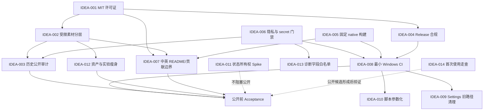

# LetsMakeMoney v0.7 Beta /idea 候选需求池

## 追踪信息

- 当前状态：`/idea` 已收口；完整 PRD 已生成，等待项目所有者确认
- 目标版本：v0.7 Beta
- 上游来源：`doc/releases/v0.7/review.md`、`open-source-readiness.md`、`slimming-audit.md`
- 下游承接：`doc/releases/v0.7/prd.md`（完整 PRD，待确认）
- 当前事实源：`doc/current.md`、本需求池、v0.7 三份 Review 文件
- Review 基线：`main` / `e6f25ae8cb4d9583aa3e629cb79416e278060117`
- 最后更新：2026-07-11

### 用户范围确认（2026-07-11）

- 版本组合：用户明确选择“过大方案”。
- 受限素材：选择同仓策略 A，保留现有完整历史，通过 `ASSETS_LICENSE.md` 明确禁止第三方自由复用、修改和再分发。
- README：选择 A，`README.md` 中文为主，链接独立 `README.en.md`。
- godot-cpp：确认使用固定 commit 的 bootstrap 脚本，不使用未锁定默认分支。
- 外部素材贡献：贡献者必须授权项目在官方 Release 中使用、修改和再分发。
- 产品判断保留：过大方案仍属于高风险范围，不能跳过 PRD 的分期、依赖、回退和退出门禁。

补充确认：

- 公开时点：V07-A 至 V07-E 全部完成后再公开仓库，不采用 V07-A 完成后提前公开。
- 多平台：未来预计覆盖 iOS、Android、macOS；v0.7 只完成路线规划、架构边界和可行性结论，不实现这些平台。
- 主题与更多宠物：v0.7 只完成产品规划、资产许可规则和后续版本边界，不实现新主题或新宠物。
- Main/native：不满足于只写状态说明，v0.7 要进行深度优化；但必须先完成行为测试、状态所有权和回退基线，不能直接重写。
- 安装器、签名和更新：方案待从第 8.4 节选择。

最终补充确认：

- 分发信任模型：采用 **C2 传统安装器 + 用户确认更新 + 便携 Zip**。
- Main/native 深度优化边界：允许调整状态缓存、职责拆分、native 消息协议和窗口 subclass 实现；任何修改都必须先有行为测试、状态合同、回退方案和真实 Windows 验收。
- 规划型阶段完成标准：iOS、Android、macOS、主题和更多宠物以设计文档评审通过为完成，不要求 v0.7 生成对应平台或主题代码。

PRD 阶段补充确认（2026-07-11）：

- 安装范围：仅当前用户，默认安装到 `%LOCALAPPDATA%\Programs\LetsMakeMoney`，不要求管理员权限。
- 卸载数据：默认保留 `%APPDATA%\LetsMakeMoney`；提供“同时删除设置和日志”，默认不勾选。
- 便携版数据：安装版与便携 Zip 继续共享 `%APPDATA%\LetsMakeMoney`，v0.7 不实现目录旁数据模式。
- 安装器签名：有效 Authenticode 签名是安装器公开分发门禁；签名未就绪时仅允许发布便携 Zip。
- 更新执行：应用检查、下载并校验 GitHub Release 安装器，用户再次确认后退出并交给安装器升级。
- 更新通道：Beta 默认接收 Beta 与稳定版，稳定版只接收稳定版，允许用户切换通道。
- 更新回退：保留上一版本安装包或明确回退入口；升级失败不污染配置。
- Main/native：允许分阶段拆分职责与整理消息协议，禁止一次性重写；每个切面必须有行为测试与独立回退。
- native 降级：单项能力失败时应用继续运行，禁用故障能力并给出一次提示和可诊断日志。
- 安装器：采用固定版本 Inno Setup。
- 安全报告：启用 GitHub Private Vulnerability Reporting。
- 双语同步：中文 README 是事实源，英文 README 在同一 PR 同步并由 CI 检查关键结构。
- 外部贡献：v0.7 接受代码、文档、UI 设计说明和 native 贡献，暂不接受外部素材文件贡献。
- 社区规范：采用 Contributor Covenant 2.1。
- 未来规划：多平台、主题、宠物扩展分别形成规划文档，不作实现承诺。

> 本文件只判断问题、价值、范围和去向。P0 是公开前门禁，不因压力测试得分被淘汰；P1 必须经过证据与成本压力测试后才能进入版本范围。

## 1. 已确认的项目所有者决策

| 决策 | 已确认口径 | 对 v0.7 的约束 |
|---|---|---|
| 代码许可证 | MIT | 根 LICENSE 只覆盖代码及明确标注文档 |
| 视觉素材 | 由项目所有者个人使用 AI 生成，不允许第三方自由复用、修改或再分发 | 必须使用独立资产许可，不能让整仓 MIT 产生误解 |
| Git 历史 | 接受公开完整历史和作者邮箱 | 默认保留当前仓库历史，不以新建干净仓库为前提 |
| native integration | 全部源码和构建方式公开 | 必须固定依赖并支持外部从零构建 |
| 外部贡献 | 接受代码、文档、UI、素材和 native 贡献 | CONTRIBUTING 必须定义代码与素材不同的入站授权 |
| README | 中英双语 | 需要单一事实源，避免两份 README 漂移 |
| 二进制分发 | 继续使用 GitHub Release | 包体许可、哈希和说明必须成为发布门禁 |
| 品牌 | 名称和 Logo 无已知商标限制 | Logo 仍属于不开放复用的受限素材 |
| 实验内容 | ComfyUI、临时素材包、私有验收证据不进入公开版 | 公开前必须从当前树排除，并防止误提交 |

## 2. 总体判断

### 2.1 v0.7 版本主线

v0.7 应定义为：

> **开源公开与可维护性基线版**：在不扩张产品功能的前提下，使 LetsMakeMoney 的代码许可、受限素材边界、Git 历史、原生构建、测试、发布包、隐私说明和贡献入口形成可审计闭环。

### 2.2 为什么不是其他方向

本版不适合优先做主题系统、安装器、自动更新、多平台、更多宠物或动画大修，因为当前最直接的版本目标是把已经可用的 v0.6 安全公开。功能扩张会增加新的代码、资产、许可和发布面，反而延后公开门禁。

本版也不应把“代码瘦身”理解为大重构。Settings 旧路径、测试重复和历史脚本确实带来维护成本，但只有证据充分、回归可控的部分才进入推荐范围；窗口、托盘和 native 状态机不在 v0.7 直接重构。

### 2.3 成功标准

- 代码和文档明确采用 MIT，受限素材有独立、醒目的许可边界。
- 保留完整 Git 历史时，不公开凭证、私有验收证据、ComfyUI 本机资料或不必要临时包。
- 外部贡献者可从全新 clone 完成 Godot 项目加载、native 构建和核心验证。
- GitHub Release 包含准确说明、checksum、MIT、Godot/godot-cpp 和第三方 notices。
- README、CONTRIBUTING、SECURITY 和 CI 能支持第一批外部用户与贡献者。
- 公开前 Acceptance 能证明仓库、Release、许可、隐私和构建事实一致。

## 3. 证据映射

| 来源证据 | 对应候选 | 证据等级 | 说明 |
|---|---|---|---|
| 根目录无 LICENSE；所有者已选择 MIT | IDEA-001 | 强 | 法律门禁已确定方向，只缺实施 |
| 视觉素材明确不开放复用，当前与代码同仓 | IDEA-002 | 强 | 混合许可边界是公开前必答题 |
| 当前历史可公开决策已确认，但历史存在本机路径和素材 | IDEA-003 | 强 | 不必新建仓库，但必须做公开前历史清单和披露 |
| v0.6 Zip 无第三方许可文件，包内说明仍是候选快照 | IDEA-004 | 强 | GitHub Release 分发继续存在，必须修复 |
| godot-cpp 被忽略、无 submodule、下载默认分支 | IDEA-005 | 强 | 外部 clone 无法复现作者本机依赖身份 |
| `.manual-test` 等 1.08 GB 未跟踪内容未被 ignore | IDEA-006 | 强 | 有真实误提交与隐私风险 |
| README/脚本含本机绝对路径，无 CONTRIBUTING/SECURITY | IDEA-007 | 强 | 外部用户无法可靠上手或贡献 |
| 无 GitHub Actions；本机关键验证通过 | IDEA-008 | 强 | 已有脚本可复用，但缺远端可信门禁 |
| Settings 1765 行，新旧 UI 构建路径并存 | IDEA-009 | 强 | 维护问题真实；不影响当前用户路径 |
| 旧测试固定无运行调用 API；包脚本高度重复 | IDEA-010 | 强 | 工程债真实，但清理需要先改测试 |
| Main/Windows/native 多层状态缓存与双阶段重套 | IDEA-011 | 强 | 复杂但承担历史稳定职责，不能直接重构 |
| `temp/`、`experiments/`、ComfyUI 资料不进入公开版已确认 | IDEA-012 | 强 | 仓库瘦身方向已确认，仍需引用与归档验证 |
| 诊断摘要使用最近语义日志正文 | IDEA-013 | 中 | 当前未发现泄露，但未来日志可能带路径 |
| 公开后首次运行、反馈与支持路径尚无真实外部用户证据 | IDEA-014 | 弱 | 有合理性，但不能抢占公开门禁 |

## 4. 候选需求总览

| ID | 标题 | 类型 | 优先级 | 证据等级 | 压力测试 | 置信度 | 分档结论 | 依赖 | 建议去向 | 最小下一步 |
|---|---|---|---|---|---|---|---|---|---|---|
| IDEA-001 | MIT 代码许可证落地 | 法律/文档 | P0 | 强 | 门禁项 39/40 | 高 | 必须完成 | 无 | 进入 `/prd` | 定义适用目录、版权主体与年份 |
| IDEA-002 | 受限视觉素材与 MIT 代码分层 | 资产/法律 | P0 | 强 | 门禁项 37/40 | 高 | 必须完成 | IDEA-001 | 进入 `/prd` | 选择同仓受限许可结构并拟定资产清单 |
| IDEA-003 | 保留完整历史的公开前审计 | 隐私/历史 | P0 | 强 | 门禁项 35/40 | 高 | 必须完成 | IDEA-002/006 | 进入 `/prd` | 定义历史扫描、路径披露与发布批准门禁 |
| IDEA-004 | 第三方 notices 与 Release 合规 | 发布/法律 | P0 | 强 | 门禁项 38/40 | 高 | 必须完成 | IDEA-001/002 | 进入 `/prd` | 明确包内 LICENSES 结构和打包校验 |
| IDEA-005 | 固定 native 依赖与从零构建 | 构建/供应链 | P0 | 强 | 门禁项 38/40 | 高 | 必须完成 | IDEA-004 | 进入 `/prd` | 固定 godot-cpp commit/tag 和 bootstrap 方式 |
| IDEA-006 | 隐私目录、绝对路径与 secret 门禁 | 隐私/安全 | P0 | 强 | 门禁项 37/40 | 高 | 必须完成 | 无 | 进入 `/prd` | 定义 ignore、脱敏、gitleaks 和证据保留规则 |
| IDEA-007 | 中英双语公开入口与贡献边界 | 文档/社区 | P0 | 强 | 门禁项 35/40 | 高 | 必须完成 | IDEA-001/002/005 | 进入 `/prd` | 确定 README 双语结构和贡献授权文字 |
| IDEA-008 | 最小 Windows CI 与发布事实一致性 | 工程质量/发布 | P0 | 强 | 门禁项 34/40 | 高 | 必须完成 | IDEA-005/006 | 进入 `/prd` | 定义 CI 最小矩阵和不可自动化边界 |
| IDEA-009 | Settings 旧 UI 构建路径清理 | 代码瘦身 | P1 | 强 | 29/40 | 高 | 小范围推进 | IDEA-008/010 | 进入 `/prd` 的可选模块 | 先补 UI/事务行为回归 |
| IDEA-010 | 验证与打包脚本参数化 | 工程质量 | P1 | 强 | 31/40 | 高 | 推荐小范围推进 | IDEA-008 | 进入 `/prd` | 合并 package/verify 公共内核，保留 wrapper |
| IDEA-011 | Main/native 状态所有权与深度优化 | 架构治理 | P1 | 强 | 24/40 | 高 | 分阶段推进 | IDEA-008 | 技术 spike → `/prd` | 先输出合同和行为基线，再决定重构切面 |
| IDEA-012 | 临时、实验和历史资产瘦身 | 仓库治理 | P1 | 强 | 32/40 | 高 | 推荐推进 | IDEA-002/003/006 | 进入 `/prd` | 建移出清单并做 runtime/export 引用验证 |
| IDEA-013 | 诊断摘要字段白名单 | 隐私增强 | P1 | 中 | 27/40 | 中 | 小范围推进 | IDEA-006 | 进入 `/prd` 的可选模块 | 添加含路径日志样例测试 |
| IDEA-014 | 开源首次使用体验优化 | 用户体验 | P2 | 弱 | 20/40 | 中低 | 继续验证 | IDEA-007/008 | 继续验证 | 用干净环境完成一次外部用户式走查 |
| IDEA-015 | 完整社区治理体系 | 社区运营 | P1 | 弱 | 15/40 | 高 | 用户指定推进，范围从简 | IDEA-007/008 | 进入 `/prd` | 只建立公开所需治理，不设计企业流程 |
| IDEA-016 | iOS/Android/macOS、主题与更多宠物路线规划 | 产品规划 | P1 | 弱 | 21/40 | 中 | 只做规划 | IDEA-002/005 | 进入 `/prd` 的规划模块 | 输出平台矩阵、资产规则和后续版本门禁 |
| IDEA-017 | Windows 安装器、签名与更新 | 分发/安全 | P1 | 中 | 27/40 | 中 | 方案待选 | IDEA-004/005/008 | 进入 `/prd` | 从 C1-C4 选择信任模型 |

## 5. P1 压力测试

### 5.1 评分总表

| ID | 痛点 | 场景 | 证据 | 紧迫 | 主线贡献 | 替代方案 | 成本可控 | 验证速度 | 总分 | 结论 |
|---|---:|---:|---:|---:|---:|---:|---:|---:|---:|---|
| IDEA-009 | 3 | 4 | 4 | 2 | 4 | 3 | 4 | 5 | 29 | 部分通过；只清旧路径 |
| IDEA-010 | 3 | 4 | 5 | 3 | 4 | 3 | 4 | 5 | 31 | 部分通过；接近推进线 |
| IDEA-011 | 3 | 4 | 5 | 2 | 3 | 2 | 1 | 4 | 24 | 部分通过；Spike 是深度优化强制前置 |
| IDEA-012 | 4 | 5 | 5 | 4 | 5 | 3 | 3 | 3 | 32 | 通过；需引用验证后执行 |
| IDEA-013 | 3 | 4 | 3 | 2 | 4 | 3 | 4 | 4 | 27 | 部分通过；只做白名单 |
| IDEA-014 | 2 | 3 | 1 | 2 | 3 | 3 | 3 | 3 | 20 | 证据闸门触发，继续验证 |
| IDEA-015 | 1 | 2 | 1 | 1 | 2 | 3 | 2 | 3 | 15 | 压力测试未通过；按用户决策只做最小治理 |
| IDEA-016 | 2 | 3 | 2 | 1 | 3 | 4 | 3 | 3 | 21 | 只允许规划，不进入产品实现 |
| IDEA-017 | 3 | 4 | 3 | 3 | 4 | 3 | 2 | 5 | 27 | 部分通过；先选信任模型并做 Spike |

### 5.2 IDEA-009：Settings 旧 UI 构建路径清理

- 产品问题：公开后贡献者首先面对 1765 行 Settings 文件；未调用旧 `_build_ui()` 与当前 `_build_compact_ui()` 并存，会放大理解和修改成本。
- 目标用户/场景：贡献 Settings、Wizard 或共享控件的开发者。
- 当前替代方案：保留旧代码，通过文档提醒不要调用；只能绕开，不能减少误改。
- 价值判断：中价值，维护收益明确，不是用户功能。
- 低分项：紧迫性只有 2；不清理也不阻塞代码公开。
- 范围保护：只删除已证实未调用的旧 UI 路径及专用 helper，不重做 Settings 结构和视觉。
- 测试缺口：五页 UI、OptionButton、Switch、Slider、SpinBox、保存/取消/失败、恢复默认、Wizard 共享控件、2K DPI。
- 删除验证：静态引用、动态 call、scene/signal、v0.4-v0.6 自动回归、Computer Use 截图。
- 结论：可作为推荐方案中的有限 P1；测试未补齐前不删除。

### 5.3 IDEA-010：验证与打包脚本参数化

- 产品问题：按版本复制脚本容易漏改包名、manifest、说明和状态，已出现包内外口径分叉。
- 目标用户/场景：维护者和提交发布相关 PR 的贡献者。
- 当前替代方案：继续复制脚本并人工 diff；可行但错误率随版本增加。
- 价值判断：中高工程价值。
- 低分项：替代方案仍能工作，不能为统一脚本破坏旧命令。
- 范围保护：建立公共内核，v0.4-v0.6 wrapper 保留兼容；不重写全部测试框架。
- 测试缺口：同一输入生成相同 manifest/checksum；旧 wrapper 退出码一致；历史包验证结果一致。
- 删除验证：逐文件 diff、参数化 dry run、旧包回归、包内文件清单对照。
- 结论：推荐进入 v0.7，但从属于 CI/Release 门禁，不独立扩成框架重构。

### 5.4 IDEA-011：Main/native 状态所有权与深度优化

- 产品问题：窗口显隐、任务栏、点击穿透和托盘状态在 Main、WindowsPlatform、native 多层维护，贡献者难判断谁是事实源。
- 目标用户/场景：修改托盘、窗口或 native 的贡献者。
- 当前替代方案：依赖历史 bugfix 文档和保守不改；能保持稳定但理解成本高。
- 价值判断：架构说明价值高；用户已明确要求深度优化，但立即无门禁重构仍不成立。
- 低分项：成本可控性 1，错误可能导致窗口无法找回。
- 范围保护：第一阶段只产出状态所有权图、不变量、缓存失效条件和测试矩阵；通过后才允许拆分职责、消除重复缓存或调整 native 边界。
- 测试缺口：Explorer 重启、DPI、睡眠恢复、Modal 中托盘恢复、normal/pure 真实 10 轮。
- 结论：技术 Spike 是强制前置；Spike 通过后进入 `/prd` 定义的深度优化模块。任何无法被行为测试覆盖的切面不得重写。

### 5.5 IDEA-012：临时、实验和历史资产瘦身

- 产品问题：`temp/`、`experiments/`、ComfyUI 本机资料和重复预览扩大权属面、历史体积和贡献者噪音。
- 目标用户/场景：所有公开仓库浏览者、clone 用户和发布维护者。
- 当前替代方案：通过 README 解释哪些目录不用看；不能消除许可与误提交风险。
- 价值判断：高，且项目所有者已确认这些内容不进入公开版。
- 风险：误移 fallback pet 或生成链输入会破坏运行和再生成能力。
- 测试缺口：runtime `.tres` 引用、export 包资源、fallback 选择、生成脚本输入、Git LFS/历史策略。
- 删除验证：资源引用图、hash 比对、Godot import、v0.6 回归、包体文件搜索。
- 结论：进入推荐方案；实施以“移出公开候选并保留私有归档”为主，不做不可恢复删除。

### 5.6 IDEA-013：诊断摘要字段白名单

- 产品问题：摘要当前会提取最近语义事件；未来日志若写入路径，可能被摘要复制出去。
- 目标用户/场景：向 Issue 提交诊断摘要的用户。
- 当前替代方案：要求用户人工检查；容易遗漏。
- 价值判断：中价值隐私增强。
- 低分项：当前没有真实泄露证据，紧迫性有限。
- 范围保护：只允许已定义事件 ID 与字段，不建设诊断中心。
- 测试缺口：用户名、绝对路径、配置路径、窗口句柄、未知事件样例。
- 结论：作为 P0 隐私门禁的可选小模块进入 PRD，不单独扩范围。

### 5.7 IDEA-014：开源首次使用体验

- 产品问题：README 和 Release 尚未被真实外部用户从零验证。
- 证据：只有 Review 推断，缺少外部用户反馈，证据 1 分触发闸门。
- 最小验证：在干净 Windows 用户或虚拟机中，按 README 完成下载运行、clone、Godot 打开、native build、测试和 Issue 取证。
- 进入 PRD 条件：走查出现可复现阻塞，或至少 3 条外部反馈集中在同一环节。
- 结论：继续验证，不预设新增 UI。

### 5.8 IDEA-015：完整社区治理体系

- 产品问题：公开并接受外部贡献需要基础秩序，但当前尚无真实贡献者规模证据。
- 压力测试：15/40，按价值判断本应延后；用户已选择过大方案并要求全部阶段完成。
- 范围保护：只做 LICENSE、CONTRIBUTING、SECURITY、Issue/PR 模板、基础标签和分支保护建议；不做 CLA、治理委员会、复杂审批和企业流程。
- 结论：作为用户指定范围进入 PRD，但不得借“完整”扩大为组织治理系统。

### 5.9 IDEA-016：未来平台、主题与宠物路线规划

- 产品问题：未来扩展方向缺少平台边界、资产许可和版本依赖说明。
- 当前确认：目标平台预计为 iOS、Android、macOS，但 v0.7 暂不实现；主题和更多宠物也只规划。
- 交付边界：平台能力矩阵、native 抽象缺口、移动端桌宠形态可行性、主题/宠物资产许可和后续进入 `/idea` 的证据门禁。
- 非目标：不生成移动端工程、不开发主题系统、不新增宠物素材。
- 结论：进入 PRD 的规划模块，以评审通过的文档作为完成标准。

### 5.10 IDEA-017：Windows 安装器、签名与更新

- 产品问题：继续通过 GitHub Release 分发时，Zip 缺少安装生命周期、发布者信任和更新闭环。
- 证据：现有用户仍可手工解压回滚；因此不是产品阻塞，但属于过大方案明确扩展目标。
- 价值判断：中价值、高安全责任。
- 成本闸门：签名、更新源、版本防降级、失败恢复和卸载数据保留必须在 PRD 定义。
- 结论：进入 PRD，先从 C1-C4 选择信任模型；当前推荐 C2 + 便携 Zip。

## 6. P0 需求详情

### IDEA-001：MIT 代码许可证落地

- 问题：当前无根许可证，公开后第三方没有明确使用权。
- 价值：开源成立的法律基础。
- 正常范围：标准 MIT 全文、版权主体/年份、SPDX 使用规则、代码与文档适用范围。
- 非目标：不把受限素材自动纳入 MIT，不引入 CLA。
- 去向：进入 `/prd`。

### IDEA-002：受限视觉素材与 MIT 代码分层

- 问题：视觉素材不允许自由复用，但当前与 MIT 候选代码同仓且存在完整历史。
- 价值：避免用户误以为整仓均为 MIT，也保护品牌素材。
- 推荐方案：当前仓库保留历史；根 README、LICENSE 附加说明和 `ASSETS_LICENSE.md` 明确排除路径，贡献指南规定素材入站授权。公开 Git 历史在技术上仍可下载，法律边界依靠清晰声明。
- 需要确认的平台证据：每批 AI 素材的生成平台、模型、日期、是否使用第三方参考图和当时条款。
- 非目标：不在 v0.7 重画全部宠物素材。
- 去向：进入 `/prd`。

### IDEA-003：保留完整历史的公开前审计

- 问题：所有者接受公开历史，但公开动作不可逆地暴露旧路径、提交身份和历史素材。
- 价值：把“接受邮箱公开”与“确认历史没有凭证/受限第三方资产”分开。
- 正常范围：gitleaks 或同类扫描、历史大 blob 清单、路径与身份披露、资产历史确认、公开批准记录。
- 非目标：默认不重写 Git 历史；只有发现真实凭证或第三方受限资产时才另行决策。
- 去向：进入 `/prd`，并在 `/acceptance` 实际复核。

### IDEA-004：第三方 notices 与 Release 合规

- 问题：v0.6 Zip 没有 Godot/godot-cpp 许可文件，包内说明也与外部发布状态不同。
- 价值：合法且准确地继续通过 GitHub Release 分发。
- 正常范围：`THIRD_PARTY_NOTICES.md`、`LICENSES/`、资产许可、manifest/checksum、包内外同源 release notes、打包失败门禁。
- 非目标：不做安装器、签名或自动更新。
- 去向：进入 `/prd`。

### IDEA-005：固定 native 依赖与从零构建

- 问题：本机有特定 godot-cpp commit，但仓库只会拉取变化中的默认分支。
- 价值：外部贡献者能复现 native DLL，降低供应链漂移。
- 正常范围：固定 commit/tag、下载校验、可覆盖工具路径、从零构建说明、失败提示。
- 方案候选：submodule；或 bootstrap 脚本按固定 commit clone。推荐后者需在 PRD 比较 Windows 用户体验。
- 非目标：不更换 native 技术栈。
- 去向：进入 `/prd`。

### IDEA-006：隐私目录、绝对路径与 secret 门禁

- 问题：真实验收目录未忽略，文档与脚本含本机路径，历史扫描尚无专业 secret scanner。
- 价值：避免公开配置、日志、截图和个人环境。
- 正常范围：`.gitignore`、占位路径、secret scan、诊断/日志隐私说明、公开前只读检查。
- 非目标：不清理用户本机数据，不把私有证据提交到仓库。
- 去向：进入 `/prd`。

### IDEA-007：中英双语公开入口与贡献边界

- 问题：现 README 面向内部阶段文档，不足以支持公开用户和贡献者。
- 价值：降低首次理解和贡献成本。
- 推荐结构：中文主 README + 英文等价入口，公共事实段由同一清单维护；避免两个版本独立漂移。
- 必须覆盖：定位、Windows-only、Beta、下载、构建、验证、受限素材、隐私、已知限制、贡献范围、Security 联系方式。
- 非目标：不机械建立企业级社区治理。
- 去向：进入 `/prd`。

### IDEA-008：最小 Windows CI 与发布事实一致性

- 问题：本机脚本通过，但外部 PR 和 Release 没有远端门禁。
- 价值：防止公开后主分支和二进制失去可信度。
- 正常范围：UTF-8/文档/许可/secret、Godot headless、native build、package structure/checksum；真实托盘视觉继续人工验收。
- 非目标：不把 Windows 通知区真实鼠标行为伪装成 CI 已覆盖，不自动发布正式 Release。
- 去向：进入 `/prd`。

## 7. 依赖关系

## 8. 三档范围方案

### 8.1 最小方案

包含：

- IDEA-001 至 IDEA-008 的最低公开闭环。
- IDEA-012 只移出已确认的 ComfyUI、临时包和私有验收证据。
- 不做 Settings 代码清理、脚本参数化、状态所有权 Spike 和诊断增强。

优点：最快满足公开门禁，业务代码几乎不动。
风险：公开后 Settings 与脚本维护债仍高，第一批贡献者理解成本较大。
判断：可行，但略显“先公开再治理”。

### 8.2 推荐方案

包含：

- IDEA-001 至 IDEA-008 全部 P0。
- IDEA-010：只参数化 package/package verify，保留历史 wrapper。
- IDEA-012：完整移出公开版排除项，并保留私有归档索引。
- IDEA-013：诊断摘要字段白名单。
- IDEA-009：仅在行为测试补齐后删除明确未调用的 Settings 旧 UI 路径。
- IDEA-011 只产出技术 Spike 文档，不改窗口/native 运行逻辑。
- IDEA-014 作为发布候选形成后的验证活动，不预设功能改动。

优点：公开门禁与最明显维护债同时收敛，仍然保持个人项目可完成性。
风险：Settings 清理和脚本参数化可能延长版本；必须允许它们在证据不足时从版本退出。
判断：**推荐。**

### 8.3 过大方案

在推荐方案上继续加入：

- Main/WindowsPlatform/native 实际重构。
- 全部旧脚本和 API 清理。
- 自动 Release、安装器、签名、更新器。
- 多平台、主题、更多宠物、完整素材替换。
- 完整社区治理、CLA、Discussions、复杂分支策略。

风险：版本从“公开准备”膨胀为架构重写、分发平台和产品扩张；托盘/点击穿透回归概率高，开源日期失控。
判断：不推荐。

**用户决策**：已选择本方案作为 v0.7 目标范围。该选择覆盖上面的产品判断，但不取消证据闸门。进入 PRD 时必须把范围拆成可独立验收、可中止的串行阶段；任何一个阶段失败，不得用“整体 v0.7 尚未完成”掩盖阻塞项。

建议的 PRD 分期边界：

1. **V07-A 开源门禁**：IDEA-001 至 IDEA-008、IDEA-012、IDEA-013。未通过前不得公开仓库。
2. **V07-B 维护性治理**：IDEA-009、IDEA-010、IDEA-011，以及有测试保护的旧 API 清理。
3. **V07-C 分发能力**：自动 Release、安装器、签名/更新策略；必须另设安全与回滚门禁。
4. **V07-D 产品扩张**：多平台、主题、更多宠物和素材体系；每项仍需独立问题定义与原型，不得只因选择过大方案就默认实现。
5. **V07-E 社区治理**：完整治理文件、贡献流程和自动化安全检查；按实际贡献者规模裁剪。

其中 V07-A 是公开仓库的必要条件；V07-B 至 V07-E 是用户确认的 v0.7 扩展目标，但不应阻塞 V07-A 的独立验收结论。是否允许先公开 V07-A、其余继续以 v0.7 后续里程碑推进，需要在 PRD 第一轮确认。

用户已进一步确认：仓库必须等 V07-A 至 V07-E 全部完成后再公开。各阶段仍需独立验收，以便识别失败点，但不会提前修改仓库可见性。

### 8.4 安装器、签名与更新信任模型候选

#### 方案 C1：便携 Zip + 更新提醒

- 产物：继续提供 Zip 和 SHA256，不提供安装器。
- 更新：应用只检查 GitHub 最新 Release，提示用户打开网页手动下载。
- 签名：可不签名，但 Windows 可能显示未知发布者或 SmartScreen 提示。
- 优点：成本最低、实现和回滚最简单。
- 缺点：不满足“安装器和自动更新”扩展目标。
- 判断：最小方案，不匹配当前选择的过大范围。

#### 方案 C2：传统安装器 + 用户确认更新（推荐）

- 产物：保留便携 Zip，同时提供 Inno Setup 或 NSIS 生成的 Windows 安装器。
- 更新：应用检查 GitHub Release；发现新版本后展示版本、说明和哈希，用户确认后下载完整安装器。
- 校验：下载后校验 SHA256；有签名时同时验证 Authenticode 发布者和签名状态。
- 安装：退出桌宠后由用户确认启动安装器，不做后台静默替换。
- 回滚：保留上一稳定安装包和配置备份；更新失败不覆盖当前可运行版本。
- 签名：优先评估 Azure Artifact Signing 或受信任 CA 证书；没有可信签名前不得把“无警告安装”写入验收。
- 优点：兼容当前 Win32 托盘、注册表自启、纯桌宠和 `%APPDATA%` 数据路径；信任边界清楚。
- 缺点：需要维护安装、升级、卸载、签名和下载恢复链路。
- 判断：当前推荐。

#### 方案 C3：签名安装器 + 自动下载和自动安装

- 产物：签名 EXE/MSI 安装器与便携 Zip。
- 更新：应用自动检查和下载，空闲时提示或自动启动安装。
- 信任：必须校验 HTTPS 来源、版本单调性、SHA256、签名发布者、包签名和防降级策略。
- 恢复：需要更新状态机、断点/失败恢复、旧版本回滚和进程协作。
- 优点：用户操作最少。
- 缺点：安全责任、测试矩阵和误更新风险显著增加；静默安装会削弱用户控制。
- 判断：不推荐作为个人桌宠 v0.7 的首版更新器。

#### 方案 C4：MSIX + App Installer 或 Microsoft Store

- 产物：MSIX / `.appinstaller`，可保留 Zip 作为开发版。
- 更新：由 Windows App Installer 或 Microsoft Store 管理；MSIX 自动更新能力成熟。
- 签名：MSIX 必须使用设备信任的有效签名；通过 Microsoft Store 发布时由 Store 重新签名。
- 风险：必须专项验证托盘、开机自启、任务栏策略、纯桌宠、数据路径、升级与降级；现有 Win32 行为不能默认等价。
- 优点：系统级安装和更新信任更强。
- 缺点：身份、签名、分发渠道和当前 native 行为适配成本最高。
- 判断：适合技术 Spike 或未来 Store 版本，不推荐直接作为 v0.7 唯一分发方式。

推荐组合：**C2 + 便携 Zip**。自动化范围止于“检查、展示、下载、校验和启动安装器”，最终安装必须由用户明确确认，不做后台静默更新。

**用户决策**：已确认采用该推荐组合。安装器具体使用 Inno Setup 或 NSIS，可在 PRD 中定义共同能力后，由开发前技术 Spike 根据 Godot 导出、升级/卸载、签名和 CI 适配结果选型。

## 9. 最终分流

### 9.1 建议进入 `/prd`

- IDEA-001：MIT 代码许可证落地。
- IDEA-002：受限视觉素材与 MIT 代码分层。
- IDEA-003：保留完整历史的公开前审计。
- IDEA-004：第三方 notices 与 Release 合规。
- IDEA-005：固定 native 依赖与从零构建。
- IDEA-006：隐私目录、绝对路径与 secret 门禁。
- IDEA-007：中英双语公开入口与贡献边界。
- IDEA-008：最小 Windows CI 与发布事实一致性。
- IDEA-010、IDEA-012、IDEA-013：作为推荐方案中的受控支撑模块。
- IDEA-009：作为可退出的有限瘦身模块，前提是先补行为测试。
- IDEA-011：先技术 Spike，再进入受门禁保护的深度优化。
- IDEA-015：按用户决策进入最小社区治理范围。
- IDEA-016：只进入规划，不进入平台、主题或宠物实现。
- IDEA-017：进入分发信任模型和安装更新 PRD。

### 9.2 直接修文档

以下事实不需要再次做价值判断，但应由后续 PRD 统一安排，避免抢跑：

- README 和 current 中区分当前 HEAD 与验收 HEAD。
- 将本机路径改为占位符。
- 明确代码 MIT、素材受限、开机自启暂不验证。
- 记录 ComfyUI、临时包和私有验收证据不进入公开版。

### 9.3 技术 Spike

- IDEA-011：Main / WindowsPlatform / native 状态所有权；Spike 通过后才能进入深度优化，不允许跳过。
- IDEA-005 若 submodule 与固定 bootstrap 方案无法直接选择，可先做短 Spike。
- IDEA-017：安装器、签名服务和更新源方案验证。

### 9.4 继续验证

- IDEA-014：在干净 Windows 环境做外部用户式走查。
- IDEA-009：补齐 Settings/Wizard 行为和视觉证据后再决定是否删除旧路径。
- 资产生成平台、模型与条款记录仍需人工补齐。

### 9.5 暂不处理

- iOS、Android、macOS 的实际工程实现。
- 主题系统和更多宠物的实际功能与素材实现。
- 无测试保护的 Main/native 整体重写。
- 删除所有历史文档、tag 或完整 Git 历史。

## 10. 进入 `/prd` 前需确认

已确认：

1. 采用过大方案。
2. 受限视觉素材采用同仓策略 A。
3. `README.md` 中文为主，链接独立 `README.en.md`。
4. godot-cpp 使用固定 commit 的 bootstrap 脚本。
5. 外部素材贡献必须授权项目在官方 Release 中使用、修改和再分发。
6. V07-A 至 V07-E 全部完成后再公开。
7. iOS、Android、macOS 在 v0.7 只做规划，不做实现。
8. 主题和更多宠物在 v0.7 只做规划，不做实现。
9. Main/native 进入深度优化范围，必须以行为测试和回退门禁为前置。
10. 分发采用 C2：传统安装器 + 用户确认更新 + 便携 Zip。
11. Main/native 允许调整 native 消息协议和窗口 subclass，但必须通过行为测试与真实 Windows 验收。
12. 多平台、主题和更多宠物规划以设计文档评审通过为完成，不要求代码实现。

进入 PRD 后仍需通过分轮提问收敛，但不再阻塞 `/idea` 完成：

1. Inno Setup 与 NSIS 的最终选型指标和 Spike 通过标准。
2. 更新检查频率、用户关闭更新提醒、网络失败、版本降级和回滚的具体产品行为。
3. Main/native 深度优化的模块切分顺序、不可变行为和每阶段停止条件。
4. 多平台路线规划需要达到的技术深度，以及移动端“桌宠”形态不可行时的替代产品形态。

## 11. 下一阶段建议

推荐下一步：进入 `/mypm /prd`，先用 2-3 轮提问收敛第 10 节剩余架构与范围问题，再生成按 V07-A 至 V07-E 分期的完整 PRD。PRD 必须保留“公开门禁”和“扩展目标”的独立验收结论；在 PRD 确认前不创建 LICENSE、不移动素材、不改构建脚本、不新增 CI。
