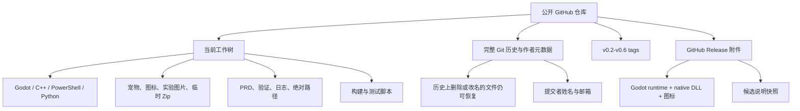

# LetsMakeMoney v0.7 开源公开准备审计

**日期**：2026-07-11
**审计对象**：`main` / `e6f25ae8cb4d9583aa3e629cb79416e278060117`
**当前可见性**：private
**审计结论**：当前不适合直接公开；完成 P0 门禁后重新验收

> 本文件关注“公开会暴露什么、外部能否合法使用、能否复现构建”。不代表对任何许可证或资产权利给出法律意见。

## 1. 公开准备总表

| 领域 | 当前状态 | 证据状态 | 公开门禁 | 结论 |
|---|---|---|---|---|
| 产品与发布状态 | v0.6 Beta 已发布为 Pre-release | 已确认 | 无 | 可公开说明 |
| 当前事实源 | `doc/current.md` + v0.6 版本文档 | 已确认 | 小幅修正 HEAD 语境 | 基本可用 |
| 源代码许可证 | 已确认采用 MIT；根目录尚未添加 LICENSE | 已确认 | 必须添加标准 MIT 文本并声明适用范围 | 阻塞实施 |
| 第三方许可证 | 本地 godot-cpp 有 MIT 文件，发布包没有 notices | 已确认 | 必须建立清单并进入包体 | 阻塞 |
| 素材权属 | 所有者确认主要素材由个人使用 AI 生成，且不允许第三方自由复用、修改或再分发 | 已确认 | 必须与 MIT 代码明确分离并建立资产许可 | 阻塞实施 |
| 当前树敏感信息 | 未发现明显 key/token/private key；存在本机路径 | 已确认 | 清理路径与未跟踪证据 | 阻塞 |
| Git 历史敏感信息 | 未发现明显凭证；存在作者邮箱和本机路径 | 已确认 | 所有者确认公开历史策略 | 阻塞决策 |
| 原生构建 | 本机可增量构建；依赖未固定 | 已确认 | 固定 godot-cpp 与环境说明 | 阻塞 |
| 自动测试 | 本机关键脚本通过 | 已确认 | 外部 CI 尚缺失 | 建议随 v0.7 完成 |
| 发布包 | 可运行且 checksum 通过 | 已确认 | 缺许可文件，内部说明滞后 | 阻塞公开版分发 |
| 社区治理 | 无 CONTRIBUTING / SECURITY / Issue 模板 | 已确认 | 最小集合必须补齐 | 阻塞外部贡献入口 |

## 2. 公开暴露面

## 3. 当前工作树敏感信息审计

### 3.1 扫描结果

使用启发式模式扫描当前工作树，排除 `.git`、本地 godot-cpp、未跟踪验收目录和发布目录：

| 类型 | 结果 | 证据状态 |
|---|---:|---|
| PEM / OpenSSH / RSA / EC 私钥标记 | 0 个文件 | 已确认 |
| 常见 GitHub token 格式 | 0 个文件 | 已确认 |
| 常见 `api_key` / `access_token` / `client_secret` / `password=` 赋值 | 0 个文件 | 已确认 |
| 邮箱正文 | 0 个文件 | 已确认 |
| Windows 用户目录 | 6 个文件 | 已确认 |
| 本机绝对路径 | 29 个文件 | 已确认 |

该结果只证明本轮模式未命中明显凭证，不等同于专业 secret scanner 或完整安全证明。本机未安装 gitleaks / trufflehog。**证据状态：已确认。**

### 3.2 需要公开前处理的当前路径

- 历史验证文档包含真实 `%APPDATA%` 用户路径或本机目录。
- `doc/v0.4-comfyui-spike.md` 记录真实下载目录、GPU、外部软件安装目录和本机用户名路径。
- 素材 README 曾记录本机临时源路径，但没有可公开的源文件与授权描述。
- ComfyUI、native 和验证脚本默认参数写死作者机器目录。

建议：

1. 运行脚本的默认值改为自动发现、环境变量或显式参数。
2. 当前文档使用 `%USERPROFILE%`、`<PROJECT_ROOT>`、`<GODOT_EXE>` 等占位符。
3. 历史环境调查保留在私有归档，不进入公开仓库，或在建立干净仓库时排除。

### 3.3 未跟踪目录风险

当前以下目录未被 `.gitignore` 覆盖：

- `.manual-test/`
- `.tmp_acceptance/`
- `releases/v0.6/`

三者合计约 1.08 GB、144 个文件，内容类型包括配置、日志、截图、解压 EXE、DLL 和 Zip。它们目前没有提交，因此不会自动公开；但公开前若误用 `git add .`，风险很高。

公开前要求：

- 将真实验收证据目录加入 `.gitignore`。
- 发布产物使用 GitHub Release 或专门构建目录，不混入源码提交。
- 若需要保留证据，只提交脱敏后的索引或最小文本摘要。

## 4. Git 历史审计

### 4.1 历史启发式扫描

扫描 `git rev-list --objects --all` 中可读取的文本 blob：

| 类型 | 历史命中 |
|---|---:|
| 私钥标记 | 0 个路径 |
| 常见 GitHub token | 0 个路径 |
| 常见 secret 赋值 | 0 个路径 |
| Windows 用户目录 | 7 个历史路径 |
| 本机绝对路径 | 35 个历史路径 |
| 文本正文邮箱 | 0 个路径 |

同时，Git 提交与 tag 元数据存在两个唯一作者邮箱域，其中包含个人邮箱域。公开完整历史会公开这些元数据，即使正文扫描没有邮箱。**证据状态：已确认。**

### 4.2 历史大对象

最大的历史对象包括：

- 2.26 MB 临时宠物素材 Zip。
- 1.2-2.22 MB 的 AI 猫/狗参考图和 base 图。
- 多份历史版本的大 PRD、实施计划和 progress。

Git pack 当前约 18.96 MiB，不属于不可接受的大仓库，但主要大对象来自实验素材和临时包，而不是运行时源码。**证据状态：已确认。**

### 4.3 历史截图

历史图像路径共 141 个，当前列出的路径均集中在宠物素材、实验参考图、图标和预览图，没有发现 UI 验收截图路径。图像内容仍需在公开前做一次人工视觉抽检，尤其是 AI 参考图和图标来源。**证据状态：高度可能。**

## 5. 许可证与依赖

### 5.1 项目许可证

仓库根目录没有 `LICENSE`、`COPYING` 或等效授权文件。公开 GitHub 仓库并不会自动赋予他人使用、修改或再分发权利。

项目所有者已经确认源代码采用 **MIT License**。公开前仍需：

- 在根目录加入标准 MIT 全文，并写明版权主体与年份。
- 明确 MIT 只覆盖代码及明确标注的文档，不自动覆盖 `assets/`、`icons/` 和受限视觉素材。
- 为受限素材增加 `ASSETS_LICENSE.md` 或同等文件。
- CONTRIBUTING 明确外部代码贡献按 MIT 提交；素材贡献者必须声明其拥有授权，并同意项目约定的素材许可。
- 根据个人项目规模选择 DCO 或简单的贡献声明；当前不建议引入 CLA。

### 5.2 第三方依赖与资产清单

| 项目 | 类型 | 来源 | 许可证/授权 | 是否可公开 | 是否可再分发 | 待确认 |
|---|---|---|---|---|---|---|
| Godot Engine 4.7 runtime | 引擎 / 发布二进制 | Godot 官方模板 | MIT + 引擎第三方 notices | 是，需合规 | 是，需附许可 | 发布包 notices 形式 |
| godot-cpp | C++ 绑定 | `godotengine/godot-cpp` | MIT | 是 | 是，需保留许可 | 固定 commit/tag |
| Windows API / SDK | 系统 API / 工具链 | Microsoft | 系统与 SDK 条款 | 源码可引用 | 系统 DLL 不随包分发 | 工具链文档 |
| MSYS2 / MinGW | 构建工具 | 外部安装 | 多许可证 | 不进入仓库 | 不随包分发 | 最小版本 |
| Python / SCons | 构建工具 | 外部安装 | 各自许可 | 不进入仓库 | 不随包分发 | 锁定版本需求 |
| Pillow | 素材生成依赖 | Python 包 | HPND | 脚本可公开 | 包未随 Release 分发 | requirements 声明 |
| 系统字体 | 运行时字体 | Windows 系统 | Windows 系统字体许可 | 不提交字体文件 | 不再分发字体 | README 说明 |
| 橘猫 v2 | 运行素材 | image generation concept + 派生脚本 | 未记录完整授权 | 待确认 | 待确认 | 平台、模型、条款、原图权利 |
| 橘猫 v1 | fallback 运行素材 | 本机源图派生 | 未记录授权 | 待确认 | 待确认 | `content.png` 来源与作者 |
| 占位猫 raw sheets | 运行/旧素材 | 未找到来源记录 | 未知 | 待确认 | 待确认 | 原作者与许可证 |
| App icon / tray icon | 品牌与发布素材 | 历史提交中生成/替换 | 未找到授权记录 | 待确认 | 待确认 | 创作者、生成工具、商业使用 |
| experiments AI 猫/狗图 | 实验素材 | AI 生成或外部参考 | 未完整记录 | 不建议直接公开 | 待确认 | 来源和保留价值 |
| ComfyUI helper scripts | 外部工具适配 | ComfyUI / Aki 外部安装 | 脚本为项目代码；外部工具各自许可 | 脚本可公开需审查 | 不分发外部工具 | 是否纳入公开主仓库 |
| Aki ComfyUI 资料 | 第三方工具说明 | 外部压缩包/启动器 | 文档记录“免费、不得转售”等限制 | 文档可否公开待确认 | 不应随仓库再分发工具 | 公开范围 |

Godot 官方文档明确要求分发 Godot runtime 时提供 Godot 许可证，并注意官方模板包含的第三方 notices。参考：

- <https://docs.godotengine.org/en/stable/about/complying_with_licenses.html>
- <https://github.com/godotengine/godot-cpp>

当前 v0.6 Zip 仅包含 EXE、native DLL、icon、README、release notes、manifest 和 checksums，没有 `LICENSES/` 或 `THIRD_PARTY_NOTICES.md`。**证据状态：已确认。**

## 6. 资产公开策略

项目所有者确认橘猫、占位猫、图标和相关 AI 视觉素材不允许第三方自由复用、修改或再分发。因此不能把它们无说明地放在 MIT 仓库中。建议将资产分成三层：

1. **官方受限运行资产**：当前橘猫 v2、fallback v1、app icon。可用于官方 Release，但必须采用独立资产许可，不能被 MIT 的仓库级声明覆盖。
2. **可再生成源资料**：生成脚本、prompt pack、manifest。可公开的前提是没有平台条款限制、没有第三方受限参考图。
3. **私有实验资料**：AI base/key/reference、原始 concept sheet、ComfyUI 本机记录、临时 Zip 和审核图。默认不进入公开仓库。

公开源码的推荐结构是：公开仓库使用权属清晰、允许再分发的开发占位素材；官方构建流程在受控阶段注入受限橘猫和品牌图标。这样外部贡献者可以合法 clone、构建和分发代码派生版本，同时不能复用项目的品牌素材。

如果仍把受限素材放在公开仓库，必须显著标注“查看源码不等于获得复用授权”，并接受公开 GitHub 仓库在技术上无法阻止下载和 fork 的现实。该方案更容易造成误用，当前不推荐。

## 7. 安全与隐私 Review

| 风险 | 现状 | 证据状态 | 严重度 | 建议 |
|---|---|---|---|---|
| 配置隐私 | 配置仅含薪资、时间、窗口和宠物偏好，不含账号/token | 已确认 | 低 | README 说明本地存储内容 |
| 日志隐私 | debug.log 可记录 HWND、窗口坐标、模式和错误；默认不记录 debug 级细节 | 已确认 | 中 | 公布日志字段和分享前脱敏说明 |
| 诊断摘要 | 不输出用户目录；仅给版本、模式、能力、文件元数据和最近语义事件 | 已确认 | 低 | 增加隐私文档与单元测试 |
| 任意路径打开 | 数据目录入口由 `%APPDATA%/LetsMakeMoney` 固定构造 | 已确认 | 低 | 保持固定路径，不接受外部任意输入 |
| 配置安全写入 | 临时文件、读回、previous 备份、失败恢复 | 已确认 | 低中 | 增加异常/符号链接威胁说明 |
| 损坏配置 | 无效 JSON 重命名备份并恢复默认 | 已确认 | 低 | 对未知字段和类型增加验证候选 |
| 开机自启 | 调用 `reg` 写入当前用户 Run | 已确认 | 中 | 明确命令参数、卸载/关闭行为和真实登录限制 |
| DLL 加载 | `.gdextension` 使用固定 `res://native/windows/bin/...` 路径 | 已确认 | 低中 | 发布包校验 DLL；记录 Windows DLL 搜索边界 |
| 托盘消息 | 可预测隐藏窗口接受外部同会话 PostMessage | 已确认 | 中 | 技术 spike 明确威胁模型和允许命令 |
| 点击穿透 subclass | 保存原 WNDPROC 并在清理时恢复 | 已确认 | 中 | 保留资源释放测试和单窗口假设说明 |
| 删除/覆盖 | 配置备份与恢复具有失败处理 | 已确认 | 低中 | 不扩大到用户指定任意路径 |
| 调试模式 | debug 日志和截图能力受配置/环境变量门控 | 已确认 | 中 | 公布环境变量，不在正式 UI 暴露测试后门 |

### 7.1 日志与诊断边界

`DiagnosticsService` 的摘要本身没有输出绝对路径，但“最近语义事件”只移除日志前缀，不会通用地清洗事件正文中的任意路径。当前语义事件主要是固定事件，但未来新增日志时可能把路径带进摘要。**证据状态：高度可能。**

建议为诊断摘要建立字段白名单，而不是依赖任意日志行的文本脱敏。

## 8. 构建与可复现性

### 8.1 当前本机路径

本轮验证：

- native 增量构建通过，约 4.1 秒。
- v0.6 主验证、配置、文档、托盘和包验证均通过。
- 托盘脚本使用隔离 APPDATA；包验证会解压到临时目录并运行 smoke。

### 8.2 外部复现缺口

1. `godot-cpp` 被 `.gitignore` 排除，没有 `.gitmodules`。
2. `build_native_windows.ps1 -FetchGodotCpp` 使用 `git clone --depth 1` 拉默认分支，没有固定 commit。
3. 本机实际 godot-cpp commit 为 `ba0edfed...`，但该身份没有进入项目 manifest 或文档。
4. MSYS2 默认路径写死为作者机器路径，虽然可通过参数覆盖。
5. 没有 `requirements.txt`、工具链版本锁或 bootstrap 校验。
6. 没有 GitHub Actions；外部 PR 无法证明 native 和 headless 验证通过。
7. 大量验证依赖源码字符串合同，不足以替代真实行为测试。

### 8.3 最小可复现门禁

- 固定 Godot 4.7 具体版本和下载来源。
- 固定 godot-cpp tag/commit，并验证兼容目标。
- 提供 `bootstrap_native.ps1` 或 submodule 方案。
- 提供 Python/SCons/MSYS2 最低版本和检测命令。
- CI 至少运行：UTF-8/文档、静态合同、Godot headless、native build、包结构校验。
- Release workflow 生成 checksum 和第三方 notices；正式发布仍保留人工桌面验收。

## 9. GitHub 公开准备分级

### 9.1 v0.7 公开前必须

- LICENSE 与代码/资产许可边界。
- 第三方许可证和资产来源清单。
- 清理当前树的本机路径、未跟踪证据风险和公开版排除项。
- 固定 native 依赖并提供从零构建说明。
- README：定位、截图、Windows-only、Beta、下载/运行、构建、测试、隐私、已知限制。
- CONTRIBUTING：可接受贡献范围、验证命令、素材贡献规则。
- SECURITY：私下报告方式、支持版本和非安全问题边界。
- 最小 CI 和 package smoke。
- 公开历史策略确认。

### 9.2 公开后短期补充

- Issue bug / feature 模板。
- PR 模板。
- 架构说明和 native 设计说明。
- Dependabot 或定期依赖检查。
- CodeQL（C++ 与脚本覆盖价值需评估）。
- 中英文入口。

### 9.3 有贡献者后再增加

- CODE_OF_CONDUCT 独立文件。
- SUPPORT 独立文件。
- Discussions。
- 复杂标签、项目看板、分支保护审批规则。
- CLA；个人项目通常先不需要。

### 9.4 当前不需要

- 安装器、自动更新、多平台发布矩阵。
- 企业级发布审批和多环境部署。
- 大型插件市场或主题市场治理。

## 10. 公开策略比较

### 10.1 方案 A：直接将当前私有仓库转为公开

优点：

- 保留 33 个提交和 v0.2-v0.6 tag 的完整演进。
- GitHub Release、issue 关联和 blame 连续。
- 操作简单。

风险：

- 暴露提交者邮箱、本机路径、旧文档和所有历史实验资产。
- 已删除的内容仍可恢复。
- 需要历史重写才能真正移除不宜公开内容；重写后 tag / release 身份会改变。
- 当前实验图与临时素材的权属尚未确认。

适用条件：所有者接受身份元数据公开，并能把历史中的受限资产彻底清理或接受其已存在于公开历史。当前虽已接受作者邮箱公开，但受限资产仍使该方案风险偏高。

### 10.2 方案 B：建立干净公开仓库

建议做法：

- 从完成 P0 清洗后的 v0.7 快照建立新公开仓库。
- 只包含运行时源码、必要且权属明确的资产、固定构建脚本和公开文档。
- 用 `HISTORY.md` 或 release timeline 说明 v0.1-v0.6 演进，不复制私有过程日志。
- 重新建立公开 tag，从 `v0.7-beta` 开始；旧私有 tag 留在私有仓库。
- 私有仓库保留为历史档案，不与公开仓库双向自动同步。

优点：

- 最小化历史隐私和不明资产风险。
- 仓库结构可按贡献者视角重建。
- 不需要对历史 33 个提交逐 blob 做法律确认。

代价：

- 公开仓库没有原始 commit 演进和旧 tag 对象。
- 需要明确私有与公开仓库后续主线，避免双仓漂移。

### 10.3 推荐

**当前推荐方案 B：建立干净公开仓库。证据状态：主观判断，基于已确认风险。**

主要原因不是发现了明确凭证泄露，而是：视觉素材已明确不允许自由复用，而这些素材及其历史版本已经存在于当前 Git 历史；历史本机路径较多，实验资产又占主要大对象。项目所有者已接受作者邮箱公开，但这不能解决受限素材在公开历史中的许可冲突。即使采用方案 A，仍需清理历史资产并完成 LICENSE、第三方 notices、依赖固定和当前树清理。

## 11. 公开前复验门禁

完成整改后重新执行：

1. 当前树和完整历史 secret 扫描；建议引入 gitleaks。
2. 资产清单逐项人工签核。
3. 从全新目录 clone，不使用本机已有 godot-cpp 和 build 缓存。
4. native build、Godot headless、配置、托盘和 package smoke。
5. 检查 Zip 中 LICENSE、THIRD_PARTY_NOTICES、README、release notes、manifest、checksums。
6. 在未配置作者本机路径的环境运行所有文档命令。
7. 检查 README、Issue/PR 模板和 SECURITY 链接。
8. 公开前最后一次 GitHub 可见性、branch protection 和 Actions 权限复核。
