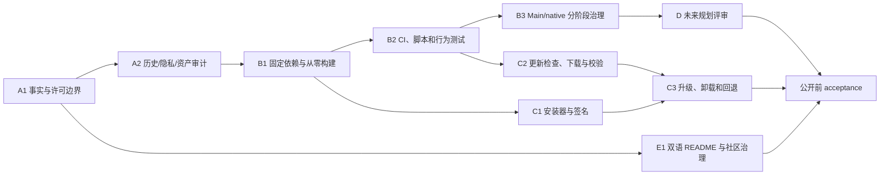

# LetsMakeMoney v0.7 Beta 产品需求文档

## 追踪信息

| 项目 | 内容 |
|---|---|
| 文档状态 | 完整 PRD，待项目所有者确认 |
| 目标版本 | v0.7 Beta |
| 版本主题 | 开源公开、可信分发与可持续维护基线 |
| 当前事实基线 | `main` / `e6f25ae8cb4d9583aa3e629cb79416e278060117` / v0.6 Beta Pre-release |
| 上游输入 | `idea-pool.md`、`review.md`、`open-source-readiness.md`、`slimming-audit.md` |
| 原型 | `doc/prototypes/index.html` 的“v0.7 公开与分发”视图 |
| 最后更新 | 2026-07-11 |

> 本文是 v0.7 的需求事实源。它不代表业务代码已经实现，也不代表仓库已经可以公开。A-E 全部完成并通过验收后，才能将仓库改为公开。

## 1. PRD 类型与方案结论

### 1.1 类型

这是“开源公开门禁 + 工程治理 + Windows 分发能力”的版本级完整 PRD。它同时包含用户可见功能、工程质量、法律与资产治理、发布安全和未来规划，但不包含新宠物、主题或多平台实现。

### 1.2 已确认方案

- 采用 A-E 全量方案，全部完成后再公开仓库。
- 代码使用 MIT License；视觉素材使用独立受限素材许可。
- 保留完整 Git 历史，不清洗或重建历史。
- README 中文为事实源，独立维护 `README.en.md`。
- `godot-cpp` 使用固定 commit 的 bootstrap 方案。
- Windows 分发采用 Inno Setup 安装器和便携 Zip。
- 安装器为当前用户安装到 `%LOCALAPPDATA%\Programs\LetsMakeMoney`，不要求管理员权限。
- 卸载默认保留 `%APPDATA%\LetsMakeMoney`；用户可主动勾选删除设置和日志。
- 安装版与便携版共享 `%APPDATA%\LetsMakeMoney`，v0.7 不实现本地目录数据模式。
- 安装器只有在 Authenticode 签名有效时才允许公开分发；签名未就绪时仅允许发布便携 Zip。
- 应用检查 GitHub Release，用户确认后下载并校验安装器，退出应用后交给安装器升级；不静默更新。
- Beta 默认接收 Beta 与稳定版，稳定版只接收稳定版；用户可切换更新通道。
- Main/native 允许分阶段深度调整，但每一步都必须有行为测试、兼容门禁和独立回退提交。
- native 能力失败时应用继续运行，禁用故障能力，给出一次可读提示并写入诊断日志。
- 启用 GitHub Private Vulnerability Reporting；采用 Contributor Covenant 2.1。
- v0.7 暂不接受外部素材贡献，只接受代码、文档、UI 设计说明和 native 代码贡献。
- iOS、Android、macOS、主题系统和更多宠物仅输出规划文档。

### 1.3 三档方案回顾

| 方案 | 范围 | 结果 |
|---|---|---|
| 最小方案 | 许可、敏感信息、README、固定依赖、基础 CI | 无法满足已确认的安装、更新、深度治理和完整社区准备，不采用 |
| 推荐方案 | 最小方案 + 安装器、用户确认更新、有限 Main/native 治理 | 风险较平衡，但低于项目所有者确认范围 |
| 全量方案 | A-E 全部闭环，包括深度治理、可信分发、社区入口与未来规划 | **已确认采用**；必须严格分阶段，不允许一次性重写 |

## 2. 背景与问题

LetsMakeMoney 已形成可运行的 Windows 桌宠 Beta：用户可以配置工资与工作时间，由橘猫、薪资 Panel、设置、向导、托盘和 Windows 原生能力共同提供桌面陪伴体验。v0.6 已完成发布验收，但当前仓库仍是以个人本机开发为中心的私有项目：缺少根许可证和贡献入口，代码与受限素材授权边界不清，完整历史及文档含本机路径风险，native 依赖未固定，外部开发者无法稳定从零构建，发布包缺少完整第三方 notices，也没有正式安装和用户确认更新链路。

如果直接公开，外部用户会难以判断哪些内容可以复用，贡献者难以复现 native 构建，Release 的来源与许可不完整，历史文件还可能暴露不应公开的本机资料。v0.7 的首要价值是先建立可信边界，再公开已有产品。

## 3. 目标用户与核心场景

### 3.1 目标用户

1. 希望在 Windows 桌面使用轻量工资桌宠的普通用户。
2. 希望阅读、构建、修复或扩展项目的 Godot/GDScript/C++ 贡献者。
3. 需要核对二进制来源、许可、隐私与升级安全的谨慎用户。
4. 项目维护者本人，用统一脚本和门禁持续发布后续版本。

### 3.2 核心场景

- 用户从 GitHub Release 选择签名安装器或便携 Zip，完成安装/解压和首次启动。
- 已安装用户收到更新提示，自主查看版本、确认下载、校验并启动升级；可取消、重试或回退。
- 贡献者从全新 clone 开始，按 README 安装固定工具链、bootstrap 固定 `godot-cpp`、构建 native、运行 Godot、测试并打包。
- 外部审阅者能明确区分 MIT 代码、受限视觉素材和第三方依赖。
- 维护者在公开前通过自动扫描和人工清单证明历史、当前树和发布包不存在发布阻塞项。

## 4. 版本目标与成功标准

### 4.1 版本目标

1. 仓库达到可安全公开、可理解、可贡献的状态。
2. Windows 源码构建与发布产物达到可复现和可追踪状态。
3. 提供签名传统安装器、便携 Zip 和用户确认更新的完整最小链路。
4. 在不破坏 v0.6 行为的前提下，降低 Main/native 与历史代码的维护成本。
5. 建立代码、素材、第三方依赖、隐私和社区贡献的清晰边界。

### 4.2 可量化成功标准

- 公开前检查清单无未关闭 P0；仓库仍保持私有直到所有 A-E 验收完成。
- 根目录存在有效 MIT `LICENSE`，受限素材和第三方 notices 可从 README 与 Release 包到达。
- 当前树和完整 Git 历史通过 secret、路径、隐私、大文件与资产人工复核；没有未授权内容。
- 在不使用维护者既有缓存和绝对路径的干净 Windows 环境中，从 clone 到构建、测试、运行、便携包和安装器均成功。
- `godot-cpp` commit、下载 URL、归档哈希和实际构建身份一致。
- GitHub Actions 能阻止文档状态错误、敏感信息、阻塞测试、许可缺失和包结构错误进入 `main`。
- 安装、覆盖升级、修复、取消、卸载保留数据、主动删除数据均有真实 Windows 证据。
- 更新正常、无更新、取消、下载失败、校验失败、签名失败、GitHub 不可达和回退链路均可验证。
- Main/native 状态矩阵通过自动测试、日志、Computer Use 和必要人工补证；v0.6 核心体验无回退。
- README 中英文关键结构、版本、链接和命令通过自动一致性检查。

## 5. 范围、优先级与依赖

### 5.1 模块分组

| 模块 | 内容 | 优先级 | 公开门禁 |
|---|---|---:|---|
| V07-A | 许可、历史、隐私、第三方 notices、仓库治理 | P0 | 是 |
| V07-B | 可复现构建、CI、脚本参数化、代码与资产瘦身 | P0/P1 | 是 |
| V07-C | 安装器、签名、更新、回退和 Release 可信分发 | P0/P1 | 安装器发布门禁；整体也是 A-E 完成条件 |
| V07-D | 多平台、主题、更多宠物规划文档 | P1 | 是（只要求规划通过） |
| V07-E | 双语文档、贡献、安全和社区入口 | P0/P1 | 是 |

### 5.2 推荐实施顺序

必须串行：许可边界 → 审计；固定依赖 → CI/行为测试 → Main/native 深度治理；安装器与更新实现 → 联合升级验收。可并行：双语文档与社区模板、第三方清单、未来规划文档。

## 6. 需求追踪矩阵

| FR | 标题 | 上游 IDEA | 模块 | 优先级 |
|---|---|---|---|---:|
| FR-001 | 代码与素材分离许可 | 001/002 | A | P0 |
| FR-002 | 第三方依赖与发布许可合规 | 004 | A/C | P0 |
| FR-003 | 完整 Git 历史与公开前敏感审计 | 003/006/012/013 | A | P0 |
| FR-004 | 双语公开入口与社区治理 | 007/015 | E | P0 |
| FR-005 | 固定依赖与可复现 native 构建 | 005 | B | P0 |
| FR-006 | CI、验证与打包脚本治理 | 008/010 | B | P0 |
| FR-007 | Settings 与仓库低风险瘦身 | 009/012 | B | P1 |
| FR-008 | Main/native 状态所有权深度治理 | 011 | B | P0 |
| FR-009 | 安装器、签名与卸载 | 017 | C | P0 |
| FR-010 | 用户确认更新、校验与回退 | 017 | C | P0 |
| FR-011 | 隐私、诊断与安全降级 | 006/013 | A/B | P0 |
| FR-012 | GitHub 仓库与 Release 治理 | 008/015 | A/E | P0 |
| FR-013 | 开源首次使用验收 | 014 | E | P1 |
| FR-014 | 多平台、主题与宠物扩展规划 | 016 | D | P1 |

## 7. 功能需求

### FR-001 代码与素材分离许可

**目标**：外部用户能明确判断代码可以如何使用，视觉素材不能如何使用。

**要求**：
1. 根 `LICENSE` 使用 MIT，适用于项目原创代码和明确标注采用 MIT 的文档。
2. 新增 `ASSETS_LICENSE.md`，列出受限目录和类型：Logo、应用图标、橘猫/占位猫、动画帧、产品截图中可独立提取的视觉素材。
3. 受限素材禁止第三方脱离项目自由复用、修改或再分发；不改变用户运行官方二进制和查看源码的权利。
4. README、贡献指南、资产目录 README 和 Release notes 必须链接两套许可。
5. v0.7 暂不接受外部素材文件贡献；贡献指南应将其标记为不受理范围，避免混入授权不明资产。
6. 无法确认来源或权属的素材为公开阻塞项，必须移出公开候选或补齐证据。

**影响范围**：根 `LICENSE`、`ASSETS_LICENSE.md`、README/README.en、`CONTRIBUTING.md`、资产目录清单、发布包 `LICENSES/`、打包校验；不改变 GDScript/C++ 行为、配置字段、日志事件、用户数据和数据库（无数据库影响）。会影响 GitHub 仓库展示、PR 模板和 Release 附件许可说明。

**验收**：脚本检查许可文件、链接和受限目录清单；人工逐项核对素材来源；随机抽取代码、Logo、宠物帧时均能在两次点击内找到适用许可。任一素材权属不明则失败。

### FR-002 第三方依赖与发布许可合规

**目标**：源码仓库和每个二进制包都携带完整可审计的第三方声明。

**要求**：
1. 新增 `THIRD_PARTY_NOTICES.md`，记录 Godot、godot-cpp、Inno Setup、字体、图标工具和实际进入产物的其他依赖。
2. 每项记录名称、版本/commit、来源、许可证、修改情况、是否进入源码或二进制包。
3. 安装器和 Zip 都包含 MIT、受限素材许可、第三方 notices 及必要原许可证全文。
4. 打包脚本在缺少 notices、许可证或版本身份时非零退出。
5. 依赖升级必须同步清单和校验值。

**影响范围**：`THIRD_PARTY_NOTICES.md`、依赖 manifest、`scripts/package*`、Inno Setup 脚本、Release checklist、包内 `LICENSES/`；无配置、运行日志、用户数据和数据库影响。对 native bootstrap、GitHub Actions 和 Release 产物结构有直接影响。

**验收**：对源码依赖、导出文件和安装器文件做三方交叉检查；包内许可校验脚本非零阻止漏项；法务事实不清的依赖不得发布。

### FR-003 完整 Git 历史与公开前敏感审计

**目标**：保留完整历史的前提下，证明公开不会暴露凭据、私有证据或无权公开内容。

**要求**：
1. 扫描当前树和全部 commit、tag、分支可达历史，覆盖凭据、私钥、邮箱以外的个人信息、Windows 用户路径、日志、配置、注册表导出、验收截图、大二进制和临时压缩包。
2. 作者邮箱公开已获同意，不作为阻塞；其他个人信息仍需脱敏。
3. `.manual-test/`、`.tmp_acceptance/`、本地 Release 展开目录、ComfyUI、临时素材包和私有验收证据必须被 ignore，并确认未存在于历史。
4. 扫描工具和人工复核结果形成可审计报告；敏感值不得原文写入报告。
5. 如发现真实凭据，先轮换凭据，再决定历史清理；未获单独授权不得公开仓库。

**影响范围**：`.gitignore`、`.gitattributes`、secret/大文件/路径扫描脚本、公开前 checklist、历史审计报告；不修改业务运行时、配置 schema 和数据库。可能阻塞整个仓库公开，但不自动要求重写历史。

**验收**：至少两类扫描器加人工抽样；检查所有 tag 和删除文件历史；P0 发现清零并由项目所有者签核。

### FR-004 双语公开入口与社区治理

**目标**：普通用户和贡献者能从仓库首页理解产品、安装、构建、限制与参与方式。

**要求**：
1. `README.md` 为中文事实源，`README.en.md` 为英文镜像；同一 PR 同步关键章节。
2. 两份 README 均包含定位、Windows-only 边界、截图、下载、安装版/便携版差异、快速开始、源码构建、测试、已知限制、贡献、许可和安全入口。
3. CI 检查版本号、章节锚点、关键链接和命令块结构一致；英文表达可自然翻译，不要求逐字一致。
4. 新增 `CONTRIBUTING.md`、`CODE_OF_CONDUCT.md`（Contributor Covenant 2.1）、`SECURITY.md` 和必要支持说明。
5. 安全漏洞引导至 GitHub Private Vulnerability Reporting，不要求公开安全邮箱。
6. v0.7 接受代码、文档、UI 设计说明和 native 贡献，不接受外部素材文件贡献。

**影响范围**：README 双语文件、贡献/行为/安全文档、Issue/PR 模板、CI 文档检查、仓库 About/Topics；无运行时、配置、日志、用户数据和数据库影响。会影响新贡献者流程和公开仓库首页。

**验收**：中英文入口链接互通；全新用户按 README 完成下载或构建；安全报告不要求公开披露；模板无本机路径和旧版本口径。

### FR-005 固定依赖与可复现 native 构建

**目标**：外部贡献者不依赖维护者本机环境即可构建 native DLL。

**要求**：
1. 固定 Godot 4.7 stable、Python、SCons、MSYS2/MinGW、Windows SDK 和 Inno Setup 支持版本。
2. bootstrap 使用 HTTPS 下载固定 `godot-cpp` commit 的归档或 clone 后 checkout，校验 commit 与 SHA256；禁止默认分支漂移。
3. 依赖缓存可复用，但删除缓存后必须仍可从零恢复；网络失败、哈希不符和离线状态提供明确错误。
4. 移除脚本中的开发者绝对路径默认值，支持参数、环境变量和自动发现，并在日志中打印最终工具身份。
5. 提供离线缓存目录格式和人工放置说明，不将缓存提交到 Git。
6. Debug/Release DLL、Godot 导出、安装器和 Zip 使用明确独立目录与 manifest。

**影响范围**：`scripts/build_native_windows.ps1`、新 bootstrap/manifest、`native/windows/README.md`、SConstruct、CI、打包脚本、`.gitignore`；不新增产品配置或数据库。构建日志新增工具版本、commit、校验和和产物哈希。

**验收**：干净 Windows 环境从 clone 开始执行 bootstrap、native build、Godot headless、测试和打包；故意断网、改哈希、缺工具时均可读失败且非零退出。

### FR-006 CI、验证与打包脚本治理

**目标**：将个人本机脚本收敛为外部贡献者和 GitHub Actions 可运行的可信门禁。

**要求**：
1. 建立参数化验证/打包公共内核，版本 wrapper 仅提供版本和兼容入口；不删除仍需历史回归的 wrapper。
2. 活跃矩阵包含文档、编码、许可、secret、GDScript/headless、配置、Settings/Wizard、托盘模拟、native build、包结构和校验和。
3. Parser Error、Script Error、Invalid call、缺资源或阻塞错误必须非零退出，不能与“通过”同时出现。
4. CI 至少提供文档/静态检查和 Windows 构建测试；真实托盘、任务栏、安装/卸载和 GUI 仍在 Release acceptance 中人工或 Computer Use 验证。
5. 测试使用隔离配置目录，结束后恢复环境，不读取或覆盖真实 `%APPDATA%`。

**影响范围**：`scripts/verify_*`、`package_*`、项目版本 helper、`.github/workflows/`、缓存策略和测试文档；可能调整历史测试入口但不得改变产品配置语义。无数据库影响。

**验收**：新 clone CI 全绿；注入 parser error、包缺文件、错误版本和配置写失败时对应 job 必须失败；本机与 CI 结果一致。

### FR-007 Settings 与仓库低风险瘦身

**目标**：移除有明确证据的死路径和公开仓库噪音，降低理解成本。

**要求**：
1. 在行为测试覆盖后移除 Settings 未调用的旧 UI 构建路径和仅服务过期静态测试的适配代码。
2. 参数化高度重复的历史打包/包验证脚本，保留薄 wrapper。
3. 移出公开候选的 ComfyUI、实验资产、临时 Zip 和私有验收证据；历史产品文档归档但不删除。
4. 所有资源清理前检查 scene、resource、autoload、signal、动态 call、export、native 符号和历史回退路径。
5. 高风险候选（Pet/Salary API、降级托盘、`.import`、状态缓存）不得在本需求中直接删除。

**影响范围**：`settings_dialog.gd` 旧构建函数、历史 wrapper、`experiments/`、`temp/`、文档 archive、ignore/export 规则；可能影响设置 UI 和发布资源，必须做截图与包内 smoke。配置字段、用户数据和数据库不变。

**验收**：调用与资源引用报告证明无引用；Settings 五页和 Wizard 四步截图无回退；发布包体与运行资源完整；Git diff 不包含无关删除。

### FR-008 Main/native 状态所有权深度治理

**目标**：降低窗口、托盘、穿透、任务栏和模态状态在 Main、Platform、WindowsPlatform、native DLL 间重复缓存带来的风险。

**前置门禁**：先冻结 v0.6 行为基线，建立状态合同和 characterization tests，未完成前不得重构。

**状态矩阵**：普通/纯桌宠、窗口显示/隐藏、任务栏入口有/无、托盘左键/右键、Settings/Wizard/Popup 打开、穿透启用/暂停、native 可用/不可用、单/多显示器和 DPI 组合。

**要求**：
1. 明确每类状态唯一所有者：Godot 业务意图、Platform 抽象、Windows 原生真实状态和 native 消息协议不得互相冒充事实源。
2. 可拆分 Main 的窗口策略、模态保护和交互协调职责；可整理 WindowsPlatform 缓存、native 消息常量和窗口 subclass 生命周期。
3. 每个切面独立提交、独立验证、可单独回退；禁止一次性重写。
4. native 返回值和 last_error 必须进入健康状态和诊断日志；故障时禁用对应能力并展示一次提示，应用继续运行。
5. 保护 v0.6 已验收体验：托盘显隐、纯桌宠任务栏策略、Settings/Wizard 穿透暂停、右键菜单、Panel、小猫交互、配置恢复。

**影响范围**：`main.gd`、`platform.gd`、`windows_platform.gd`、`drag_resize_system.gd`、native bridge/tray/window API、状态日志、托盘验证脚本和真实 GUI 验收；不新增用户配置字段，可能迁移内部缓存。用户数据、安装布局和数据库无影响。

**验收**：状态矩阵自动测试与真实 Windows 复验；10 轮托盘显隐；普通/纯桌宠任务栏对照；Popup/Settings/Wizard 成对穿透日志；native DLL 缺失或失败的可读降级。任一核心路径回退则回滚当前切面。

### FR-009 安装器、签名与卸载

**目标**：为普通 Windows 用户提供可验证、可取消、可卸载的传统安装体验。

**入口与默认状态**：GitHub Release 提供签名 Inno Setup 安装器。默认安装到 `%LOCALAPPDATA%\Programs\LetsMakeMoney`，仅当前用户，无需管理员权限；用户数据仍位于 `%APPDATA%\LetsMakeMoney`。

**完整链路**：
1. 欢迎 → 查看许可摘要 → 选择安装目录 → 可选创建开始菜单/桌面快捷方式 → 确认 → 安装 → 完成并可启动。
2. 许可页同时链接 MIT、受限素材许可和第三方声明，不允许用 MIT 概括全部资产。
3. 覆盖安装保留配置；程序运行时提示先退出或由用户确认后安全关闭。
4. 修复安装重新写入程序文件，不覆盖用户配置。
5. 用户取消时不留下半成品快捷方式或卸载记录。
6. 卸载默认保留设置和日志；“同时删除设置和日志”默认不勾选，勾选后再次明确提示不可恢复。
7. 安装器必须有有效 Authenticode 签名；无签名、签名过期或签名身份不符时不得作为公开附件。

**安装版与便携版**：两者共享 `%APPDATA%`。便携 Zip 解压即用，不注册卸载器，不自动创建快捷方式；二者同时存在时使用同一配置，文档提示不要同时运行两个实例。

**失败处理**：磁盘不足、权限不足、文件占用和签名异常必须给出可读提示；失败不删除旧可用版本和用户配置。

**影响范围**：Inno Setup 脚本、签名脚本/秘密管理（仅 CI secret，不入仓库）、安装/卸载 manifest、快捷方式、开始菜单、程序目录、`%APPDATA%` 数据、Release 附件和文档；不改变配置 schema、工资数据或数据库。可能影响开机自启路径，升级后必须重应用当前 EXE 路径。

**验收**：干净用户安装、覆盖升级、修复、取消、卸载保留、勾选删除、权限/磁盘/占用失败；验证签名、快捷方式、注册信息、配置与开机自启路径。

### FR-010 用户确认更新、校验与回退

**目标**：用户知情并确认后安全升级，不在后台静默替换程序。

**配置**：新增更新通道与检查偏好（字段名在开发承接中确定）：默认 Beta 构建接收 Beta 和稳定版，稳定构建只接收稳定版；用户可切换“稳定/测试”。不保存 GitHub 凭据。

**完整链路**：
1. Settings“版本与更新”或“关于”提供手动检查；可选启动后低频检查，不自动下载。
2. 无更新：显示当前已是最新版本；GitHub 不可达：显示离线/网络错误，不影响应用使用。
3. 发现更新：展示版本、类型、发布日期、重要变更、下载大小和 Release 链接；用户选择“稍后”或“下载更新”。
4. 下载：展示进度和取消；支持失败重试；临时文件写入数据目录的 update cache。
5. 校验：必须验证 SHA256；安装器还要验证 Authenticode 签名和发布者。任一失败立即删除或隔离临时文件，不允许启动。
6. 安装：用户再次确认，应用保存配置、停止托盘/native、退出并启动安装器。安装器完成升级。
7. 回退：保留上一稳定包或明确下载入口；升级失败时恢复/重新安装上一版本，配置不降级、不删除。配置 schema 升级必须向后兼容或提供备份恢复。
8. 便携版发现更新时下载新版 Zip 或打开 Release，不自行覆盖正在运行的目录；用户确认后按文档替换程序文件。

**非目标**：不静默更新、不后台安装、不实现差分补丁、不自建更新服务器。

**影响范围**：Settings 通用页/关于页、更新服务、GitHub Release API、下载与哈希/签名验证、配置字段、语义日志、临时目录、安装器启动、Release manifest、验证脚本；不涉及数据库。会影响退出流程和 native 资源释放，必须与 FR-008 联合验收。

**验收**：覆盖无更新、稳定/Beta 通道、用户取消、离线、代理不可达、404、下载中断、磁盘不足、哈希错误、签名错误、安装取消、升级成功和回退；日志不包含用户完整路径或网络凭据。

### FR-011 隐私、诊断与安全降级

**目标**：公开后日志和诊断可帮助排障，但不泄露用户隐私。

**要求**：
1. 诊断摘要采用字段白名单，不包含薪资、工作时间、窗口坐标、用户名、完整路径、原始配置或原始日志。
2. 日志输出路径时优先使用逻辑名称或脱敏占位；必要错误不得记录凭据和完整下载 URL 查询参数。
3. 配置继续采用临时文件安全写入、备份与损坏恢复；更新前创建兼容备份。
4. DLL 只从受信应用目录加载；不接受用户可控任意 DLL 路径。
5. 打开目录、删除缓存、卸载删除数据等操作使用固定边界和用户确认，防止目录穿越或符号链接误删。
6. native、托盘、穿透、更新检查失效时降级而非崩溃；提示只出现一次，详细原因进入日志。

**影响范围**：诊断服务、logger、Config、WindowsPlatform/native 加载、更新缓存、删除/恢复操作、测试样例和 SECURITY 文档；可能增加语义日志，但不新增敏感配置。无数据库影响。

**验收**：用含用户名、绝对路径、特殊字符和损坏配置的样例运行；诊断白名单和日志扫描通过；路径边界测试不得访问应用数据目录之外。

### FR-012 GitHub 仓库与 Release 治理

**目标**：公开仓库具备与个人项目规模匹配的协作和发布门禁。

**要求**：
1. 配置仓库描述、Topics、默认分支和分支保护；`main` 要求必要 CI 通过后合并。
2. 提供 Bug Report、Feature Request 和 PR 模板，收集版本、系统、复现、日志脱敏和验证结果。
3. GitHub Actions 使用最小权限；签名凭据只存 GitHub Secrets，Fork PR 不获得发布 secret。
4. Release workflow 产出安装器、便携 Zip、SHA256、manifest、许可文件和 release notes；发布操作仍需维护者确认。
5. GitHub Pre-release/Release 与版本号、tag、包内版本和 `doc/current.md` 一致。
6. 开启 Private Vulnerability Reporting；Dependabot/CodeQL 是否启用以实际依赖与噪音成本为准，至少纳入公开前评估。

**影响范围**：`.github/workflows`、Issue/PR 模板、仓库设置清单、Release workflow、版本事实检查和安全配置；不影响应用运行时、配置、用户数据或数据库。

**验收**：Fork PR 无 secret；失败测试不能合并；模拟 tag 构建产物身份一致；仓库公开前由所有者逐项确认设置。

### FR-013 开源首次使用验收

**目标**：用“不了解维护者本机”的视角证明文档、构建和贡献入口可用。

**要求**：
1. 在干净 Windows 用户或 VM 中从 GitHub clone 开始，不使用现有 `godot-cpp`、MSYS2 路径、构建缓存和用户配置。
2. 完成 README 快速运行、native bootstrap/build、Godot 启动、自动测试、便携打包、安装器构建和一次最小文档 PR 模拟。
3. 记录耗时、失败点、需要猜测的步骤和最终产物哈希；无法由文档解释的步骤视为失败。

**影响范围**：README、构建/贡献说明、验收文档和 CI 对照；无业务代码、配置 schema、用户数据和数据库影响，除非验收暴露真实缺陷后另立 bugfix。

**验收**：由未使用当前工作区的环境完整走通；所有命令可复制执行；不要求访问私有文件或维护者机器路径。

### FR-014 多平台、主题与宠物扩展规划

**目标**：为未来方向建立边界，不让 v0.7 为未开发能力过度设计。

**要求**：
1. 新增三份规划：`platform-roadmap.md`、`theme-roadmap.md`、`pet-content-roadmap.md`。
2. 平台规划分别分析 macOS、Android、iOS：窗口/托盘/穿透能力差异、Godot 导出、签名与商店、配置目录、触控交互和 native 抽象阻塞；候选版本待后续 `/idea` 决定。
3. 主题规划定义 token、资源包、许可和回退边界，不实现主题切换或第三套 UI。
4. 宠物规划定义 manifest、动画状态、锚点、资源预算和许可边界，不新增宠物或接受外部素材。
5. v0.7 只要求规划文档评审通过，不创建平台代码、主题 API 或插件框架。

**影响范围**：仅 `doc/releases/v0.7/roadmaps/` 和架构说明；对 Godot 场景、native、配置、日志、安装器、用户数据、CI 和数据库均无实现影响。任何接口预留仅作为非约束建议，不能写入代码任务。

**验收**：三份文档均说明阻塞、数据/接口边界、候选版本和明确非目标；不得在 progress 中标记相关产品能力已实现。

## 8. 总体影响范围

| 领域 | 总体影响 | 对应 FR |
|---|---|---|
| Godot 场景/GDScript | Settings 增加版本与更新入口；Settings 旧路径清理；Main 状态职责拆分；诊断与更新服务 | 007/008/010/011 |
| C++ native | 托盘、窗口 subclass、任务栏、穿透、bridge 错误与状态所有权治理 | 005/008/011 |
| 配置 | 增加更新通道/检查偏好；旧字段兼容；安装版与 Zip 共用 APPDATA | 009/010/011 |
| 日志与诊断 | 构建身份、更新、签名、状态降级语义日志；诊断白名单 | 005/008/010/011 |
| 用户数据 | 安装/升级保留；卸载默认保留、可选删除；更新前备份 | 009/010/011 |
| 安装/更新/卸载 | Inno Setup、签名、更新下载校验、取消/失败/回退 | 002/009/010 |
| 构建与依赖 | 固定 Godot/godot-cpp/工具链、bootstrap、缓存与离线说明 | 002/005/006 |
| 自动化与桌面验收 | CI、行为测试、安装/托盘/任务栏/更新真实 Windows 复验 | 003/006/008/009/010/013 |
| 文档与许可 | 双语 README、MIT、受限素材、第三方 notices、贡献/安全文档 | 001/002/004/012/014 |
| GitHub | Actions、模板、分支保护、Private Vulnerability Reporting、Release | 003/004/006/012 |
| v0.6 回归 | Panel、宠物、Settings/Wizard、托盘、纯桌宠、穿透、配置和日志均需保护 | 007/008/009/010/011 |
| 数据库 | 项目当前无数据库；v0.7 不新增数据库 | 全部 |

## 9. 状态与失败模型

### 9.1 更新状态

`idle → checking → available/no_update/error → downloading → verifying → ready → launching_installer`。取消下载回到 `available`；校验失败进入 `error` 并隔离文件；应用重启后不得自动安装未确认包。

### 9.2 安装状态

`welcome → license → options → confirm → installing → complete`；任一步取消进入 `cancelled`，程序和用户数据保持进入前状态。覆盖升级失败保留上一可运行版本。

### 9.3 native 降级状态

每项能力独立为 `available/degraded/unavailable`。单项故障不将整个应用标为不可用；诊断摘要只暴露能力状态和脱敏错误类别。

## 10. 原型需求

现有暖色桌面小挂件风保持不变。v0.7 原型在同一 `index.html` 新增“v0.7 公开与分发”，覆盖：

1. 安装流程：欢迎、许可边界、安装选项、进度/取消、成功与失败。
2. 更新：无更新、发现更新、下载、取消、校验失败、签名失败、成功并准备安装。
3. Settings“版本与更新”：当前版本、通道、手动检查、更新反馈。
4. 关于与许可：MIT 代码、受限视觉素材、第三方声明入口。
5. 安装版/便携版提示：共用 APPDATA、不要同时运行、卸载保留数据。
6. 非 UI 治理：公开门禁、构建链、Main/native 回退矩阵以流程/表格表达，不伪造成设置项。

原型必须支持交互切换正常、加载、成功、失败、禁用和空状态，并在 700、900、1440px 宽度下无横向溢出、遮挡或组件混排。

## 11. 开发前验收设计

### 11.1 自动验证

- 许可、notices、资产清单与包体一致。
- 当前树和完整历史 secret/路径/大文件扫描。
- README 中英版本号、章节、关键链接和命令一致。
- 固定依赖下载身份、SHA256、离线缓存与失败退出码。
- GDScript/headless、配置、Settings/Wizard、Main/native characterization tests。
- 安装器编译、签名验证、包结构、版本和 checksum。
- 更新通道、版本比较、下载取消、哈希/签名错误和缓存清理。

### 11.2 日志验证

必须可识别：应用/构建身份、native 能力降级、窗口策略重应用、更新检查结果、下载开始/取消/失败、哈希与签名验证、安装器启动、配置备份恢复。日志不得记录敏感值和完整用户路径。

### 11.3 Computer Use 验证

- 安装器正常、取消、覆盖、修复、卸载保留/删除数据。
- Settings 更新页面和关于/许可入口。
- 更新发现、下载、取消、失败、重试、安装确认。
- Main/native 调整后的 Panel、菜单、Settings、Wizard、托盘、纯桌宠、穿透和任务栏行为。

### 11.4 必须人工补证

- Windows 通知区真实左键/右键和任务栏入口。
- Authenticode/SmartScreen 在真实签名安装器上的表现。
- 真实登录后的开机自启。
- 多显示器/DPI 和覆盖升级后的托盘/纯桌宠行为。
- 代理、受限网络环境如 Computer Use 无法稳定构造。

### 11.5 公开和发布门禁

| 门禁 | 阻塞对象 | 通过条件 |
|---|---|---|
| 法律/资产 | 仓库公开与全部 Release | MIT/受限素材/第三方声明完整，无未知权属 |
| 历史/隐私 | 仓库公开 | 完整历史审计无未关闭 P0 |
| 可复现构建 | 仓库公开 | 干净环境从 clone 到 native/Godot/test 成功 |
| Main/native 回归 | 仓库公开与 v0.7 Release | 状态矩阵全通过或有获批降级 |
| 安装器签名 | 安装器附件 | Authenticode 有效、发布者匹配 |
| 更新验收 | v0.7 安装版发布 | 正常/失败/取消/回退链路有真实证据 |
| 未来规划 | A-E 完成条件 | 三份规划评审通过；不要求代码 |

任一门禁失败时，记录 bugfix/acceptance 证据并保持仓库私有；不得以删除测试或放宽扫描规则伪造通过。

## 12. 回退策略

- 文档/仓库治理：每组独立提交，可回退而不影响运行时。
- Settings 清理：保留变更前截图、行为测试和单独提交；失败恢复旧路径。
- Main/native：按状态切面拆分，任一切面可独立 revert；保留 v0.6 native DLL 和便携包作为行为对照。
- 安装器：升级失败保留旧程序和用户数据；发布端保留上一稳定附件。
- 更新：关闭更新入口即可回退到手动 GitHub Release 下载，不影响桌宠核心功能。

## 13. 非目标与范围保护

- 不实现 iOS、Android 或 macOS 客户端。
- 不实现主题切换系统。
- 不新增宠物、动画或素材市场。
- 不接受外部素材文件贡献。
- 不产品化 ComfyUI，不公开本机工作流和临时素材包。
- 不实现静默更新、差分更新、自建更新服务器或 Microsoft Store。
- 不清理或重写 Git 历史。
- 不为未来平台预先建立复杂插件架构。
- 不以缩短代码为目标一次性重写 Main/native。

## 14. 主要风险与缓解

| 风险 | 等级 | 缓解 |
|---|---:|---|
| 受限素材与 MIT 被误解 | 高 | 根级显著声明、目录清单、README/Release 双入口 |
| 完整历史包含隐私或无权资产 | 高 | 双扫描器 + 人工复核 + 所有者签核，未关闭前保持私有 |
| 签名证书不可用 | 高 | 安装器不公开，仅便携 Zip；不降级为未签名发布 |
| Main/native 深度治理引发窗口回归 | 高 | characterization tests、状态合同、分切面提交、真实 Windows 门禁 |
| GitHub API/网络不可达 | 中 | 更新失败不影响使用，提供 Release 页面和手动下载 |
| 双语文档漂移 | 中 | 中文事实源、同 PR 同步、CI 结构检查 |
| 全量方案周期过长 | 高 | 模块化里程碑和退出门禁，但不提前公开仓库 |

## 15. 完整 PRD 门禁

本 PRD 已具备生成开发承接文档所需的范围、流程、影响、状态、验收和回退定义。进入 `dev_plan_v0.7.md` 与 `progress_v0.7.md` 前仍需项目所有者确认：

1. 接受本文 FR-001 至 FR-014 作为 v0.7 完整范围。
2. 接受签名证书未就绪时不发布安装器，但不影响继续开发和验收其他 A-E 项。
3. 接受更新能力以 GitHub Release + 完整安装器为边界，不扩成静默或差分更新。

确认前不得修改业务代码、生成开发计划、公开仓库或创建 v0.7 Release。
