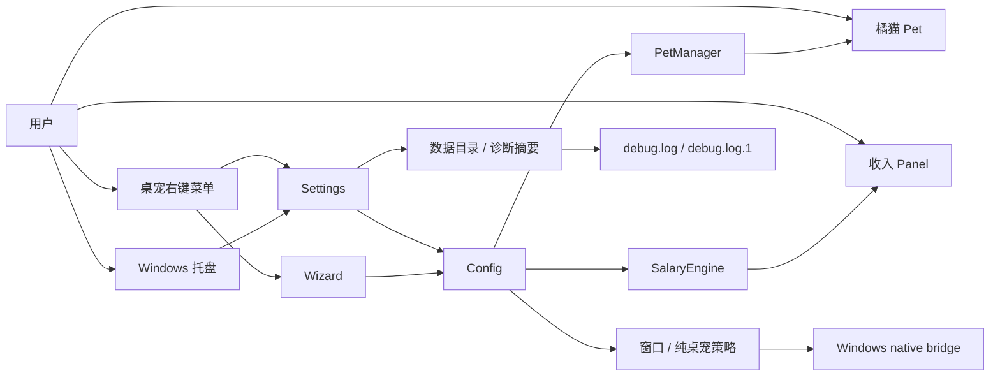
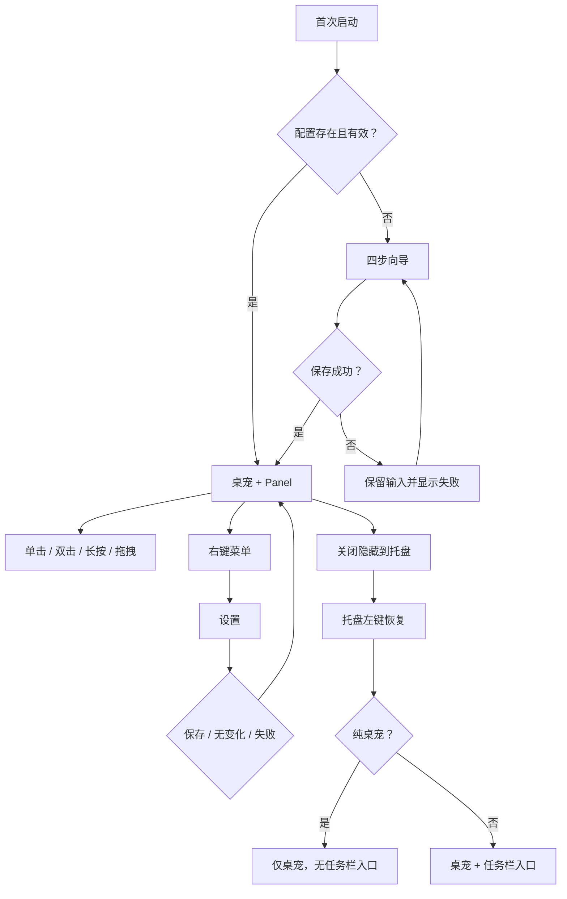
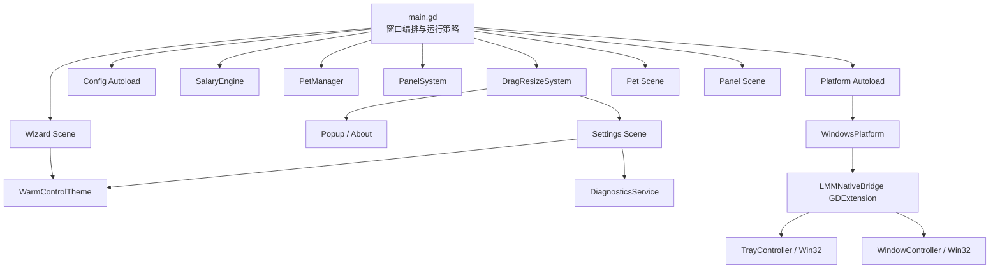
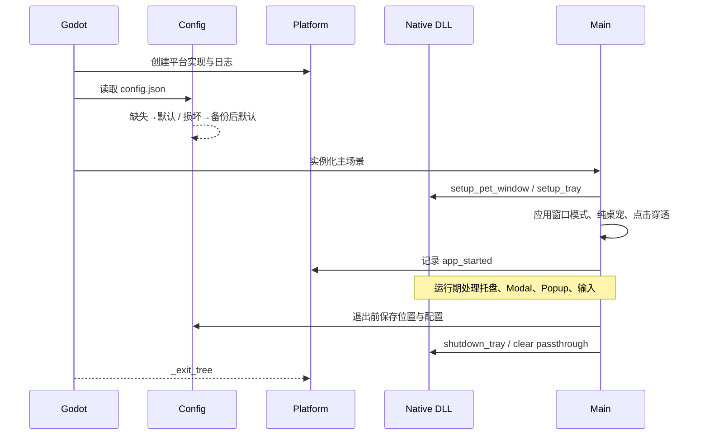
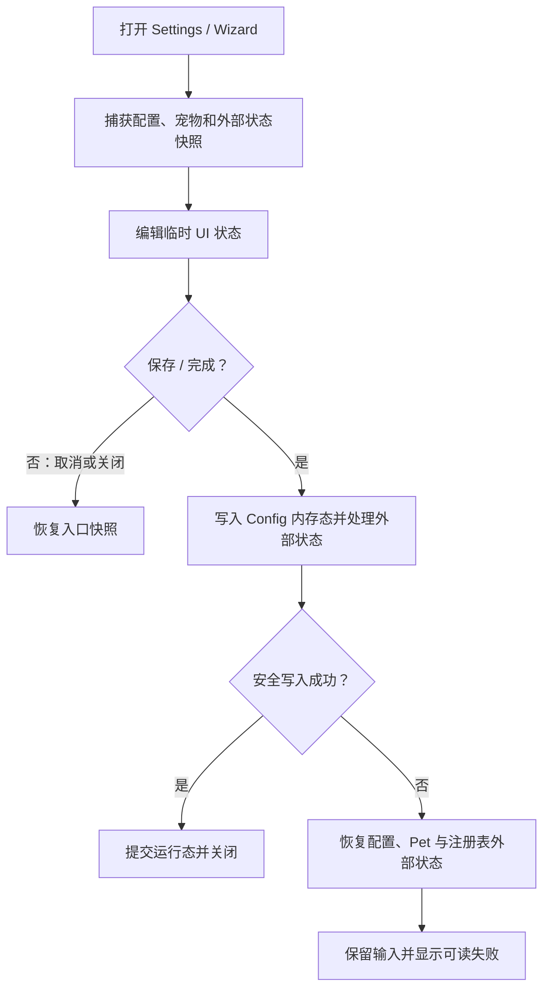
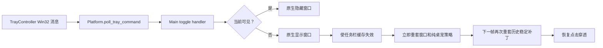
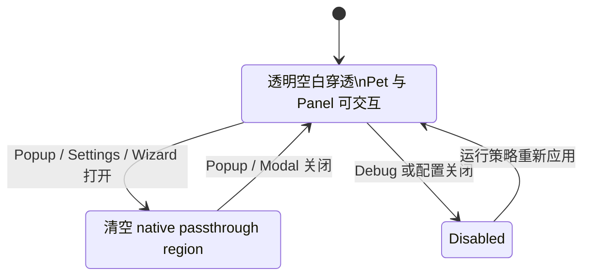
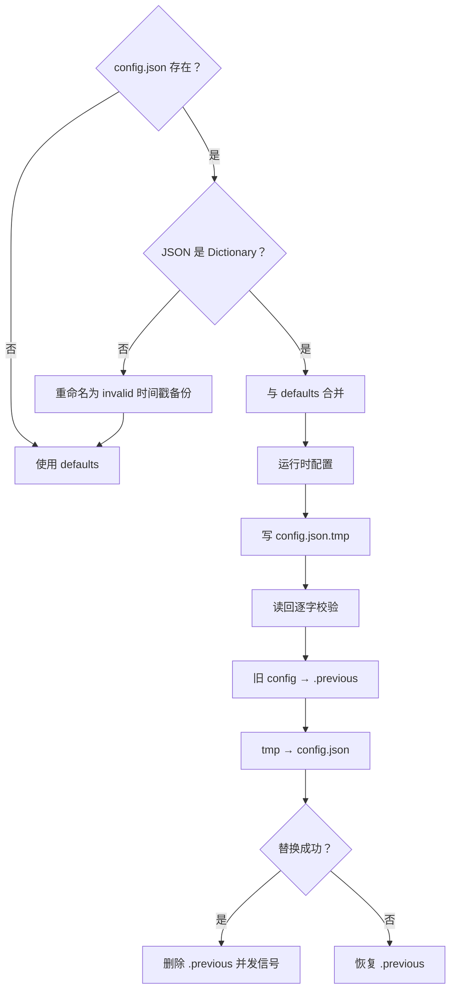
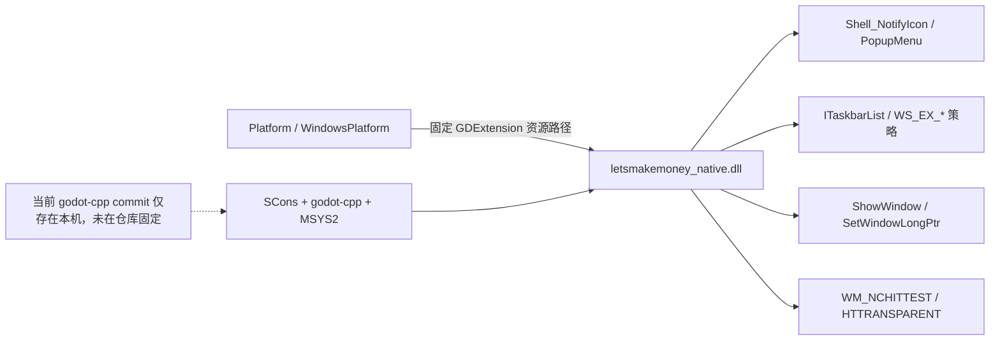

# LetsMakeMoney v0.7 开源公开深度 Review

**Review 类型**：Project Review（主）+ Implementation / PRD / Release Readiness / Open Source Readiness（辅）
**Review 日期**：2026-07-11
**Review 对象**：`main` / `e6f25ae8cb4d9583aa3e629cb79416e278060117`
**目标版本**：v0.7 Beta 开源公开准备
**结论状态**：存在公开前阻塞项；当前不适合直接转为公开仓库

> 证据状态仅使用：**已确认**、**高度可能**、**待确认**、**主观判断**。本文件中的候选项不自动构成 v0.7 正式需求。

## 1. Review 判断

### 1.1 总体结论

LetsMakeMoney 已经形成一个可运行、可打包、可验证的 Windows x86_64 Beta 产品闭环。v0.6 的产品能力、发布包、tag、Pre-release 和最终验收结论基本一致，核心验证脚本在本轮复跑中全部通过。

但当前仓库还不是一个可以直接公开的开源仓库，主要阻塞来自：

1. **没有项目许可证**，外部开发者无法合法复制、修改和分发代码。
2. **宠物、图标和 AI 生成素材缺少完整来源与授权记录**，源码可公开不等于素材可公开或可随 Release 再分发。
3. **发布包缺少 Godot / godot-cpp 及相关第三方许可说明**。
4. **当前工作树存在 1.08 GB 未跟踪验收与发布目录，且 `.gitignore` 未覆盖这些路径**，存在误提交配置、日志、截图和二进制的风险。
5. **原生构建依赖没有固定版本**；`godot-cpp` 被忽略且无 submodule，`-FetchGodotCpp` 会拉取未固定的默认分支。
6. **公开文档仍包含本机绝对路径、历史工作目录和本地工具环境**；完整 Git 历史还会暴露提交者邮箱。
7. **缺少面向外部贡献者的最小治理与 CI**，外部克隆后不能获得与本机相同的可信验证入口。

因此当前判断是：

- **产品可用性**：已确认，可作为 v0.6 Beta 使用。
- **v0.6 发布闭环**：已确认，已发布为 GitHub Pre-release。
- **代码公开可读性**：部分具备，核心链路可理解，但关键文件过长且存在历史兼容层。
- **开源法律与资产门禁**：未满足。
- **当前是否适合直接公开**：否。
- **是否具备进入 v0.7 `/idea` 与 `/prd` 的基础**：具备；先完成 P0 决策和权属确认，再收敛完整范围。

### 1.2 Review 范围

已覆盖：

- Git 当前状态、分支、tag、远端、历史提交和对象体积。
- README、当前事实源、v0.1 至 v0.6 文档、日志、原型和发布说明。
- Godot 入口、autoload、场景、Settings、Wizard、Panel、Pet、Tray、Config、Log、Diagnostics。
- Windows GDExtension、托盘、任务栏策略、点击穿透和 DLL 构建。
- 当前工作树与完整 Git 历史的启发式敏感信息扫描。
- 许可证、第三方依赖、资产来源与发布包许可文件。
- 验证脚本、打包脚本、候选包和本机原生构建。

未覆盖或不能单凭本轮证明：

- 真实 Windows 登录后的开机自启，沿用“暂不验证”口径。
- 第三方或 AI 生成素材的最终法律权属，需要项目所有者提供生成平台条款和原始来源。
- 恶意软件级攻击测试、二进制逆向、签名验证和供应链渗透测试。
- GitHub 仓库设置中的分支保护、Actions 权限、Secret 配置和组织策略；当前仓库仍为 private。
- 公开后的真实外部贡献者从零构建体验。

## 2. Git 与版本身份

| 项目 | 当前事实 | 证据状态 | 证据 |
|---|---|---|---|
| 当前分支 | `main` | 已确认 | `git status --branch --short` |
| HEAD | `e6f25ae8cb4d9583aa3e629cb79416e278060117` | 已确认 | `git rev-parse HEAD` |
| 远端同步 | `main` 与 `origin/main` 一致 | 已确认 | `git branch -vv` |
| 远端仓库 | `NzyZzz1998/LetsMakeMoney` | 已确认 | `git remote -v`、GitHub 仓库元数据 |
| GitHub 可见性 | private | 已确认 | GitHub 仓库元数据 |
| 当前应用版本 | `0.6-beta` | 已确认 | `project.godot` |
| 当前发布 | `v0.6-beta` GitHub Pre-release | 已确认 | tag、release 页面、README / current |
| tags | `v0.2-beta` 至 `v0.6-beta` | 已确认 | `git tag --sort=version:refname` |
| 历史分支 | `test` 停在 v0.4 提交 `9c3092e` | 已确认 | `git branch -a -vv` |
| Git 历史规模 | 33 个提交，pack 约 18.96 MiB | 已确认 | `git log --all`、`git count-objects -vH` |
| 工作区修改 | `releases/v0.6-beta-notes.md` 被 Git 标记修改 | 已确认 | `git status --short` |
| 未跟踪目录 | `.manual-test/`、`.tmp_acceptance/`、`releases/v0.6/` | 已确认 | `git status --short` |
| 未跟踪体积 | 144 个文件，约 1.08 GB | 已确认 | 本轮只读目录统计 |

### 2.1 当前事实不一致

1. `doc/current.md`、`doc/releases/v0.6/status.md` 中出现的 `77cef5c...` 是验收时 HEAD，不是最终发布提交 `e6f25ae...`。文档语境多数写明“验收 HEAD”，历史上成立，但新贡献者容易误认为是当前 HEAD。**证据状态：已确认。去向：直接修文档。**
2. v0.6 Zip 内 README / release notes 仍是“候选待验收”快照，外部 release notes 已明确披露并由项目所有者接受。它不影响已发布事实，但公开后会让下载用户困惑。**证据状态：已确认。去向：v0.7 发布包规范。**
3. `releases/v0.6-beta-notes.md` 被工作树标记修改，但普通 `git diff` 未展示文本差异，工作树 blob 与索引 blob 不同。高度可能是编码或行尾层面的工作区差异。**证据状态：已确认。去向：公开前核对，不自动覆盖。**
4. `doc/releases/v0.6/idea-pool.md`、PRD 和 dev plan 保留开发阶段快照，这是合理历史，不应改写为发布态；v0.6 README 已说明阶段快照边界。**证据状态：已确认。去向：保留。**

## 3. 产品全景

### 3.1 产品定位

LetsMakeMoney 是一个 Windows 桌面宠物与薪资进度小工具。目标用户是在固定工作时间内希望获得即时正反馈、轻量陪伴和“今天已经赚了多少”可视化的个人用户。

核心价值不是财务记账，而是：

- 将月薪、休息制度和工作时段转换成实时收入反馈。
- 用橘猫、Panel 和轻交互降低工具感。
- 以透明桌宠、托盘和纯桌宠模式长期驻留桌面。
- 在不打断工作的前提下提供设置、恢复和诊断入口。

### 3.2 当前边界

- 正式支持：Windows x86_64、Godot 4.7、系统托盘、透明窗口、原生点击穿透。
- 当前发布形态：Beta / GitHub Pre-release。
- 当前不支持或未承诺：多平台、安装器、自动更新、主题市场、宠物市场、云同步、账户、数据库。
- 开机自启：代码与自动验证存在，但真实 Windows 登录后的结果仍为“暂不验证”。

### 3.3 版本演进

| 版本 | 演进重点 | 当前意义 |
|---|---|---|
| v0.1 | 薪资引擎、Pet、Panel、Settings/Wizard 雏形 | 历史原型 |
| v0.2 | 紧凑桌宠、透明窗口、橘猫、配置与导出 | 桌宠化基础 |
| v0.3 | 原生托盘、点击穿透、纯桌宠、Windows GDExtension | Windows 原生边界 |
| v0.4 | 动画、交互、窗口、Panel、Settings/Wizard 大型体验优化 | 视觉与交互基线 |
| v0.5 | Settings/Wizard 共享控件、托盘恢复、保存反馈 | 共享 UI 与事务基线 |
| v0.6 | 日志、诊断、验证可信度、配置恢复、边缘稳定性 | 当前发布基线 |
| v0.7 | 尚未定义；本轮只确认开源公开门禁与候选范围 | 当前真实起点 |

## 4. 产品模块图



## 5. 核心用户流程



## 6. 工程架构

### 6.1 模块依赖图



### 6.2 主要模块职责与公开贡献适配度

| 模块 | 职责 | 状态/测试 | 主要风险 | 公开贡献适配度 |
|---|---|---|---|---|
| `main.gd` | 启动、窗口、托盘、纯桌宠、点击穿透、Modal/Popup 编排 | v0.3-v0.6 多层验证 | 942 行、重复策略应用和缓存耦合 | 中；需架构说明和回归矩阵 |
| `config.gd` | 默认值、兼容合并、安全写入、损坏恢复 | v0.6 配置验证通过 | 未做 schema/type 严格校验 | 高 |
| `salary_engine.gd` | 收入、工时、状态计算 | 历史回归稳定 | 公共 API 中有疑似未调用方法 | 高 |
| `pet_manager.gd` | Pet 发现、基础状态、交互状态映射 | 动画状态验证 | 动态资源发现增加静态分析难度 | 中高 |
| `pet.gd` | 输入仲裁、动画播放、拖拽与交互 | 人工和日志证据较多 | 历史 bug 复杂，需行为测试 | 中 |
| `panel.gd` | 折叠/展开收入展示 | v0.4 回归 | 独立字体与主题逻辑重复 | 中高 |
| `settings_dialog.gd` | 五页设置、保存事务、诊断入口 | v0.4-v0.6 验证 | 1765 行；新旧 UI 构建路径并存 | 低至中，优先瘦身 |
| `wizard_dialog.gd` | 四步首次配置、取消/失败恢复 | v0.5-v0.6 验证 | 与 Settings 仍有布局逻辑重复 | 中 |
| `warm_control_theme.gd` | Settings/Wizard 共享暖色控件 | v0.5 合同测试 | 部分 API 只被测试引用 | 中高 |
| `drag_resize_system.gd` | 拖拽、窗口显隐、菜单、Modal | 托盘与 UI 回归 | 职责偏多、包含遗留降级菜单 | 中 |
| `platform.gd` | 平台 facade、日志、托盘轮询 | v0.6 主验证 | 保留 Godot 降级托盘路径和疑似未连接回调 | 中 |
| `windows_platform.gd` | Godot 与 native bridge 适配 | 原生健康检查 | 与 Main 都缓存窗口策略状态 | 中 |
| native C++ | Win32 托盘、任务栏、窗口、点击穿透 | 本机构建和托盘验证通过 | 依赖未固定；外部消息窗口无鉴权 | 中，需构建文档 |
| scripts | 验证、构建、打包、素材实验 | 数量多，本轮关键脚本通过 | 版本脚本重复、静态合同测试过多 | 中 |

## 7. 关键状态流

### 7.1 启动与退出



### 7.2 Settings / Wizard 事务



### 7.3 托盘显隐与纯桌宠恢复



### 7.4 点击穿透保护



### 7.5 配置安全写入



### 7.6 Godot 与原生 DLL 边界



## 8. 当前进度真实性

| 核对项 | 判断 | 证据状态 | 说明 |
|---|---|---|---|
| PRD 与实现 | 基本一致 | 已确认 | FR-001 至 FR-009 在代码、脚本和文档中均有承接 |
| progress 与实现 | 一致 | 已确认 | v0.6 checklist 已完成，未发现将新需求冒充完成 |
| verification 与发布状态 | 一致 | 已确认 | 最终 Acceptance 通过，Pre-release 已存在 |
| 关键回归 | 通过 | 已确认 | 本轮复跑 v0.6、配置、文档、托盘、包验证均为 0 |
| 开机自启 | 暂不验证 | 已确认 | 文档没有把真实登录结果写为通过 |
| 发布包身份 | 与 v0.6 文档一致 | 已确认 | 已有 Zip、manifest、checksums；本轮包验证通过 |
| 发布包内说明 | 滞后快照 | 已确认 | 已披露并接受，但公开版应修正 |
| v0.6 是否真正收口 | 是，作为 Beta 发布已收口 | 已确认 | 无发布阻塞项；v0.7 不应继续扩 v0.6 |
| v0.7 真实起点 | 开源公开准备 + 有限维护性治理 | 已确认 | 不是功能扩张起点 |

## 9. 本轮实际验证

| 命令 | 结果 | 用时 | 说明 |
|---|---:|---:|---|
| `scripts/verify_v06.ps1` | 通过 | 961 ms | 使用隔离 APPDATA；含 Godot headless 验证 |
| `scripts/verify_v06_config.ps1` | 通过 | 749 ms | 配置专项，隔离用户数据 |
| `scripts/check_docs_status.ps1` | 通过 | 241 ms | 当前规则仍偏 v0.6 阶段合同 |
| `scripts/verify_v06_tray.ps1 -Rounds 2` | 通过 | 6749 ms | normal / pure 各 2 轮，走 native PostMessage 同路径 |
| `scripts/verify_v06_package.ps1 -SmokeSeconds 2` | 通过 | 3522 ms | 解压、manifest/checksum、运行时版本和日志 smoke |
| `scripts/build_native_windows.ps1 -Jobs 2` | 通过 | 4071 ms | 本机已有依赖，增量构建；不能证明全新环境可复现 |

未执行：重新打包、Git 历史清洗、仓库公开、攻击性测试、真实登录开机自启。

## 10. 关键发现

### 10.1 Blocker

| ID | 对象 | 发现 | 证据状态 | 影响 | 建议 | 去向 |
|---|---|---|---|---|---|---|
| REV-B01 | 仓库根目录 | 缺少 LICENSE | 已确认 | 公开后外部用户默认无复制、修改、再分发授权 | 确认许可证并添加 LICENSE；明确代码与资产是否同许可 | 进入 `/prd` |
| REV-B02 | 宠物、图标、AI 资产 | 只有生成批次与本机来源，缺少平台、模型、条款、作者和再分发授权 | 已确认 | 可能不能公开源文件或随二进制分发 | 建立资产台账；无证据资产替换或排除 | 进入 `/idea` 后 `/prd` |
| REV-B03 | v0.6 发布包 | 包内无 Godot / godot-cpp 许可及第三方 notices | 已确认 | 分发 Godot runtime 与 GDExtension 时存在许可合规缺口 | 加 `LICENSES/` 或 `THIRD_PARTY_NOTICES.md`，打包脚本强制校验 | 直接修文档 + `/prd` |
| REV-B04 | `.gitignore` / 工作树 | 1.08 GB 未跟踪验收、配置、日志、截图和发布产物目录未被忽略 | 已确认 | 极易在公开前误提交用户数据和二进制 | 添加精确 ignore；保留必要模板，不提交真实证据 | 直接修文档/配置 |
| REV-B05 | 原生构建 | `godot-cpp` 未跟踪、无 submodule，下载默认分支且未固定 commit | 已确认 | 外部构建不可复现，未来默认分支可能与 Godot 4.7 不兼容 | 固定 tag/commit，提供 bootstrap 和校验 | 进入 `/prd` |

### 10.2 Major

| ID | 文件/符号 | 现象 | 证据状态 | 影响 | 建议 | 去向 |
|---|---|---|---|---|---|---|
| REV-M01 | README / docs / scripts | 29 个当前文件含本机绝对路径；6 个文件含 Windows 用户目录 | 已确认 | 隐私、可移植性和贡献者困惑 | 参数化脚本，历史环境迁入私有档案或改为占位路径 | 直接修文档 |
| REV-M02 | Git 历史 | 提交和 tag 元数据包含两个作者邮箱域，其中一个为个人邮箱 | 已确认 | 公开完整历史会公开作者身份信息 | 确认是否接受；否则重写历史或建立干净公开仓库 | 待确认 |
| REV-M03 | `settings_dialog.gd` | 1765 行；`_build_compact_ui()` 已使用，但 223 行旧 `_build_ui()` 仍保留 | 已确认 | 阅读成本高，旧 helper 与当前结构并存 | 先补 UI 快照/行为测试，再删除旧构建路径和专用 helper | 进入 `/idea` |
| REV-M04 | `main.gd` | 承担窗口、托盘、任务栏、点击穿透、Modal、Debug、布局和生命周期 | 已确认 | 外部贡献者难安全修改；回归面大 | 先写架构合同，再按策略模块渐进拆分 | 技术 spike |
| REV-M05 | 验证体系 | 多数 Godot 验证是源码字符串合同；旧测试固定疑似死 API | 已确认 | 表面通过但难证明行为，也阻碍瘦身 | 增加场景级/行为级测试并降低字符串合同占比 | 进入 `/idea` |
| REV-M06 | 发布与 CI | 无 `.github/workflows`，构建/验证依赖本机 Godot/MSYS2 路径 | 已确认 | 外部 PR 无可信门禁，复现高度依赖作者机器 | 建最小 Windows CI：静态、headless、native build、package smoke | 进入 `/prd` |
| REV-M07 | release / repo | 当前 tag 与 Pre-release 清楚，但已发布 Zip 内是候选说明快照 | 已确认 | 公开用户可能误解版本状态 | v0.7 禁止发布包内外口径分叉 | 进入 `/prd` |
| REV-M08 | 安全边界 | 可预测的 tray message window 可接收同会话外部 PostMessage | 已确认 | 本机其他进程可触发显隐或托盘命令，主要是本地可用性/DoS 风险 | 记录威胁模型；评估仅接受 Shell 回调或增加来源约束 | 技术 spike |

### 10.3 Minor

| ID | 文件/符号 | 现象 | 证据状态 | 影响 | 建议 | 去向 |
|---|---|---|---|---|---|---|
| REV-N01 | `package_v04.ps1` / `package_v05.ps1` | 文件仅少量版本替换，重复度高 | 已确认 | 修改容易漏版本 | 参数化为一个 package 脚本，保留薄 wrapper | 进入 `/idea` |
| REV-N02 | `verify_v04_package.ps1` / `verify_v05_package.ps1` | 高度重复 | 已确认 | 维护成本 | 合并为版本参数化验证器 | 进入 `/idea` |
| REV-N03 | Platform / Main 日志 | 同一托盘请求存在泛化事件和 `Main.*` 两条相近日志 | 已确认 | 日志噪音 | 定义事件 ID 和单一语义日志源 | 暂不处理或 `/idea` |
| REV-N04 | SystemFont | 依赖 Windows 系统字体，不携带第三方字体 | 已确认 | Windows-only 下合理；跨语言表现依赖系统 | 在 README 明确字体 fallback，不需引入字体资产 | 直接修文档 |
| REV-N05 | `temp/` / `experiments/` | 跟踪大量重复预览、Zip 和 AI 参考图，但 export 已排除 | 已确认 | 不影响包体，增加仓库噪音与权属面 | 资产权属确认后归档或移出公开仓库 | 进入 `/idea` |

### 10.4 Suggestion

- 为 `src/`、`native/windows/`、`scripts/` 各增加一个短架构 README，而不是继续扩大根 README。
- 将 Windows-only、Beta、无签名安装器、手工解压运行等限制放在 README 第一屏。
- 公开后先启用 Issues 与 PR，不急于启用 Discussions、复杂标签体系或完整治理委员会。

## 11. 文档完整性 Review

### 11.1 保留

- `doc/current.md`：当前事实入口，结构正确。
- `doc/releases/v0.4` 至 `v0.6`：版本级文档，历史阶段快照有价值。
- `doc/logs/`：已与 progress 分离，边界基本清楚。
- `doc/prototypes/`：当前原型和规范成对维护。
- `doc/archive/README.md`：历史参考边界清楚。

### 11.2 更新

- 根 README：改为面向用户和贡献者的公开入口，减少内部 PM 文档索引比重。
- `doc/current.md`：区分“当前 HEAD”和“验收 HEAD”。
- native README：改为外部可复现构建说明，移除本机默认路径和旧 v0.3 状态。
- v0.6 release 文档：保留历史，但对已发布 Zip 的候选快照差异建立显式 known issue。

### 11.3 合并或归档候选

- 根目录超大 `LetsMakeMoneyPRD.md`、`implementation-plan.md`、`progress.md`：保留只读历史入口，后续拆为 archive 索引，不作为当前事实源。
- `doc/v0.2-asset-*`、`doc/v0.4-comfyui-spike.md`、`doc/temp-pc-work/`：归入历史素材/Spike 区，公开版默认不作为上手必读。
- 重复验证文档：每个版本继续只保留一个主验证入口，旧别名可用索引替代。

### 11.4 公开前必须重写

- README 的构建、运行、测试、Windows 边界和开源许可段落。
- native 构建说明。
- 资产来源与第三方许可证清单。
- 发布包内 README / release notes 生成规则。

## 12. v0.7 候选需求池

### 12.1 P0：公开前必须关闭

| ID | 标题 | 来源 | 证据状态 | 用户/贡献者价值 | 风险 | 成本 | 依赖 | 建议去向 |
|---|---|---|---|---|---|---|---|---|
| V07-OS-001 | 确定代码许可证和资产许可边界 | REV-B01/B02 | 已确认 | 合法使用与贡献的基础 | 极高 | 中 | 所有者决策 | 进入 `/prd` |
| V07-OS-002 | 建立第三方依赖与资产来源清单 | REV-B02/B03 | 已确认 | 降低侵权与分发风险 | 极高 | 中 | V07-OS-001 | 进入 `/prd` |
| V07-OS-003 | 清理当前树敏感路径与误提交入口 | REV-B04/M01 | 已确认 | 防止公开隐私与测试数据 | 高 | 低至中 | 无 | 直接修文档 |
| V07-OS-004 | 固定 godot-cpp 和原生构建链 | REV-B05 | 已确认 | 外部克隆可构建 | 高 | 中 | 许可证清单 | 进入 `/prd` |
| V07-OS-005 | 修复发布包许可证与事实口径 | REV-B03/M07 | 已确认 | 用户能合法、准确使用发布包 | 高 | 低 | 资产与依赖清单 | 进入 `/prd` |
| V07-OS-006 | 决定公开历史策略 | REV-M02 | 已确认 | 控制隐私、资产和历史噪音 | 高 | 中至高 | 所有者确认 | 技术 spike |
| V07-OS-007 | 建立最小开源 README / CONTRIBUTING / SECURITY | GitHub 准备 | 已确认 | 外部用户能运行、反馈、贡献 | 高 | 中 | 许可和构建链 | 进入 `/prd` |

### 12.2 P1：建议随 v0.7 完成

| ID | 标题 | 来源 | 证据状态 | 价值 | 风险 | 成本 | 依赖 | 建议去向 |
|---|---|---|---|---|---|---|---|---|
| V07-MAINT-001 | Settings 旧 UI 路径和死 helper 瘦身 | REV-M03 | 已确认 | 降低最大文件理解成本 | 中 | 中 | 行为测试 | 进入 `/idea` |
| V07-MAINT-002 | 验证脚本参数化与行为测试补强 | REV-M05/N01/N02 | 已确认 | PR 更可信、减少重复 | 中 | 中高 | CI | 进入 `/idea` |
| V07-MAINT-003 | 最小 Windows CI | REV-M06 | 已确认 | 每个 PR 有基础门禁 | 中 | 中 | 可复现构建 | 进入 `/prd` |
| V07-MAINT-004 | Main / WindowsPlatform 状态所有权说明 | REV-M04 | 已确认 | 降低原生回归概率 | 中 | 中 | 架构文档 | 技术 spike |
| V07-PRIV-001 | 诊断、日志和配置隐私说明 | 安全审计 | 已确认 | 用户知道本地数据内容 | 低中 | 低 | README | 直接修文档 |
| V07-UX-001 | 开源首次运行和已知限制优化 | 产品地图 | 主观判断 | 降低下载后困惑 | 低中 | 中 | README / Release | 进入 `/idea` |

### 12.3 P2：公开后迭代

| ID | 标题 | 来源 | 证据状态 | 价值 | 风险 | 成本 | 依赖 | 建议去向 |
|---|---|---|---|---|---|---|---|---|
| V07-COMM-001 | Issue / PR 模板与标签体系扩展 | GitHub 治理 | 主观判断 | 有贡献后提高协作效率 | 低 | 低 | 实际贡献量 | 暂不处理 |
| V07-COMM-002 | Code of Conduct / Support 独立文件 | 社区治理 | 主观判断 | 社区规模增长后有价值 | 低 | 低 | 外部贡献 | 暂不处理 |
| V07-FUTURE-001 | 多平台、安装器、自动更新 | 历史路线 | 待确认 | 潜在用户价值 | 高 | 高 | 开源基线稳定 | 进入 `/idea` |
| V07-FUTURE-002 | 更多宠物、主题和插件化 | 历史路线 | 待确认 | 内容扩展 | 高 | 高 | 资产许可体系 | 进入 `/idea` |

## 13. 需要项目所有者确认

已确认：

1. 项目代码采用 **MIT License**。
2. 橘猫、占位猫、图标、动画和相关视觉素材不随 MIT 开放，不允许第三方自由复用、修改或再分发；必须建立独立资产许可边界。
3. 接受公开完整 Git 历史和作者邮箱。
4. 公开 Windows native integration 的全部源码和固定构建方式。
5. 接受代码、文档、UI、素材和 native 外部贡献；素材贡献必须单独确认授权。
6. README 使用中英双语。
7. 继续通过 GitHub Release 分发 Windows 二进制。
8. 项目名称和 Logo 当前没有已知商标或品牌限制，但 Logo 仍属于受限视觉素材。
9. ComfyUI、临时素材包和私有验收证据明确排除在公开版之外。

仍需在 `/idea` / `/prd` 收敛：受限素材是完全移出公开仓库，由官方 Release 注入；还是保留低清预览并提供不可再分发的自定义资产许可。为避免公开源码使用者误以为素材属于 MIT，当前推荐前者，并为开发构建提供权属清晰的占位素材。

## 14. 下一步 `/idea` 提示词

```text
/mypm /idea

基于以下 v0.7 开源公开 Review 文件，建立 LetsMakeMoney v0.7 候选需求池：
- doc/releases/v0.7/review.md
- doc/releases/v0.7/open-source-readiness.md
- doc/releases/v0.7/slimming-audit.md

要求：
1. 先读取项目所有者对许可证、Git 历史、资产权属、native 源码、外部贡献、README 语言、Release 分发、品牌和实验能力的确认。
2. P0 只包含公开前法律、隐私、安全、构建和事实一致性门禁。
3. P1 进行证据分级与压力测试，不因 Review 提出就自动进入 v0.7。
4. 代码瘦身逐项判断收益、回归风险、测试缺口和删除验证，不直接删除。
5. 给出最小、推荐、过大三种 v0.7 组合，并明确哪些直接修文档、进入 /prd、技术 spike、继续验证或暂不处理。
6. 不写完整 PRD，不修改代码，不清理 Git 历史，不修改仓库可见性。
7. 全部输出中文、UTF-8、无乱码。
```
