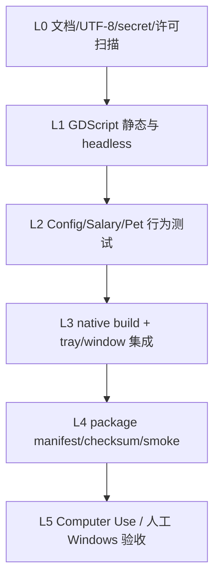

# LetsMakeMoney v0.7 代码与仓库瘦身审计

**日期**：2026-07-11
**对象**：`main` / `e6f25ae8cb4d9583aa3e629cb79416e278060117`
**原则**：本轮只列候选、证据和验证方案，不删除、不重构、不修改业务逻辑

## 1. 审计结论

当前仓库的主要维护负担不来自总代码量，而来自四类结构性冗余：

1. Settings 旧 UI 路径与当前紧凑 UI 路径并存。
2. v0.2-v0.6 的静态合同测试固定了部分已无运行时调用的旧 API。
3. 按版本复制的打包/包验证脚本只有少量字符串差异。
4. `temp/`、`experiments/`、历史大文档和素材预览混在公开主树候选中。

不建议为了“代码更少”直接动 `main.gd`、`WindowsPlatform` 或 native 的双阶段策略重应用。它们看起来重复，但承担过已记录的托盘恢复、任务栏和点击穿透稳定职责，应先补行为测试再处理。

## 2. 规模基线

| 类别 | 数量/规模 | 证据状态 |
|---|---:|---|
| Git 跟踪文件 | 409 个（不含本地 godot-cpp） | 已确认 |
| GDScript | 27 个 | 已确认 |
| PowerShell | 28 个主要脚本，scripts 目录共 50 个文件含 uid | 已确认 |
| Markdown | 65 个左右 | 已确认 |
| 栅格/图标/音频类资产 | 143 个左右 | 已确认 |
| 最大业务脚本 | `settings_dialog.gd` 1765 行 | 已确认 |
| `main.gd` | 942 行 | 已确认 |
| `wizard_dialog.gd` | 604 行 | 已确认 |
| 最大验证脚本 | `verify_v04.gd` 1093 行 / 67 KB | 已确认 |
| Git pack | 18.96 MiB | 已确认 |

## 3. 瘦身候选总表

| ID | 文件/符号 | 当前作用 | 调用者 | 删除/合并证据 | 预计收益 | 风险 | 验证方法 | 建议 |
|---|---|---|---|---|---|---|---|---|
| SLIM-001 | `settings_dialog.gd::_build_ui` | 旧版大窗口 UI 构建 | 未发现运行时调用 | `_ready` 只调用 `_build_compact_ui`；旧函数 223 行 | 高 | 中 | Settings 五页截图、保存/取消/失败、v0.4-v0.6 回归 | 需要先补测试 |
| SLIM-002 | `_add_card_grid` / `_add_info_card` / `_add_checkbox` | 旧 UI helper | 仅定义或旧日志提及 | 全仓调用计数分别为 1/2/1，运行时无调用 | 中 | 中 | 删除旧 `_build_ui` 后重新做调用图和 UI 回归 | 与 SLIM-001 合并 |
| SLIM-003 | `_add_status_card` | Display 旧状态卡 helper | 只有 v0.4 静态测试和定义 | 运行时无调用；测试固定函数名 | 低中 | 中 | 更新测试为可见布局行为后删除 | 需要先补测试 |
| SLIM-004 | `Platform._on_status_indicator_pressed` | Godot 状态指示器降级回调 | 未发现信号连接 | 仅定义一次；当前使用 native tray | 低 | 中 | native 不可用降级测试、信号连接审计 | 需要先补测试 |
| SLIM-005 | `Platform._on_tray_menu_id_pressed` | Godot PopupMenu 托盘降级路由 | 未发现调用/连接 | 仅定义一次 | 低 | 中 | native 不可用路径和降级菜单回归 | 需要先补测试 |
| SLIM-006 | `DragResizeSystem.show_tray_menu` | v0.1 PopupMenu 降级托盘 | 文档提及，运行时未发现调用 | 源码仅定义；真托盘自 v0.3 起使用 native | 中 | 中高 | 模拟 native unavailable、任务栏找回测试 | 技术 spike |
| SLIM-007 | `PanelSystem.force_refresh` / `is_expanded` | 旧公共 Panel API | 只在历史实施计划示例中调用 | 源码仅定义，运行时无调用 | 低 | 低中 | Panel 展开/数据更新回归 | 可直接清理前再确认动态 call |
| SLIM-008 | `PetManager.set_state` / `state_to_anim_name` | 旧状态 API | 运行时未发现文本调用；历史文档依赖 | 当前 PetManager 使用基础状态与扩展交互模型 | 中 | 中高 | Pet 三基础状态 + 单双击/长按全矩阵 | 需要先补测试 |
| SLIM-009 | `SalaryEngine.get_rate_per_second` / `get_work_days_this_month` | PRD 承诺的查询 API | 运行时未发现调用 | 只在历史 PRD/计划和定义中出现 | 低 | 中 | 薪资计算 API 决策；公开 API 兼容说明 | 暂不处理或弃用标记 |
| SLIM-010 | `main.gd::_get_panel_visual_scale` | 旧 Panel 视觉缩放 helper | 未发现调用 | 仅定义一次 | 低 | 低 | 分辨率/缩放/Panel 截图回归 | 可直接清理候选 |
| SLIM-011 | `main.gd::suspend_mouse_passthrough` | 旧外部暂停入口 | 未发现调用 | 当前使用 modal/popup signals | 低 | 中高 | Settings/Wizard/Popup 点击穿透成对日志 | 需要先补测试 |
| SLIM-012 | `main.gd::get_debug_window_size` | v0.2 测试合同 | 仅 v0.2 验证调用 | 运行时无调用，旧测试固定 900x500 | 低 | 低 | 将旧测试改为当前窗口策略合同 | 与历史测试治理合并 |
| SLIM-013 | `settings_dialog.gd::get_v02_control_names` | v0.2 测试适配 API | 仅 v0.2 验证调用 | 运行时无调用 | 低 | 低 | v0.2 测试改为当前节点/行为检查 | 与历史测试治理合并 |
| SLIM-014 | `_apply_auto_start_setting` | 开机自启旧 helper | 只有 v0.4 静态测试和定义 | 当前保存事务有独立外部状态处理 | 中 | 高 | 开启/关闭/失败补偿/真实登录验证 | 技术 spike，不直接删 |
| SLIM-015 | WarmTheme `style_scrollbar` / `style_section_divider` / `style_inline_status` | 共享样式 API | 仅 v0.5 测试和定义 | 运行时未调用 | 低 | 低中 | Settings/Wizard 五页视觉对照 | 可合并或删前补视觉测试 |
| SLIM-016 | `package_v04.ps1` / `package_v05.ps1` | 版本打包 | 各历史入口 | 两文件只有约 5 处版本差异 | 中 | 中 | 同输入生成相同 manifest/zip 内容 | 参数化合并 |
| SLIM-017 | `verify_v04_package.ps1` / `verify_v05_package.ps1` | 包体验证 | 历史回归入口 | 两文件只有约 8 处版本差异 | 中 | 中 | 对旧包运行参数化验证并比对结果 | 参数化合并 |
| SLIM-018 | v0.1-v0.3 验证脚本 | 历史回归 | 不在 v0.6 活跃清单 | 当前 dev plan 明确只迁 v0.4+ | 中 | 中高 | 标记 archive，不立刻删除；保留一次基线结果 | 归档，不直接删 |
| SLIM-019 | `temp/cat_orange_v1_final_256*` | v1 临时交付包与预览 | runtime 使用复制后的 assets | 与 `assets/pets/cat_orange_v1` 高度重复，含 2.26 MB Zip | 高 | 中高 | 逐 hash 比对、资源引用检查、fallback 运行 | 资产确认后移出公开仓库 |
| SLIM-020 | `experiments/ai_cat_assets` | 早期 AI 素材实验 | export 排除，runtime 无引用 | 主要历史大 blob，未进入发布 EXE | 高 | 中高 | 资产权属与 runtime 引用扫描 | 移入私有档案候选 |
| SLIM-021 | `doc/v0.4-comfyui-spike.md` + Comfy 脚本 | 外部素材工具 Spike | 不在运行/打包主链 | PRD 明确 ComfyUI 不产品化 | 中 | 低中 | 确认后移至独立工具仓库或 archive | 公开主仓库排除候选 |
| SLIM-022 | 根历史大文档 | v0.1-v0.4 累积 PRD/plan/progress | current 已声明非当前事实源 | 232KB + 138KB + 85KB，内容有价值但噪音大 | 中 | 低 | 建 archive 索引、链接检查 | 归档，不删除 |
| SLIM-023 | `icon.svg` / `.import` | Godot 初始默认图标候选 | project/export 使用 app_icon PNG/ICO | 未发现当前资源引用 | 低 | 低 | Godot import、export 图标、tray 图标回归 | 可直接清理候选 |
| SLIM-024 | 跟踪的 `.import` 元数据 | Godot 导入缓存描述 | Godot 项目会读取/再生 | 大量跟踪，历史上用于稳定导入参数 | 中 | 中 | 全新 clone 导入与资源一致性比较 | 技术 spike |
| SLIM-025 | Main/Windows 双状态缓存 | 任务栏、显隐、passthrough 状态 | Main + WindowsPlatform + native | 代码存在多层缓存和双阶段重套 | 潜在高 | 极高 | 真实托盘 10 轮、任务栏、modal/popup、DPI 全矩阵 | 必须保留，先写状态所有权 |

## 4. 可直接清理候选

这里的“可直接”仍表示进入实现时应先做最后一次引用确认和回归，不表示本轮删除。

### 4.1 低风险源码候选

- `main.gd::_get_panel_visual_scale`：仅定义，无调用。
- `icon.svg` 与 `icon.svg.import`：项目和 export 均指向 `icons/app_icon.*`。
- 经运行时和动态调用复核后，`PanelSystem.force_refresh` / `is_expanded` 可作为弃用 API 清理。

### 4.2 低风险仓库候选

- `.manual-test/`、`.tmp_acceptance/`：本地证据，不应提交；加入 ignore。
- `releases/v0.6/` 展开目录：发布资产应留 GitHub Release，不应作为源码树文件。
- 本地构建产物、`.tmp_appdata`、`.tmp_release`：继续忽略。

## 5. 需要先补测试

### 5.1 Settings 旧路径

`settings_dialog.gd` 当前入口明确调用 `_build_compact_ui()`，而 `_build_ui()` 仍完整存在，并重复搭建 nav、content 和 action bar。旧 helper 很可能只服务 `_build_ui()`。

删除前最低测试：

1. Settings 五页可打开与切换。
2. OptionButton popup、Switch、Slider、SpinBox 状态。
3. 保存成功、无变化、失败、取消、关闭。
4. 恢复默认与配置/宠物/注册表补偿。
5. 720p、1080p、2K DPI 截图基线。
6. Wizard 共享控件不回退。

### 5.2 旧测试固定的 API

以下函数只有测试或历史文档使用：

- `get_debug_window_size`
- `get_v02_control_names`
- `_add_status_card`
- `style_scrollbar`
- `style_section_divider`
- `style_inline_status`

当前问题不是“测试太多”，而是测试验证函数名存在，而非用户行为。应先把测试改为场景结构、控件主题或运行结果，再删除 API。

### 5.3 Pet / Salary 公共 API

`state_to_anim_name`、`get_rate_per_second` 等虽无运行时调用，但历史 PRD 将其描述为接口。公开后删除会成为 API 语义变化。v0.7 应先声明：项目是否承诺脚本 API 稳定；若不承诺，可在 Beta 期间清理并在 changelog 记录。

## 6. 需要技术 Spike

### 6.1 Main / WindowsPlatform / native 状态所有权

现有状态包括：

- Godot `Window.visible`。
- native HWND 实际显隐。
- `_last_taskbar_visible`。
- native `WS_EX_TOOLWINDOW` / `WS_EX_APPWINDOW`。
- `_last_passthrough_rects_hash`。
- Modal / Popup 暂停状态。
- tray menu 的 visible label。

托盘恢复会立即和下一帧各重套一次策略，这是针对真实 Windows 任务栏恢复 bug 的稳定补丁。删除重复调用前需要：

- 明确唯一状态所有者。
- 记录每个缓存的失效条件。
- normal / pure 各 10 轮真实与 PostMessage 验证。
- Windows Explorer 重启、显示缩放、睡眠恢复、modal 打开时托盘恢复等边界测试。

结论：**必须保留，直到 Spike 给出替代模型。**

### 6.2 Godot 降级托盘路径

`Platform` 和 `DragResizeSystem` 留有 Godot PopupMenu 降级入口。当前 native 正常时无调用，但 native DLL 缺失或不支持时，它可能是找回窗口的安全兜底。必须先模拟 native unavailable，确认任务栏入口和退出路径，不能仅凭调用搜索删除。

### 6.3 `.import` 元数据

仓库跟踪大量 `.png.import` 和 `.uid`。公开 Godot 项目常见做法是忽略 `.godot/`，但是否跟踪源资源旁的 `.import` 取决于当前导入参数和团队策略。应从干净 clone 比较资源 UID、动画贴图和导出结果，再决定。

## 7. 必须保留

| 对象 | 保留原因 | 证据状态 |
|---|---|---|
| Config `.tmp` / `.previous` / invalid 备份流程 | 保存失败与损坏恢复核心安全职责 | 已确认 |
| 托盘恢复双阶段策略重应用 | 历史真实任务栏 bug 的已验证修复 | 已确认 |
| Popup/Modal 点击穿透暂停与恢复 | 防止设置窗口被穿透、关闭后恢复桌宠 | 已确认 |
| native passthrough WNDPROC 恢复 | 资源释放和进程退出安全 | 已确认 |
| v0.5/v0.6 verification 与 bugfix log | 当前稳定基线与历史根因证据 | 已确认 |
| v1 fallback pet | v2 资产或加载失败时的回退 | 已确认 |
| 诊断摘要的 bounded log scan | 防止读取无界日志 | 已确认 |

## 8. 暂不处理

- 为减少行数而拆分所有 autoload。
- 将 GDScript UI 全部改为 `.tscn`，当前风险高于收益。
- 替换 Win32 原生实现为第三方托盘库。
- 将 PowerShell 验证整体迁移到 Python。
- 删除所有历史版本文档和 tag。
- 删除 fallback pet 或安全写入备份。

## 9. 验证脚本治理方案

### 9.1 建议层级

### 9.2 参数化目标

- `package_release.ps1 -Version 0.6-beta -ReleaseDir ...`
- `verify_package.ps1 -PackagePath ... -ExpectedVersion ...`
- 历史 wrapper 仅传参数，保留旧命令兼容。
- `project.godot` 继续作为机器可读版本唯一来源。

### 9.3 禁止项

- 不把真实用户 APPDATA 用作自动测试目录。
- 不把函数名存在当作用户行为通过的唯一证据。
- 不让测试 API 进入正式 UI。
- 不因清理旧测试而失去 v0.4/v0.5 核心回归。

## 10. 仓库资产瘦身路线

### 阶段 A：公开前最小清理

1. 忽略本地验收、构建和发布展开目录。
2. 从公开候选中排除 ComfyUI/Aki 本机环境脚本与隐私记录。
3. 对 runtime 资产建立授权台账。
4. 将 `temp/` 和 `experiments/` 默认移入私有档案。
5. 保留运行时 `assets/`、必要生成脚本和可公开 manifest。

### 阶段 B：测试保护下的代码清理

1. 补 Settings/Wizard 视觉和事务测试。
2. 删除 `_build_ui` 旧路径及仅服务它的 helper。
3. 将历史字符串测试改为行为合同。
4. 参数化 package / package verify。
5. 删除确定未使用的低风险 helper。

### 阶段 C：原生状态 Spike

1. 画出窗口状态所有权。
2. 给缓存定义不变量和失效条件。
3. 用行为测试证明可替换。
4. 再判断是否合并 Main、WindowsPlatform 与 native 的重复策略。

## 11. 预计收益

| 路线 | 预计收益 | 回归风险 |
|---|---|---|
| 移出 `temp/` / `experiments/` | 显著降低仓库体积、权属面和新贡献者噪音 | 中，需确认无 runtime 引用 |
| 删除 Settings 旧 UI 路径 | 最大业务文件显著缩小，减少重复视觉代码 | 中，需完整 UI/事务回归 |
| 参数化打包验证 | 减少版本复制错误，未来版本成本下降 | 中，需旧包对照 |
| 删除测试专用旧 API | 简化公开 API 面 | 低至中，需先改测试 |
| 合并窗口状态缓存 | 潜在维护收益高 | 极高，不建议直接做 |

## 12. 进入 `/idea` 前的问题

1. v0.7 是否愿意把“Settings 旧路径清理”纳入主线，还是只做开源门禁？
2. `temp/`、`experiments/`、ComfyUI Spike 和私有验收证据已确认不进入公开仓库；实现阶段需确定私有归档位置与公开占位素材。
3. 是否承诺 GDScript API 向后兼容？若不承诺，Beta 期间可清理未调用 API。
4. 旧版本 package wrapper 是否需要保留命令兼容，还是只保留文档记录？
5. 是否接受先写 Main/native 状态所有权文档，而不在 v0.7 立即拆分核心窗口代码？
