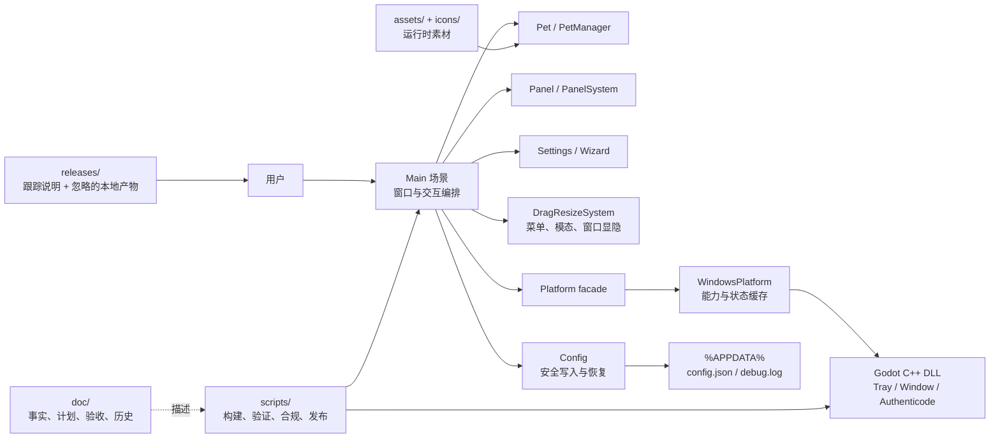
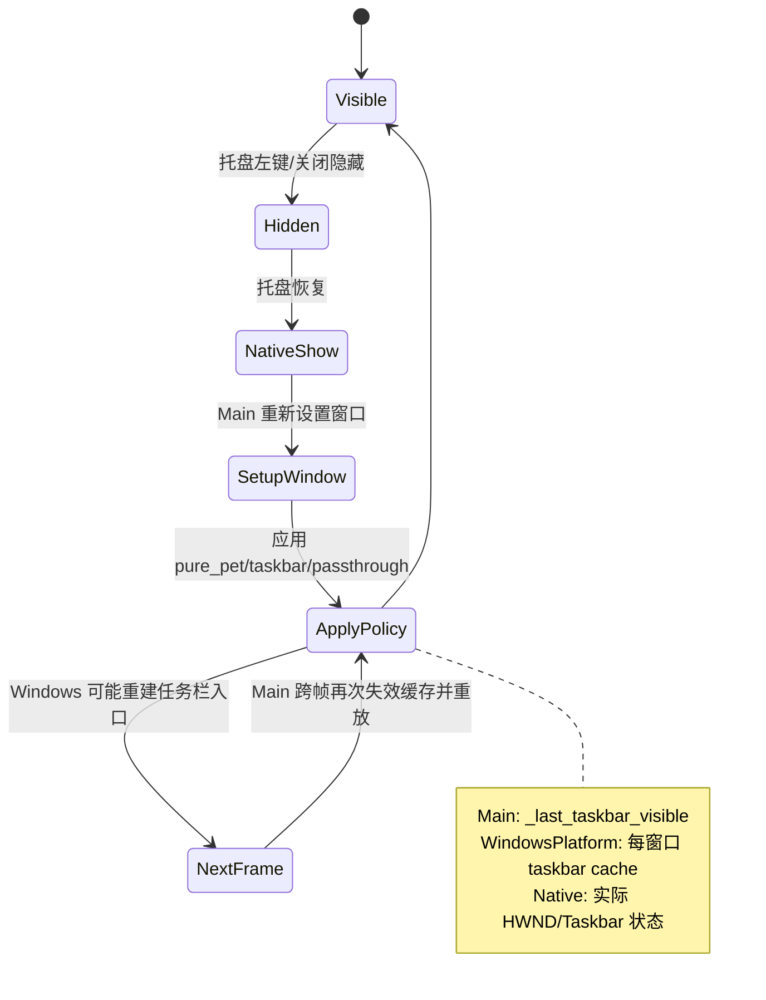

# LetsMakeMoney v0.8 工程治理 Review

**状态**：审查完成；C0-C4 已执行并通过对应门禁
**审查日期**：2026-07-13
**审查对象**：`main` / `e79149d91e8e0adb3cbf1e53cd8819f072f7154f`
**审查类型**：发布后 Project Review + Implementation Review + 文档/产物治理 Review
**边界**：Review 本身未改业务逻辑；后续已按确认方案完成事实修正、本地缓存清理和文档分层，尚未进行脚本清理或 Main/native 重构

## 1. Review 判断

v0.7 Beta 的源码、便携包、自动验证和公开仓库治理已经形成可运行闭环；当前主要问题不是“项目不可用”，而是七个版本连续迭代留下的组织债：当前事实入口失真、历史文档与当前文档混层、脚本代际过多、本地生成物占用大、`Main` 与原生窗口策略存在重复状态所有权。

**总体结论**：适合作为 v0.8 工程治理主线，但不适合直接进行大范围删除。应先修事实源，再清本地生成物，再迁移文档，最后以行为测试保护 Main/native 和兼容脚本治理。

证据状态统一使用：**已确认 / 高度可能 / 待确认 / 主观判断**。

## 2. 项目与目录地图

| 路径 | 当前职责 | 审查判断 |
|---|---|---|
| 根目录 | 项目入口、许可、贡献、安全、Godot 配置 | 职责基本清楚；README 仍混入旧版本操作口径 |
| `src/` | Godot 业务与 UI | 运行主链完整；`Main`、Settings 和窗口编排过于集中 |
| `native/windows/` | Windows 托盘、窗口、任务栏、穿透、签名验证 | 源码边界清楚；本地依赖与构建缓存体积大但已忽略 |
| `scripts/` | v0.1-v0.7 验证、打包、CI、许可、素材生成 | 84 个跟踪文件；历史复现与当前入口未分层 |
| `doc/` | 当前事实、版本需求、计划、进度、验收、日志、原型 | 88 个跟踪文件；当前与历史混层，是主要理解成本来源 |
| `assets/`、`icons/` | 运行时宠物和品牌素材 | 运行素材均有许可清单；生成源与运行资源边界仍需明确 |
| `releases/` | 跟踪 changelog/旧 notes；本地保存忽略的包与解压目录 | 同一路径承担两种职责，容易误解和重复占用 |
| `build/` | 本机快速启动产物 | 已忽略；不是仓库冗余，删除后需重新构建才能启动 |
| `.tmp_*`、`.manual-test/` | 自动/人工验收中间物 | 已忽略且可再生成，是本地清理的主要对象 |

## 3. 当前事实与文档分层

### 3.1 已确认问题

| ID | 严重度 | 发现 | 证据 | 建议去向 |
|---|---|---|---|---|
| GOV-001 | Major | 唯一事实入口仍写“v0.7 发布收口中”，但远端仓库已公开且 v0.7 Beta Release 已发布 | `doc/current.md:6-9,69`、`doc/releases/v0.7/current.md:3`、GitHub Release | 直接修文档 |
| GOV-002 | Major | 文档状态检查会把上述旧口径判定为通过 | `scripts/check_docs_status.ps1` 明确要求 `Acceptance` 和 `V07-ACC-001`，未校验已发布 tag/Release 状态 | 直接修检查合同 |
| GOV-003 | Major | `doc/archive/` 只有旧索引，且仍称 v0.4 为当前版本；历史文档实际未归档 | `doc/archive/README.md` 与 `doc/releases/v0.4-v0.7/` 实际结构 | 文档迁移批次 |
| GOV-004 | Major | 三份跨版本大文档继续承载 v0.1-v0.4 历史，和每版本文档重复 | `implementation-plan.md` 约 232 KB、`progress.md` 约 138 KB、PRD 约 85 KB | 归档，不删除历史 |
| GOV-005 | Minor | README 当前版本正确，但构建入口仍以 `verify_v06.ps1` 为主，版本说明主体仍从 v0.6 开始 | `README.md:80` 及当前状态段 | 直接修文档 |
| GOV-006 | Minor | 日志命名不统一，且 `doc/logs/README.md` 仍以 v0.5 治理为主要口径 | `dev_log_v0.6.md`、`v0.4-dev-log.md` 等 | 归档并统一命名规则 |
| GOV-007 | Minor | 原型目录缺少“当前原型/历史原型/生成截图”的清晰边界 | `doc/prototypes/README.md` 仅说明许可 | 补索引后再整理 |

### 3.2 建议事实层级

1. `README.md` / `README.en.md`：面向外部用户和贡献者，只保留产品、下载、构建、贡献入口。
2. `doc/current.md`：唯一内部当前事实源，记录已发布版本、当前开发版本、HEAD、阻塞和推荐阅读顺序。
3. `doc/releases/vX.Y/`：该版本 PRD、计划、进度、验收、发布说明和必要日志索引。
4. `doc/logs/`：仅保存当前开发版本的 dev/bugfix/spike 日志；已结束版本迁入 archive。
5. `doc/archive/vX.Y/`：历史事实快照，不作为当前口径。
6. `doc/prototypes/`：只保留当前可交互原型和规范；历史截图进入 archive，生成中间图不跟踪。

## 4. 脚本与兼容层审计

脚本共有 84 个，约 333 KB；不存在内容完全相同的文件，但存在大量薄 wrapper 和跨版本回归链。

| 类别 | 文件数 | 判断 |
|---|---:|---|
| v0.1-v0.3 历史验证 | 8 | 不属于当前 CI；可归档，但必须先验证文档和复现需求 |
| v0.4-v0.6 兼容/回归 | 22 | 当前 CI 仍调用 v0.4、v0.5、M4、M5；不能直接删除 |
| v0.7 当前治理/构建/验证 | 33 | 当前公开、构建和发布门禁，必须保留 |
| 素材管线 | 8 | 部分依赖被排除的 `_review` 输入；应与运行时构建脚本分层 |
| 公共与其他 | 13 | 主要是共享打包、验证与版本工具 |

**已确认**：`package_v04.ps1`、`package_v05.ps1` 已是 `package_common.ps1` 的薄 wrapper；v0.6/v0.7 又增加导出和许可门禁。历史 wrapper 的价值是复现旧包，而非当前开发入口。
**已确认**：当前 CI 的 `run_ci_verification.ps1` 仍直接执行 v0.5、v0.4 和 M4 验证，因此这些脚本属于活跃兼容门禁。
**高度可能**：v0.1-v0.3 验证和旧导出脚本可迁至 `scripts/archive/` 或改为按 tag 运行；需要先证明当前 CI、文档和包脚本无调用。
**待确认**：项目是否仍要求在当前 main 上复现 v0.4/v0.5 包。如果不要求，可保留在历史 tag 而不继续维护 wrapper。

## 5. Main、native、托盘、配置与窗口策略

### 5.1 复杂度事实

| 模块 | 规模/职责 | 判断 |
|---|---|---|
| `main.gd` | 957 行、73 个函数；窗口、Panel 定位、穿透、托盘、调试输入、模态与更新退出 | God object，需分阶段治理 |
| `settings_dialog.gd` | 1605 行；五页 UI、主题、数据绑定、事务、诊断、更新、自启动 | 最大单文件，UI 与事务职责混合 |
| `drag_resize_system.gd` | 465 行；移动、显隐、两类菜单、模态、关于、退出 | 名称已不能覆盖实际职责 |
| `windows_platform.gd` | 353 行；原生能力、健康状态、任务栏缓存、自启动 | 平台适配层合理，但持有策略状态 |
| `window_policy_coordinator.gd` | 10 行；仅两个纯函数 | 已建立策略入口，但尚未真正接管状态机 |
| native C++ | TrayController、WindowController、LMMNativeBridge | Godot/native 边界清楚，必须保留 |
| `config.gd` | 277 行；默认值、损坏恢复、原子保存、快照与变更键 | 可靠性核心，不宜为减行数拆散 |

### 5.2 重复状态所有权

**已确认**：`Main` 和 `WindowsPlatform` 各持有一层任务栏可见性缓存；托盘恢复会清缓存、应用策略、等待一帧、再次清缓存并重放。
**已确认**：该重复来自真实 Windows 恢复问题，v0.7 已有窗口策略合同和桌面验收，不可直接合并。
**建议**：v0.8 先建立单一 `WindowRuntimeState`/状态快照合同，使 `Main` 只发意图、`WindowsPlatform` 只报告能力和执行结果；完成普通/纯桌宠、托盘、Modal/Popup、DPI 的行为矩阵后再移除一层缓存。

## 6. 素材、原型与发布产物边界

### 6.1 素材

- `assets/pets/cat/orange_v2` 是当前默认运行素材；`cat_orange_v1` 是代码和验证明确要求的回退素材；占位猫仍由 `PetManager` 扫描。
- PNG 通过 `.tres` 动态引用，不能用“源码未直接出现文件名”判断未使用。
- 生成脚本仍引用已排除公开的 `_review` 概念图；这意味着运行素材可公开，但外部贡献者无法从仓库完整重建生成过程。
- 建议将素材工具分为 `runtime-asset-build` 与 `private-generation-history`。前者保留，后者归档到仓库外或明确为不可复现的维护者工具。

### 6.2 原型

- `doc/prototypes/index.html` 与 `prototype-spec.md` 是当前产品说明资产，应保留。
- 本地未跟踪的 Day4 DOCX、PNG 和 `.import` 属于演示交付物/生成副本，不应混入当前原型事实层。

### 6.3 发布物

- Git 仅跟踪 `releases/CHANGELOG.md` 和 v0.3-v0.6 notes；v0.7 notes 位于 `doc/releases/v0.7/`。
- 本地 `releases/v0.4-v0.7/` 同时保存 Zip、解压副本和测试安装器，约 633 MB，且均被忽略。
- 建议：`releases/` 只保留“准备上传的最终附件”；解压 smoke 移入 `.tmp_release/`；历史二进制以 GitHub Release 为事实源，本地按需缓存。

## 7. 四类清单

### 7.1 可删除（仅候选，尚未执行）

| 对象 | 证据状态 | 预计收益 | 前置确认 |
|---|---|---:|---|
| `.tmp_acceptance/` | 已确认：1409 文件，约 1.04 GB，0 跟踪 | 很高 | 当前无未收口验收 |
| `.tmp_release/` | 已确认：约 330 MB，0 跟踪 | 高 | 保留已发布 Zip，不保留解压副本 |
| `.tmp_installer/` | 已确认：约 60 MB，0 跟踪 | 中 | 未签名安装器验收已结束 |
| `.manual-test/` | 已确认：约 110 MB，0 跟踪 | 中 | 截图证据已写入文档或不再需要 |
| `.tmp_appdata/`、`.tmp_ci/`、`_lmm_verify/` | 已确认：均可由验证重建 | 低至中 | 无运行中的验证进程 |
| `.godot_user_v05/` | 已确认：历史编辑器用户目录，0 跟踪 | 低 | 不再用于 v0.5 隔离启动 |

`build/` **不在直接删除清单**：它是当前本地直接启动入口，删除后必须重新导出。`.godot/` 也只建议在导入异常时清理，不作为日常瘦身目标。

### 7.2 应归档

- `doc/implementation-plan.md`、`doc/progress.md`、`doc/LetsMakeMoneyPRD.md`：冻结为 v0.1-v0.4 历史汇总并迁入 archive，当前入口改为版本文档。
- `doc/verification/v0.1-v0.4.md` 及已结束版本的 manual/verification：按版本归档，保留发布证据。
- v0.2 素材 Spike、v0.4 动画生成日志/提示包、`doc/temp-pc-work/`：迁入对应版本或 `archive/spikes/`。
- v0.4-v0.6 dev/bugfix 日志：迁入对应版本 archive；`doc/logs/` 只保留当前开发版本。
- `doc/ui-prototype-warm-widget.html`：若已被当前原型吸收，归档为视觉历史，不与当前原型并列。
- 本地 Day4 DOCX/截图：归入仓库外 deliverables，或经明确选择后进入 `doc/archive/demos/`。

### 7.3 需补测试后再清理/重构

- `Main` 与 `WindowsPlatform` 的双重任务栏缓存、托盘恢复跨帧重放。
- `Main` 中窗口布局、穿透计算、托盘与 Modal/Popup 状态编排。
- `DragResizeSystem` 中菜单、模态和窗口职责拆分。
- Settings 的 UI 构建、共享主题、保存事务、运行态/注册表补偿拆分。
- v0.4-v0.6 包装脚本和 M4/M5 回归入口。
- v0.1-v0.3 验证脚本从当前树迁出或只在历史 tag 运行。
- `cat_orange_v1` 和占位猫回退链，必须先验证配置升级和资源缺失降级。
- 素材生成脚本与被排除 `_review` 输入的关系。
- 旧配置键与兼容默认值；需要配置版本迁移矩阵后才能移除。

### 7.4 必须保留

- `src/` 当前运行链、`project.godot`、导出配置。
- native 全部跟踪源码、协议、构建说明与固定依赖锁。
- `Config` 原子保存、损坏备份、快照恢复与更新备份能力。
- v0.7 CI、公开候选、许可、隐私、依赖、安装/更新合同和包验证脚本。
- MIT、受限素材许可、第三方 notices、依赖/素材 manifest。
- 当前橘猫 v2、v1 回退与现有占位猫资源，直到回退矩阵明确缩减。
- `doc/current.md`、v0.7 发布/验收证据、当前原型和规范。
- v0.7 已发布 Zip 的哈希和 GitHub Release 事实；本地 Zip可保留一份，不保留多份解压副本。

## 8. 关键风险与优先级

| ID | 严重度 | 风险 | 证据状态 | 最小动作 |
|---|---|---|---|---|
| R-001 | Major | agent 读取过期 current 后执行错误发布动作 | 已确认 | 先修 current 与 docs contract |
| R-002 | Major | 窗口策略重构导致托盘恢复/任务栏/穿透回归 | 已确认 | 先补状态矩阵与单一状态快照 |
| R-003 | Major | 文档大搬家造成大量链接失效 | 高度可能 | 建重定向索引并分版本迁移 |
| R-004 | Major | 删除历史脚本破坏 CI 和旧配置兼容 | 已确认 | 建 active/compat/archive 清单后逐项下线 |
| R-005 | Minor | 本地忽略产物持续膨胀和重复占盘 | 已确认 | 增加只读清理预览脚本和保留策略 |
| R-006 | Minor | 运行素材可用但生成过程不可复现，贡献者误解 | 已确认 | 文档明确 runtime 与 private-generation 边界 |
| R-007 | Minor | `releases/` 同时表示说明、缓存、解压和附件 | 已确认 | 统一目录契约 |

## 9. 验证结果

- `run_ci_verification.ps1 -Suite docs`：通过，461 个公开候选文件，0 failure / 0 warning。
- `verify_v07.ps1 -StaticOnly`：通过；v0.6、安装器、签名/卸载、更新、公开治理合同通过。
- `git diff --check`：通过。
- Git 工作区在本报告写入前为 clean；本地生成目录均被 ignore，未进入 Git。
- 注意：docs suite 通过不代表当前发布状态真实，GOV-002 已说明该合同缺口。

## 10. v0.8 治理门禁建议

1. 不以删除文件数或减少代码行数作为成功指标。
2. 每批清理前生成 manifest，清理后运行对应回归。
3. 当前事实修复必须先于历史迁移。
4. Main/native 任何状态所有权调整必须通过真实 Windows 托盘、普通/纯桌宠、Popup/Modal、DPI 回归。
5. 每个归档移动必须更新链接，并由 Markdown link checker 验证。
6. 当前发布 Zip、用户配置和本地可启动 build 不得被清理脚本默认删除。

## 11. 首批执行结果

- C0 已修正 `doc/current.md`、v0.7 状态摘要和双语 README，并将文档检查从“开发中 A 系列里程碑”切换为已发布 tag/Release 身份。
- C1 已删除 8 个 ignored 临时目录，共释放约 1.54 GB；未删除 `build/`、`.godot/`、`deliverables/`、`releases/` 或 `native/`。
- 本地 `build/LetsMakeMoney.exe` 启动 smoke 通过。
- v0.7 便携 Zip SHA256 仍为 `16F47A844EFD78D387E9D08FBCD3DE76C8C8BDD518731C1B0BA022E7F598121F`。
- docs/compliance suite、v0.7 static suite 与 `git diff --check` 通过。

## 12. C4 执行结果

- 新增 `WindowRuntimeState`，把 debug、pure pet、tray、native、窗口可见性、Modal、Popup 与 passthrough 配置收敛为 Main 可消费的运行时快照。
- 新增 `PetWindowGeometry`，将 Pet/Panel 尺寸与命中矩形计算移出 Main，并用 Godot 自动测试覆盖缩放和最小命中区域。
- 新增 `OverlayLifecycle` 与 `ContextMenuBuilder`；`DragResizeSystem` 从 465 行降至约 339 行，继续保留窗口移动、菜单定位、命令分发和模态创建职责。
- Main 不再持有 `_last_taskbar_visible`；任务栏缓存仅由 `WindowsPlatform` 持有，Main 通过 Platform facade 请求缓存失效。
- 普通模式托盘 10/10、纯桌宠托盘 10/10 通过；v0.4-v0.7、M4、M5 与 C4 合同回归通过。
- 临时导出发现 `deliverables/` 会被当前 export preset 带入 PCK。该问题不影响本次临时 EXE 行为验证，但属于 C5 发布目录与导出边界的明确待办。
