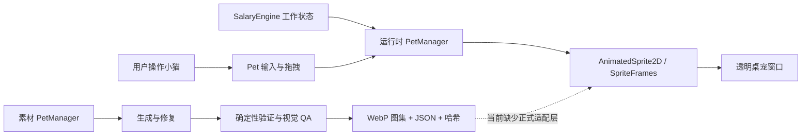
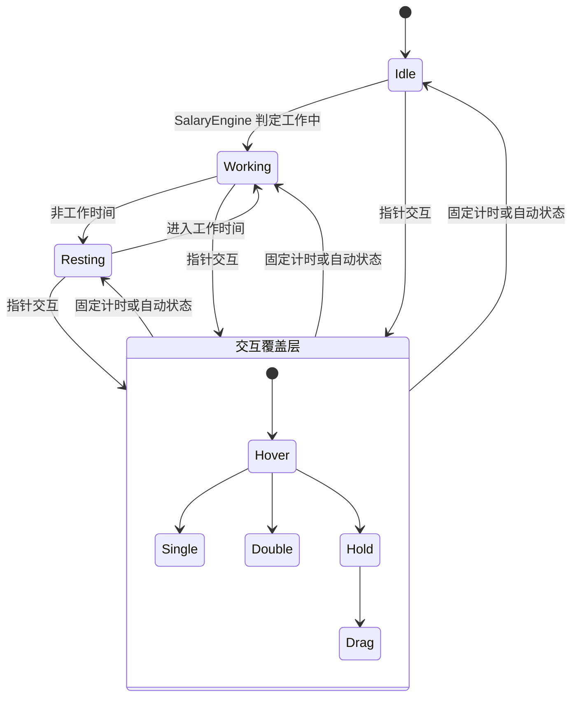
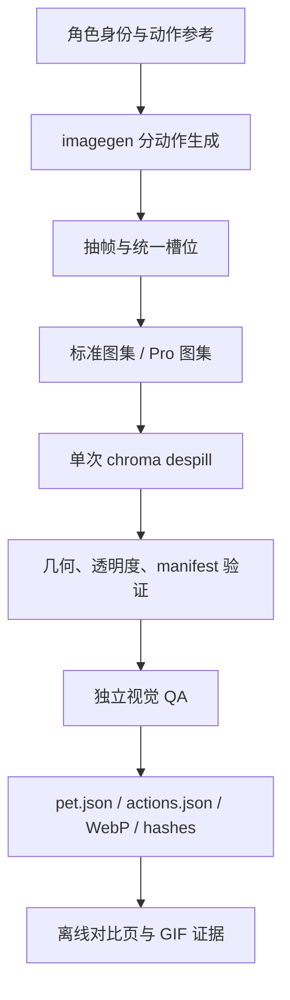
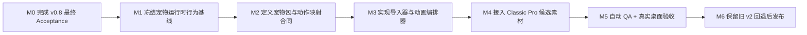

# 宠物动作与 PetManager 深度 Review

**Review 日期**：2026-07-17
**Review 类型**：Project Review + Implementation Review + 跨项目集成 Review
**当前结论**：可进入下一版本 `/idea`，不可直接进入素材替换或运行时重构
**适用边界**：本文件记录下一版本候选，不属于 v0.8 薪资与作息发布范围

## 1. Review 判断

LetsMakeMoney 已有可运行的宠物基础状态、交互覆盖层、素材回退和真实桌面交互；独立 PetManager 已有成熟的生成、确定性处理、视觉 QA、哈希和交付包能力。两侧各自都不是“从零开始”，但目前不存在可直接连接的正式运行时契约。

下一版本不应直接把 PetManager 的图集复制进 LetsMakeMoney。应先建立交付包适配、动作语义映射、逐帧时长和回退规则，再优化运行时播放与交互仲裁，最后替换默认素材。否则新素材仍会被固定播放时长、额外缩放染色和旧动作命名限制。

Review 发现只作为候选，不自动等于正式需求。版本号、范围和优先级需经过后续 `/idea` 与 `/prd` 确认。

## 2. 当前状态冻结

### 2.1 LetsMakeMoney

| 项目 | 当前事实 | 证据状态 |
|---|---|---|
| 工作目录 | 当前 v0.8 工资与作息工作树（本机路径不写入公开文档） | 已确认 |
| 分支 | `feature/v0.8-salary-schedule` | 已确认 |
| HEAD | `5c302efcc2edb868231c4c4d9f002e8355e03001` | 已确认 |
| 当前发布版 | v0.7 Beta | 已确认 |
| v0.8 状态 | 薪资与作息已提交，`0.8-beta` 候选包已生成并通过自动回归与包验证，待最终真实桌面 Acceptance | 已确认 |
| 宠物动作大改 | 仅进入 Review，不属于当前 v0.8 已实现范围 | 已确认 |
| 工作区 | v0.8 候选源码已提交并推送；宠物工作仍应从最终验收后的干净基线另开分支 | 已确认 |

### 2.2 PetManager

| 项目 | 当前事实 | 证据状态 |
|---|---|---|
| 工作目录 | 仓库外部的独立 PetManager 工作树（本机路径不写入公开文档） | 已确认 |
| 分支 | `main`，工作区干净 | 已确认 |
| HEAD | `89ad7630daad67bf9be330ecab8afc3af85960c4` | 已确认 |
| 项目定位 | 桌宠 Skill、生成工作区、完整样例和分发包的统一仓库 | 已确认 |
| Classic Pro 交付 | 9 个标准动作、16 个方向、4 个 Pro 动作 | 已确认 |
| 自动测试 | `hatch-pet-pro` 82 项通过 | 已确认 |
| 交付验证 | 标准图集与 Pro 图集 validator、跨阶段视觉 QA 通过 | 已确认 |

## 3. 对象脉络

### 3.1 两个 PetManager 不是同一个职责

| 名称 | 所在项目 | 实际职责 |
|---|---|---|
| `PetManager` Autoload | LetsMakeMoney | 运行时宠物扫描、选择、基础状态、交互覆盖层和动画名回退 |
| PetManager 仓库 | 独立项目 | 素材生成、抽帧、图集、视觉 QA、证据、哈希和交付 |

同名会增加接手成本。后续文档和代码应使用“运行时 PetManager”与“素材 PetManager”区分；是否重命名代码符号需单独评估，不在 Review 阶段执行。

### 3.2 产品与工程关系

### 3.3 LetsMakeMoney 当前状态流

当前“基础状态 + 交互覆盖层”方向正确；主要问题是覆盖层结束条件、动作语义和资源契约仍由代码常量及命名约定隐式决定。

### 3.4 PetManager 生产流

## 4. 当前契约对照

| 维度 | LetsMakeMoney 运行时 | PetManager 交付 | 结论 |
|---|---|---|---|
| 资源入口 | Godot `PetResource` + `.tres` | `pet.json` + WebP 图集 | 不兼容 |
| 动作描述 | 动画名和 FPS 字典 | 固定图集行、帧数、逐帧毫秒 | 缺适配 |
| 基础语义 | `idle/working/resting` | 标准动作含 idle、running、waving、jumping、waiting 等 | 需映射 |
| 业务扩展 | 状态感知单击/双击、通用 hold | sleeping/eating/celebrating/making-money | 需产品决策 |
| 动画结束 | 固定 `1.55s` 返回 | manifest 中逐帧时长或固定标准合同 | 不兼容 |
| 锚点与命中区 | 运行时扫描透明像素 | 固定 192×208 单元与统一基线 | 可利用但未接入 |
| 回退 | v2 → v1 → placeholder；动作名回退 | validator 失败即阻断交付 | 两层都应保留 |
| QA | 命名、回退、素材存在性 | 几何、透明、方向、连续性、独立视觉 QA | 运行时测试不足 |
| 许可与来源 | LMM 资产 manifest | provenance 与 package hashes | 可组合，字段未统一 |

## 5. 关键发现

### 5.1 问题清单

| ID | 严重度 | 发现 | 证据状态 | 影响 | 建议去向 |
|---|---|---|---|---|---|
| PET-REV-001 | 已收敛 | v0.8 薪资与作息已独立提交并生成锁定身份的候选包 | 已确认 | 最终 Acceptance 前仍不应并入宠物大改 | v0.8 验收通过后再从干净基线进入下一版本 |
| PET-REV-002 | Major | PetManager 交付格式与 Godot `PetResource` 完全没有导入/适配链路 | 已确认 | Classic Pro 包不能直接成为运行时宠物 | 进入 `/idea`，候选为正式宠物包适配器 |
| PET-REV-003 | Major | 两侧动作语义不一致：运行时需要工作、休息及状态感知点击；交付包提供 Codex 标准动作与四个 Pro 动作 | 已确认 | 机械改名会造成错误动作和不可预测回退 | 先定义产品动作矩阵和显式映射 |
| PET-REV-004 | Major | 单击/双击由固定 `1.55s` 返回，未读取真实动画时长或 `animation_finished` | 已确认 | 当前 idle 单击约 1.70s、idle 双击约 2.09s，会被截断；较短动作又会空等 | 运行时动画编排进入下一版本主线候选 |
| PET-REV-005 | Major | 真实动作上又叠加缩放、染色 Tween | 已确认 | 可能遮盖素材动作、改变命中范围并增加视觉 QA 变量 | 原型对照后决定移除、减弱或按动作声明 |
| PET-REV-006 | Major | `pet.gd` 同时承担输入仲裁、拖拽、播放、命中区、视觉 Tween、截图和日志 | 已确认 | 大规模新增动作会进一步放大回归面 | 先补行为测试，再按职责拆分 |
| PET-REV-007 | Major | `PetResource` 只声明 ID、名称、SpriteFrames、缩略图和 FPS，缺少路线图已要求的版本、许可、动作、锚点、画布、回退和预算 | 已确认 | 无法可靠消费外部交付包，也无法验证兼容性 | 建立运行时 manifest / resource 合同 |
| PET-REV-008 | Major | 现有测试覆盖动画名解析和静态回退，但不覆盖动作完整播放、逐帧时长、输入仲裁、动画结束与导入 | 已确认 | 重构或换素材后容易“测试全绿、肉眼不可用” | 先补 characterization tests 和真实窗口验收 |
| PET-REV-009 | Major | PetManager 完整包的部分 QA JSON 保留本机绝对路径 | 已确认 | 交付包不可移植，并可能暴露本机路径 | 在导出阶段生成可移植证据或剥离私有字段 |
| PET-REV-010 | Minor | 运行时同时维护兼容 `PetState`、基础状态、交互状态和 `_interacting` | 已确认 | 状态所有权分散，后续扩动作容易产生组合爆炸 | 在测试保护后收敛派生状态 |
| PET-REV-011 | Minor | `clicked_hold` 仍是通用动作，与路线图“交互均为基础状态延伸”不完全一致 | 已确认 | 工作/休息长按无法表达不同语义 | `/idea` 决定是否扩为状态感知 hold |
| PET-REV-012 | Minor | 当前 v2 顶层状态是 accepted，但每个动作仍标为 concept candidate，且链接指向归档入口 | 已确认 | 资产审核口径不清，外部接手者难判断可信状态 | 直接修文档或在新 manifest 中统一状态 |
| PET-REV-013 | Minor | `PetResource` 的 FPS 应用会修改所加载的共享 `SpriteFrames` 资源 | 高度可能 | 同资源被多实例或预览复用时可能互相影响 | 补多实例测试后决定复制资源或改成只读元数据 |
| PET-REV-014 | Suggestion | 透明像素命中区首次按纹理逐像素扫描，虽有缓存但可由生产包预计算 | 已确认 | 多宠物、大图集首次交互可能产生额外成本 | 后续性能优化候选，不阻塞首轮集成 |
| PET-REV-015 | Suggestion | 独立 PetManager 跟踪 927 个文件，其中大量生成工作区、历史迭代、预览和 Zip | 已确认 | 不适合整体 vendoring 到主项目，增加仓库和审查成本 | 仅消费版本化最小交付包；PetManager 自身另做治理 |

### 5.2 固定返回时长的实际偏差

按当前 `SpriteFrames` 的帧时长倍率与 FPS 计算：

| 动画 | 实际约时长 | 固定返回 | 结果 |
|---|---:|---:|---|
| `idle_clicked_single` | 1.70s | 1.55s | 提前约 0.15s 返回 |
| `idle_clicked_double` | 2.09s | 1.55s | 提前约 0.54s 返回 |
| `working_clicked_single` | 0.97s | 1.55s | 完成后约空等 0.58s |
| `working_clicked_double` | 1.57s | 1.55s | 轻微提前返回 |
| `resting_clicked_single` | 0.97s | 1.55s | 完成后约空等 0.58s |
| `resting_clicked_double` | 1.57s | 1.55s | 轻微提前返回 |

这不是素材本身能解决的问题。下一版本应以动作完成事件或资源声明时长为主，超时保护为辅。

## 6. 值得保留

1. **基础状态 + 交互覆盖层**：符合此前确认的产品模型，避免把单击、双击误当独立基础状态。
2. **素材回退链**：`cat_orange_v2 → cat_orange_v1 → placeholder` 是安全升级和快速回滚基础。
3. **动作名逐级回退**：状态感知动作缺失时回退通用动作或基础状态，适合渐进迁移。
4. **透明像素命中**：比固定矩形更符合透明桌宠交互，只需把边界元数据化和性能前移。
5. **交互截图与语义日志**：过去已证明对真实桌面问题定位有效，应从场景脚本中解耦而不是删除。
6. **PetManager 的确定性 QA**：几何、透明度、连续性、方向、独立视觉复核和哈希交付均可作为素材门禁。
7. **完整旧素材回退**：下一版本必须保留当前橘猫 v2，不做不可逆覆盖。

## 7. 下一版本候选池

以下内容需进入 `/idea` 压力测试，不是已确认 PRD：

| 候选 | 价值 | 前置依赖 | 推荐 |
|---|---|---|---|
| 统一宠物包运行时合同 | 让外部 PetManager 交付可验证、可导入、可回退 | 动作语义确认 | P0 候选 |
| PetManager → Godot 导入器 | 从 WebP/JSON 生成或加载 SpriteFrames 与元数据 | 统一合同 | P0 候选 |
| 动画编排器 | 使用真实动作完成、逐帧时长、打断和超时保护 | 行为测试 | P0 候选 |
| 输入与播放解耦 | 分离点击/双击/长按/拖拽和动画播放 | characterization tests | P1 候选 |
| 状态感知动作矩阵 | 明确 idle/working/resting × single/double/hold 的覆盖和回退 | 产品确认 | P1 候选 |
| Classic Pro 接入试验 | 映射 sleeping/making-money/waving/jumping 等动作 | 合同与导入器 | P1 技术 spike |
| 运行时 QA | 自动截帧、时长验证、命中区验证、真实桌面录制 | 编排器 | P1 候选 |
| PetManager 交付瘦身 | 最小 package 与可移植 QA，避免复制完整工作区 | 导出规范 | PetManager 独立治理 |
| 16 方向与移动行为 | 让视线/移动具备产品价值 | 新交互设计 | 暂不直接进入首批 |

## 8. 推荐实施顺序

### M0：版本隔离

- v0.8 Settings、Wizard、Panel、午休和大小周手动验收已经完成。
- v0.8 候选包与自动版本级回归已完成；最终 Acceptance 通过后，再从干净基线创建下一版本分支。

### M1：行为基线

- 记录当前 idle/working/resting、hover、单击、双击、长按和拖拽的状态矩阵。
- 补“完整播放一次”“可被新交互打断”“结束后回原基础状态”“窗口拖拽不误判点击”等测试。

### M2：合同先行

- 定义 LMM 所需动作语义，不照搬 Codex 动作名。
- 明确每个动作的逐帧时长、循环、可打断、回退、锚点、命中区和许可来源。
- 规定 PetManager 输出的最小可移植包，不引用本机绝对路径。

### M3：运行时适配

- 先以导入器/适配器消费交付包，不把生成工作区复制进 LMM。
- 用动画完成事件驱动返回，保留超时保险。
- 把额外 Tween 从默认行为改为动作可选能力。

### M4：素材接入

- 先用 Classic Pro 做技术候选，不立即替换默认橘猫。
- 明确 `sleeping → resting`、`making-money → working` 等映射是否符合产品语义。
- 对单击、双击、长按缺失部分单独生成或保留旧资源回退。

### M5-M6：验收与发布

- 自动验证动作合同、包哈希、帧数、时长、锚点、透明度和 fallback。
- Computer Use 验证透明窗口、Panel 邻接、点击穿透、右键菜单和拖拽。
- 人工检查动作连贯、体型一致、方向正确、无多肢体和无裁切。

## 9. 验收边界建议

下一版本至少需要以下可执行门禁：

1. 每个已声明动作可以完整播放一次，结束时间误差不超过一帧或明确容差。
2. 单击、双击、长按和拖拽连续各执行 10 次，无误分类和状态锁死。
3. 基础状态切换不会在交互动作中途抢占，除非动作声明为可中断。
4. 缺失、损坏或版本不兼容的外部包会回退旧橘猫，不导致启动失败。
5. 所有命中区在 100%、125%、150%、200% 缩放下与可见角色一致。
6. PetManager package 不包含本机绝对路径、私有工作区或未登记资产。
7. 旧 v0.7/v0.8 Panel、菜单、托盘、点击穿透和窗口拖拽全部回归。

## 10. 证据与验证结果

### 已执行

- PetManager：`python -m unittest discover -s skills/hatch-pet-pro/tests -p "test_*.py" -v`，82 项通过。
- LetsMakeMoney：`scripts/test_v08_pet_fallback.ps1`，通过。
- LetsMakeMoney：`verify_pet_animation_state_model.gd`，通过。
- LetsMakeMoney：`verify_cat_orange_assets.gd`，通过。

### 这些测试能证明什么

- PetManager 生成与 Pro 图集合同具备较强确定性保护。
- LMM 当前动画名解析、状态感知回退、默认/备用宠物和素材基础结构存在。

### 这些测试不能证明什么

- 交互动作是否完整播放。
- 固定返回时间是否匹配素材。
- 点击、双击、长按、拖拽是否在真实窗口稳定仲裁。
- PetManager 交付包是否能被 LMM 直接加载。
- 新动作在透明窗口、Panel 邻接、DPI 和点击穿透下的真实体验。

## 11. 给下一次模型接手的摘要

1. 不要在当前 v0.8 脏工作区直接接入宠物大改。
2. 独立 PetManager 是素材生产与 QA 项目，不是 LMM 运行时 Autoload。
3. Classic Pro 包质量门禁已通过，但动作语义和格式都不是 LMM 可直接使用的格式。
4. 当前最具体的运行时缺陷是固定 `1.55s` 返回与真实动作时长不一致。
5. 下一步应先进入 `/idea`，确认“运行时合同优先”还是“默认素材替换优先”；本 Review 推荐前者。
6. 任何方案都必须保留当前橘猫 v2 作为可切换回退。

## 12. 待确认问题

进入 `/idea` 时只需先确认一个会显著改变方案的问题：

> 下一版本的第一验收目标，是“LetsMakeMoney 能稳定消费任意合规宠物包”，还是“Classic Pro 直接替换当前默认橘猫并明显改善动作体验”？

推荐选择前者，并把 Classic Pro 作为第一份验收样例。这样本次投入不会只服务一只猫，也能避免继续在旧运行时限制上反复修素材。
