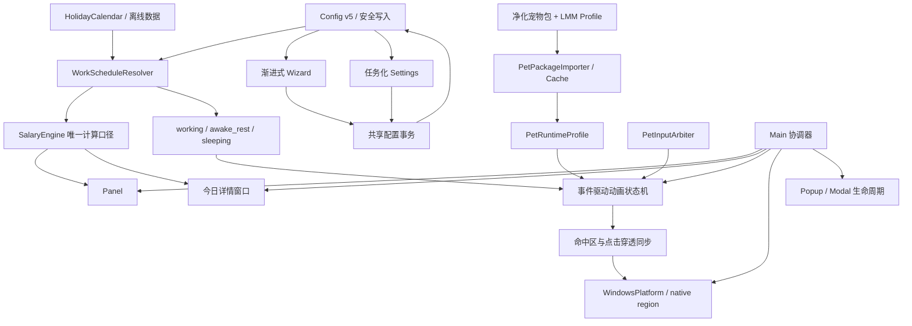

# LetsMakeMoney Windows v0.9 Beta 开发计划

## 1. 文档信息

| 项目 | 内容 |
|---|---|
| 目标版本 | Windows v0.9 Beta |
| 当前阶段 | 开发承接，尚未开始业务实现 |
| 上游需求 | `doc/releases/v0.9/prd.md` |
| 上游候选池 | `doc/releases/v0.9/idea-pool.md` |
| 高保真原型 | `doc/prototypes/index.html` |
| 原型规范 | `doc/prototypes/prototype-spec.md` |
| 进度看板 | `doc/releases/v0.9/progress_v0.9.md` |
| 开发日志 | `doc/logs/dev_log_v0.9.md` |
| 稳定回退基线 | Windows v0.8 Beta |
| 当前开发基线 | `main` / `c4290823f888a9f6092b125c41d88bb731576772`，实施前需重新记录 |

本计划只承接已经确认的 v0.9 推荐方案，不新增主题系统、宠物市场、在线宠物下载、跨平台重构、Pixel Pro 用户入口或一次性 `pet_id` 特判。

## 2. 实施原则

1. **业务口径先行**：计薪、作息、节假日和基础状态必须先成为唯一事实源，UI 与动画只消费结果。
2. **行为测试先于重构**：Main、native、托盘、点击穿透、拖拽和纯桌宠模式先冻结 v0.8 行为矩阵。
3. **包合同先于默认替换**：Classic Pro 与多多只能通过同一个导入器进入运行时；不得把 PetManager 的 QA、生成记录或本机路径整体复制进仓库。
4. **Spike 先于高风险实现**：包缓存、动态轮廓、指针跟随未通过门禁时按 PRD 降级，不伪造完成。
5. **事件驱动动画**：移除固定 `1.55` 秒恢复依赖，以动画完成、业务状态变化、显式中断和超时保护驱动状态。
6. **现有用户不被强制迁移**：旧用户保留所选宠物；Classic 默认切换只作用于新配置，并提供一键回滚。
7. **Progress 不记流水账**：任务状态写进 progress，调查过程与技术决策写进 dev log，缺陷修复写进独立 bugfix log。

## 3. 追踪关系

### 3.1 IDEA、FR 与里程碑

| IDEA | FR | 需求 | 主要里程碑 |
|---|---|---|---|
| V09-IDEA-001 | FR-001 | 统一计薪与作息语义 | M1 |
| V09-IDEA-002 | FR-002 | 离线节假日与调休日历 | M1 |
| V09-IDEA-003 | FR-003 | 渐进式首次引导 | M2 |
| V09-IDEA-004 | FR-004 | Settings 任务化重组与共享配置事务 | M2 |
| V09-IDEA-005 | FR-005 | 独立轻量今日详情窗口 | M3 |
| V09-IDEA-006 | FR-006 | Panel 多层信息与日常入口 | M3 |
| V09-IDEA-007 | FR-007 | 全界面视觉、DPI 与组件合同 | M2、M3 |
| V09-IDEA-008 | FR-008 | Windows 桌宠行为回归合同 | M0、M3、M7 |
| V09-IDEA-009 | FR-009 | 菜单、托盘与模态交互统一 | M3、M7 |
| V09-IDEA-010 | FR-010 | Classic Pro 影子接入与默认候选 | M6 |
| V09-IDEA-011 | FR-011 | 通用宠物包导入与 Profile | M4 |
| V09-IDEA-012 | FR-012 | 宠物包许可、来源与净化交付 | M4、M6 |
| V09-IDEA-013 | FR-013 | 锚点、尺寸、逐帧时长与回退合同 | M4、M5 |
| V09-IDEA-014 | FR-014 | 事件驱动动画状态机 | M5 |
| V09-IDEA-015 | FR-015 | 日夜节律与动作语义 Profile | M1、M5 |
| V09-IDEA-016 | FR-016 | 状态感知交互动作与输入仲裁 | M5 |
| V09-IDEA-017 | FR-017 | 指针跟随与环境动作编排 | M4、M5，受 SPIKE-003 门禁 |
| V09-IDEA-018 | FR-018 | 动态命中区与点击穿透同步 | M4、M5，受 SPIKE-002 门禁 |
| V09-IDEA-019 | FR-019 | 多多正式可选与多宠物回退 | M6 |

### 3.2 Review 发现承接

| 证据 | 承接方式 |
|---|---|
| Windows/iOS 计算口径和午休逻辑不一致 | M1 建立共享测试向量与唯一计算服务 |
| Wizard 与 Settings 信息顺序和输入方式割裂 | M2 共用配置草稿、控件合同与事务控制器 |
| Panel、Settings、Wizard 和菜单视觉粗糙且 DPI 风险高 | M2/M3 建立暖色 Windows 组件合同与截图门禁 |
| `pet.gd` 与 `main.gd` 固定 `1.55` 秒恢复 | M0 先锁行为，M5 由动画完成事件替换 |
| PetManager 包包含生产 QA、来源记录和当前合同差异 | M4 定义净化运行时包和 LMM Profile |
| Classic/多多缺少统一锚点、逻辑尺寸和命中策略 | M4/M5 建立几何合同与自动验证 |
| 点击、双击、长按、拖拽和透明命中相互耦合 | M5 独立输入仲裁器和命中区服务 |

## 4. 目标架构



### 4.1 所有权边界

| 模块 | 单一职责 | 禁止承担 |
|---|---|---|
| `salary_engine.gd` | 金额、日薪、时薪、进度计算 | 窗口、动画、控件格式化 |
| 新的作息解析服务 | 日期、班次、午休、夜班和状态优先级 | 金额渲染、宠物动画名选择 |
| `config.gd` | 版本迁移、安全写入、恢复 | UI 草稿、宠物缓存 |
| Settings/Wizard 共享事务 | 草稿、校验、保存/取消/失败恢复 | 原生窗口策略 |
| 宠物包导入器 | schema、哈希、许可、净化包、缓存 | 交互分类、业务状态 |
| 动画状态机 | 基础状态、动作中断、恢复、超时 | 原始鼠标阈值判断 |
| 输入仲裁器 | single/double/hold/drag 分类 | 播放具体动画 |
| 命中区服务 | 动作轮廓、缓存、降级矩形 | 菜单/模态所有权 |
| Main | 协调窗口、信号和服务生命周期 | 重复业务计算和动画计时 |

## 5. 里程碑与实施任务

## V09-M0 基线冻结与测试骨架

**目标**：在改动计算、UI、Main/native 和动画前，建立 v0.8 可回归事实。

**影响文件**：

- 读取：`src/scenes/main/main.gd`、`src/scenes/pet/pet.gd`、`src/autoload/pet_manager.gd`、`src/platform/windows_platform.gd`、`native/windows/**`。
- 新增：`scripts/verify_v09.ps1`、`scripts/fixtures/v09/**`、必要的 Godot 验证脚本。
- 文档：`doc/releases/v0.9/verification.md`、`manual-verification.md` 的空白验收骨架。

**最小任务**：

1. 记录实施起点分支、HEAD、工作区和 v0.8 发布包哈希。
2. 建立普通/纯桌宠、显示/隐藏、托盘、任务栏、Popup、Settings、Wizard、native 可用/不可用状态矩阵。
3. 为固定 `1.55` 秒、动画名回退和现有点击分类建立 characterization tests，不先改变行为。
4. 为 Panel、Settings、Wizard、右键菜单在 100%/125%/150% DPI 建立截图基线清单。
5. 把 v0.8 的 M4/M5、托盘、配置、计薪和包验证接入统一 v0.9 入口。
6. 建立测试隔离目录，备份并恢复 `%APPDATA%\LetsMakeMoney` 配置和日志。

**门禁**：M0 自动化和行为矩阵未落盘，不得开始 Main/native、输入或动画重构。

**回退**：本里程碑只增加测试与文档；失败时不触碰运行时。

## V09-M1 计薪、作息、日历与基础状态

**目标**：建立 Windows/iOS 可对照的唯一业务计算口径和业务状态解析器。

**主要影响文件**：

- `src/autoload/salary_engine.gd`
- `src/autoload/config.gd`
- `src/utils/salary_schedule_calculator.gd`
- 新增 `src/utils/work_schedule_resolver.gd`
- 新增 `src/utils/holiday_calendar.gd`
- 新增版本化离线日历数据目录，例如 `assets/calendar/cn/`
- `scripts/verify_v08_salary_schedule.gd` 及 v0.9 新向量测试

**实施顺序**：

1. 将 iOS 已确认的单双休、大小周、午休、8 小时工作制规则转为平台无关测试向量。
2. 定义夜班跨日归属、月边界、闰年、时区变化和系统时间跳变规则。
3. 实现离线节假日/调休数据加载、版本校验、缺失年份和损坏降级。
4. 实现 `working`、`awake_rest`、`sleeping`、`setup_required` 解析及旧状态兼容映射。
5. 将日薪、时薪、今日收益和工作进度统一改为消费同一日程快照。
6. 实现配置 v4 到 v5 迁移、原文件备份和失败恢复。
7. 增加 `schedule.state.changed` 与 `calendar.dataset.*` 语义日志。

**测试门禁**：

- 单休、双休、大小周、午休、夜班、节假日、调休、跨月、闰年、0 元和大金额向量通过。
- Windows 与 iOS 对照向量金额误差不超过 0.01 元。
- 23:00/07:30 边界及工作覆盖夜间时状态结果确定。
- 数据损坏不阻塞启动，配置迁移失败不覆盖旧配置。

**回退**：保留 v0.8 计算适配层和配置备份；迁移失败时以旧字段生成兼容快照。

## V09-M2 共享组件、渐进式 Wizard 与任务化 Settings

**目标**：以同一配置草稿和事务控制器重塑配置体验，不维护两套业务逻辑。

**主要影响文件**：

- `src/scenes/wizard/wizard_dialog.gd` 与 `.tscn`
- `src/scenes/settings/settings_dialog.gd` 与 `.tscn`
- `src/ui/warm_control_theme.gd`
- `src/ui/settings_section_builder.gd`
- `src/utils/settings_transaction_controller.gd`
- 新增必要的共享字段组件和布局 helper，但不得建立主题系统

**实施顺序**：

1. 固化全局字体、字号、行高、间距、焦点、错误、禁用和 DPI token。
2. 建立金额、休息制度、时间、午休时长、开关、下拉、按钮的共享控件合同。
3. 将 Wizard 改为金额 -> 休息制度 -> 上班时间 -> 午休时长 -> 自动推算 -> 确认的渐进流程。
4. 将 Settings 改为任务分组，主区域只放可编辑项，说明/诊断降级到底部。
5. 让 Wizard 与 Settings 共用配置草稿、校验、默认值、推算和保存事务。
6. 完成保存成功、无变化、失败、取消、关闭、返回、恢复默认与输入保留。
7. 修正 OptionButton popup、时间选择、SpinBox、Slider、Switch 和反馈的暖色一致性。

**测试门禁**：

- 所有出口都有确定配置和日志结果。
- 保存失败时旧配置不污染、输入保留、反馈至少可见 2.5 秒。
- 100%/125%/150% DPI 无裁切、横排变竖排、黑角、套圈和模糊图标。
- 与原型中的 Wizard/Settings 结构、控件状态和文案一致。

**回退**：共享事务保留旧保存接口适配；新布局可按场景回退，不改变配置存储位置。

## V09-M3 Panel、今日详情与 Windows 窗口体验

**目标**：重塑信息层级，同时保护透明窗口、托盘、右键菜单和纯桌宠行为。

**主要影响文件**：

- `src/scenes/panel/panel.gd` 与 `.tscn`
- 新增 `src/scenes/today/**`
- `src/scenes/main/main.gd`
- `src/utils/context_menu_builder.gd`
- `src/utils/overlay_lifecycle.gd`
- `src/utils/window_policy_coordinator.gd`
- `src/utils/window_runtime_state.gd`
- `src/autoload/drag_resize_system.gd`
- `src/autoload/platform.gd`
- `src/platform/windows_platform.gd`

**实施顺序**：

1. 将 Panel 重组为折叠金额/状态与展开进度/累计/今日安排两层。
2. 新增单实例今日详情窗口，复用 M1 快照并支持位置记忆与显示器安全回落。
3. 统一右键菜单与托盘菜单入口，设置/向导/今日详情不重复或失联。
4. 使用 Overlay 生命周期引用计数保护 Popup、Settings、Wizard 和今日详情打开期间的点击穿透。
5. 保持托盘左键显示/隐藏语义；纯桌宠恢复后无任务栏入口，普通模式有入口。
6. 处理 Panel 在宠物左右边缘的自动翻转、稳定间距和缩放。
7. 用原型和截图基线校准视觉、清晰度、圆角、字体和窗口比例。

**测试门禁**：

- v0.8 状态矩阵全部回归。
- 今日详情单实例、跨 DPI、位置失效和关闭/重开通过。
- Popup/Modal 穿透暂停与恢复成对，无永久失去交互。
- 0 到 9 位整数金额和错误态无溢出。

**回退**：今日详情入口可关闭；Panel 保留 v0.8 布局资源；窗口策略失败时退回普通可交互窗口。

## V09-M4 宠物包合同与三项技术 Spike

**目标**：在正式接入 Classic/多多前，证明通用包、几何、命中区和指针跟随可行。

**主要影响文件**：

- `src/resources/pet_resource.gd`
- 新增 `src/resources/pet_runtime_profile.gd`
- 新增 `src/utils/pet_package_importer.gd`
- 新增 `src/utils/pet_package_validator.gd`
- 新增宠物缓存与命中区服务
- `src/autoload/pet_manager.gd`
- 只消费 PetManager 净化输出，不复制 `qa/`、`provenance/`、工作树或生成中间产物

**SPIKE-001 通用宠物包与缓存**：

- 定义 LMM manifest 主版本、哈希、许可、来源、atlas、逐帧时长、pivot、脚底线、动作偏移和回退字段。
- 转换 Classic 与多多为同一净化运行时结构。
- 验证未知字段、未知主版本、损坏 atlas、缓存失效和旧 `.tres` 回退。
- 门禁：两个包同一导入器通过，且运行时包不含绝对路径、未知二进制和生产 QA。

**SPIKE-002 动态轮廓与 native region**：

- 对比逐帧 alpha region 与动作级 union region。
- 记录 CPU、内存、region 数量、DPI、拖拽和 Panel 邻接结果。
- 门禁：逐帧方案满足预算才启用；否则采用动作级 union，不退回整窗拦截。

**SPIKE-003 指针跟随**：

- 验证 Windows 坐标转换、16 方向、12.5Hz 节流、角度滞回和 250ms 离开恢复。
- 验证与拖拽、Modal、显式动作、sleeping 和命中区同步。
- 门禁：稳定且不引入明显抖动/误触才默认启用；失败则 v0.9 关闭该能力。

**回退**：任何 Spike 失败按 PRD 指定降级；不得阻塞 M1-M3，但不得把失败能力写成已实现。

## V09-M5 动画状态机、日夜节律、输入与点击穿透

**目标**：完成素材播放、业务状态、交互分类和命中区的一体化运行时。

**主要影响文件**：

- `src/scenes/pet/pet.gd`
- `src/autoload/pet_manager.gd`
- 新增 `src/scenes/pet/pet_animation_controller.gd`
- 新增 `src/scenes/pet/pet_input_arbiter.gd`
- 新增 `src/scenes/pet/pet_hit_region_controller.gd`
- `src/scenes/main/main.gd`
- `src/platform/windows_platform.gd` 与 `native/windows/**` 仅在 SPIKE-002 证明必要时调整

**实施顺序**：

1. 将 `working/awake_rest/sleeping` 解析结果接入动画基础状态。
2. 建立 requested -> started -> interrupted/finished/timeout -> resolve base 的事件状态机。
3. 移除 `pet.gd` 和 `main.gd` 对固定 `1.55` 秒返回的行为依赖。
4. 建立动作表：触发、冷却、中断优先级、恢复、旧名回退和超时预算。
5. 将 single/double/hold/drag 分类从播放逻辑中分离，加入确定性时间与距离阈值测试。
6. 实现午休、节假日、下班后和夜间的环境动作池；sleeping 禁用指针跟随。
7. 根据 SPIKE-003 决定是否启用指针跟随，根据 SPIKE-002 决定命中区策略。
8. 将动作轮廓变化通知 Main 刷新点击穿透，避免透明空白变成不可点击区域。
9. 增加去重语义日志和性能摘要，不记录逐帧指针坐标。

**测试门禁**：

- 长短动作完整播放，晚到完成事件不污染新状态。
- 连续 20 轮 single/double/hold/drag 分类正确。
- 状态中途变化、包缺帧、完成信号丢失和损坏动作均能恢复。
- Panel/菜单/Modal/拖拽期间无宠物误触；动态轮廓失败按门禁降级。

**回退**：保留旧资源名映射和 v0.8 `.tres` 路径；新状态机异常时回到最新基础动作，不恢复固定全局延时。

## V09-M6 Classic 默认门禁与多多正式接入

**目标**：通过可回滚门禁决定 Classic 是否成为新安装默认，并让多多作为正式可选宠物。

**主要影响文件**：

- 净化后的运行时宠物包目录
- `src/autoload/pet_manager.gd`
- Settings/Wizard 宠物选择页
- 包许可与资产清单
- Classic 影子对照和多多回退测试脚本

**Classic 阶段**：

1. 影子加载，不进入普通用户选择列表。
2. 对照 v0.8 橘猫完成脚底、逻辑尺寸、动作完整性、流畅度、清晰度、命中区和性能测试。
3. 通过 P0 门禁后进入候选列表；再通过真实桌面连续交互才切换新安装默认。
4. 旧用户 `pet_id=cat_orange_v2` 不自动改写。
5. 任何门禁失败记录原因并保留影子接入或完全回滚。

**多多阶段**：

1. 最小覆盖 `making-money`、清醒基础、`sleeping`、single/double/hold、`waving`、`celebrating`。
2. 缺少专属动作时显示通用映射状态，不静默宣称完整专属动作。
3. 仅在身份错位、动作辨识不足或轮廓异常有证据时触发 PetManager 补生成。
4. 验证选择、重启、升级、包损坏、Classic 同时失败和旧配置回退。

**回退链**：目标包 -> Classic -> v0.8 橘猫 v2 -> 橘猫 v1 -> 占位猫。每级只尝试一次并记录原因。

## V09-M7 全量回归、候选包与真实验收

**目标**：证明 v0.9 在新体验和动画升级后仍保持 Windows 稳定性。

**计划脚本**：

- `scripts/verify_v09.ps1`
- `scripts/package_v09.ps1`
- `scripts/verify_v09_package.ps1`
- 复用 `verify_m4.ps1`、`verify_m5.ps1`、`verify_v08.ps1`、`verify_v08_package.ps1` 及配置/托盘门禁

**自动化范围**：

1. M1 计薪、日历、状态和配置迁移。
2. M2/M3 UI token、最小尺寸、场景实例和窗口状态。
3. M4 包 schema、哈希、许可、缓存和几何。
4. M5 动画、输入、超时、回退和命中区。
5. M6 Classic/多多选择、损坏和多级回退。
6. v0.8 Windows 专属行为全回归。
7. 打包内容、版本身份、许可和敏感信息检查。

**真实桌面验收**：

- Wizard、Settings、Panel、今日详情和菜单全路径。
- Classic 与 v0.8 橘猫并排录屏；Classic/多多切换与重启。
- single/double/hold/drag/右键/Popup/Panel 邻接。
- 普通/纯桌宠托盘显隐与任务栏策略。
- 100%/125%/150% DPI；175%/200% 冒烟。
- 连续运行 2 小时观察环境动作频率和资源稳定性。

**人工补证边界**：真实通知区鼠标、多显示器断开/重连、动画自然度和长时间陪伴噪音。未执行不得写通过。

## V09-ACC 独立验收与发布判断

实施完成不等于可发布。开发结束后进入独立 `/acceptance`：

1. 从新打包 Zip 的独立解压目录启动，不使用 build 旧产物。
2. 记录 Zip、EXE、DLL、分支、HEAD、大小和 SHA256。
3. 备份并恢复用户配置、日志和现有进程状态。
4. 逐项核对 PRD、verification、manual verification 和 release checklist。
5. 任一 v0.8 Windows 专属回归、配置污染、P0 动画/输入错误或包许可失败均阻塞发布。
6. Spike 降级可以发布，但 release notes 必须准确披露未启用能力。

## 6. 配置与数据迁移

### 6.1 配置 v5

新增或规范化字段：

- `calendar_dataset_version`
- `today_window_position`
- `today_window_size`
- `pet_package_id`
- `pet_package_version`
- 强校验 `alternating_anchor_date`
- 强校验 `alternating_anchor_week_type`

内部动画能力、包哈希和命中区缓存放缓存目录，不写进用户配置。存储位置继续使用 `%APPDATA%\LetsMakeMoney`，无数据库影响。

### 6.2 兼容与回退

- 配置迁移使用临时文件、安全替换和原文件备份。
- 旧 `pet_id` 与旧资源名保留兼容映射。
- 新包字段只在新主版本明确兼容时读取；未知主版本拒绝。
- 回退不得覆盖用户原始配置，降级结果需有一次可读提示和语义日志。

## 7. 日志合同

实施阶段统一以下事件：

- `schedule.state.changed`
- `calendar.dataset.loaded/unsupported/invalid`
- `wizard.step.changed/completed/cancelled/failed`
- `settings.saved/unchanged/failed/defaults_restored`
- `today_window.opened/closed/repositioned`
- `pet.package.accepted/rejected/fallback`
- `pet.animation.requested/started/interrupted/finished/timeout/fallback`
- `pet.input.classified`
- `pet.hit_region.updated/degraded/failed`
- `passthrough.pause/resume`
- `classic.shadow.enabled/default_switched/rollback`

日志不写薪资原值、完整本机路径、逐帧指针坐标或素材生成隐私。

## 8. 测试命令规划

开发过程中按模块执行，最终命令以实际脚本为准：

```powershell
powershell -ExecutionPolicy Bypass -File .\scripts\verify_v09.ps1
powershell -ExecutionPolicy Bypass -File .\scripts\verify_v08.ps1
powershell -ExecutionPolicy Bypass -File .\scripts\verify_m4.ps1
powershell -ExecutionPolicy Bypass -File .\scripts\verify_m5.ps1
powershell -ExecutionPolicy Bypass -File .\scripts\verify_v06_config.ps1
powershell -ExecutionPolicy Bypass -File .\scripts\verify_v06_tray.ps1
powershell -ExecutionPolicy Bypass -File .\scripts\package_v09.ps1
powershell -ExecutionPolicy Bypass -File .\scripts\verify_v09_package.ps1
powershell -ExecutionPolicy Bypass -File .\scripts\check_docs_status.ps1
git diff --check
```

不得为了让 headless 通过而删除真实 Windows 验收；headless、日志、Computer Use 和人工证据分别记录。

## 9. 风险与回退总表

| 风险 | 预防门禁 | 回退 |
|---|---|---|
| 计薪口径改变导致收入跳变 | 共享向量、旧配置迁移、对照快照 | 使用兼容计算适配层并保留旧配置 |
| UI 重塑破坏透明/托盘 | M0 状态矩阵先行 | 回退 v0.8 场景/窗口策略 |
| Classic 更精美但交互更差 | 影子对照、输入/命中/性能联合门禁 | 保持 v0.8 默认 |
| PetManager 包污染仓库 | 净化包清单、绝对路径和未知二进制扫描 | 拒绝导入，不复制生产目录 |
| 动画完成信号丢失 | 动作预算超时和 token 校验 | 恢复最新基础状态 |
| 指针跟随抖动或耗电 | SPIKE-003 | 默认关闭指针跟随 |
| 动态 region 性能差 | SPIKE-002 | 动作级 union 安全区 |
| 多多动作不匹配身份 | 通用映射标记和专属补生成条件 | 暂不公开多多或回退 Classic |
| Main/native 调整产生窗口回归 | characterization tests + 分阶段改动 | 恢复 v0.8 window policy 路径 |

## 10. 实施停止点

开发承接完成后，下一阶段从 `V09-M0` 开始。以下情况必须停止并请求项目所有者确认：

1. 计薪规则与已确认 iOS 对照向量无法同时成立。
2. PetManager 素材许可或来源无法证明。
3. 需要按 `pet_id` 写运行时特判才能导入 Classic/多多。
4. 动态轮廓必须大改 native 协议且没有兼容回退。
5. Classic 默认门禁未通过但有人要求直接替换默认。
6. v0.8 托盘、纯桌宠、点击穿透或配置安全回归。

本计划完成时不修改业务代码、不复制宠物素材、不打包、不提交、不推送。
