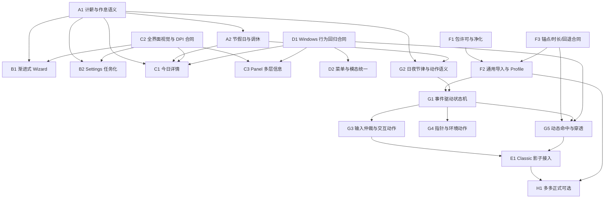

# LetsMakeMoney Windows v0.9 候选需求池

## 追踪信息

- 当前状态：`/idea` 已完成证据合并、压力测试与范围收敛，等待进入 `/prd`
- 目标版本：Windows v0.9 Beta
- 当前稳定基线：Windows v0.8 Beta
- 上游来源：
  - `doc/releases/v0.9/review.md`
  - `doc/releases/v0.9/windows-ios-gap-analysis.md`
  - `doc/releases/v0.9/petmanager-animation-review.md`
  - `doc/releases/v0.9/pet-package-contract-gap.md`
  - `doc/releases/v0.8/pet-animation-next-version-review.md`
- 下游承接：待项目所有者确认后进入 `doc/releases/v0.9/prd.md`
- 当前事实源：上述 Review、Windows v0.8 实现与验收、iOS v0.1 对照实现、PetManager Classic Pro 与多多 Pro 交付
- 最后更新：2026-07-18

## Idea 阶段判断

v0.9 应定位为一次完整的 Windows 体验重塑，而不是一次单纯换皮或替换橘猫素材的版本。当前问题同时存在于计算解释、首次配置、Settings 信息架构、主界面层级、DPI 清晰度、宠物包合同、动画播放、输入仲裁和动态命中区。如果只替换素材，固定恢复时长和命中区问题仍会让新动画显得卡顿；如果只重画 UI，Windows 桌宠的核心差异化仍然粗糙。

本阶段建议采用一个 v0.9 Beta、内部拆分里程碑的组织方式。体验和动画可以分批开发、分批验证，但必须在同一个候选版本中全部通过后再发布。

## 已确认产品决策

1. Windows 主界面新增独立轻量“今日详情”窗口，同时保留 Panel 折叠与展开形态。
2. Windows 日历在 v0.9 支持法定节假日与调休工作日；单日手动覆盖延后。
3. Classic Pro 是默认橘猫升级第一候选，先影子接入和对照验收，通过后才允许替换默认。
4. 多多 Pro 是 v0.9 正式可选宠物，但额外专属动作应在 Classic 效果验证成功后再生成，避免同时扩大素材返工面。
5. Pixel Pro 不进入 v0.9 用户可见范围，也不作为本版验收对象。
6. Classic Pro 与多多 Pro 均为项目所有者使用 AI 自行生成，允许进入公开仓库与 Release；仍需为每个运行时包附带来源、生成说明和受限素材许可。
7. 动画运行时重构是 v0.9 必做主线，不把“替换素材”当作动画升级的充分条件。
8. 运行时兼容完整 Hatch v2/Pro 包，但只启用符合 LMM 场景的动作，不要求每个标准动作都对用户可见。
9. `working` 当前映射 `making-money`。
10. 非工作但清醒时使用“陪伴/放松动作池”，现有 `idle` 行为并入该池；23:00 至次日 07:30 使用纯 `sleeping`，但用户工作时间覆盖该区间时以工作状态优先。
11. 允许使用 16 方向 look 动作实现视线或头部跟随，但具体阈值、降频和关闭条件在 PRD 中定义。
12. `waving` 可用于启动、托盘恢复或窗口重新显示；`celebrating` 用于下班或收入里程碑；普通交互仍需有明显不同的反馈动作。
13. 先为 Classic 完成并验证状态感知交互动作，再决定是否为多多生成对应专属动作。
14. v0.9 视觉重塑覆盖 Panel、今日详情、Settings、Wizard、右键菜单、托盘菜单、宠物选择和反馈状态等所有用户界面。
15. v0.8 已验收的透明窗口、托盘、右键菜单、Panel 邻接、拖拽、点击穿透、纯桌宠、任务栏找回和资源回退行为必须保留。

## 本版本主线

一句话主线：**用统一的工资与日历口径、清晰的桌面信息层级和事件驱动的宠物动画系统，把 Windows 版从“功能可用的桌宠工具”提升为精致、可信、持续陪伴的桌面小挂件。**

本版不是以下方向：

- 不是照抄 iOS 页面或把 Windows 做成移动端窗口。
- 不是主题系统、宠物市场、在线下载系统或插件平台。
- 不是让所有 Codex 动作无条件进入 LMM。
- 不是一次性正式开放 Pixel Pro。
- 不是顺带重写安装器、更新器、多平台或云同步。

## 上游证据摘要

| 来源证据 | 对应候选需求 | 证据状态 | 说明 |
| --- | --- | --- | --- |
| `EXP-001`、`GAP-005` 至 `GAP-007` | V09-IDEA-005、006 | 已确认 | Windows 金额一瞥能力强，但缺今日安排、月度上下文和轻量详情入口 |
| `EXP-002`、`GAP-008` 至 `GAP-010` | V09-IDEA-003、004 | 已确认 | Wizard 字段密集，金额与时间输入暴露内部结构 |
| `EXP-003`、`GAP-004` | V09-IDEA-002 | 已确认 | Windows 缺法定节假日和调休工作日，特殊月份口径落后于 iOS |
| `EXP-004` 至 `EXP-006`、`GAP-012`、`GAP-015` 至 `GAP-018` | V09-IDEA-004、007、008 | 已确认 | Settings 任务层级、固定尺寸和大文件耦合共同抬高视觉优化风险 |
| `EXP-011`、`PET-REV-004`、`RUN-001` | V09-IDEA-014 | 已确认 | 固定 1.55 秒会截断长动作或让短动作空等 |
| `ANIM-001` 至 `ANIM-010` | V09-IDEA-011、012、013、014、018 | 已确认 | PetManager 交付与 LMM 运行时缺导入、语义、锚点、许可和命中合同 |
| `PET-REV-006`、`RUN-002`、`RUN-003` | V09-IDEA-016、017 | 已确认 | 输入、拖拽、播放与视觉效果集中在 Pet 脚本，连续交互风险高 |
| Classic Pro QA 与包哈希 | V09-IDEA-010 | 已确认 | 素材质量门禁已通过，但尚未证明在透明桌面窗口中的真实体验 |
| 多多 Pro QA 与包哈希 | V09-IDEA-019 | 已确认 | 独立宠物身份和大轮廓动作可验证通用合同，但需正式接入与回退 |
| 项目所有者长期手测与 iOS 对照体验 | V09-IDEA-007、008、016 | 已确认 | Windows 被持续评价为比例、清晰度、动画流畅度和质感不足 |

## 候选需求总览

| ID | 标题 | 主线 | 证据状态 | 压力测试 | 成本 | 结论 | 推荐去向 |
| --- | --- | --- | --- | --- | --- | --- | --- |
| V09-IDEA-001 | 统一计薪与作息语义 | A | 已确认 | 36/40 | 中 | 值得继续 | 进入 PRD |
| V09-IDEA-002 | Windows 离线节假日与调休日历 | A | 已确认 | 33/40 | 中 | 值得继续 | 进入 PRD |
| V09-IDEA-003 | 渐进式首次引导 | B | 已确认 | 35/40 | 中 | 值得继续 | 进入 PRD |
| V09-IDEA-004 | Settings 任务化重组与共享配置事务 | B | 已确认 | 34/40 | 大 | 值得继续 | 进入 PRD |
| V09-IDEA-005 | 独立轻量今日详情窗口 | C | 已确认 | 34/40 | 中 | 值得继续 | 进入 PRD |
| V09-IDEA-006 | Panel 多层信息与日常入口 | C | 已确认 | 33/40 | 中 | 值得继续 | 进入 PRD |
| V09-IDEA-007 | 全界面视觉、DPI 与组件合同 | C | 已确认 | 35/40 | 大 | 值得继续 | 进入 PRD |
| V09-IDEA-008 | Windows 桌宠行为回归合同 | D | 已确认 | 36/40 | 中 | 值得继续 | 进入 PRD |
| V09-IDEA-009 | 菜单、托盘与模态交互统一 | D | 已确认 | 32/40 | 中 | 值得继续 | 进入 PRD |
| V09-IDEA-010 | Classic Pro 影子接入与默认候选 | E | 已确认 | 34/40 | 大 | 值得继续 | 进入 PRD |
| V09-IDEA-011 | 通用宠物包导入与 Profile | F | 已确认 | 33/40 | 大 | 值得继续 | 进入 PRD |
| V09-IDEA-012 | 宠物包许可、来源与净化交付 | F | 已确认 | 35/40 | 中 | 值得继续 | 进入 PRD |
| V09-IDEA-013 | 锚点、尺寸、逐帧时长与回退合同 | F | 已确认 | 35/40 | 大 | 值得继续 | 进入 PRD |
| V09-IDEA-014 | 事件驱动动画状态机 | G | 已确认 | 37/40 | 大 | 值得继续 | 进入 PRD |
| V09-IDEA-015 | 日夜节律与 LMM 动作语义 Profile | G | 已确认 | 33/40 | 中 | 值得继续 | 进入 PRD |
| V09-IDEA-016 | 状态感知交互动作与输入仲裁 | G | 已确认 | 36/40 | 大 | 值得继续 | 进入 PRD |
| V09-IDEA-017 | 指针跟随与环境动作编排 | G | 高度可能 | 28/40 | 中 | 小范围验证 | 技术 spike 后进入 PRD |
| V09-IDEA-018 | 动态命中区与点击穿透同步 | G | 已确认 | 34/40 | 大 | 值得继续 | 技术 spike 后进入 PRD |
| V09-IDEA-019 | 多多正式可选与多宠物回退 | H | 已确认 | 32/40 | 大 | 值得继续 | 进入 PRD |

## A. 工资与工作时间计算统一

### V09-IDEA-001 统一计薪与作息语义

| 字段 | 内容 |
| --- | --- |
| 问题 | Windows 与 iOS 的核心公式基本一致，但配置入口、字段解释、大小周表达和午休推算方式不同，容易形成同一产品两套事实。 |
| 证据来源 | `review.md`、`windows-ios-gap-analysis.md`、Windows v0.8 与 iOS v0.1 实现及测试。 |
| 证据状态 | 已确认 |
| 用户价值 | 用户只需理解月薪、休息制度、上班时间和午休时长，系统统一推算下班、有效工时、日薪、时薪、今日收益和进度。 |
| Windows 特色 | 不影响桌宠能力；为 Panel、今日详情和动画工作状态提供统一事实。 |
| 工程影响 | `SalaryEngine`、Config 字段兼容、Wizard、Settings、Panel、今日详情、日志和跨端测试向量。 |
| 依赖 | 无；是 B、C、G 主线的事实基础。 |
| 风险 | 修改口径可能改变已有用户显示结果；旧配置迁移和回退必须明确。 |
| 测试缺口 | 需要 Windows/iOS 共用边界向量、跨月、大小周锚点、午休重叠和夜班用例。 |
| 大致成本 | 中 |
| 压力测试结论 | 36/40，核心路径、高频且证据充分；成本可通过共享纯计算测试控制。 |
| 推荐去向 | 进入 PRD |

### V09-IDEA-002 Windows 离线节假日与调休日历

| 字段 | 内容 |
| --- | --- |
| 问题 | Windows 只按周休制度计算，法定节假日和调休工作日会让月工作日、日薪和今日收益偏离实际。 |
| 证据来源 | `EXP-003`、`GAP-004`、iOS 离线日历能力。 |
| 证据状态 | 已确认 |
| 用户价值 | 特殊月份收入与进度更可信，用户可解释为什么某天工作或休息。 |
| Windows 特色 | 今日详情和宠物状态可直接反映节假日；不改变透明桌宠机制。 |
| 工程影响 | 离线数据文件、数据版本、日历解析、配置兼容、今日详情、日志、包体和更新策略。 |
| 依赖 | V09-IDEA-001、005。 |
| 风险 | 数据过期和口径错误会伤害信任；本版不加入单日手动覆盖。 |
| 测试缺口 | 需要年度数据校验、缺失年份、损坏数据和跨年回退。 |
| 大致成本 | 中 |
| 压力测试结论 | 33/40，价值明确；数据更新责任使成本可控性略低。 |
| 推荐去向 | 进入 PRD |

## B. 首次引导与 Settings 重塑

### V09-IDEA-003 渐进式首次引导

| 字段 | 内容 |
| --- | --- |
| 问题 | Windows Wizard 一次暴露月薪、休息制度和多个时间字段，用户需要理解内部配置结构。 |
| 证据来源 | `EXP-002`、`GAP-008` 至 `GAP-010`、iOS 已验收引导流程。 |
| 证据状态 | 已确认 |
| 用户价值 | 按“收入与休息制度 -> 上班时间 -> 午休时长 -> 推算确认”逐步完成配置，减少输入和错误。 |
| Windows 特色 | 宠物选择保留，但放在基础收入与时间确认之后。 |
| 工程影响 | Wizard 页面、共享金额/时间/休息控件、配置草稿、取消/关闭/失败事务和日志。 |
| 依赖 | V09-IDEA-001、007。 |
| 风险 | 重做流程可能再次触发模态窗口和点击穿透回归。 |
| 测试缺口 | 横竖布局不适用 Windows，但需覆盖 100%-200% DPI、键盘导航、返回和中途退出。 |
| 大致成本 | 中 |
| 压力测试结论 | 35/40，首次路径问题真实，iOS 已提供可验证参照。 |
| 推荐去向 | 进入 PRD |

### V09-IDEA-004 Settings 任务化重组与共享配置事务

| 字段 | 内容 |
| --- | --- |
| 问题 | 工资、桌宠、显示、面板、通用五页签按技术模块并列，且 Wizard/Settings 存在重复控件和配置处理。 |
| 证据来源 | `EXP-004`、`EXP-006`、`GAP-012`、现有 Settings/Wizard 代码规模。 |
| 证据状态 | 已确认 |
| 用户价值 | 高频任务更容易找到；保存、无变化、失败、恢复默认和取消行为一致。 |
| Windows 特色 | 桌宠、窗口和托盘设置仍保留，但按“收入与时间 / 桌宠与桌面 / 维护”组织。 |
| 工程影响 | Settings IA、共享控件、配置草稿/事务、窗口策略补偿、注册表补偿、日志和验证脚本。 |
| 依赖 | V09-IDEA-001、007、008。 |
| 风险 | 大文件和配置副作用耦合，必须先补行为测试再拆分。 |
| 测试缺口 | 保存失败、恢复默认失败、原生能力失败和旧配置迁移组合。 |
| 大致成本 | 大 |
| 压力测试结论 | 34/40，价值高但成本大；必须按模块迁移而非一次推倒。 |
| 推荐去向 | 进入 PRD |

## C. 主界面信息架构与视觉质量

### V09-IDEA-005 独立轻量今日详情窗口

| 字段 | 内容 |
| --- | --- |
| 问题 | 用户能在 Panel 看金额，但难以同时理解工作状态、今日安排、月度上下文和节假日原因。 |
| 证据来源 | `EXP-001`、`GAP-005` 至 `GAP-007`。 |
| 证据状态 | 已确认 |
| 用户价值 | 在不把桌面 Panel 撑大的前提下，获得完整今日收益、状态、进度、上班/午休/下班安排和调整入口。 |
| Windows 特色 | 作为桌面小挂件的按需详情层，不复制 iOS 全屏 Today。 |
| 工程影响 | 新轻量窗口、窗口找回、任务栏策略、点击穿透保护、Panel/菜单入口、数据绑定和日志。 |
| 依赖 | V09-IDEA-001、002、007、008。 |
| 风险 | 新窗口可能重引入任务栏、焦点、DPI 和模态层级问题。 |
| 测试缺口 | 普通/纯桌宠、托盘恢复、多 DPI、多显示器和窗口关闭策略。 |
| 大致成本 | 中 |
| 压力测试结论 | 34/40，解决高频解释缺口；必须保持轻量。 |
| 推荐去向 | 进入 PRD |

### V09-IDEA-006 Panel 多层信息与日常入口

| 字段 | 内容 |
| --- | --- |
| 问题 | 现有 Panel 两档固定尺寸，继续塞入安排和日历会拥挤；不扩展又缺少详情入口。 |
| 证据来源 | `EXP-009`、历史 Panel 手测与截图。 |
| 证据状态 | 已确认 |
| 用户价值 | 折叠态保持一瞥金额，展开态展示关键状态，并能进入今日详情。 |
| Windows 特色 | 保留 Panel 邻接、悬停展开和桌面挂件属性。 |
| 工程影响 | Panel 内容层级、动画、固定尺寸合同、邻接布局、点击穿透和今日详情入口。 |
| 依赖 | V09-IDEA-005、007、008。 |
| 风险 | 过多层级会增加误触或让 Panel 变成后台卡片。 |
| 测试缺口 | 悬停、展开/折叠、拖拽、不同金额宽度、DPI 和 Panel 邻接。 |
| 大致成本 | 中 |
| 压力测试结论 | 33/40，应做，但必须限制内容密度。 |
| 推荐去向 | 进入 PRD |

### V09-IDEA-007 全界面视觉、DPI 与组件合同

| 字段 | 内容 |
| --- | --- |
| 问题 | Windows 各界面虽已暖色化，但字体、比例、间距、控件精细度和 DPI 稳定性仍明显弱于 iOS。 |
| 证据来源 | `EXP-005`、`GAP-015` 至 `GAP-019`、项目所有者持续手测。 |
| 证据状态 | 已确认 |
| 用户价值 | Panel、今日详情、Settings、Wizard、菜单和反馈状态更统一、清晰、有质感。 |
| Windows 特色 | 采用桌面小挂件密度与窗口行为，不复制移动端导航。 |
| 工程影响 | 公共设计 token、Godot Theme/StyleBox、字体、控件状态、响应式约束、截图基线和原型。 |
| 依赖 | 是 B、C、D 用户界面项的共同支撑。 |
| 风险 | 若只追求截图会破坏可读性和原生窗口行为；若引入 Web 前端框架则扩大技术栈。 |
| 测试缺口 | 100%、125%、150%、200% DPI，长文案、失败状态、键盘焦点和高对比度。 |
| 大致成本 | 大 |
| 压力测试结论 | 35/40，用户痛点和版本目标高度一致；范围必须用组件合同控制。 |
| 推荐去向 | 进入 PRD |

设计辅助候选需在 PRD 前审核：

| 候选 Skill | 用途 | 许可/边界 | 建议 |
| --- | --- | --- | --- |
| `ckm:design-system` | token、组件规格、字号/间距/状态体系 | 本地声明 MIT | 推荐作为组件合同辅助 |
| `ckm:ui-styling` | 表单、菜单、弹窗和状态样例 | 本地声明 MIT；示例偏 Web | 仅用于原型和组件参考，不引入 shadcn/Tailwind 到 Godot |
| `impeccable` | 信息层级、认知负担、响应式、文案和视觉审查 | 当前本地元数据未声明许可证 | 可用于只读审查，公开复用前需确认许可 |
| `ui-ux-pro-max` | UI/UX 规则、移动端与 SwiftUI 对照 | 当前本地元数据未声明许可证 | 可用于候选方案评审，不作为运行时依赖 |
| `review-animations` | 动效高标准审查 | 只读审查 | 推荐用于每个里程碑验收 |
| `improve-animations` | 动效问题优先级和执行计划 | 只读规划 | 推荐用于 PRD 后动画实施拆分 |
| `find-animation-opportunities` | 判断哪些界面真的需要动效 | 只读搜索 | 用于防止所有界面过度动画 |

结论：v0.9 仍使用 Godot 原生 `Theme`、`Control` 和现有共享控件。Skill 只参与审查、原型和规格，不增加前端运行时依赖。

## D. Windows 桌宠专属体验

### V09-IDEA-008 Windows 桌宠行为回归合同

| 字段 | 内容 |
| --- | --- |
| 问题 | UI 与动画大改可能破坏 v0.8 已验收的透明窗口、托盘、点击穿透、拖拽、纯桌宠和任务栏策略。 |
| 证据来源 | v0.4-v0.8 验证历史、`EXP-006`、Windows native 实现。 |
| 证据状态 | 已确认 |
| 用户价值 | 体验升级不以找不回窗口、穿透失效或任务栏错误为代价。 |
| Windows 特色 | 本项本身就是 Windows 差异化保护层。 |
| 工程影响 | Main、WindowsPlatform、native DLL、DragResizeSystem、modal guard、日志和真实桌面测试。 |
| 依赖 | 所有新增窗口、菜单和动画项。 |
| 风险 | 状态缓存和原生实际状态不一致；需要 characterization tests。 |
| 测试缺口 | 多显示器、DPI、通知区真实鼠标和原生失败降级。 |
| 大致成本 | 中 |
| 压力测试结论 | 36/40，是发布门禁而非附加功能。 |
| 推荐去向 | 进入 PRD |

### V09-IDEA-009 菜单、托盘与模态交互统一

| 字段 | 内容 |
| --- | --- |
| 问题 | 宠物右键菜单、托盘菜单、Settings/Wizard 和未来今日详情存在入口重复、层级和点击穿透边界。 |
| 证据来源 | Windows 体验 Review、历史 modal/passthrough bugfix。 |
| 证据状态 | 已确认 |
| 用户价值 | 任意入口都能可靠打开、关闭和找回窗口，菜单职责清楚。 |
| Windows 特色 | 保留宠物右键的就近操作和托盘的恢复/退出职责。 |
| 工程影响 | Godot Popup/Modal、原生托盘菜单、菜单信息架构、passthrough guard 和日志。 |
| 依赖 | V09-IDEA-005、007、008。 |
| 风险 | 原生菜单和 Godot 弹层生命周期不同，不能强行共用实现。 |
| 测试缺口 | 菜单层叠、快速重复打开、Esc/关闭、窗口隐藏时入口。 |
| 大致成本 | 中 |
| 压力测试结论 | 32/40，属于一致性和稳定性主线，需控制菜单项数量。 |
| 推荐去向 | 进入 PRD |

## E. 橘猫动画全面升级

### V09-IDEA-010 Classic Pro 影子接入与默认候选

| 字段 | 内容 |
| --- | --- |
| 问题 | 当前橘猫动作帧少、播放不顺且被固定恢复时长影响；Classic Pro 素材尚未在真实桌面运行时验证。 |
| 证据来源 | Classic Pro QA、`petmanager-animation-review.md`、当前动画时长对照。 |
| 证据状态 | 已确认 |
| 用户价值 | 默认形象动作更流畅、更有生命感，同时保持当前橘猫身份。 |
| Windows 特色 | 动画与桌面状态、点击、拖拽、Panel 和托盘恢复结合。 |
| 工程影响 | 运行时包、导入器、动画 Profile、设置宠物候选、回退和截图/桌面验收。 |
| 依赖 | V09-IDEA-011 至 018。 |
| 风险 | 素材 QA 通过不等于桌面体验通过；禁止未经影子对照直接替换默认。 |
| 测试缺口 | DPI、锚点、动态命中、透明窗口、连续输入、性能和主观流畅度对照。 |
| 大致成本 | 大 |
| 压力测试结论 | 34/40，版本差异化强；依赖运行时合同，不能先换资源。 |
| 推荐去向 | 进入 PRD |

## F. 通用宠物包合同

### V09-IDEA-011 通用宠物包导入与 LMM Profile

| 字段 | 内容 |
| --- | --- |
| 问题 | PetManager 输出 JSON/WebP 包，LMM 只消费 `.tres`/PNG/SpriteFrames，且动作语义不同。 |
| 证据来源 | `ANIM-001`、合同差距矩阵。 |
| 证据状态 | 已确认 |
| 用户价值 | Classic 与多多使用同一套可靠导入链，不再为每只宠物手工接线。 |
| Windows 特色 | Profile 将通用动作映射为工作、放松、睡眠、交互和业务事件。 |
| 工程影响 | 导入/转换脚本、schema 校验、缓存产物、运行时资源、错误日志和验证工具。 |
| 依赖 | V09-IDEA-012、013、015。 |
| 风险 | 直接运行时解析可能增加启动和错误面；应评估构建期转换。 |
| 测试缺口 | 同一导入器消费 Classic/多多、未知 schema、缺帧、损坏哈希和旧缓存。 |
| 大致成本 | 大 |
| 压力测试结论 | 33/40，通用性价值高；实现形态需技术 spike。 |
| 推荐去向 | 进入 PRD，并在开发前完成导入方式 spike |

### V09-IDEA-012 宠物包许可、来源与净化交付

| 字段 | 内容 |
| --- | --- |
| 问题 | 完整交付含生产/QA 信息和本机路径，运行时包尚未绑定具体许可与来源说明。 |
| 证据来源 | `ANIM-002`、`ANIM-003`、项目所有者的资产权属确认。 |
| 证据状态 | 已确认 |
| 用户价值 | 用户可安全获取宠物资源，公开仓库不泄露本机路径或混入生产中间物。 |
| Windows 特色 | 无直接影响，但决定宠物能否进入公开 Release。 |
| 工程影响 | 包 manifest、哈希、受限素材许可、来源说明、净化导出和合规检查。 |
| 依赖 | V09-IDEA-011、019。 |
| 风险 | AI 自生成不等于无需记录；引用模型、参考图和生成边界仍需留档。 |
| 测试缺口 | 绝对路径、未知文件、许可证缺失、哈希不匹配和生成中间物扫描。 |
| 大致成本 | 中 |
| 压力测试结论 | 35/40，是公开发布硬门禁。 |
| 推荐去向 | 进入 PRD |

### V09-IDEA-013 锚点、尺寸、逐帧时长与回退合同

| 字段 | 内容 |
| --- | --- |
| 问题 | 包缺脚底基线、逻辑尺寸、中断策略和逐帧交互几何；大动作可能缩放跳变或漂移。 |
| 证据来源 | `ANIM-005` 至 `ANIM-007`、三套包轮廓差异。 |
| 证据状态 | 已确认 |
| 用户价值 | 新动作播放时猫的大小、脚底、位置和节奏稳定，损坏时可回退。 |
| Windows 特色 | 直接关联透明窗口、拖拽和点击穿透。 |
| 工程影响 | manifest 字段、PetResource 扩展、动画播放器、回退链、导入校验和 QA。 |
| 依赖 | V09-IDEA-011、014、018。 |
| 风险 | 合同过度设计；只加入被 Classic/多多真实需要且可验收的字段。 |
| 测试缺口 | 大轮廓动作、不同 DPI、缩放、帧时长与包版本迁移。 |
| 大致成本 | 大 |
| 压力测试结论 | 35/40，是流畅度和稳定位置的必要条件。 |
| 推荐去向 | 进入 PRD |

## G. 动画状态机与输入仲裁

### V09-IDEA-014 事件驱动动画状态机

| 字段 | 内容 |
| --- | --- |
| 问题 | 固定 1.55 秒返回会截断长动作、让短动作空等，连续输入依赖 token 和定时器。 |
| 证据来源 | `PET-REV-004`、`RUN-001`、实际动作时长对照。 |
| 证据状态 | 已确认 |
| 用户价值 | 动作完整、节奏自然、可按规则打断，并准确恢复原基础状态。 |
| Windows 特色 | 与拖拽、右键、Panel、托盘恢复和工作状态共同编排。 |
| 工程影响 | Pet 播放职责、状态机、animation_finished、逐帧时长、超时保险和日志。 |
| 依赖 | V09-IDEA-013、015、016。 |
| 风险 | 对现有 Pet 脚本是深度调整，必须先补 characterization tests。 |
| 测试缺口 | 完整播放、打断优先级、循环动作、资源损坏、超时和高频输入。 |
| 大致成本 | 大 |
| 压力测试结论 | 37/40，是动画重塑的最高优先级问题。 |
| 推荐去向 | 进入 PRD |

### V09-IDEA-015 日夜节律与 LMM 动作语义 Profile

| 字段 | 内容 |
| --- | --- |
| 问题 | 当前 `idle` 出现过少、`resting` 出现过多，非工作时间被过度表现成睡眠；通用动作也缺 LMM 业务语义。 |
| 证据来源 | 项目所有者长期观察、当前状态映射、PetManager 动作合同。 |
| 证据状态 | 已确认 |
| 用户价值 | 猫在工作、午休、下班、夜间和恢复窗口时表现更符合真实陪伴感。 |
| Windows 特色 | 使用用户作息和桌面事件驱动宠物，而不是随机播放素材。 |
| 工程影响 | 基础状态解析、动作 Profile、时间优先级、业务事件、配置兼容和日志。 |
| 依赖 | V09-IDEA-001、002、011、014。 |
| 风险 | 时间段与状态命名容易混乱；PRD 必须区分业务状态和视觉动作池。 |
| 测试缺口 | 夜班覆盖 23:00-07:30、跨日工作、午休、节假日、系统时间跳变。 |
| 大致成本 | 中 |
| 压力测试结论 | 33/40，用户感知强，规则可验证；具体阈值需 PRD 明确。 |
| 推荐去向 | 进入 PRD |

建议 PRD 使用两层模型，不直接删除兼容键：

```text
业务状态
  working               用户有效工作时段
  awake_rest            非工作但清醒，包括午休和日间陪伴
  sleeping              23:00-07:30，且不与用户工作时段冲突

视觉动作池
  working -> making-money
  awake_rest -> idle / waiting / eating / 轻量环境动作
  sleeping -> sleeping
```

运行时可暂时保留 `idle/working/resting` 兼容键，由 Profile 映射到新动作池，避免旧宠物立即失效。

### V09-IDEA-016 状态感知交互动作与输入仲裁

| 字段 | 内容 |
| --- | --- |
| 问题 | 单击、双击、长按和拖拽共享仲裁，现有交互动画在不同基础状态下反馈不够明显且可能误判。 |
| 证据来源 | 历史 v0.4 手测、`RUN-002`、`RUN-003`、项目所有者对当前动画流畅度的反馈。 |
| 证据状态 | 已确认 |
| 用户价值 | 单击、双击、长按动作肉眼可区分，同时保持当前工作/休息语义。 |
| Windows 特色 | 鼠标输入和拖拽是桌宠核心交互。 |
| 工程影响 | Input arbiter、动作中断矩阵、点击阈值、拖拽状态、动画 Profile、日志和截图测试。 |
| 依赖 | V09-IDEA-014、015。 |
| 风险 | 增加动作不等于解决仲裁；先为 Classic 验证，再决定多多专属动作生成。 |
| 测试缺口 | 连续 5 次单击/双击/长按、拖拽距离边界、菜单右键和动作恢复。 |
| 大致成本 | 大 |
| 压力测试结论 | 36/40，核心差异化且历史问题反复出现。 |
| 推荐去向 | 进入 PRD |

### V09-IDEA-017 指针跟随与环境动作编排

| 字段 | 内容 |
| --- | --- |
| 问题 | 16 方向 look 和多个环境动作已有素材，但尚未证明持续跟随会提升陪伴感而不造成抖动、耗电或视觉干扰。 |
| 证据来源 | PetManager 标准动作包、项目所有者确认希望启用。 |
| 证据状态 | 高度可能 |
| 用户价值 | 猫对鼠标和窗口恢复有更自然的回应。 |
| Windows 特色 | 鼠标桌面场景独有，iOS 无直接对照。 |
| 工程影响 | 指针采样、方向量化、滞回阈值、降频、窗口焦点、动作优先级和设置可选项。 |
| 依赖 | V09-IDEA-014、015、018。 |
| 风险 | 高频切帧、方向抖动、穿透几何刷新和注意力干扰。 |
| 测试缺口 | CPU、快速绕圈、边界滞回、全屏应用、拖拽和关闭跟随。 |
| 大致成本 | 中 |
| 压力测试结论 | 28/40，方向有价值但证据弱于核心播放问题；先技术 spike 和原型对照。 |
| 推荐去向 | 技术 spike 后决定是否进入 PRD 必做范围 |

环境动作建议：

- `waving`：应用启动完成、托盘恢复或窗口重新显示后触发，频率受冷却时间限制。
- `celebrating`：下班、达到明确收入里程碑等业务事件触发，不作为普通双击的唯一反馈。
- `eating`：清醒休息动作池中的低频环境动作，不在 sleeping 状态触发。
- 用户交互动作优先级高于环境动作，拖拽、菜单和模态窗口可暂停环境编排。

### V09-IDEA-018 动态命中区与点击穿透同步

| 字段 | 内容 |
| --- | --- |
| 问题 | 新动作轮廓变化明显，当前点击穿透几何不能可靠逐帧同步，可见猫和可点击区域可能错位。 |
| 证据来源 | `ANIM-006`、`RUN-004`、Classic/多多大轮廓动作。 |
| 证据状态 | 已确认 |
| 用户价值 | 跳跃、挥手和庆祝时仍能点到猫，透明区域继续穿透。 |
| Windows 特色 | 是 Windows 透明桌宠运行时的关键能力。 |
| 工程影响 | Alpha 轮廓缓存、关键帧/动作 union、native region、刷新预算、日志和性能测试。 |
| 依赖 | V09-IDEA-013、014、017。 |
| 风险 | 逐帧全量扫描成本高；需在动作 union、关键帧和低频刷新中做 spike。 |
| 测试缺口 | 动作边界点击、Panel 邻接、不同 DPI/缩放、CPU 和 native region 失败降级。 |
| 大致成本 | 大 |
| 压力测试结论 | 34/40，问题真实且阻塞大动作；实现策略必须先 spike。 |
| 推荐去向 | 技术 spike 后进入 PRD |

## H. 多宠物能力边界

### V09-IDEA-019 多多正式可选与多宠物回退

| 字段 | 内容 |
| --- | --- |
| 问题 | 当前宠物选择不具备面向外部包的版本、兼容、损坏降级和身份说明；多多尚未正式进入 LMM。 |
| 证据来源 | 多多 Pro 完整交付、用户确认其作为正式可选宠物。 |
| 证据状态 | 已确认 |
| 用户价值 | 用户可在 Classic 橘猫与多多之间选择，并在资源损坏时安全恢复。 |
| Windows 特色 | 多宠物共享桌面状态和交互，但保留身份差异。 |
| 工程影响 | 宠物选择 UI、配置迁移、包版本、缩略图、许可、回退链和损坏诊断。 |
| 依赖 | V09-IDEA-011 至 016。 |
| 风险 | 同时为多多补全全部专属动作会放大素材返工；先共用语义 Profile 和合法回退。 |
| 测试缺口 | 切换、重启、旧配置、包删除/损坏、Classic 失败、多多专属大轮廓动作。 |
| 大致成本 | 大 |
| 压力测试结论 | 32/40，正式多宠物有价值，但必须依赖通用合同，禁止宠物 ID 特判。 |
| 推荐去向 | 进入 PRD |

明确边界：v0.9 不做宠物市场、在线下载、远程目录、用户自定义包编辑器或主题系统。

## 跨主线依赖图



## 压力测试结果

| 主线 | 痛点 | 场景 | 证据 | 频率 | 目标贡献 | 替代方案 | 成本可控 | 验证速度 | 总分 | 结论 |
| --- | ---: | ---: | ---: | ---: | ---: | ---: | ---: | ---: | ---: | --- |
| A 计算与日历 | 5 | 5 | 5 | 5 | 5 | 4 | 4 | 4 | 37/40 | 通过 |
| B Wizard/Settings | 5 | 5 | 5 | 4 | 5 | 4 | 3 | 4 | 35/40 | 通过，拆里程碑 |
| C 主界面与视觉 | 5 | 5 | 4 | 5 | 5 | 4 | 3 | 4 | 35/40 | 通过，组件合同控范围 |
| D Windows 专属能力 | 5 | 5 | 5 | 5 | 5 | 5 | 3 | 3 | 36/40 | 通过，作为发布门禁 |
| E Classic 升级 | 5 | 5 | 5 | 5 | 5 | 4 | 2 | 3 | 34/40 | 通过，先影子接入 |
| F 宠物包合同 | 4 | 5 | 5 | 4 | 5 | 5 | 2 | 3 | 33/40 | 通过，先导入 spike |
| G 状态机与仲裁 | 5 | 5 | 5 | 5 | 5 | 5 | 2 | 3 | 35/40 | 通过，先补行为测试 |
| H 多宠物 | 4 | 4 | 4 | 3 | 4 | 4 | 2 | 3 | 28/40 | 部分通过，限定 Classic + 多多 |

低分集中在工程成本可控性与真实桌面验证速度。解决方式不是删除主线，而是强制采用“行为基线 -> 技术 spike -> 影子接入 -> 真实桌面对照 -> 默认切换”的顺序。

## 三档版本组合

### 最小方案

包含：

- 统一计薪/午休/大小周口径。
- 渐进式 Wizard 和 Settings 关键输入改良。
- 今日详情最小窗口和 Panel 入口。
- 全界面基础 DPI/字体合同。
- 动画事件完成替换固定 1.55 秒。
- Classic Pro 仅影子接入，不替换默认。
- 不正式开放多多，不做指针跟随和动态命中深度优化。

风险：九成问题能缓解，但新动画仍可能受旧命中/输入架构限制，无法兑现“全面重塑”。不推荐作为已确认 v0.9 目标。

### 推荐方案

包含：

- A-D 全部体验主线。
- 法定节假日与调休，延后单日手动覆盖。
- 全界面视觉、DPI、组件和反馈合同。
- 通用宠物包、许可、锚点、逐帧时长、动作 Profile 和回退合同。
- 事件驱动动画状态机、输入仲裁、日夜节律、动态命中区。
- 指针跟随先 spike，通过性能与观感门禁后纳入。
- Classic Pro 影子接入并作为默认候选。
- 多多作为正式可选宠物；先使用通用动作映射，Classic 验收成功后再决定专属动作补生成。
- 完整保留 v0.8 Windows 专属行为。

风险：范围大，必须拆为多个内部里程碑，任何默认资源切换都晚于行为和合同验收。推荐采用。

### 过大方案

在推荐方案之外同时加入：

- Pixel Pro 正式风格切换。
- 主题系统。
- 宠物市场、在线下载和用户自定义宠物包。
- 跨平台共享运行时。
- 单日手动日历覆盖与云同步。
- 为 Classic、多多一次性生成全部专属动作。

风险：把体验重塑演变成平台、内容和分发系统重构，验证面不可控。v0.9 暂不做。

## 进入 PRD

- V09-IDEA-001 至 016。
- V09-IDEA-019。
- V09-IDEA-017、018 的产品目标和验收门禁进入 PRD，但具体实现方案先通过技术 spike 决定。

## 技术 Spike

1. PetManager JSON/WebP 在构建期转换为 Godot 资源，还是运行时加载。推荐优先构建期转换。
2. 动态命中区采用动作 union、关键帧区域还是低频逐帧刷新。
3. 16 方向指针跟随的采样频率、滞回阈值、CPU 预算和关闭条件。
4. 今日详情窗口与主透明窗口的所有权、任务栏和纯桌宠策略。
5. Settings/Wizard 大文件拆分前的行为测试边界。

## 继续验证

- Classic Pro 与 v0.8 橘猫的真实桌面对照。
- 指针跟随是否提升陪伴感，还是造成视觉干扰。
- 多多在共用语义映射下是否已足够自然，哪些动作必须专门生成。
- 100%-200% DPI 下所有界面的字体、比例、边界与清晰度。
- 动态命中区在大动作与 Panel 邻接时的性能。

## 暂不处理

- Pixel Pro 用户可见入口。
- 主题系统。
- 宠物市场、下载系统、在线目录和插件平台。
- 单日手动日历覆盖。
- 多平台和云同步。
- Classic 与多多之外的更多宠物。

## PRD 必须详细定义的事项

1. 业务状态与视觉动作池的两层模型，尤其是 `awake_rest`、`sleeping` 与旧 `resting/idle` 的兼容关系。
2. 夜间 23:00-07:30、用户夜班、午休、节假日和系统时间变化的优先级。
3. 每个标准/Pro 动作在 LMM 中是否启用、触发事件、冷却、可中断性、恢复目标和回退。
4. 单击、双击、长按在工作、清醒休息和睡眠状态下的明显差异。
5. 所有界面的信息架构、窗口尺寸、DPI、组件状态、动画和截图门禁。
6. 今日详情窗口、Panel、右键菜单和托盘菜单的入口与职责。
7. Classic 影子接入、默认切换和一键回滚门禁。
8. 多多正式可选的最小动作覆盖、共用回退和专属动作补生成条件。
9. v0.8 所有 Windows 专属行为的回归矩阵。
10. Skill 只作为设计审查工具，不构成运行时依赖；对未声明许可的 Skill 只使用输出方法论，不复制受限资产或代码。

## 是否具备进入 v0.9 /prd 的条件

**具备。**

已经确认版本组织、今日详情入口、日历边界、宠物范围、资产权属、动画重构目标、状态节律、动作触发、全界面视觉范围和 v0.8 行为保护。剩余不确定性主要是技术实现选型，已明确分流为开发前 spike，不阻塞完整 PRD 的产品定义。
