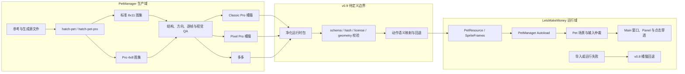

# LetsMakeMoney v0.9 PetManager 动画专项 Review

**评审类型**：项目 + 实现 + 素材交付合同组合 Review

**评审日期**：2026-07-17

**LetsMakeMoney 基线**：`main` / `c4290823f888a9f6092b125c41d88bb731576772`

**PetManager 基线**：`main` / `89ad7630daad67bf9be330ecab8afc3af85960c4`

**多多交付 worktree**：`duoduo-base-image` / `49aaa105c80bb878ac0f95c6ded19e17f84cebea`

## Review 判断

本轮修订后的结论是：**PetManager 不是只包含多多样例，而是已经形成三条有不同产品意义的宠物交付线；其中 Classic Pro 是现有橘猫的直接优化候选，应成为 Windows v0.9 默认形象升级的首要评估对象。**

1. `letsmakemoney-classic-pro-complete` 继承 LetsMakeMoney 橘猫 v2 的身份与平滑渲染语言，并补齐 9 个标准动作、16 个方向和 4 个 Pro 动作，是最接近当前默认橘猫的完整优化版。证据状态：已确认。
2. `letsmakemoney-pixel-pro-complete` 是同一橘猫身份的像素风完整方案，动作与质量证据完整，但视觉方向发生明显变化，不能未经产品确认直接替换默认形象。证据状态：已确认。
3. `duoduo-cat-pro-complete` 是独立宠物身份的完整交付样例，证明生产合同可迁移到不同宠物，但不是本轮唯一或默认接入目标。证据状态：已确认。
4. 三套交付均通过各自的结构校验和视觉 QA，说明 PetManager 的生产链路已经可用；但 LetsMakeMoney 尚无 JSON/WebP 宠物包导入器。证据状态：已确认。
5. PetManager 的标准动作与 Pro 动作不等价于 LetsMakeMoney 的 `idle/working/resting × clicked_single/clicked_double/clicked_hold` 语义矩阵。三套包都需要映射、补制作或回退声明。证据状态：已确认。
6. 三套完整交付都缺少面向 LetsMakeMoney 运行时的锚点、脚底基线、逻辑显示尺寸、逐帧命中区和中断策略。大幅动作会影响透明窗口点击穿透。证据状态：已确认。
7. 三套交付都没有包内专属素材许可文件，并在 QA/来源记录中保留本机绝对路径。生产证据可以留在 PetManager，公开接入 LMM 前必须输出净化运行时包。证据状态：已确认。
8. **已具备进入 v0.9 `/idea` 的条件**，但应以“橘猫 Classic Pro 优先、多宠物合同共用、v0.8 资源可回退”为前提，不应再把多多当作唯一接入对象。

## 两个项目的真实状态

| 对象 | 当前事实 | 证据状态 | 对 v0.9 的意义 |
| --- | --- | --- | --- |
| LetsMakeMoney | `main`，HEAD `c429082...`；v0.8 橘猫仍是运行时默认 | 已确认 | v0.9 的稳定回归基线 |
| PetManager 根仓库 | `main`，HEAD `89ad763...`；无 remote、无 tag | 已确认 | 生产结果可追溯到本地提交，但尚无远端版本身份 |
| Classic Pro 项目 | `projects/letsmakemoney-classic-pro` 含项目索引、workspace、来源映射和 QA | 已确认 | 当前默认橘猫的直接优化候选 |
| Classic Pro 交付 | `examples/letsmakemoney-classic-pro-complete` 和对应 Zip | 已确认 | v0.9 首要影子接入对象 |
| Pixel Pro 交付 | `examples/letsmakemoney-pixel-pro-complete` 和对应 Zip | 已确认 | 像素风备选、未来主题或风格验证样例 |
| 多多项目源文件 | worktree 中包含参考、提示词、生成结果、重试、筛选和 QA | 已确认 | 生产追溯资料，不应整体复制到 LMM |
| 多多完整交付 | worktree 中的完整样例、运行包、验收页和 Zip | 已确认 | 验证多身份兼容与未来更多宠物能力 |
| LMM 回退链 | `cat_orange_v2 → cat_orange_v1 → placeholder` | 已确认 | 新包失败时必须继续可用 |

## 动画生产与运行时地图

## PetManager 资源与导出合同

### 三套已确认交付

| 交付 | 身份与定位 | 标准图集 | Pro 图集 | QA | Zip SHA256 |
| --- | --- | --- | --- | --- | --- |
| Classic Pro | 现有 LMM 橘猫的平滑优化版 | `1536×2288`，8×11，9 动作 + 16 方向 | `1536×832`，4 动作 × 8 帧 | 结构、标准、Pro、跨阶段均通过 | `3CD01A9E3E9F4789313CD96339632F132E366B1325C7D9D46647EFCBFD505737` |
| Pixel Pro | LMM 橘猫的像素风完整方案 | 同上 | 同上 | 结构、标准和独立 Pro 视觉 QA 通过 | `3062547A5BE295596F2E0389D71528C4BE3531DA49430356F0CC7E03B5959647` |
| 多多 Pro | 独立长毛猫身份 | 同上 | 同上 | 结构、标准、Pro、跨阶段均通过 | `6481A4DD329EE669B56EEBBA5A8284BCE244635AF5673AB1B6D419C3BCD52CD9` |

### 标准动作

三套包共享 Hatch Pet v2 的标准动作合同：

- `idle`：6 帧 + 中立补位；
- `running-right`：8 帧；
- `running-left`：8 帧；
- `waving`：4 帧；
- `jumping`：5 帧；
- `failed`：8 帧；
- `waiting`：6 帧；
- `running`：6 帧；
- `review`：6 帧；
- 16 个顺时针视线方向，分布在图集最后两行。

### Pro 扩展动作

| 动作 | 帧数 | 单帧时长 | 循环 | 当前语义 |
| --- | ---: | --- | --- | --- |
| `sleeping` | 8 | `240×7 + 420ms` | 是 | 睡眠与休息循环 |
| `eating` | 8 | `140×7 + 260ms` | 是 | 持有食物并进食 |
| `celebrating` | 8 | `120×7 + 240ms` | 是 | 成功或庆祝反馈 |
| `making-money` | 8 | `140×7 + 260ms` | 是 | 展示或产出金币 |

### Classic Pro 来源关系

`projects/letsmakemoney-classic-pro/workspace/reference-map.json` 明确记录：

- 身份、脸部、比例和非像素渲染参考来自原 LetsMakeMoney v2；
- 动作结构和运动参考来自 Pixel Pro；
- 冲突时“运动参考 Pixel，身份与渲染参考原 LMM v2”。

因此 Classic Pro 不是普通示例，而是现有橘猫优化工作的正式候选交付。

### 合同尚缺内容

- 面向 LMM 的 schema 名称和兼容版本；
- 运行时显示尺寸和统一缩放基准；
- 宠物锚点、脚底基线和每动作偏移；
- 逐帧可见边界或命中区策略；
- 动作优先级、可中断点、循环退出和恢复状态；
- LMM 基础状态与交互语义的显式映射；
- 包内素材许可、作者、生成来源和再分发范围；
- 不含本机路径、生产 workspace、Skill 和 QA 私有证据的净化规则。

## LetsMakeMoney 动画运行时

### 当前消费模型

- `PetResource` 持有 `SpriteFrames`、宠物 ID、名称、缩略图和动画 FPS。
- `.tres` 直接引用逐帧 PNG；当前橘猫 v2 单帧为 256×256。
- 当前默认 `cat_orange_v2`，加载失败回退到 v1，再回退到占位猫。
- 基础状态为 `idle`、`working`、`resting`。
- 单击、双击优先解析为基础状态延伸动作；长按仍共用 `clicked_hold`。

### 当前播放与恢复

- 单击/双击由 `Main.CLICK_FEEDBACK_RETURN_DELAY = 1.55` 秒定时恢复。
- 未以真实逐帧时长或 `animation_finished` 作为主要完成信号。
- 当前橘猫已经存在实际时长不一致：`idle_clicked_single` 约 1.70 秒，`idle_clicked_double` 约 2.09 秒，较短动作则会空等。
- PetManager 包提供逐帧时长，运行时目前无法消费。

### 命中区与点击穿透

- 当前命中区由当前纹理 Alpha 扫描得到，并在运行期缓存。
- 动画换帧后没有逐帧刷新命中几何。
- Classic Pro 的跳跃、庆祝、跑动和金币动作均有明显外轮廓变化；Pixel Pro 和多多同样存在。
- 若不调整策略，会出现可见部分点不到，或透明区域阻挡桌面的风险。

## 动作语义矩阵

### v0.9 产品目标

| 基础状态 | 基础循环 | 单击延伸 | 双击延伸 | 长按延伸 |
| --- | --- | --- | --- | --- |
| idle | `idle` | `idle_clicked_single` | `idle_clicked_double` | `idle_clicked_hold` |
| working | `working` | `working_clicked_single` | `working_clicked_double` | `working_clicked_hold` |
| resting | `resting` | `resting_clicked_single` | `resting_clicked_double` | `resting_clicked_hold` |

### 三套交付覆盖情况

| 能力 | LMM v0.8 | Classic Pro | Pixel Pro | 多多 Pro | 结论 |
| --- | --- | --- | --- | --- | --- |
| idle 基础状态 | 有 | 有直接候选 | 有直接候选 | 有直接候选 | 可映射 |
| working 基础状态 | 有 | `running/review/making-money` 仅为候选 | 同左 | 同左 | 需产品语义映射或补制作 |
| resting 基础状态 | 有 | `sleeping/waiting/failed` 仅为候选 | 同左 | 同左 | 需映射或补制作 |
| 单击延伸 | 3 状态均有 | 无 1:1 动作 | 无 1:1 动作 | 无 1:1 动作 | 必须补制作或显式回退 |
| 双击延伸 | 3 状态均有 | `celebrating/waving/jumping` 仅为候选 | 同左 | 同左 | 不能靠猜测映射 |
| 长按延伸 | 共用 1 组 | 无 | 无 | 无 | 目标矩阵缺失 |
| 收益事件 | 无独立运行语义 | `making-money` | `making-money` | `making-money` | 可成为新增事件候选，非点击替代 |

### 回退顺序候选

1. `base_state + interaction` 精确动作；
2. 当前宠物的同交互通用动作；
3. 当前宠物的基础状态循环；
4. 当前宠物 `idle`；
5. v0.8 默认橘猫对应动作；
6. 占位猫。

该顺序仅供 `/idea` 压力测试，尚未成为需求。

## 资源合同差距

| ID | 发现 | 证据状态 | 严重度 | 用户影响 | 建议去向 |
| --- | --- | --- | --- | --- | --- |
| ANIM-001 | LMM 无 JSON/WebP 宠物包导入器 | 已确认 | Blocker | 三套包都不能直接运行 | `/idea` → 技术 spike |
| ANIM-002 | 三套交付均无包内素材许可文件 | 已确认 | Blocker | 不能直接进入公开仓库或 Release | 资产治理 |
| ANIM-003 | QA/来源记录保留本机绝对路径 | 已确认 | Major | 公开泄露路径，换机后引用失效 | 净化导出合同 |
| ANIM-004 | 动作语义与 LMM 基础状态矩阵不一致 | 已确认 | Major | 错动作会破坏工作/休息语义 | `/idea` 产品映射 |
| ANIM-005 | 无锚点、脚底基线和逻辑显示尺寸 | 已确认 | Major | 动画抖动、缩放跳变和窗口位移 | 包合同扩展 |
| ANIM-006 | 无逐帧命中区或动态穿透策略 | 已确认 | Major | 桌面交互区域与可见动画不一致 | 运行时 spike |
| ANIM-007 | LMM 固定 1.55 秒恢复 | 已确认 | Major | 动作截断或空等 | 动画状态机改造 |
| ANIM-008 | Pixel Pro 是视觉风格变更，不是无感升级 | 已确认 | Minor | 直接替换会改变品牌观感 | 产品决策 |
| ANIM-009 | PetManager 无 remote/tag | 已确认 | Minor | 版本回溯和协作成本高 | 工程治理 |
| ANIM-010 | 三套交付共享合同但未声明 LMM profile | 已确认 | Major | 容易为每只宠物写一次性适配 | 通用 profile 合同 |

## 运行时与输入仲裁问题

| ID | 现象 | 证据状态 | 严重度 | 建议 |
| --- | --- | --- | --- | --- |
| RUN-001 | 固定延时覆盖真实动画时长 | 已确认 | Major | 以动作完成事件为主，超时只做保险 |
| RUN-002 | 连续输入依赖 token 与定时器，而非显式队列/优先级 | 已确认 | Major | 定义可中断矩阵和恢复目标 |
| RUN-003 | 拖拽、单击、双击、长按共享输入仲裁 | 已确认 | Major | 补 characterization tests 后改造 |
| RUN-004 | 点击穿透几何不随大幅动作逐帧更新 | 已确认 | Major | 评估按动作 union、按关键帧或低频刷新 |
| RUN-005 | 菜单、Panel 与动画的暂停/继续规则未形成合同 | 高度可能 | Minor | 在 spike 中补状态矩阵 |
| RUN-006 | FPS 写入共享 `SpriteFrames` 可能影响多实例 | 高度可能 | Minor | 补多实例与预览复用测试 |

## 素材质量与许可边界

### 素材质量

- Classic Pro：9 个标准动作、16 个方向、4 个 Pro 动作共用同一平滑橘猫身份；自动校验零错误零警告，标准、Pro 和跨阶段视觉 QA 通过。
- Pixel Pro：标准图集与 32 帧 Pro 图集通过独立检查；报告明确检查多肢、异常舌头、漂浮金币、绿色残留和裁切。
- 多多 Pro：独立身份一致，四个 Pro 动作清晰；庆祝和赚钱动作轮廓变化较大，对运行时几何要求更高。
- 视觉 QA 证明“素材本身可审阅”，不等于“适合直接替换当前默认宠物”。

### 许可和公开边界

- 三套样例的生成来源、提示词、筛选与 QA 均可追溯。
- 三套完整交付内部均未发现 `LICENSE`、`NOTICE` 或专属素材许可文件。
- 项目所有者此前已确认 AI 自有素材可公开与再分发，但 PetManager 交付仍需将该确认落实为包内机器可读和人工可读许可。
- 完整生产 workspace、原始参考、失败重试、Skill 和私有 QA 不应复制到 LMM 公共仓库。
- LMM 只应消费净化后的运行时图集、manifest、许可、哈希和必要预览。

## 测试和验收缺口

### 已确认通过

- Hatch Pet Pro 的标准和扩展合同测试已通过既有测试集。
- 三套包 `package/validation.json` 均为 `ok: true`。
- Classic Pro 的标准、Pro、跨阶段视觉 QA 均通过。
- Pixel Pro 的标准视觉 QA、Pro 独立视觉 QA 和 Pro 包校验通过。
- 多多完整交付已有结构、视觉、哈希和离线验收证据。
- LMM 现有资源扫描、默认/回退宠物和基础交互验证已有 v0.8 基线。

### 尚缺证明

- 同一通用导入器可消费 Classic、Pixel 和多多，而不是为单宠物写特例。
- schema、未知字段、版本升级和损坏包的兼容行为。
- 逐帧时长完整播放，循环动作能在安全点退出。
- 状态感知单击、双击、长按矩阵及其回退。
- 连续输入、拖拽、右键菜单与 Panel 邻接区域不误判。
- 100%/125%/150% DPI 下的比例、基线、清晰度和命中几何。
- 大轮廓动作期间点击穿透稳定。
- 导入失败时不污染配置，并继续使用 v0.8 橘猫。
- Classic Pro 与 v0.8 橘猫的真实桌面对照验收。

## 可复用/需转换/需重做/不得接入清单

### 可直接复用

- 三套包的标准图集与 Pro 图集结构校验思路。
- Classic Pro 的身份、比例和非像素渲染方向，作为默认升级候选。
- Pixel Pro 作为替代风格和多风格合同验证样例。
- 多多作为独立宠物身份和未来更多宠物验证样例。
- 逐帧时长、哈希、联系表、GIF 预览与独立视觉 QA 方法。
- LMM v0.8 默认、v1 和占位猫回退链。

### 需要格式转换

- WebP 图集与 JSON → Godot 可消费资源或运行时 AtlasTexture。
- Pro 逐帧时长 → Godot 帧时长倍率或独立时间轴。
- PetManager 动作名 → LMM 明确声明的产品语义。
- PetManager 哈希 → LMM 导入缓存和版本身份。

### 需要补充元数据

- `package_schema`、`lmm_profile_version`、`pet_version`；
- 许可与来源；
- 逻辑尺寸、锚点、脚底基线；
- 逐动作偏移、命中策略和交互区域；
- 动作优先级、循环、可中断点、恢复状态；
- 必需、可选和回退动作映射。

### 需要重新生成或补制作

- `working`、`resting` 与三种交互的精确语义矩阵中缺失的动作；
- 状态感知长按动作；
- 无法通过映射保持产品语义的动作；
- 若 DPI/基线验收失败，需按统一画布重新生成整行动作，不能局部拼帧。

### 不得直接接入

- `projects/**/workspace`、`.worktrees`、原始提示词和失败重试；
- `qa`、`provenance` 中包含本机绝对路径的文件；
- `review.html`、Skill 归档和生产工具源码；
- 未带许可与 runtime manifest 的 Zip；
- 来源或权属不能确认的参考素材。

## v0.9 动画候选主线

1. **Classic Pro 默认候选评估**：先作为非默认实验宠物接入，与 v0.8 橘猫做桌面对照。
2. **通用宠物包合同**：一个合同同时支持 Classic、Pixel、多多，不为单宠物写特例。
3. **净化导出**：PetManager 输出运行所需图集、manifest、许可、哈希和预览，隔离完整生产证据。
4. **动作语义 profile**：显式定义基础状态、交互延伸、事件动作和回退。
5. **事件驱动动画编排**：以动画完成和安全中断点为主，超时仅作保险。
6. **动态几何与穿透**：定义动作 union、关键帧或低频动态刷新策略。
7. **多宠物质量门禁**：Classic 是默认候选，Pixel 是备选风格，多多验证身份可迁移性。
8. **失败回退与版本治理**：导入失败继续使用 v0.8 橘猫，生产提交与消费版本可追溯。

## 需要我确认的问题

1. Classic Pro 是否作为 v0.9 默认橘猫升级的第一候选，先影子接入、通过验收后再替换？
2. Pixel Pro 是否仅作为备选风格/未来主题候选，而不在 v0.9 默认启用？
3. 多多是否进入 v0.9 可选宠物范围，还是只作为多宠物合同测试样例？
4. 三套素材是否统一沿用 LetsMakeMoney 的受限素材许可并允许随公共仓库及 Release 再分发？
5. `working` 是否优先映射为 `making-money`，还是必须制作更符合当前“键盘工作”语义的新动作？
6. Pro 的 `sleeping/eating/celebrating/making-money` 是状态循环、交互反馈还是独立事件？
7. PetManager 完整生产证据是否继续保持在独立项目，仅向 LMM 输出净化运行时包？

## 是否具备进入 v0.9 /idea 的条件

**具备。** 第一阶段体验 Review 和第二阶段动画 Review 已形成可追溯证据。进入 `/idea` 时应满足以下边界：

- 默认升级候选优先讨论 Classic Pro，而非默认以多多替换橘猫；
- Pixel Pro 与多多分别作为备选风格和多身份合同证据；
- 先压力测试通用宠物包合同、动画状态机、输入仲裁和动态命中区；
- 明确三套素材许可与净化导出边界；
- 保留 v0.8 橘猫回退，直到新包通过真实桌面验收；
- 不在 `/idea` 阶段直接复制素材或修改业务代码。
