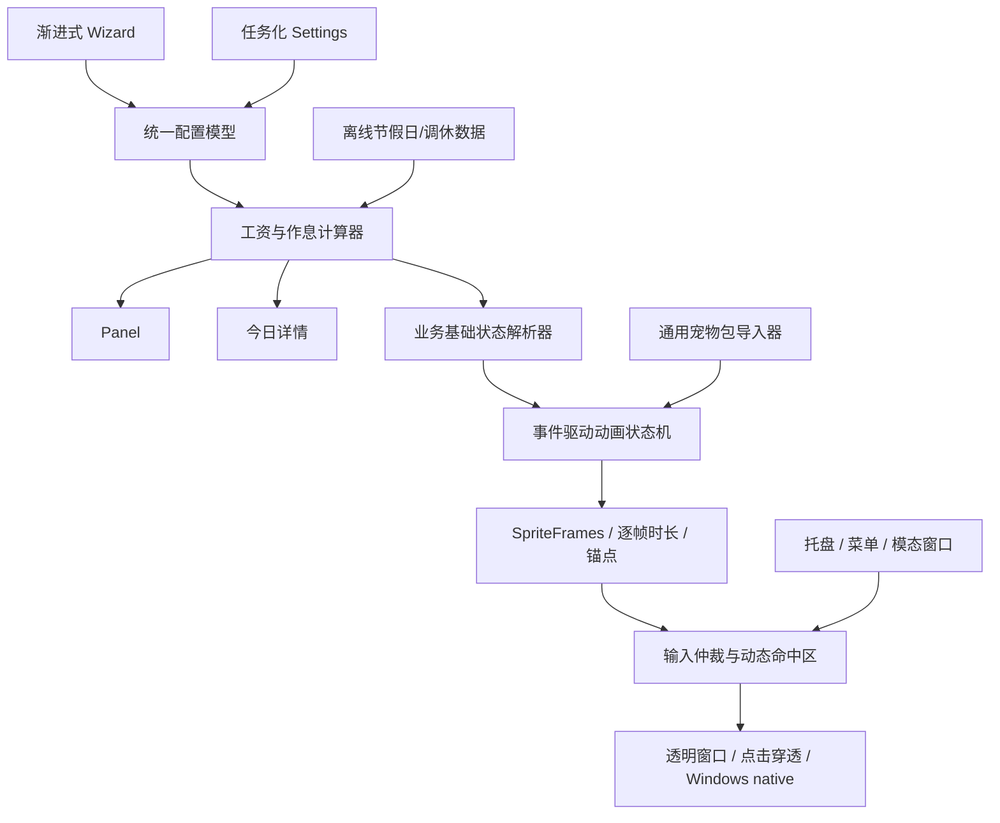

# LetsMakeMoney Windows v0.9 Beta 产品需求文档

## 1. 追踪信息

| 字段 | 内容 |
|---|---|
| 文档类型 | 大型体验重塑 + 动画运行时重构 PRD |
| 目标版本 | Windows v0.9 Beta |
| 当前状态 | 已确认并进入实现；2026-07-22 收敛 Classic 动画范围 |
| 当前稳定基线 | Windows v0.8 Beta |
| 上游需求 | `V09-IDEA-001` 至 `V09-IDEA-019` |
| 上游证据 | `review.md`、`windows-ios-gap-analysis.md`、`petmanager-animation-review.md`、`pet-package-contract-gap.md` |
| 对照产品 | LetsMakeMoney iOS v0.1；只统一业务语义和信息层级，不照搬平台外观 |
| 素材候选 | Classic Pro（保持当前稳定实现与默认候选）、多多 Pro（正式可选并承载 S5.5 motion） |
| 正式验证平台 | Windows 10/11 x86_64，100%/125%/150% DPI |
| 最后更新 | 2026-07-22 |

### 1.1 PRD 成熟度判断

本 PRD 采用需求池的推荐方案，覆盖计算、配置、主界面、Windows 桌宠能力、宠物包合同、动画状态机和输入/命中区治理。产品决策已经足以进入开发承接；指针跟随和动态点击穿透仍须先完成技术 Spike，Spike 只决定实现方式，不改变本 PRD 定义的用户结果。

### 1.2 事实源优先级

1. 本 PRD：v0.9 范围、业务规则、用户链路和验收口径。
2. `idea-pool.md`：候选项证据、压力测试和已确认决策。
3. 两份 v0.9 Review：当前 Windows/iOS 与动画运行时证据。
4. v0.8 verification/release 文档：不得回退的 Windows 行为基线。
5. PetManager 的净化运行时包及其 manifest：素材与动作数据事实源。

### 1.3 2026-07-22 范围收敛

项目所有者确认 Classic 暂不做大规模动画重制。Classic 继续使用已接入的稳定包、现有状态动作和通用回退，保留新配置默认候选及 v0.8 回滚能力；不要求在 v0.9 补齐与多多 S5.5 相同的 motion atlas。多多是 v0.9 首个完整消费 S5.5 motion manifest 的正式可选宠物。

本节优先于后文中“Classic 必须补齐新工作、跑步或事件专属动作”的旧表述。Classic 的验收重点改为不回退、可选择、可持久化、可回滚和缺失新动作时安全降级；多多承担 8 个新动作、逐帧时长和真实观感验收。该收敛不改变通用导入器、状态机、输入仲裁、动态命中区和 Windows 原生体验目标。

## 2. 背景与问题

Windows v0.8 已形成可发布的桌宠产品，但仍存在四类体验断层：

- 工资与作息语义虽基本正确，配置方式、节假日与调休口径仍落后于 iOS。
- Wizard、Settings、Panel、菜单和桌宠窗口虽已统一暖色方向，但信息架构、DPI 清晰度和组件质感仍显粗糙。
- 当前橘猫帧数少、动作不连贯，固定 `1.55` 秒返回使长动作被截断、短动作空等。
- 运行时缺少通用宠物包、逐帧时长、锚点、动态轮廓和可验证的多宠物回退合同。

v0.9 不以“换一套猫图”为目标，而是让计算、信息、视觉、动画、输入和 Windows 原生交互形成同一套可维护的产品系统。

## 3. 目标用户与核心场景

### 3.1 目标用户

- 希望用轻量桌面挂件感知工作时间价值的 Windows 用户。
- 需要托盘、透明窗口、点击穿透和纯桌宠模式，不希望打开大型管理应用的用户。
- 希望通过更自然的宠物动作获得陪伴感，但不希望动画干扰工作的人。

### 3.2 核心场景

1. 首次启动时，用少量问题完成月薪、休息制度、上班时间与午休配置。
2. 工作时通过 Panel 快速查看今日已赚和进度，必要时打开“今日详情”。
3. 在法定节假日、调休、午休、夜班和跨日班次中获得正确状态与金额。
4. 与宠物单击、长按拖动跑步或右键互动，动作完整且不误判；双击不再作为产品交互。
5. 在 Classic 与多多之间切换，资源损坏时自动回退到可用宠物。
6. 使用托盘、纯桌宠、任务栏找回和点击穿透时，不丢失窗口或交互能力。

## 4. 版本目标与成功标准

### 4.1 版本目标

- Windows 与 iOS 对相同配置产生一致的工作日、有效工时、日薪、时薪、今日收益和进度。
- 首次配置按用户问题渐进展开，Settings 按任务组织，不暴露内部字段结构。
- Panel、今日详情、Settings、Wizard、菜单和反馈状态采用统一且清晰的 Windows 桌面挂件设计系统。
- Classic Pro 保持当前稳定实现与新配置默认候选；多多成为正式可选宠物并承载 S5.5 新动画合同。
- 动画由事件驱动状态机控制，按实际逐帧时长完成、打断和恢复。
- 动态命中区与透明窗口点击穿透同步，所有 v0.8 Windows 专属能力不回退。

### 4.2 可量化成功标准

| 指标 | 通过标准 |
|---|---|
| 计算一致性 | Windows/iOS 共用边界向量 100% 一致；金额误差不超过 0.01 元 |
| Wizard 完成率 | 标准路径仅需输入月薪、休息制度、上班时间、午休时长；其余字段自动推算 |
| 动作完整性 | 所有启用动作按 manifest 总时长完整播放；无固定 1.55 秒截断 |
| 输入仲裁 | 连续 20 轮单击/长按拖动/右键无错误分类；长按进入跑步准备，移动后按指针方向跑动，释放后不得补发单击 |
| DPI | 100%/125%/150% 下文字无模糊、裁切、重叠；关键窗口无横向溢出 |
| 资源回退 | Classic、多多任一包缺失/损坏时应用可启动并落到明确回退链 |
| 点击穿透 | 动画帧变化后可交互轮廓在 2 个渲染帧内更新；空白区域保持穿透 |
| 稳定性 | 托盘显隐、纯桌宠、Settings/Wizard/Popup 保护及任务栏策略通过 v0.8 回归矩阵 |

## 5. 范围与非目标

### 5.1 本版范围

- 需求池 A-H 推荐方案全部进入。
- Classic Pro 稳定包、默认选择、兼容回退及一键回滚保护，不进行 S5.5 级大规模动作重制。
- 多多 Pro 正式可选，先满足最小动作覆盖。
- 指针跟随、动态轮廓先 Spike，达到门禁后进入正式实现。

### 5.2 本版不做

- Pixel Pro 用户可见入口、主题系统、宠物市场、在线下载或插件系统。
- Cloud 同步、跨平台运行时重构、iOS/Android/macOS 实现。
- 每日手工覆盖工作/休息属性；v0.9 只支持官方节假日和调休数据。
- 为 Classic 和多多一次性生成所有可能动作。
- 用 Web 前端框架替换 Godot UI；设计 Skill 仅用于评审与原型。
- 数据库。所有配置继续使用本地配置文件和离线日历数据。

## 6. 产品架构与依赖

### 6.1 版本内依赖顺序

1. 先冻结业务配置、日历和状态优先级。
2. 再定义 UI 组件合同、Wizard/Settings/Panel/今日详情。
3. 并行完成宠物包导入、许可与几何合同。
4. 状态机和输入仲裁依赖业务状态与宠物包合同。
5. Classic 影子接入依赖状态机与回退；多多正式可选依赖 Classic 门禁稳定。
6. 指针跟随与动态穿透必须通过 Spike 后接入主链。

## 7. 需求追踪总览

| FR | 标题 | 上游 IDEA | 优先级 |
|---|---|---|---|
| FR-001 | 统一工资与作息计算 | 001 | P0 |
| FR-002 | 离线节假日与调休日历 | 002 | P0 |
| FR-003 | 渐进式 Wizard | 003 | P0 |
| FR-004 | 任务化 Settings 与配置事务 | 004 | P0 |
| FR-005 | 独立今日详情窗口 | 005 | P1 |
| FR-006 | Panel 分层信息架构 | 006 | P0 |
| FR-007 | 全界面视觉、DPI 与组件合同 | 007 | P0 |
| FR-008 | Windows 桌宠行为回归合同 | 008 | P0 |
| FR-009 | 菜单、托盘与模态交互一致性 | 009 | P0 |
| FR-010 | Classic Pro 影子接入与默认门禁 | 010 | P0 |
| FR-011 | 通用宠物包导入与 LMM Profile | 011 | P0 |
| FR-012 | 宠物包许可、来源与净化交付 | 012 | P0 |
| FR-013 | 锚点、尺寸、逐帧时长和回退 | 013 | P0 |
| FR-014 | 事件驱动动画状态机 | 014 | P0 |
| FR-015 | 日夜节律与环境动作 | 015 | P1 |
| FR-016 | 状态感知交互与输入仲裁 | 016 | P0 |
| FR-017 | 指针跟随和环境动作 Spike/实现 | 017 | P1 |
| FR-018 | 动态命中区与点击穿透 Spike/实现 | 018 | P0 |
| FR-019 | 多多正式可选与多宠物回退 | 019 | P1 |

## 8. 统一业务状态模型

### 8.1 基础状态

| 新状态 | 语义 | 旧状态兼容 | 默认动画语义 |
|---|---|---|---|
| `working` | 当前日期为工作日且时间落在有效工作区间 | 旧 `WORKING` | `making-money`；旧包回退 `working` |
| `awake_rest` | 清醒但非有效工作：日间休息、午休、节假日、下班后 | 旧 `IDLE` 与日间 `RESTING` 合并 | 陪伴/放松动作池；旧包优先 `idle`，再 `resting` |
| `sleeping` | 23:00-07:30 且没有用户工作时段覆盖 | 夜间旧 `RESTING` | `sleeping`；旧包回退 `resting` |
| `setup_required` | 月薪或关键作息未配置，仅用于 UI/诊断 | 旧 `IDLE` | 静态等待或 `idle`，不计收益 |

`clicked_single`、`run_prepare`、`running_left/right`、`run_settle`、`waving`、`celebrating` 和方向观察不是基础状态，而是基础状态上的短时动作层。双击不再是产品语义；长按与拖动组成同一跑步交互。动作结束后必须恢复重新解析得到的最新基础状态，而不是恢复过期缓存。

### 8.2 状态优先级

从高到低：

1. **配置不可用**：进入 `setup_required`，金额不增长。
2. **当前日期与时间落在有效工作区间**：进入 `working`，即使时刻处于 23:00-07:30。
3. **当前处于配置的午休区间**：进入 `awake_rest`，金额和进度冻结。
4. **当前日期为法定节假日或周休，且不是调休工作日**：不计工作；23:00-07:30 为 `sleeping`，其余为 `awake_rest`。
5. **非工作时段的 23:00-07:30**：进入 `sleeping`。
6. **其他时间**：进入 `awake_rest`。

### 8.3 跨日与夜班规则

- 当 `work_end_time <= work_start_time` 时视为跨日班次。
- 跨日班次归属“上班开始日”的工作日属性；次日凌晨的工作段继续计入该班次。
- 若班次覆盖 23:00-07:30，工作优先，禁止切换到 `sleeping`。
- 午休可在同一自然日或跨午夜，但必须完整落在该班次跨度内；非法组合阻止保存。
- 系统时间或时区变化后立即重新解析状态，不补造未来收益；向后跳时按当前班次边界重算并记录日志。

## 9. 功能需求

### FR-001 统一工资与作息计算

**目标**：Windows 与 iOS 对相同输入得到同一结果。

**输入与规则**：

- 输入：月薪、休息制度、大小周锚点、上班时间、每日有效工作时长、午休开始与时长、月份、时区。
- 日薪 = 月薪 / 当月解析后的实际工作日数。
- 每日有效工作秒数 = 班次跨度 - 午休时长；默认 8 小时。
- 时薪 = 日薪 / 每日有效工作小时数。
- 今日收益只在有效工作秒内线性增长；午休、休息日和节假日冻结。
- 今日进度 = 已完成有效工作秒 / 每日有效工作秒，范围固定为 0%-100%。
- 本月累计由当月已结束工作日全额收入 + 当日实时收入组成，不包含未来日期。

**入口与出口**：Wizard、Settings、Panel、今日详情和日历均调用同一计算服务；页面不得自行复制公式。非法月薪、零工作日、午休越界或无效班次必须显示可读错误并保留输入。

**配置与迁移**：保留现有字段；新增配置版本 `5`。旧配置缺少午休时使用 12:00-14:00，缺少大小周锚点时要求用户确认，不静默猜测当前大小周。

**日志**：`salary.calculate.success`、`salary.calculate.invalid`、`schedule.resolve.state`、`schedule.time_jump`，不得记录原始月薪。

**影响范围**：`config.gd`、`salary_schedule_calculator.gd`、`salary_engine.gd`、Wizard/Settings/Panel/今日详情；无数据库影响；会影响 config schema、计算测试、日志和历史配置兼容。

**验收**：单双休、大小周、跨月、闰年、午休边界、夜班、0 元、超大金额和时区变化向量全部自动通过；与 iOS 共享结果表误差不超过 0.01 元。

### FR-002 离线节假日与调休日历

**目标**：Windows 识别中国大陆法定节假日和调休工作日。

**流程**：应用内置按年份版本化的离线数据集；解析顺序为调休工作日 > 法定节假日 > 用户休息制度。数据年份缺失时继续按休息制度计算，同时在日历、今日详情和日志中显示“节假日数据未覆盖”，不得假装结果包含官方日历。

**数据合同**：每条记录包含日期、类型、名称、数据版本、来源说明和 SHA256。v0.9 不提供在线更新或单日手工覆盖。

**影响范围**：新增离线日历资源、解析服务和版本检查；影响 salary 计算、日历 UI、诊断摘要、发布包资源与测试；无数据库影响。

**验收**：官方节假日、调休周末、普通周末、大小周冲突、缺失年份和损坏数据均有确定结果；损坏数据回退并记录 `calendar.dataset.invalid`。

### FR-003 渐进式 Wizard

**目标**：用户按问题完成配置，不一次面对所有字段。

**步骤**：

1. 欢迎：说明用途和本地数据边界。
2. 收入与休息：月薪输入默认 `0`，聚焦后清空零值；默认整数输入，支持两位小数；选择单休/双休/大小周不唤起键盘；大小周只询问“本周是大周还是小周”。
3. 上班时间：只显示上班时间；确认后出现午休时长；确认后按 8 小时有效工作推算午休与下班时间，最后展示可调整的完整结果。
4. 宠物：Classic 与多多预览、名称、动作覆盖和许可说明。
5. 确认：只显示中文休息模式、上班/午休/下班、有效工时和宠物。

**交互**：下一步只在当前输入有效时可用；上一步保留草稿；取消/关闭不写入半成品配置；完成使用与 Settings 相同的配置事务，失败时保留页面与输入。

**影响范围**：`wizard_dialog.gd`、共享配置草稿、共享控件、宠物选择、日志和验证；不改变 Windows 托盘/透明窗口策略；无数据库影响。

**验收**：标准路径、大小周、夜班、返回修改、取消、关闭、完成失败及重启持久化全部通过；横竖窗口布局不重叠，但 Windows 正式验收以目标尺寸和 DPI 为准。

### FR-004 任务化 Settings 与配置事务

**目标**：设置按用户任务组织，并与 Wizard 共用字段、推算、校验和保存事务。

**信息架构**：

- 收入与作息：月薪、休息制度、大小周锚点、上班时间、午休时长和推算结果。
- 日历与计算：数据年份、工作日解释和计算摘要。
- 桌宠与互动：宠物、状态动作、指针跟随可用状态（不是复杂主题设置）。
- 显示与 Panel：透明度、缩放、窗口模式、纯桌宠、Panel 内容。
- 通用与维护：托盘、自启、诊断、恢复默认和数据目录。

**出口链路**：保存成功、无变化、失败、取消、关闭、恢复默认均必须明确；保存失败保留输入并回滚配置、宠物运行态与注册表副作用。恢复默认先预览影响，再确认。

**影响范围**：`settings_dialog.gd`、共享控件/主题、配置事务、PetManager、开机启动注册表补偿、诊断日志；无数据库影响。

**验收**：所有任务页在 100%/125%/150% DPI 无裁切；成功、无变化、失败反馈可见至少 2.5 秒；配置不可写测试不污染旧配置。

### FR-005 独立今日详情窗口

**目标**：提供完整解释，不把透明 Panel 撑成后台面板。

**入口**：Panel 展开态“查看今日详情”、桌宠右键菜单、托盘菜单。重复打开时聚焦现有窗口，不创建多个实例。

**内容**：今日已赚、状态、工作进度、本月累计、日薪、时薪、上班/午休/下班时间线、今日工作日解释、节假日/调休说明和“调整今天的基础配置”入口。

**窗口**：普通非透明工具窗口；默认 500x700 逻辑像素，最小 440x600，最大 580x780；金额、今日安排和月度摘要在默认尺寸下必须完整显示且不出现滚动条。窗口记忆位置，但必须安全回落到当前显示器；关闭不退出应用。

**影响范围**：新增 Godot 场景、窗口策略、菜单入口、配置中的窗口位置、salary/calendar 展示与日志；不改变 Panel 的透明点击穿透；无数据库影响。

**验收**：单实例、跨 DPI、关闭/重开、托盘恢复、显示器断开安全回落和数据实时刷新通过。

### FR-006 Panel 分层信息架构

**目标**：折叠态一眼可读，展开态提供必要信息，深层解释进入今日详情。

**结构**：

- 折叠态：金币符号、今日已赚、当前状态。
- 展开态：今日已赚、本月累计、时薪、工作进度、下一时间节点、详情入口。
- 睡眠态降低信息密度但不隐藏找回入口；午休明确显示“午休中，收益暂停”。

**尺寸**：折叠 236x64；展开 304x224；允许在屏幕边缘自动翻转展开方向，尺寸不得因金额位数或状态文字变化跳动。

**影响范围**：`panel.gd`、Panel 场景、salary/calendar 状态、窗口尺寸和点击穿透矩形；无数据库影响。

**验收**：从 0 到 9 位整数金额、负面错误状态、100%-200% 系统缩放均不溢出；Panel 与宠物保持稳定间距。

### FR-007 全界面视觉、DPI 与组件合同

**目标**：达到“小而精致的温暖桌面挂件”质感，并保持 Windows 可读性。

**设计 Token**：纸面白、浅奶油、金币黄、橘猫橙、柔和绿、深咖啡文字、暖棕辅助文字、低透明暖边框。禁止冷蓝 SaaS、大黑玻璃、重阴影和默认 Godot 控件皮肤。

**组件合同**：

| 组件 | 尺寸/状态要求 |
|---|---|
| 正文 | 14-15px；辅助 12-13px；标题 20-24px；禁止视口宽度缩放字号 |
| 按钮 | 高 36-40；normal/hover/pressed/focus/disabled/error 明确 |
| 输入/下拉 | 高 34-38；focus 金币边框；错误不改变布局 |
| Switch | 40x22；无外层输入框套圈 |
| Slider | 6px 轨道、16-18px thumb、固定宽度数值 |
| 菜单项 | 高 32-36；hover/checked/submenu 暖色统一 |
| Scrollbar | 5-6px；透明轨道、低对比暖色 thumb |

**窗口合同**：Settings 720x540；Wizard 760x560；今日详情 500x700；右键菜单宽 220-260；所有尺寸为逻辑像素。系统 DPI 只通过 Godot/Windows 缩放链一次，不允许截图或整窗位图拉伸。

**适用范围**：Panel、今日详情、Settings、Wizard、宠物选择、右键菜单、托盘菜单对照、关于/诊断、反馈和错误态。

**影响范围**：Godot Theme/StyleBox/SystemFont、所有 UI 场景、图标、窗口尺寸、截图基线和 DPI 验证；不引入 Web 运行时依赖；无数据库影响。

**验收**：100%/125%/150% 必测，175%/200% 冒烟；截图像素对照与人工观感同时通过，无文字竖排、黑角、模糊图标、套圈或控件溢出。

### FR-008 Windows 桌宠行为回归合同

**目标**：体验重塑不破坏 v0.8 Windows 专属能力。

**必须保留**：透明无边框、托盘左键显隐、右键菜单、Panel 邻接、拖拽、空白穿透、纯桌宠模式、普通模式任务栏入口、窗口找回、配置安全写入和原生能力降级。

**影响范围**：Main、DragResizeSystem、WindowsPlatform、native DLL、托盘、任务栏、Pet/Panel 窗口和回归脚本；无配置语义变化，除非为今日详情增加窗口位置；无数据库影响。

**验收**：建立普通/纯桌宠 × 显示/隐藏 × Settings/Wizard/Menu × native 可用/不可用状态矩阵；真实 Windows 操作、日志和 Computer Use 证据齐全。

### FR-009 菜单、托盘与模态交互一致性

**目标**：每个入口职责清楚，Popup/Modal 打开期间输入和穿透安全。

**职责**：桌宠右键菜单提供与当前桌宠相关的详情、模式、选择宠物和设置；托盘菜单提供显示/隐藏、今日详情、设置、关于和退出。二者可共享入口，但文字、checked 状态和执行结果必须一致。

**保护**：Godot 右键菜单、二级 Popup、Settings、Wizard、今日详情前台交互期间暂停动态穿透更新并保持可点击；关闭后按引用计数恢复。原生托盘菜单不伪装成 Godot Modal，但执行命令后重应用窗口策略。

**影响范围**：菜单构建、Modal guard、mouse passthrough、Main/native tray 命令和日志；无数据库影响。

**验收**：嵌套 Popup、快速开关 Settings/Wizard、托盘恢复和异常关闭均有成对 `passthrough.pause/resume` 日志，不永久失去交互。

### FR-010 Classic Pro 影子接入与默认门禁

**目标**：Classic Pro 保持当前稳定实现和默认橘猫候选，不因多多 S5.5 接入发生行为回退。

**阶段**：

1. 影子导入：包可解析、缓存和预览，但用户默认仍为 v0.8 橘猫。
2. 对照验证：同一业务状态和交互脚本验证尺寸、锚点、清晰度、CPU、命中区与现有回退行为不回退。
3. 候选启用：仅测试配置可选择 Classic。
4. 默认切换：全部门禁通过后，新安装默认 Classic；已有用户保持原选择，除非主动切换。
5. 一键回滚：删除候选默认标记即可回到 v0.8 橘猫，不迁移或破坏用户配置。

**门禁**：无肢体错误、耳尾缺失、比例跳变；脚底漂移 <=2 逻辑像素；动作完整；透明边缘无明显白边；动态命中稳定；许可与哈希通过。

**影响范围**：PetManager 导入缓存、默认宠物选择、发布包素材、配置迁移、QA/日志和回滚开关；无数据库影响。

**验收**：自动包校验 + 桌面对照截图/录屏 + 连续交互人工验收；任一 P0 失败保持 v0.8 默认。

### FR-011 通用宠物包导入与 LMM Profile

**目标**：同一导入器消费 Classic 和多多，不按 `pet_id` 写特判。

**最小 manifest**：`schema_version`、`pet_id`、`display_name`、`package_version`、`minimum_lmm_version`、atlas 路径与 SHA256、动作清单、逐帧时长、循环、画布/单元格、逻辑显示尺寸、pivot、脚底基线、动作偏移、命中策略、许可与来源文件。

**导入流程**：扫描候选目录 -> 验证 schema/路径/哈希/许可 -> 解析 LMM Profile -> 生成或缓存 SpriteFrames -> 运行时注册。绝对路径、目录穿越、未知 schema、缺失许可和哈希不一致均拒绝。

**影响范围**：新增 package importer、schema、缓存、PetResource 扩展、打包验证和测试；不把 PetManager 源工程、QA、生成中间件或本机路径复制进 LMM；无数据库影响。

**验收**：Classic/多多同一用例通过；未知字段向前兼容，未知主版本拒绝；损坏包不影响应用启动。

### FR-012 宠物包许可、来源与净化交付

**目标**：公开仓库和 Release 中的每个宠物包都可追踪、可再分发且不含私有生产资料。

**要求**：包内包含受限素材许可、生成来源说明、作者/所有者确认、package manifest、文件哈希和允许用途；不包含提示词草稿、筛选截图、ComfyUI 工作区、本机路径、QA 临时报告或个人信息。

**影响范围**：资产 manifest、第三方/素材 notices、公开扫描、打包脚本和 Release 检查；无业务配置和数据库影响。

**验收**：许可扫描、绝对路径扫描、未知二进制扫描和 manifest/包文件双向校验通过；未知权属为发布阻塞。

### FR-013 锚点、尺寸、逐帧时长与回退合同

**目标**：消除跳动、缩放错觉和动作时长失真。

**规则**：每个动作可定义逐帧毫秒时长；逻辑显示尺寸在动作间固定；pivot 与脚底基线为包级默认、动作可小幅覆盖；动作边界变化不改变窗口布局。运行时按 manifest 时长构建播放，不用固定 FPS 近似。

**回退链**：

1. 当前宠物当前状态专属动作。
2. 当前宠物同交互的通用动作。
3. 当前宠物基础状态动作。
4. 当前宠物兼容旧动作名。
5. Classic 可用版本。
6. v0.8 橘猫 v2。
7. 橘猫 v1。
8. 占位猫。

**影响范围**：PetResource、SpriteFrames 生成、PetManager 动作解析、窗口几何、缓存和 fallback 日志；无数据库影响。

**验收**：不同动作切换脚底漂移、逻辑尺寸、每帧停留与回退路径自动验证；回退每级都有明确日志且不循环。

### FR-014 事件驱动动画状态机

**目标**：用动画完成事件和业务状态变化驱动恢复，移除固定 `1.55` 秒逻辑。

**状态层**：业务基础状态、环境动作层、交互动作层、拖拽/Modal 保护层。播放控制器记录 action token；旧动作完成事件不得结束新动作。

**完成与超时**：非循环动作以 manifest 总时长和 `animation_finished` 为准；超时 = 总时长 + `max(500ms, 25%)`，触发后记录异常并恢复最新基础状态。循环基础动作不设置返回计时器。

**中断优先级**：Modal/窗口关闭 > 长按拖动跑步 > 单击 > 业务庆祝 > 挥手 > 环境动作 > 基础状态。高优先级可中断低优先级；同级新输入按冷却与队列规则处理。

**影响范围**：PetManager、Pet scene、动画信号、计时器、日志和测试；不改变工资计算；无数据库影响。

**验收**：长短动作、连续输入、动作中状态切换、超时、资源缺帧和旧事件晚到均可重复通过。

### FR-015 日夜节律与环境动作

**目标**：宠物行为与工作、午休、下班和夜间一致。

**动作语义**：

- `working` -> 使用节奏更积极、动作幅度更明确的玩耍循环；`making-money` 作为低频收入反馈，不再独占整个工作状态。动画不得出现电脑、显示器、键盘、鼠标、办公桌或办公椅，工作语义由业务状态、动作能量和 Panel 信息共同表达，不靠办公道具解释。
- `awake_rest` -> 复用 idle/look/eating 等陪伴动作，并补充梳理、打哈欠等低频动作。
- `sleeping` -> 睡眠循环，并允许耳朵轻动、翻身、梦泡和蜷缩等低幅度变化；不响应指针跟随。
- `waving` -> 当日首次启动，或隐藏达到长时间阈值后的首次恢复；普通短时托盘显隐不重复挥手。
- `celebrating` -> 午休开始使用轻量舒展或翻滚，下班使用完整玩耍庆祝，收入里程碑使用金币反馈；按事件键冷却并按日去重，用户点击不得复用为通用庆祝。

**玩耍优先视觉合同**：运行时继续使用 `working_loop`、`working_ack`、`rest_ack`、`sleep_ack`、`run_prepare`、`run_stop`、`lunch_relief`、`lunch_return`，避免破坏状态机和回退链。`working_loop` 表现主动、有节奏的自娱或追逐；`awake_rest` 使用观察、理毛、伸展、摆尾和低频玩耍；`sleeping` 仅使用呼吸与睡眠微动作。小球、逗猫棒、丝带或金币等轻量玩具默认也不使用，只有无道具动作无法清楚表达时才允许单一小道具，并需单独人工审批。完整修订见 `doc/releases/v0.9/pet-animation-play-first-revision.md`。

**影响范围**：状态解析器、事件总线、PetManager、日期边界缓存与日志；无新增 UI，除非 Debug 状态面板；无数据库影响。

**验收**：23:00/07:30 边界、夜班、午休、节假日、托盘恢复、重复显示、跨日与时间跳变自动/人工组合验证。

### FR-016 状态感知交互与输入仲裁

**目标**：单击按基础状态产生不同反馈；长按与拖动组成连续跑步交互，且释放后不误判为单击。

**分类规则**：按下后记录起点和时间；在长按阈值前释放且未超过移动容差时触发状态感知单击；达到长按阈值后进入 `run_prepare`，随后指针移动直接驱动窗口位置和左右跑动方向；释放进入 `run_settle`，再解析最新基础状态。进入跑步链路后不得补发单击。

**默认参数**：点击移动容差 8 逻辑像素；长按阈值 500ms；方向切换使用水平死区，接近垂直移动时保持最近一次水平朝向；参数进入内部合同，不作为普通设置暴露。

**动作覆盖**：Classic 保留现有 working/awake_rest/sleeping、单击与拖动行为，缺少 S5.5 专属动作时使用通用回退，不要求本版补生成新 atlas。多多必须提供状态感知 single、`run_prepare/run_stop`、`lunch_relief/lunch_return` 和 `working_loop`；sleeping 单击不强制完全唤醒，业务状态不因互动永久改变。

**影响范围**：Pet 输入、动画状态机、drag system、日志、动态命中与回归测试；无配置/数据库影响。

**验收**：每个基础状态的单击动作前后截图和日志可对应；连续 20 轮单击/长按拖动分类正确；向左拖向左跑、向右拖向右跑，释放后停止并恢复最新基础状态；菜单/Panel 区域不误触发宠物动作。

### FR-017 指针跟随与环境动作 Spike/实现

**目标**：在不增加噪音和耗电的前提下，让清醒宠物对附近指针有细腻反馈。

**产品行为**：`awake_rest` 可启用完整 16 方向观察；`working` 只允许低频短暂抬头观察；`sleeping` 禁用。跑步、单击、业务事件、菜单、Panel 交互和 Modal 期间暂停观察。指针距宠物中心 420 逻辑像素内启用，最多 12.5Hz 更新，带角度滞回；离开 250ms 后平滑回基础动作。

**Spike 门禁**：证明方向资源映射、CPU 增量、窗口坐标/DPI 换算和穿透轮廓更新可接受。测试机静止/跟随平均 CPU 增量不超过 2 个百分点，不产生每帧日志。

**影响范围**：Windows 指针坐标、PetManager、动画 profile、动态命中和性能测试；普通设置不新增开关，Debug 可临时禁用；无数据库影响。

**验收**：Spike 通过后才合入正式默认；失败则 v0.9 保留环境动作但不启用指针跟随，不阻塞其他动画重塑。

### FR-018 动态命中区与点击穿透 Spike/实现

**目标**：大轮廓动作、挥手和跳动时可交互区域跟随可见像素，空白仍穿透。

**规则**：导入时为每帧生成压缩 alpha 轮廓或矩形集合；运行时在帧变化后 2 个渲染帧内更新 native region；Modal/拖拽期间冻结或切到安全可交互区域；缓存键包含包哈希、动作、帧和缩放。

**Spike 门禁**：证明轮廓生成时间、内存、native region 数量和 100%-200% DPI 稳定。若复杂轮廓导致抖动或 CPU 超限，降级为动作级 union 区域，不允许整窗永久可点击。

**影响范围**：Pet alpha 轮廓、DragResizeSystem、WindowsPlatform/native DLL、缓存、日志和性能测试；不改变配置语义；无数据库影响。

**验收**：Classic/多多大轮廓动作、Panel 邻接、右键菜单、透明空白和拖拽真实桌面复验通过。

### FR-019 多多正式可选与多宠物回退

**目标**：多多使用通用包合同进入正式宠物选择。

**最小动作覆盖**：工作基础动作、`making-money`、`awake_rest` 合法基础动作、`sleeping`、状态感知 single、通用跑步链路、`waving`、`celebrating`。缺少专属状态动作时按 FR-013 回退，但界面必须显示“通用动作映射”，不能静默伪装为完整专属动作。

**专属补生成条件**：多多 S5.5 真实桌面验收后，存在用户可见的身份错位、动作辨识不足或轮廓异常，并具备明确动作规格、验收帧数和回滚方案。Classic 的进一步动作重制进入后续版本，不阻塞 v0.9。

**配置与切换**：宠物选择保存 package id + version；重启后验证包哈希。多多损坏时回退 Classic，再走 v0.8 链，并提示一次非阻塞恢复消息。

**影响范围**：Pet Settings、Wizard、包导入器、配置迁移、发布包资源、许可与测试；无数据库影响。

**验收**：选择、重启、升级、删除/损坏包、旧配置、Classic 同时失败和动作回退均通过。

## 10. 动作合同总表

| 动作 | 触发 | 冷却 | 可中断性 | 完成后 | 缺失回退 |
|---|---|---|---|---|---|
| 工作基础循环 | `working` 基础状态 | 无 | 可被交互/跑步/Modal 中断 | 继续解析 `working` | `making-money` -> `working` -> `idle` |
| `making-money` | 工作中的低频收入反馈 | >=60s，受收入变化驱动 | 可被交互/跑步/Modal 中断 | 继续解析 `working` | 不播放，保持工作循环 |
| `awake_rest` 动作池 | 清醒非工作 | 单个环境动作 >=60s | 可被所有显式交互中断 | 回到最新清醒基础动作 | `idle` -> `resting` |
| `sleeping` | 夜间且非工作 | 无 | 仅显式交互/工作状态可中断 | 重新解析状态 | `resting` -> `idle` |
| `clicked_single` | 点击容差内释放 | 250ms | 长按跑步/Modal 可中断 | 最新基础状态 | 状态专属 -> 通用 -> 基础 |
| `run_prepare` | 按住 >=500ms | 无 | Modal/窗口关闭可中断 | 指针移动后进入方向跑步 | 直接进入窗口拖动 |
| `running_left/right` | 长按后指针移动 | 无 | Modal/窗口关闭/释放可中断 | 释放进入 `run_settle` | 保持窗口拖动，不播放动画 |
| `run_settle` | 跑步交互释放 | 无 | 新跑步/Modal 可中断 | 最新基础状态 | 立即恢复最新基础状态 |
| `waving` | 当日首次启动/长时间隐藏后恢复 | 每日首次 + 长隐藏阈值 | 显式交互可中断 | 最新基础状态 | 不播放，不替换成点击 |
| `celebrating` | 午休开始/下班/收入里程碑 | 事件级冷却 + 按日去重 | 显式交互可中断，事件不补播 | 最新基础状态 | 记录缺失，不播放 |
| 方向观察 | 指针附近且 Spike 通过 | 80ms 更新节流 | 任意显式动作中断 | 基础动作 | 关闭跟随 |
| 长按拖动 | 长按进入准备后移动指针 | 无 | 最高交互优先级 | 跑步收势后重解析状态 | 无跑步动画也必须可移动窗口 |

## 11. 配置、数据与兼容

### 11.1 配置版本 5

建议新增或规范化：

- `calendar_dataset_version`
- `today_window_position`、`today_window_size`
- `pet_package_id`、`pet_package_version`
- `alternating_anchor_date`、`alternating_anchor_week_type` 的强校验
- 内部动画能力缓存不写入用户配置，放应用缓存目录

不新增普通用户可见的动画速度、指针方向数量或命中区复杂度设置。

### 11.2 迁移

- `pet_id=cat_orange_v2` 的旧用户继续使用该宠物，默认切换只影响新安装。
- 旧 `idle/working/resting` 资源通过兼容映射继续运行。
- 配置迁移失败时保留原文件、加载可用默认值并提供一次提示。
- 安装版和便携版沿用现有 `%APPDATA%\LetsMakeMoney` 用户数据，不在 v0.9 改存储位置。

### 11.3 数据库影响

无数据库影响。节假日、宠物 manifest、配置和日志均为本地文件。

## 12. 日志与诊断事件

必须新增或统一以下语义事件，默认不记录薪资原值、完整路径或指针逐帧坐标：

- `schedule.state.changed from=... to=... reason=...`
- `calendar.dataset.loaded/unsupported/invalid`
- `wizard.step.changed/completed/cancelled/failed`
- `settings.saved/unchanged/failed/defaults_restored`
- `today_window.opened/closed/repositioned`
- `pet.package.accepted/rejected/fallback`
- `pet.animation.requested/started/interrupted/finished/timeout/fallback`
- `pet.input.classified type=single|double|hold|drag`
- `pet.hit_region.updated/degraded/failed`
- `passthrough.pause/resume`
- `classic.shadow.enabled/default_switched/rollback`

高频指针跟随只记录启用、禁用和性能摘要，不记录每次方向变化。

## 13. 失败、降级与回滚

| 故障 | 用户结果 | 日志/回滚 |
|---|---|---|
| 节假日数据缺失 | 按休息制度计算并提示数据未覆盖 | `calendar.dataset.unsupported` |
| 配置保存失败 | 保留输入和旧配置 | 配置事务回滚 |
| Classic 包损坏 | 保持/回到 v0.8 橘猫 | `pet.package.fallback` |
| 多多包损坏 | 回退 Classic，再到旧链 | 一次非阻塞提示 |
| 动作缺失 | 按明确回退链播放 | 记录一次去重警告 |
| 动画完成信号丢失 | 超时恢复最新基础状态 | `pet.animation.timeout` |
| 动态轮廓失败 | 动作级 union 安全区域 | 不得整窗永久拦截点击 |
| native 不可用 | 普通可交互窗口与任务栏找回 | 保留诊断入口 |
| Today 窗口位置失效 | 回落主显示器工作区 | 不覆盖其他窗口配置 |

## 14. 技术 Spike 门禁

### SPIKE-001 通用宠物包与缓存

验证 Classic/多多导入、WebP atlas、逐帧时长、缓存失效、哈希、旧包回退。通过后才能开始默认切换。

### SPIKE-002 动态轮廓与 native region

验证 per-frame alpha、动作级 union 两种方案的 CPU、内存、region 数量、DPI 和拖拽稳定性。未通过则采用 union 降级，不取消 v0.9 的透明空白要求。

### SPIKE-003 指针跟随

验证 Windows 坐标、16 方向、滞回、节流和与点击穿透同步。未通过不阻塞计算/UI/Classic 基础动画，只关闭指针跟随。

## 15. 验收设计

### 15.1 自动化验证

- 计薪、午休、大小周、节假日、夜班和时区向量。
- 配置 v4->v5 迁移、安全写入和损坏恢复。
- 两个宠物包 schema、哈希、许可、绝对路径和缓存。
- 状态优先级、动作中断、完成、超时和回退。
- 输入仲裁的确定性事件序列。
- UI 最小尺寸、文本溢出和 DPI token 静态检查。
- v0.8 M4/M5、托盘、配置和包验证回归。

### 15.2 必须读取日志验证

- 状态切换原因、节假日数据版本。
- Wizard/Settings 所有出口。
- Classic 影子接入、默认切换和回滚。
- 动画 requested/started/interrupted/finished/timeout。
- 输入分类、动态命中降级和穿透暂停/恢复。
- 托盘恢复后的窗口/任务栏策略。

### 15.3 Computer Use 验收

- Wizard 全流程、Settings 所有任务页、Panel 两态、今日详情。
- Classic 与 v0.8 橘猫并排录屏对照。
- Classic/多多切换、重启和损坏回退。
- 状态感知单击、长按拖动跑步、右键菜单和 Popup；确认双击不会触发独立产品动作。
- 普通/纯桌宠托盘显隐与任务栏入口。
- 100%/125%/150% DPI 截图。

### 15.4 人工验收

- 通知区真实鼠标操作无法被 Computer Use 稳定覆盖时。
- 多显示器断开/重连（当前环境具备时）。
- 动画自然度、肢体完整、脚底稳定和清晰度。
- 长时间陪伴噪音：至少连续运行 2 小时，确认挥手、庆祝和环境动作不过度。

### 15.5 通过标准与不通过处理

- P0 自动化、日志、真实桌面路径必须全部通过。
- Spike 失败按本 PRD 指定降级，不得伪造完整实现。
- Classic 默认门禁失败时保留影子接入并回滚 v0.8 默认；不阻塞其他 v0.9 体验项，但 v0.9 不得宣称默认动画升级完成。
- 多多最小覆盖失败时不得作为正式可选宠物。
- 任一 v0.8 Windows 专属行为回归均为发布阻塞。

## 16. 原型要求

现有 `doc/prototypes/index.html` 新增 v0.9 视图，至少覆盖：

1. Panel 折叠/展开、今日详情和日历解释。
2. Wizard 渐进步骤和任务化 Settings。
3. Classic/多多选择、基础状态和交互动作。
4. 状态优先级、动画中断/恢复、动态命中和回退门禁。
5. 成功、无变化、错误、数据缺失、资源降级和 Spike 未通过状态。

原型不复制 PetManager 生产资料，不把 Pixel Pro 或宠物市场伪装成本版能力。

## 17. 风险与控制

| 风险 | 控制 |
|---|---|
| 体验与动画同时改动范围过大 | 单版本、分里程碑和独立回滚；每层有行为门禁 |
| UI 重塑破坏透明/托盘行为 | FR-008 状态矩阵先于视觉替换 |
| 包合同过度设计 | 只纳入 Classic/多多真实需要的字段 |
| 动画更精美但输入更差 | 素材、播放、仲裁、命中区统一验收 |
| 指针跟随耗电或干扰 | Spike、节流、滞回、睡眠禁用和可降级 |
| 多多动作身份不一致 | 先通用映射，满足明确条件才补生成 |
| 节假日数据过期 | 版本提示和按休息制度降级，不静默宣称准确 |

## 18. 开发前门禁

进入开发承接前必须由项目所有者确认：

- 本 PRD 推荐方案与非目标。
- `working/awake_rest/sleeping` 及状态优先级。
- Classic 默认切换门禁和多多最小动作覆盖。
- 今日详情独立窗口及全界面设计合同。
- 三项 Spike 的降级不阻塞边界。
- 更新后的高保真原型方向。

确认前不得生成 `dev_plan_v0.9.md`、`progress_v0.9.md` 或修改业务代码。
