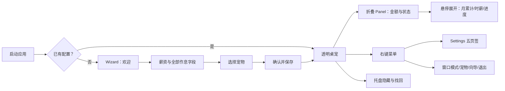
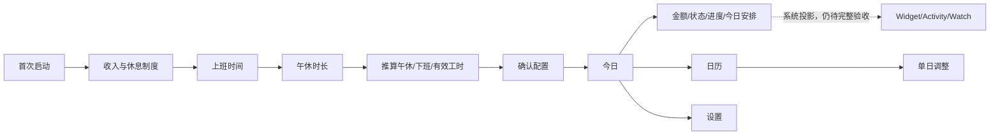
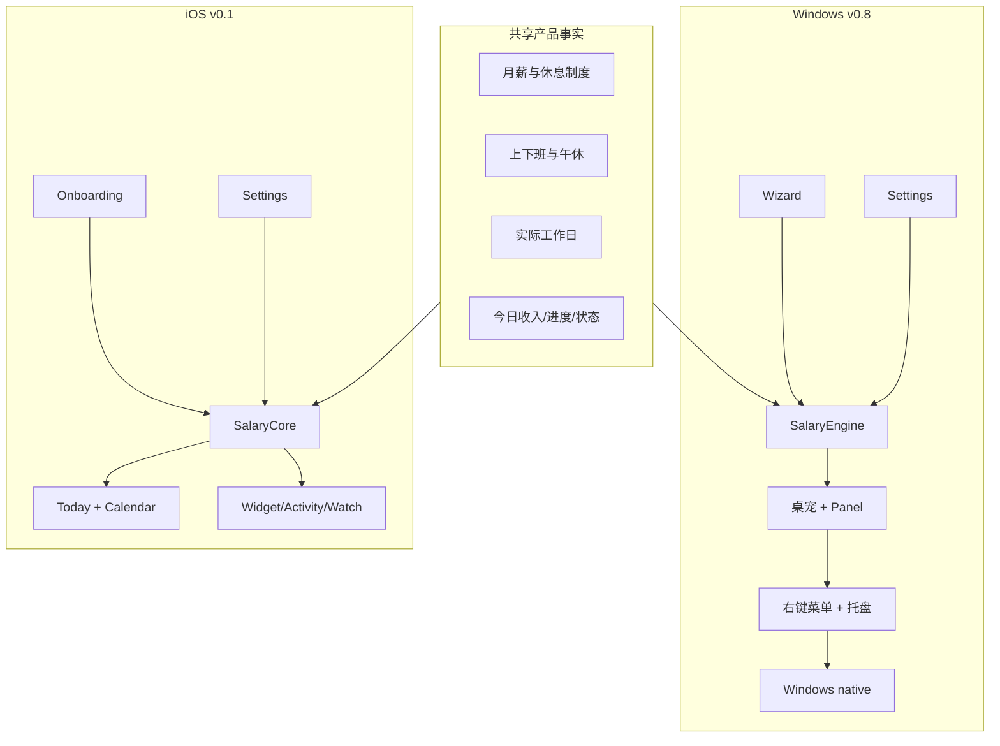

# LetsMakeMoney Windows v0.8 / iOS v0.1 体验对比 Review

**Review 类型**：Project Review + 跨平台体验对比 Review
**Review 日期**：2026-07-17
**阶段状态**：第一阶段 Review 已完成；下一阶段为 PetManager 动画专项 Review
**Windows 基线**：`main` / `c4290823f888a9f6092b125c41d88bb731576772` / `v0.8-beta`
**iOS 基线**：`ios-main` / `aa5e127292cc332ec38c7992a129a505bf8a9a8c` / 未形成 Beta 候选
**详细差距矩阵**：[windows-ios-gap-analysis.md](windows-ios-gap-analysis.md)

## Review 判断

本轮自动识别为“稳定 Windows 产品与未完成 Apple 产品线之间的体验基线 Review”。结论不是“iOS 已经全面优于 Windows”，而是：

1. **Windows v0.8 是当前唯一完成发布闭环的稳定产品基线。** 工资、实际工作日、午休、大小周、Panel、桌宠、托盘、点击穿透和纯桌宠模式已有自动与真实桌面证据。
2. **iOS v0.1 提供了更清楚的日常信息架构与首次配置范式。** 今日、日历、今日安排、渐进式引导和系统原生控件降低了理解成本，适合作为 Windows v0.9 的交互参照。
3. **两端计算内核已在主要规则上对齐，但日历能力没有对齐。** 两端都按实际工作日计薪并扣除午休；iOS 进一步支持法定节假日、调休和单日覆盖，Windows v0.8 明确不包含这些能力。
4. **Windows 的核心体验问题不是单个控件或颜色，而是信息、配置和平台能力被多个窗口与入口切碎。** 桌宠、Panel、右键菜单、Settings、Wizard、托盘分别承担一部分用户任务，缺少一条从“看今天”到“调整今天”再到“维护配置”的稳定主路径。
5. **Windows 不应直接复制 iOS App。** 常驻桌宠、透明窗口、桌面一瞥、右键和托盘找回是 Windows 产品身份；v0.9 应借鉴 iOS 的任务顺序、信息层级和输入约束，把它们重新组织为桌面挂件体验。
6. **可以进入 PetManager 动画专项 Review。** 现有动画问题入口已经足够明确，但必须单独读取 PetManager 项目、交付格式和运行时合同，不能在本轮直接确定替换方案。

**证据状态定义**：`已确认`、`高度可能`、`待确认`、`主观判断`。
**严重度定义**：`Blocker`、`Major`、`Minor`、`Suggestion`。

## 审查范围与证据

### 已读取

- Windows：当前状态、v0.8 PRD/进度/验证/手动验证/发布说明、工资作息专项验证、工程治理、动画候选 Review、主要 Godot 场景与 autoload、窗口策略、菜单、Panel、Pet、Settings、Wizard、验证脚本和 Git 状态。
- iOS：当前状态、PRD/进度、M3-M6 设备验证、原型与说明、SalaryCore、AppRoot、Today、Calendar、Settings、Onboarding、Widget/Activity/Watch 源码、验证脚本和 Git 状态。
- 运行证据：启动 Windows `build/LetsMakeMoney.exe`，确认 native、托盘、透明窗口、任务栏策略与更新检查完成初始化；透明桌宠窗口未被 Computer Use 窗口枚举捕获，因此视觉判断沿用 v0.8 已验收截图与记录。
- 自动验证：Windows `test_v08_salary_schedule.ps1` 通过；iOS `check_ios_m3.ps1` 通过，SalaryCore 86/86 测试通过，同时保留 Apple 平台构建与真机行为待验收警告。

### 未覆盖

- 未修改代码、配置、原型或发布文档。
- 未重新执行 Windows 全量桌面 Acceptance、DPI 截图矩阵或通知区真实点击。
- 未执行 iOS 签名构建、TestFlight、Widget/Live Activity/Watch 最终真机验收。
- 未读取尚未提供路径的 PetManager 项目。

## Windows v0.8 真实基线

### 产品状态

| 项目 | 事实 | 证据状态 |
| --- | --- | --- |
| 发布状态 | v0.8 Beta 已发布，`v0.8-beta` 为稳定基线 | 已确认 |
| 当前分支 | `main` 与 `origin/main` 对齐 | 已确认 |
| 工作区 | 存在未跟踪的 iOS 文档/原型等内容，本轮未触碰 | 已确认 |
| 主要形态 | 透明无边框桌宠 + 可折叠 Panel + 右键菜单 + 托盘 | 已确认 |
| 计薪 | 月薪按当月实际工作日分摊；支持单休、双休、大小周 | 已确认 |
| 作息 | 默认 08:00-18:00、午休 12:00-14:00、有效工作 8 小时 | 已确认 |
| 日历 | 只按周休规则推算，不含法定节假日、调休或单日覆盖 | 已确认 |
| 发布残余 | 多显示器、干净 Windows 用户/VM、签名/SmartScreen、真实登录自启未作为 v0.8 阻塞 | 已确认 |

### 当前用户路径

### 工程形态

- `Settings`、`Wizard` 与 `Main` 合计超过 3200 行 GDScript；布局、视觉、控件构造、事务、窗口策略与业务编排仍有较高耦合。
- Panel 与右键菜单已经使用暖色纸面设计，但其信息仍以固定尺寸行式结构表达。
- 窗口策略已抽出 `WindowPolicyCoordinator`、`OverlayLifecycle` 等治理模块，说明 v0.8 的平台稳定性基础值得保留。
- 运行时仍承担 Windows 原生托盘、任务栏、透明窗口、点击穿透和拖拽等 iOS 不存在的复杂状态。

## iOS v0.1 对照基线

### 产品状态

| 项目 | 事实 | 证据状态 |
| --- | --- | --- |
| 当前阶段 | M0-M3R 完成；M4-M6 部分完成；M7 未开始 | 已确认 |
| 发布状态 | 尚无正式 Beta 候选，受 Mac、签名和 Apple 系统行为门禁阻塞 | 已确认 |
| 今日体验 | 今日已赚、状态、进度、本月累计、今日安排集中呈现 | 已确认 |
| 日历体验 | 月历、法定节假日、调休、手动覆盖及取消链路 | 已确认 |
| 首次引导 | 三步渐进输入，按 8 小时有效工时推算作息 | 已确认 |
| 设备适配 | iPhone/iPad 横竖屏和分屏已有 Playgrounds 真机记录 | 已确认 |
| 系统扩展 | Widget、Live Activity、Watch 源码已实现，但最终系统行为仍待真机门禁 | 已确认 |
| 文档口径 | `status.md` 的检查点 HEAD 落后于实际 `ios-main` HEAD | 已确认 |

### 当前用户路径

### 不能被误读的边界

- iOS 的核心计算与 M3 主界面有较强证据，但完整 Apple 产品链路仍未发布。
- iOS Settings 的时间输入仍使用文本字段，而 Onboarding 已使用原生 DatePicker；iOS 自身也存在组件和输入语义不一致。
- iOS 系统原生字体、尺寸类和控件天然降低了 DPI 与清晰度成本，这不是简单移植颜色即可获得的优势。

## 产品与模块地图

## 关键发现

| ID | 严重度 | 发现 | 证据状态 | 用户影响 | 建议去向 |
| --- | --- | --- | --- | --- | --- |
| EXP-001 | Major | Windows 日常信息分散在桌宠、Panel、Settings 和菜单，缺少“今日”主视图或等价的渐进展开路径 | 已确认 | 用户能看到金额，但难以同时理解状态、今日安排、月度上下文和调整入口 | 进入 `/idea`，先确定 Windows 详情入口形态 |
| EXP-002 | Major | Windows Wizard 一次展示月薪、休息模式及全部时间字段；iOS 按用户问题逐步揭示并自动推算 | 已确认 | 首次配置理解成本高，容易把内部配置结构暴露给用户 | 进入 `/idea`，候选为渐进式 Wizard |
| EXP-003 | Major | Windows 不支持法定节假日、调休和单日覆盖，iOS 已把这些纳入日历与计薪 | 已确认 | 特殊月份的工作日、日薪与今日收益可能不符合中国用户实际安排 | 产品范围待确认；若纳入则进入 `/prd` |
| EXP-004 | Major | Windows Settings 以五个产品/技术页签组织，工资、桌宠、显示、面板、通用并列；用户任务层级不清 | 已确认 | 高频配置与低频系统能力竞争注意力 | 进入 `/idea`，按“收入与时间 / 桌宠与桌面 / 维护”重组候选 |
| EXP-005 | Major | Windows 自绘控件、固定窗口和多层样式承担 DPI/字体/清晰度责任；iOS 依赖系统布局与字体 | 已确认 | 2K、缩放和不同 DPI 下更容易出现比例与清晰度问题 | 进入 `/idea`，建立响应式与 DPI 视觉合同 |
| EXP-006 | Major | Windows Settings/Wizard/Main 代码体量与职责集中，体验调整容易牵动窗口策略和事务 | 已确认 | UI 重塑回归风险高，外观改动可能重新触发历史窗口问题 | 技术治理作为 v0.9 前置，不等同于 UI 重写 |
| EXP-007 | Major | iOS Onboarding 使用原生时间选择器，但 iOS Settings 仍使用文本时间字段；不能将 iOS 视为完全统一范本 | 已确认 | 跨入口编辑同一字段时输入体验不一致 | 两端分别建立统一时间输入合同 |
| EXP-008 | Minor | Windows 无效作息可正确阻止保存并回滚，但人工验收未稳定捕获明显的界面失败反馈 | 已确认 | 用户可能知道“没保存”，却不清楚是哪一项错误 | v0.9 反馈系统候选；也可先直接补验证证据 |
| EXP-009 | Major | Windows Panel 已有暖色纸面与清晰金额层级，但固定 214x64/328x238 内容模型限制了信息扩展 | 已确认 | 增加今日安排或日历时容易变成拥挤大面板 | 进入 `/idea`，探索多层 Panel 而非直接塞字段 |
| EXP-010 | Suggestion | iOS 的 Today/Calendar 结构提供较强任务聚焦，但全屏 App 结构不适合作为 Windows 默认入口 | 主观判断 | 直接照搬会削弱桌宠常驻价值 | 只借鉴信息层级与交互顺序 |
| EXP-011 | Major | Windows 动画结束使用固定时长、缺少 PetManager 导入适配和完整播放测试 | 已确认 | 单双击动作可能被截断、空等或与输入仲裁冲突 | 单独进入 PetManager 动画专项 Review |
| EXP-012 | Minor | iOS `status.md` 的检查点 HEAD 与实际分支 HEAD 不一致 | 已确认 | 后续接手者可能误判实现基线 | 直接修文档，不进入 v0.9 产品需求 |

## Windows 应统一的能力

这里的“统一”指产品语义与任务顺序，不代表复制 SwiftUI 外观。

1. **计薪事实**：月薪、实际工作日、午休冻结、大小周、日薪、时薪、今日收入的术语和公式保持一致。
2. **首次配置问题顺序**：先问收入和休息制度，再问上班时间和午休时长，最后展示推算结果供用户修正。
3. **今日信息层级**：今日已赚为主视觉，其次是状态和进度，再是今日安排与本月累计。
4. **时间输入约束**：使用专用时间选择，不把 `HH:mm` 内部格式交给用户手工维护。
5. **反馈语义**：保存成功、无变化、失败、取消、恢复默认必须明确且不污染原配置。
6. **日历口径**：如果 v0.9 确认引入节假日，则数据版本、单日覆盖优先级和离线边界必须与 iOS 同源。
7. **视觉基础**：统一暖色品牌、数字字体观感、间距节奏、状态颜色和错误表达，但按平台分别实现。

## Windows 应保留的桌宠特色

1. **桌面第一入口**：启动后先看到桌宠与金额，而不是一个传统全屏仪表盘。
2. **透明窗口和点击穿透**：空白桌面区域不拦截点击，小猫与 Panel 保持交互。
3. **可拖拽桌宠与位置记忆**：这是 Windows 日常陪伴感的关键，不属于 iOS 对照范围。
4. **折叠 Panel**：保留“一眼看金额”的低干扰形态；更多信息应渐进展开或进入轻量详情。
5. **右键与托盘找回**：保留快速设置、隐藏/显示、退出和恢复路径，但重新审视入口分层。
6. **纯桌宠模式**：保留无任务栏入口的沉浸形态，并继续由窗口策略测试保护。
7. **宠物状态与动作反馈**：工作、午休、休息与交互动作仍是 Windows 的差异化表达。

## v0.9 候选体验主线

以下只是 Review 候选，不自动成为正式需求。

| 候选主线 | 目标 | 证据状态 | 推荐顺序 |
| --- | --- | --- | --- |
| V09-CAND-01 日常信息架构 | 建立桌宠、Panel、今日详情、日历与调整入口的层级 | 已确认 | P0 候选 |
| V09-CAND-02 渐进式首次引导 | 用自然语言问题和推算减少字段暴露 | 已确认 | P0 候选 |
| V09-CAND-03 Settings 任务重组 | 降低五页签并列与技术配置噪音 | 已确认 | P0 候选 |
| V09-CAND-04 统一计薪日历 | 评估法定节假日、调休与单日覆盖进入 Windows | 已确认，范围待确认 | P0/P1 待决策 |
| V09-CAND-05 Windows 视觉与 DPI 合同 | 用响应式尺寸、字体与清晰度基线替代逐页补丁 | 已确认 | P0 候选 |
| V09-CAND-06 Panel 多层体验 | 保留一瞥价值，同时承载今日安排和详情入口 | 高度可能 | P1 候选 |
| V09-CAND-07 菜单与托盘分层 | 高频桌宠动作、应用维护和退出职责更清楚 | 已确认 | P1 候选 |
| V09-CAND-08 UI 架构减耦 | 先保护事务与窗口状态，再拆分 Settings/Wizard/Main | 已确认 | P0 工程前置 |
| V09-CAND-09 动画运行时与 PetManager | 建立包合同、导入器、编排器和真实播放验收 | 已确认 | 独立专项 |

## 动画专项待审问题

现有 Review 已确认以下入口：

- LetsMakeMoney 使用“基础状态 + 交互覆盖层”，方向本身可保留。
- PetManager 交付格式与 Godot `PetResource` 没有正式适配链路。
- 单击/双击使用固定约 1.55 秒返回，不能代表真实动画完成。
- 动画名、FPS、回退、锚点、缩放与命中区仍依赖隐式约定。
- 测试覆盖静态回退多，缺少完整播放、逐帧时长、打断、拖拽仲裁和透明桌面真实验收。

进入专项 Review 时需要补读：PetManager 项目路径、导出 manifest、示例宠物包、许可证/素材边界、预览器与测试。专项首先回答“稳定消费任意合规宠物包”还是“优先让默认橘猫明显变好”，不在本轮替用户决定。

## 需要我确认的问题

这些问题不阻塞本次 Review，但会显著改变 v0.9 `/idea` 与 `/prd`：

1. **Windows 的“今日详情”入口**：是 Panel 展开后的第三层详情、独立轻量窗口，还是两者同时存在？
2. **首次引导中的宠物选择**：继续作为必经步骤，还是默认使用橘猫并将宠物选择移到完成后的可选设置？
3. **法定节假日与单日调整**：v0.9 是否要求与 iOS 同源实现，还是只重塑已有工资/作息体验？
4. **PetManager 项目位置**：需要提供本地路径或仓库地址，才能进入动画专项 Review。

## 是否可以进入 PetManager 动画专项 Review

**可以。** 当前 Windows 运行时问题、PetManager 适配缺口和测试门禁已经形成清晰入口。下一阶段应保持“只 Review、不导入素材、不替换默认宠物”的边界，输出：

- 两个项目的状态与资源合同图；
- 动作语义、时长、锚点、缩放、命中区与回退矩阵；
- 导入器/运行时编排器/预览与 QA 的候选边界；
- 可复用、需转换、需重做和不得接入的素材清单；
- 对 v0.9 体验主线的依赖与风险。

本轮到此停止，不进入 `/idea`、`/prd` 或动画实现。

## 阶段记录

- 第一阶段已完成：Windows v0.8 与 iOS v0.1 的产品、交互、计算、信息架构、视觉和平台特色差距已经形成证据基线。
- 第二阶段待执行：读取 PetManager 项目，专项审查素材生产、宠物包合同、动作语义、Godot 适配、运行时编排和验收能力。
- 第二阶段仍属于 `/review`，不得直接导入素材、替换默认橘猫、修改 LetsMakeMoney 或 PetManager 业务代码。
- 第一、第二阶段都完成后，再统一进入 v0.9 `/idea` 做范围和优先级收敛。
