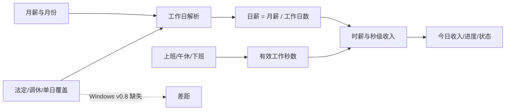

# Windows v0.8 / iOS v0.1 体验差距分析

**用途**：为 Windows v0.9 体验重塑提供逐项证据，不作为正式需求清单。
**阶段**：第一阶段体验差距 Review 已完成。
**上游 Review**：[review.md](review.md)

## 1. 基线说明

| 维度 | Windows v0.8 | iOS v0.1 | 结论 |
| --- | --- | --- | --- |
| 成熟度 | 已发布 Beta，真实桌面验收完成 | 未形成 Beta 候选，部分 Apple 系统能力待验收 | Windows 是稳定事实基线；iOS 是交互参照 |
| 核心形态 | 常驻透明桌宠 + Panel | Today/Calendar App + 系统投影 | 不应强行统一为同一外壳 |
| 自动证据 | v0.8 作息计薪定向门禁通过 | SalaryCore 86/86、M3 Windows 门禁通过 | 规则层均有较强证据 |
| 真机/桌面证据 | v0.8 Acceptance 通过 | M3/R10 iPad Playgrounds 主路径通过 | 各自只证明已执行范围 |

## 2. 差距矩阵

| ID | 维度 | Windows v0.8 | iOS v0.1 | 证据状态 | 严重度 | 用户影响 | 建议去向 |
| --- | --- | --- | --- | --- | --- | --- | --- |
| GAP-001 | 月薪分摊 | 按当月实际周休规则工作日计算 | 按日历解析后的实际工作日计算 | 已确认 | Minor | 基础公式一致 | 保持共享向量测试 |
| GAP-002 | 午休 | 支持开始/结束，金额与进度冻结 | 支持时长推算、开始/结束与冻结 | 已确认 | Minor | 结果一致，配置方式不同 | 统一语义，分别实现控件 |
| GAP-003 | 大小周 | Settings/Wizard 保存锚点与本周类型 | 自然语言询问本周大周/小周，内部映射锚点 | 已确认 | Major | Windows 暴露更多内部结构 | Windows 引导采用自然语言 |
| GAP-004 | 节假日 | v0.8 明确不含法定节假日、调休 | 离线节假日数据、调休与手动覆盖 | 已确认 | Major | Windows 特殊月份计薪与实际出勤不一致 | 范围待产品确认 |
| GAP-005 | 今日收入 | Panel 主金额 + 展开信息 | Today 主卡片 + 状态/进度/安排 | 已确认 | Major | Windows 一瞥强，但上下文弱 | 设计桌面化今日详情层 |
| GAP-006 | 本月信息 | Panel 展开显示累计、时薪 | Today 指标卡 + Calendar 月视图 | 已确认 | Major | Windows 缺少月度解释和按日检查 | 候选日历/详情入口 |
| GAP-007 | 今日安排 | Panel 仅显示工作时段文字 | 独立上班、午休、下班行 | 已确认 | Major | Windows 状态变化缺少可预期时间线 | Panel 第二层或详情窗口 |
| GAP-008 | 首次引导顺序 | 欢迎 -> 薪资与全部作息 -> 宠物 -> 确认 | 收入/休息 -> 上班/午休推算 -> 确认 | 已确认 | Major | Windows 字段密度更高 | 渐进揭示与推算 |
| GAP-009 | 月薪输入 | SpinBox，受 Godot 控件与焦点行为约束 | 零值聚焦清空、整数优先、两位小数校验 | 已确认 | Major | 首次输入摩擦明显 | 定义金额输入合同 |
| GAP-010 | 时间输入 | 小时/分钟 SpinBox 组合 | Onboarding 原生 DatePicker；Settings 仍是文本 | 已确认 | Major | 两端都有入口不一致 | 建立跨入口专用时间控件 |
| GAP-011 | 配置确认 | 汇总薪资、作息与宠物 | 汇总薪资、休息、作息与推算结果 | 已确认 | Minor | Windows 多一个平台特有决策 | 宠物步骤是否必经待确认 |
| GAP-012 | Settings IA | 工资/桌宠/显示/面板/通用五页签 | Form 按工资/作息/通知/系统分组 | 已确认 | Major | Windows 高频与低频项并列 | 按用户任务重组 |
| GAP-013 | 保存反馈 | 成功、无变化、失败事务均有日志；失败视觉证据不稳定 | 页面内反馈，保存事务有测试 | 已确认 | Minor | 错误恢复可理解性不一致 | 统一反馈状态与留存时长 |
| GAP-014 | 恢复/取消 | Settings 事务补偿、Wizard 取消恢复 | Draft/Session 取消恢复与失败重试 | 已确认 | Minor | 两端可靠性方向一致 | 保持合同测试 |
| GAP-015 | 字体与清晰度 | 自建 SystemFont、LCD 抗锯齿、固定像素与缩放 | 系统字体、Dynamic Type、size class | 已确认 | Major | Windows DPI 成本高 | 建立 100/125/150/200% 合同 |
| GAP-016 | 窗口比例 | Settings 固定约 700x530；Panel 固定两档 | iPhone/iPad/分屏响应式 | 已确认 | Major | Windows 2K 和不同缩放观感易失衡 | 容器与内容密度响应式 |
| GAP-017 | 颜色 | Windows 暖纸面，但多个模块各自持有 token | iOS WarmPalette 与系统材料结合 | 高度可能 | Minor | 颜色相近但细节漂移 | 抽取 Windows 设计 token 事实源 |
| GAP-018 | 间距与对齐 | Panel、菜单、Settings 各自计算固定尺寸 | SwiftUI 栈、Form、系统安全区 | 已确认 | Major | Windows 调整一处易破坏另一处 | 建立布局规格与截图门禁 |
| GAP-019 | 深色/辅助功能 | 重点验证 DPI/清晰度，未形成完整 Dynamic Type 等价物 | 深色、大字、降低动态、提高对比、VoiceOver 已有 M3 记录 | 已确认 | Major | Windows 可访问性基线较弱 | v0.9 候选，先确定支持范围 |
| GAP-020 | 桌宠常驻 | 核心能力 | 无 | 已确认 | 不适用 | Windows 差异化价值 | 必须保留 |
| GAP-021 | 透明/穿透 | native + 策略协调器 + Overlay 生命周期 | 无 | 已确认 | 不适用 | 桌面不受打扰的基础 | 必须保留并回归 |
| GAP-022 | 拖拽/位置 | 桌宠拖拽、位置记忆、窗口恢复 | 无 | 已确认 | 不适用 | 桌面空间适配 | 必须保留 |
| GAP-023 | 托盘/任务栏 | 隐藏、恢复、纯桌宠任务栏策略 | 无 | 已确认 | 不适用 | Windows 找回与退出保障 | 必须保留 |
| GAP-024 | 右键菜单 | 设置、向导、窗口模式、宠物、关于、退出 | 无桌面右键等价物 | 已确认 | Minor | 快捷但层级较多 | 重审职责，不删除平台入口 |
| GAP-025 | 动画 | 状态感知回退存在；固定时长和适配缺口 | 首版不含宠物 | 已确认 | Major | Windows 情感价值未充分兑现 | PetManager 专项 Review |
| GAP-026 | 工程复杂度 | Settings/Wizard/Main >3200 行，Godot/native 状态复杂 | SwiftUI 页面较小，核心规则独立 Package；Onboarding 仍达 521 行 | 已确认 | Major | Windows 大改回归面更大 | 先补行为合同再重塑 |
| GAP-027 | 文档事实 | v0.8 发布口径闭环 | iOS status 检查点落后实际 HEAD | 已确认 | Minor | 接手时可能选错基线 | 直接修 iOS 状态文档 |

## 3. 计算规则对照



### 已统一

- 月薪按工作日分摊，而不是简单按自然日或固定 30 日。
- 午休不计入有效工作时间，午休中金额和进度冻结。
- 单休、双休、大小周均有内部确定性规则。
- 保存失败不应污染旧配置，取消不应提交草稿。

### 未统一

- Windows 工作日只由周休制度决定；iOS 还叠加官方日历和手动覆盖。
- Windows Wizard 要求直接编辑完整时间边界；iOS Onboarding 先收集少量输入再推算。
- iOS Settings 尚未复用 Onboarding 的原生时间输入，不能直接作为 Windows 组件规范。

## 4. 信息架构对照

### Windows 当前结构

```text
桌面
├─ 小猫：状态、点击、双击、长按、拖拽、右键
├─ Panel：今日金额、状态、月累计、时薪、进度
├─ 右键菜单：设置、向导、窗口、宠物、关于、退出
├─ 托盘：隐藏、恢复、设置、退出等
└─ Settings：工资 / 桌宠 / 显示 / 面板 / 通用
```

### iOS 当前结构

```text
App
├─ 今日：金额、状态、进度、月累计、今日安排
├─ 日历：月份、日期状态、单日调整
└─ 设置：工资、作息、通知、系统

系统投影（尚未完成最终发布验收）
├─ Widget
├─ Live Activity
└─ Watch
```

### v0.9 的重组原则

1. 不把 Windows 改成打开即全屏 App。
2. Panel 继续负责“一眼看见”，详情层负责“理解与调整”。
3. 设置只承担长期配置，不再承担今日信息浏览。
4. 日常入口与维护入口分层，避免右键菜单继续无限增长。
5. Windows 原生能力由平台层保护，视觉层不直接操纵任务栏、穿透和托盘状态。

## 5. 视觉与清晰度分析

| 项目 | Windows 风险 | iOS 参照 | v0.9 证据要求 |
| --- | --- | --- | --- |
| 字体 | SystemFont、Hinting、缩放和窗口透明度共同影响清晰度 | 系统字体和 Dynamic Type | 100/125/150/200% 截图 + OCR/裁切检查 |
| 数字 | Panel 已使用独立数字字体观感 | `monospacedDigit` | 保留稳定数字宽度并统一金额格式 |
| 密度 | 固定 Panel 与 Settings 尺寸 | size class/分屏响应 | 小屏、2K、4K 的内容密度合同 |
| 圆角/阴影 | 多模块各自实现，易出现风格漂移 | 系统材料 + 统一 Palette | token 扫描和组件截图矩阵 |
| 状态颜色 | 暖色已建立，但错误/禁用反馈仍需证据 | 系统语义状态更清楚 | 正常、hover、pressed、disabled、focus、error 全覆盖 |
| 动效 | Panel tween 与宠物动画分别管理 | 降低动态效果有系统入口 | 定义轻动效与 reduced-motion 等价策略 |

## 6. 证据索引

### Windows

- `doc/current.md`
- `doc/releases/v0.8/verification.md`
- `doc/releases/v0.8/manual-verification.md`
- `doc/releases/v0.8/salary-schedule-verification.md`
- `doc/releases/v0.8/c4-verification.md`
- `doc/releases/v0.8/c5-verification.md`
- `doc/releases/v0.8/pet-animation-next-version-review.md`
- `src/scenes/panel/panel.gd`
- `src/scenes/settings/settings_dialog.gd`
- `src/scenes/wizard/wizard_dialog.gd`
- `src/scenes/main/main.gd`
- `src/utils/salary_schedule_calculator.gd`
- `src/utils/window_policy_coordinator.gd`
- `src/utils/overlay_lifecycle.gd`
- `src/utils/context_menu_builder.gd`

### iOS

- `doc/releases/ios-v0.1/status.md`
- `doc/releases/ios-v0.1/progress_ios-v0.1.md`
- `doc/releases/ios-v0.1/m3-device-verification.md`
- `doc/prototypes/ios-v0.1/prototype-spec.md`
- `apple/App/AppRootView.swift`
- `apple/App/Features/Today/TodayView.swift`
- `apple/App/Features/Calendar/SalaryCalendarView.swift`
- `apple/App/Features/Settings/SettingsView.swift`
- `apple/App/Features/Onboarding/OnboardingView.swift`
- `apple/Packages/SalaryCore/Sources/SalaryCore/SalaryCalculator.swift`
- `apple/Packages/SalaryCore/Sources/SalaryCore/ConfigurationPersistence.swift`

## 7. Review 停点

本文件只建立差距和证据，不确定 v0.9 正式范围。下一步可以先进行 PetManager 动画专项 Review；完成后，再把本文件与动画 Review 一起送入 `/idea` 做价值、成本、依赖和版本组合压力测试。
