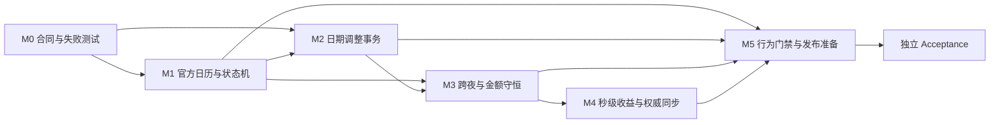

# LetsMakeMoney Windows v1.0.1 开发计划

## 1. 追踪信息

| 项目 | 内容 |
|---|---|
| 当前阶段 | 实现与独立验收完成，可进入发布收口 |
| 目标版本 | Windows v1.0.1 |
| 发布类型 | Stable 补丁版本 |
| 上游需求池 | `doc/releases/v1.0.1/idea-pool.md` |
| 完整 PRD | `doc/releases/v1.0.1/prd.md` |
| 追踪矩阵 | `doc/releases/v1.0.1/traceability.md` |
| 高保真原型 | `doc/prototypes/v1.0/index.html` |
| 进度看板 | `doc/releases/v1.0.1/progress_v1.0.1.md` |
| 开发日志 | `doc/logs/dev_log_v1.0.1.md` |
| 实施基线 | `main` / `5fa9293799a15956dd5d18bcd297b5d0e542cd3b` |
| 技术栈 | Rust + Tauri + TypeScript/React |
| 最后更新 | 2026-07-27 |

本计划只承接 `V101-IDEA-001` 至 `V101-IDEA-008`、`V101-FR-001` 至 `V101-FR-008`。`V101-IDEA-009` 至 `V101-IDEA-012` 不进入本版实现。

## 2. 版本目标与边界

### 2.1 版本目标

1. 让工作日、节假日、调休和手动日期调整使用同一事实源。
2. 让跨夜班次、秒级收益、日薪分配和月度累计可以复算并保持金额守恒。
3. 让日期调整具备保存、取消、失败补偿、持久化和跨窗口重算闭环。
4. 用行为级测试证明日历、配置、收入和状态合同，而不是只检查源码关键字。
5. 保持 v1.0 的界面结构、窗口生命周期、托盘和便携 Zip 体验不回退。

### 2.2 不在本版处理

- 不恢复宠物功能，不接入 PetManager。
- 不加入账号、云同步、主题系统、安装器或静默更新。
- 不整体重写 UI、React 状态管理或 Rust 架构。
- 不开展 Dashboard IPC 聚合、超长模块拆分、CSP 改造或历史目录迁移。
- 不修改 v1.0 tag、Release、历史验收结论和已发布产物。
- 无数据库影响；本版继续使用本地 JSON 配置和包内离线数据。

### 2.3 实施原则

1. 数据合同和失败测试先于界面接入。
2. Rust 提供权威日历、班次和金额结果，前端只维护草稿、展示状态和秒级插值。
3. 所有配置写入沿用原子写入、备份和失败补偿。
4. 新旧配置必须可迁移、可回退、可读日志，不允许静默丢弃未知值。
5. 每个里程碑完成后运行定向门禁；最终同时运行 v1.0 回归。
6. 自动测试不能代替真实 Windows GUI、系统时间变化和睡眠恢复验收。

## 3. IDEA、FR 与里程碑映射

| IDEA | FR | 需求 | 主要里程碑 |
|---|---|---|---|
| V101-IDEA-001 | V101-FR-001 | 真实中国大陆节假日与调休数据 | M0、M1 |
| V101-IDEA-002 | V101-FR-002 | 手动日期调整事务 | M0、M2、M3 |
| V101-IDEA-003 | V101-FR-003 | 日历加载、失败与旧数据保护 | M1 |
| V101-IDEA-004 | V101-FR-004 | 跨夜班次归属 | M0、M3 |
| V101-IDEA-005 | V101-FR-005 | 秒级收益与权威同步 | M3、M4 |
| V101-IDEA-006 | V101-FR-006 | 累计比例与分币尾差 | M0、M3 |
| V101-IDEA-007 | V101-FR-007 | 行为级验证门禁 | M0-M5 |
| V101-IDEA-008 | V101-FR-008 | 当前事实文档收口 | M5 |

## 4. 模块影响地图

| 范围 | 计划影响 |
|---|---|
| React 页面 | `apps/windows-v1/src/App.tsx`、`components.tsx`：日历状态、日期调整弹层、带薪/不带薪状态、夜班和同步反馈 |
| 前端模型 | `configModel.ts`、`model.ts`：调整类型、日历状态机、权威快照和本地秒级插值 |
| 前端样式 | `styles.css`：只补充 PRD 已确认的禁用、加载、失败和日期调整状态 |
| Rust 领域层 | `src-tauri/src/domain.rs`：官方日历优先级、班次归属、工资槽位、累计分配和秒级快照 |
| Rust 配置层 | `src-tauri/src/config.rs`：`date_overrides` 迁移、校验、原子保存和失败补偿 |
| Tauri 命令 | `src-tauri/src/lib.rs`：日历查询、日期调整、权威快照和跨窗口刷新命令 |
| 平台与支持 | `platform.rs`、`support.rs`：时间/时区恢复同步、脱敏日志和诊断事件 |
| 配置合同 | `contracts/config-defaults.json`、`config-v1.schema.json`、`migration-contract.json`、`log-contract.json` |
| 离线数据 | `apps/windows-v1/calendar-datasets/manifest.json`、`cn-mainland-2025.json`、`cn-mainland-2026.json` |
| 自动测试 | Rust 单元/属性测试、TypeScript 行为测试、Tauri command 集成测试、包内资源验证 |
| 脚本 | 新增 v1.0.1 聚合验证和包验证；保留 v1.0 脚本作为回归门禁 |
| 文档 | v1.0.1 verification、manual verification、release checklist、release notes、current 和计算说明 |
| 数据库 | 无数据库影响 |

## 5. 依赖关系

必须串行：

1. M0 先冻结数据、配置、日志和金额合同。
2. M1 的官方日历结果先于 M2 日期调整和 M3 金额分配。
3. M3 的 owner date 与金额权威结果先于 M4 本地秒级推进。
4. M5 在候选行为和包身份稳定后收口。

允许并行：

- 2025/2026 数据制作与日历 UI 状态实现。
- 日期调整事务与跨夜固定时钟测试。
- 行为 fixture、verification 骨架和文档检查规则。

## 6. 里程碑与任务

### V101-M0 合同、事实源与失败测试

**目标**：在实现前固定数据、配置、金额、日志和回滚合同。

- `V101-M0-001` 记录分支、HEAD、工作区、v1.0 tag/Release 和当前发布包身份。
- `V101-M0-002` 固定官方日历 manifest、年度文件格式、来源、哈希和支持年份合同。
- `V101-M0-003` 扩展配置 schema：`workday`、`paid_rest`、`unpaid_rest`，并定义“恢复自动”为删除覆盖项。
- `V101-M0-004` 固定旧 `rest_day` 迁移、未知 kind 拒绝和备份规则。
- `V101-M0-005` 固定 owner date、跨夜区间、工资槽位和累计分配公式。
- `V101-M0-006` 固定日历、调整、迁移、同步和金额日志事件及脱敏要求。
- `V101-M0-007` 建立 2025/2026、跨夜、带薪/不带薪、尾差和失败注入 fixture。
- `V101-M0-008` 建立 v1.0.1 聚合验证脚本入口和 verification/manual verification 骨架。

**门禁**：

- schema、manifest 和 fixture 可机器解析。
- 关键错误场景先有失败测试。
- 不修改 v1.0 历史对象，不引入数据库。

**回退**：M0 只增加合同、fixture、脚本和文档；失败时可整体撤回未发布的 v1.0.1 文件。

### V101-M1 官方日历与日历状态机

**目标**：让 2025、2026 年的工作日事实可验证，并让日历失败不误显旧月份。

- `V101-M1-001` 从政府公开来源整理 2025、2026 年节假日和调休工作日数据。
- `V101-M1-002` 生成年度资源哈希并实现启动/查询时校验。
- `V101-M1-003` 在 Rust 领域层实现官方日历、休息模式和手动覆盖优先级。
- `V101-M1-004` 对不支持年份、缺失资源、空文件、损坏 JSON 和哈希不一致返回显式结果。
- `V101-M1-005` 实现 `loading/ready/empty/stale/error/unsupported` 前端状态机。
- `V101-M1-006` 为快速切月增加请求标识，忽略晚到结果。
- `V101-M1-007` 失败时保留最后有效数据仅作为明确标注的 `stale`，不得冒充目标月份。
- `V101-M1-008` 将日历资源纳入构建、便携 Zip 和包体验证。
- `V101-M1-009` 完成逐日对照、失败重试、跨月竞态和包内资源测试。

**门禁**：

- 2025/2026 官方日期逐日对照通过。
- 正常状态不显示多余“已就绪”提示。
- 错误月份不显示为目标月份，重试成功可恢复。

**回退**：资源或加载器异常时保持最后有效月份并明确标注过期；不覆盖用户配置。

### V101-M2 手动日期调整事务

**目标**：关闭日期调整从草稿到持久化、重算和失败补偿的完整链路。

- `V101-M2-001` 扩展 Rust 配置模型和 TypeScript 类型。
- `V101-M2-002` 实现旧配置迁移、备份、未知值拒绝和可读错误。
- `V101-M2-003` 实现应用覆盖、恢复自动和无变化三种命令结果。
- `V101-M2-004` 使用临时文件、校验和原子替换保存；失败时保留旧配置。
- `V101-M2-005` 实现日历单日调整草稿、可用条件和取消/关闭语义。
- `V101-M2-006` 自动休息日禁用“带薪休息”和“不带薪休息”，显示原因。
- `V101-M2-007` 保存成功后刷新日历、今日状态、工作日数、工资槽位、累计和下个工作日。
- `V101-M2-008` 保存失败时保留用户选择、显示可读错误并允许重试。
- `V101-M2-009` 记录 `date_override.saved/unchanged/failed/removed/migrated` 语义事件。
- `V101-M2-010` 完成应用、无变化、取消、关闭、失败、重启、迁移和跨窗口一致性测试。

**门禁**：

- 失败写入不污染最终有效配置。
- 用户取消和关闭不产生配置变化。
- 重启后调整仍生效，恢复自动后覆盖项确实删除。

**回退**：恢复备份配置并重新加载权威快照；不允许前端草稿成为事实源。

### V101-M3 跨夜归属与金额守恒

**目标**：让夜班和带薪/不带薪日期在所有收入与状态结果中保持一致。

- `V101-M3-001` 实现 `end <= start` 时跨日的统一班次区间。
- `V101-M3-002` 午夜后且尚未下班时将 owner date 归到前一日。
- `V101-M3-003` 午休、节假日和手动覆盖统一按 owner date 解析。
- `V101-M3-004` 建立工资槽位 `N`、实际工作日 `W` 和累计函数 `C(k)`。
- `V101-M3-005` 使用相邻累计差 `D(k)` 分配每日分币，保证月末守恒。
- `V101-M3-006` 实现带薪休息保留当日金额但无有效工时。
- `V101-M3-007` 实现不带薪休息当日金额为 0，并降低本月预计应发。
- `V101-M3-008` 手动工作日加入工资槽位，自动休息日不创建槽位。
- `V101-M3-009` 覆盖 0 金额、长金额、月初/月末、跨年和 `N=0` 错误。
- `V101-M3-010` 完成固定时钟矩阵、金额单调性和月末守恒属性测试。

**门禁**：

- 月末累计与应发金额误差为 0 分。
- 夜班午夜前后 owner date、状态和金额一致。
- 带薪/不带薪页面不显示无意义的有效工时和进度。

**回退**：保留 v1.0 算法版本标识和配置备份；候选失败不得覆盖 v1.0 发布包。

### V101-M4 秒级收益与权威同步

**目标**：在不复制业务规则的前提下提供真实秒级金额，并能从系统时间变化中恢复。

- `V101-M4-001` Rust 权威快照返回 owner date、阶段、边界、金额分子和算法版本。
- `V101-M4-002` 前端仅在有效工作区间按本地时间逐秒推进显示金额。
- `V101-M4-003` 上班前、午休、下班后、带薪休息和不带薪休息停止本地推进。
- `V101-M4-004` 每 30 秒请求权威快照并对齐。
- `V101-M4-005` 窗口显示、系统恢复、阶段边界、日期和时区变化时立即同步。
- `V101-M4-006` 金额偏差超过 1 分、阶段或 owner date 不一致时立即纠正并记录日志。
- `V101-M4-007` 防止隐藏窗口产生无意义高频刷新和日志刷屏。
- `V101-M4-008` 完成逐秒、午休冻结、睡眠恢复、时间跳变和晚到快照测试。
- `V101-M4-009` 使用真实 Windows 操作补证系统睡眠/恢复和时间变化。

**门禁**：

- 相邻工作秒金额单调且与权威快照误差不超过 1 分。
- 阶段边界不多算、漏算或跨 owner date。
- 纠正事件可诊断但不高频刷屏。

**回退**：无法本地推进时直接显示最近权威快照并提示暂时无法计算，不伪造秒级变化。

### V101-M5 行为门禁、文档与候选收口

**目标**：形成可打包、可复验、可回滚的 v1.0.1 候选。

- `V101-M5-001` 为 FR-001 至 FR-006 建立 Rust 行为/属性测试。
- `V101-M5-002` 建立 TypeScript 日历状态机、草稿、禁用条件和本地 tick 行为测试。
- `V101-M5-003` 建立 Tauri command 配置写入、失败补偿和跨窗口刷新集成测试。
- `V101-M5-004` 新增 `verify_v101.ps1` 并保留 `verify_v10.ps1 -SkipReleaseBuild` 回归。
- `V101-M5-005` 新增 v1.0.1 打包和包验证，检查版本、日历资源和 SHA256。
- `V101-M5-006` 运行 Wizard、Settings、迷你视图、今日详情、托盘和窗口拖动回归。
- `V101-M5-007` 更新 verification、manual verification、release checklist 和 release notes。
- `V101-M5-008` 更新 README、current、计算说明和用户手册的当前事实。
- `V101-M5-009` 运行 UTF-8、乱码、本地链接、敏感路径和 `git diff --check`。
- `V101-M5-010` 从新解压候选包进入独立 `/acceptance`，不以自动测试代替 GUI 验收。

**门禁**：

- v1.0.1 定向门禁和 v1.0 核心回归全部通过。
- 候选 Zip、EXE、HEAD、版本、资源和文档身份一致。
- 无收入、日历、状态、配置污染或窗口生命周期发布阻塞。

**回退**：保留 v1.0 Stable Zip、tag 和 Release；v1.0.1 未通过时停止发布，不覆盖稳定产物。

## 7. 验证矩阵

| 层级 | 验证内容 | 建议命令或方式 |
|---|---|---|
| Rust domain | 官方日历、跨夜、工资槽位、分币守恒、快照 | `cargo test --manifest-path apps/windows-v1/src-tauri/Cargo.toml` |
| TypeScript | 日历状态机、日期草稿、本地 tick、禁用条件 | 在 M0 固定测试入口，纳入 `npm` 脚本 |
| Web 构建 | 类型、组件和生产构建 | `npm run build:web --prefix apps/windows-v1` |
| v1.0.1 聚合 | FR-001 至 FR-008 定向门禁 | `powershell -ExecutionPolicy Bypass -File .\scripts\verify_v101.ps1 -SkipReleaseBuild` |
| v1.0 回归 | 已发布核心能力 | `powershell -ExecutionPolicy Bypass -File .\scripts\verify_v10.ps1 -SkipReleaseBuild` |
| 包验证 | 版本、资源、许可证、哈希和禁止内容 | `package_v101.ps1`、`verify_v101_package.ps1` |
| 文档 | 状态、UTF-8、乱码、链接和敏感路径 | `verify_v10_docs.ps1` 与 v1.0.1 状态规则 |
| 差异 | 空白错误和意外改动 | `git diff --check`、`git status --short` |
| GUI | 日期调整、夜班文案、秒级金额、失败反馈 | Computer Use 操作新解压候选包 |
| 人工 | 睡眠恢复、系统时间/时区、两小时稳定运行 | `manual-verification.md` |

## 8. 风险与回滚

| 风险 | 影响 | 控制与回滚 |
|---|---|---|
| 官方日历数据错误 | 工作日、金额和状态错误 | manifest 哈希、逐日对照、来源记录；异常时使用明确 unsupported/error |
| 旧覆盖迁移错误 | 用户日期设置丢失 | 迁移前备份、未知值拒绝、迁移日志和重启测试 |
| 跨夜 owner date 漂移 | 夜班金额归错日期 | 固定时钟矩阵；Rust 单一权威算法 |
| 分币算法改变历史显示 | 用户对金额不信任 | 整数分、累计差分、算法版本和示例复算 |
| 秒级前端与 Rust 双算 | 金额跳变 | 前端只做权威参数内插值；30 秒和边界强制同步 |
| 日历请求竞态 | 旧月份冒充新月份 | 请求标识、晚到丢弃、stale 明确标注 |
| 补丁版本范围扩张 | 延迟且增加回归面 | 禁止整体 UI/架构重写，IDEA-009 至 012 延后 |

## 9. 完成定义

只有同时满足以下条件，开发阶段才可进入独立验收：

1. `V101-M0-001` 至 `V101-M5-010` 全部完成。
2. `V101-FR-001` 至 `V101-FR-008` 均有行为、日志、GUI 或文档证据。
3. v1.0.1 定向验证、v1.0 回归、包验证和文档检查通过。
4. 候选包由当前代码生成，Zip、EXE、资源和 HEAD 身份可追溯。
5. 用户配置和 v1.0 稳定包均有明确回滚路径。
6. 未验证的真实系统行为明确进入人工补证，不写为通过。
