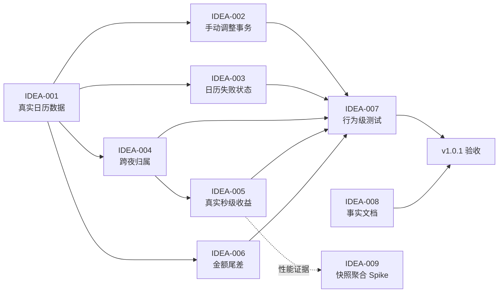

# LetsMakeMoney Windows v1.0.1 候选需求池

## 追踪信息

- 当前状态：推荐方案与完整 PRD 已确认，已进入开发承接
- 目标版本：v1.0.1
- 上游来源：
  - `doc/releases/v1.1/review.md`
  - `doc/releases/v1.1/v1.0-post-release-gap.md`
  - `doc/releases/v1.1/slimming-candidates.md`
- 上游 Review 范围：`V11-REV-001` 至 `V11-REV-016`
- 下游承接：`doc/releases/v1.0.1/prd.md`、`doc/releases/v1.0.1/traceability.md`
- 当前事实源：v1.0 Release、v1.0 正式文档、当前 `main` 代码和上述 Review
- 最后更新：2026-07-27

## Idea 阶段判断

- **版本定位**：v1.0.1 是 v1.0 Stable 的可信度修复版，不是功能扩张版本。
- **核心问题**：现有界面承诺了节假日、调休、手动日期调整、跨夜班次和实时收入，但部分生产链路没有真正闭环。
- **本版主线**：
  1. 日历事实闭环；
  2. 跨日与实时收入计算修正；
  3. 金额精度规则收敛；
  4. 行为级回归门禁；
  5. 当前事实文档修正。
- **直接进入 `/prd` 的候选**：`V101-IDEA-001` 至 `V101-IDEA-008`。
- **技术 Spike**：Dashboard 快照聚合、Tauri CSP。
- **继续验证**：大文件职责拆分、视觉与可访问性定向精修。
- **暂不做**：历史目录大规模迁移、框架重写和任何范围扩张。

## 已确认决策

| 决策 | 项目所有者确认 | v1.0.1 解释 |
| --- | --- | --- |
| 节假日与调休 | 采用推荐方案 | 接入真实中国大陆离线数据，并定义数据缺失降级 |
| 跨夜班次 | 采用推荐方案 | 保留夜班支持，修复午夜后的班次归属 |
| 手动日期调整 | 采用推荐方案 | 明确点击“应用”，安全保存并立即重算 |
| 日期调整的休息语义 | 项目所有者补充确认 | 区分带薪休息与不带薪休息；普通自动休息日不重复创建请假覆盖 |
| 收益刷新精度 | 采用推荐方案 | 真实秒级计算，本地平滑更新并定期权威同步 |
| 月薪尾差 | 采用推荐方案 | 使用累计比例，完整工作月最终累计严格等于月薪 |
| 文档与目录治理 | 采用推荐方案 | 本版只修事实和过期状态，不迁移历史目录 |

## 上游证据摘要

### 已确认事实

1. v1.0 Stable 已正式发布，当前没有需要撤回 Release 的 Blocker。
2. React 生产适配层把法定节假日和调休工作日列表固定传为空数组。
3. 日历手动调整只保存在 React 会话状态，没有写入 `date_overrides`。
4. Settings 的“允许手动调整”开关没有配置或行为绑定。
5. 日历跨月加载失败时保留旧 `days`，界面又没有消费失败状态。
6. Rust 支持 `owner_date` 与 `now_date` 分离，但前端始终传入同一天。
7. 前端每秒刷新，却只向 Rust 传入 `HH:MM`。
8. 日薪使用分币整数除法，整月累计可能与月薪存在分币尾差。
9. 当前静态门禁会在手动日期调整未闭环时仍然通过。
10. 当前事实文档中仍存在旧提交、旧待办和已完成但未更新的验收状态。

### 证据映射

| 来源证据 | 对应候选需求 | 证据等级 | 说明 |
| --- | --- | --- | --- |
| `V11-REV-001` | `V101-IDEA-001` | 强 | 生产代码明确传入空节假日与调休列表 |
| `V11-REV-002`、`V11-REV-003` | `V101-IDEA-002` | 强 | 会话状态与无效开关均可从代码直接确认 |
| `V11-REV-004` | `V101-IDEA-003` | 强 | 失败分支不清空数据，UI 不读取状态 |
| `V11-REV-005` | `V101-IDEA-004` | 强 | 前端传参和 Rust 日期合同不一致 |
| `V11-REV-006` | `V101-IDEA-005` | 强 | 1 秒 timer 与分钟精度输入并存 |
| `V11-REV-007` | `V101-IDEA-006` | 强 | 整数除法可确定复算 |
| `V11-REV-008` | `V101-IDEA-007` | 强 | 静态门禁只验证关键字符串 |
| `V11-REV-014`、`V11-REV-015` | `V101-IDEA-008` | 强 | 当前文档与远端事实可以直接核对 |
| `V11-REV-009`、`V11-REV-010` | `V101-IDEA-009` | 中 | 重复事实与轮询存在，但性能影响尚无量化 |
| `V11-REV-011` | `V101-IDEA-010` | 中 | 文件集中明确，真实维护损失未量化 |
| `V11-REV-012`、`V11-REV-013` | `V101-IDEA-011` | 中 | 构建和安全边界存在，暂无事故证据 |
| `V11-REV-016` 与体验 Review | `V101-IDEA-012` | 弱 | 主要是治理收益和视觉偏好，非补丁阻塞 |

## 候选需求总览

| ID | 标题 | 类型 | 优先级 | 证据等级 | 压力测试 | 分档结论 | 依赖 | 推荐去向 | 最小下一步 |
| --- | --- | --- | --- | --- | --- | --- | --- | --- | --- |
| V101-IDEA-001 | 接入真实节假日与调休数据 | 发布后缺陷 | P0 | 强 | 39/40 | 高价值 | 无 | 进入 PRD | 锁定数据来源、年度范围和降级规则 |
| V101-IDEA-002 | 手动日期调整事务闭环 | 发布后缺陷 | P0 | 强 | 39/40 | 高价值 | 001 | 进入 PRD | 定义应用、取消、失败和重算链路 |
| V101-IDEA-003 | 日历加载失败防止旧数据误显 | 发布后缺陷 | P0 | 强 | 34/40 | 高价值 | 001 | 进入 PRD | 定义加载、空、失败和重试状态 |
| V101-IDEA-004 | 修复跨夜班次归属日期 | 发布后缺陷 | P0 | 强 | 34/40 | 高价值 | 001 | 进入 PRD | 建立跨日前后固定时钟矩阵 |
| V101-IDEA-005 | 建立真实秒级收益口径 | 产品合同修正 | P0 | 强 | 34/40 | 高价值 | 004 | 进入 PRD | 明确本地推进与权威同步合同 |
| V101-IDEA-006 | 消除月薪分币尾差 | 产品合同修正 | P0 | 强 | 31/40 | 中高价值 | 001 | 进入 PRD | 锁定累计比例和显示精度 |
| V101-IDEA-007 | 用行为测试替代关键字符串假绿 | 工程质量 | P1 | 强 | 35/40 | 高价值 | 001-006 | 进入 PRD | 为每个 P0 建立失败先行测试 |
| V101-IDEA-008 | 修正当前事实与公开模板 | 文档治理 | P1 | 强 | 36/40 | 高价值 | 无 | 直接修文档并纳入 PRD 门禁 | 建立唯一事实对照表 |
| V101-IDEA-009 | 聚合 Dashboard 快照与刷新 | 技术 Spike | P2 | 中 | 25/40 | 小范围验证 | 004、005 | 技术 Spike | 测量 IPC、CPU 和后台刷新 |
| V101-IDEA-010 | 拆分超长 React/Rust 所有权 | 工程治理 | P2 | 中 | 22/40 | 继续验证 | 007、009 | 暂不处理 | 先记录改动热点和耦合证据 |
| V101-IDEA-011 | 工具链锁定与 CSP 硬化 | 工程/安全 | P2 | 中 | 23/40 | 继续验证 | 007 | 技术 Spike | 分开评估工具链与 CSP |
| V101-IDEA-012 | 历史归档与视觉定向精修 | 治理/视觉偏好 | P2 | 弱 | 18/40 | 暂不做 | 008 | 继续验证 | 收集链接图和真实视觉任务证据 |

## 版本主线

### 主线 A：日历事实闭环

- `V101-IDEA-001` 真实节假日与调休数据。
- `V101-IDEA-002` 手动日期调整事务。
- `V101-IDEA-003` 日历失败状态。

### 主线 B：收入与时间可信度

- `V101-IDEA-004` 跨夜班次归属。
- `V101-IDEA-005` 真实秒级收益。
- `V101-IDEA-006` 月薪尾差。

### 主线 C：发布质量

- `V101-IDEA-007` 行为级测试。
- `V101-IDEA-008` 事实文档修正。

### 延后主线

- `V101-IDEA-009` 至 `V101-IDEA-012` 不进入 v1.0.1 正式实现范围。

## 跨主线依赖



## 压力测试结果

### 评分总览

| ID | 痛点 | 场景 | 证据 | 紧迫 | 核心贡献 | 最小解 | 成本 | 验证速度 | 总分 |
| --- | ---: | ---: | ---: | ---: | ---: | ---: | ---: | ---: | ---: |
| 001 | 5 | 5 | 5 | 5 | 5 | 5 | 4 | 5 | 39 |
| 002 | 5 | 5 | 5 | 5 | 5 | 5 | 4 | 5 | 39 |
| 003 | 4 | 5 | 5 | 3 | 5 | 5 | 3 | 4 | 34 |
| 004 | 5 | 4 | 5 | 3 | 5 | 5 | 3 | 4 | 34 |
| 005 | 4 | 5 | 5 | 5 | 5 | 4 | 3 | 3 | 34 |
| 006 | 3 | 5 | 5 | 3 | 4 | 4 | 3 | 4 | 31 |
| 007 | 5 | 5 | 5 | 5 | 5 | 4 | 3 | 3 | 35 |
| 008 | 4 | 5 | 5 | 5 | 4 | 5 | 4 | 4 | 36 |
| 009 | 2 | 4 | 3 | 3 | 3 | 3 | 3 | 4 | 25 |
| 010 | 2 | 3 | 3 | 2 | 3 | 3 | 3 | 3 | 22 |
| 011 | 2 | 4 | 3 | 2 | 3 | 4 | 2 | 3 | 23 |
| 012 | 2 | 2 | 2 | 2 | 2 | 3 | 2 | 3 | 18 |

### 结论

- `001-008` 证据强度不低于 4，问题可由代码和发布事实直接证明，可以进入版本收敛。
- `009` 只有工程风险和理论收益，应先测量，不能借修复实时刷新顺带重构。
- `010-011` 当前不阻塞用户核心路径，不能挤占日历与收入正确性。
- `012` 的视觉部分缺少稳定复现的任务失败，证据闸门限制为继续验证；历史归档又超出补丁版范围。

## 三档范围方案

### 最小方案

包含：

- `V101-IDEA-001` 真实节假日与调休数据；
- `V101-IDEA-002` 手动调整持久化；
- `V101-IDEA-003` 日历失败不显示旧数据；
- `V101-IDEA-007` 对前三项补行为测试；
- `V101-IDEA-008` 修正当前事实文档。

优点：

- 最快关闭日历表里最明显的虚假能力。
- 修改范围集中。

缺点：

- 已确认的夜班、秒级收益和金额尾差继续存在。
- 不符合项目所有者“全部采用推荐决策”的选择。

结论：**不推荐**。

### 推荐方案

包含：

- `V101-IDEA-001` 至 `V101-IDEA-006` 全部可信度修复；
- `V101-IDEA-007` 行为级测试；
- `V101-IDEA-008` 当前事实修正；
- `V101-IDEA-009` 只允许做测量，不预设重构。

优点：

- 一次关闭 Review 已确认的收入、日历和状态错误。
- 不改变 v1.0 的产品定位与信息架构。
- 可按三条主线独立回滚。

风险：

- 虽然版本号是补丁版本，但涉及日历数据合同、前端时钟与金额算法，必须有完整兼容和回归门禁。
- 年度数据来源、跨年更新和旧配置兼容必须在 PRD 中明确。

结论：**推荐，且已获项目所有者方向确认**。

### 过大方案

在推荐方案上继续加入：

- Dashboard command 全面重构；
- App/Rust 大文件拆分；
- Tauri CSP 和工具链整体治理；
- 历史目录、旧脚本和原型迁移；
- 所有窗口视觉重做；
- 账号、云同步、主题、安装器或静默更新。

风险：

- 把正确性补丁扩成架构和产品重塑。
- 难以判断收入修复失败来自算法、数据、UI 还是重构。
- 无法维持 v1.0.1 的低风险回滚。

结论：**不进入 v1.0.1**。

## 需求详情

### V101-IDEA-001 接入真实节假日与调休数据

- 类型：发布后缺陷。
- 产品问题：界面显示“中国大陆 2026”，但正式计算没有对应数据。
- 目标用户/场景：所有在法定假日或调休日期查看收入、安排和工作进度的用户。
- 证据：`model.ts` 将两个列表固定为空；强证据，已确认。
- 用户价值：防止日薪分母、今日状态、下个工作日和日历图例错误。
- 影响范围：年度数据资源、TypeScript 适配、Rust 日历输入、配置版本、日志、打包、测试和文档。
- 依赖：无。
- 风险：数据来源错误、年度过期、打包遗漏、跨年降级不透明。
- 测试缺口：生产数据加载、官方样例日、无数据年份和损坏数据。
- 成本：中。
- 结论：进入 PRD。
- 最小下一步：锁定权威来源、支持年份、数据格式、校验和降级文案。

### V101-IDEA-002 手动日期调整事务闭环

- 类型：发布后缺陷。
- 产品问题：当前选择只改变临时样式，不改变真实计算。
- 目标用户/场景：临时请假、补班或公司特殊工作日。
- 证据：React 会话状态、无配置写入、已有 issues 记录；强证据，已确认。
- 用户价值：用户的明确调整能够影响月工作日、带薪/不带薪金额、今日状态和下个工作日。
- 影响范围：日历弹层、配置事务、`date_overrides`、工资分配槽位、预计应发金额、重算、日志、成功/失败/取消反馈。
- 依赖：001 的真实日历规则。
- 风险：保存失败污染配置、调整后金额瞬间变化、恢复规则不清。
- 测试缺口：工作日、带薪休息、不带薪休息、自动休息日禁用请假、应用、取消、失败、重启、删除覆盖和当日调整。
- 成本：中。
- 结论：进入 PRD。
- 最小下一步：定义四种选择、带薪/不带薪金额语义、“应用”按钮、失败保留选择、旧配置迁移回滚和立即重算。
- 范围约束：移除当前无作用的“允许手动调整”开关；除非 PRD 证明需要真实全局禁用配置，否则不新增伪开关替代。

### V101-IDEA-003 日历加载失败防止旧数据误显

- 类型：发布后缺陷。
- 产品问题：新月份加载失败时可能继续展示旧月份网格。
- 目标用户/场景：切换月份时遇到配置、资源或原生命令异常。
- 证据：失败分支只设置 error，不清空 days；强证据，已确认。
- 用户价值：避免用户把旧数据当作新月份事实。
- 影响范围：CalendarView 状态、加载占位、错误提示、重试、日志和自动测试。
- 依赖：001。
- 风险：状态切换闪烁、重试竞态、快速切月晚到结果。
- 测试缺口：失败、重试、连续切月、晚到结果和空数据。
- 成本：小到中。
- 结论：进入 PRD。
- 最小下一步：锁定 loading/ready/error 的界面和旧请求失效规则。

### V101-IDEA-004 修复跨夜班次归属日期

- 类型：发布后缺陷。
- 产品问题：午夜后的夜班被错误归入当前自然日。
- 目标用户/场景：下班时间早于或等于上班时间的跨夜用户。
- 证据：前端把 `owner_date` 和 `now_date` 传成同一天；Rust 合同明确分离；强证据，已确认。
- 用户价值：夜班工作状态、收入、休息日和日历归属正确。
- 影响范围：前端班次归属算法、Rust command 输入、跨日日期解析、今日安排、日志和测试。
- 依赖：001 的日期解析。
- 风险：周末/节假日跨夜优先级、午休跨午夜、时区和夏令时。
- 测试缺口：上班前、午夜前后、下班边界、跨节假日和上一日休息。
- 成本：中。
- 结论：进入 PRD。
- 最小下一步：建立代表性夜班状态矩阵，不重写已通过的 Rust 区间算法。

### V101-IDEA-005 建立真实秒级收益口径

- 类型：产品合同修正。
- 产品问题：产品每秒轮询但金额和状态输入只有分钟精度。
- 目标用户/场景：持续查看迷你收入视图和今日工作台。
- 证据：1 秒 timer 与 `HH:MM` 调用并存；强证据，已确认。
- 用户价值：核心“实时收入”体验与文案一致，同时避免无效 IPC。
- 影响范围：前端时钟、Rust command 时间输入、权威快照、本地插值、后台节流、日志和测试。
- 依赖：004。
- 风险：本地插值与权威金额漂移、窗口恢复跳变、CPU 增长。
- 测试缺口：逐秒推进、午休边界、窗口后台、睡眠唤醒和时钟回拨。
- 成本：中到大。
- 结论：进入 PRD。
- 最小下一步：定义“权威同步频率、每秒本地推进、失焦节流、重新聚焦校正”的合同；不预设 Dashboard 全面重构。

### V101-IDEA-006 消除月薪分币尾差

- 类型：产品合同修正。
- 产品问题：按整数日薪累计时，完整工作月可能少于月薪。
- 目标用户/场景：查看月底累计或手工复算的用户。
- 证据：Rust 整数除法和可重复示例；强证据，已确认。
- 用户价值：整月累计与用户输入月薪严格一致，可解释、可审计。
- 影响范围：月薪累计公式、日薪展示、今日收入、历史日累计、测试和计算说明。
- 依赖：001 的工作日总数。
- 风险：日薪显示与累计比例不完全相加、旧截图变化、四舍五入边界。
- 测试缺口：不同月薪、工作日数量、月中、月底和手动调整后重分配。
- 成本：中。
- 结论：进入 PRD。
- 最小下一步：以月度累计比例为权威，定义日薪仅作为参考展示，月底必须等于月薪。

### V101-IDEA-007 用行为测试替代关键字符串假绿

- 类型：工程质量。
- 产品问题：CI 显示通过，仍无法证明高信任功能真实有效。
- 目标用户/场景：所有依赖 Stable 正确性的用户，以及外部贡献者。
- 证据：M3 对手动调整只检查字符串；强证据，已确认。
- 用户价值：避免同类缺陷再次进入 Stable。
- 影响范围：Rust 单测、TypeScript 测试、Tauri command 测试、Playwright/Computer Use 边界、CI。
- 依赖：001-006 的最终合同。
- 风险：为了覆盖率引入脆弱 UI 测试、测试环境污染用户配置。
- 测试缺口：真实配置事务、跨日固定时钟、数据损坏和日历失败。
- 成本：中到大。
- 结论：进入 PRD，作为 P0 需求共同完成门禁。
- 最小下一步：每项 P0 至少建立一个“修复前必失败、修复后通过”的行为测试。

### V101-IDEA-008 修正当前事实与公开模板

- 类型：文档治理。
- 产品问题：当前事实源、发布 checklist 和用户手册存在互相冲突的状态。
- 目标用户/场景：下载用户、贡献者和后续发布执行者。
- 证据：提交、ruleset 和验收状态可直接核对；强证据，已确认。
- 用户价值：避免下载、复现和问题反馈时使用错误信息。
- 影响范围：`doc/current.md`、v1.0 发布文档、用户手册、Issue 模板和 v1.0.1 release docs。
- 依赖：无。
- 风险：覆盖历史事实或继续制造新的事实源。
- 测试缺口：文档状态脚本尚未覆盖所有冲突文件。
- 成本：小。
- 结论：直接修文档，并作为 v1.0.1 发布门禁。
- 最小下一步：建立“当前 HEAD、v1.0 tag、v1.0.1 候选”三者明确区分。

### V101-IDEA-009 聚合 Dashboard 快照与刷新

- 类型：技术 Spike。
- 产品问题：每秒多次 IPC 与重复计算可能造成不必要的资源开销和竞态。
- 证据：调用链已确认，实际性能伤害尚未量化；中证据。
- 用户价值：潜在提升稳定性和电量/CPU 表现。
- 影响范围：TypeScript model、Tauri command、Rust domain、窗口生命周期和性能测试。
- 依赖：004、005。
- 风险：借性能优化改写已通过的业务合同。
- 测试缺口：空闲/前台/后台 IPC 次数、CPU、内存和唤醒频率。
- 成本：大。
- 结论：技术 Spike；不预设进入 v1.0.1。
- 最小下一步：先测量现状并验证真实秒级方案是否必须聚合 command。

### V101-IDEA-010 拆分超长 React/Rust 所有权

- 类型：工程治理。
- 产品问题：核心文件职责集中，提高维护和贡献理解成本。
- 证据：文件长度和职责可确认，缺少真实变更失败数据；中证据。
- 用户价值：间接，主要改善后续维护。
- 影响范围：React 视图、model、Rust lifecycle、tray、support。
- 依赖：007、009。
- 风险：补丁版引入广泛回归。
- 测试缺口：模块行为基线和窗口生命周期测试。
- 成本：大。
- 结论：暂不进入 v1.0.1。
- 最小下一步：记录 v1.0.1 改动热点，作为未来拆分证据。

### V101-IDEA-011 工具链锁定与 CSP 硬化

- 类型：工程质量与安全 Spike。
- 产品问题：Rust `stable` 不可精确复现；Tauri CSP 为空。
- 证据：配置可确认，暂无事故或攻击证据；中证据。
- 用户价值：提高构建确定性和默认安全边界。
- 影响范围：CI、开发环境、Tauri 配置和页面资源加载。
- 依赖：007。
- 风险：工具链升级或 CSP 规则可能破坏构建/运行。
- 测试缺口：固定版本构建、CSP 报告模式和资源清单。
- 成本：中。
- 结论：分成两个 Spike，暂不进入 v1.0.1。
- 最小下一步：先锁定当前 CI 实际 Rust 版本；CSP 单独建立报告模式。

### V101-IDEA-012 历史归档与视觉定向精修

- 类型：仓库治理与视觉偏好。
- 产品问题：历史文件影响检索；“视觉还可更精致”缺少具体任务证据。
- 证据：目录体积为中证据，视觉改进为弱证据。
- 用户价值：仓库更易理解；视觉价值待验证。
- 影响范围：doc、prototype、spike、用户手册和 UI。
- 依赖：008。
- 风险：误删历史、破坏链接、补丁版再次扩大视觉范围。
- 测试缺口：完整引用图和具体视觉失败截图。
- 成本：中到大。
- 结论：v1.0.1 只修事实文字；文件迁移和视觉工作继续验证。
- 最小下一步：收集链接图与高频视觉任务证据，不删除或重做。

## 进入 PRD

- `V101-IDEA-001` 真实日历数据。
- `V101-IDEA-002` 手动日期调整事务。
- `V101-IDEA-003` 日历错误状态。
- `V101-IDEA-004` 跨夜归属。
- `V101-IDEA-005` 秒级收益。
- `V101-IDEA-006` 月薪尾差。
- `V101-IDEA-007` 行为级门禁。
- `V101-IDEA-008` 事实文档收口。

## 技术 Spike

- `V101-IDEA-009` Dashboard 快照聚合，仅测量和验证方案。
- `V101-IDEA-011` 工具链锁定与 CSP 分开验证。

## 继续验证

- `V101-IDEA-010` 以 v1.0.1 真实改动热点验证模块拆分价值。
- `V101-IDEA-012` 收集历史引用图和明确视觉任务证据。

## 暂不处理

- 大规模 React/Rust 重构。
- 历史目录迁移或旧脚本删除。
- 整体视觉重做。
- 恢复宠物或接入 PetManager。
- 账号、云同步、主题系统、安装器、静默更新。
- 多平台或框架迁移。

## v1.0.1 范围保护

1. 不恢复宠物功能。
2. 不新增账号、云同步、主题、安装器或静默更新。
3. 不修改 v1.0 tag、Release 或既有发布附件。
4. 不把历史归档、框架重构或视觉重做混入正确性修复。
5. 不为节假日数据引入在线账号或后台服务。
6. 不把技术 Spike 结果预先当作必须实现。
7. 不在 Idea 阶段自造数据 schema、配置字段、日志事件或更新接口。

## 是否具备进入 v1.0.1 /prd 的条件

**具备。**

六项产品决策已经确认，P0 问题均有强证据，推荐方案和非目标已经收敛。进入 PRD 后仍需详细确认：

- 节假日数据的权威来源、授权、支持年份和跨年更新方式；
- 日期调整的应用/取消/失败事务；
- 夜班与节假日、午休跨日的优先级；
- 秒级本地推进和权威同步频率；
- 累计比例、日薪展示和月底尾差公式；
- 自动测试、Computer Use 和人工验收边界。

## 下一阶段建议

进入 `/prd`，将 `V101-IDEA-001` 至 `V101-IDEA-008` 收敛为完整可开发需求。PRD 形成前不修改业务代码。

可直接发送：

```text
[$mypm] /prd

基于 doc/releases/v1.0.1/idea-pool.md，为 LetsMakeMoney Windows v1.0.1 制定完整可开发 PRD。

采用需求池推荐方案，只覆盖 V101-IDEA-001 至 V101-IDEA-008：
- 真实中国大陆节假日与调休数据；
- 手动日期调整的应用、取消、失败、持久化和全链路重算；
- 日历加载、空、失败、重试及旧数据保护；
- 跨夜班次归属；
- 真实秒级收益与权威同步；
- 月薪累计比例与分币尾差；
- 行为级测试；
- 当前事实文档收口。

先分轮确认数据来源、支持年份、跨年策略、日期调整事务、夜班边界、同步频率和金额公式。不要恢复宠物，不加入账号、云同步、主题系统、安装器、静默更新，不进行整体 UI 或架构重写。

完整 PRD 必须逐项定义入口到出口、数据合同、失败补偿、兼容与回滚、影响范围、日志、自动测试、Computer Use 和人工验收边界。涉及 UI 变化时同步更新现有 v1.0 原型。完成 PRD 和必要原型后停下，不生成 dev plan，不修改业务代码，不提交或推送。
```
