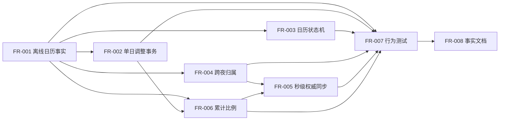

# LetsMakeMoney Windows v1.0.1 产品需求文档

## 1. 追踪信息

| 字段 | 内容 |
| --- | --- |
| 文档状态 | 完整可开发 PRD，已确认并进入开发承接 |
| PRD 类型 | 发布后可信度修复型 |
| 目标版本 | v1.0.1 Stable |
| 产品基线 | LetsMakeMoney Windows v1.0 Stable |
| 技术基线 | Rust + Tauri + TypeScript/React |
| 上游需求 | `V101-IDEA-001` 至 `V101-IDEA-008` |
| 上游文档 | `doc/releases/v1.0.1/idea-pool.md` |
| 事实来源 | 当前 `main` 代码、v1.0 正式文档、v1.0 发布后 Review |
| 原型来源 | `doc/prototypes/v1.0/` |
| 最后更新 | 2026-07-27 |

### 1.1 IDEA 到需求映射

| IDEA | PRD 需求 | 类型 | 优先级 |
| --- | --- | --- | --- |
| V101-IDEA-001 | V101-FR-001 真实中国大陆节假日与调休数据 | 发布后缺陷 | P0 |
| V101-IDEA-002 | V101-FR-002 手动日期调整事务 | 发布后缺陷 | P0 |
| V101-IDEA-003 | V101-FR-003 日历加载、失败与旧数据保护 | 发布后缺陷 | P0 |
| V101-IDEA-004 | V101-FR-004 跨夜班次归属 | 发布后缺陷 | P0 |
| V101-IDEA-005 | V101-FR-005 秒级收益与权威同步 | 产品合同修正 | P0 |
| V101-IDEA-006 | V101-FR-006 累计比例与分币尾差 | 产品合同修正 | P0 |
| V101-IDEA-007 | V101-FR-007 行为级验证门禁 | 工程质量 | P1 |
| V101-IDEA-008 | V101-FR-008 当前事实文档收口 | 文档治理 | P1 |

## 2. 背景

v1.0 已将 LetsMakeMoney 收敛为无宠物的本地收入进度工具，并完成稳定版发布。发布后 Review 发现，产品界面已经承诺“中国大陆节假日与调休”“手动调整日期”“跨夜班次”和“实时收益”，但生产链路中仍有以下可信度缺口：

1. 前端传给 Rust 的法定节假日和调休工作日列表固定为空。
2. 日历单日调整只存在于 React 会话状态，未写入配置，也未触发全局重算。
3. 切换月份失败时可能出现“新月份标题 + 旧月份网格”的误导组合。
4. Rust 已支持班次归属日与当前自然日分离，但前端始终传入同一天。
5. 界面每秒刷新，权威计算输入却只有分钟精度。
6. 日薪采用整数分币除法，完整工作月累计可能不等于用户输入的月薪。
7. 当前部分验证脚本只检查代码文本，无法证明行为真实闭环。

v1.0.1 的目标不是扩展产品范围，而是让收入、日历和状态结果可解释、可复算、可恢复并可由真实行为测试证明。

## 3. 产品定位与目标用户

### 3.1 产品定位

LetsMakeMoney 是一款 Windows 本地收入进度工具。用户配置月薪和工作作息后，应用以迷你收入视图、今日工作台和收入日历展示当前工作状态、今日收益、月度累计和工作安排。

### 3.2 目标用户

- 希望在工作日中直观看到实时收入和进度的固定月薪用户。
- 存在单休、双休、大小周或夜班作息的用户。
- 需要按中国大陆法定节假日、调休和个人临时安排修正工作日口径的用户。
- 重视本地存储、无需账号和云端服务的 Windows 用户。

### 3.3 核心场景

1. 启动应用后，迷你视图按当前秒显示收入和状态。
2. 打开今日工作台，核对今日安排、进度和月度累计。
3. 在日历中查看法定节假日、调休工作日、带薪休息、不带薪休息和个人手动调整。
4. 将某一天临时改为工作日、带薪休息或不带薪休息，保存后所有窗口立即重算。
5. 夜班跨过午夜后，仍按班次开始日展示收入与状态。
6. 日历资源异常时继续使用最后一次成功数据，并明确提示数据已过期。

## 4. 版本目标与成功标准

### 4.1 版本目标

1. 2025、2026 年中国大陆法定节假日与调休数据真实进入生产计算。
2. 单日手动调整形成安全、可取消、可失败回滚、可持久化的配置事务，并区分带薪休息与不带薪休息。
3. 日历加载失败不再将旧月份数据伪装为新月份。
4. 跨夜班次在午夜前后使用同一个班次归属日。
5. 工作期间金额按真实秒级变化，并定期由 Rust 权威结果校正。
6. 完整工作月的累计金额严格等于用户配置的月薪，精确到分。
7. 每个 P0 缺陷都有修复前失败、修复后通过的行为级测试。
8. 当前事实文档不再混淆 v1.0 发布基线、当前开发 HEAD 与 v1.0.1 候选。

### 4.2 可量化成功标准

| 编号 | 标准 |
| --- | --- |
| SC-001 | 2025、2026 年通知中的全部放假日和调休工作日与离线数据逐日一致 |
| SC-002 | 工作日、带薪休息或不带薪休息调整成功后，配置、日历、今日状态、月工作日、应计金额、月累计和下个工作日使用同一结果 |
| SC-003 | 手动调整失败时，配置文件哈希和运行态有效结果均不改变，草稿仍可继续编辑 |
| SC-004 | 日历切月失败时，界面不存在“目标月份标题 + 上一次月份网格”组合 |
| SC-005 | 夜班在午夜前后保持同一 `schedule_owner_date`，且整个班次只由归属日工作属性决定 |
| SC-006 | 有效工作区间内界面金额每秒单调不减；启动、恢复和边界切换时立即获得权威结果 |
| SC-007 | 对任意合法月薪和工作日数，月末累计金额等于月薪分币值 |
| SC-008 | v1.0 迷你视图、工作台、Settings、Wizard、托盘和配置事务无回归 |

## 5. 已确认方案

### 5.1 日历数据

- 数据来源：国务院办公厅年度节假日安排通知。
- 交付方式：随应用打包的版本化离线 JSON，不在运行时联网抓取。
- 支持年份：2025、2026。
- 不支持年份：明确提示；按用户长期休息模式降级计算；不猜测法定节假日；手动日期调整仍可用。
- 数据来源元信息必须记录通知名称、文号、成文日期、官方 URL、数据版本和文件 SHA-256。

权威来源：

| 年份 | 文号 | 成文日期 | 官方来源 |
| --- | --- | --- | --- |
| 2025 | 国办发明电〔2024〕12号 | 2024-11-12 | `https://www.gov.cn/gongbao/2024/issue_11726/material/gwygb202433.pdf` |
| 2026 | 国办发明电〔2025〕7号 | 2025-11-04 | `https://www.gov.cn/gongbao/2025/issue_12406/material/gwygb202532.pdf` |

### 5.2 日期调整

- 用户在日历中选择一个日期并形成草稿。
- 只有点击“应用”后才调用现有安全配置事务。
- 保存成功后统一替换有效配置并触发全链路重算。
- 取消或关闭不产生任何影响。
- 保存失败保留草稿和错误说明，不污染旧配置。
- 移除无实际行为的“允许手动调整”开关，不新增替代伪开关。

### 5.3 跨夜班次

- 整个班次归属上班开始所在的自然日。
- 班次结束日是否为周末、节假日或手动带薪/不带薪休息，不改变已开始班次。
- 归属日手动调整优先于离线节假日和长期休息模式。
- 界面在跨日时明确显示“7 月 27 日夜班”等归属提示。

### 5.4 秒级收益

- 前端根据最近一次权威快照每秒平滑推进展示。
- Rust 每 30 秒返回一次权威快照。
- 启动、系统恢复、窗口打开、配置保存、日期调整以及上班/午休/复工/下班边界必须立即同步。
- 系统休眠或时间跳变后不得按休眠持续时间继续累加；必须按恢复后的本地墙上时间重新计算。

### 5.5 金额

- 金额统一使用整数分币值参与权威计算。
- 月度累计采用累计比例算法，不再将截断后的固定日薪简单相加。
- 当月最后一个工作日完成后，月累计必须严格等于月薪。

## 6. 范围

### 6.1 本版范围

- 真实节假日与调休离线数据。
- 单日手动调整事务。
- 日历加载、空、失败、重试、过期数据和不支持年份状态。
- 跨夜班次归属。
- 秒级收益和权威校正。
- 累计比例金额算法。
- 行为级测试。
- 当前事实文档收口。

### 6.2 非目标

1. 不恢复宠物功能，不接入 PetManager。
2. 不新增账号、云同步或远端数据服务。
3. 不新增主题系统。
4. 不新增安装器或静默更新。
5. 不重写整体 UI、窗口架构或 Tauri/Rust 边界。
6. 不扩展到 2024 及更早年份，也不预置 2027 年猜测数据。
7. 不建设在线节假日更新中心。
8. 不建设工时打卡、实际出勤记录或历史收入账本。
9. 不修改 v1.0 tag、Release 和既有发布附件。

## 7. 数据与计算合同

### 7.1 离线日历资源

建议目录：

```text
apps/windows-v1/calendar-datasets/
  manifest.json
  cn-mainland-2025.json
  cn-mainland-2026.json
```

`manifest.json` 最小合同：

```json
{
  "schema_version": 1,
  "dataset_version": "cn-mainland-2025-2026-v1",
  "entries": [
    {
      "region": "CN-MAINLAND",
      "year": 2025,
      "file": "cn-mainland-2025.json",
      "sha256": "<文件 SHA256>",
      "authority": "国务院办公厅",
      "document_no": "国办发明电〔2024〕12号",
      "published_at": "2024-11-12",
      "source_url": "https://www.gov.cn/gongbao/2024/issue_11726/material/gwygb202433.pdf"
    }
  ]
}
```

年度文件最小合同：

```json
{
  "schema_version": 1,
  "region": "CN-MAINLAND",
  "year": 2025,
  "statutory_holidays": ["2025-01-01"],
  "adjusted_workdays": ["2025-01-26"]
}
```

约束：

1. 日期使用 `YYYY-MM-DD`。
2. 日期必须属于声明年份，列表内不得重复。
3. 同一日期不得同时出现在两个列表。
4. `manifest` 中的 SHA-256 必须与发布包内年度文件一致。
5. 资源加载前必须验证 schema、年份、日期和哈希。
6. 数据不记录用户月薪、作息或其他个人信息。
7. 发布包验证必须证明两个年度文件和 `manifest` 均存在且非空。

### 7.2 工作日优先级

单日工作属性按以下固定优先级解析：

```text
手动日期调整
  > 官方调休工作日
  > 官方放假日
  > 单休 / 双休 / 大小周长期规则
```

“恢复自动判断”表示删除该日期的 `date_overrides` 条目，然后重新按后三层规则解析。

### 7.3 配置兼容

- 沿用现有 `date_overrides: DateOverride[]`，字段为 `date`、`kind`、`note`。
- `kind` 在 v1.0.1 中只允许 `workday`、`paid_rest`、`unpaid_rest`；恢复自动判断通过删除对应条目表达，不保存 `auto`。
- 不新增数据库。
- 不新增“允许手动调整”配置键。
- v1.0 的 `workday` 覆盖原样保留。
- v1.0 的旧 `rest_day` 若其底层自动结果为工作日，迁移为 `paid_rest`，以保持固定月薪下原有“休息但不扣薪”的兼容语义。
- v1.0 的旧 `rest_day` 若其底层自动结果本就是休息日，则属于冗余覆盖；完成配置备份后删除该条目，恢复自动判断。
- 未知 `kind` 不得猜测映射：保留原配置备份，拒绝采用该条覆盖并记录可读兼容错误。
- `calendar_dataset_version` 更新为当前离线资源版本；版本迁移不得删除未知但合法的手动调整。
- v1.0 配置加载失败时继续使用现有备份与恢复机制。
- 若新数据资源不可用，不得改写配置中的 `date_overrides`。

### 7.4 跨夜时间轴

定义：

- `owner_date`：班次开始所在日期。
- `now_date`：当前本地自然日。
- `start`：上班时间相对 `owner_date` 的秒偏移。
- 当 `work_end_time <= work_start_time` 时，班次跨夜，结束时间增加 24 小时。
- 跨夜班次中的午休时间若早于上班时间，则按次日时间增加 24 小时。
- 必须满足 `start <= lunch_start <= lunch_end <= end`；零午休允许 `lunch_start == lunch_end`。

归属规则：

1. 非跨夜班次的 `owner_date` 等于 `now_date`。
2. 跨夜班次在午夜后、下班前，`owner_date = now_date - 1 天`。
3. 跨夜班次下班后、下一班开始前，使用当前自然日作为下一条班次候选日，不延续上一班。
4. 整个班次的工作/休息属性只解析 `owner_date`。
5. 夜班开始后，即使次日是法定节假日，也继续计算到本班次结束。
6. 若 `owner_date` 被手动改为 `paid_rest` 或 `unpaid_rest`，整段班次不进入工作阶段，也不产生有效工时；金额按第 7.6 节的带薪/不带薪规则处理。

### 7.5 秒级权威时间

权威输入至少包含：

- `owner_date`：`YYYY-MM-DD`
- `now_date`：`YYYY-MM-DD`
- `now_time`：`HH:mm:ss`
- 当前本地时区偏移
- 作息配置
- 有效日历数据

前端本地推进规则：

1. 只在权威快照处于有效工作区间时推进。
2. 每个整秒重算显示，不通过“上次金额 + 固定分币”累加。
3. 午休、休息日、上班前和下班后不推进。
4. 每 30 秒请求权威快照。
5. 窗口隐藏时可暂停视觉计时；恢复显示时必须立即权威同步。
6. 前端结果和权威结果相差超过 1 分、业务阶段不同或归属日不同，立即以权威结果覆盖并记录校正日志。
7. 休眠恢复、系统时间跳变、时区变化后立即重算，不补记不可确认的休眠区间。

### 7.6 累计比例金额公式

定义：

- `S`：月薪分币值，正整数。
- `N`：当月工资分配槽位数量。自动工作日会产生槽位；在自动休息日上手动设为工作日会新增槽位；将自动工作日改为带薪或不带薪休息时保留原槽位。
- `W`：应用全部手动调整后的预计实际工作日数量，不包含 `paid_rest` 和 `unpaid_rest`，用于界面展示“预计本月工作日”。
- `k`：目标日期对应当月第 `k` 个工资分配槽位，取值 `1..N`。
- `p`：当前工作日有效工时进度，取值 `0..1`。
- `R(x)`：对正有理数执行四舍五入到整数分，0.5 向上。

工作日结束边界累计：

```text
C(k) = R(S × k / N)
C(0) = 0
```

第 `k` 个工作日的目标收入：

```text
D(k) = C(k) - C(k - 1)
```

工作日进行中的月累计：

```text
M(k, p) = R(S × (k - 1 + p) / N)
```

今日已赚：

```text
T(k, p) = M(k, p) - C(k - 1)
```

日期覆盖与槽位规则：

1. 自动工作日或手动工作日：保留槽位并按工作进度产生 `T(k,p)`。
2. 带薪休息：保留槽位，不产生有效工时；当本地日期到达该日 00:00 后，该槽位按 `D(k)` 全额计入本月累计。
3. 不带薪休息：保留槽位，不产生有效工时，也不计入本月累计；本月预计应发金额扣除该槽位的 `D(k)`。
4. 自动周末或官方休息日：不产生槽位、不产生当日收入，也不从固定月薪中扣除金额。
5. 自动休息日上的手动工作日会新增槽位并重算 `N`、`D(k)` 和后续序号。
6. 只有底层自动结果为工作日的日期，才能新建 `paid_rest` 或 `unpaid_rest`；自动休息日上的两个选项必须禁用并解释“该日本就是休息日，无需设置请假”。

不带薪休息后的本月预计应发：

```text
S_payable = S - Σ D(k_unpaid)
```

截至当前时刻的本月累计：

```text
Earned(now) =
  Σ 已完成工作日的 D(k)
  + 当前工作日的 T(k, p)
  + Σ 日期不晚于今天的带薪休息 D(k)
```

不带薪休息槽位的贡献恒为 0；未来带薪休息在日期到达前不提前计入“本月累计”。

显示规则：

1. “日薪”显示当前工作日的 `D(k)`，属于本日目标值，不保证每个工作日完全相同。
2. “时薪”显示 `D(k) / 当日有效工作小时`，四舍五入到分，仅作解释性参考。
3. “今日已赚”显示 `T(k,p)`。
4. “本月累计”显示 `Earned(now)`；存在不带薪休息时，同时显示“本月预计应发 `S_payable`”。
5. 自动休息日隐藏今日收益、有效工时和工作进度；不显示“扣薪”。
6. 带薪休息隐藏有效工时和工作进度，状态显示“带薪休息”，金额字段改为“今日带薪金额 `D(k)`”。
7. 不带薪休息隐藏今日收益、有效工时和工作进度，状态显示“不带薪休息”，并明确本月预计应发已扣除当天金额。
8. 没有不带薪休息且所有工资分配槽位均已结算时，月累计严格等于 `S`。
9. 所有权威金额使用整数分币或整数比例运算，禁止由二进制浮点累计得到。
10. 手动调整任意日期后，`N`、`W`、槽位序号和整月派生金额即时重算；本产品不保存不可变的历史出勤账本。
11. 当 `N = 0` 时返回可读配置错误，不显示伪造金额。

示例：

```text
月薪：10,000.00 元 = 1,000,000 分
工作日：23 天
C(1) = 43,478 分
C(2) = 86,957 分
D(1) = 43,478 分
D(2) = 43,479 分
C(23) = 1,000,000 分
```

同一示例中，若第 5 个工资分配槽位 `D(5) = 43,478 分`：

- 设为带薪休息：当天无有效工时；日期到达后本月累计增加 434.78 元，本月预计应发仍为 10,000.00 元。
- 设为不带薪休息：当天无有效工时和今日收益；本月预计应发变为 9,565.22 元。
- 若该日期原本就是普通周末，则不存在第 5 个工资分配槽位，不显示请假选项，也不扣减月薪。

## 8. 功能需求

## V101-FR-001 真实中国大陆节假日与调休数据

### 目标

让 2025、2026 年的日历、月工作日、今日状态、下个工作日和收入计算使用同一份经校验的官方离线数据。

### 入口与出口

- 入口：应用启动、打开迷你视图、打开工作台、打开日历、打开 Settings、配置保存、日期变化。
- 正常出口：加载对应年度数据并交给 Rust 日历解析。
- 降级出口：不支持年份或数据异常时使用长期休息模式，并显示可读提示。

### 正常流程

1. 应用根据目标月份选择年度文件。
2. 校验 `manifest`、年度、schema、SHA-256 和日期集合。
3. 将官方放假日、调休工作日和用户 `date_overrides` 组合为 `CalendarData`。
4. Rust 按固定优先级解析日历。
5. 日历、Dashboard、下个工作日和金额计算消费同一结果。

### 分支与失败

- 目标年份为 2025 或 2026：使用离线数据。
- 目标年份不在支持范围：显示“该年份暂无法定节假日数据，当前按休息模式计算”；允许手动调整。
- 资源缺失、哈希不匹配、格式错误：不得使用半份数据；使用最后一次成功数据或长期规则降级。
- 单个年度加载失败不影响另一个年度文件。

### 日志

- `calendar.dataset.loaded`
- `calendar.dataset.unsupported`
- `calendar.dataset.invalid`
- `calendar.dataset.fallback`

日志包含年份、数据版本、结果和错误类别，不记录用户薪资和完整配置。

### 影响范围

- UI：日历状态条、Settings 日历数据说明。
- TypeScript：日历资源选择、验证结果消费、`toCalendar` 不再传空列表。
- Rust：继续使用现有 `CalendarData` 与优先级；必要时补充资源验证 command，不重写日历核心。
- 配置：更新 `calendar_dataset_version`；保留 `date_overrides`。
- 打包：加入 `manifest` 和 2025/2026 年度文件。
- 测试：资源 schema、官方样例日、完整逐日对照、损坏资源和不支持年份。
- 文档：数据来源、支持年份和降级说明。
- 数据库：无数据库影响。

### 验收标准

- 2025-01-28 为休息日，2025-01-26 为调休工作日。
- 2026-02-15 为休息日，2026-02-14 为调休工作日。
- 用户手动调整上述日期后，手动结果优先。
- 2027 年显示不支持提示，不将周末规则伪装成官方日历。

## V101-FR-002 手动日期调整事务

### 目标

让用户对单个日期的工作、带薪休息和不带薪休息调整真实写入配置，并安全影响全部派生结果。

### UI 入口

- 日历页点击日期。
- 日历页“调整日期”按钮；打开后默认定位已选日期或今天。

### 调整弹层

必须显示：

- 完整日期和星期。
- 当前自动判断：工作日/休息日。
- 判断来源：官方调休、官方放假、单休/双休/大小周。
- 四个选择：自动判断、设为工作日、设为带薪休息、设为不带薪休息。
- 带薪休息说明：不计算工时，保留当天工资分配金额。
- 不带薪休息说明：不计算工时，并从本月预计应发金额中扣除当天工资分配金额。
- 当底层自动结果为休息日时，带薪与不带薪选项禁用，并显示“该日期按当前日历本就是休息日，无需设置请假；可恢复自动或改为工作日”。
- 影响说明：保存后将重算当月实际工作日、工资分配槽位、日薪、时薪、今日状态、月累计、本月预计应发和下个工作日。
- “取消”和“应用”。

### 正常流程

1. 用户选择日期，弹层创建独立草稿。
2. 切换选项只更新草稿。
3. 点击“应用”后构造完整配置草稿。
4. 调用现有安全配置写入事务。
5. 写入成功后替换运行态配置。
6. 失效所有相关缓存并请求权威重算。
7. 日历和所有已打开窗口更新。
8. 显示“日期调整已应用”。

### 无变化、取消和关闭

- 当前已是同一手动结果：应用按钮可禁用，或显示“没有需要应用的更改”。
- 自动判断且当前没有覆盖：视为无变化。
- 选择“自动判断”且存在覆盖：成功后删除该日期覆盖。
- 点击取消、右上角关闭或 `Esc`：丢弃草稿，不写配置、不重算。

### 保存失败

- 弹层保持打开。
- 用户选择保留。
- 显示可读原因与“重试”。
- 旧配置文件和运行态保持不变。
- 不显示成功反馈。
- 日历和金额继续使用旧有效结果。

### 日志

- `calendar.override.opened`
- `calendar.override.applied`
- `calendar.override.removed`
- `calendar.override.unchanged`
- `calendar.override.cancelled`
- `calendar.override.failed`

`calendar.override.applied` 必须包含脱敏后的 `kind=workday|paid_rest|unpaid_rest` 和日期，不记录月薪或具体金额。

### 影响范围

- UI：日历单日调整弹层、成功/无变化/失败反馈。
- TypeScript：移除会话态 `useCalendarOverrides` 作为事实源，改为配置草稿和事务结果。
- Rust：复用配置安全写入与 `DateOverride`；重算 command 使用新有效配置。
- 配置：更新或删除单个 `date_overrides` 条目。
- 用户数据：安全写入、备份和失败回滚沿用 v1.0。
- 测试：工作日、带薪休息、不带薪休息、自动休息日禁用请假、应用、取消、关闭、无变化、失败、重启持久化、恢复自动、当日调整、过去日期调整和旧 `rest_day` 迁移。
- 文档：解释手动调整优先级、带薪/不带薪金额语义和整月重算影响。
- 数据库：无数据库影响。

### 验收标准

1. 调整成功后重启仍保留。
2. 调整失败前后 `config.json` 有效内容与哈希不变。
3. 取消和关闭前后配置、日志中的保存事件和界面结果均不变化。
4. 对今天调整后，迷你视图、工作台和日历在一次权威同步内一致。
5. 自动工作日改为带薪休息后，当日无有效工时，今日带薪金额为该槽位 `D(k)`，本月预计应发不减少。
6. 自动工作日改为不带薪休息后，当日无有效工时和今日收益，本月预计应发准确减少 `D(k)`。
7. 自动休息日无法新建带薪或不带薪休息覆盖，但可以恢复自动或设为工作日。

## V101-FR-003 日历加载、失败与旧数据保护

### 状态模型

| 状态 | 界面 |
| --- | --- |
| loading | 保留窗口骨架，显示日历加载占位；禁用会产生歧义的日期调整 |
| ready | 直接显示目标月份网格；正常可用状态不额外占用页面空间 |
| empty | 仅在没有任何可用月份数据时显示空状态和重试 |
| stale | 显示最后成功月份的标题与网格，并显示“数据未更新”提示和重试 |
| error | 没有旧数据时显示失败原因、重试和长期规则降级说明 |
| unsupported | 显示不支持年份提示，网格按长期规则解析并允许手动调整 |

### 一致性规则

1. 月份标题、星期偏移和网格必须来自同一个成功结果对象。
2. 用户切换到目标月份时，目标月份只作为“正在加载 2026 年 8 月”展示，不先替换已成功月份标题。
3. 新请求发出后，旧请求返回不得覆盖更新的目标。
4. 加载失败时不得清空最后一次成功数据。
5. 失败后点击重试只重试当前目标月份。
6. 手动调整草稿打开时，切月必须先关闭或取消草稿。

### 日志

- `calendar.month.loading`
- `calendar.month.loaded`
- `calendar.month.empty`
- `calendar.month.stale`
- `calendar.month.failed`
- `calendar.month.retry`
- `calendar.month.late_result_ignored`

### 影响范围

- UI：日历加载、空、过期、失败、重试、不支持年份状态。
- TypeScript：`useCalendarMonth` 使用带请求标识的显式状态机。
- Rust：返回可分类错误，不静默吞掉。
- 配置：无新字段。
- 测试：快速连续切月、晚到结果、首次失败、有旧数据失败、重试成功和不支持年份。
- 文档：日历状态说明。
- 数据库：无数据库影响。

### 验收标准

- 任何失败场景下都不能出现标题与网格月份不一致。
- 有旧数据时失败不出现空白日历。
- 无旧数据时不会伪造旧数据。
- 重试成功后错误提示消失，目标月份完整替换旧月份。

## V101-FR-004 跨夜班次归属

### 目标

修复午夜后的夜班状态、收入、休息日和日历归属。

### 正常流程

1. 根据作息判断是否跨夜。
2. 根据当前本地日期和时间解析 `owner_date`。
3. 以 `owner_date` 解析工作属性和当月工作日序号。
4. 将 `owner_date`、`now_date`、秒级 `now_time` 交给 Rust。
5. Rust 在统一时间轴计算上班、午休、复工和下班阶段。
6. UI 对跨日班次显示归属日期提示。

### 边界矩阵

以 22:00–06:00、02:00–02:30 午休为例：

| 当前时间 | owner_date | 状态 |
| --- | --- | --- |
| 7 月 27 日 21:59:59 | 7 月 27 日 | 上班前 |
| 7 月 27 日 22:00:00 | 7 月 27 日 | 工作中 |
| 7 月 28 日 01:59:59 | 7 月 27 日 | 工作中 |
| 7 月 28 日 02:00:00 | 7 月 27 日 | 午休 |
| 7 月 28 日 02:30:00 | 7 月 27 日 | 工作中 |
| 7 月 28 日 06:00:00 | 7 月 27 日 | 下班后 |
| 7 月 28 日 08:00:00 | 7 月 28 日 | 下一班上班前或休息日 |

### 失败处理

- 午休区间无法映射到班次时间轴：Settings 阻止保存并定位错误字段。
- 系统时间回拨或跃迁：立即权威重算。
- 日期解析失败：显示“暂时无法计算”，不继续使用错误归属日。

### 日志

- `schedule.owner_date.resolved`
- `schedule.overnight.invalid`
- `schedule.wall_clock_changed`

### 影响范围

- UI：跨夜归属提示、今日安排跨日文案。
- TypeScript：`owner_date` 解析和秒级时间输入。
- Rust：沿用现有跨夜区间，补齐零午休和秒级测试。
- 配置：不新增字段。
- 测试：午夜前后、午休、下班边界、归属日节假日、次日节假日、归属日手动覆盖。
- 文档：夜班归属解释。
- 数据库：无数据库影响。

### 验收标准

- 夜班跨午夜后金额不归零。
- 次日休息日不会截断前一工作日已开始的夜班。
- 归属日改为带薪或不带薪休息后整段夜班不产生有效工时；金额分别按带薪全额或不带薪扣除规则处理。

## V101-FR-005 秒级收益与权威同步

### 目标

让“实时收益”按真实秒变化，同时避免前端临时显示与 Rust 权威结果长期漂移。

### 刷新触发

| 触发 | 要求 |
| --- | --- |
| 可见窗口工作中 | 每秒本地重算显示 |
| 正常运行 | 每 30 秒权威同步 |
| 应用启动 | 立即权威同步 |
| 系统恢复/时间变化 | 立即权威同步 |
| 迷你视图或工作台打开 | 立即权威同步 |
| 配置保存成功 | 立即权威同步 |
| 日期调整成功 | 立即权威同步 |
| 上班、午休、复工、下班边界 | 立即权威同步 |

### 失败与恢复

- 单次权威同步失败：保留最近一次成功快照，显示非阻塞“正在重新同步”；不得无限推算超过下一个业务边界。
- 连续失败跨过边界：停止本地推进并显示“暂时无法计算”。
- 下一次成功后恢复正常并清除提示。
- 失败不得写配置或修改日历。

### 日志

- `earnings.authoritative_sync.completed`
- `earnings.authoritative_sync.failed`
- `earnings.authoritative_sync.drift_corrected`
- `earnings.boundary.recalculated`
- `earnings.local_tick.paused`

正常每秒 tick 不写日志，避免日志膨胀。

### 影响范围

- UI：秒级金额、同步提示、不可计算状态。
- TypeScript：本地纯计算、30 秒调度和边界调度。
- Rust：接受秒级时间并返回权威快照。
- 配置：无新字段。
- 性能：不得将每秒刷新恢复成每秒多次 IPC。
- 测试：固定时钟逐秒、午休边界、隐藏/恢复、休眠、时间回拨、同步失败和漂移校正。
- 文档：说明实时收益为计划作息推算，不是考勤记录。
- 数据库：无数据库影响。

### 验收标准

- 8 小时工作日内，相邻秒的结果符合累计比例公式。
- 午休期间金额不增长。
- 恢复窗口后 1 秒内显示权威结果。
- 正常运行 10 分钟内权威同步次数符合 30 秒节奏，不出现每秒 IPC。

## V101-FR-006 累计比例与分币尾差

### 目标

消除完整工作月累计与月薪不一致的问题，并让日薪差异可解释。

### 正常流程

1. 使用日历解析得到 `N`。
2. 使用目标日期得到工作日序号 `k`。
3. 使用有效工时得到 `p`。
4. 按第 7.6 节公式计算日目标、今日已赚和月累计。
5. 统一格式化为两位小数。

### 分支

- 自动休息日：不计算当日目标，不产生槽位，不扣减月薪。
- 带薪休息：保留槽位和 `D(k)`，无有效工时；日期到达后将 `D(k)` 计入累计。
- 不带薪休息：保留槽位但贡献为 0，本月预计应发扣除 `D(k)`。
- 手动调整过去日期：重算 `N`、`W`、槽位序号、本月累计和预计应发金额。
- 月薪为 0：允许显示 0，但工作日和状态仍正常；若现有配置合同要求大于 0，则延续现有校验，不在本版改变。
- `N = 0`：显示配置错误，不除以零。

### 日志

- `earnings.month_calculated`
- `earnings.invalid_denominator`

日志不得记录月薪原值，只记录月份、工作日数、结果状态和算法版本。

### 影响范围

- UI：日薪可能在相邻工作日相差 0.01 元；必要时在计算说明中解释。
- TypeScript：展示字段消费新的权威结果。
- Rust：金额公式改为累计比例和整数分币。
- 配置：无新字段。
- 测试：属性测试、边界值、不同月薪、不同槽位数、月中、月末、带薪休息、不带薪休息、自动休息日和日期调整后重分配。
- 文档：公式与复算示例。
- 数据库：无数据库影响。

### 验收标准

- 对合法 `S`、`N`，`C(N) == S`。
- `C(k) >= C(k-1)`。
- 所有 `D(k)` 之和等于 `S`。
- 今日金额和月累计不会因浮点误差出现负分、NaN 或多一分。
- 任意不带薪休息集合下，`S_payable = S - ΣD(k_unpaid)`，且结果不小于 0。
- 带薪休息不会降低 `S_payable`；自动周末和官方休息日既不增加槽位也不降低 `S_payable`。

## V101-FR-007 行为级验证门禁

### 目标

用真实输入和输出证明 P0 行为，不再以关键字符串存在作为通过依据。

### 必须新增的行为测试

| 测试层 | 覆盖 |
| --- | --- |
| Rust 单元/属性测试 | 日历优先级、跨夜时间轴、累计比例、月底守恒、秒级边界 |
| TypeScript 行为测试 | 日历状态机、日期调整草稿、带薪/不带薪选项可用条件、取消、失败保留、晚到请求忽略、本地 tick |
| Tauri command 测试 | 资源加载、配置事务、旧 `rest_day` 迁移、重算输入输出和错误分类 |
| 打包验证 | 2025/2026 数据、manifest、SHA-256 和版本身份 |
| Computer Use | 日期调整正常/失败、日历加载状态、夜班文案、秒级金额和跨窗口一致性 |
| 人工补证 | Windows 休眠恢复、系统时钟变化和长时间运行 |

### 门禁原则

1. 每个 P0 至少有一个修复前失败、修复后通过的测试。
2. 测试配置和日志使用隔离目录，不污染 `%APPDATA%` 用户数据。
3. 静态字符串检查只能作为文档/结构辅助，不得证明业务通过。
4. Computer Use 不能操作的系统级路径明确标记待人工补证。
5. 自动测试通过不等于 GUI 验收通过。

### 影响范围

- 测试：`apps/windows-v1/tests/`、Rust tests、验证脚本。
- CI：纳入现有 Windows 验证流程，不创建第二套重复 workflow。
- 业务代码：仅允许为可测试性注入固定时钟和隔离数据路径，不进行架构重写。
- 文档：verification 与 manual verification 预先定义证据入口。
- 数据库：无数据库影响。

### 验收标准

- 删除任一关键实现或恢复旧缺陷时，对应行为测试失败。
- CI 能在无用户配置的隔离环境运行。
- 失败输出包含测试用例、输入和期望，不泄露本机敏感路径。

## V101-FR-008 当前事实文档收口

### 目标

建立 v1.0 发布基线、当前开发状态和 v1.0.1 候选之间的单一事实关系。

### 文档范围

- `README.md`、`README.en.md`
- `doc/current.md`
- `doc/releases/v1.0.1/`
- v1.0 发布文档中需要修正的当前状态引用
- 用户手册中的支持年份、日历调整和金额公式
- Issue/PR 模板中已失效的版本口径

### 规则

1. 不重写 v1.0 的历史验收结论。
2. 历史文档明确标注版本，不作为当前事实源。
3. 当前事实只由 `doc/current.md` 和目标版本 release 文档承载。
4. v1.0 tag、Release 和附件哈希保持不变。
5. 文档不得包含本机绝对路径、真实用户配置、日志或验收临时目录。
6. 中英文 README 的功能和限制同步更新。

### 影响范围

- 文档：当前事实、发布说明、用户手册、模板。
- 脚本：文档状态、UTF-8、乱码、本地链接和敏感路径检查。
- 业务代码：无。
- 配置：无。
- 数据库：无数据库影响。

### 验收标准

- README、current、PRD、progress、verification 和 release notes 对版本状态表述一致。
- 文档状态检查、UTF-8、乱码、本地链接和 `git diff --check` 通过。
- 不将未执行的 GUI 或人工验证写成通过。

## 9. 跨需求联动



### 9.1 必须串行

1. 先固定 FR-001 数据合同和金额合同。
2. 再实现 FR-002、FR-003、FR-004、FR-006。
3. FR-005 依赖跨夜和金额权威结果。
4. FR-007 在各需求实现过程中同步建立，最终作为共同门禁。
5. FR-008 在行为与候选身份稳定后收口。

### 9.2 可并行

- 2025/2026 数据制作与日历 UI 状态设计。
- 手动日期调整事务与跨夜固定时钟测试。
- 文档框架与测试夹具准备。

## 10. 总体影响范围

| 范围 | 影响 | 对应 FR |
| --- | --- | --- |
| React 页面 | 日历弹层、带薪/不带薪状态、加载/失败/过期提示、夜班归属文案、同步状态 | 002、003、004、005、006 |
| React 状态模型 | 日历显式状态机、日期覆盖类型、配置事务结果、秒级本地快照 | 002、003、005 |
| Rust domain | 跨夜归属输入、工资分配槽位、带薪/不带薪金额、累计比例金额、秒级时间 | 002、004、005、006 |
| Tauri commands | 离线资源加载、错误分类、权威快照 | 001、003、005 |
| 配置 | 保留 `date_overrides` 结构，新增合法枚举并迁移旧 `rest_day`，更新数据版本 | 001、002 |
| 离线资源 | 2025/2026 年度 JSON、manifest、SHA-256 | 001 |
| 用户数据 | 手动调整持久化；失败不污染旧配置 | 002 |
| 日志与诊断 | 数据、调整、日历、跨夜、同步和金额语义事件 | 001-006 |
| 构建与打包 | 数据资源进入便携 Zip 并验证身份 | 001、007 |
| 自动化测试 | Rust、TypeScript、command、包验证 | 001-007 |
| 真实桌面验收 | 日历事务、错误状态、夜班文案、秒级金额 | 002-007 |
| 文档 | 当前事实、公式、支持年份、验收和发布说明 | 008 |
| v1.0 回归 | 迷你视图、工作台、Settings、Wizard、托盘、配置恢复 | 全部 |
| 数据库 | 当前项目无数据库，本版不新增数据库 | 全部 |

## 11. 兼容、回滚与数据保护

### 11.1 配置兼容

- v1.0 配置可通过一次可回滚迁移升级；迁移前创建配置备份。
- 已有 `workday` 覆盖不丢失；旧 `rest_day` 按第 7.3 节映射为 `paid_rest` 或删除冗余覆盖。
- 迁移成功后才替换有效配置；迁移失败继续使用旧配置和旧运行态，并显示可读错误。
- 新版本不修改 v1.0 发布包。
- 新版本配置若仅更新 `calendar_dataset_version`，回退 v1.0 时未知版本值不得导致配置整体不可读；必要时通过配置迁移保持旧字段兼容。

### 11.2 功能降级

- 日历资源失败：最后成功数据 → 长期休息模式，按可用级别降级。
- 权威同步失败：最近成功快照短时展示 → 到达业务边界后停止本地推进。
- 单日调整失败：继续使用旧有效配置。
- 金额计算分母无效：显示可读错误，不显示伪造金额。

### 11.3 版本回滚

- 保留 v1.0 Stable 便携 Zip 和配置备份。
- 回滚前备份 `%APPDATA%\LetsMakeMoney\config.json`。
- v1.0.1 不引入不可逆数据库；日期覆盖枚举迁移可通过配置备份回滚。
- 若出现收入或日历错误，退出 v1.0.1，恢复备份配置并启动 v1.0。

## 12. 日志与隐私

### 12.1 必须可检索的语义

- 日历数据版本、年份、加载结果。
- 日期调整打开、应用、删除、无变化、取消和失败；应用事件包含 `workday|paid_rest|unpaid_rest` 类型。
- 旧 `rest_day` 迁移成功、冗余删除和迁移失败。
- 日历月份加载、失败、过期、重试和晚到结果忽略。
- 跨夜 owner date 解析。
- 权威同步成功、失败和漂移校正。
- 金额分母错误。

### 12.2 禁止记录

- 月薪原值、日薪、时薪和具体收益金额。
- 用户名、完整本机路径、配置全文。
- 每秒 tick 明细。
- 官方数据文件全文。

## 13. 开发前验收设计

### 13.1 自动化验证

必须覆盖：

1. 2025/2026 全部官方日期逐项对照。
2. 数据缺失、损坏、哈希不匹配和不支持年份。
3. 日历优先级和恢复自动判断。
4. 工作日、带薪休息、不带薪休息、自动休息日禁用请假，以及调整成功、无变化、取消、关闭、失败、重启。
5. 切月失败、重试、晚到结果和标题/网格一致。
6. 跨夜午夜、午休、下班和节假日边界。
7. 秒级推进、30 秒同步、休眠/时间跳变后的重算。
8. 累计比例的守恒、单调和边界属性。
9. v1.0 配置迁移与备份恢复。
10. 发布包离线资源完整性。

### 13.2 Computer Use

必须使用新解压候选包实际验证：

1. 日历切换 2025、2026 和不支持年份。
2. 打开单日调整，完成工作日、带薪休息、不带薪休息和恢复自动；验证自动休息日不可重复设置请假。
3. 保存失败时草稿保留、错误可见、旧配置不变。
4. 日历加载、过期、失败和重试界面。
5. 夜班归属提示与午夜前后固定时钟测试入口；无法安全改系统时间时使用受控测试构建并标明。
6. 工作期间金额相邻秒变化，午休期间不变化。
7. 迷你视图、工作台、日历在调整后结果一致。
8. Settings、Wizard、托盘隐藏与恢复无回归。

### 13.3 必须人工补证

- 真实 Windows 休眠后恢复。
- 真实系统时间手动前拨、回拨和时区变化。
- 连续运行至少 2 小时的秒级显示、CPU、内存和日志增长。
- Computer Use 无法稳定操作时的通知区真实鼠标路径。

### 13.4 截图路径

验收证据至少包含：

```text
.tmp_acceptance/v1.0.1-<timestamp>/evidence/
  identity.json
  calendar-ready.png
  calendar-override-dialog.png
  calendar-override-paid-rest.png
  calendar-override-unpaid-rest.png
  calendar-override-success.png
  calendar-override-failed.png
  calendar-stale.png
  calendar-unsupported-year.png
  overnight-owner-date.png
  earnings-second-before.png
  earnings-second-after.png
  config-before.json
  config-after.json
  debug.log
```

证据目录不得进入 Git 或发布包。

### 13.5 通过标准

- 所有 P0 自动化和真实桌面项目通过。
- 未执行的系统级项目只能标记待人工补证或暂不验证。
- 不存在收入、日历、状态或配置污染发布阻塞。
- v1.0 核心回归通过。
- 发布包身份、资源哈希和文档状态一致。

### 13.6 不通过处理

1. 收入、工作日、夜班归属、日期调整事务或旧配置污染错误均为发布阻塞。
2. 发现阻塞时停止发布，只记录最小修复方向。
3. 修复后必须重新生成候选包、更新哈希并做定向复验。
4. 不把失败记录写入 progress 流水账；复现和修复进入 bugfix log。

## 14. UI 与原型

v1.0.1 不进行整体 UI 重做。现有原型仅增加：

1. 单日调整弹层。
2. 日历 loading、empty、stale、error、unsupported 状态。
3. 重试和恢复自动判断。
4. 跨夜班次归属提示。
5. 权威同步失败的非阻塞反馈。
6. Settings 日历页改为 2025–2026 离线数据说明，并移除无效开关。
7. 日期调整区分带薪休息与不带薪休息；正常可用状态不显示“官方日历已就绪”提示块。

原型路径：

- `doc/prototypes/v1.0/index.html`
- `doc/prototypes/v1.0/app.js`
- `doc/prototypes/v1.0/styles.css`
- `doc/prototypes/v1.0/README.md`

## 15. 风险

| 风险 | 影响 | 控制 |
| --- | --- | --- |
| 官方通知解析遗漏日期 | 工作日和金额错误 | 双人逐日复核、官方样例测试、manifest 哈希 |
| 手动调整触发全月重分配 | 用户看到历史派生金额变化 | 弹层明确带薪/不带薪影响范围，文档说明无考勤账本 |
| 带薪、不带薪与普通周末混淆 | 固定月薪被错误扣减或多计 | 仅自动工作日允许请假覆盖，自动休息日不产生工资槽位 |
| 本地 tick 与权威结果漂移 | 金额跳变 | 30 秒同步、1 分阈值、边界立即同步 |
| 快速切月竞态 | 标题/网格不一致 | 请求 ID 和晚到结果丢弃 |
| 跨夜和午休组合复杂 | 状态错误 | 固定时钟矩阵，不重写已通过区间算法 |
| 行为测试污染用户数据 | 配置丢失 | 隔离目录和测试后清理 |
| 补丁版本改动面偏大 | 回归风险 | 严格限制 8 项需求、逐模块门禁和 v1.0 回滚 |

## 16. 完整 PRD 门禁

以下条件已满足：

- 数据来源、年份和跨年策略已确认。
- 日期调整事务已确认。
- 跨夜归属和节假日优先级已确认。
- 秒级推进和权威同步频率已确认。
- 累计比例金额公式已确认。
- 日历失败与旧数据保护已确认。
- 非目标和回滚边界已确认。

当前状态：**完整可开发 PRD 已确认，开发承接文档已建立。**

确认后才允许生成：

- `doc/releases/v1.0.1/dev_plan_v1.0.1.md`
- `doc/releases/v1.0.1/progress_v1.0.1.md`
- 对应开发日志
