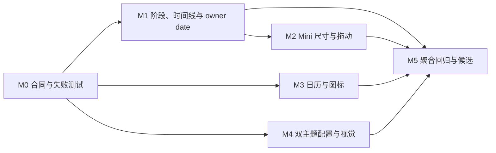

# LetsMakeMoney Windows v1.0.2 开发计划

## 追踪信息

| 项目 | 内容 |
|---|---|
| 当前状态 | 开发承接完成，进入实施 |
| 目标版本 | Windows v1.0.2 Stable |
| 上游来源 | `doc/releases/v1.0.2/idea-pool.md`、`doc/releases/v1.0.2/prd.md` |
| 追踪矩阵 | `doc/releases/v1.0.2/traceability.md` |
| 高保真原型 | `doc/prototypes/v1.0/index.html` |
| 下游承接 | `progress_v1.0.2.md`、`verification.md`、独立 Acceptance |
| 开发日志 | `doc/logs/dev_log_v1.0.2.md` |
| 实施基线 | `main` / `1eb3dadbd37dcc06141e82e5e043db529821a104`，工作树包含已完成的启动误报修复 |
| 最后更新 | 2026-07-28 |

## 1. 开发范围

### 1.1 本次包含

- `FR-001` 阶段化业务边界倒计时。
- `FR-002` 今日安排三列时间线与“休息”语义。
- `FR-003` 迷你视图去冗余、尺寸与拖动合同。
- `FR-004` 日历复合状态与可访问性。
- `FR-005` 固定版本 `lucide-react` 图标体系。
- `FR-006` 调休来源和跨夜 owner date 内容合同。
- `FR-007` 阶段、日历、主题与 DPI 行为门禁。
- `FR-008` 浅色默认、深色可选的双主题系统。

`V102-BUG-001` 启动误报修复作为继承通过基线保留，不重复开发。

### 1.2 本次不包含

- 不修改收入公式、官方日历数据源、日期调整事务口径。
- 不恢复宠物或 PetManager。
- 不加入账号、云同步、安装器、静默更新或多平台能力。
- 不实现系统跟随、定时切换、自定义颜色、第三种主题或主题市场。
- 不重写技术栈、全局状态管理或全部窗口架构。
- 不实现多窗口共享权威同步所有权；只完成测量。
- 无数据库影响。

### 1.3 实施原则

1. 先建立纯呈现函数和失败测试，再接页面。
2. Rust 继续提供权威阶段、owner date 和边界；React 不复制业务规则。
3. 主题草稿遵守现有配置事务：预览可即时，持久化只能由保存成功完成。
4. 全部窗口消费同一主题与配置事件，不维护窗口私有事实源。
5. 所有新增依赖必须固定版本、更新许可声明和包体验证。
6. 每个里程碑只重开受影响验证，最终再执行 v1.0.1 全量回归。

## 2. PRD 对照

| FR | 上游 IDEA | 开发模块 | 主要里程碑 |
|---|---|---|---|
| FR-001 | V102-IDEA-001 | `model.ts`、`authoritativeSync.ts`、阶段选择器 | M0、M1 |
| FR-002 | V102-IDEA-002 | Today 时间线、CSS、文案 | M1 |
| FR-003 | V102-IDEA-003 | Mini 状态、尺寸、拖动、Tauri 窗口 | M2 |
| FR-004 | V102-IDEA-004 | 日历呈现映射、ARIA、键盘状态 | M0、M3 |
| FR-005 | V102-IDEA-005 | `lucide-react`、`AppIcon`、许可与打包 | M3 |
| FR-006 | V102-IDEA-006 | 来源标签、夜班标题与副标题 | M1、M3 |
| FR-007 | V102-IDEA-007 | 行为测试、视觉矩阵、DPI、包验证 | M0-M5 |
| FR-008 | V102-IDEA-010 | config v8、主题会话、令牌、跨窗口事件 | M0、M4 |

## 3. 文件与模块影响

| 模块 / 文件 | 改动类型 | 说明 |
|---|---|---|
| `apps/windows-v1/src/presentation.ts` | 新增 | 阶段、时间线、日历、owner date 的纯呈现选择器 |
| `apps/windows-v1/src/theme.ts` | 新增 | 主题校验、首帧缓存、应用和跨窗口同步 |
| `apps/windows-v1/src/App.tsx` | 修改 | 接入全部可见状态、图标、主题入口和窗口尺寸 |
| `apps/windows-v1/src/components.tsx` | 修改 | 产品级图标按钮和主题安全组件 |
| `apps/windows-v1/src/model.ts` | 修改 | 暴露权威下一边界并维持本地秒级倒计时 |
| `apps/windows-v1/src/authoritativeSync.ts` | 修改 | 本地 tick 返回剩余边界秒数 |
| `apps/windows-v1/src/configModel.ts` | 修改 | config v8、主题草稿、保存/取消/失败补偿 |
| `apps/windows-v1/src/styles.css` | 修改 | 浅深令牌、三列时间线、复合日历、Mini 尺寸和 DPI 稳定性 |
| `apps/windows-v1/index.html` | 修改 | 首帧前恢复主题，避免闪白 |
| `apps/windows-v1/src-tauri/src/config.rs` | 修改 | `theme_mode`、v7→v8 迁移、非法值字段级回退 |
| `apps/windows-v1/src-tauri/src/lib.rs` | 修改 | 配置更新事件和 Mini 尺寸合同 |
| `apps/windows-v1/contracts/` | 新增/修改 | v1.0.2 配置、日志和默认值合同 |
| `apps/windows-v1/tests/` | 新增/修改 | 阶段、日历、主题事务、窗口和 DPI 行为测试 |
| `apps/windows-v1/package*.json` | 修改 | 固定 `lucide-react@1.27.0` |
| `THIRD_PARTY_NOTICES.md` | 修改 | lucide ISC 许可和分发边界 |
| `scripts/verify_v102*.ps1` | 修改 | 聚合、打包和包体验证 |
| `doc/releases/v1.0.2/` | 修改 | progress、verification、manual、release checklist/notes |

## 4. 依赖与实施顺序

必须串行：

1. M0 先冻结纯呈现、配置 v8、日志和依赖合同。
2. M1 的阶段选择器先于 Today 与 Mini 页面接入。
3. M4 的主题迁移和失败补偿先于深色视觉验收。
4. M5 只在所有受影响行为测试通过后构建候选。

允许并行：

- M2 Mini 窗口与 M3 日历/图标。
- M1 页面接入与 M4 主题令牌。
- 自动化 fixture 与 verification/manual verification 骨架。

## 5. 里程碑与最小任务

### V102-M0 合同、选择器与失败测试

- `V102-M0-001` 记录分支、HEAD、dirty 状态和继承的启动修复证据。
- `V102-M0-002` 建立阶段呈现、时间线、日历复合状态纯函数合同。
- `V102-M0-003` 建立 config v8、`theme_mode`、v7 迁移和非法值回退合同。
- `V102-M0-004` 固定主题跨窗口事件、日志事件和失败补偿语义。
- `V102-M0-005` 固定 `lucide-react@1.27.0`、ISC 许可和图标白名单。
- `V102-M0-006` 为上述合同编写先失败的行为测试。
- `V102-M0-007` 建立多窗口权威同步只读测量基线。

完成标准：纯函数/合同测试能精确指出缺失行为；不改变收入与日期事务。

### V102-M1 阶段、时间线与内容合同

- `V102-M1-001` 将 `next_boundary_seconds` 接入 `DashboardSnapshot` 和本地 tick。
- `V102-M1-002` 实现 loading/error/before_work/working/rest/after_work 呈现选择器。
- `V102-M1-003` 实现普通班、零休息、跨夜三列时间线。
- `V102-M1-004` 将所有用户可见“午休”改为“休息”，保留内部 `lunch_*`。
- `V102-M1-005` 实现调休来源、手动来源和 stale 内容映射。
- `V102-M1-006` 实现“本次夜班收入进度”和完整 owner date 副标题。
- `V102-M1-007` 覆盖边界切换、长文案、次日标记与错误降级测试。

完成标准：阶段文案由真实权威边界驱动；时间线三列基线稳定。

### V102-M2 Mini 去冗余、尺寸与拖动

- `V102-M2-001` 移除顶部拖动横线和无意义入口。
- `V102-M2-002` 正常状态使用 344×108，错误状态使用 344×120。
- `V102-M2-003` 实现全窗口拖动并排除按钮、链接、输入控件。
- `V102-M2-004` 覆盖长金额、长倒计时、loading/error 和休息日。
- `V102-M2-005` 回归位置持久化、托盘隐藏、恢复和屏幕安全回落。

完成标准：所有状态无裁切；交互控件不触发拖动；窗口找回不回退。

### V102-M3 日历复合状态与图标

- `V102-M3-001` 实现业务、导航、交互三层日历状态映射。
- `V102-M3-002` 增加今天数字环、选择边框、focus 环和手动标记。
- `V102-M3-003` 完善 ARIA、键盘焦点、图例和非颜色表达。
- `V102-M3-004` 统一今日、日历、设置、月份、关闭、重试和状态图标。
- `V102-M3-005` 更新许可声明、锁文件和包验证。
- `V102-M3-006` 覆盖浅深主题下 18 个复合状态和 stale/disabled。

完成标准：今天不覆盖业务状态；灰度和键盘模式仍可识别。

### V102-M4 双主题系统

- `V102-M4-001` Rust 配置升级为 v8，默认 `light`。
- `V102-M4-002` 迁移 v7，非法主题回退 light 且保留其他配置。
- `V102-M4-003` 首帧前恢复主题缓存，避免闪白。
- `V102-M4-004` Settings 增加浅色/深色入口和即时跨窗口预览。
- `V102-M4-005` 保存成功提交；无变化保持；取消/关闭撤销；失败回到持久化主题并保留草稿。
- `V102-M4-006` 将 Mini、Workbench、Settings、Wizard 和全部状态迁移到主题令牌。
- `V102-M4-007` 覆盖重启持久化、跨窗口、错误、disabled、focus 和非法值测试。

完成标准：浅色默认；深色无闪白；主题事务不污染配置。

### V102-M5 聚合验证、候选包与 Acceptance

- `V102-M5-001` 运行 v1.0.2 聚合验证和 v1.0.1/v1.0 回归。
- `V102-M5-002` 运行 100%/125%/150% DPI 和长内容视觉矩阵。
- `V102-M5-003` 测量单/双窗口权威同步请求、日志和资源，不实施所有权重构。
- `V102-M5-004` 更新验证、人工补证、release checklist、release notes 和 current。
- `V102-M5-005` 从干净源码状态构建便携候选并验证许可、版本和哈希。
- `V102-M5-006` 从新解压目录执行 Computer Use 独立验收。
- `V102-M5-007` 恢复用户配置、日志和进程状态。

完成标准：无发布阻塞；候选身份可审计；真实桌面证据与自动化结论一致。

## 6. 测试与验收

- 自动化：Rust 配置迁移、TypeScript 纯函数/主题事务、React DOM、包和许可检查。
- Computer Use：四个窗口、浅深主题、三档 DPI、拖动、日历键盘、托盘找回。
- 日志/配置：主题加载/预览/保存/撤销/失败、阶段修正、Mini 回退。
- 回归：v1.0.1 收入、日历、日期调整、跨夜、秒级同步、配置安全写入、托盘。
- 人工补证：真实通知区鼠标操作、深色长时间舒适度和三档 DPI 主观清晰度。

## 7. 风险与回退

| 风险 | 影响 | 回退 / 处理 |
|---|---|---|
| 配置 v8 迁移损坏旧配置 | 启动或偏好丢失 | 原子写入、备份、字段级回退；必要时恢复 v7 读取器 |
| 跨窗口主题预览漂移 | 窗口颜色不一致 | 单一事件合同；失败广播持久化主题 |
| 深色令牌漏项 | 局部闪白或对比度不足 | 全状态 DOM/截图矩阵；漏项阻塞候选 |
| Mini 改高后位置漂移 | 窗口离屏 | 沿用安全回落与位置夹取 |
| 日历状态组合冲突 | 用户误解日期属性 | 三层状态映射和表驱动测试 |
| 图标依赖扩大包或许可缺失 | 发布门禁失败 | 固定版本、按需导入、许可与包校验 |
| 多窗口重复同步 | 资源或日志增量 | 本版只测量；有真实影响再进入后续 IDEA |

## 8. 开发日志约定

- 实施过程写入 `doc/logs/dev_log_v1.0.2.md`。
- 启动误报缺陷继续引用 `doc/logs/v1.0.2-bugfix-log.md`。
- progress 只记录 checklist、状态、阻塞和最近验证。
- 技术测量记录结果和结论，不把原始流水写入 progress。

## 9. 开放问题

- 无阻塞产品决策。
- Windows 通知区真实鼠标左键仍需在最终 Acceptance 中人工或 Computer Use 补证。
- 多窗口同步只有测量结果证明用户或资源影响后，才允许另行进入 `/idea`。
