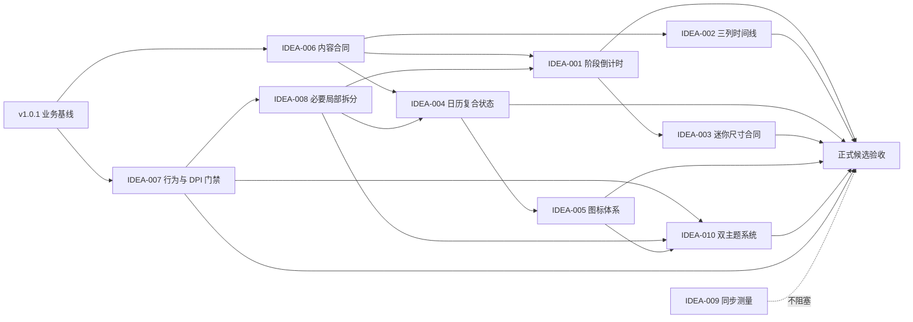

# LetsMakeMoney Windows v1.0.2 候选需求池

## 追踪信息

- 文档状态：Idea 阶段已完成；完整 PRD、追踪矩阵与高保真原型已完成，待项目所有者确认
- 目标版本：Windows v1.0.2 Stable
- 当前公开版本：Windows v1.0.1 Stable
- 当前开发基线：`main`，HEAD `1eb3dadbd37dcc06141e82e5e043db529821a104`
- 上游 Review：`V102-REVIEW-001`
- 上游候选：`V102-CAND-001` 至 `V102-CAND-008`
- 已完成基线：`V102-BUG-001`
- 当前事实源：`doc/current.md`、本文件、`doc/releases/v1.0.2/prd.md`、`doc/releases/v1.0.2/traceability.md`
- 最后更新：2026-07-28

## Idea 阶段判断

### 版本主线

v1.0.2 是一次有明确边界的正式体验优化：在不改变 v1.0.1 收入、日历、日期调整、跨夜班次和配置事务口径的前提下，让高频迷你视图、今日安排和日历准确表达当前业务状态，并建立足以支撑 Stable 发布的行为与 DPI 门禁。

### 当前阶段

- 产品阶段：Stable 后的体验打磨期。
- 主要用户：将迷你收入视图长期放在 Windows 桌面，并按需打开今日详情和日历的用户。
- 高频场景：查看当前工作阶段、下一个时间边界、今日安排和日期业务状态。
- 当前判断：八项需求可进入 PRD；一项局部工程治理只允许按需实施；一项多窗口同步问题仅进入技术测量。
- 发布判断：不可进入发布收口。启动修复候选包只证明 `V102-BUG-001` 已关闭。

### 为什么不是其他方向

本版问题集中在状态准确性、日历语义和高频界面质量。项目所有者确认在推荐方案中追加受控双主题能力，仅包含浅色模式（默认）和深色模式。宠物、账号、云同步、第三种主题、自定义配色、跟随系统、定时切换、主题下载或市场、安装器、静默更新、多平台、技术栈重写和全量设计系统重建仍不进入 v1.0.2。

## 上游证据

| 证据 | 状态 | 支撑结论 |
| --- | --- | --- |
| 五张项目所有者真实界面截图 | 已确认 | 时间线偏移、迷你横线、图标质感、固定倒计时文案、日历状态冲突均真实存在 |
| `apps/windows-v1/src/App.tsx` | 已确认 | 迷你视图仍渲染拖动横线并固定显示“剩余有效工时”；今日标题与部分“午休”文案固定 |
| `apps/windows-v1/src/styles.css` | 已确认 | 时间、节点和竖线由不同偏移量拼装；日历 today/manual 状态存在边框竞争 |
| `apps/windows-v1/src/model.ts` | 已确认 | UI 快照未暴露 `next_boundary_seconds`，多个窗口各自维护本地计时与 30 秒权威同步 |
| Rust 收入阶段实现 | 已确认 | before_work、working、lunch、after_work 已能计算下一业务边界 |
| `contracts/window-contract.json` 与 `tauri.conf.json` | 已确认 | 迷你视图当前固定为 `344×120`，位置保存、托盘隐藏和找回已有合同 |
| v1.0.1 PRD、验收和发布后观察 | 已确认 | 收入、日期调整、跨夜 owner date 和整数分累计是受保护的稳定基线 |
| 现有 TypeScript/Rust 测试 | 已确认 | 已覆盖跨夜和部分日历行为，但缺少阶段呈现、复合日历状态和 DPI 视觉门禁 |
| 多窗口成对同步日志 | 已确认 | 重复请求存在，但尚无可感知性能或结果错误证据 |
| v1.0 原型 | 高度可能 | 可作为状态和图标方向参考，不能代替真实运行验收 |
| 项目所有者双主题决策与现有 CSS/config 审计 | 已确认 | 主题范围锁定为浅色默认和深色；当前 CSS 存在浅色硬编码，配置 schema 尚无主题字段 |

## 候选需求总览

| ID | 标题 | 类型 | 上游来源 | 证据状态 | 分数 | 分档结论 | 优先级 | 推荐去向 |
| --- | --- | --- | --- | --- | ---: | --- | --- | --- |
| V102-IDEA-001 | 阶段化业务边界倒计时 | 状态与内容设计 | CAND-007、REV-003 | 已确认 | 38/40 | 通过 | P0 | 进入 PRD |
| V102-IDEA-002 | 今日安排三列时间线与“休息”语义 | 用户体验优化 | CAND-004、REV-005 | 已确认 | 35/40 | 通过 | P1 | 进入 PRD |
| V102-IDEA-003 | 迷你视图去冗余与状态尺寸合同 | 用户体验优化 | CAND-005、REV-006 | 已确认 | 36/40 | 通过 | P1 | 进入 PRD |
| V102-IDEA-004 | 日历复合状态与可访问性体系 | 状态与内容设计 | CAND-008、REV-004 | 已确认 | 33/40 | 通过 | P0 | 进入 PRD |
| V102-IDEA-005 | 全局入口图标一致性 | 视觉一致性 | CAND-006、REV-007 | 已确认 | 32/40 | 通过 | P1 | 进入 PRD |
| V102-IDEA-006 | 调休来源与跨夜 owner date 内容合同 | 状态与内容设计 | CAND-002、CAND-003、REV-011 | 已确认 | 35/40 | 通过 | P0 | 进入 PRD |
| V102-IDEA-007 | 阶段、日历和 DPI 行为验收门禁 | 工程治理 | REV-008、REV-012 | 已确认 | 34/40 | 通过 | P0 | 进入 PRD |
| V102-IDEA-008 | 呈现层局部拆分 | 工程治理 / Spike | REV-009 | 高度可能 | 25/40 | 部分通过 | P2 | 技术 Spike |
| V102-IDEA-009 | 多窗口权威同步所有权测量 | 技术 Spike | CAND-001、REV-010 | 待确认 | 22/40 | 只验证 | P2 | 继续验证 |
| V102-IDEA-010 | 浅色默认与深色双主题系统 | 视觉一致性 | 项目所有者确认、代码审计 | 已确认 | 31/40 | 有边界通过 | P1 | 进入 PRD |

## 候选需求池

### V102-IDEA-001 阶段化业务边界倒计时

| 字段 | 内容 |
| --- | --- |
| 上游来源 | `V102-CAND-007`、`V102-REV-003`、迷你视图真实截图 |
| 类型 | 状态与内容设计 |
| 当前问题 | 迷你视图固定显示“剩余有效工时”，无法说明用户距离上班、休息恢复或下班中的哪一个边界，也不适用于跨夜班次。 |
| 证据 | React 固定文案；Rust 已计算各阶段 `next_boundary_seconds`；工作阶段枚举和真实截图。 |
| 证据状态 | 已确认 |
| 用户价值 | 用户一眼知道下一个业务节点，减少对错误或模糊倒计时的猜测。 |
| 影响范围 | React 迷你视图和今日详情；`DashboardSnapshot` 字段映射；Rust/Tauri 返回合同只需复用既有字段；阶段日志；TypeScript 行为测试；用户文档。配置、发布包结构和数据库均无新增影响。 |
| 依赖 | 依赖现有 Rust 阶段与下一边界计算；与 IDEA-006 共用内容合同；由 IDEA-007 建立行为门禁。 |
| 风险 | 零休息、跨夜 owner date、休息日和权威同步切换时出现错误目标或负倒计时。 |
| 测试缺口 | 缺少九类阶段矩阵、边界前后秒级切换、权威纠偏和 owner date 前一天的呈现测试。 |
| 成本 | 中 |
| 压力测试结论 | 值得继续。不是固定文案替换，需要 UI 快照消费权威边界并集中选择阶段文案。 |
| 推荐去向 | 进入 PRD |
| 最小下一步 | 在 PRD 固定阶段矩阵、字段合同、切换时机、错误降级和日志事件。 |

压力测试：

| 痛点 | 场景 | 证据 | 频率 | 主线贡献 | 替代方案 | 成本可控 | 验证速度 | 总分 |
| ---: | ---: | ---: | ---: | ---: | ---: | ---: | ---: | ---: |
| 5 | 5 | 5 | 5 | 5 | 4 | 4 | 5 | 38/40 |

### V102-IDEA-002 今日安排三列时间线与“休息”语义

| 字段 | 内容 |
| --- | --- |
| 上游来源 | `V102-CAND-004`、`V102-REV-005`、跨夜时间线真实截图 |
| 类型 | 用户体验优化 / 视觉一致性 |
| 当前问题 | 时间列、节点和竖线由不同偏移量拼装，跨夜时明显失衡；界面固定使用“午休”，不能覆盖夜班和非中午休息。 |
| 证据 | `.schedule` 网格与伪元素 CSS；真实跨夜截图；现有上班、休息、下班数据。 |
| 证据状态 | 已确认 |
| 用户价值 | 时间顺序、当前节点和剩余安排更易扫描，夜班用户不会被错误的“午休”语义干扰。 |
| 影响范围 | 今日详情 React 结构和 CSS；日程呈现选择器；时间文案；截图和 DPI 门禁；用户手册。Rust、配置、日志、发布结构和数据库无影响。 |
| 依赖 | 与 IDEA-001、IDEA-006 共用阶段和内容合同；由 IDEA-007 验证。 |
| 风险 | 零休息时空轴线、跨日时间排序、长时间文本和 DPI 缩放可能造成二次偏移。 |
| 测试缺口 | 普通班、零休息、跨夜班次、100%/125%/150% DPI 和长文案尚无组合证据。 |
| 成本 | 中 |
| 压力测试结论 | 值得继续。应改为稳定的“时间列｜轴线列｜内容列”，不做局部像素补丁。 |
| 推荐去向 | 进入 PRD |
| 最小下一步 | 在 PRD 固定列宽、共同基线、节点状态、次日标识和 DPI 截图尺寸。 |

压力测试：

| 痛点 | 场景 | 证据 | 频率 | 主线贡献 | 替代方案 | 成本可控 | 验证速度 | 总分 |
| ---: | ---: | ---: | ---: | ---: | ---: | ---: | ---: | ---: |
| 4 | 5 | 5 | 4 | 4 | 4 | 4 | 5 | 35/40 |

### V102-IDEA-003 迷你视图去冗余与状态尺寸合同

| 字段 | 内容 |
| --- | --- |
| 上游来源 | `V102-CAND-005`、`V102-REV-006`、迷你视图真实截图 |
| 类型 | 用户体验优化 / 视觉一致性 |
| 当前问题 | 整个非交互区域已经支持拖动，但顶部仍保留拖动横线，占用高度并产生错误入口暗示；当前固定 `344×120` 没有按状态验证内容稳定性。 |
| 证据 | `useWindowDrag({allowInteractiveStart:true})`；仍渲染 `mini-window__drag`；Tauri 和窗口合同均为 `344×120`。 |
| 证据状态 | 已确认 |
| 用户价值 | 迷你窗口更紧凑、整洁，不牺牲拖动、位置保存、托盘隐藏和找回。 |
| 影响范围 | MiniWindow React/CSS；Tauri 窗口尺寸合同；位置保存和安全回落回归；loading/error/工作/休息状态截图；文档。配置字段不变，无数据库影响。 |
| 依赖 | 依赖 IDEA-001 的最长阶段文案；图标操作依赖 IDEA-005；由 IDEA-007 验证。 |
| 风险 | 收紧尺寸后长金额、长倒计时、错误按钮或 150% DPI 溢出；改变窗口尺寸时旧保存位置需重新安全回落。 |
| 测试缺口 | 缺少各状态最长内容和三档 DPI 的最小尺寸实测。 |
| 成本 | 小 |
| 压力测试结论 | 值得继续。先用真实最长内容确定单一稳定尺寸；不要为每个状态频繁改变窗口外框。 |
| 推荐去向 | 进入 PRD |
| 最小下一步 | 以 `344×120` 为起点做真实状态测量，PRD 决定是否收紧并固定最终尺寸。 |

压力测试：

| 痛点 | 场景 | 证据 | 频率 | 主线贡献 | 替代方案 | 成本可控 | 验证速度 | 总分 |
| ---: | ---: | ---: | ---: | ---: | ---: | ---: | ---: | ---: |
| 3 | 5 | 5 | 5 | 4 | 4 | 5 | 5 | 36/40 |

### V102-IDEA-004 日历复合状态与可访问性体系

| 字段 | 内容 |
| --- | --- |
| 上游来源 | `V102-CAND-008`、`V102-REV-004`、日历真实截图 |
| 类型 | 状态与内容设计 / 视觉一致性 |
| 当前问题 | 今天、选中日期、手动调整和业务日期类型可同时存在，但当前 class 和边框彼此竞争；“今天”还可能错误复用 owner date，导致跨夜时把前一天标成今天。 |
| 证据 | CalendarView 叠加多个 class；today/manual CSS 同时使用边框；真实截图；跨夜 owner date 模型。 |
| 证据状态 | 已确认 |
| 用户价值 | 用户能同时识别日期业务类型、今天、当前选择和手动调整，不会误读工资与日历归属。 |
| 影响范围 | 日历状态映射、React 语义属性、CSS 复合状态、图例、键盘焦点、测试和文档。日历数据合同不变，配置不变，无数据库影响。 |
| 依赖 | 与 IDEA-005 共用图标；与 IDEA-006 共用 owner date 和来源文案；由 IDEA-007 验证。 |
| 风险 | 状态组合较多，若只换颜色会损害可访问性；今天应使用本地自然日，不能破坏 owner date 的收入归属。 |
| 测试缺口 | 缺少业务底层状态与 today/selected/manual/hover/focus/stale 的组合矩阵。 |
| 成本 | 中 |
| 压力测试结论 | 值得继续。必须把业务状态和导航状态拆成独立视觉层，而不是新增更多互斥 class。 |
| 推荐去向 | 进入 PRD |
| 最小下一步 | 固定视觉优先级、ARIA 文案、图例、键盘焦点和至少 12 个代表性组合。 |

压力测试：

| 痛点 | 场景 | 证据 | 频率 | 主线贡献 | 替代方案 | 成本可控 | 验证速度 | 总分 |
| ---: | ---: | ---: | ---: | ---: | ---: | ---: | ---: | ---: |
| 4 | 5 | 5 | 3 | 5 | 4 | 3 | 4 | 33/40 |

### V102-IDEA-005 全局入口图标一致性

| 字段 | 内容 |
| --- | --- |
| 上游来源 | `V102-CAND-006`、`V102-REV-007`、日历入口截图 |
| 类型 | 视觉一致性 |
| 当前问题 | 日历入口以文字“日”拼成临时图标，与今日、设置和月份切换的视觉语言不一致。 |
| 证据 | `nav-calendar-mark` 实现、项目所有者截图和 v1.0 原型方向。 |
| 证据状态 | 已确认 |
| 用户价值 | 高频入口更清晰、统一且在 DPI 缩放下保持锐利。 |
| 影响范围 | 今日、日历、设置、月份切换、状态入口的图标组件；`package.json` 与 lockfile；第三方声明和发布包合规检查；React/CSS 测试。Rust、配置、日志和数据库无影响。 |
| 依赖 | 依赖图标来源决策；与 IDEA-004、IDEA-007 联动。 |
| 风险 | 新依赖增加许可和包体检查；只改日历会继续形成孤立风格；实心/线性混用可能降低一致性。 |
| 测试缺口 | 未验证候选图标在 100%/125%/150% DPI、16/18/20px 和高对比模式下的表现。 |
| 成本 | 小 |
| 压力测试结论 | 值得继续。推荐固定版本的 `lucide-react` 并按需导入，同时依据 [Lucide 官方仓库](https://github.com/lucide-icons/lucide)和[官方许可证](https://github.com/lucide-icons/lucide/blob/main/LICENSE)更新第三方 notices；若 PRD 评审不接受新依赖，则使用项目内确定性 SVG 组件作为回退。 |
| 推荐去向 | 进入 PRD |
| 最小下一步 | PRD 确认图标集合、尺寸、线宽、许可与回退，不制作日历专用临时图标。 |

压力测试：

| 痛点 | 场景 | 证据 | 频率 | 主线贡献 | 替代方案 | 成本可控 | 验证速度 | 总分 |
| ---: | ---: | ---: | ---: | ---: | ---: | ---: | ---: | ---: |
| 3 | 5 | 4 | 4 | 3 | 4 | 4 | 5 | 32/40 |

### V102-IDEA-006 调休来源与跨夜 owner date 内容合同

| 字段 | 内容 |
| --- | --- |
| 上游来源 | `V102-CAND-002`、`V102-CAND-003`、`V102-REV-011` |
| 类型 | 状态与内容设计 |
| 当前问题 | 官方调休工作日仍可能只显示“工作日”；跨夜班次按前一天 owner date 正确计算时，标题仍写“今天”，正确数据被错误文案削弱。 |
| 证据 | TodayView 固定标题；发布后真实 GUI 观察；跨夜 owner date 已有代码与验收基线。 |
| 证据状态 | 已确认 |
| 用户价值 | 用户理解收入属于哪一天、工作日来源是什么，增强对正确计算结果的信任。 |
| 影响范围 | 今日页标题、日期副标题、日历单元说明、调休来源提示、日志上下文、TypeScript 测试和用户文档。收入公式、日历数据、配置和数据库均无变化。 |
| 依赖 | 依赖 IDEA-001 的阶段内容选择器、IDEA-004 的日历状态、IDEA-007 的行为测试。 |
| 风险 | 将自然日和收入 owner date 混为一个字段；官方调休与用户手动工作日来源混淆。 |
| 测试缺口 | 缺少普通工作日、官方调休、手动工作日、跨夜归属前一日四类标题与来源测试。 |
| 成本 | 小 |
| 压力测试结论 | 值得继续。只改呈现合同，不改变 owner date 或日历计算。 |
| 推荐去向 | 进入 PRD |
| 最小下一步 | 固定标题、副标题、来源标签和回退文案；跨夜建议使用“本次夜班收入进度”。 |

压力测试：

| 痛点 | 场景 | 证据 | 频率 | 主线贡献 | 替代方案 | 成本可控 | 验证速度 | 总分 |
| ---: | ---: | ---: | ---: | ---: | ---: | ---: | ---: | ---: |
| 4 | 5 | 5 | 3 | 5 | 4 | 4 | 5 | 35/40 |

### V102-IDEA-007 阶段、日历和 DPI 行为验收门禁

| 字段 | 内容 |
| --- | --- |
| 上游来源 | `V102-REV-008`、`V102-REV-012` |
| 类型 | 工程治理 / 验证能力 |
| 当前问题 | 现有静态测试绑定旧文案，既可能阻止正确改文案，也不能证明阶段切换、复合日历状态和 DPI 布局正确。 |
| 证据 | `tests/verify_m3.py` 等静态文本检查；现有行为测试仅覆盖部分同步和日历状态；本轮存在跨夜与 DPI 风险。 |
| 证据状态 | 已确认 |
| 用户价值 | 降低 Stable 优化引入状态误导、布局回退和旧体验破坏的概率。 |
| 影响范围 | TypeScript 行为测试、Rust 夹具复用、静态验证更新、Playwright/Computer Use 截图矩阵、文档和发布门禁。业务代码仅为可测试性做最小接口暴露，无数据库影响。 |
| 依赖 | 覆盖 IDEA-001 至 IDEA-006；正式候选包验收依赖本项。 |
| 风险 | 若只做快照会掩盖逻辑错误；若穷举所有组合会让测试成本失控。 |
| 测试缺口 | 阶段边界、自然日与 owner date、复合日历状态、最长文案和三档 DPI。 |
| 成本 | 中 |
| 压力测试结论 | 值得继续。以代表性风险矩阵代替全量像素快照。 |
| 推荐去向 | 进入 PRD |
| 最小下一步 | PRD 定义行为断言、截图基线、Computer Use 与人工边界，以及失败时的发布阻塞规则。 |

压力测试：

| 痛点 | 场景 | 证据 | 频率 | 主线贡献 | 替代方案 | 成本可控 | 验证速度 | 总分 |
| ---: | ---: | ---: | ---: | ---: | ---: | ---: | ---: | ---: |
| 4 | 4 | 5 | 4 | 5 | 4 | 3 | 5 | 34/40 |

### V102-IDEA-008 呈现层局部拆分

| 字段 | 内容 |
| --- | --- |
| 上游来源 | `V102-REV-009` |
| 类型 | 工程治理 / 技术 Spike |
| 当前问题 | `App.tsx`、`styles.css` 和 `model.ts` 同时承载多个窗口和状态规则，本轮联改容易继续堆积条件分支。 |
| 证据 | 文件规模和职责交叉已确认；尚无由文件规模直接导致的生产缺陷。 |
| 证据状态 | 高度可能 |
| 用户价值 | 间接降低回归风险，不是独立用户功能。 |
| 影响范围 | 仅允许抽出阶段呈现选择器、日历状态映射和本轮直接修改的窗口组件；不得改 Rust 领域模型、配置格式或全局状态管理。无数据库影响。 |
| 依赖 | 以 IDEA-001 至 IDEA-007 的测试作为安全网。 |
| 风险 | 容易演变成 App、CSS 和状态管理整体重构，挤占正式优化目标。 |
| 测试缺口 | 还不能证明拆分前后行为等价；缺少组件级行为合同。 |
| 成本 | 中 |
| 压力测试结论 | 部分通过。用户痛点低于 3 分触发闸门，不能作为独立正式需求；只在能减少本轮条件分支时实施。 |
| 推荐去向 | 技术 Spike |
| 最小下一步 | PRD 只列允许抽取的三个边界，开发计划按“先测试、后移动、行为不变”承接。 |

压力测试：

| 痛点 | 场景 | 证据 | 频率 | 主线贡献 | 替代方案 | 成本可控 | 验证速度 | 总分 |
| ---: | ---: | ---: | ---: | ---: | ---: | ---: | ---: | ---: |
| 2 | 4 | 3 | 3 | 3 | 3 | 3 | 4 | 25/40 |

### V102-IDEA-009 多窗口权威同步所有权测量

| 字段 | 内容 |
| --- | --- |
| 上游来源 | `V102-CAND-001`、`V102-REV-010` |
| 类型 | 技术 Spike |
| 当前问题 | Mini 和 Workbench 各自运行 30 秒权威同步，日志出现成对请求；当前没有结果错误或可感知性能问题。 |
| 证据 | 多窗口 hook 与日志已确认；用户影响、CPU、内存和日志增长尚未量化。 |
| 证据状态 | 待确认 |
| 用户价值 | 若确有显著重复开销，可降低日志噪音和后台计算；当前价值尚未证实。 |
| 影响范围 | 只读测量脚本、日志统计和性能记录；若后续通过门禁，才可能影响 React 同步所有权和窗口事件。配置、Rust 公式、发布包结构和数据库不应变化。 |
| 依赖 | 必须先完成只读测量；不阻塞 IDEA-001 至 IDEA-007。 |
| 风险 | 共享跨窗口状态可能引入生命周期、隐藏窗口、恢复和失联问题，成本高于当前已知收益。 |
| 测试缺口 | 缺少 mini-only 与 mini+workbench 的请求数、CPU、内存、日志增长和快照漂移对比。 |
| 成本 | 大 |
| 压力测试结论 | 只建议继续验证。痛点和成本可控性均低于 3 分，不进入 v1.0.2 实现承诺。 |
| 推荐去向 | 继续验证 |
| 最小下一步 | 执行 10 分钟双场景测量；只有出现约 2 倍请求且伴随明显日志、CPU、内存或延迟影响时，才另立实现决策。 |

压力测试：

| 痛点 | 场景 | 证据 | 频率 | 主线贡献 | 替代方案 | 成本可控 | 验证速度 | 总分 |
| ---: | ---: | ---: | ---: | ---: | ---: | ---: | ---: | ---: |
| 2 | 3 | 3 | 3 | 2 | 3 | 2 | 4 | 22/40 |

### V102-IDEA-010 浅色默认与深色双主题系统

| 字段 | 内容 |
| --- | --- |
| 上游来源 | 项目所有者明确确认；`apps/windows-v1/src/styles.css`、`apps/windows-v1/src/configModel.ts`、`apps/windows-v1/src-tauri/src/config.rs` 代码审计 |
| 类型 | 视觉一致性 / 本地偏好 |
| 当前问题 | 当前产品只有浅色视觉，CSS 虽有基础变量，但仍存在多处浅色硬编码；配置模型没有主题字段，也没有跨窗口主题同步、启动防闪白和深色状态验收合同。 |
| 证据 | 项目所有者明确要求双主题；Mini、Workbench、Settings、Wizard 共用 Web 前端但由多个窗口承载；原生托盘由 Windows 绘制。 |
| 证据状态 | 已确认 |
| 用户价值 | 用户可在夜间和低光环境切换深色模式，同时默认浅色保证既有用户升级后外观不变；所有应用窗口保持一致，避免混合主题。 |
| 影响范围 | React 根节点主题应用、CSS 设计令牌和浅色硬编码清理、Settings 的主题选择控件、TypeScript/Rust 配置 schema 与旧配置迁移、跨窗口配置事件、启动前主题恢复、日志、自动测试、DPI/视觉验收、README 与发布说明。原生托盘保持 Windows 系统样式；收入公式、日历数据、用户业务数据和数据库无影响。 |
| 依赖 | 依赖 IDEA-007 建立行为与视觉门禁；可复用 IDEA-008 允许的局部组件/令牌整理；不依赖 IDEA-009 的权威收入同步所有权改造。 |
| 风险 | 只切根背景会形成混合主题；旧配置迁移错误会改变默认外观；窗口启动可能先闪浅色；状态色、焦点环、禁用态和日历复合状态在深色下可能失去对比度。 |
| 测试缺口 | 缺少旧配置默认浅色、主题即时切换、所有窗口同步、重启持久化、保存失败补偿、启动无闪白，以及 100%/125%/150% DPI 下全部状态的深色验收。 |
| 成本 | 中 |
| 压力测试结论 | 有边界通过。技术边界和用户选择已确认，但不扩展为完整个性化系统；只有两种固定主题时成本与回归面可控。 |
| 推荐去向 | 进入 PRD |
| 最小下一步 | 在 PRD 固定主题配置合同、浅色/深色令牌矩阵、Settings 入口、跨窗口生效、失败补偿、启动顺序和逐窗口验收标准。 |

压力测试：

| 痛点 | 场景 | 证据 | 频率 | 主线贡献 | 替代方案 | 成本可控 | 验证速度 | 总分 |
| ---: | ---: | ---: | ---: | ---: | ---: | ---: | ---: | ---: |
| 3 | 5 | 4 | 5 | 4 | 3 | 3 | 4 | 31/40 |

## 已完成缺陷基线

### V102-BUG-001 启动时短暂误报无法计算

- 分类：已完成缺陷，不重复进入 v1.0.2 开发范围。
- 结论：有效配置启动时保持加载并有限重试；真实配置错误仍进入恢复路径。
- 历史候选 Zip SHA256：`AE78033765F07D9BA56E9C1C9B1915966B2220C8DB23A4E26B2DA99A08A7BAA7`
- 历史候选 EXE SHA256：`C1C80B495FB26CE3A427C20A1D2163AD2F131AB509D88E9EAF7792FD3FA2CF1F`
- 历史候选 WebView2Loader SHA256：`8427B1FC58EC707813E5C0A51EB5D69397BB333250A7B891BE4D3B123F1E0F1C`
- 边界：上述身份只证明启动修复，不代表正式优化版已通过或可发布。

## 状态与视觉矩阵

### 阶段化倒计时

| 阶段 | 主状态 | 次级信息 | 倒计时来源 | 特殊规则 |
| --- | --- | --- | --- | --- |
| loading | 正在计算今天的收入 | 保持上次可信内容或加载态 | 无 | 不显示失败式倒计时 |
| error | 暂时无法计算 | 可读原因与重试/检查设置 | 无 | 不伪装成功 |
| before_work | 上班前 | 距离上班 | `next_boundary_seconds` | 跨夜按 owner date 显示归属 |
| working，休息未开始 | 工作中 | 距离休息 | `next_boundary_seconds` | 用户可见文案统一为“休息” |
| lunch | 休息中 | 距离恢复工作 | `next_boundary_seconds` | 夜班同样使用“休息” |
| working，休息已结束 | 工作中 | 距离下班 | `next_boundary_seconds` | 零休息直接进入本分支 |
| after_work | 今日工作已结束 | 可显示下次工作日 | 无 | 不显示剩余工时 |
| rest_day | 休息日 | 下一个工作日 | 无 | 不显示今日已赚或有效工时 |
| paid_rest | 带薪休息 | 今日带薪金额 | 无 | 不显示有效工时 |
| unpaid_rest | 不带薪休息 | 本月预计应发 | 无 | 不显示今日收入 |
| owner date 为前一天 | 当前真实阶段 | 夜班归属日与下个边界 | `next_boundary_seconds` | “今天”不得掩盖 owner date |

### 今日安排时间线

| 场景 | 行数 | 时间列 | 轴线列 | 内容列 |
| --- | ---: | --- | --- | --- |
| 普通班 | 3 | 上班、休息、下班 | 节点与竖线共用中心轴 | 已完成、当前、未开始分层 |
| 零休息 | 2 | 上班、下班 | 不保留空休息节点 | 工作阶段直接连接下班 |
| 跨夜班 | 3 | 按业务顺序 | 跨日不改变轴线 | 午夜后时间标注“次日” |
| 长文案/DPI | 不变 | 固定可容纳“次日 00:00” | 不随文字偏移 | 文案换行不改变节点基线 |

### 日历复合状态优先级

日历状态分为三层，三层可以同时存在，不能互相覆盖：

1. 业务底层：普通工作日、普通休息日、官方调休工作日、手动工作日、带薪休息、不带薪休息。
2. 导航叠层：今天、当前选中日期。
3. 交互叠层：hover、键盘 focus、disabled、stale。

| 状态 | 主要表达 | 辅助表达 | 可访问性要求 |
| --- | --- | --- | --- |
| 今天 | 高识别度外环或角标 | “今天”文本/ARIA | 使用本地自然日，不使用 owner date |
| 选中日期 | 独立选中底色或内框 | 当前选择语义 | 与今天可同时识别 |
| 普通工作日 | 工作日底色 | 图例 | 不依赖颜色单独判断 |
| 普通休息日 | 休息日底色 | 图例 | 与 paid/unpaid 区分 |
| 官方调休工作日 | 工作日底色 + 来源标记 | “调休工作日” | 说明官方来源 |
| 手动工作日 | 工作日底色 + 手动标记 | “手动设为工作日” | 与官方调休区分 |
| 带薪休息 | 独立业务标记 | “带薪休息” | 不显示有效工时 |
| 不带薪休息 | 独立业务标记 | “不带薪休息” | 不显示今日收入 |
| hover | 临时表面反馈 | 无 | 不覆盖业务标记 |
| keyboard focus | 明确焦点环 | 无 | 满足键盘导航 |
| disabled | 降低交互强调 | 禁用原因 | 保留业务含义 |
| stale | 警示标记 | 数据状态说明 | 不把旧数据误写为最新 |

### 内容口径

| 场景 | 推荐标题/标签 | 禁止表达 |
| --- | --- | --- |
| 普通自然日 | 今天的收入进度 | 无 |
| 官方调休工作日 | 调休工作日 | 仅写“工作日” |
| 用户手动工作日 | 手动设为工作日 | 写成官方调休 |
| 跨夜且 owner date 为前一天 | 本次夜班收入进度；副标题显示归属日 | 只写“今天” |
| 任意工作时段中的中断 | 休息 | 固定写“午休” |
| 零休息 | 不渲染休息节点 | 显示 0 分钟休息节点 |

### 图标体系

- 范围：今日、日历、设置、月份前后切换、关闭、重试和状态入口。
- 推荐：固定版本的 `lucide-react`，只按需导入使用的图标。
- 合规：锁定精确版本，更新 lockfile、`THIRD_PARTY_NOTICES` 和包体验证。
- 回退：如不接受新增依赖，使用项目内确定性 SVG 图标组件；不得继续使用文字拼装图标。
- 验证：16/18/20px、100%/125%/150% DPI、普通/hover/focus/disabled。

### 双主题状态矩阵

| 场景 | 预期主题 | 状态与补偿 |
| --- | --- | --- |
| 新用户或旧配置无主题字段 | 浅色 | 使用默认值，不修改收入、日历或窗口配置 |
| 用户选择浅色 | 浅色 | 立即应用到所有应用窗口并持久化 |
| 用户选择深色 | 深色 | 立即应用到所有应用窗口并持久化 |
| 重启应用 | 上次成功保存的主题 | 首帧前恢复，避免浅色闪烁 |
| 保存失败 | 保持上次成功主题 | 显示可读错误，不污染配置，不让窗口停在不一致状态 |
| Mini、Workbench、Settings、Wizard 同时打开 | 同一主题 | 任一合法入口变更后同步应用 |
| loading、error、disabled、focus、stale | 当前主题 | 保留清晰对比度和非颜色状态表达 |
| 原生托盘菜单 | Windows 系统主题 | 不模拟 Web 深色菜单，不改变原生边界 |

范围锁定：

- 只提供浅色和深色两种固定主题，浅色为默认。
- 只允许用户手动选择，不跟随系统，不定时切换。
- 不提供自定义颜色、第三种主题、主题导入、下载或市场。
- 主题只改变视觉呈现，不改变业务公式、日历语义、配置事务或窗口策略。

## 技术 Spike

### Spike-01 阶段呈现与日历状态映射

- 目标：证明阶段选择器和日历状态映射可以脱离大页面进行纯函数行为测试。
- 允许产物：只读设计说明、类型草图、测试样例和最小原型。
- 禁止：重写全局状态管理或 Rust 领域模型。
- 通过标准：IDEA-001、IDEA-004、IDEA-006 的代表性状态可由纯输入得到唯一呈现结果。

### Spike-02 多窗口同步测量

- 场景 A：只显示迷你视图 10 分钟。
- 场景 B：同时显示迷你视图和工作台 10 分钟。
- 记录：权威请求次数、相关日志增长、CPU、内存、同步失败和两窗口快照差异。
- 当前门禁：只测量，不修改所有权。
- 后续实现触发条件：重复请求接近 2 倍，且同时出现可量化日志膨胀、CPU/内存增长、延迟或快照漂移。
- 不满足触发条件：保持现状，记录为暂不处理。

## 最小方案

覆盖：

- 保留 `V102-BUG-001` 已完成基线。
- 实现 `V102-IDEA-001` 至 `V102-IDEA-005`。
- 为五项优化补最小行为与 DPI 门禁。
- 不纳入调休/owner date 内容完善以外的新工程治理，不改多窗口同步所有权。

价值：

- 直接关闭五张用户截图中的高频体验问题。
- 成本较小，能快速形成可见改进。

不足：

- 调休来源和跨夜标题仍可能削弱正确计算的可信度。
- 测试范围容易只覆盖截图问题，不足以支撑完整 Stable 语义。

判断：可做，但不是推荐方案。

## 推荐方案

覆盖：

- 实现 `V102-IDEA-001` 至 `V102-IDEA-007`。
- 实现 `V102-IDEA-010`，仅提供浅色默认与深色两种固定主题。
- `V102-IDEA-008` 只做本版必要的阶段选择器、日历映射和窗口局部组件抽取。
- `V102-IDEA-009` 只完成测量，不预设共享同步所有权实现。
- 保留 `V102-BUG-001` 的历史修复与回归门禁。

用户价值：

- 迷你视图准确说明下一业务边界。
- 今日安排在普通班、零休息和夜班中保持清晰。
- 日历能同时表达业务日期、今天、选择和手动调整。
- 正确的调休和跨夜计算得到匹配的内容解释。
- 统一图标和 DPI 门禁提高整体完成度。
- 浅色与深色在所有应用窗口保持一致，夜间使用更舒适且不改变既有默认体验。

工程成本：

- 中等偏大，可由纯呈现选择器、局部组件、主题令牌和行为测试控制。
- 不更改收入公式、日历数据源和 Rust 领域模型；仅为本地配置增加受控主题枚举及兼容迁移。

推荐原因：

- 同时关闭用户可见问题和信任问题。
- 比最小方案多出的内容合同与测试门禁直接降低 Stable 回归风险。
- 将不确定的工程问题限制为测量，不让版本演变成架构重写。

## 过大方案

以下内容会使 v1.0.2 超出合理边界，不推荐：

- 全量设计系统重写。
- `App.tsx`、`styles.css`、状态管理和全部窗口整体重构。
- 重新设计 Settings、Wizard 和所有桌面窗口。
- 第三种主题、自定义配色、跟随系统、定时切换、主题导入、下载或市场。
- 安装器或自动更新。
- 账号、云同步或跨平台。
- 恢复宠物功能或接入 PetManager。

主要风险：

- 业务和窗口回归面成倍扩大。
- 正式优化的验收目标被架构迁移稀释。
- 无法证明新增成本与本轮用户问题成比例。

结论：暂不处理。

## 优先级与依赖

### P0

- `V102-IDEA-001`：错误阶段目标会误导用户。
- `V102-IDEA-004`：日期业务状态与今天/选中冲突影响收入和日历信任。
- `V102-IDEA-006`：跨夜 owner date 和调休来源错误表达影响正确结果的可信度。
- `V102-IDEA-007`：没有行为门禁不能将正式优化判定为 Stable。

### P1

- `V102-IDEA-002`：高频今日安排可读性。
- `V102-IDEA-003`：高频迷你视图紧凑度与稳定性。
- `V102-IDEA-005`：入口图标一致性。
- `V102-IDEA-010`：所有应用窗口的浅色/深色一致性与夜间可用性。

### P2

- `V102-IDEA-008`：只做必要局部拆分。
- `V102-IDEA-009`：只读性能与日志测量。

### 推荐实施顺序

1. 冻结 v1.0.1 业务口径和 v1.0.2 阶段/日历行为测试。
2. 定义阶段呈现、owner date 和调休来源内容合同。
3. 定义日历复合状态映射。
4. 实现阶段倒计时和今日安排时间线。
5. 收敛迷你视图尺寸与状态布局。
6. 接入统一图标并完成合规更新。
7. 建立双主题令牌、配置迁移和跨窗口应用合同，再完成浅色/深色实现。
8. 完成两种主题下的三档 DPI、长内容、跨夜、日历组合和启动防闪白验证。
9. 独立执行多窗口同步测量，不阻塞前述实现。

### 可并行项

- 日历状态体系与迷你视图尺寸测量可并行。
- 图标集合和合规清单可与时间线实现并行。
- 双主题令牌审计可与内容合同和图标集合并行，主题接入必须等待配置兼容合同。
- 多窗口同步测量可独立进行。

### 必须串行项

- 阶段/内容合同必须早于倒计时和时间线实现。
- 日历状态映射必须早于日历 CSS 调整。
- 行为测试合同必须早于局部组件移动。
- 主题配置迁移和令牌矩阵必须早于深色样式铺设。
- 正式候选打包必须晚于全部 P0/P1 自动与真实桌面验收。

## 分流结果

### 进入 PRD

- `V102-IDEA-001` 至 `V102-IDEA-007`
- `V102-IDEA-010`

### 技术 Spike

- `V102-IDEA-008`：只允许本版必要的呈现层局部拆分。
- `V102-IDEA-009`：只读测量，多窗口共享同步所有权不预先承诺。

### 已完成

- `V102-BUG-001`

### 暂不处理

- 全量设计系统和状态管理重写。
- 所有窗口重新设计。
- 宠物与 PetManager。
- 账号、云同步、第三种主题、自定义主题、跟随系统、定时切换、主题市场、安装器、静默更新、多平台和技术栈重写。

## 已确认决策

1. 采用推荐方案，`V102-IDEA-001` 至 `V102-IDEA-007` 与 `V102-IDEA-010` 进入 PRD。
2. 用户可见的“午休”统一改为“休息”，内部 `lunch_*` 配置键保持兼容不改名。
3. 使用固定版本的 `lucide-react` 作为统一图标来源，并同步更新第三方许可与包验证。
4. 跨夜 owner date 为前一天时，主标题使用“本次夜班收入进度”，副标题显示完整归属日期。
5. 多窗口权威收入同步本版只测量，除非证据达到触发门禁，否则不实施共享所有权。
6. 主题系统只包含浅色模式（默认）和深色模式，由用户手动选择并保存在本地；不扩展系统跟随、自定义或第三种主题。

## 是否具备进入 /prd 的条件

**具备。**

已有证据与项目所有者决策足以定义推荐方案的业务状态、用户价值和影响边界，可以进入完整 PRD。PRD 必须逐项定义阶段矩阵、日历复合状态、窗口尺寸、图标合规、双主题配置与令牌合同、跨窗口即时生效、启动防闪白、日志事件、行为测试、Computer Use 和人工验收标准。

上述条件已经落实为 [完整 PRD](prd.md)、[需求追踪矩阵](traceability.md)和 [v1.0.2 高保真原型](../../prototypes/v1.0/index.html)。在 PRD 确认前不得修改业务代码、重新打包或进入发布收口。

## 下一阶段建议

下一步等待项目所有者确认完整 PRD 与高保真原型。确认后才可生成 `dev_plan_v1.0.2.md`；`V102-IDEA-008` 仍只作为开发前局部治理约束，`V102-IDEA-009` 仍只作为独立技术测量，不得借机扩大为多窗口状态架构重写。双主题不得扩大为完整个性化、系统跟随或主题市场。
