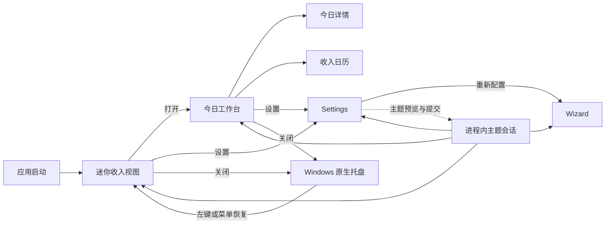
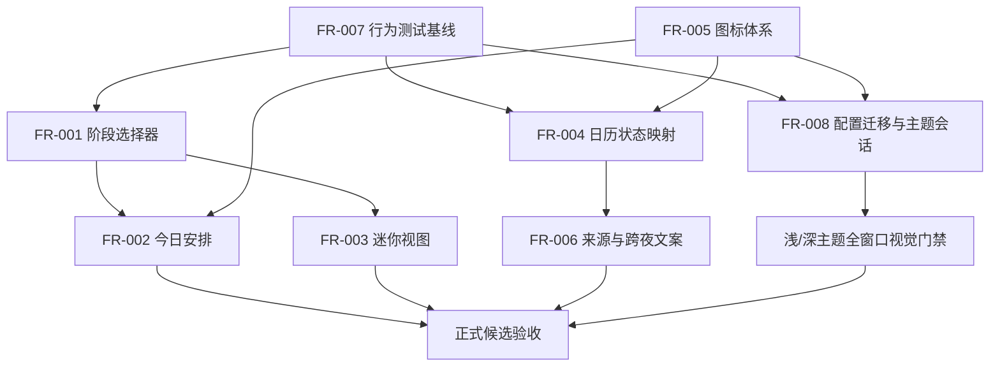

# LetsMakeMoney Windows v1.0.2 产品需求文档

## 0. 文档信息

| 项目 | 内容 |
| --- | --- |
| PRD 类型 | 完整推进型 PRD |
| 目标版本 | Windows v1.0.2 Stable |
| 当前公开版本 | Windows v1.0.1 Stable |
| 文档状态 | 完整 PRD，待项目所有者确认 |
| 产品形态 | 本地优先的 Windows 收入进度工具 |
| 技术基线 | Rust + Tauri + TypeScript/React |
| 上游需求 | `V102-IDEA-001` 至 `V102-IDEA-007`、`V102-IDEA-010` |
| 已完成基线 | `V102-BUG-001`，不重复进入本次开发范围 |
| 最后更新 | 2026-07-28 |

本 PRD 以 [v1.0.2 Idea 需求池](idea-pool.md)、[正式优化 Review](review.md)、[问题池](issue-pool.md)、[发布后观察](post-release-observation.md)和 v1.0.1 已发布行为为事实依据。

## 1. 版本判断

### 1.1 版本目标

v1.0.2 不改变收入公式、官方日历数据、日期调整事务和跨夜 owner date 归属。版本目标是让高频桌面界面准确、稳定且一致地表达既有业务结果：

1. 迷你视图准确说明下一个业务边界。
2. 今日安排在日班、零休息和夜班下保持清晰对齐。
3. 日历同时表达日期业务类型、今天、选择、手动调整和交互状态。
4. 所有高频入口使用统一图标语言。
5. 用户可以在浅色与深色之间手动切换，结果即时同步、可靠保存且启动不闪白。
6. 自动化、真实桌面和 DPI 门禁能够证明上述结果，而不是只验证固定文本存在。

### 1.2 用户价值

- 桌面常驻用户无需推算“剩余工时”究竟指向休息还是下班。
- 夜班用户能够明确当前收入归属日期，不再被“今天”误导。
- 日历用户能够同时看懂“今天是什么业务日”和“当前选中了哪一天”。
- 深色桌面环境中的用户可以获得完整、可读且一致的深色界面。
- Stable 版本的视觉优化具备行为级回归证据，降低状态正确但表达错误的风险。

### 1.3 成功标准

| 指标 | 通过标准 |
| --- | --- |
| 阶段呈现 | 规定的所有阶段矩阵均显示正确目标与倒计时，不出现负数或旧阶段残留 |
| 时间线 | 普通日班、零休息、跨夜班次在 100%/125%/150% DPI 下无偏轴、裁切或重叠 |
| 迷你视图 | 所有状态使用稳定尺寸，长金额与最长中文不溢出，整窗拖动仍可用 |
| 日历 | 业务状态、今天、选中、手动调整、焦点和 stale 可同时识别，不只依赖颜色 |
| 图标 | 入口统一使用锁定版本图标，许可和包内容验证通过 |
| 双主题 | 浅色默认、深色完整覆盖、即时跨窗口同步、保存事务与启动首帧均通过 |
| 回归 | v1.0.1 收入、日历、日期调整、跨夜、托盘和配置安全写入行为无回退 |

## 2. 范围与优先级

| FR | 标题 | 上游 | 优先级 | 发布门禁 |
| --- | --- | --- | --- | --- |
| FR-001 | 阶段化业务边界倒计时 | V102-IDEA-001 | P0 | 是 |
| FR-002 | 今日安排三列时间线与“休息”语义 | V102-IDEA-002 | P1 | 是 |
| FR-003 | 迷你视图去冗余与状态尺寸合同 | V102-IDEA-003 | P1 | 是 |
| FR-004 | 日历复合状态与可访问性体系 | V102-IDEA-004 | P0 | 是 |
| FR-005 | 全局入口图标一致性 | V102-IDEA-005 | P1 | 是 |
| FR-006 | 调休来源与跨夜 owner date 内容合同 | V102-IDEA-006 | P0 | 是 |
| FR-007 | 阶段、日历、主题和 DPI 行为验收门禁 | V102-IDEA-007 | P0 | 是 |
| FR-008 | 浅色默认与深色双主题系统 | V102-IDEA-010 | P1 | 是 |

### 2.1 明确非目标

- 不恢复宠物或 PetManager。
- 不加入账号、云同步、安装器、静默更新或多平台。
- 不改变收入公式、整数分分配、官方日历数据源和日期调整事务。
- 不进行技术栈、全局状态管理、Rust 领域模型或全部窗口的整体重写。
- 不支持第三种主题、系统跟随、定时切换、自定义颜色、主题导入或主题市场。
- 原生托盘菜单继续使用 Windows 系统样式，不模拟 Web 主题。
- `V102-IDEA-009` 只测量多窗口重复同步，不承诺实现共享同步所有权。

## 3. 产品与数据合同

### 3.1 窗口关系



### 3.2 阶段呈现合同

新增纯呈现结构，不改变 Rust 业务判定：

```text
StagePresentation
- phase: loading | error | before_work | working_before_rest |
         rest | working_after_rest | after_work |
         rest_day | paid_rest | unpaid_rest
- headline: string
- boundary_label: string | null
- boundary_seconds: integer | null
- show_income: boolean
- show_progress: boolean
- owner_date_label: string | null
- can_retry: boolean
```

`DashboardSnapshot` 需要向 React 呈现层暴露既有权威字段：

```text
nextBoundarySeconds: number | null
```

字段只传递 Rust 已计算的 `next_boundary_seconds`。前端不得再次推导业务边界。前端可以基于权威同步时间做每秒递减，但每 30 秒继续接受现有权威快照校正。

### 3.3 日历呈现合同

日历单元格由三层状态组成：

```text
CalendarCellPresentation
- business:
  workday | rest_day | official_adjusted_workday |
  manual_workday | paid_rest | unpaid_rest
- navigation:
  is_natural_today | is_selected
- interaction:
  default | hover | focus | disabled | stale
- source_label: string
- aria_label: string
- marker: none | official | manual | paid | unpaid
```

自然日“今天”只来自本机自然日期。收入归属 `owner_date` 不得替代自然日。

### 3.4 主题配置合同

v1.0.2 将配置版本从 `7` 升级为 `8`，新增：

```json
{
  "config_version": 8,
  "theme_mode": "light"
}
```

`theme_mode` 只允许：

- `light`：浅色，默认。
- `dark`：深色。

迁移规则：

| 输入 | 处理 |
| --- | --- |
| 新用户 | 写入 v8 默认配置，`theme_mode=light` |
| v7 配置 | 保留全部字段，增加 `theme_mode=light`，使用既有备份与安全写入升级为 v8 |
| v5/v6 配置 | 先按现有规则迁移，再升级至 v8，其他字段不得丢失 |
| v8 缺失主题 | 字段级恢复为 `light`，保留其他有效配置 |
| v8 非法主题 | 字段级恢复为 `light`，记录日志；不得因此重置整份配置 |
| 写入失败 | 旧配置保持有效，界面回到持久化主题，保留可重试信息 |

无第二份长期主题存储。进程内可以维护未持久化的主题预览会话，但退出应用后不得保留。

### 3.5 图标依赖合同

- 锁定 `lucide-react@1.27.0`。
- 许可证：ISC。
- 获取来源：npm 官方 registry 与 Lucide 官方仓库。
- 只使用命名导入，禁止整库动态遍历。
- 发布包必须包含项目许可、第三方声明及 Lucide 许可记录。
- `AppIcon` 只接受白名单名称；未知名称回退到 `CircleHelp` 并记录一次诊断事件。
- 已知图标缺失、空白或构建树摇失败属于构建门禁失败，不允许带缺图发布。

## 4. FR-001 阶段化业务边界倒计时

### 4.1 用户目标

用户在迷你视图和今日详情中能够直接看懂当前阶段、下一个业务边界及剩余时间。

### 4.2 入口与出口

- 入口：应用启动后的迷你视图；工作台“今日”页。
- 出口：阶段自然切换、权威同步纠偏、用户重试、关闭或隐藏窗口。
- 默认：加载权威快照前显示 loading，不显示伪造金额和倒计时。

### 4.3 状态矩阵

| 业务状态 | 主状态 | 边界文案 | 倒计时来源 | 金额/进度 |
| --- | --- | --- | --- | --- |
| loading | 正在同步 | 无 | 无 | 骨架或占位，不显示旧计算为新结果 |
| error | 暂时无法计算 | 重试 | 无 | 隐藏不可信金额，保留可读原因 |
| before_work | 上班前 | 距离上班 | `next_boundary_seconds` | 今日金额为 0，可显示 0% |
| working，休息未开始 | 工作中 | 距离休息 | `next_boundary_seconds` | 显示 |
| rest | 休息中 | 距离恢复工作 | `next_boundary_seconds` | 冻结在休息开始值 |
| working，休息已结束 | 工作中 | 距离下班 | `next_boundary_seconds` | 显示 |
| 零休息 working | 工作中 | 距离下班 | `next_boundary_seconds` | 显示 |
| after_work | 今日工作已结束 | 无倒计时 | 无 | 显示封顶结果 |
| 普通休息日 | 今天休息 | 无倒计时 | 无 | 不显示今日收入与有效工时 |
| 带薪休息 | 今天是带薪休息 | 无倒计时 | 无 | 显示带薪说明，不显示实时进度 |
| 不带薪休息 | 今天是不带薪休息 | 无倒计时 | 无 | 显示扣减说明，不显示实时进度 |
| 跨夜且 owner date 为前一天 | 取实际阶段 | 取实际边界 | owner date 快照字段 | 使用 FR-006 标题与归属日期 |

### 4.4 切换与降级

1. 倒计时每秒刷新，显示到秒。
2. 倒计时不得小于 `00:00:00`。到零后立即请求或消费下一阶段，不允许继续显示负值。
3. 权威快照到达后，以 Rust 返回阶段和边界为准；前端本地递减只负责显示连续性。
4. 30 秒权威同步失败时，保留最后可信阶段并显示“正在重新同步”；连续失败达到现有失败门槛后进入 error。
5. error 的“重试”只触发一次受控权威同步，不修改配置。
6. 切换阶段时不得闪回旧文案或旧倒计时。

### 4.5 日志事件

- `presentation.stage.changed`：阶段或边界类型变化时记录，禁止每秒记录。
- `presentation.boundary.corrected`：权威值纠正本地值超过 1 秒时记录差值。
- `presentation.boundary.missing`：需要倒计时但权威字段为空。
- `presentation.retry.requested`、`presentation.retry.succeeded`、`presentation.retry.failed`。

日志不得记录月薪、完整配置或用户目录。

### 4.6 验收标准

- 自动：表驱动验证全部状态矩阵、边界前后 2 秒、零休息和跨夜。
- Computer Use：从新解压候选包观察至少一次 loading、working、rest/零休息、after_work 和 error/retry。
- 人工：确认中文语义自然，夜班不出现“午休”。
- 不通过：任一状态指向错误边界、出现负数、休息日仍展示实时收入，均为发布阻塞。

### 4.7 影响范围

| 范围 | 影响 |
| --- | --- |
| React | `DashboardSnapshot` 映射、Mini/Today 呈现、纯阶段选择器 |
| CSS | loading/error/阶段状态和倒计时长内容布局 |
| Rust | 不改公式；仅确认既有 `next_boundary_seconds` 完整传递 |
| Tauri/多窗口 | 每个窗口消费同一字段；不借此重构同步所有权 |
| 配置 | 无新增字段 |
| 日志 | 新增阶段变化与纠偏事件 |
| 测试 | TypeScript 表驱动、Rust 既有夹具复用、GUI 边界截图 |
| 文档/发布包 | 更新用户说明；包结构无变化 |
| v1.0.1 兼容 | 收入结果与 30 秒权威同步不变 |
| 数据库 | 无数据库影响 |

## 5. FR-002 今日安排三列时间线与“休息”语义

### 5.1 用户目标

用户能够按时间、轴线和内容快速扫描今日安排，日班、零休息和跨夜班次均保持同一结构。

### 5.2 布局合同

时间线固定为三列：

| 列 | 逻辑尺寸 | 规则 |
| --- | ---: | --- |
| 时间列 | 56px | 右对齐，使用等宽数字；次日时间附“次日” |
| 轴线列 | 20px | 节点中心与当前行标题第一行基线对齐 |
| 内容列 | `minmax(0, 1fr)` | 标题、说明和状态，不允许反向挤压时间列 |

- 列间距 10px，行最小高度 58px。
- 竖线从首节点中心延伸到末节点中心，只渲染一条。
- 节点直径 8px，当前节点外圈 16px。
- 完成、当前、未开始分别使用实心、强调外圈、低对比空心，并同时使用文本状态，不只依赖颜色。

### 5.3 流程与状态

- 普通班：开始工作、休息开始、恢复工作、结束工作。
- 零休息：开始工作、结束工作；不得保留空白休息节点或断线。
- 跨夜：按 owner date 顺序排列；跨日时间显示“次日 02:00”等，不按字符串重新排序。
- before_work：首节点为当前待开始。
- working：已过节点为完成，当前区间对应节点为当前。
- rest：休息节点为当前，文案统一为“休息”。
- after_work：全部节点完成。
- 休息日：不显示伪造时间线，改为休息日说明。

所有用户可见“午休”改为“休息”。内部 `lunch_start`、`lunch_end`、`lunch_duration` 继续兼容，不改配置键。

### 5.4 出口和异常

- “调整今天”继续进入既有日期调整流程。
- 关闭/取消日期调整后时间线不变。
- 调整成功后重新取权威快照并重建时间线。
- 调整失败时保留旧时间线，显示既有失败反馈。
- 时间字段缺失或顺序非法时不拼装猜测时间线，进入可读 error 并允许重试。

### 5.5 验收标准

- 自动：普通班、零休息、跨夜三套结构与状态断言。
- Playwright：500×700 今日详情区域、长中文与 100%/125%/150% device scale 截图。
- Computer Use：真实窗口拖动、滚动、打开日期调整后返回。
- 人工：检查节点、竖线、时间和标题共同基线。
- 不通过：跨夜顺序错误、零休息残留空节点、任一 DPI 重叠或用户可见“午休”残留。

### 5.6 影响范围

| 范围 | 影响 |
| --- | --- |
| React | Today 时间线结构与呈现选择器 |
| CSS | 三列 grid、节点和轴线，不做像素偏移补丁 |
| Rust | 无业务逻辑修改 |
| Tauri/多窗口 | 无新合同 |
| 配置 | 内部 `lunch_*` 键不变 |
| 日志 | 复用日期调整与快照日志；非法日程增加 `presentation.schedule.invalid` |
| 测试 | 三种班次、四种阶段、三档 DPI |
| 文档/发布包 | 更新用户文案和截图；包结构无变化 |
| v1.0.1 兼容 | owner date、收入与日期调整不变 |
| 数据库 | 无数据库影响 |

## 6. FR-003 迷你视图去冗余与状态尺寸合同

### 6.1 用户目标

迷你视图更紧凑，所有非交互区域都可拖动，同时在最长内容、错误和 DPI 场景下保持稳定。

### 6.2 尺寸与交互

- 移除顶部拖动横线及其占位。
- 逻辑窗口尺寸固定为 `344×108`，最小与最大尺寸相同。
- 100%/125%/150% DPI 只改变物理像素，不改变逻辑布局。
- 非交互区域均可拖动。
- 以下区域排除拖动：按钮、链接、输入控件、滚动区域、可选择文本和错误重试按钮。
- 拖动阈值沿用 5px；按下未超过阈值仍可触发原点击。
- 位置保存、屏幕安全回落、托盘隐藏和找回合同不变。

### 6.3 状态内容

| 状态 | 核心内容 | 操作 |
| --- | --- | --- |
| loading | 正在同步、稳定占位 | 无 |
| error | 可读错误、重试 | 重试 |
| before_work | 今日金额、距离上班 | 打开工作台 |
| working | 今日金额、进度、距离休息或下班 | 打开工作台 |
| rest | 冻结金额、距离恢复工作 | 打开工作台 |
| after_work | 封顶金额、今日工作已结束 | 打开工作台 |
| 休息日 | 今天休息，不显示今日收入与有效工时 | 打开日历 |
| 带薪/不带薪休息 | 对应说明，不显示实时进度 | 打开日历 |

金额最长样例按 `¥ 99,999,999.99` 验证；倒计时最长样例按“距离恢复工作 23:59:59”验证。超出设计上限时金额允许缩小一档，不允许省略币种或截断数字。

### 6.4 失败与回退

- 窗口尺寸更新失败：继续使用旧 `344×120` 并记录日志，不阻塞应用启动。
- 已保存位置在新尺寸下超出屏幕：执行既有安全回落并重新保存。
- error 文案过长：正文最多两行，保留“重试”；完整原因写入日志，不堆入窗口。

### 6.5 验收标准

- 自动：拖动排除区、状态内容、尺寸合同和长文本类名。
- Computer Use：任意空白处拖动；按钮点击不触发拖动；隐藏和恢复后位置不丢失。
- 人工：100%/125%/150% DPI、长金额、loading/error/休息状态截图。
- 不通过：窗口无法拖动、交互控件被拖动吞掉、文本裁切、休息日显示实时收入或位置无法找回。

### 6.6 影响范围

| 范围 | 影响 |
| --- | --- |
| React | 移除拖动横线，状态内容与交互排除标记 |
| CSS | `344×108` 稳定布局、长金额和错误状态 |
| Rust | 无 |
| Tauri/多窗口 | Mini 窗口合同与尺寸设置；位置安全回落回归 |
| 配置 | 继续使用既有位置字段，无迁移 |
| 日志 | `mini.resize.fallback`、既有窗口位置事件 |
| 测试 | 拖动、尺寸、状态、DPI、托盘找回 |
| 文档/发布包 | 更新窗口尺寸与截图；包结构无变化 |
| v1.0.1 兼容 | 旧位置保留，超屏才安全回落 |
| 数据库 | 无数据库影响 |

## 7. FR-004 日历复合状态与可访问性体系

### 7.1 用户目标

用户可以同时识别日期本身的业务类型、自然日今天、当前选择、手动覆盖和当前交互状态。

### 7.2 视觉分层与优先级

1. **业务底色层**：工作日、休息日、官方调休工作日、手动工作日、带薪休息、不带薪休息。
2. **来源标记层**：官方调休显示“调”角标；用户手动覆盖显示“手”角标；带薪/不带薪使用独立形状标记。
3. **自然日层**：今天只在日期数字外绘制 24px 圆环，并设置 `aria-current="date"`，不覆盖业务底色。
4. **选择层**：整格 2px 内边框，设置 `aria-selected="true"`。
5. **交互层**：hover 只提升表面；keyboard focus 使用外部焦点环；disabled 降低对比并禁止点击；stale 保留业务状态并显示页面级旧数据提示。

同一格允许出现业务底色、来源角标、今天圆环、选择边框和焦点环。今天不得清除手动调整或调休标记。

### 7.3 ARIA 与图例

完整 ARIA 示例：

```text
2026 年 7 月 27 日，今天，官方调休工作日，当前选中
2026 年 7 月 28 日，手动设为带薪休息
```

- 每个业务类型和来源标记均进入图例。
- 图例同时提供颜色、形状和中文名称。
- 键盘方向键移动选择；Enter 打开日期调整；Escape 关闭并不保存。
- stale 状态下允许查看与选择；只有 loading 且没有旧数据、error 且没有旧数据时禁用调整。

### 7.4 正常与异常流程

- 点击日期：更新选择层，不改变业务状态。
- 打开调整：读取当前业务来源和手动覆盖。
- 应用成功：更新业务底色和来源标记，today/selected 保留。
- 取消/关闭/无变化：单元格不变。
- 写入失败：保留原业务状态和选择，显示错误。
- stale：保留上次成功数据，重试成功后替换；失败不清空。

### 7.5 验收标准

- 自动：至少 18 个代表性复合状态组合，验证 class、marker、ARIA 和可操作性。
- Playwright：浅/深主题、今天+手动、今天+调休、选择+带薪、focus+不带薪、stale。
- Computer Use：鼠标、键盘、跨月、日期调整成功/取消/失败。
- 人工：灰度观察仍能区分今天、选择和手动来源。
- 不通过：今天覆盖业务类型、跨夜 owner date 被当成今天、只靠颜色区分或键盘不可操作。

### 7.6 影响范围

| 范围 | 影响 |
| --- | --- |
| React | `CalendarCellPresentation` 映射、ARIA、键盘导航 |
| CSS | 业务底色、角标、今天圆环、选择与焦点独立层 |
| Rust | 日历结果不变；自然日与 owner date 分开传递或消费 |
| Tauri/多窗口 | 无新窗口合同 |
| 配置 | 日期覆盖结构不变 |
| 日志 | 复用日期调整日志；异常映射记录 `calendar.presentation.unknown` |
| 测试 | 复合状态、键盘、stale、浅深主题与 DPI |
| 文档/发布包 | 更新图例、截图与无障碍说明 |
| v1.0.1 兼容 | 官方数据、覆盖优先级和事务不变 |
| 数据库 | 无数据库影响 |

## 8. FR-005 全局入口图标一致性

### 8.1 用户目标

今日、日历、设置、月份切换、关闭、重试和状态入口使用同一套清晰图标，不再使用文字拼装或孤立样式。

### 8.2 图标白名单

| 用途 | Lucide 图标 | 尺寸 |
| --- | --- | ---: |
| 今日 | `Clock3` | 18px |
| 日历 | `CalendarDays` | 18px |
| 设置 | `Settings` | 18px |
| 上月/下月 | `ChevronLeft` / `ChevronRight` | 18px |
| 关闭 | `X` | 18px |
| 重试/刷新 | `RefreshCw` | 16px |
| 成功 | `CircleCheck` | 18px |
| 警告/失败 | `CircleAlert` | 18px |
| 加载 | `LoaderCircle` | 18px |
| 恢复默认 | `RotateCcw` | 16px |

- 默认 `strokeWidth=1.75`，图标继承 `currentColor`。
- 图标按钮可点击区域不小于 32×32px。
- 图标加文字的入口必须保留文字；纯图标按钮必须有中文 `aria-label` 和 tooltip。
- 禁止 emoji、文字“日”、手绘字符箭头和同一层级混用实心图标。

### 8.3 许可与失败

- `package.json` 和 lockfile 锁定 `lucide-react@1.27.0`。
- `THIRD_PARTY_NOTICES` 与机器可读依赖清单记录 ISC 许可、版本、来源和分发范围。
- 包验证检查版本、notice 和按需生成的应用资源。
- 未知图标名由 `AppIcon` 回退为 `CircleHelp` 并记录 `icon.fallback.used`。
- 白名单中图标缺失、空白或不能构建时阻止打包，不以文本字符替代后发布。

### 8.4 验收标准

- 自动：白名单映射、未知名回退、aria-label、依赖版本和许可文件。
- Playwright：16/18px、浅/深主题、normal/hover/focus/disabled。
- Computer Use：工作台导航、月份切换、设置、关闭和重试实际点击。
- 不通过：文字拼装图标残留、图标风格混用、纯图标无可访问名称或许可缺失。

### 8.5 影响范围

| 范围 | 影响 |
| --- | --- |
| React | `AppIcon` 与入口替换 |
| CSS | 图标尺寸、按钮点击区和状态 |
| Rust/Tauri | 无 |
| 多窗口 | 所有 WebView 窗口统一使用 |
| 配置/日志 | 配置无影响；未知名回退日志 |
| 测试 | 图标映射、可访问性、DPI |
| 文档/发布包 | 第三方 notice、manifest、包验证 |
| v1.0.1 兼容 | 入口位置和命令不变 |
| 数据库 | 无数据库影响 |

## 9. FR-006 调休来源与跨夜 owner date 内容合同

### 9.1 用户目标

用户清楚知道某天为何是工作日，以及跨夜班次的收入归属于哪一个日期。

### 9.2 内容规则

| 场景 | 主标题 | 副标题/来源 |
| --- | --- | --- |
| 自然日与 owner date 相同 | 今天的收入进度 | 完整自然日期与星期 |
| owner date 为前一天 | 本次夜班收入进度 | `归属日期：YYYY 年 M 月 D 日，周X` |
| 官方调休工作日 | 今天的收入进度或夜班标题 | `官方调休工作日 · 数据来源：内置官方日历` |
| 用户手动工作日 | 对应收入标题 | `手动设为工作日` |
| 普通工作日 | 对应收入标题 | `工作日`，不伪装为官方调休 |
| 普通休息日 | 今天休息 | 说明自动来源 |
| 带薪/不带薪休息 | 对应休息标题 | 说明用户手动调整及金额影响 |

- owner date 只决定收入归属，不决定自然日“今天”标记。
- 官方调休与用户手动工作日必须使用不同来源标签。
- 用户可见“午休”统一为“休息”。
- 来源数据未知时显示“工作日来源暂不可用”，不得猜测为官方调休。

### 9.3 流程与异常

- 权威快照成功后生成标题和来源。
- 日期调整成功后立即刷新来源。
- 日期调整失败、取消或关闭时保留原来源。
- owner date 缺失时进入可读 error，不回退成“今天”。
- 官方日历 stale 时来源增加“使用上次成功数据”，不抹掉日期业务类型。

### 9.4 验收标准

- 自动：普通、官方调休、手动工作、跨夜前一日、stale 五类内容。
- Computer Use：跨夜夹具、调休日期、手动工作日及恢复自动。
- 人工：文案不产生“正确数据却像算错”的歧义。
- 不通过：跨夜仍以“今天”作主标题、官方调休与手动工作混淆、owner date 被用于今天圆环。

### 9.5 影响范围

| 范围 | 影响 |
| --- | --- |
| React | Today 标题、副标题、来源标签 |
| CSS | 来源标签、长日期和 stale 状态 |
| Rust | owner date 和日历来源不改；确认字段完整 |
| Tauri/多窗口 | 无新窗口 |
| 配置 | 无 |
| 日志 | 内容合同异常记录，不记录薪资 |
| 测试 | owner date、来源和 stale 行为 |
| 文档/发布包 | 更新跨夜与调休说明；包结构无变化 |
| v1.0.1 兼容 | 计算归属和日期事务不变 |
| 数据库 | 无数据库影响 |

## 10. FR-007 阶段、日历、主题和 DPI 行为验收门禁

### 10.1 用户目标

每个 Stable 候选包都能用可重复证据证明状态正确、界面可读且 v1.0.1 核心能力未回退。

### 10.2 自动测试

必须增加：

1. `StagePresentation` 表驱动行为测试。
2. 日程结构测试：日班、零休息、跨夜。
3. `CalendarCellPresentation` 复合状态与 ARIA 测试。
4. 主题配置 v7→v8、非法值恢复和保存事务测试。
5. 主题 preview/commit/revert 跨窗口事件测试。
6. 图标白名单、许可和包内容测试。
7. Mini 尺寸与拖动排除区测试。
8. v1.0.1 收入、日期调整、跨夜、整数分和配置安全写入回归。

静态文本测试不得把旧“午休”文案当成功能正确性。测试应断言结构、状态和可见结果。

### 10.3 视觉与真实桌面矩阵

| 维度 | 必测组合 |
| --- | --- |
| 主题 | 浅色、深色 |
| DPI | 100%、125%、150% |
| 窗口 | Mini 344×108、Workbench 920×640、Settings 760×560、Wizard 780×580 |
| 阶段 | loading、error、before_work、working、rest、after_work、三类休息日 |
| 日程 | 日班、零休息、跨夜 |
| 日历 | 今天+业务、今天+手动、选中+业务、focus、stale |
| 内容 | 标准金额、长金额、最长倒计时、完整归属日期 |

Playwright 负责 DOM、溢出、可访问性和浏览器级截图；Computer Use 负责真实 Tauri 窗口、拖动、托盘、首帧主题和 DPI；原生通知区左键若工具无法稳定操作，进入人工补证。

### 10.4 发布门禁

- 任一 P0 行为断言失败：阻塞。
- 任一窗口在目标 DPI 裁切、重叠或不可操作：阻塞。
- 深色模式出现闪白、低对比或某窗口未同步：阻塞。
- Lucide 许可或包验证失败：阻塞。
- 多窗口同步测量发现重复请求但无用户影响：记录，不阻塞；若造成可见漂移或高频日志，则升级为阻塞缺陷。

### 10.5 影响范围

| 范围 | 影响 |
| --- | --- |
| React/CSS | 为可测试性暴露稳定标识，不改变业务 |
| Rust/Tauri | 测试夹具、窗口与配置迁移门禁 |
| 多窗口 | 主题和现有权威同步证据 |
| 配置/日志 | 迁移、恢复、主题和阶段事件检查 |
| 测试 | 自动、Playwright、Computer Use、人工四层 |
| 文档/发布包 | verification、manual、checklist、哈希身份 |
| v1.0.1 兼容 | 完整核心回归 |
| 数据库 | 无数据库影响 |

## 11. FR-008 浅色默认与深色双主题系统

### 11.1 用户目标

用户可以在 Settings 中选择浅色或深色，全部应用窗口立即预览；保存后重启保持，取消或失败时可靠回退。

### 11.2 入口与默认状态

- 入口：Settings → 窗口与启动 → 外观。
- 控件：双选项分段控件“浅色”“深色”，不提供第三项。
- 新用户、旧配置和非法值恢复均默认浅色。
- 原生托盘菜单保持 Windows 系统主题，不在 WebView 中模拟。

### 11.3 主题令牌

所有窗口必须消费语义令牌，禁止新增散落硬编码：

| 令牌 | 浅色 | 深色 |
| --- | --- | --- |
| `canvas` | `#F1F2EF` | `#171816` |
| `window` | `#FCFCFA` | `#20211F` |
| `subtle` | `#F5F5F2` | `#272824` |
| `raised` | `#FFFFFF` | `#2C2D29` |
| `ink` | `#262522` | `#F3F1EA` |
| `muted` | `#67645E` | `#B7B3AA` |
| `line` | `#DEDED8` | `#3A3B36` |
| `line-strong` | `#C7C7C0` | `#54564F` |
| `accent` | `#EBAA24` | `#F2B233` |
| `accent-soft` | `#FFF1C9` | `#4A3814` |
| `success` | `#5E8D6B` | `#8BB697` |
| `success-soft` | `#E8F1E9` | `#243B2A` |
| `danger` | `#B44D43` | `#E07A70` |
| `danger-soft` | `#F8EAE8` | `#462824` |
| `focus` | `#2F6FED` | `#78A7FF` |

- 普通文本对比度不低于 4.5:1，大文本不低于 3:1。
- disabled 不得仅靠降低透明度到不可读；文字仍应可辨。
- success/danger/日历状态不能只靠颜色。
- 图标继承语义颜色。

### 11.4 主题事务

1. 打开 Settings 时读取持久化主题。
2. 选择另一主题后创建进程内 preview 会话，立即广播至 Mini、Workbench、Settings、Wizard。
3. 新打开窗口必须从主题会话读取最新 preview，而不是只读磁盘。
4. 点击保存：
   - 配置安全写入成功：提交 preview，清除未保存状态，广播 commit。
   - 主题与持久化值相同且其他字段无变化：不写文件，反馈“没有需要保存的更改”。
   - 写入失败：磁盘保持旧配置，全部窗口恢复持久化主题；Settings 控件保留用户选择并标注未保存，可重试。
5. 点击取消：丢弃全部草稿，广播 revert，关闭窗口。
6. 点击关闭：
   - 无变化：直接关闭。
   - 有变化：使用既有放弃修改确认；选择放弃后 revert，选择继续编辑则不关闭。
7. 恢复默认：只进入草稿，默认主题为浅色；用户保存后才持久化。

### 11.5 首帧与跨窗口

- Rust 在创建 WebView 前读取并迁移配置。
- 窗口先以隐藏状态创建，注入 `data-theme` 与匹配背景，再挂载 React，首帧准备完成后显示。
- 读取失败使用浅色并记录原因，不显示纯白中间帧后再切深色。
- 进程内 `ThemeSession` 只保存 persisted、preview 和 transaction id，不承担其他全局状态。
- preview/commit/revert 事件包含 transaction id；旧事件和重复事件必须幂等忽略。

### 11.6 日志事件

- `theme.loaded`
- `theme.preview.applied`
- `theme.preview.reverted`
- `theme.saved`
- `theme.unchanged`
- `theme.save.failed`
- `theme.invalid.fallback`
- `theme.window.applied`

事件只记录主题枚举、窗口 label、transaction id 和错误类别，不记录完整配置。

### 11.7 验收标准

- 自动：迁移、枚举校验、preview/commit/revert、幂等、写入失败、重启持久化。
- Playwright：所有窗口及 loading/error/disabled/focus/日历状态的浅深截图与对比度。
- Computer Use：真实窗口即时同步、取消回退、保存成功、无变化、失败补偿、深色启动无闪白。
- 人工：125%/150% DPI 下的深色文字、边框、焦点环和图标清晰度。
- 不通过：任一窗口不同步、保存失败仍假装深色已持久化、启动闪白、非法值重置整份配置、对比度不达标。

### 11.8 影响范围

| 范围 | 影响 |
| --- | --- |
| React | Settings 外观控件、主题上下文和窗口初始化 |
| CSS | 语义令牌、浅深主题和全部控件状态 |
| Rust | 配置 v8 迁移、字段级恢复、首帧主题载入 |
| Tauri/多窗口 | `ThemeSession` 与 preview/commit/revert 事件 |
| 配置 | 新增 `theme_mode`，版本升至 8 |
| 日志 | 新增主题加载、事务和回退事件 |
| 测试 | 配置迁移、跨窗口、视觉、DPI、首帧 |
| 文档/发布包 | Settings 与主题说明；配置合同和验证脚本 |
| v1.0.1 兼容 | 旧配置默认浅色；其他字段与行为不变 |
| 数据库 | 无数据库影响 |

## 12. 治理与技术 Spike

### 12.1 V102-IDEA-008 局部拆分边界

允许：

- 抽出 `selectStagePresentation`。
- 抽出 `mapCalendarCellPresentation`。
- 抽出 `ThemeProvider`、`ThemeSession` 适配和本轮直接修改的 Mini/Today/Calendar 组件。
- 建立主题令牌文件。

禁止：

- 整体重写 `App.tsx`、全局状态管理或 Rust command。
- 借主题引入通用插件系统、设计系统平台或 CSS-in-JS 迁移。
- 改写 v1.0.1 收入和日历领域逻辑。

拆分必须“先补行为测试，再移动代码，最后证明行为等价”。

### 12.2 V102-IDEA-009 多窗口权威同步测量

只读测量至少记录：

- Mini 单独打开 10 分钟的同步请求数和日志量。
- Mini + Workbench 共同打开 10 分钟的请求数和日志量。
- CPU、内存、同步耗时和快照差异。
- 是否出现可见漂移、重复错误反馈或日志刷屏。

决策门槛：

- 仅重复但无用户影响：保留现状，记录后续观察。
- 出现结果漂移、CPU 持续异常或日志增长超过单窗口 2.2 倍：形成独立 bugfix/Spike，不在本 PRD 中直接承诺架构改造。

## 13. 依赖与实施顺序



推荐顺序：

1. 建立 FR-007 行为基线和本轮纯呈现选择器测试。
2. 实现 FR-001、FR-004 和 FR-008 的数据/配置合同。
3. 并行实现 FR-002、FR-003、FR-005、FR-006。
4. 完成主题覆盖、三档 DPI 和跨窗口真实桌面验收。
5. 从干净提交重新构建候选包并执行完整 `/acceptance`。

## 14. 兼容、回滚与发布

### 14.1 兼容

- v1.0.1 配置通过 v7→v8 安全迁移。
- 收入、日期覆盖、官方日历、窗口位置和托盘设置全部保留。
- `lunch_*` 内部键不变，仅用户可见文案调整。
- 主题默认为浅色，升级后视觉与 v1.0.1 最接近。

### 14.2 回滚

- 发布前保留 v1.0.1 Zip、tag、Release 和配置备份。
- v1.0.2 启动失败或配置迁移失败时，可以退出并使用 v1.0.1；v8 新增字段必须允许 v1.0.1 忽略或由备份恢复。
- 主题实现出现问题时，最小功能回滚为强制浅色并保留 `theme_mode` 字段，不回滚收入和日历功能。
- Mini 新尺寸无法稳定时，回退 `344×120`，不得移除整窗拖动。

### 14.3 发布阻塞

- 任何 P0 状态或 owner date 错误。
- 配置迁移导致其他字段丢失。
- 深色任一窗口未覆盖、闪白或对比度不达标。
- 100%/125%/150% DPI 裁切、重叠或不可操作。
- Lucide 许可、版本或包验证缺失。
- v1.0.1 核心回归失败。

## 15. 开发前验收设计

### 15.1 自动化

- Rust 领域回归和配置 v8 迁移。
- TypeScript 阶段、日程、日历和主题事件测试。
- Playwright DOM、ARIA、溢出、浅深主题和代表性截图。
- 包内配置合同、Lucide notice、未知第三方文件和版本身份验证。
- UTF-8、乱码、文档链接和 `git diff --check`。

### 15.2 Computer Use

- 新解压候选包首次启动及深色首帧。
- Mini 任意非交互区域拖动、托盘隐藏和找回。
- Settings 主题选择、保存、无变化、取消、关闭和失败。
- Workbench 今日/日历、日期调整、跨月和键盘焦点。
- 真实 100%/125%/150% DPI。

### 15.3 人工补证

- Computer Use 无法稳定覆盖时的通知区真实鼠标左键。
- 深色在实际显示器上的主观舒适度和灰度可区分性。
- 必要时的高对比模式辅助观察，但不承诺本版支持独立高对比主题。

### 15.4 结论枚举

每项只能使用：

- 通过
- 部分通过
- 未通过
- 待人工补证
- 暂不验证

自动测试通过不得替代真实桌面通过。

## 16. 追踪与完整 PRD 门禁

- FR-001 至 FR-008 均有上游 IDEA、独立影响范围和可执行验收。
- 主题配置、失败补偿、跨窗口、迁移和启动首帧已明确。
- 收入、日历和日期调整稳定基线明确保护。
- 技术 Spike 和非目标已分离。
- 高保真原型已完成浅深主题和规定状态验证：180 个布局组合与 22 项交互合同均无失败，证据见 [v1.0.2 原型验证](../../prototypes/v1.0/evidence/v1.0.2/README.md)。
- 浏览器原型验证不替代实现后的真实 Tauri 多窗口、Windows DPI 和托盘验收。
- 项目所有者确认前不得生成 `dev_plan_v1.0.2.md` 或进入业务实现。
