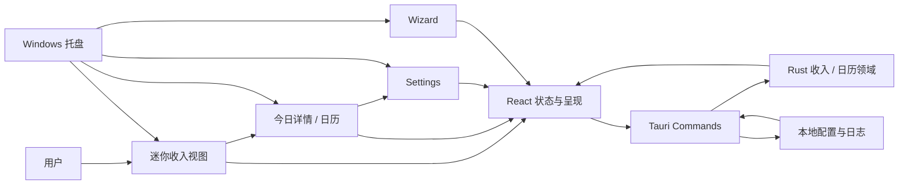
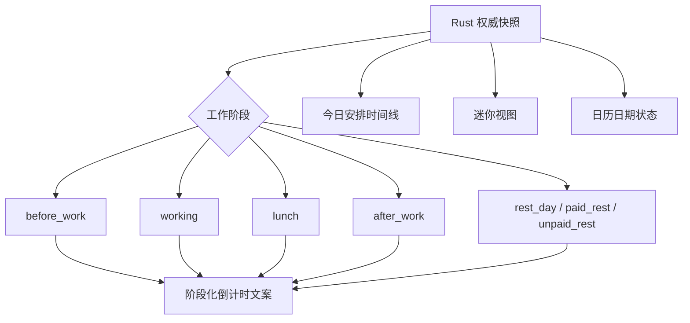

# Review：LetsMakeMoney Windows v1.0.2 正式优化版本

## 追踪信息

- Review ID：`V102-REVIEW-001`
- 当前状态：已完成，等待进入 `/idea`
- 目标版本：Windows v1.0.2 Stable
- 下游承接：`/idea` → `/prd` → `/dev_plan` → 开发 → `/acceptance` → 发布收口
- 当前事实源：`doc/current.md`、本文件、`doc/releases/v1.0.2/issue-pool.md`
- Review 基线：`main`，HEAD `1eb3dadbd37dcc06141e82e5e043db529821a104`
- 最后更新：2026-07-27

## Review 判断

- 自动识别主通路：Project Review。
- 辅助通路：Page Review、Implementation Review、Release Readiness Review。
- 本次范围：重新定义 v1.0.2 正式优化版本，核对现有启动修复、视觉问题、状态文案、日历表达、测试和文档门禁。
- 不覆盖范围：需求价值压力测试、完整 PRD、开发计划、业务代码修改、最终验收和发布动作。
- 总体判断：**v1.0.2 不可继续按“最小热修已通过”直接发布。启动假失败修复可以保留为已完成基线，但正式优化范围尚未完成需求收敛、PRD、开发和验收。**
- 当前发布判断：**不可进入发布收口。**

## 使用工具与证据来源

- 本地项目：实际读取 `apps/windows-v1` 的 React、CSS、状态模型、Rust 收入计算和窗口实现。
- Git：核对分支、HEAD、工作区、未跟踪文件和当前 tag 指向。
- 文档：读取 v1.0.1 发布后观察、v1.0.2 版本入口、问题池、验证、人工补证、进度和 Bugfix Log。
- 真实界面证据：项目所有者提供的时间线、迷你视图、日历入口、阶段倒计时和日期状态截图。
- 历史验收证据：v1.0.2 启动修复候选 Zip、EXE、WebView2Loader 哈希和新解压 GUI 复验。
- 关键检查：`git status --short --branch`、`git rev-parse HEAD`、`rg` 调用与文案扫描、文件规模和依赖检查。
- 已执行验证：代码与文档只读核对、截图与实现交叉核对。
- 未执行验证：本轮未重新启动应用、未重复 GUI 验收、未运行完整自动门禁；已有启动修复证据身份未变化。
- 结论限制：五项视觉问题有真实截图和代码证据，但最终设计方案、范围优先级及验收尺寸需要在 `/idea` 和 `/prd` 收敛。

## 产品定位与版本目标

- 产品定位：无宠物、本地优先的 Windows 收入进度工具。
- 目标用户：希望低打扰地查看当前收入、工作阶段、今日安排和月度日历的 Windows 用户。
- 核心场景：迷你视图常驻桌面；打开今日详情；检查或调整日期；修改工资与作息；通过托盘隐藏和找回。
- v1.0.2 当前目标：在不改变 v1.0.1 收入、日历和配置事务口径的前提下，完成一轮可感知、可验证的界面与状态表达优化。
- 成功标准：阶段文案准确，日历状态可辨，时间线和迷你视图稳定，视觉入口一致，现有业务和桌面行为无回归。
- 非目标：宠物、账号、云同步、主题系统、安装器、静默更新和整体技术栈重写。
- 数据边界：无数据库影响；配置、日志和日历数据继续保存在本地。

## 产品与工程地图

## 状态与呈现关系

## 当前事实基线

### 已完成且应保留

1. `V102-BUG-001` 已修复：有效配置启动时不再短暂误报“暂时无法计算”。
2. 瞬时 `calculation_unavailable` 使用有限重试，真实配置错误仍进入恢复路径。
3. 启动修复具备语义日志、TypeScript 行为测试和新解压候选 GUI 证据。
4. v1.0.1 的收入、日历、日期调整、跨夜 owner date、秒级收益和整数分累计口径未被改写。
5. 迷你视图已支持从任意非阻塞区域拖动，不再依赖顶部横线。

### 尚未完成

1. v1.0.2 正式优化范围尚未通过 `/idea` 压力测试。
2. 尚无 v1.0.2 PRD、需求追踪矩阵、开发计划和正式优化验收矩阵。
3. 五项用户截图问题尚未实现。
4. `V102-CAND-001` 至 `V102-CAND-003` 尚未决定是否进入本版。
5. 当前候选包只证明启动修复，不代表正式优化版本完成。

## 关键发现

| ID | 问题 | 类型 | 严重度 | 证据状态 | 证据 | 用户影响 | 最小建议 | 去向 |
| --- | --- | --- | --- | --- | --- | --- | --- | --- |
| V102-REV-001 | 当前文档仍把 v1.0.2 定义为仅修启动假失败，并标记“可进入发布收口”，与正式优化版本决策冲突 | 事实一致性 | Blocker | 已确认 | `doc/current.md`、v1.0.2 README、progress、verification | 可能误把未开发的正式版本发布出去 | 立即重新打开版本门禁，保留热修证据但撤销整版通过结论 | 直接修文档 |
| V102-REV-002 | 正式优化版没有 PRD、开发计划和最终验收口径 | 流程门禁 | Blocker | 已确认 | `doc/releases/v1.0.2/` 当前文件清单 | 范围、实现和验收无法追踪，容易边做边扩 | 先进入 `/idea`，确认范围后走完整流程 | 进入 `/idea` |
| V102-REV-003 | “剩余有效工时”不能只替换文案，需要基于 before_work、working、休息、after_work 和跨夜边界输出不同目标 | 产品状态 | Major | 已确认 | `App.tsx` 固定文案；Rust 已提供 `next_boundary_seconds`；用户截图 | 夜班和休息阶段表达错误，用户无法判断距离哪个业务节点 | 定义阶段化倒计时合同和零午休/跨夜分支 | 进入 `/idea` |
| V102-REV-004 | “今天、当前选中、手动工作、带薪休息、不带薪休息、焦点”缺少明确视觉优先级 | 视觉与可访问性 | Major | 已确认 | `CalendarView` 叠加多个 class；CSS 中 today/manual 均使用边框；用户截图 | 日期含义容易混淆，颜色和边框冲突 | 建立日期状态矩阵，图形、文字和颜色共同区分 | 进入 `/idea` |
| V102-REV-005 | 时间线的时间列、节点和竖线由不同偏移量拼装，没有共同轴线合同 | 页面布局 | Major | 已确认 | `.schedule li/time/::before/::after`；跨夜真实截图 | 时间线看起来偏斜、不对称，跨夜长内容更明显 | 改为稳定的时间列、轴线列和内容列布局，并覆盖 DPI/跨夜 | 进入 `/idea` |
| V102-REV-006 | 迷你视图顶部拖动横线已失去交互职责，窗口上下留白也受其影响 | 页面布局 | Minor | 已确认 | `MiniWindow` 全面拖动；仍渲染 `mini-window__drag`；用户截图 | 视觉噪音和不必要高度 | 移除横线，并同时验证 loading/error/rest/working 四种高度及窗口找回 | 进入 `/idea` |
| V102-REV-007 | 日历导航使用文字“日”手工拼成图标，和产品图标语言不一致 | 视觉一致性 | Minor | 已确认 | `nav-calendar-mark` 实现；用户截图 | 导航显得临时，降低整体质感 | 选择可再分发的统一图标方案，避免单项手绘特例 | 进入 `/idea` |
| V102-REV-008 | 现有静态测试直接绑定“剩余有效工时”等旧文案，不能证明阶段行为正确 | 测试质量 | Major | 已确认 | `tests/verify_m3.py`、`verify_m4.py` 文案检查 | 改文案可能误报失败；状态错误也可能被静态检查放过 | 增加阶段矩阵行为测试和关键界面截图门禁，再更新静态合同 | 进入 `/idea` |
| V102-REV-009 | `App.tsx`、`styles.css` 和 `model.ts` 同时承载多个窗口、状态和视觉规则，正式优化会放大改动耦合 | 工程质量 | Major | 高度可能 | `App.tsx` 约 55 KB、`styles.css` 约 23 KB、`model.ts` 约 30 KB | 多项界面联改时容易回归，不利于行为测试 | 只做与本版相关的局部拆分：阶段呈现选择器、日历状态映射和窗口组件 | 技术 spike |
| V102-REV-010 | 多个可见窗口分别触发 30 秒权威同步，已有重复日志但尚无用户影响证据 | 工程候选 | Minor | 已确认 | 发布后日志和 `V102-CAND-001` | 可能产生重复计算和日志，当前未证明影响体验 | 测量请求次数、CPU 和日志量后再决定是否共享同步所有权 | 继续验证 |
| V102-REV-011 | 调休工作日和跨夜 owner date 的标题仍使用泛化“工作日/今天” | 内容设计 | Minor | 已确认 | `V102-CAND-002/003`、`TodayView` 固定标题 | 正确计算结果可能被错误文案削弱信任 | 纳入状态文案合同，与阶段倒计时一并收敛 | 进入 `/idea` |
| V102-REV-012 | 五项优化缺少统一视觉基线，若逐个打补丁会继续产生不一致 | 设计治理 | Suggestion | 高度可能 | 用户连续真实截图、现有原型与代码样式 | 单项修正后整体仍可能显得零散 | 以 v1.0 原型、真实窗口和 100%/125%/150% DPI 建立同一验收基线 | 进入 `/idea` |

## Windows 界面差距矩阵

| 区域 | 当前表现 | 正式优化目标 | 关键验收 |
| --- | --- | --- | --- |
| 迷你视图 | 顶部仍有拖动横线；固定显示剩余有效工时 | 去除冗余横线；按当前阶段显示距离上班、休息或下班 | 四种页面状态高度稳定；任意位置拖动不回归 |
| 今日安排 | 时间、节点和轴线偏移；夜班仍称午休 | 共用轴线；统一称休息；跨夜时间顺序可读 | 普通班、零休息、跨夜班和长时间文本 |
| 日历入口 | 文字框模拟图标 | 使用统一、清晰、可再分发的产品图标 | 100%/125%/150% DPI 清晰 |
| 日期单元格 | 今天和手动/选中状态边框竞争 | 状态优先级明确，今天最醒目但不覆盖业务含义 | 今天、选中、四类日期调整、焦点和禁用组合 |
| 内容标题 | “今天/工作日”未体现 owner date 和调休来源 | 标题与权威日期、来源和当前阶段一致 | 跨夜 owner date、调休工作日和普通工作日 |

## 值得保留的部分

- Rust + Tauri + React 技术栈和本地优先产品边界。
- v1.0.1 收入、日历、日期调整和跨夜班次领域模型。
- 启动有限重试及真实错误保护。
- 秒级本地推进与 30 秒权威同步机制。
- 配置安全写入、失败补偿和恢复路径。
- 迷你视图任意非阻塞区域拖动能力。
- 休息日、带薪休息和不带薪休息的独立页面分支。
- 现有便携 Zip 发布方式和 v1.0.1 历史发布身份。

## 进入 /idea 的候选点

| 候选点 | 来源 | 证据强度 | 为什么值得判断 | 建议下一步 |
| --- | --- | --- | --- | --- |
| 阶段化倒计时与统一“休息”语义 | V102-CAND-007 | 强，已确认 | 高频迷你视图直接影响日常理解 | 建立状态文案矩阵 |
| 时间线结构重排 | V102-CAND-004 | 强，已确认 | 跨夜场景已经暴露结构问题 | 明确三列布局和 DPI 门禁 |
| 迷你视图去横线与尺寸收敛 | V102-CAND-005 | 强，已确认 | 交互职责已被全窗口拖动替代 | 定义四状态最小尺寸 |
| 日历日期状态体系 | V102-CAND-008 | 强，已确认 | 业务状态与导航状态可能同时存在 | 明确状态优先级和无障碍表达 |
| 日历入口图标统一 | V102-CAND-006 | 强，已确认 | 当前为临时文字图标 | 选择统一图标来源 |
| 调休与 owner date 内容口径 | V102-CAND-002/003 | 强，已确认 | 影响用户对正确计算的信任 | 与阶段文案共同收敛 |
| 多窗口权威同步所有权 | V102-CAND-001 | 中，待量化 | 可能减少重复请求和日志 | 技术测量后再决定 |
| 相关 React 状态与组件局部拆分 | V102-REV-009 | 中，高度可能 | 降低正式优化联改风险 | 仅做针对性 spike |

## 下一步分流建议

| 去向 | 事项 | 理由 | 最小下一步 |
| --- | --- | --- | --- |
| 直接修文档 | 撤销整版“通过/可发布”结论 | 当前事实已改变 | 本轮完成 |
| 进入 `/idea` | V102-CAND-002 至 V102-CAND-008 | 均有真实证据，但仍需价值、依赖和范围压力测试 | 形成正式需求池和三档方案 |
| 技术 spike | 多窗口同步、局部组件拆分、阶段呈现选择器 | 需要量化收益和回归风险 | 输出只读测量与最小合同 |
| 进入 `/prd` | 暂不直接进入 | 尚未确认正式版本组合 | `/idea` 确认后再进入 |
| 进入 `/acceptance` | 启动修复证据保留，不代表整版验收 | 正式优化尚未实现 | 实现完成后重建候选包验收 |
| 暂不做 | 宠物、账号、云同步、主题、安装器、静默更新、整体重写 | 超出本版定位 | 保持范围保护 |

## 当前必须停止的动作

- 不使用当前热修候选包创建 v1.0.2 tag 或 Release。
- 不把 `verification.md` 的启动修复结论解释成正式优化版通过。
- 不在没有状态合同的情况下直接替换倒计时文案。
- 不以单张截图的像素修补代替跨夜、DPI 和组合状态验证。

## 给下一阶段的摘要

v1.0.2 已从“单缺陷稳定热修”升级为“正式体验优化版本”。启动假失败修复已完成，可直接作为版本基线保留；新增正式范围至少包含时间线、迷你视图、日历入口、阶段化倒计时和日期状态区分。正式版本还需判断调休/跨夜内容口径、多窗口同步与局部组件拆分是否进入。下一阶段必须先走 `/idea`，不得直接开发或发布。

## 下一阶段建议

- 推荐下一步：`/mypm /idea`
- 输入材料：本 Review、`issue-pool.md`、五张真实截图、v1.0.1 PRD 与现有 v1.0 原型。
- 停止点：需求池和版本组合确认后，再进入 `/prd`。
