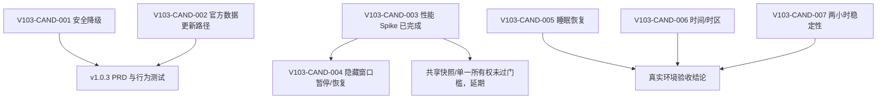

# LetsMakeMoney v1.0.3 候选分流

## 分流原则

1. 当前输出是 Review 候选，不是已确认需求。
2. P0 只放会导致核心收入、日历或用户信任错误的事项。
3. 真实环境未验证项不能写成已确认缺陷。
4. 2027 年官方数据未发布前不得猜测。
5. 工程治理必须先有测量或 profile，不以代码更短为目标。
6. 多窗口性能 Spike 已完成；路由以 `performance-spike.md` 为准。

## 候选清单

| ID | 标题 | 来源 | 证据状态 | 优先级 | 价值 | 风险与成本 | 推荐去向 |
| --- | --- | --- | --- | --- | --- | --- | --- |
| V103-CAND-001 | 不支持年份安全降级 | V103-REV-001 | 已确认 | P0 | 保证 2027 年及数据异常时核心收入和日历仍可用 | 中；涉及 Dashboard、Calendar、Rust 错误分类和行为测试 | 进入 `/idea`，收敛后进入 `/prd` |
| V103-CAND-002 | 2027 官方日历数据更新路径 | 日历 horizon | 待确认 | P1 | 在官方数据发布后恢复完整节假日与调休语义 | 中；来源发布时间未知，不能提前填值 | 继续验证，形成数据更新 checklist |
| V103-CAND-003 | 双窗口资源 profile | V103-REV-002 | 已确认 | P1 | 识别隐藏窗口重复工作并避免错误架构决策 | 中；已完成五组测量和日志序列分析 | Spike 已完成，保留证据 |
| V103-CAND-004 | 多窗口同步治理 | V103-CAND-003 | 部分已确认 | P1 | 隐藏窗口停止无效 tick 与同步，显示后立即收敛 | 小到中；需覆盖所有隐藏路径和 timer 恢复。共享所有权成本大且收益未证 | 生命周期暂停进入 `/prd`；共享所有权暂不处理 |
| V103-CAND-005 | 睡眠/恢复真实验收 | V103-REV-004 | 待确认 | P1 | 证明长期桌面工具从睡眠恢复后金额和状态可信 | 小；需要真实 Windows 操作 | 进入 `/acceptance` |
| V103-CAND-006 | 系统时间与时区纠偏验收 | V103-REV-003 | 待确认 | P1 | 防止跨时区或手动改时钟后的短期错误 | 小到中；需系统级测试和环境恢复 | 进入 `/acceptance` |
| V103-CAND-007 | 两小时稳定性 | V103-REV-005 | 待确认 | P1 | 证明常驻运行不会持续恶化 | 小；耗时但实现风险低 | 进入 `/acceptance` |
| V103-CAND-008 | v1.0.2 文档版本漂移修正 | V103-REV-006 | 已确认 | P2 | 降低维护和贡献者理解成本 | 小；不得改写历史结论 | 直接修文档 |
| V103-CAND-009 | 相关状态代码局部拆分 | V103-REV-007 | 主观判断 | P2 | 在修复范围内降低回归面 | 中；无独立用户价值 | 随功能最小实施，暂不独立立项 |

## 依赖关系

## 最小方案

- 修复不支持年份的长期休息模式降级。
- 保持手动日期调整可用。
- 增加 2027 unsupported 的 Dashboard、Calendar 和配置行为测试。
- 修正文档版本漂移。
- 不处理双窗口性能，仅保留测量证据。

评价：能关闭最明确的未来核心风险，但继续保留已确认的双窗口资源债。

## 推荐方案

- 包含最小方案全部内容。
- 保留 Mini 与 Workbench 的可重复 profile 和归因报告。
- 实现隐藏窗口暂停本地 tick 与权威同步、重新显示后立即权威收敛。
- 不实施共享权威快照或单一同步所有权。
- 执行真实 Windows 睡眠/恢复、系统时间/时区和两小时稳定性验收。
- 官方 2027 数据若在实施期已发布，则按数据门禁纳入；尚未发布则只交付安全降级和更新流程。

评价：同时关闭核心年度风险和真实常驻成本，且不预设大重构。

## 过大方案

以下内容不建议进入 v1.0.3：

- 重写全局状态管理或整个 `model.ts`。
- 将所有窗口改为单 WebView 或重写窗口架构。
- 在线节假日服务、云同步或远程配置中心。
- 自动更新、安装器、账号或跨平台。
- 新主题、整体视觉重做或恢复宠物功能。

这些工作会显著扩大回归面，且没有本轮证据证明它们是解决现有问题的最小方式。

## 进入下一阶段的门禁

进入 `/idea` 前无需新增业务决策，但需要保持以下开放条件：

以下决策已确认：

1. v1.0.3 在 2027 官方数据发布前交付，使用明确标注的非官方估算降级。
2. 共享所有权采用既定 CPU 与请求/日志阈值；本次 Spike 未达到，不实施。
3. 睡眠恢复与系统时间跳变阻塞发布；时区需真实证据；因 timer 生命周期会修改，两小时稳定运行阻塞发布。

当前可以进入 `/prd`，并把生命周期暂停/恢复作为唯一多窗口实现项。
