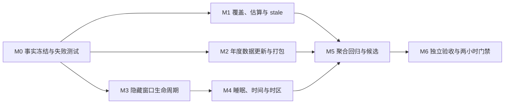

# LetsMakeMoney Windows v1.0.3 开发计划

## 追踪信息

| 项目 | 内容 |
| --- | --- |
| 当前状态 | 开发承接完成，等待实施授权 |
| 目标版本 | Windows v1.0.3 Stable |
| 当前公开版本 | Windows v1.0.2 Stable |
| 上游来源 | `idea-pool.md`、`prd.md`、`performance-spike.md` |
| 追踪矩阵 | `traceability.md` |
| 高保真原型 | `../../prototypes/v1.0/index.html` |
| 下游承接 | `progress_v1.0.3.md`、后续 verification 与独立 Acceptance |
| 开发日志 | `../../logs/dev_log_v1.0.3.md` |
| 实施基线 | `main` / `27dc11421daa8289caf06d92c2f397d64c64c5df` |
| 最后更新 | 2026-07-30 |

## 1. 开发范围

### 1.1 本次包含

- `FR-001` 年度日历覆盖状态与错误分类。
- `FR-002` 不支持年份的估算与全链路一致性。
- `FR-003` stale、完整性失败与旧数据保护。
- `FR-004` 官方年度日历更新、验证与回滚流程。
- `FR-005` 隐藏窗口生命周期暂停与恢复。
- `FR-006` 睡眠、系统时间与时区恢复合同。
- `FR-007` 两小时稳定运行门禁。
- `FR-008` 当前事实文档收口。

`V103-IDEA-003` 的性能技术 Spike 已完成，只作为 `FR-005` 和 `FR-007` 的实施证据，不重复开发。

### 1.2 本次不包含

- 不补写、推测或伪造尚未发布的 2027 官方节假日与调休数据。
- 不加入在线日历服务、运行时下载、应用内导入或用户手工导入年度数据。
- 不修改月薪、整数分累计、秒级收益、跨夜 owner date 或日期调整事务口径。
- 不实现共享 React Dashboard store、跨 WebView 快照广播或永久同步所有者。
- 不恢复宠物或 PetManager。
- 不加入账号、云同步、安装器、静默更新或多平台能力。
- 不重写技术栈、全局状态管理或全部窗口架构。
- 无数据库影响。

### 1.3 实施原则

1. 先冻结覆盖状态、错误分类、生命周期和时间采样合同，再编写失败测试。
2. `unsupported` 只表示缺少该年份的官方数据；manifest、hash、schema 或来源错误不得进入估算。
3. 手动日期调整优先于官方数据，官方数据优先于休息模式估算。
4. 估算结果直接消费当前配置，不得只按年份缓存并跨配置复用。
5. stale 只能保护同一目标月份的最后可信结果，不得跨月份或跨年份借用。
6. Rust/Tauri 继续承担权威日历校验、窗口生命周期和领域计算；React 负责展示、局部 tick 和失败补偿。
7. 隐藏窗口只暂停该 WebView 的 timer，不改变其他窗口，也不引入共享同步架构。
8. 真实睡眠、时间、时区和两小时运行只能由最终候选包取证，自动测试不能代替。
9. 每个里程碑运行受影响验证；M5 才执行完整历史回归、版本更新和候选构建。
10. 任何完整性失败、timer 复制或环境未恢复均阻塞发布。

## 2. PRD 对照

| FR | 上游 IDEA | 开发模块 | 主要里程碑 |
| --- | --- | --- | --- |
| FR-001 | V103-IDEA-001 | Rust 日历加载、覆盖状态、前端状态模型 | M0、M1 |
| FR-002 | V103-IDEA-001 | 估算日历、休息模式、日期调整、Dashboard | M0、M1 |
| FR-003 | V103-IDEA-001 | 缓存隔离、stale、完整性失败、重试 | M0、M1 |
| FR-004 | V103-IDEA-002 | manifest、年度数据、构建、打包和回滚 | M0、M2 |
| FR-005 | V103-IDEA-004 | Tauri 窗口事件、React timer 生命周期 | M0、M3 |
| FR-006 | V103-IDEA-005、006 | 时间环境采样、权威重算、真实 Windows 验收 | M0、M4、M6 |
| FR-007 | V103-IDEA-007 | 请求、资源、日志和两小时稳定性证据 | M0、M4、M6 |
| FR-008 | V103-IDEA-008 | README、current、progress、verification | M0、M6 |

## 3. 文件与模块影响

| 模块 / 文件 | 计划改动 | 责任边界 |
| --- | --- | --- |
| `apps/windows-v1/src-tauri/src/calendar_data.rs` | 修改 | 覆盖分类、manifest 驱动年度发现、完整性错误和官方数据元信息 |
| `apps/windows-v1/src-tauri/src/domain.rs` | 局部修改或复用 | 使用现有休息模式和日期调整解析估算日历，不改变收入公式 |
| `apps/windows-v1/src-tauri/src/lib.rs` | 修改 | command 覆盖元信息、统一 hidden/shown 事件、低频语义日志 |
| `apps/windows-v1/src-tauri/build.rs` | 可能修改 | 从 manifest 生成确定性年度资源索引，禁止年份手写分支 |
| `apps/windows-v1/src/model.ts` | 修改 | `CalendarCoverage`、估算与官方缓存隔离、Dashboard 生命周期 |
| `apps/windows-v1/src/calendarState.ts` | 修改 | official/estimated/stale/integrity_error/loading 状态迁移 |
| `apps/windows-v1/src/authoritativeSync.ts` | 修改 | 生命周期、wall/monotonic/timezone 环境样本与竞态去重 |
| `apps/windows-v1/src/App.tsx` | 局部修改 | Today、Calendar 的来源标签、stale/error/retry 和只读状态 |
| `apps/windows-v1/src/styles.css` | 局部修改 | 浅色/深色的来源、stale、失败和禁用状态，不重做界面 |
| `apps/windows-v1/calendar-data/manifest.json` | 合同升级 | 数据版本、支持年份、来源、文件和 SHA256 的唯一事实源 |
| `apps/windows-v1/calendar-data/contracts/` | 修改 | manifest 与年度数据 schema、冲突和范围约束 |
| `apps/windows-v1/calendar-data/cn-2025.json` | 只读回归 | 既有官方数据不得改变 |
| `apps/windows-v1/calendar-data/cn-2026.json` | 只读回归 | 既有官方数据不得改变 |
| `apps/windows-v1/tests/` | 新增/修改 | 覆盖矩阵、估算、stale、生命周期、时间和 timer 行为 |
| `apps/windows-v1/package.json`、Rust 版本文件 | M5 修改 | 最终候选前统一升级到 1.0.3 |
| `scripts/verify_v103.ps1` | 新增 | 聚合 v1.0.3 与历史回归门禁 |
| `scripts/package_v103.ps1` | 新增 | manifest 驱动复制年度数据并生成 BUILD-INFO |
| `scripts/verify_v103_package.ps1` | 新增 | 动态核对 manifest、年度文件、来源、hash 和包结构 |
| `.github/workflows/windows-v1-verify.yml` | 修改 | 接入 v1.0.3 自动门禁，不削弱既有检查 |
| `doc/releases/v1.0.3/` | 新增/修改 | progress、verification、manual、release checklist/notes |
| `apps/windows-v1/README.md`、`doc/current.md` | 修改 | 当前 Stable 与开发状态事实收口 |

## 4. 核心实现合同

### 4.1 日历覆盖与缓存

```text
官方年度数据存在且完整
  -> official

年度不在 manifest 支持列表
  -> estimated
  -> 依据当前 rest_mode、大小周锚点和 date_overrides 即时生成

manifest / hash / schema / 来源失败
  -> 同目标月份存在最后可信结果：stale
  -> 否则：integrity_error
```

- 官方缓存可按年度和数据版本缓存。
- 估算缓存键至少包含年份、休息模式、大小周锚点和日期调整修订；优先采用纯函数即时生成，避免缓存漂移。
- rejected Promise 和失败结果不得永久驻留缓存。
- stale 只允许读取；日期调整入口保持禁用，重试成功后恢复。

### 4.2 年度数据索引

- `manifest.json` 是支持年份、文件名、来源、schema 和 hash 的唯一事实源。
- Rust 资源索引由 manifest 在构建期确定性生成或等价装配，不保留 `match 2025/2026`。
- 新增年度必须同时通过 schema、日期范围、重复日期、冲突、来源域名、SHA256 和包内交叉校验。
- 2027 官方公告发布前，不创建任何标记为 official 的 2027 数据文件。

### 4.3 窗口生命周期

- 所有成功隐藏路径统一产生 `lmm:window-hidden`。
- 所有成功显示路径统一产生 `lmm:window-shown`。
- 当前 WebView 收到 hidden 后停止 1 秒 tick、30 秒权威同步和启动重试 timer。
- 隐藏时保留最后可信快照；配置更新只标记“恢复时需同步”。
- shown 后重置 wall/monotonic/timezone 样本，立即发起一次权威同步，再注册唯一一套 timer。
- 连续 10 次隐藏/恢复不得产生重复监听器、timer 或并发恢复请求。

### 4.4 时间环境

环境样本至少包含：

- wall-clock 毫秒值；
- monotonic 毫秒值；
- IANA/Windows 可映射的时区标识；
- 当前 UTC offset。

检测到睡眠跨度、系统时间前后跳、时区标识或 offset 变化时：

1. 停止使用旧样本继续累计；
2. 记录不含用户隐私的原因；
3. 触发一次权威同步；
4. 本地展示 5 秒内更新，权威结果最迟 30 秒内收敛；
5. 跨夜 owner date、金额和日历必须来自同一次权威结果。

## 5. 依赖与实施顺序



必须串行：

1. M0 先冻结错误分类、缓存、生命周期和时间采样合同。
2. M1 的覆盖分类先于估算 UI 和 stale 补偿。
3. M3 的 timer 生命周期先于真实睡眠和时间恢复。
4. M5 只在 M1-M4 全部通过后升级版本并构建候选。
5. M6 的两小时运行只针对最终锁定、全新解压的候选包。

允许并行：

- M1 日历运行时与 M3 窗口生命周期。
- M2 年度数据工具链与 M3 前端 timer 测试。
- M4 自动时间夹具与 M2 包验证脚本。
- verification/manual verification 骨架与各里程碑测试清单。

## 6. 里程碑与最小任务

### V103-M0 事实冻结、合同与失败测试

- [ ] `V103-M0-001` 记录分支、HEAD、工作树和 v1.0.2 Release、Zip、EXE、WebView2Loader 身份。
- [ ] `V103-M0-002` 冻结 2025、2026 manifest 与年度 JSON SHA256，建立不可变回归夹具。
- [ ] `V103-M0-003` 定义 `CalendarCoverage`、来源元信息和 unsupported/integrity 错误矩阵。
- [ ] `V103-M0-004` 建立单休、双休、大小周、跨年 owner date 和四种日期调整估算夹具。
- [ ] `V103-M0-005` 建立 manifest/hash/schema/source 失败、同月 stale 和跨月隔离夹具。
- [ ] `V103-M0-006` 建立 hidden/shown、timer 唯一性、隐藏配置变化和卸载清理失败测试。
- [ ] `V103-M0-007` 建立 wall/monotonic/timezone 样本、前后跳和跨夜竞态失败测试。
- [ ] `V103-M0-008` 建立 `verify_v103` 骨架、证据目录规范和文档状态入口。

完成标准：

- 新测试能明确区分未实现行为和既有稳定行为。
- 不修改业务结果、版本号或发布产物。
- v1.0.2 稳定夹具全部仍通过。

### V103-M1 覆盖分类、估算与 stale 保护

- [ ] `V103-M1-001` Rust 返回统一覆盖状态、年份、数据版本、来源与错误分类。
- [ ] `V103-M1-002` 将“年份不在 manifest”与 manifest/hash/schema/source 失败严格分离。
- [ ] `V103-M1-003` 使用现有休息模式、大小周锚点和 owner date 生成 unsupported 年份估算日历。
- [ ] `V103-M1-004` 落地“手动日期调整 > 官方数据 > 休息模式估算”的统一优先级。
- [ ] `V103-M1-005` 区分官方不可变缓存与配置相关估算结果，清除 rejected Promise。
- [ ] `V103-M1-006` 让 Dashboard、Today、Calendar、今日安排和日期调整消费同一覆盖结果。
- [ ] `V103-M1-007` 实现同目标月份 stale 保留、跨范围隔离和 stale 只读。
- [ ] `V103-M1-008` 落地 official/estimated/stale/integrity_error/loading 的浅色与深色状态。
- [ ] `V103-M1-009` 实现重试、失败补偿、诊断摘要和脱敏语义日志。
- [ ] `V103-M1-010` 完成三种休息模式、跨年、override、错误分类和历史收入回归。

完成标准：

- 2027 等 unsupported 年份核心页面可用且明确标记“估算”。
- 完整性错误绝不伪装成估算。
- 2025、2026 官方结果和 v1.0.2 收入结果逐 fixture 一致。

### V103-M2 年度数据更新、验证与包合同

- [ ] `V103-M2-001` 用 manifest 驱动 Rust 年度资源发现，移除年份硬编码分支。
- [ ] `V103-M2-002` 校验 manifest schema、年度 schema、支持年份、文件名、来源和数据版本。
- [ ] `V103-M2-003` 校验日期范围、重复日期、法定节假日与调休冲突及字段枚举。
- [ ] `V103-M2-004` 对全部年度文件执行 SHA256，并与 manifest 双向核对未知或缺失文件。
- [ ] `V103-M2-005` 编写官方年度数据加入、权威来源复核和整组回滚说明。
- [ ] `V103-M2-006` 让 BUILD-INFO 动态记录 manifest 和每个年度数据文件身份。
- [ ] `V103-M2-007` 让打包与包体验证动态枚举 manifest，不再固定 2025/2026。
- [ ] `V103-M2-008` 验证失败时拒绝候选包，并回归 2025、2026 数据和哈希不变。

完成标准：

- 加入新年度无需修改 Rust 年份分支。
- 缺文件、未知文件、错来源、错 hash 或冲突数据均返回非零。
- 不包含虚假或推测的 2027 official 数据。

### V103-M3 隐藏窗口生命周期暂停与恢复

- [ ] `V103-M3-001` 盘点 Mini、Workbench、托盘、关闭隐藏及所有显示/恢复路径。
- [ ] `V103-M3-002` 在成功隐藏和显示后发送统一、可追踪的 hidden/shown 事件。
- [ ] `V103-M3-003` 抽取当前 WebView 的 Dashboard timer 生命周期控制器。
- [ ] `V103-M3-004` hidden 时暂停本地 tick、权威同步和启动重试，保留最后可信快照。
- [ ] `V103-M3-005` hidden 期间配置变化只标记待同步，不清空或后台重算。
- [ ] `V103-M3-006` shown 时重置时间样本、执行一次即时权威同步并恢复唯一 timer。
- [ ] `V103-M3-007` 覆盖重复事件、快速切换、卸载清理、恢复失败和晚到结果竞态。
- [ ] `V103-M3-008` 使用真实托盘与关闭隐藏路径核对 65 秒请求、日志和恢复收敛。

完成标准：

- 隐藏 65 秒没有该窗口的 `interval_30s` 请求。
- 连续隐藏/恢复 10 次后仍只有一套 1 秒 tick 和 30 秒同步。
- 不建立共享快照或永久同步所有者。

### V103-M4 睡眠、系统时间、时区与稳定性准备

- [ ] `V103-M4-001` 建立 wall、monotonic、timezone id 和 offset 的纯环境样本。
- [ ] `V103-M4-002` 检测睡眠跨度、系统时间向前/向后跳和时区变化。
- [ ] `V103-M4-003` 对 focus、shown、visibility 和 timer 触发进行去重，只保留一次权威恢复。
- [ ] `V103-M4-004` 覆盖普通日班、跨夜 owner date、unsupported 估算和边界跨越。
- [ ] `V103-M4-005` 增加低频、脱敏的时间环境变化和恢复结果日志。
- [ ] `V103-M4-006` 建立真实 Windows 睡眠、改时钟、改时区和环境恢复操作清单。
- [ ] `V103-M4-007` 建立两小时请求、timer、CPU、内存和日志采样脚本。
- [ ] `V103-M4-008` 运行自动时间夹具和受控短时恢复预检，不冒充真实系统通过。

完成标准：

- 自动测试证明检测和竞态逻辑正确。
- 真实系统步骤、预期、证据和恢复动作可被 Acceptance 直接执行。
- 尚未执行的真实 Windows 项保持“待验证”。

### V103-M5 聚合回归、版本与候选包

- [ ] `V103-M5-001` 统一更新 npm、Cargo、Tauri 配置和应用可见版本为 1.0.3。
- [ ] `V103-M5-002` 完成 `verify_v103.ps1`，聚合 M0-M4 与 v1.0-v1.0.2 回归。
- [ ] `V103-M5-003` 将 v1.0.3 门禁接入 CI，保持许可、敏感信息和文档检查。
- [ ] `V103-M5-004` 完成 `package_v103.ps1` 的动态年度数据、BUILD-INFO 和许可复制。
- [ ] `V103-M5-005` 完成 `verify_v103_package.ps1` 的包内 manifest、年度文件和哈希核对。
- [ ] `V103-M5-006` 从干净源码状态构建唯一候选，记录 source HEAD 与 dirty 状态。
- [ ] `V103-M5-007` 校验 Zip、EXE、WebView2Loader、年度数据和 SHA256SUMS。
- [ ] `V103-M5-008` 新解压候选完成启动、配置、主题、日历、托盘和窗口基础冒烟。

完成标准：

- 自动门禁和历史回归全部通过。
- 候选身份唯一、可审计，发布包不含临时证据或未知文件。
- 不因构建完成提前写为验收通过或已发布。

### V103-M6 独立 Acceptance、两小时门禁与文档收口

- [ ] `V103-M6-001` 锁定候选身份，备份配置、日志、系统时间、时区和进程状态。
- [ ] `V103-M6-002` 从新解压候选验证 official/estimated/stale/error/retry 全链路。
- [ ] `V103-M6-003` 验证估算年份四种日期调整、取消、失败、重启持久化和恢复自动。
- [ ] `V103-M6-004` 验证托盘与关闭隐藏、65 秒静默、10 次恢复及隐藏配置收敛。
- [ ] `V103-M6-005` 在工作和休息阶段执行真实 Windows 睡眠并跨越业务边界。
- [ ] `V103-M6-006` 执行系统时间向前/向后调整并恢复，核对金额、阶段、owner date 和日历。
- [ ] `V103-M6-007` 执行真实 Windows 时区切换并恢复，保存截图、日志和系统证据。
- [ ] `V103-M6-008` 对最终候选连续运行至少 120 分钟，汇总请求、timer、CPU、内存和日志。
- [ ] `V103-M6-009` 恢复配置、日志、系统时间、时区和进程状态，并校验恢复结果。
- [ ] `V103-M6-010` 更新 verification、manual verification、progress、release checklist、release notes 和 current。
- [ ] `V103-M6-011` 运行文档状态、UTF-8、乱码、本地链接、包验证和 `git diff --check`。
- [ ] `V103-M6-012` 给出“可进入发布收口 / 不可进入发布收口”结论，不执行发布动作。

完成标准：

- 所有发布门禁具有真实证据；未执行项不得写为通过。
- 用户环境完整恢复。
- 无发布阻塞后才允许另行进入发布收口。

## 7. 测试与验收分层

| 层级 | 主要内容 | 不能替代 |
| --- | --- | --- |
| Rust 单元/表驱动 | manifest、年度数据、估算、override、错误分类 | React 状态与真实窗口 |
| TypeScript 行为测试 | 缓存、stale、timer、时钟/时区样本、竞态 | Rust 权威计算与真实系统 |
| React DOM/原型 | 来源标签、只读、重试、浅深主题 | WebView/Tauri 桌面行为 |
| 脚本与包验证 | schema、hash、BUILD-INFO、候选结构 | GUI 和系统时间 |
| Computer Use | 新解压候选、窗口、托盘、反馈和状态切换 | 通知区或系统操作不可达部分 |
| 人工真实系统 | 睡眠、时区、两小时运行和必要通知区入口 | 自动化合同 |

## 8. 风险与回退

| 风险 | 影响 | 处理与回退 |
| --- | --- | --- |
| unsupported 与完整性错误混淆 | 用户把不可信数据当估算 | 错误枚举和表驱动测试；失败回退到 v1.0.2 严格加载 |
| 估算结果缓存漂移 | 修改休息模式后仍显示旧结果 | 配置相关缓存键或即时生成；恢复时权威同步 |
| stale 跨月份泄漏 | 展示错误月份收入和日历 | 缓存按目标月份与来源隔离，late result 丢弃 |
| manifest 驱动资源索引漏文件 | 构建成功但运行缺年度数据 | 构建期索引、双向枚举和包体验证 |
| hidden/shown 重复注册 | 请求、CPU 和日志倍增 | 单一生命周期控制器、fake timer 和 10 次循环门禁 |
| 睡眠/改时钟恢复竞态 | owner date 或金额漂移 | 重置样本、请求序列去重、最终权威结果覆盖 |
| 时区测试污染环境 | 用户系统时间环境被改变 | 操作前记录、操作后自动与人工双重恢复 |
| 两小时证据使用非最终候选 | 稳定性结论失效 | 只接受锁定 hash 的新解压最终候选 |

## 9. 开发日志与状态约定

- 实施过程、关键决策、异常和验证摘要写入 `doc/logs/dev_log_v1.0.3.md`。
- progress 只记录 checklist、状态、阻塞、最近验证和下一步。
- 新缺陷进入后续 `v1.0.3-bugfix-log.md`，不把排查流水写入 progress。
- PRD、Spike 或自动测试完成不等于 GUI、真实系统或 Stable 验收通过。
- 年度数据内容与应用代码分开提交和回滚；2027 官方数据未发布前没有内容提交。

## 10. 实施启动门禁

开始 `V103-M0` 前必须确认：

1. 项目所有者已经确认 v1.0.3 PRD，本文件和 progress 已生成。
2. 工作树现有修改来源已记录，不覆盖或撤销 PRD/原型成果。
3. Node、Rust、Python 和现有验证工具链可用。
4. 不把 v1.0.3 文档状态误写成业务已实现。
5. 不在 M0 之外顺带修改产品功能。

当前结论：开发承接已完成，尚未获得开始 `V103-M0` 业务实施的单独授权。
