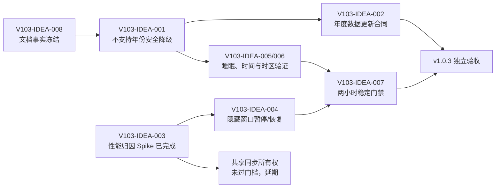

# LetsMakeMoney Windows v1.0.3 候选需求池

## 追踪信息

- 文档状态：Idea、性能技术 Spike 与完整 PRD 已完成；PRD 已确认，开发承接完成
- 目标版本：Windows v1.0.3 Stable
- 当前公开版本：Windows v1.0.2 Stable
- 当前开发基线：`main`，HEAD `27dc11421daa8289caf06d92c2f397d64c64c5df`
- 上游 Review：`V103-REV-001` 至 `V103-REV-007`
- 上游候选：`V103-CAND-001` 至 `V103-CAND-009`
- 当前事实源：`doc/current.md`、本文件、`prd.md`、`traceability.md` 及 `doc/releases/v1.0.3/` 下的 Review 文档
- Review 性能证据：Review 专用临时证据目录，未纳入 Git
- Spike 报告：`doc/releases/v1.0.3/performance-spike.md`
- Spike 原始证据：Spike 专用临时证据目录，未纳入 Git
- 最后更新：2026-07-29

## Idea 阶段判断

### 版本主线

v1.0.3 应是一轮“跨年可用性与长期运行可信度”优化。核心目标不是提前补写尚未公布的 2027 官方日历，而是在官方数据缺席、Windows 睡眠恢复、系统时间变化和多窗口长期运行时，仍保证收入、日历、状态和用户配置可用且语义诚实。

### 当前结论

- `V103-IDEA-001` 是唯一 P0：不支持年份不能让 Dashboard 与日历整体不可用。
- 官方日历更新流程可以进入 v1.0.3，但 2027 数据内容只能在权威来源正式发布后补充。
- 双窗口稳定产生约 `2.05` 倍的权威请求和日志。隐藏 Mini 或 Workbench 后仍保持双流同步，证明 Tauri `hide()` 没有触发现有 `document.visibilityState` 守卫。
- CPU 样本跨重复运行波动显著，无法证明重复同步是主要 CPU 来源，也不能证明内存泄漏。
- 共享快照或单一同步所有权没有达到项目所有者确认的实施阈值，不进入 v1.0.3 PRD。
- 隐藏窗口暂停本地 tick 与权威同步、重新显示后立即收敛，是证据支持的最小生命周期修复，进入 v1.0.3 PRD。
- 睡眠恢复、系统时间和时区变化、两小时稳定运行缺少真实 Windows 证据，应进入验收设计。
- 两处文档事实漂移应直接修正文档，不升级为产品需求。

### 发布判断

完整 PRD 和追踪矩阵已把安全降级、生命周期暂停/恢复及真实 Windows 验收门禁写成可执行标准。项目所有者已确认 PRD，开发计划和进度文档已经生成；当前尚未开始业务实施，也不可进入发布收口。

## 上游证据摘要

| 证据 | 状态 | 结论 |
| --- | --- | --- |
| `doc/releases/v1.0.3/review.md` | 已确认 | 2027 及以后年份被 Rust 严格拒绝，Dashboard 与日历可能失去核心可用性 |
| `apps/windows-v1/src-tauri/src/calendar_data.rs` | 已确认 | 只嵌入 2025、2026；manifest、年份、来源和 SHA256 校验严格 |
| `apps/windows-v1/calendar-data/manifest.json` | 已确认 | 数据集版本为 `cn-2025-2026-v1`，支持年份只有 2025、2026 |
| `apps/windows-v1/src/model.ts` | 已确认 | Dashboard 与日历在应用手动调整前先调用严格年份加载；失败会进入 error、stale 或 unsupported |
| `apps/windows-v1/src-tauri/src/config.rs` | 已确认 | 日期调整计算遇到不支持年份时可退回 `CalendarData::default()`，继续使用休息模式 |
| `doc/releases/v1.0.1/prd.md` | 已确认 | 手动调整优先于官方数据；资源失败应保护旧数据并可退回长期休息规则；不得伪造官方数据 |
| `verify_v101_m0.py`、`verify_v101_m1.py` | 已确认 | 本机各 5/5 通过，证明当前 2025—2026 严格合同内部一致，不证明跨年降级正确 |
| 两次真正 Mini 单窗口测量 | 已确认 | 两次均为 21 次请求、42 行日志；证明单一 30 秒权威同步流稳定 |
| Mini + Workbench 测量 | 已确认 | 43 次请求、86 行日志，约为单窗口的 2.05 倍 |
| Mini 隐藏 / Workbench 可见 | 已确认 | 仍为 43 次请求、86 行日志；隐藏窗口未暂停同步 |
| Workbench 隐藏 / Mini 可见 | 已确认 | 191 秒出现 12 次请求；两套序列号 `30–35` 与 `4–9` 交错 |
| CPU 与内存重复样本 | 已确认 | 同一 Mini 场景 CPU 差异显著；短期内存变化没有稳定单调关系，不能证明同步 CPU 占比或内存泄漏 |
| `useDashboard()` 与隐藏调用链 | 已确认 | Mini 与 Workbench 各自维护 timer；原生 `hide()` 未发送隐藏事件，现有 visibility 守卫未生效 |
| 时间监听实现 | 高度可能 | 有 timer、focus、visibility 和 wall-clock 跳变检测；没有独立时区或原生系统时间变化监听 |
| 真实睡眠、时间、时区与两小时证据 | 待确认 | 当前尚无可用于 Stable 门禁的真实 Windows 操作证据 |
| v1.0.2 观察文档与应用 README | 已确认 | 标题和版本口径存在历史来源不清或停留在 v1.0 的问题 |

### 证据边界

- 日志序列证明“双窗口及隐藏窗口仍有重复权威同步”，不证明它是全部 CPU 增量的唯一原因。
- 工作集或私有内存短期增长不等于内存泄漏；必须观察重复运行及长期平台期。
- 2027 官方数据尚未形成可验证输入，不能作为已确认需求内容或验收夹具。
- 当前本机没有完整 Node/Cargo 工具链，因此本轮只复用了可运行的 Python 合同验证；未把未运行项写成通过。

## 候选需求池

### 总览

| ID | 标题 | 类型 | 证据状态 | 分数 | 优先级 | 压力测试结论 | 推荐去向 |
| --- | --- | --- | --- | ---: | --- | --- | --- |
| V103-IDEA-001 | 不支持年份的全链路安全降级 | 缺陷 | 已确认 | 38/40 | P0 | 值得继续 | 进入 PRD |
| V103-IDEA-002 | 官方日历年度更新与回滚合同 | 产品增强 / 工程治理 | 高度可能 | 27/40 | P1 | 有边界继续 | 进入 PRD |
| V103-IDEA-003 | 多窗口性能归因技术 Spike | 技术 Spike | 已确认 | 32/40 | P1 | 已完成 | 保留证据 |
| V103-IDEA-004 | 多窗口同步治理：生命周期暂停与共享所有权分流 | 工程治理 | 已确认 / 待确认 | 30/40 | P1 | 最小修复继续，共享架构延期 | 进入 PRD / 暂不处理 |
| V103-IDEA-005 | Windows 睡眠与恢复验收 | 工程治理 / 验收 | 待确认 | 29/40 | P1 | 继续验证 | 继续验证 |
| V103-IDEA-006 | 系统时间与时区变化验收 | 工程治理 / 验收 | 待确认 | 25/40 | P1 | 继续验证 | 继续验证 |
| V103-IDEA-007 | 两小时稳定运行证据 | 工程治理 / 验收 | 待确认 | 26/40 | P1 | 继续验证 | 继续验证 |
| V103-IDEA-008 | 发布后文档事实修正 | 文档修正 | 已确认 | 30/40 | P2 | 直接处理 | 直接修文档 |
| V103-IDEA-009 | 相关模块局部拆分 | 工程治理 | 主观判断 | 17/40 | P2 | 暂不独立实施 | 暂不处理 |

### V103-IDEA-001 不支持年份的全链路安全降级

| 字段 | 内容 |
| --- | --- |
| 上游来源 | `V103-REV-001`、`V103-CAND-001`、Rust 与 TypeScript 调用链 |
| 类型 | 缺陷 |
| 当前问题 | 2027 等不支持年份会被严格数据加载拒绝。Rust 日期调整路径能回退长期休息规则，但 Dashboard 和 Calendar 在合并手动调整前已失败，形成同一配置在不同入口下行为不一致。 |
| 证据 | `load_calendar_year` 严格拒绝；`loadCalendarForYear()` 先加载再合并 override；`calendar_for_date()` 对 unsupported 返回默认日历。 |
| 证据状态 | 已确认 |
| 用户价值 | 跨年后无需等待新版数据包也能查看收入、日历并维护手动日期调整，同时明确知道结果是估算而非官方口径。 |
| 影响范围 | Rust 日历响应与错误分类；TypeScript Dashboard、Calendar、日期调整与快照状态；估算标识；日志；行为测试；用户文档；发布验收。配置字段和收入公式不变，无数据库影响。 |
| 依赖 | 依赖既有休息模式和手动日期调整优先级；与 IDEA-002 共用数据覆盖元信息；由 IDEA-005 至 IDEA-007 验证长期运行。 |
| 风险 | 把估算误标为官方数据；把完整性损坏错误误当普通 unsupported；跨年夜班 owner date 选择错误年份；手动调整被丢弃。 |
| 测试缺口 | 2027 单休、双休、大小周；带薪/不带薪/手动工作日；跨年夜班；unsupported、corrupt、stale 三类错误；Dashboard 与 Calendar 一致性。 |
| 成本 | 中 |
| 压力测试结论 | 值得继续，是会影响核心收入与日历可信度的 P0。不能只在 UI 捕获异常，也不能伪造一份“官方 2027”。 |
| 推荐去向 | 进入 PRD |

压力测试：

| 痛点 | 场景 | 证据 | 频率/紧迫 | 核心目标 | 替代方案 | 成本可控 | 验证速度 | 总分 |
| ---: | ---: | ---: | ---: | ---: | ---: | ---: | ---: | ---: |
| 5 | 5 | 5 | 4 | 5 | 5 | 4 | 5 | 38/40 |

### V103-IDEA-002 官方日历年度更新与回滚合同

| 字段 | 内容 |
| --- | --- |
| 上游来源 | `V103-REV-001`、`V103-CAND-002`、calendar manifest 与打包脚本 |
| 类型 | 产品增强 / 工程治理 |
| 当前问题 | 数据结构已有版本、来源和哈希校验，但年份增加与包验证仍围绕 2025、2026 固定编写，缺少完整的年度导入、校验、回滚和发布门禁。 |
| 证据 | manifest 只声明 2025—2026；包验证脚本显式要求两个年份文件；运行时要求来源为权威政府域名。 |
| 证据状态 | 高度可能 |
| 用户价值 | 官方年份发布后能以可审计方式补充数据，降低手工改脚本、漏打包或错误日历进入 Stable 的风险。 |
| 影响范围 | calendar-data manifest 与 schema；年度数据导入/校验脚本；包验证；版本与来源记录；测试；发布说明。运行时保持离线，不新增在线服务，无数据库影响。 |
| 依赖 | 依赖 IDEA-001 先保证数据缺席时可用；具体 2027 数据依赖权威公告正式发布。 |
| 风险 | 过早制作虚假数据；来源页面变更；manifest 与文件不同步；错误年份通过局部样例测试。 |
| 测试缺口 | 缺年度文件枚举、全量日期互斥、来源留档、已知日期抽检、package 内容与 manifest 交叉验证、整组回滚测试。 |
| 成本 | 中 |
| 压力测试结论 | 更新机制和合同值得进入 PRD；2027 实际数据受证据闸门限制，只能在官方发布后补充。 |
| 推荐去向 | 进入 PRD |

压力测试：

| 痛点 | 场景 | 证据 | 频率/紧迫 | 核心目标 | 替代方案 | 成本可控 | 验证速度 | 总分 |
| ---: | ---: | ---: | ---: | ---: | ---: | ---: | ---: | ---: |
| 4 | 5 | 2 | 2 | 5 | 3 | 4 | 2 | 27/40 |

### V103-IDEA-003 多窗口性能归因技术 Spike

| 字段 | 内容 |
| --- | --- |
| 上游来源 | `V103-REV-002`、`V103-CAND-003`、`performance-spike.md` 与五组正式测量 |
| 类型 | 技术 Spike |
| 当前问题 | 双窗口存在重复工作，但需要区分“已确认的隐藏窗口重复同步”和“尚未确认的 CPU 主因”，避免把小型生命周期缺陷升级成共享状态架构重写。 |
| 证据 | 两次真正 Mini 单窗口均为 21 次请求；Mini + Workbench、Mini 隐藏 / Workbench 可见均为 43 次；Workbench 隐藏 / Mini 可见仍出现两套交错序列。 |
| 证据状态 | 已确认 |
| 用户价值 | 已把真实问题收敛到隐藏窗口生命周期，避免用户承担不必要的共享架构迁移风险。 |
| 影响范围 | 本项只产生只读采样器、日志证据和报告；未改变配置、业务结果、发布包结构或数据库。 |
| 依赖 | 已为 IDEA-004 提供分流依据。 |
| 风险 | CPU 仍受机器后台任务和 WebView 暖机影响，不能用当前总量样本排序局部优化收益。 |
| 测试缺口 | 未建立带阶段耗时的可构建原型；不影响隐藏窗口重复权威同步的确定性结论。 |
| 成本 | 中 |
| 压力测试结论 | Spike 已完成。隐藏窗口暂停/恢复值得继续；共享所有权未过阈值。 |
| 推荐去向 | 保留 `performance-spike.md` 与原始证据，进入 IDEA-004 分流 |

压力测试：

| 痛点 | 场景 | 证据 | 频率/紧迫 | 核心目标 | 替代方案 | 成本可控 | 验证速度 | 总分 |
| ---: | ---: | ---: | ---: | ---: | ---: | ---: | ---: | ---: |
| 4 | 5 | 5 | 4 | 4 | 3 | 3 | 4 | 32/40 |

### V103-IDEA-004 多窗口同步治理：生命周期暂停与共享所有权分流

| 字段 | 内容 |
| --- | --- |
| 上游来源 | `V103-CAND-004`、`V103-REV-002`、`V103-IDEA-003`、`performance-spike.md` |
| 类型 | 工程治理 |
| 当前问题 | Mini 和 Workbench 各自执行权威同步与本地 tick。原生窗口隐藏后，WebView 的 `document.visibilityState` 没有变为 `hidden`，导致隐藏窗口继续执行 30 秒同步；共享所有权的 CPU 收益则没有得到证明。 |
| 证据 | 单窗口 21 次请求，双窗口或隐藏一个窗口后仍为 43 次；隐藏 Workbench 的短样本出现两套交错序列。`hide()` 路径没有对应的 `lmm:window-hidden` 事件。 |
| 证据状态 | 隐藏窗口重复同步已确认；隐藏窗口本地 tick 高度可能；共享架构收益待确认。 |
| 用户价值 | 最小修复可让不可见窗口停止无意义工作，减少约一半权威请求和日志，同时不改变可见窗口体验和数据所有权。 |
| 影响范围 | 进入 PRD 的范围仅包括 Tauri 隐藏/显示事件、`useDashboard()` 生命周期守卫、语义日志和行为测试；配置、收入公式、日历合同与数据库均不变。共享 React store、跨窗口快照广播和单一所有者不在本版范围。 |
| 依赖 | 依赖已完成的 IDEA-003；因 timer 生命周期会变化，IDEA-005、006、007 成为回归与发布门禁。 |
| 风险 | 某条隐藏路径遗漏会保留重复同步；重新显示时若重复注册 timer 会放大请求；隐藏期间配置变化需在显示时可靠收敛。共享架构仍有单点失效和消息乱序风险，因此延期。 |
| 测试缺口 | 显式隐藏、关闭转隐藏、首次配置隐藏、托盘找回、反复显示/隐藏、睡眠恢复、系统时间跳变与两小时稳定运行。 |
| 成本 | 最小生命周期修复为小到中；共享所有权为大。 |
| 压力测试结论 | 仅“隐藏窗口暂停 tick/同步、显示后立即权威同步”进入 PRD；共享快照或单一同步所有权未达 CPU 与原型门槛，暂不处理。 |
| 推荐去向 | 进入 PRD（生命周期暂停/恢复）；暂不处理（共享所有权） |

压力测试：

| 痛点 | 场景 | 证据 | 频率/紧迫 | 核心目标 | 替代方案 | 成本可控 | 验证速度 | 总分 |
| ---: | ---: | ---: | ---: | ---: | ---: | ---: | ---: | ---: |
| 4 | 5 | 5 | 4 | 4 | 4 | 4 | 4 | 30/40 |

### V103-IDEA-005 Windows 睡眠与恢复验收

| 字段 | 内容 |
| --- | --- |
| 上游来源 | `V103-REV-004`、`V103-CAND-005`、`V103-EV-001` |
| 类型 | 工程治理 / 验收 |
| 当前问题 | timer、focus 与 visibility 理论上能纠偏，但没有真实 Windows 睡眠跨业务边界后的状态、收入和倒计时证据。 |
| 证据 | 代码路径存在；真实系统操作证据缺失。 |
| 证据状态 | 待确认 |
| 用户价值 | 电脑唤醒后无需重启即可看到正确阶段、金额和下一边界。 |
| 影响范围 | 验收夹具、日志、Computer Use/人工操作与可能的最小恢复监听；无配置、公式或数据库影响。 |
| 依赖 | 覆盖 IDEA-001；若 IDEA-004 实施，必须重跑。 |
| 风险 | Windows 对定时器节流、WebView 可见性和系统唤醒事件的行为不同；自动化不能完全替代真实睡眠。 |
| 测试缺口 | before_work→working、working→rest、rest→working、working→after_work、跨日 owner date。 |
| 成本 | 中 |
| 压力测试结论 | 必须先真实验证。若发现纠偏超时或错误，再形成最小缺陷需求。 |
| 推荐去向 | 继续验证 |

压力测试：

| 痛点 | 场景 | 证据 | 频率/紧迫 | 核心目标 | 替代方案 | 成本可控 | 验证速度 | 总分 |
| ---: | ---: | ---: | ---: | ---: | ---: | ---: | ---: | ---: |
| 4 | 4 | 2 | 3 | 5 | 3 | 4 | 4 | 29/40 |

### V103-IDEA-006 系统时间与时区变化验收

| 字段 | 内容 |
| --- | --- |
| 上游来源 | `V103-REV-003`、`V103-CAND-006`、`V103-EV-002/003` |
| 类型 | 工程治理 / 验收 |
| 当前问题 | wall-clock 大幅跳变可被本地 tick 检测，但时区单独变化不一定产生足够的时间差；没有真实 Windows 时间前移、后退和时区切换证据。 |
| 证据 | `useDashboard()` 有 wall-clock、focus、visibility 和 30 秒同步；未发现原生时间/时区监听。 |
| 证据状态 | 待确认 |
| 用户价值 | 修改系统时间或旅行切换时区后，收入 owner date、阶段和日历不持续显示旧状态。 |
| 影响范围 | 验收脚本、日志、时间夹具及可能的原生事件监听；不改收入公式、配置或数据库。 |
| 依赖 | 与 IDEA-001 的跨年和 owner date 场景联动；若 IDEA-004 实施，需验证共享所有权。 |
| 风险 | 改系统时间影响测试环境和日志排序；时区变化可能需要重建 Date/Intl 相关对象。 |
| 测试缺口 | 时间前移、后退、日期跨界、时区仅变化、跨夜班次 owner date、恢复原环境。 |
| 成本 | 中 |
| 压力测试结论 | 继续验证。未取得失败证据前不直接增加原生监听。 |
| 推荐去向 | 继续验证 |

压力测试：

| 痛点 | 场景 | 证据 | 频率/紧迫 | 核心目标 | 替代方案 | 成本可控 | 验证速度 | 总分 |
| ---: | ---: | ---: | ---: | ---: | ---: | ---: | ---: | ---: |
| 4 | 3 | 2 | 2 | 5 | 3 | 3 | 3 | 25/40 |

### V103-IDEA-007 两小时稳定运行证据

| 字段 | 内容 |
| --- | --- |
| 上游来源 | `V103-REV-005`、`V103-CAND-007`、`V103-EV-004` |
| 类型 | 工程治理 / 验收 |
| 当前问题 | 当前只有 10 分钟资源测量，不能证明两小时内无崩溃、状态漂移、日志异常增长或内存持续不收敛。 |
| 证据 | 两组 600 秒采样；无两小时候选包证据。 |
| 证据状态 | 待确认 |
| 用户价值 | 支撑桌面常驻工具的基本稳定性信任。 |
| 影响范围 | 只读资源采样、候选包运行、日志检查和验收文档；不应为了测试先改业务代码。 |
| 依赖 | 若 IDEA-004 或任何 timer/同步实现变化，则本项成为该变化的回归门禁。 |
| 风险 | 机器背景任务干扰；单次平稳不等于无泄漏；阈值过严会造成不可重复验收。 |
| 测试缺口 | 重复两小时样本、内存平台期、窗口反复开关、托盘隐藏恢复及跨阶段运行。 |
| 成本 | 中 |
| 压力测试结论 | 继续验证。先定义观察指标，不把短期内存增长写成泄漏。 |
| 推荐去向 | 继续验证 |

压力测试：

| 痛点 | 场景 | 证据 | 频率/紧迫 | 核心目标 | 替代方案 | 成本可控 | 验证速度 | 总分 |
| ---: | ---: | ---: | ---: | ---: | ---: | ---: | ---: | ---: |
| 3 | 4 | 2 | 4 | 4 | 3 | 4 | 2 | 26/40 |

### V103-IDEA-008 发布后文档事实修正

| 字段 | 内容 |
| --- | --- |
| 上游来源 | `V103-REV-006`、`V103-CAND-008` |
| 类型 | 文档修正 |
| 当前问题 | v1.0.2 目录下的发布后观察标题没有说明其 v1.0.1 来源；应用 README 仍停留在 v1.0，容易被误认为当前产品事实。 |
| 证据 | `doc/releases/v1.0.2/post-release-observation.md` 标题；`apps/windows-v1/README.md` 标题与命令口径。 |
| 证据状态 | 已确认 |
| 用户价值 | 新贡献者能判断历史来源、当前版本和正确验证入口。 |
| 影响范围 | 仅文档标题、事实说明和验证入口；不改业务、产物或数据库。 |
| 依赖 | 无。需保留真实历史，不能把 v1.0.1 观察内容伪装为 v1.0.2 新观察。 |
| 风险 | 过度重写历史；把未运行的验证命令写成已通过。 |
| 测试缺口 | 文档状态、链接、UTF-8 与版本口径检查。 |
| 成本 | 小 |
| 压力测试结论 | 用户痛点低于 3 分，不进入产品 PRD；直接修正文档。 |
| 推荐去向 | 直接修文档 |

压力测试：

| 痛点 | 场景 | 证据 | 频率/紧迫 | 核心目标 | 替代方案 | 成本可控 | 验证速度 | 总分 |
| ---: | ---: | ---: | ---: | ---: | ---: | ---: | ---: | ---: |
| 2 | 4 | 5 | 2 | 2 | 5 | 5 | 5 | 30/40 |

### V103-IDEA-009 相关模块局部拆分

| 字段 | 内容 |
| --- | --- |
| 上游来源 | `V103-REV-007`、`V103-CAND-009` |
| 类型 | 工程治理 |
| 当前问题 | `App.tsx` 与 `model.ts` 职责较多，但目前没有证据证明文件规模本身造成 v1.0.3 的生产缺陷。 |
| 证据 | 文件规模和职责交叉存在；缺少由此导致的行为错误或维护事故。 |
| 证据状态 | 主观判断 |
| 用户价值 | 仅有间接维护收益。 |
| 影响范围 | 只允许在实现 IDEA-001 或性能埋点时抽取直接相关的错误分类、日历覆盖元信息或测量适配器；无数据库影响。 |
| 依赖 | 必须由 IDEA-001 或 IDEA-003 的实际修改需求触发。 |
| 风险 | 扩张为状态架构重写，扩大回归面并拖延跨年修复。 |
| 测试缺口 | 缺拆分前后行为等价测试。 |
| 成本 | 大 |
| 压力测试结论 | 不作为独立 v1.0.3 需求；只接受随正式需求产生的最小局部拆分。 |
| 推荐去向 | 暂不处理 |

压力测试：

| 痛点 | 场景 | 证据 | 频率/紧迫 | 核心目标 | 替代方案 | 成本可控 | 验证速度 | 总分 |
| ---: | ---: | ---: | ---: | ---: | ---: | ---: | ---: | ---: |
| 2 | 3 | 1 | 2 | 2 | 2 | 2 | 3 | 17/40 |

## 不支持年份降级方案

### 推荐状态合同

| 情况 | 官方数据 | Dashboard | Calendar | 手动调整 | 用户提示 |
| --- | --- | --- | --- | --- | --- |
| 支持年份且校验通过 | 使用 | 正常 | 正常 | 优先覆盖 | 显示数据版本与来源 |
| 不支持年份 | 不使用 | 按休息模式估算 | 可浏览估算日历 | 必须可用且最高优先 | “该年官方节假日尚未加载，当前按休息模式估算” |
| 支持年份但完整性失败，有同年最后有效数据 | 使用最后有效版本 | stale | stale | 继续覆盖 | 明确数据陈旧和完整性错误 |
| 支持年份但完整性失败，无有效缓存 | 不得伪装为 unsupported | 受控安全降级 | 受控安全降级 | 保留且可恢复 | 明确“官方数据校验失败”，提供重试/诊断 |

### 规则

1. 手动日期调整优先于官方数据和长期休息模式。
2. unsupported 只表示覆盖范围不足；schema、hash、source 错误必须单独分类。
3. 估算模式不得显示“官方节假日”“官方调休”等来源标签。
4. Dashboard、Calendar、日期调整和跨夜 owner date 必须消费同一覆盖元信息。
5. 跨年夜班按 owner date 选择年份合同；自然日仅用于界面“今天”标记。
6. 降级不得改写配置、删除 override 或覆盖最后有效官方数据。
7. 建议由 Rust 返回统一的 `official / estimated / stale / integrity_error` 覆盖状态，避免多个 WebView 各自推断。
8. 日志只记录年份、覆盖状态、数据版本和错误类型，不记录用户薪资或完整配置。

### 代表性验收

- 2027 双休、单休、大小周分别可计算并明确标为估算。
- 2027 手动工作日、带薪休息和不带薪休息即时影响 Calendar 与 Dashboard。
- 2026 数据 hash 损坏不能伪装成“2027 未支持”。
- 2026-12-31 至 2027-01-01 跨夜班次按 owner date 选择正确合同。
- 删除或恢复数据文件不会污染用户配置和已保存日期调整。

## 日历数据更新合同

### v1.0.3 必须具备

1. 保持运行时离线，不新增在线日历服务。
2. 年度数据只能来自可追溯的中国政府权威公告页面。
3. 每次扩展同时更新年份 JSON、manifest 支持年份、dataset version、来源元数据和 SHA256。
4. 验证脚本按 manifest 枚举文件，不继续硬编码 2025、2026。
5. 校验日期格式、年份归属、重复日期、holiday/workday 互斥、来源字段和文件 hash。
6. 使用权威公告逐日核对，并保留已知日期抽检与完整数据对照结果。
7. 打包验证必须证明 manifest、实际文件和发布包内容一致。
8. 数据与 manifest 作为一个原子变更回滚；失败时保留最后有效版本。

### 不承诺

- 不在官方公告发布前制作 2027 “官方”数据。
- 不在应用中联网抓取或静默替换日历文件。
- 不把第三方推算、社区数据或休息模式估算标记为官方数据。
- 不因等待 2027 数据阻止安全降级能力发布。

## 性能技术 Spike

完整报告见 `doc/releases/v1.0.3/performance-spike.md`。

### 已完成测量

- 真正 Mini 单窗口重复两次，均为 `21` 次请求、`42` 行日志。
- Mini + Workbench 为 `43` 次请求、`86` 行日志。
- Mini 隐藏、Workbench 可见仍为 `43/86`。
- Workbench 隐藏、Mini 可见的短样本仍出现两套交错序列。
- 双流相对单流请求与日志约为 `2.05` 倍。

### 源码与运行结论

- Mini 与 Workbench 各自创建独立 `useDashboard()`、1 秒本地 tick 和 30 秒权威同步。
- 原生层显示窗口时发送 `lmm:window-shown`，隐藏窗口时只执行 `window.hide()`，没有对应隐藏事件。
- Tauri 隐藏窗口后，当前 WebView 的 `document.visibilityState` 没有变为 `hidden`，现有前端暂停条件未生效。
- 30 秒权威同步在隐藏窗口继续运行已确认；1 秒 tick 继续运行高度可能。

### 门禁结果

| 门禁 | 结果 |
| --- | --- |
| 双窗口请求达到单窗口 1.5 倍 | 通过，约为 2.05 倍 |
| 同步链路占双窗口 CPU 20% 以上或存在状态竞态 | 未通过，CPU 无法可靠归因且未观察到竞态 |
| 原型 CPU 降低 30%、请求/日志降低 40% | 未通过，未构建受控原型 |
| 1 秒显示节奏与 30 秒权威收敛 | 未验证，依赖原型 |
| 任意窗口生命周期无单点失效 | 未验证，依赖原型 |

因此，共享快照或单一同步所有权不进入 v1.0.3。进入 PRD 的最小修复是：

1. 原生层为所有隐藏路径发送统一的窗口隐藏事件。
2. 隐藏窗口暂停本地 tick 和权威同步，保留最后可用快照。
3. 重新显示时立即权威同步并恢复正常 timer。
4. 不改变可见窗口的 1 秒显示节奏、收入公式、日历和配置合同。

### CPU 与内存边界

同一 Mini 场景的两次 CPU 样本差异显著，无法把 CPU 增量归因给同步链路。短期工作集与私有内存也没有稳定单调关系，不能提出“已存在内存泄漏”的结论。

## 系统时间与稳定性验证

| 项目 | 真实操作 | 关键证据 | 推荐门禁 |
| --- | --- | --- | --- |
| 睡眠/恢复 | 在上班、休息、下班或跨日边界前睡眠，跨界后唤醒 | 截图、日志、恢复耗时、owner date 与金额 | 功能发布门禁 |
| 系统时间前移/后退 | 修改 Windows 时间跨过业务边界，再恢复 | 阶段、金额、日历、日志与环境恢复 | 功能发布门禁 |
| 时区变化 | 只改时区，不依赖大幅时间跳变，再恢复 | owner date、自然日、日历“今天”和收敛耗时 | 建议人工门禁，待所有者确认 |
| 两小时稳定运行 | Mini 常驻并周期性打开/关闭 Workbench | 崩溃、状态漂移、CPU、内存平台期、日志增长 | 同步/timer 变更时阻塞；否则发布后观察 |

推荐收敛目标：

- 恢复或时间变化后 5 秒内呈现与当前墙上时间一致的本地状态。
- 最迟在 30 秒权威周期内完成服务端快照纠偏。
- 不出现负倒计时、跨日 owner date 错误、金额倒退污染持久化或旧时区“今天”残留。
- 所有系统设置在验收结束后恢复，并保留恢复证据。

## 最小方案

包含：

- `V103-IDEA-001`：不支持年份安全降级。
- `V103-IDEA-008`：文档事实修正。
- unsupported、完整性失败、手动日期调整和跨年 owner date 的自动与真实 GUI 验收。

不包含：

- 2027 官方数据内容。
- 性能架构改造。
- 共享同步所有权。
- 无证据的文件拆分。

适用情形：需要尽快消除 2027 核心页面不可用风险，并将其他事项继续留在验证阶段。

## 推荐方案

包含：

- `V103-IDEA-001`：全链路安全降级。
- `V103-IDEA-002`：年度数据更新、验证、打包和回滚合同；不预置虚假 2027 数据。
- `V103-IDEA-003`：保留已完成的多窗口性能 Spike 和证据。
- `V103-IDEA-004`：只实现隐藏窗口暂停 tick/权威同步、显示后立即收敛；不实现共享所有权。
- `V103-IDEA-005`：真实睡眠/恢复验证。
- `V103-IDEA-006`：系统时间与时区变化验证。
- `V103-IDEA-007`：两小时稳定性证据。
- `V103-IDEA-008`：文档事实修正。

选择理由：

- 关闭唯一已确认的跨年 P0。
- 建立后续每年可重复的数据更新流程，而不是每年临时修改。
- 用归因证据选择生命周期最小修复，拒绝未过门槛的共享架构重写。
- 为桌面常驻工具补齐真实 Windows 长期运行证据。

## 过大方案

以下内容不进入 v1.0.3：

- 未测量就整体重写共享状态或全局 store。
- 将全部日历与收入计算迁移到长期驻留服务。
- 在线日历服务、静默下载或远程热更新。
- App、model、Rust command 与窗口架构全量重构。
- 账号、云同步、多平台、主题扩展、安装器或宠物功能。

原因：这些方向扩大故障域、验证成本和发布边界，不能以当前跨年与单次性能证据证明必要性。

## 优先级与依赖

### 优先级

| 优先级 | 候选 |
| --- | --- |
| P0 | V103-IDEA-001 |
| P1 | V103-IDEA-002、004（仅生命周期最小修复）、005、006、007；V103-IDEA-003 已完成 |
| P2 | V103-IDEA-008、009 |

### 实施顺序

1. 直接修正文档事实，冻结当前基线。
2. 在 PRD 中固定 unsupported、integrity error、stale 和 estimated 合同。
3. 实现并验证安全降级。
4. 建立年度数据更新与包验证流程。
5. 按 Spike 结论实现隐藏窗口生命周期暂停/恢复；不实现共享同步所有权。
6. 并行执行真实 Windows 睡眠、系统时间和时区验证。
7. 因同步/timer 生命周期发生变化，执行两小时稳定门禁。
8. 重新构建候选并完成独立验收。

### 发布门禁建议

- P0 安全降级矩阵全部通过，且 UI 不把估算写成官方。
- 手动日期调整在 unsupported 年份可保存、取消、失败回滚并持久化。
- 睡眠恢复和系统时间跳变真实 Windows 验证通过。
- 时区变化需取得真实人工证据。
- 生命周期修复必须通过隐藏/恢复、30 秒权威收敛和两小时稳定门禁。
- 日历数据与 manifest、来源、hash 和发布包交叉验证通过。
- 不存在伪造或未经权威来源确认的 2027 数据。

## 承重假设

| ID | 假设 | 当前状态 | 失效影响 | 最小验证 |
| --- | --- | --- | --- | --- |
| V103-A-001 | 项目所有者接受在无官方数据时显示明确标注的休息模式估算 | 已确认 | 若后续撤回，unsupported 年份只能显示有限维护页，核心可用目标需重定范围 | PRD 固定估算标签与禁止伪装官方数据 |
| V103-A-002 | 现有休息模式与手动调整足以作为 unsupported 年份的安全计算输入 | 高度可能 | 需要新增年度配置或禁止部分计算 | 2027 三种休息模式与 override 行为测试 |
| V103-A-003 | 双窗口存在可归因且可控的重复路径 | 已确认 | 隐藏窗口生命周期修复可进入 PRD；共享架构仍不得实施 | 已完成日志序列与隐藏窗口对照 |
| V103-A-004 | 应用可在 focus/visibility/timer 合同内纠正睡眠和时间变化 | 待确认 | 需要原生系统事件监听和新的恢复逻辑 | 真实 Windows 跨边界操作 |
| V103-A-005 | v1.0.3 可以先于 2027 官方数据发布 | 已确认 | 2027 官方数据不成为本版内容门禁 | PRD 明确数据发布后再按权威流程补充 |

## 已确认决策

1. v1.0.3 在 2027 官方数据发布前先行发布。
2. unsupported 年份继续按休息模式和手动调整计算，并持续明确标记为非官方估算。
3. 共享同步所有权只有在请求/计算、CPU 与受控原型同时达到既定阈值时才能实施；本次 Spike 未满足，因此延期。
4. 睡眠恢复与系统时间跳变为发布阻塞；时区变化需真实人工证据；由于本版将修改同步/timer 生命周期，两小时稳定运行成为发布阻塞。

## PRD 追踪状态

**PRD 已完成并由项目所有者确认，开发承接已完成。**

- `V103-IDEA-001` → `FR-001`、`FR-002`、`FR-003`。
- `V103-IDEA-002` → `FR-004`。
- `V103-IDEA-003` → 保留为 `FR-005`、`FR-007` 的性能证据，不重复开发。
- `V103-IDEA-004` → `FR-005`，仅隐藏窗口生命周期暂停与恢复。
- `V103-IDEA-005`、`V103-IDEA-006` → `FR-006`。
- `V103-IDEA-007` → `FR-007`。
- `V103-IDEA-008` → `FR-008`。
- `V103-IDEA-009` → 不独立实施。

## 下一阶段建议

1. 按 [开发计划](dev_plan_v1.0.3.md) 和 [进度清单](progress_v1.0.3.md) 从 `V103-M0-001` 开始。
2. M0 只冻结发布身份、覆盖状态、生命周期、时间样本和失败测试，不提前实现后续里程碑。
3. 收到单独实施授权前不修改业务代码、不构建、不打包；共享快照、单一同步所有权、在线日历和虚假 2027 官方数据继续排除。
