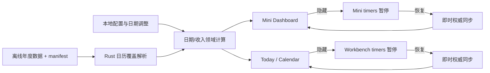
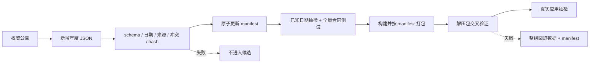
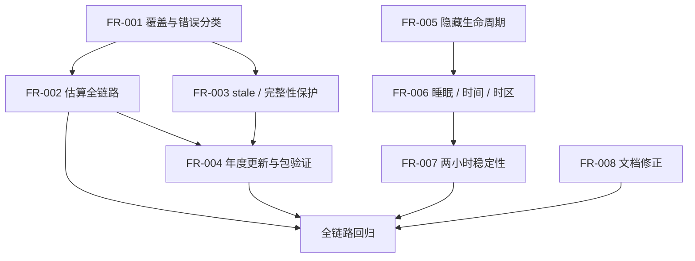

# LetsMakeMoney Windows v1.0.3 产品需求文档

> `/prd` · 完整推进型 PRD · 需求定义阶段

## 0. 文档信息

| 项目 | 内容 |
| --- | --- |
| 目标版本 | Windows v1.0.3 Stable |
| 当前公开版本 | Windows v1.0.2 Stable |
| 文档状态 | 完整 PRD，项目所有者已确认；开发承接完成 |
| 产品形态 | 无宠物、本地优先的 Windows 收入进度工具 |
| 技术基线 | Rust + Tauri + TypeScript/React |
| 开发基线 | `main`，HEAD `27dc11421daa8289caf06d92c2f397d64c64c5df` |
| 上游需求 | `V103-IDEA-001`、`002`、`004`、`005`、`006`、`007`、`008` |
| 已完成证据 | `V103-IDEA-003` 性能技术 Spike，不重复进入开发范围 |
| 最后更新 | 2026-07-30 |

本 PRD 以 [Idea 需求池](idea-pool.md)、[性能技术 Spike](performance-spike.md)、[候选分流](candidate-routing.md)、[深度 Review](review.md)和 [发布后差距](post-release-gap.md)为依据。详细追踪见 [需求追踪矩阵](traceability.md)。

## 1. 版本判断

### 1.1 版本目标

v1.0.3 是“跨年可用性与长期运行可信度”版本，不增加新的收入公式或在线服务。版本必须做到：

1. 在尚无官方年度日历的年份继续提供可用、明确标记为“估算”的收入与日历结果。
2. 严格区分“年份不支持”和“官方数据损坏/加载失败”，不得用估算掩盖完整性错误。
3. 建立新增官方年度数据时可审计、可验证、可回滚的离线发布流程。
4. 隐藏窗口停止无意义的秒级 tick 与 30 秒权威同步，恢复后立即收敛且不重复注册 timer。
5. 通过真实 Windows 睡眠、系统时间、时区和两小时运行证据，证明阶段、归属日期、金额与日历不会长期漂移。
6. 修正文档事实口径，不改写既有版本的真实验收历史。

### 1.2 用户价值

- 跨年后即使官方放假安排尚未公布，用户仍能使用核心收入与日历功能。
- 用户可以清楚分辨官方结果、休息模式估算、过期数据和加载失败，不会把推算当成政策信息。
- 托盘隐藏窗口不再持续执行一套不可见的同步循环。
- 睡眠、修改系统时间和切换时区后，金额与工作阶段能在明确时限内恢复正确。
- 后续官方年度数据可以通过固定流程进入仓库和发布包，降低漏文件、错哈希和错误来源进入 Stable 的风险。

### 1.3 成功标准

| 指标 | 通过标准 |
| --- | --- |
| 不支持年份 | Dashboard、日历、今日安排和日期调整均可用，统一标记“估算”，不出现官方来源措辞 |
| 数据完整性 | hash/schema/来源错误不得被当作普通 unsupported；有同年有效数据时保留为 stale，无有效数据时显示加载失败 |
| 手动调整 | 估算年份可应用、取消、持久化和回滚，且优先级高于休息模式推算 |
| 年度更新 | manifest 驱动地验证全部年份、来源、日期、冲突和 SHA256；失败不形成候选包 |
| 隐藏生命周期 | 隐藏 65 秒内该窗口没有 `interval_30s` 请求；恢复只触发一次即时同步 |
| timer 唯一性 | 连续隐藏/恢复 10 次后，本地 tick 与权威同步各只有一套 |
| 时间恢复 | 本地状态 5 秒内更新；需要 Rust 权威重算的结果最迟 30 秒内收敛 |
| 时区证据 | 真实 Windows 修改时区后，阶段、owner date、金额与日历通过；无真实证据不得发布 |
| 两小时稳定性 | 无 timer 复制、卡死、持续错误、异常日志膨胀或不可解释的资源持续增长 |
| 回归 | v1.0.2 收入、日历、日期调整、跨夜、主题、窗口、托盘与配置事务不回退 |

## 2. 范围与优先级

| FR | 标题 | 上游 | 优先级 | 发布门禁 |
| --- | --- | --- | --- | --- |
| FR-001 | 年度日历覆盖状态与错误分类 | V103-IDEA-001 | P0 | 是 |
| FR-002 | 不支持年份的估算与全链路一致性 | V103-IDEA-001 | P0 | 是 |
| FR-003 | stale、完整性失败与旧数据保护 | V103-IDEA-001 | P0 | 是 |
| FR-004 | 官方年度日历更新、验证与回滚 | V103-IDEA-002 | P1 | 是 |
| FR-005 | 隐藏窗口生命周期暂停与恢复 | V103-IDEA-004 | P1 | 是 |
| FR-006 | 睡眠、系统时间与时区恢复合同 | V103-IDEA-005、V103-IDEA-006 | P0 | 是 |
| FR-007 | 两小时稳定运行门禁 | V103-IDEA-007 | P0 | 是 |
| FR-008 | 当前事实文档收口 | V103-IDEA-008 | P2 | 是 |

### 2.1 明确非目标

- 不恢复宠物或 PetManager。
- 不加入账号、云同步、在线日历服务、安装器或静默更新。
- 不提供运行时下载、在线导入或用户手工导入官方日历。
- 不修改月薪、整数分分配、秒级收益和日期调整事务口径。
- 不实施共享 React store、跨 WebView 快照广播或永久同步所有者。
- 不进行技术栈、全局状态管理或全部窗口的整体重写。
- 不补写、推测或伪造尚未发布的 2027 官方节假日与调休数据。
- 不把短时 CPU/内存样本描述为性能优化完成或内存泄漏修复。

## 3. 产品、数据与状态合同

### 3.1 窗口和数据关系



### 3.2 日历覆盖状态

Rust 向上层返回统一覆盖元信息。字段名可在开发计划中按现有序列化风格调整，但语义不得改变。

```text
CalendarCoverage
- year: integer
- mode: official | estimated | stale | integrity_error
- dataset_version: string | null
- source: CalendarSource | null
- estimate_basis: double | single | alternating | null
- stale_reason: string | null
- error_code: string | null
- official: boolean
- can_adjust_date: boolean
```

状态定义：

| mode | 进入条件 | 可显示数据 | 日期调整 | 用户标签 |
| --- | --- | --- | --- | --- |
| `official` | 目标年份存在，manifest、schema、来源与 hash 全部通过 | 目标年份官方数据 | 是 | 官方 |
| `estimated` | 目标年份未列入 manifest 的支持年份 | 按用户休息模式推算，再叠加手动调整 | 是 | 估算 |
| `stale` | 本进程已持有目标年份/月份的有效数据，后续读取或同步失败 | 只保留同一目标范围的最后有效数据 | 默认只读；恢复成功后可编辑 | 数据过期 |
| `integrity_error` | manifest、hash、schema、来源或内容完整性失败，且无同范围有效数据 | 无 | 否 | 加载失败 |

补充规则：

1. “年份未支持”与“数据损坏”必须是互斥错误类型。
2. stale 不得拿其他月份或其他年份的数据冒充当前目标月份。
3. 进程重启后没有持久化 stale 缓存时，完整性失败进入 `integrity_error`；本版不新增在线缓存数据库。
4. 年度数据在运行时仍为离线只读资源；用户配置文件只保存现有休息模式和日期调整。
5. 不新增数据库，所有配置仍使用现有本地 JSON 安全写入。

### 3.3 日期判定优先级

```text
同一日期的最终结果 =
  手动日期调整
  > 已验证官方节假日/调休
  > 用户休息模式估算
```

- 手动调整包含：手动工作日、带薪休息、不带薪休息和恢复自动。
- 大小周必须继续使用用户已指定的锚点日期与当前周类型，应用不得替用户决定大周或小周。
- `estimated` 只表达长期工作/休息节奏，不生成“法定节假日”“官方调休”或政府来源。
- 跨年夜班按 `schedule_owner_date` 的年份选择覆盖数据；自然日期只负责界面中的“今天”标记。

### 3.4 视图加载状态

覆盖来源和视图加载状态分开建模：

```text
CalendarViewState
- status: loading | ready | empty | stale | error
- coverage: CalendarCoverage | null
- requested_month: YYYY-MM
- displayed_month: YYYY-MM | null
- retryable: boolean
```

- `estimated` 是数据来源，不是失败状态；估算日历必须是可交互的 `ready`。
- `stale` 同时表现为覆盖/加载警告，保留目标范围最后有效数据。
- `error` 不清空配置，不覆盖最后有效官方数据，不自动改成估算。

### 3.5 用户文案

| 状态 | 主文案 | 辅助文案 |
| --- | --- | --- |
| official | 官方日历 | 数据随应用离线提供 |
| estimated | 估算日历 | 当前年份尚无内置官方数据，按你的休息模式推算；不代表法定放假安排 |
| stale | 数据过期 | 本次读取失败，暂时保留上次成功结果 |
| integrity_error/error | 日历加载失败 | 未使用可能损坏的数据；可重试或查看诊断 |

Dashboard 的日期来源提示、Calendar 状态条、日期调整弹窗的“自动来源”必须使用同一覆盖元信息，不得分别猜测。

## 4. FR-001 年度日历覆盖状态与错误分类

### 4.1 用户目标

用户能够知道收入与日历依据官方数据还是估算，同时数据损坏不会被“看起来可用”的估算静默掩盖。

### 4.2 入口与出口

- 入口：应用启动、30 秒权威同步、打开/切换日历月份、日期调整、窗口恢复、配置保存后重算。
- 成功出口：返回 `official` 或 `estimated` 覆盖及可计算日历。
- 保护出口：已有同范围有效数据时返回 `stale`；否则返回明确 `integrity_error`。

### 4.3 正常与异常流程

1. 读取 manifest 并判断目标年份是否被声明支持。
2. 未支持：不读取不存在的年度文件，返回 `estimated`。
3. 已支持：校验 manifest 条目、年度文件、来源、schema、日期与 SHA256。
4. 全部通过：返回 `official`。
5. 完整性失败：不得退回 `estimated`；有同范围最后有效数据时保留为 stale，否则失败。
6. 用户重试只重新读取/计算，不修改配置和日期调整。

### 4.4 数据、配置和日志

- 配置字段不变；使用现有 `rest_mode`、`alternating_anchor_date`、`alternating_anchor_week_type` 与 `date_overrides`。
- `calendarDatasetCache` 不得永久缓存 rejected promise；失败后允许重试。
- 新增或规范事件：
  - `calendar.coverage.resolved year=... mode=... version=...`
  - `calendar.coverage.estimated year=... basis=...`
  - `calendar.dataset.stale year=... reason=...`
  - `calendar.dataset.integrity_failed year=... reason=...`
  - `calendar.dataset.retry_requested year=...`
- 日志不得包含月薪、完整配置、用户备注或个人路径。

### 4.5 影响范围

| 层 | 影响 |
| --- | --- |
| Rust | `calendar_data.rs` 的统一返回/错误分类；`config.rs` 不再独立维护另一套 unsupported 语义 |
| Tauri | `load_calendar_year` command 返回覆盖元信息 |
| React/TS | `model.ts`、`calendarState.ts`、DashboardSnapshot 与 Calendar 状态消费统一覆盖 |
| CSS | official/estimated/stale/error 的浅色与深色状态样式 |
| 配置 | 无新增字段、无迁移 |
| 日志/诊断 | 增加覆盖模式和错误分类，不含隐私 |
| 文档/包 | 用户说明、发布说明和包验证描述更新 |
| 数据库 | 无数据库影响 |

### 4.6 验收

- 自动测试：表驱动覆盖 supported、unsupported、hash/schema/source 失败、重试、不同月份/年份 stale 隔离。
- Computer Use：打开官方年份与不支持年份，检查 Today、Calendar、日期调整文案一致。
- 人工：确认“估算”不会被理解为官方政策。
- 发布门禁：任何完整性失败被标成估算、任何页面来源口径不一致，均不通过。

## 5. FR-002 不支持年份的估算与全链路一致性

### 5.1 用户目标

在 2027 等尚无官方数据的年份，用户仍可按自己的单双休/大小周配置查看收入、日历、今日安排并调整单日。

### 5.2 估算流程

1. 目标年份 unsupported。
2. 读取用户休息模式：
   - 双休：周一至周五为工作日。
   - 单休：周一至周六为工作日。
   - 大小周：周一至周五工作；周六是否工作由已保存锚点和周类型逐周推算。
3. 叠加该年份已保存的手动日期调整。
4. 使用既有收入、工作时长、跨夜 owner date 与整数分算法计算。
5. Dashboard、Calendar、今日安排和调整弹窗统一显示“估算”来源。

### 5.3 状态和交互

| 场景 | 结果 |
| --- | --- |
| 大小周未指定当前周 | 保持现有可读错误，引导补齐；不得代选 |
| 估算年份无手动调整 | 按休息模式展示和计算 |
| 应用手动工作日 | 当前日期变为工作日，全链路重算并持久化 |
| 应用带薪休息 | 不计算实时工时，保留该 salary slot 应计金额 |
| 应用不带薪休息 | 不计算工时，并按现有事务口径扣除该 slot |
| 恢复自动 | 删除该日期 override，恢复休息模式估算 |
| 取消/关闭 | 丢弃草稿，不重算、不写盘 |
| 保存失败 | 保留草稿和旧配置，显示可读失败，可重试 |
| 重启 | 使用持久化 override 与休息模式恢复同一结果 |

### 5.4 一致性规则

- `calculate_month_salary`、`resolve_calendar_month`、`calculate_today_income`、`resolve_next_workday`、`build_date_override_draft` 必须消费同一估算日历。
- Today 的 owner date 跨到前一年时，按 owner year 选数据覆盖；不能按自然年份错误切换。
- 估算年份可用不意味着官方日期更新能力已存在。
- 日历图例中的“官方调休”在估算月份不得出现伪造标记。

### 5.5 影响与验收

- 影响：React/Rust 日历装配、日期调整、来源文案、日志、行为测试；配置 schema 和收入公式不变。
- 自动测试：2027 单休、双休、大小周、跨年夜班、四种 override 操作及重启夹具。
- Computer Use：在受控系统日期/夹具下完成“估算月份 → 调整日期 → Today/收入/月度重算 → 重启”闭环。
- 人工：检查浅色/深色、长来源文案和可访问性。
- 发布门禁：Dashboard 或 Calendar 因 unsupported 整体不可用、或任何估算日期显示官方来源，均不通过。
- 数据库：无数据库影响。

## 6. FR-003 stale、完整性失败与旧数据保护

### 6.1 用户目标

日历读取异常时，用户的有效配置、最后可信结果和既有官方数据不会被错误结果覆盖。

### 6.2 保护规则

- 同一进程已成功得到目标月份后发生临时失败：显示 stale，并保留该目标月份最后可信结果。
- 尚无目标月份可信结果：显示加载失败和重试，不展示其他月份。
- manifest/hash/schema/source 失败：记录完整性错误；不得回退估算。
- 更新/重试失败：不改 manifest、不改年度文件、不改配置、不删 override。
- stale 默认只读，避免用过期自动来源创建含义不明确的新 override；恢复成功后恢复编辑。
- 已持久化 override 仍保留在配置中，失败不得删除。

### 6.3 失败反馈

- 加载中：保持稳定骨架，不闪现错误。
- stale：明确“数据过期”和展示月份；提供重试。
- 首次失败：明确“日历加载失败”；提供重试和诊断入口。
- 重试成功：替换为目标月份权威/估算结果，并清除 stale/error 提示。
- 重试失败：提示保持，不制造重复 Toast 或高频日志。

### 6.4 影响与验收

- 影响：`calendarState.ts`、`useCalendarMonth`、Dashboard 错误映射、诊断摘要、浅/深主题状态。
- 自动测试：late result、late failure、目标月隔离、retry、stale 只读、cache rejection 清除。
- Computer Use：受控损坏年度文件/command failure；确认旧数据、配置和草稿保护。
- 发布门禁：跨月 stale 冒充、完整性失败转估算、失败污染配置或官方数据，均不通过。
- 安全：错误日志只记录类型、年份、版本和校验结果，不输出原始文件内容。
- 数据库：无数据库影响。

## 7. FR-004 官方年度日历更新、验证与回滚

### 7.1 最小交付边界

v1.0.3 只交付“仓库内离线数据更新流程”。不提供应用内下载、在线服务、用户导入或后台自动更新。2027 官方数据未发布时，仓库和发布包不得包含推测文件。

### 7.2 权威来源与文件合同

- 来源必须是中国政府网 `https://www.gov.cn/` 上的国务院办公厅年度放假安排通知。
- 每年一个 `calendar-data/cn-YYYY.json`。
- manifest 是唯一年份枚举；运行时、验证和打包均不得硬编码 `2025,2026`。
- 年度文件必须记录：
  - `schema_version`
  - `dataset_id=cn-YYYY`
  - `year`
  - `source.publisher/title/document_no/published_at/url`
  - `holiday_dates`
  - `adjusted_workdays`
- manifest 条目记录 `year/file/sha256`，SHA256 使用大写十六进制。

### 7.3 受控更新流程



### 7.4 验证规则

1. supported years 唯一、升序，并与 dataset entries 一一对应。
2. 文件名、dataset id 和 year 一致。
3. 每个日期是目标年份中的真实公历日期。
4. 年度文件内部无重复；holiday 与 adjusted workday 互斥。
5. 来源字段非空，URL 为 gov.cn HTTPS。
6. 实际文件 SHA256 与 manifest 一致。
7. 至少抽检公告中的春节、国庆等关键日期和调休工作日。
8. package、`BUILD-INFO.json` 和 manifest 的年份/文件/hash 一致。
9. LICENSES/第三方声明不因年度数据加入而回退。

### 7.5 BUILD-INFO 与回滚

构建身份改为 manifest 驱动：

```text
calendar_manifest_sha256
calendar_datasets[]
  - year
  - file
  - sha256
```

旧包仍按原 `BUILD-INFO` 读取，不追溯修改。新年度数据失败时整组回退年度 JSON、manifest 和对应测试，不允许只回退其中一个文件。上一 Stable Release 始终是用户回滚基线。

### 7.6 影响与验收

- 影响：`calendar_data.rs` 数据发现方式、manifest/schema、通用校验脚本、构建脚本、包验证、发布 checklist。
- 自动测试：临时 fixture 覆盖缺文件、未知年份、重复/冲突日期、无效日期、错误域名、hash 错误和完整成功样例。
- Computer Use：只在真实官方年度数据加入候选时抽查可见日期；v1.0.3 未包含新年份时验证估算状态。
- 人工：双人或项目所有者对照权威公告确认来源和关键日期。
- 发布门禁：任何硬编码年份、伪造 2027、manifest/package 不一致均不通过。
- 数据库：无数据库影响。

## 8. FR-005 隐藏窗口生命周期暂停与恢复

### 8.1 用户目标

窗口隐藏到托盘后不继续执行不可见的本地 tick 和权威同步；重新显示后立即恢复正确结果。

### 8.2 统一事件

- 所有原生隐藏路径必须向目标 WebView 发送 `lmm:window-hidden`：
  - Mini 托盘左键/菜单隐藏。
  - UI `hide_app_window`。
  - CloseRequested 转隐藏。
  - Workbench 或其他 Dashboard 窗口的隐藏入口。
- 所有恢复路径发送 `lmm:window-shown`：
  - 托盘左键恢复。
  - 托盘菜单打开。
  - `show_app_window`。
  - 已存在窗口的找回/聚焦。
- 事件必须在目标 WebView 可消费的时点发出，并记录窗口 label。

### 8.3 前端生命周期

```text
visible
  -> hidden event
  -> stop local 1s timer
  -> stop authority 30s timer
  -> retain snapshot and UI state
  -> shown event
  -> reset wall/monotonic/timezone sample
  -> exactly one immediate authority sync
  -> start exactly one local timer and one authority timer
```

规则：

- 隐藏不是错误，不清空快照、不显示失败。
- 隐藏期间配置可被其他窗口修改；恢复后的即时同步必须读取最新配置。
- 重复 hidden 或 shown 事件幂等。
- 组件卸载、重挂载和 StrictMode 不得留下 timer。
- 仅暂停当前隐藏窗口；可见窗口继续正常同步。

### 8.4 日志

- `earnings.lifecycle.paused label=...`
- `earnings.lifecycle.resumed label=... reason=...`
- 恢复同步复用 `earnings.authoritative_sync.requested reason=window_shown`
- hidden 期间不记录每秒事件。

### 8.5 验收

| 场景 | 通过标准 |
| --- | --- |
| 隐藏 65 秒 | 该窗口 0 次 `interval_30s` 请求 |
| 恢复 | 5 秒内出现且仅出现 1 次 `reason=window_shown` 请求 |
| 10 次隐藏/恢复 | 每次恢复 1 次即时同步；无重复 interval |
| 一显一隐 10 分钟 | 总请求不高于 23，日志不高于 46 行，接近 Spike 的 21/42 单流基线 |
| 隐藏期间改配置 | 恢复后 30 秒内结果与新配置一致 |
| 关闭隐藏/托盘找回 | Mini 和 Workbench 均符合相同合同 |

- 自动测试：fake timers、重复事件、卸载清理、配置事件与 shown 竞态。
- Computer Use：真实托盘、关闭转隐藏、恢复、日志计数。
- 人工：Windows 通知区真实鼠标入口；Computer Use 无法覆盖时必须补证。
- 发布门禁：隐藏仍同步、恢复不收敛或 timer 重复均不通过。
- 数据库：无数据库影响。

## 9. FR-006 睡眠、系统时间与时区恢复合同

### 9.1 收敛时限

- 本地可计算状态：从窗口重新获得执行机会起 5 秒内更新。
- Rust 权威快照：最迟 30 秒内成功或进入明确 stale/error。
- 边界跨越后不得继续累计上一阶段收入。
- 任何倒计时不得为负数。

### 9.2 睡眠与恢复矩阵

| 场景 | 操作 | 必查结果 |
| --- | --- | --- |
| 工作中跨休息开始 | 睡眠前工作中，恢复时已进入休息 | phase=rest，收入停止，倒计时指向恢复工作 |
| 休息中跨恢复工作 | 睡眠前休息，恢复时已工作 | phase=working，秒级收入恢复 |
| 工作中跨下班 | 恢复时已下班 | 金额封顶，phase=after_work |
| 跨午夜普通班 | 恢复到下一自然日 | today 标记、owner date 和日历一致 |
| 跨夜班次 | 睡眠跨 owner date/边界 | owner date 仍按班次合同归属 |
| 估算年份 | 睡眠跨边界 | 仍为估算，不能变成官方 |

恢复时必须重置 wall-clock 与 monotonic 样本，并触发权威同步；不得用睡眠时长直接累加工作收入。

### 9.3 系统时间跳变

- 向前调整：阶段、owner date、金额和倒计时按新时间重算，不能穿越边界后继续旧 tick。
- 向后调整：金额可按权威结果回退，但不能成为负数或跨 salary slot。
- 恢复原时间：再次收敛，不残留两个 timer。
- 测试结束恢复系统时间、时区和配置，保留前后截图与日志。

### 9.4 时区变化

现有 `Date.now()` 与 `performance.now()` 差异不能可靠识别“仅时区变化”。v1.0.3 的最低合同是：

1. 记录最近一次 `Intl.DateTimeFormat().resolvedOptions().timeZone` 与 `getTimezoneOffset()` 样本。
2. 在 1 秒本地检查、focus、shown 和 30 秒权威同步前比较样本。
3. 变化时记录 `schedule.timezone_changed`，重置时钟样本并立即权威同步。
4. 使用新时区重新计算自然日、owner date、月份、日历和阶段。
5. 不持久化系统时区，不修改 Windows 设置。

### 9.5 验收证据

- 自动测试：wall-clock 前/后跳、timezone id/offset 变化、跨日与跨夜 fixture。
- Computer Use：真实睡眠/恢复和系统时间修改。
- 人工：真实 Windows 时区修改为另一时区再恢复；没有真实证据不得写通过。
- 日志：`schedule.wall_clock_changed`、`schedule.timezone_changed`、恢复同步请求/完成或失败。
- 发布门禁：睡眠恢复、系统时间跳变或时区变化任一未验证/未恢复环境，均不可发布。
- 安全隐私：只记录时区标识和 offset，不记录地理位置。
- 数据库：无数据库影响。

## 10. FR-007 两小时稳定运行门禁

### 10.1 环境

- 使用最终候选包的新解压目录。
- 普通日班与跨夜/估算场景至少覆盖其中一个边界切换。
- Mini 可见、Workbench 隐藏为主场景；中途执行 10 次隐藏/恢复，并打开 Workbench 一次。
- 记录 PID、开始/结束时间、配置摘要、系统时区、DPI、请求日志和资源样本。

### 10.2 采样

- 15 分钟后作为 WebView 暖机基线。
- 每 15 分钟记录一次 CPU、Working Set、Private Bytes、日志大小和窗口可见性。
- 统计 `earnings.authoritative_sync.requested` 的 reason 与窗口生命周期事件。
- 记录 timer 重复、边界同步、错误重试和配置变更。

### 10.3 通过标准

1. 运行不少于 120 分钟，不崩溃、卡死、白屏或丢失托盘找回。
2. 每个可见 Dashboard 窗口仅一套 1 秒 tick 和 30 秒权威同步。
3. 隐藏窗口没有 interval 请求；恢复只有一次即时请求。
4. 正常 120 分钟单可见流的 interval 请求不超过 245 次；睡眠/人工操作产生的明确 reason 另计。
5. 日志增长不超过 2 MiB，且不存在每秒高频语义日志。
6. 暖机后 Private Bytes 最终值不高于暖机值 1.5 倍且增量不超过 128 MiB；若超过，必须调查并重测，不能直接判定“内存泄漏”。
7. 不出现连续 5 分钟高于单逻辑核心 10% 的空闲 CPU 占用；有用户操作或系统扫描时需单独标记。
8. 金额、阶段、owner date、倒计时和日历在边界后按 FR-006 时限收敛。

### 10.4 失败处理

- 失败必须保存时间点、资源样本、窗口状态、日志片段和复现步骤。
- 资源阈值失败先区分 WebView、React render、Rust command 和外部环境，不以猜测归因。
- 修复后必须重新完整运行两小时，不能用短测替代。

### 10.5 影响

- 主要影响验证脚本、诊断和 release checklist；产品代码只允许为 FR-005/006 增加必要观测。
- 不新增生产环境每秒日志。
- 无数据库影响。

## 11. FR-008 当前事实文档收口

### 11.1 修正范围

- `doc/releases/v1.0.2/post-release-observation.md` 标题明确该文件是“v1.0.2 范围形成前的 v1.0.1 发布后观察”，保留观察对象与原结论。
- `apps/windows-v1/README.md` 更新为当前 Stable 工程说明，区分 v1.0.2 已发布与 v1.0.3 开发状态。
- `doc/current.md` 记录 v1.0.3 PRD 已完成、待所有者确认。
- v1.0.3 后续 progress、verification、release notes 各自只承担计划、验收和发布事实，不互相覆盖。

### 11.2 通过标准

- 不改写 v1.0.1/v1.0.2 哈希、验收结论、tag 或 Release。
- 文档状态检查、UTF-8、乱码、本地链接和 `git diff --check` 通过。
- README 不把 v1.0.3 写成已发布或已实现。
- 无数据库影响。

## 12. 兼容、迁移与回滚

### 12.1 配置

- 不提升配置版本，不新增用户配置字段。
- 现有 v5-v8 迁移、主题字段、日期调整和窗口位置保持不变。
- unsupported 估算直接消费现有休息模式和 override。
- 保存失败继续使用现有临时文件、flush、替换与旧配置保护事务。

### 12.2 运行时

- v1.0.2 的 2025—2026 官方结果必须逐 fixture 一致。
- 生命周期事件只控制计时器，不改变收入领域模型。
- 关闭隐藏、托盘找回和窗口位置恢复不得回退。

### 12.3 回滚

- 代码回滚：回退 FR-005/006 的生命周期提交时，不能带走日历安全降级与数据校验。
- 数据回滚：年度 JSON、manifest 和测试夹具整组回退。
- 用户回滚：v1.0.2 Stable Release 保持可下载；v1.0.3 未改变配置格式，因此可直接回退。

## 13. 自动化与验收总矩阵

| 范围 | 单元/行为测试 | 脚本/包验证 | Computer Use | 人工 |
| --- | --- | --- | --- | --- |
| official/estimated | Rust parser、TS reducer、跨层 fixture | manifest 全量枚举 | 官方/估算切换 | 来源语义 |
| override | Rust 事务、TS editor | 配置恢复 | 应用/取消/失败/重启 | 长文案 |
| stale/error | cache、late result、retry | 损坏 fixture | 受控失败与恢复 | 诊断可读性 |
| annual update | schema/source/date/hash | BUILD-INFO/package | 新年份存在时抽检 | 对照公告 |
| lifecycle | fake timer、幂等事件 | 日志计数脚本 | 托盘/关闭隐藏/恢复 | 通知区左键 |
| sleep/time | clock/timezone fixture | 环境恢复清单 | 睡眠与改时钟 | 时区切换 |
| 2h stability | timer 注册断言 | 请求/日志/资源汇总 | 窗口与托盘操作 | 长期观察 |
| docs | 文档状态 | UTF-8/链接/diff | 不适用 | 事实复核 |

## 14. 原型要求

沿用 `doc/prototypes/v1.0/`，只增加 v1.0.3 可见状态：

- 官方日历：明确“官方日历”。
- 估算日历：可浏览、可调整，明确“不代表法定放假安排”。
- 数据过期：保留最后有效数据并提供重试。
- 加载失败：不展示可疑数据，提供重试。
- Today 与 Calendar 来源标签同步。
- 浅色和深色均可切换；不重新设计 v1.0.2 界面。

原型控制条只用于验收，不进入产品。原型不得暗示已实现。

## 15. 开发前实施顺序



- FR-001 必须先于 FR-002/003。
- FR-005 必须先于 FR-006/007。
- 年度数据流程与生命周期实现可并行。
- 两小时稳定性必须在最终候选身份锁定后执行。

## 16. 发布门禁

以下任一未通过，v1.0.3 不得进入发布收口：

1. unsupported 使 Dashboard 或 Calendar 不可用。
2. 估算被标记为官方，或完整性错误被降级成估算。
3. override 在估算年份不能保存/取消/恢复/持久化。
4. 2025—2026 官方结果或 v1.0.2 收入公式回归。
5. 年度 manifest、文件、BUILD-INFO 或包哈希不一致。
6. 隐藏窗口继续 interval 同步，或恢复产生重复 timer。
7. 睡眠恢复、系统时间跳变没有真实 Windows 通过证据。
8. 时区变化没有真实 Windows 通过证据。
9. 两小时稳定运行未完成或失败。
10. 用户环境没有恢复，或文档/UTF-8/链接/diff 检查失败。

## 17. 开发承接状态

项目所有者已确认本 PRD。`dev_plan_v1.0.3.md`、`progress_v1.0.3.md` 与 `doc/logs/dev_log_v1.0.3.md` 已生成，FR-001 至 FR-008 已映射到 `V103-M0-001` 至 `V103-M6-012`。

当前仅完成开发承接，业务实施完成度仍为 `0/62`。开始 `V103-M0` 前仍需项目所有者给出单独实施授权；不得把 PRD、Spike、原型或开发计划的完成写成产品已实现。
