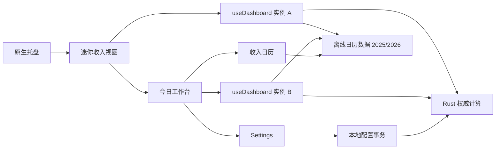

# LetsMakeMoney Windows v1.0.3 发布后深度 Review

入口判断：`/review`

## Review 判断

- 主通路：Project Review。
- 辅助通路：Implementation Review、Release Readiness Review、文档事实一致性 Review。
- Review 对象：v1.0.2 Stable 的发布身份、日历年度边界、权威同步、多窗口资源占用、睡眠与时间变化恢复、稳定性证据和文档治理。
- 未覆盖范围：未执行真实 Windows 睡眠/恢复、系统时区切换和连续两小时稳定运行；未修改实现、发布包、tag 或 Release。
- 总体结论：v1.0.2 当前发布身份和既有门禁一致，未发现需要撤回现有 Release 的即时阻塞；但已确认一个面向 2027 年的日历降级实现偏差，以及一个双窗口持续运行时的资源与重复同步问题。
- 下一阶段判断：具备进入 v1.0.3 `/idea` 的条件。日历降级应作为 P0 候选，双窗口资源问题应先进入技术 Spike。

## v1.0.2 真实基线

| 项目 | 事实 |
| --- | --- |
| 分支 | `main` |
| HEAD | `27dc11421daa8289caf06d92c2f397d64c64c5df` |
| 远端 | `origin/main` 与本地 HEAD 一致 |
| 当前工作区 | Review 开始时干净 |
| 当前版本 | v1.0.2 Stable |
| v1.0.2 tag | `fe074439521bda77c57e2e96f8065dad329a8686` |
| 发布 Zip SHA-256 | `EEBA1788A8C1D6AEB071728B78C71C3634062B3F5BD6E61BDB46DD171C97FEA2` |
| 发布 EXE SHA-256 | `4057E2F9F94B801A1A0A6C3D6F7B7AFE14DED2049478BF37AE6BBF17E33AD3BA` |
| 远端 CI | Windows v1 verification 在当前 HEAD 通过，run `30372617082` |

v1.0.2 tag 指向发布提交，当前 `main` 在其后仅包含 CI 对齐等后续提交。发布资产、Release digest 与本地发布 Zip 哈希一致。

## 产品与工程地图

当前 Mini 与 Workbench 分别挂载独立的 `useDashboard()`。每个实例都维护自己的 1 秒本地 tick、30 秒权威同步、请求序号和焦点/可见性监听。Settings 与 Wizard 不挂载该 hook。

## 意图、实现与验证对照

| 意图来源 | 实现执行点 | 当前验证 | 判断 |
| --- | --- | --- | --- |
| v1.0.1 PRD：不支持年份时按长期休息模式降级，并允许手动调整 | `model.ts` 的 Dashboard 和 Calendar 直接调用 `loadCalendarForYear` | 2027 被 Rust 明确拒绝；前端进入错误或 unsupported 状态 | 实现偏差 |
| v1.0.2 PRD：多窗口权威同步只测量，不预设共享所有权 | Mini 与 Workbench 各自挂载 `useDashboard()` | 两组 10 分钟测量已完成 | 证据缺口已关闭，产生新技术候选 |
| v1.0.1/v1.0.2：时间跳变后权威校正 | `wallClockJumped`、focus、visibility、30 秒同步 | 行为测试通过；未做真实系统时区切换 | 行为存在，真实系统证据缺失 |
| 发布后稳定性门禁 | 现有日志轮换、同步与窗口策略 | 已完成两组 10 分钟测量，未完成连续两小时 | 未验证，不是已确认缺陷 |

## 关键发现

| ID | 发现 | 证据状态 | 严重度 | 用户影响 | 最小建议 | 去向 |
| --- | --- | --- | --- | --- | --- | --- |
| V103-REV-001 | 2027 等不支持年份没有按 PRD 约定降级到长期休息模式。Dashboard 可能进入计算失败，Calendar 仅显示不支持提示且不提供可调整网格 | 已确认 | Major | 到 2027 年后核心收入与日历路径可能不可用，直接影响用户信任 | 恢复安全降级合同；官方数据发布前不得猜测节假日 | 进入 `/idea`，v1.0.3 P0 |
| V103-REV-002 | Mini 与 Workbench 同时可见时存在两条独立权威同步流；10 分钟请求数由 23 增至 42，CPU 消耗显著上升 | 已确认 | Major | 长期开着工作台会增加桌面常驻开销，可能影响续航和风扇噪声 | 先 profile 区分重复同步与 1 秒渲染成本，再决定共享所有权或局部降频 | 技术 Spike |
| V103-REV-003 | 系统时区变化没有专用监听；若窗口焦点和可见性事件未发生，可能等待下一次 30 秒权威同步 | 高度可能 | Minor | 短时间内状态、归属日或倒计时可能仍使用旧时区语义 | 在真实 Windows 上定向验证；只有复现后再决定新增事件或缩短纠偏路径 | 继续验证 |
| V103-REV-004 | 睡眠/恢复后的 focus、visibility 和 wall-clock 路径已实现，但没有真实 Windows 睡眠证据 | 待确认 | Minor | 理论上会恢复，仍不能排除恢复时事件顺序或 WebView2 行为差异 | 完成一次短睡眠和一次跨业务边界睡眠复验 | 进入 `/acceptance` |
| V103-REV-005 | 连续两小时桌面稳定运行仍未完成；当前只有两组 10 分钟资源证据 | 待确认 | Minor | 无法证明长期内存、日志和同步不会缓慢恶化 | 使用发布包执行两小时稳定性观察，保留资源曲线和日志增量 | 进入 `/acceptance` |
| V103-REV-006 | `doc/releases/v1.0.2/post-release-observation.md` 标题仍为 v1.0.1，`apps/windows-v1/README.md` 仍使用 v1.0 口径 | 已确认 | Minor | 新贡献者难以判断当前事实源，容易误用旧命令和旧状态 | 最小修正文档标题、版本和验证入口，保留历史结论 | 直接修文档 |
| V103-REV-007 | `model.ts` 和 `App.tsx` 承担多类窗口与状态职责，但目前没有证据支持整体重构 | 主观判断 | Suggestion | 理解成本偏高，但直接拆分可能引入收入和窗口回归 | 仅在修复日历和同步时做有行为测试保护的局部拆分 | 暂不处理 |

## 日历年度边界判断

`calendar-data/manifest.json` 只声明 2025 和 2026。Rust `load_calendar_year` 对其他年份返回 `calendar_year_unsupported`，这本身符合“不猜测官方数据”的要求。

偏差发生在上层降级路径：

1. v1.0.1 PRD 要求不支持年份仍按长期休息模式计算。
2. `config.rs` 的部分兼容路径能回退到 `CalendarData::default()`。
3. Dashboard 和 Calendar 的前端加载路径没有使用该回退。
4. 因此同一仓库内存在两套不一致的年度边界语义。

v1.0.3 不应预先编造 2027 年官方节假日。合理交付是：

- 先恢复长期休息模式和手动调整能力。
- 明确“未加载官方节假日数据”的可见状态。
- 官方数据发布后，通过受校验的数据更新补充 2027 年。

## 权威同步与资源判断

两组测量均使用同一 v1.0.2 发布 EXE、同一机器和 600 秒窗口：

| 模式 | 权威请求 | 日志增量 | Main CPU | WebView CPU | Working Set 增量 | Private 增量 |
| --- | ---: | ---: | ---: | ---: | ---: | ---: |
| 仅 Mini | 23 | 42 行 | 0.1406 秒 | 0.5469 秒 | +13,332,480 B | +8,523,776 B |
| Mini + Workbench | 42 | 82 行 | 38.5156 秒 | 66.2812 秒 | +12,779,520 B | +6,877,184 B |

结论边界：

- 可以确认双窗口产生两条独立同步流。
- 可以确认 Workbench 可见时持续 CPU 成本显著上升。
- 不能仅凭该数据认定“重复同步”是全部 CPU 成本；1 秒全量渲染、日历计算或其他组件也可能参与。
- 两组 10 分钟内存增量接近，不能据此判定存在内存泄漏。

## 发布后事实一致性

- 当前 Release、tag、Zip 哈希和远端资产 digest 一致。
- 当前 HEAD 的 GitHub Windows v1 verification 通过。
- 本地 v1.0.2 目标合同检查通过。
- 本地完整聚合验证因环境没有 `cargo` 未能复跑；这是本地工具链限制，不是产品测试失败。当前 HEAD 的 Rust 和完整 CI 结果由远端成功运行提供证据。
- Review 结束时用户配置逐文件恢复，未残留 LetsMakeMoney 进程。

## v1.0.3 候选主线

1. **日历安全降级**：关闭 2027 年核心路径不可用的实现偏差。
2. **多窗口资源治理**：先 profile，再选择共享快照、单一同步所有权或渲染降频。
3. **真实环境补证**：睡眠/恢复、系统时间/时区和两小时稳定性。
4. **事实文档收口**：修正应用 README 和发布后观察文档的版本漂移。

## 不进入 v1.0.3 的内容

- 猜测或预置尚未发布的 2027 年官方节假日。
- 账号、云同步、安装器、静默更新或跨平台扩展。
- 主题扩展、整体 UI 重做或技术栈迁移。
- 仅因文件较大而执行 `App.tsx`、`model.ts` 或 CSS 的整体重构。

## 下一阶段建议

进入 `/idea`，只对四条候选主线做价值和范围收敛。P0 先关闭不支持年份的安全降级；双窗口问题先以可观测 profile 为门禁；三个真实环境项目继续保留“未验证”状态，不得提前写为通过。
