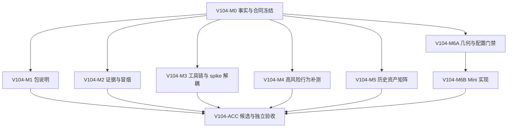

# LetsMakeMoney Windows v1.0.4 开发计划

## 追踪信息

- 当前状态：开发承接已完成，实施未开始
- 目标版本：Windows v1.0.4 Stable
- 上游来源：`doc/releases/v1.0.4/prd.md`
- 需求追踪：`doc/releases/v1.0.4/traceability.md`
- 下游承接：`doc/releases/v1.0.4/progress_v1.0.4.md`、独立 Acceptance
- 对应开发日志：`doc/logs/dev_log_v1.0.4.md`
- 原型：`doc/prototypes/v1.0/index.html`
- 开发基线：`main`，`09f838d05c67efb5219437ec2208920e441f3f52`
- 当前事实源：本文定义实施顺序；progress 定义实时完成状态
- 最后更新：2026-07-31

## 1. 开发范围

### 1.1 版本目标

v1.0.4 在不改变收入、日历、日期调整、主题和既有窗口主链路的前提下，完成：

1. 便携包离线说明与发布身份的可信合同。
2. 可长期复核、可脱敏、可判断失效的两层验收证据合同。
3. 高风险 React/Tauri 行为缺口及新解压桌面冒烟。
4. 可复现工具解析、环境诊断及正式脚本与 spike 目录解耦。
5. 历史资产所有权矩阵，不执行迁移或删除。
6. Mini 左右工作区边缘隐私贴边自动隐藏。

### 1.2 本次包含

| FR | 内容 | 实施性质 |
| --- | --- | --- |
| FR-001 | 便携包专用离线 README 与语义门禁 | 发布工程 |
| FR-002 | v1.0.3 Release README 快照差异披露 | 远端文档；独立授权 |
| FR-003 | 两层验收证据耐久合同 | 测试治理 |
| FR-004 | 高风险行为缺口补测与聚合门禁 | 测试治理 |
| FR-005 | 打包后桌面启动与窗口找回冒烟 | 发布工程 |
| FR-006 | 可复现开发环境与统一工具解析 | 开发工程 |
| FR-007 | Runtime/Service 架构继承门禁 | 只验证，不开发 |
| FR-008 | 正式脚本与 spike 目录解耦 | 开发工程 |
| FR-009 | 首轮局部切片继承门禁 | 只验证，不开发 |
| FR-010 | 历史资产所有权矩阵与归档门禁 | 只读治理 |
| FR-011 | Mini 隐私贴边自动隐藏 | 唯一新增产品能力 |

### 1.3 本次不包含

- 不恢复宠物或 PetManager。
- 不新增账号、云同步、安装器、静默更新或多平台。
- 不改变收入、日历、日期调整、跨夜、主题和配置事务口径。
- 不做第二轮模块切片、全局状态管理重写或全量 UI 自动化。
- 不扩展顶部/底部停靠、其他窗口自动隐藏、窗口磁吸或通用停靠系统。
- 不批量移动、删除或归档历史文件，不清理本地历史分支。
- 不修改 v1.0.3 tag、附件或哈希。

### 1.4 实施原则

1. 稳定性和用户数据安全优先于代码简洁。
2. M0 只冻结事实、测试缺口、配置兼容和几何合同，不改变用户可见行为。
3. FR-007、FR-009 只登记继承证据和失效条件，不生成重复实现。
4. FR-011 先通过纯函数几何测试和 v1.0.3 配置兼容夹具，再接入原生窗口。
5. 正常悬浮位置与物理收起位置必须分离；收起坐标不得覆盖用户保存位置。
6. 边缘收起不是原生窗口隐藏，不发送 `lmm:window-hidden`，Dashboard timer 保持现有生命周期。
7. 每个批次只修改该批次允许的模块，并运行受影响验证。
8. 远端 Release 正文修改、提交、推送、tag 和 Release 均不包含在普通实施授权中。

## 2. PRD 对照

| PRD 需求 | 开发批次 | 验收 | 覆盖 |
| --- | --- | --- | --- |
| FR-001 | V104-M1 | V104-ACC-001 | 完整 |
| FR-002 | V104-M1 | V104-ACC-002 | 准备文案；执行待独立授权 |
| FR-003 | V104-M2 | V104-ACC-003 | 完整 |
| FR-004 | V104-M0、V104-M4 | V104-ACC-004 | 仅补真实缺口 |
| FR-005 | V104-M2、V104-ACC | V104-ACC-005 | 完整 |
| FR-006 | V104-M0、V104-M3 | V104-ACC-006 | 完整 |
| FR-007 | V104-M0、V104-ACC | V104-ACC-007 | 继承门禁 |
| FR-008 | V104-M3 | V104-ACC-008 | 完整 |
| FR-009 | V104-M0、V104-ACC | V104-ACC-009 | 继承门禁 |
| FR-010 | V104-M5 | V104-ACC-010 | 矩阵与签核，不迁移 |
| FR-011 | V104-M0、V104-M6、V104-ACC | V104-ACC-011 | 完整 |

## 3. 文件与模块影响

| 模块 / 文件 | 计划改动 | 边界 |
| --- | --- | --- |
| `apps/windows-v1/release-docs/` | 新增便携包离线 README 来源 | 不复制仓库营销 README |
| `scripts/package_v104.ps1` | v1.0.4 唯一打包入口 | 只输出受控候选目录 |
| `scripts/verify_v104_package.ps1` | 包身份、README、许可、链接与哈希门禁 | 失败返回非零 |
| `scripts/verify_v104.ps1` | 聚合新旧门禁 | 不漏跑 v1.0.3 回归 |
| `scripts/v10_tools.ps1` | Node、Python、Cargo 统一解析 | 不再依赖 spike |
| `.github/workflows/windows-v1-verify.yml` | 显式工具环境与 v1.0.4 聚合入口 | 第三方 Action 保持锁定 commit |
| `apps/windows-v1/tests/` | 行为测试、工具解析、配置兼容和几何夹具 | 优先复用现有 esbuild + Node |
| `apps/windows-v1/src/features/mini/MiniWindow.tsx` | 展开/收起呈现、隐私露出条和交互锁 | 不承载原生几何计算 |
| `apps/windows-v1/src/hooks/useWindowDrag.ts` | 拖动释放后的边缘判断调用与拖离解除 | 既有全窗口拖动保持 |
| `apps/windows-v1/src/services/windowService.ts` | Mini 停靠专用 Service API | Tauri command 字符串集中维护 |
| `apps/windows-v1/src/App.tsx` | Settings 开关和跨窗口同步接线 | 不进行第二轮拆分 |
| `apps/windows-v1/src/styles.css` | Mini 隐私露出条和 180ms 过渡 | 不重做其余界面 |
| `apps/windows-v1/src-tauri/src/platform.rs` | work-area、DPI、显示器和左右边缘纯几何 | 禁止用整屏 bounds 代替工作区 |
| `apps/windows-v1/src-tauri/src/lib.rs` | 停靠命令、恢复、回落和托盘强制展开 | 普通安全夹取不得覆盖收起坐标 |
| `apps/windows-v1/src-tauri/src/config.rs` | 向后兼容开关与停靠状态，或独立窗口状态 | 由 M0 兼容门禁决定 |
| `doc/releases/v1.0.4/evidence/` | 脱敏摘要、schema、外部证据索引 | 不保存秘密或完整本机路径 |
| `doc/releases/v1.0.4/historical-assets.md` | 所有权、引用、许可、处理建议 | 不移动、不删除 |
| `README.md`、`CONTRIBUTING.md`、应用 README | 环境、构建和包说明 | 当前事实源一致 |
| 数据库 | 无改动 | 项目无数据库 |

## 4. 核心实现合同

### 4.1 Mini 状态

Mini 使用以下正交状态：

- 布局：`floating | docked_left | docked_right`
- 可见阶段：`expanded | retract_pending | retracted`
- 交互锁：`dragging | pointer_inside | focus_inside | menu_open | modal_open`
- 配置：`mini_edge_auto_hide: boolean`

只有 `docked_left/right + auto_hide=true + 无交互锁` 才允许进入收起态。

### 4.2 几何

- 停靠检测使用目标显示器的 Windows work area。
- 拖动释放后距离左/右工作区边缘不超过 16 logical px 时停靠。
- 收起后仅保留 10 logical px 隐私触发条，触发条不得显示工资、状态或日期。
- 向屏幕内拖离超过 24 logical px 时解除停靠并保存新的正常位置。
- 100%/125%/150% DPI 必须使用 logical/physical 明确转换，不允许 CSS 猜测原生坐标。
- 显示器失效时清除停靠，回落主屏安全区域并完整显示。

### 4.3 时间和交互

- hover、focus、隐私条点击和托盘找回立即展开。
- pointer 离开且无交互锁时，单一 600ms timer 触发收起。
- 展开/收起视觉过渡为 180ms；系统减少动态效果时允许降级为无动画。
- 拖动、pointer capture、键盘焦点、菜单和模态期间不得自动收起。
- 晚到 timer 必须核对 generation/token，不能覆盖新状态。

### 4.4 配置

优先方案：

```json
{
  "config_version": 8,
  "mini_edge_auto_hide": true,
  "mini_edge_dock": "none"
}
```

M0 必须先证明：

1. 新字段具有显式 serde 默认值。
2. v1.0.3 可以读取和安全保存含新字段的 v8 配置。
3. 非法枚举回退 `none`，不会导致启动失败。

任一条件不成立时，停用上述方案，改用版本化 `window-state.json` 保存停靠运行时状态；不得为此盲目提升配置版本。

## 5. 依赖与实施顺序



实施顺序：

1. 先完成 V104-M0，确定真实剩余测试缺口、工具链和 FR-011 存储方案。
2. V104-M1 至 M5 可在 M0 后按文件所有权并行，但每轮默认只授权一个里程碑。
3. V104-M6 必须串行完成纯几何、配置兼容、原生能力、前端状态机和真实桌面验证。
4. V104-ACC 只接收干净提交重新构建的唯一候选。

## 6. 里程碑与最小任务

### V104-M0 事实冻结、缺口与方案门禁

- [ ] `V104-M0-001` 记录分支、HEAD、工作树、v1.0.3 tag、Release、Zip、EXE 和 DLL 身份。
- [ ] `V104-M0-002` 将 FR-004 每条验收标准映射到现有测试 ID，列出真实未覆盖组合。
- [ ] `V104-M0-003` 冻结 FR-007 Runtime/Service 与 FR-009 首轮切片继承证据及失效条件。
- [ ] `V104-M0-004` 记录 Node、Python、Rust、MSVC、Windows SDK 和 WebView2 当前实际版本与来源。
- [ ] `V104-M0-005` 对 stable 与候选 Rust 固定版本运行 test/build 对照，给出 pin/no-pin 结论。
- [ ] `V104-M0-006` 建立 work-area、负坐标、多显示器和 100%/125%/150% DPI 纯几何夹具。
- [ ] `V104-M0-007` 建立 v1.0.3 读取、保存 v1.0.4 配置的兼容夹具。
- [ ] `V104-M0-008` 根据兼容结果签署“config v8 字段”或“window-state.json”存储决策。
- [ ] `V104-M0-009` 冻结正常位置、收起位置、托盘找回和显示器失效回落状态合同。
- [ ] `V104-M0-010` 建立 v1.0.4 聚合验证骨架、证据目录和失败非零合同。

完成标准：不修改用户可见行为；M0 结论、夹具和 go/no-go 证据可独立复核。

### V104-M1 包 README 与发布身份

- [ ] `V104-M1-001` 建立包专用中文离线 README 唯一模板。
- [ ] `V104-M1-002` 补齐版本、平台、启动方式、数据目录、许可、更新和在线文档入口。
- [ ] `V104-M1-003` 禁止包内 README 使用不可达仓库相对图片或内部文档链接。
- [ ] `V104-M1-004` 让 v1.0.4 打包脚本复制包专用 README，并记录其 SHA256。
- [ ] `V104-M1-005` 交叉校验文件名、README、应用版本和 `BUILD-INFO.json`。
- [ ] `V104-M1-006` 增加旧版本、空文件、失效链接、占位符和许可缺失负向测试。
- [ ] `V104-M1-007` 准备 v1.0.3 Release README 快照差异披露正文并只读复核远端身份。
- [ ] `V104-M1-008` 将远端披露标记为独立授权门禁；未授权不得执行或伪造完成。

完成标准：受控测试包通过语义验证；v1.0.3 tag、附件和哈希未发生变化。

### V104-M2 两层证据合同与桌面冒烟

- [ ] `V104-M2-001` 定义仓库内脱敏证据摘要 schema。
- [ ] `V104-M2-002` 定义外部原始证据索引、状态和失效原因枚举。
- [ ] `V104-M2-003` 实现候选身份、环境、结论和日志摘要的确定性生成。
- [ ] `V104-M2-004` 增加绝对路径、用户名、工资、token 和错误哈希负向测试。
- [ ] `V104-M2-005` 实现新解压 EXE 启动、窗口存在、正常退出和残留进程检查。
- [ ] `V104-M2-006` 覆盖 Mini、Workbench、Settings、Wizard 和通知区找回冒烟入口。
- [ ] `V104-M2-007` 建立配置、日志和进程备份恢复合同。
- [ ] `V104-M2-008` 从新鲜 clone 复核摘要、外部索引和桌面冒烟结果。

完成标准：摘要可永久复核且不泄露隐私；原始证据缺失时明确为 `missing`。

### V104-M3 工具解析与 spike 解耦

- [ ] `V104-M3-001` 为 Node、Python、Cargo 定义显式变量、PATH、正式缓存和失败顺序。
- [ ] `V104-M3-002` 建立统一环境诊断入口并输出工具版本与解析来源。
- [ ] `V104-M3-003` 将 v1.0.4 验证、打包和包验证全部切换到统一解析函数。
- [ ] `V104-M3-004` 清除正式脚本对 `spikes/v1.0-ui/` 的运行依赖。
- [ ] `V104-M3-005` 验证显式变量、PATH、正式缓存和无工具四种路径。
- [ ] `V104-M3-006` 在临时移除 spike 目录的条件下运行验证、构建和打包入口。
- [ ] `V104-M3-007` 更新 CI，显式安装 Python 并记录 Node/Rust 版本。
- [ ] `V104-M3-008` 更新 README、CONTRIBUTING 和干净环境命令。

完成标准：正式链路中的 spike 路径引用为 0，失败信息能指出缺少的工具和搜索来源。

### V104-M4 高风险行为补测

- [ ] `V104-M4-001` 补 hidden/shown 事件与 timer 暂停、恢复、重复事件和卸载清理组合测试。
- [ ] `V104-M4-002` 补配置保存成功、无变化、失败、保留草稿和旧配置保护测试。
- [ ] `V104-M4-003` 补 Dashboard 权威同步失败后最后可信快照保留测试。
- [ ] `V104-M4-004` 补 Tauri event/command 与 React 状态组合测试。
- [ ] `V104-M4-005` 将新增测试接入唯一聚合入口和 CI。
- [ ] `V104-M4-006` 证明 FR-007 Runtime/Service 继承测试仍通过。
- [ ] `V104-M4-007` 证明 FR-009 结构与 Presentation 继承测试仍通过。
- [ ] `V104-M4-008` 输出仍需 Computer Use 或人工验证的最小清单，不扩大为全面 UI 自动化。

完成标准：真实高风险组合有行为断言，不以源码 token 或文案存在代替行为。

### V104-M5 历史资产所有权矩阵

- [ ] `V104-M5-001` 盘点 v0.9 桌宠原型、Figma 插件、动画合同、iOS 原型和历史发布文档。
- [ ] `V104-M5-002` 记录每项当前引用、唯一内容、许可、Git 历史和责任仓库。
- [ ] `V104-M5-003` 对 Windows 与独立 iOS 仓库做路径级差异检查。
- [ ] `V104-M5-004` 将每项分类为保留、待接管、可归档候选或不得迁移。
- [ ] `V104-M5-005` 建立迁移前引用扫描、所有者签核和回滚门禁。
- [ ] `V104-M5-006` 复核本版未移动、删除或取消跟踪任何历史资产。

完成标准：形成只读矩阵；所有权不明内容保持原位。

### V104-M6 Mini 隐私贴边自动隐藏

- [ ] `V104-M6-001` 先实现并通过左右 work-area、负坐标、DPI 和显示器失效纯几何测试。
- [ ] `V104-M6-002` 先实现并通过 v1.0.3 配置兼容、非法枚举和缺省字段测试。
- [ ] `V104-M6-003` 根据 M0 决策落地配置字段或独立窗口状态文件。
- [ ] `V104-M6-004` 在 Rust/Tauri 增加停靠检测、收起、展开、拖离和主屏回落接口。
- [ ] `V104-M6-005` 分离正常保存位置与物理收起位置，阻止普通安全夹取覆盖收起坐标。
- [ ] `V104-M6-006` 在 Window Service 增加类型化 Mini 停靠 API 和错误回落。
- [ ] `V104-M6-007` 建立前端停靠状态机、单一 600ms timer 和晚到事件保护。
- [ ] `V104-M6-008` 接入 hover、focus、pointer capture、拖动、菜单和模态交互锁。
- [ ] `V104-M6-009` 接入 16px 停靠、10px 露出、24px 拖离和 180ms 视觉过渡。
- [ ] `V104-M6-010` 在 Settings 增加默认开启的“贴边自动隐藏”开关及保存、取消、失败和无变化事务。
- [ ] `V104-M6-011` 接入托盘强制展开、重启恢复和显示器缺失安全回落。
- [ ] `V104-M6-012` 增加 `mini.edge_dock.*` 脱敏日志并验证无工资或精确坐标。
- [ ] `V104-M6-013` 完成几何、状态机、timer、配置、异常和历史回归自动测试。
- [ ] `V104-M6-014` 使用真实 Windows 验证左右边缘、收起隐私、悬停、拖离、托盘、重启和 100%/125%/150% DPI。

完成标准：收起态不泄露工资内容，任何失败均回落到完整可见且可从托盘找回的 Mini；不影响 Dashboard timer。

### V104-ACC 候选构建、独立验收与状态收口

- [ ] `V104-ACC-001` 统一 npm、Cargo、Tauri 和可见版本为 1.0.4。
- [ ] `V104-ACC-002` 完成 `verify_v104.ps1`、`package_v104.ps1` 和 `verify_v104_package.ps1`。
- [ ] `V104-ACC-003` 从干净提交重新构建唯一候选，记录 source HEAD 与 `source_tree_dirty=false`。
- [ ] `V104-ACC-004` 锁定 Zip、EXE、DLL、README、BUILD-INFO 和 SHA256SUMS。
- [ ] `V104-ACC-005` 新解压候选完成首次启动、Mini、Workbench、Settings、Wizard 和通知区冒烟。
- [ ] `V104-ACC-006` 完成 FR-011 左右边缘、DPI、托盘、重启、多显示器和配置兼容验收。
- [ ] `V104-ACC-007` 运行 v1.0.3 全量产品回归及架构继承门禁。
- [ ] `V104-ACC-008` 验证证据摘要、外部原始证据索引和用户环境恢复。
- [ ] `V104-ACC-009` 运行文档状态、UTF-8、乱码、本地链接、敏感信息和 `git diff --check`。
- [ ] `V104-ACC-010` 更新 verification、manual verification、release checklist、release notes、progress 和 current。
- [ ] `V104-ACC-011` 给出“可进入发布收口 / 不可进入发布收口”结论，不执行外部写操作。
- [ ] `V104-ACC-012` 获得独立授权后才允许提交、推送、tag、Release 或修改 v1.0.3 Release 正文。

完成标准：所有适用门禁通过，未授权远端事项保持明确待办，不以计划或自动测试冒充真实桌面验收。

## 7. 测试与验收

### 7.1 自动化

- `powershell -NoProfile -ExecutionPolicy Bypass -File scripts\verify_architecture.ps1`
- `powershell -NoProfile -ExecutionPolicy Bypass -File scripts\verify_v103.ps1`
- v1.0.4 实施后新增：`scripts\verify_v104.ps1`
- `npm run build:web`
- `cargo test --manifest-path apps/windows-v1/src-tauri/Cargo.toml`
- `cargo clippy --manifest-path apps/windows-v1/src-tauri/Cargo.toml --all-targets -- -D warnings`
- v1.0.4 实施后新增：`scripts\verify_v104_package.ps1`

每个批次只运行受影响测试；V104-ACC 必须运行完整聚合门禁。

### 7.2 Computer Use

- 新解压候选启动、退出和残留进程。
- Wizard、Mini、Workbench、Settings、通知区和任务栏。
- Mini 左右停靠、悬停展开、600ms 收回、拖离、托盘找回和重启。
- 100%/125%/150% DPI 下隐私露出条、长金额和窗口边界。
- 配置、日志和进程环境恢复。

### 7.3 人工

- 包内中文/英文说明语义。
- 外部原始证据可取回性。
- 多显示器隐私观感和安全回落。
- 收起状态从旁观者角度无法读取工资、阶段或日期。
- v1.0.3 Release 披露正文，仅在独立授权后执行。

## 8. 开发日志约定

- 使用 `doc/logs/dev_log_v1.0.4.md`。
- 记录批次目标、实际改动、技术决策、异常、验证和待补证。
- progress 只保存任务状态、阻塞、最近验证和下一步。
- 明确缺陷进入独立 bugfix log；技术探索进入 spike 文档或 dev log 摘要。

## 9. 风险与回退

| 风险 | 触发条件 | 回退 / 处理 |
| --- | --- | --- |
| v1.0.3 无法读取新配置 | 兼容夹具失败 | 使用独立 `window-state.json`，不提升 config version |
| Mini 收起后无法找回 | 托盘、hover 或重启失败 | 关闭功能，清除 dock，恢复主屏完整可见 |
| 显示器/DPI 坐标错误 | 负坐标、缩放或工作区测试失败 | 停止原生接入，保留 floating 行为 |
| timer 重复或误停 | 请求频率或生命周期测试失败 | 回退前端停靠状态机，不发布 |
| 正常位置被收起坐标污染 | 重启后出屏或位置异常 | 分离持久化字段并恢复最近正常位置 |
| 包 README 与身份漂移 | 包验证失败 | 阻塞候选，重新从模板生成 |
| 工具解析清理破坏构建 | 干净环境或 fallback 失败 | 恢复旧解析顺序，保留 spike 原位 |
| 原始证据不可取回 | 外部索引失效 | 标记 `missing`，相关验收不得写通过 |
| FR-007/FR-009 范围膨胀 | 出现第二轮模块拆分 | 停止并退回 PRD 或下一版本 |

## 10. 开放问题与授权

- 当前无阻塞开发承接的产品决策。
- M0 必须用测试决定停靠状态写入 v8 配置还是独立窗口状态文件。
- 是否固定 Rust 工具链由 stable/fixed 对照结果决定，不预设答案。
- v1.0.3 Release 正文披露、提交、推送、tag 和新 Release 均需要对应的独立授权。
- iOS 资产责任仓库未完全确认前，相关文件必须保留原位。

## 11. 实施启动门禁

1. v1.0.4 PRD 已由项目所有者确认。
2. 本文件、progress 和 dev log 已生成且任务 ID 一致。
3. 当前工作树的文档和原型改动来源已记录，不覆盖或撤销。
4. 第一批只执行 V104-M0，不顺带修改用户可见行为。
5. 没有新授权时，不执行提交、推送、tag、Release 或远端正文修改。
