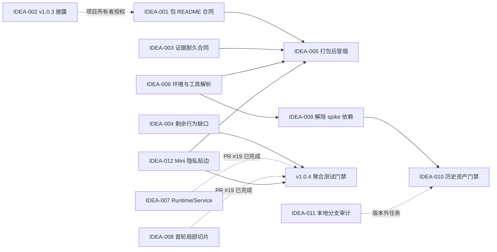

# LetsMakeMoney Windows v1.0.4 候选需求池

## 追踪信息

- 对外入口：`/idea`
- 自动识别主通路：版本候选需求收敛
- 辅助通路：发布工程、测试治理、工程治理、文档治理、清理候选审计
- 文档状态：Idea 与完整 PRD 已确认；开发承接已完成，实施未开始
- 目标版本：Windows v1.0.4 Stable
- 当前公开版本：Windows v1.0.3 Stable
- 当前开发基线：`main`，HEAD `09f838d05c67efb5219437ec2208920e441f3f52`
- 当前工作区：包含尚未提交的 v1.0.4 Review、Idea、PRD、追踪与 `doc/current.md` 文档变更；业务代码无本轮改动
- 架构基线提交：`09f838d05c67efb5219437ec2208920e441f3f52`，PR #19
- v1.0.3 发布提交：`87f6766a33fd6ff284f0fb3a42dc18c5a7292bf4`
- v1.0.3 便携 Zip：`LetsMakeMoney-v1.0.3-windows-x86_64.zip`
- v1.0.3 Zip SHA256：`259CAE23D785FC7712CAC0EFD42991C8EE210C0BCEA1EB5C07FC171DFB993B28`
- 上游证据：
  - `doc/releases/v1.0.4/review.md`
  - `doc/releases/v1.0.4/v1.0.3-post-release-gap.md`
  - `doc/releases/v1.0.4/slimming-candidates.md`
- 最后更新：2026-07-31

## 2026-07-31 架构基线校准

Idea 阶段形成时，`App.tsx`、运行时调用、前端服务边界和 Rust
Command/Service/Repository 分层仍是候选问题。随后 PR #19 已独立完成渐进式架构优化并通过真实 Windows 与自动门禁验收，因此以下状态优先于本文后续保留的历史压力测试记录：

| IDEA | 校准状态 | 现有证据 | v1.0.4 后续边界 |
| --- | --- | --- | --- |
| V104-IDEA-004 | 部分完成 | 已有 Runtime、配置领域、Desktop Service、生命周期、权威同步和呈现纯函数行为测试 | 只补尚未被直接行为测试覆盖的组合场景，并建立 v1.0.4 聚合入口 |
| V104-IDEA-006 | 部分完成 | 已有 `v10_tools.ps1`、Cargo 显式变量支持和 2/2 工具解析测试 | 继续补 Node/Python、正式缓存、环境诊断、干净环境与 CI 合同 |
| V104-IDEA-007 | 基线已完成 | `src/runtime/appRuntime.ts`、四个前端 Service、15/15 Runtime 行为测试 | 不重复开发；发布候选只复跑门禁 |
| V104-IDEA-008 | 基线已完成 | 已提取 `WindowFrame`、`MiniWindow`、拖动 Hook，并完成 Rust 收入/配置分层 | v1.0.4 不再增加模块拆分 |
| V104-IDEA-009 | 尚未完成 | `v10_tools.ps1` 与部分历史脚本仍引用 `spikes/v1.0-ui/` | 继续作为正式范围 |

架构验收明确未覆盖完整首次配置、通知区、真实 DPI、睡眠恢复和长期运行。它不是 v1.0.4 发布验收，也不得替代本版最终候选回归。

## Idea 阶段判断

### 版本主线

v1.0.4 应是一轮“发布可信度与可维护性”优化，并只承接一个边界清晰的隐私能力。它要解决的核心问题是：

1. 用户下载的便携包能否在离线环境中得到准确、可执行的说明。
2. Stable 验收结论能否在临时目录丢失后仍保留足够的审计依据。
3. React、Tauri 和 WebView2 的高风险组合行为是否由真实行为测试保护。
4. 外部贡献者能否在已声明、可重复的 Windows 工具链中完成验证和构建。
5. 核心模块能否在不改变行为的前提下逐步降低维护成本。
6. Mini 靠近屏幕边缘时，能否在不隐藏进程和不中断收入计算的前提下遮蔽工资信息，并在用户靠近时可靠恢复。

### 当前结论

- v1.0.3 主链路可用，远端 Release、tag 和附件身份一致，无撤回依据。
- v1.0.3 包内 README 仍带有 v1.0.2 口径和不可达的仓库相对链接，这是已确认的发布包文档缺陷。
- v1.0.3 原始验收临时目录已经缺失；现有重构证据可以说明部分事实，但不能冒充原始系统操作证据。
- 当前已增加 Runtime、配置领域、Desktop Service、生命周期、权威同步和呈现行为测试，但仍有少数组合场景缺少直接行为证据，部分 Python 门禁仍只检查源码 token。
- 环境说明没有完整覆盖 Python、MSVC、Windows SDK 和 WebView2；Cargo 显式解析已有基础，但 Node、Python、正式缓存及干净环境合同仍不完整。
- `App.tsx`、`model.ts` 和 Rust `lib.rs` 的首轮局部治理已经完成并验收；Workbench、Settings、Wizard 和 Windows 生命周期整体拆分不进入 v1.0.4。
- `spikes/v1.0-ui/` 仍被正式工具解析逻辑引用，不能因名称为 spike 就直接归档。
- 独立 iOS 仓库比 Windows 仓库中的 iOS 原型更新，但两边文件并非完全一致，暂不能判定已完成全部所有权交接。
- Mini 已支持全窗口拖动、托盘找回和位置持久化，但当前位置会被 Rust 强制夹回屏幕内，没有“正常位置 / 收起位置”分离、边缘停靠状态或隐私露出条合同。

### 推荐方向

采用“推荐方案”进入下一阶段：

- 先修发布包 README、证据合同和环境合同。
- 增加少量但真正覆盖高风险组合行为的测试。
- 建立打包后桌面冒烟。
- 复用已经合入的运行时适配和局部模块基线，不重复开发。
- 补齐工具链适配、环境诊断和正式脚本与 spike 目录解耦。
- 建立历史资产所有权与归档门禁，但本版不执行大规模迁移或删除。
- 将 Mini 隐私贴边自动隐藏作为 v1.0.4 唯一新增产品能力；只支持左右工作区边缘，不扩展到顶部、底部或通用窗口停靠系统。

## 上游证据摘要

| 证据 | 证据状态 | 结论 |
| --- | --- | --- |
| v1.0.3 GitHub Release | 已确认 | Stable Release 非草稿、非预发布；附件仅便携 Zip 与 `SHA256SUMS.txt` |
| v1.0.3 GitHub Zip digest | 已确认 | 远端 digest 与本地锁定 SHA256 一致 |
| `scripts/package_v103.ps1` | 已确认 | 直接把仓库根 README 复制进发布包，没有独立的离线包说明 |
| v1.0.3 包内 README | 已确认 | 残留 v1.0.2 版本、旧包路径和仓库相对图片/文档链接 |
| `scripts/verify_v103_package.ps1` | 已确认 | 只检查 README 存在且非空，没有验证版本、平台、启动方式和链接可达性 |
| `.tmp_acceptance/v1.0.3-final-*` 原始目录 | 已确认 | Review 引用的两个原始验收目录当前不存在 |
| v1.0.3 重构证据摘要 | 已确认 | 明确声明不能重建部分原始睡眠、时间、时区、托盘和 120 分钟样本 |
| `.gitignore` | 已确认 | `/.tmp_acceptance/` 被忽略，说明原始证据默认不会进入 Git |
| `apps/windows-v1/tests/` | 已确认 | 以纯 TypeScript 状态和呈现测试为主，已覆盖部分核心计算与生命周期选择器 |
| `verify_webview_suspend_v103.py` 等门禁 | 已确认 | 通过读取源码和 token 顺序证明结构存在，不执行真实 WebView2 生命周期 |
| Rust 单元测试 | 已确认 | 配置、日历、领域和支持模块已有覆盖；窗口与 command 组合边界覆盖不足 |
| 根 README 与 CI | 已确认 | 声明 Node 22+、Rust stable MSVC；Python、MSVC、SDK、WebView2 说明不完整 |
| `scripts/v10_tools.ps1` | 已确认 | 已有 Python/Node/Cargo 解析器，但其他正式脚本仍直接调用 `python` 或固定 toolchain 参数 |
| `isTauri()` | 已确认 | 在 `model.ts`、`configModel.ts`、`theme.ts` 重复定义 |
| 浏览器 fallback | 高度可能 | 承担开发预览和测试价值，但缺少与 Rust/Tauri 结果一致性的成组夹具 |
| `spikes/v1.0-ui/` | 已确认 | 仍作为 Cargo 工具链 fallback 被正式脚本引用，不满足直接归档前提 |
| 独立 iOS 仓库 | 已确认 | 仓库存在、工作树干净、原型和文档总体更新，但与 Windows 仓库副本并非逐字节一致 |
| 本地历史分支 | 已确认 | 远端分支已收敛；本地仍有多个包含独有提交的历史分支，不能仅凭名称删除 |
| Mini 拖动与窗口位置实现 | 已确认 | `MiniWindow.tsx` 使用全窗口拖动；`move_app_window` 每次移动后执行安全夹取；配置只保存一份 `mini_window_position`，尚无停靠和收起状态 |

### 证据边界

- 包内 README 错误是已确认的发布文档缺陷，不代表应用运行时不可用。
- 原始证据目录缺失，不等于历史验收结论必然错误；但会降低后续独立复核能力。
- 源码 token 检查可以证明结构存在，不能证明事件顺序、失败补偿和窗口生命周期行为。
- 文件体积、文件年龄和目录名不能单独作为删除依据。
- 独立 iOS 仓库较新，不等于 Windows 仓库中的每一份 iOS 历史材料已经完成迁移。

## 候选需求池

### 总览

| ID | 标题 | 类型 | 证据状态 | 分数 | 优先级 | 压力测试结论 | 推荐去向 |
| --- | --- | --- | --- | ---: | --- | --- | --- |
| V104-IDEA-001 | 便携包专用离线 README 与语义门禁 | 发布工程 / 缺陷 | 已确认 | 37/40 | P0 | 值得继续 | 进入 PRD |
| V104-IDEA-002 | v1.0.3 Release README 快照差异披露 | 文档 | 已确认 | 34/40 | P0 | 直接处理，待授权 | 直接修文档 |
| V104-IDEA-003 | 两层验收证据耐久合同 | 发布工程 / 测试治理 | 已确认 | 34/40 | P0 | 值得继续 | 进入 PRD |
| V104-IDEA-004 | React/Tauri/WebView2 高风险行为测试 | 测试治理 | 已确认 | 34/40 | P1 | 基线部分完成，补剩余缺口 | 进入 PRD |
| V104-IDEA-005 | 打包后桌面启动与窗口找回冒烟 | 测试治理 / 发布工程 | 高度可能 | 32/40 | P1 | 值得继续 | 进入 PRD |
| V104-IDEA-006 | 可复现开发环境与统一工具解析 | 发布工程 / 工程治理 | 已确认 | 33/40 | P1 | 基线部分完成，补剩余缺口 | 进入 PRD |
| V104-IDEA-007 | 运行时适配入口与 fallback 对照夹具 | 工程治理 / 技术 Spike | 已确认 | 27/40 | 已完成基线 | PR #19 已实现并验收 | 不重复开发 |
| V104-IDEA-008 | 核心模块测试保护下的局部拆分 | 工程治理 | 已确认 | 25/40 | 已完成基线 | PR #19 已完成首轮切片 | 暂不扩展 |
| V104-IDEA-009 | 解除正式脚本对 spike 目录的依赖 | 工程治理 / 清理前置 | 已确认 | 29/40 | P1 | 值得继续 | 进入 PRD |
| V104-IDEA-010 | 历史资产所有权矩阵与归档门禁 | 文档 / 清理 | 高度可能 | 24/40 | P2 | 继续验证 | 继续验证 |
| V104-IDEA-011 | 本地历史分支独有提交审计 | 清理 | 已确认 | 25/40 | P2 | 不进入版本开发 | 继续验证 |
| V104-IDEA-012 | Mini 隐私贴边自动隐藏 | 产品增强 / 隐私 | 已确认 | 35/40 | P1 | 值得继续，范围必须受控 | 进入 PRD |

### 八维压力测试

评分维度依次为：痛点、场景清晰度、证据、频率/紧迫度、核心贡献、替代与差异、成本可控、验证速度。

| ID | 痛点 | 场景 | 证据 | 频率 | 核心 | 替代 | 成本 | 验证 | 总分 |
| --- | ---: | ---: | ---: | ---: | ---: | ---: | ---: | ---: | ---: |
| V104-IDEA-001 | 4 | 5 | 5 | 4 | 5 | 4 | 5 | 5 | 37 |
| V104-IDEA-002 | 3 | 5 | 5 | 2 | 4 | 5 | 5 | 5 | 34 |
| V104-IDEA-003 | 4 | 5 | 5 | 3 | 5 | 4 | 4 | 4 | 34 |
| V104-IDEA-004 | 4 | 5 | 5 | 4 | 5 | 4 | 3 | 4 | 34 |
| V104-IDEA-005 | 4 | 5 | 4 | 3 | 5 | 4 | 3 | 4 | 32 |
| V104-IDEA-006 | 3 | 5 | 5 | 3 | 4 | 4 | 4 | 5 | 33 |
| V104-IDEA-007 | 3 | 4 | 3 | 3 | 3 | 4 | 3 | 4 | 27 |
| V104-IDEA-008 | 3 | 4 | 4 | 3 | 3 | 3 | 2 | 3 | 25 |
| V104-IDEA-009 | 3 | 4 | 5 | 3 | 3 | 4 | 3 | 4 | 29 |
| V104-IDEA-010 | 2 | 4 | 4 | 2 | 2 | 4 | 3 | 3 | 24 |
| V104-IDEA-011 | 1 | 4 | 5 | 1 | 1 | 5 | 4 | 4 | 25 |
| V104-IDEA-012 | 5 | 5 | 5 | 4 | 5 | 4 | 3 | 4 | 35 |

评分闸门：

- `V104-IDEA-008` 成本可控仅为 2，不能直接进入大范围开发，只能缩成测试支撑的局部切片。
- `V104-IDEA-010` 痛点仅为 2，不能作为 v1.0.4 产品门禁；先完成所有权验证。
- `V104-IDEA-011` 痛点仅为 1，属于本地仓库维护，不应包装成版本需求。
- `V104-IDEA-012` 隐私价值和场景均明确，但跨越拖动、原生坐标、DPI、多显示器和位置持久化，必须以独立状态机和真实 Windows 验收约束，不能退化成纯 CSS 位移动画。

### V104-IDEA-001 便携包专用离线 README 与语义门禁

| 字段 | 内容 |
| --- | --- |
| 上游来源 | `V104-REV-001`、`GAP-001` |
| 类型 | 发布工程 / 缺陷 |
| 当前问题 | 包内 README 直接复制仓库根 README，残留 v1.0.2 口径、旧包路径和不可达的相对资源链接。 |
| 证据 | v1.0.3 Zip、`package_v103.ps1`、`verify_v103_package.ps1` |
| 证据状态 | 已确认 |
| 用户或贡献者价值 | 用户解压后无需联网或理解仓库结构，就能找到启动方式、数据目录、许可、版本和在线支持入口。 |
| 影响范围 | 新增包专用 README 源模板或生成器；打包脚本；包体验证；BUILD-INFO 交叉检查；中英文发布文档。React、Rust、Tauri 和数据库均无影响。 |
| 依赖 | 与 IDEA-006 共用版本和工具元数据；与 IDEA-003 一起形成发布可信度闭环。 |
| 风险 | 新增第二份事实源后长期漂移；模板中的版本更新遗漏；离线说明和根 README 重复维护。 |
| 测试缺口 | 未验证包 README 的版本、平台、入口 EXE、数据目录、许可文件、在线 URL、相对链接和包名一致性。 |
| 成本 | 小 |
| 压力测试结论 | 值得继续。应从结构化版本事实生成或由单一模板渲染，不能手工复制后长期维护。 |
| 推荐去向 | 进入 PRD |

最小验收：

1. 从干净提交构建包。
2. 断网打开包内 README，所有本地说明完整。
3. README、BUILD-INFO、Zip 文件名和应用版本一致。
4. 所有 HTTP 链接格式有效，所有本地相对链接在包内真实存在。
5. 注入旧版本号或缺失许可文件时，包体验证返回非零。

### V104-IDEA-002 v1.0.3 Release README 快照差异披露

| 字段 | 内容 |
| --- | --- |
| 上游来源 | `V104-REV-001`、`GAP-001` |
| 类型 | 文档 |
| 当前问题 | 已发布 v1.0.3 Zip 内 README 是旧快照；不能替换既有附件，否则会改变已发布哈希。 |
| 证据 | GitHub Release 附件 digest 与当前锁定 SHA256 一致；包内 README 口径已确认过期。 |
| 证据状态 | 已确认 |
| 用户或贡献者价值 | 下载旧附件的用户能提前知道包内 README 的版本文案差异不影响程序身份，并找到正确在线说明。 |
| 影响范围 | 仅 v1.0.3 GitHub Release 正文追加说明；不得修改 tag、附件、哈希或历史验收结论。 |
| 依赖 | 需要项目所有者授权远端文档写操作；不依赖 v1.0.4 业务开发。 |
| 风险 | 文案若不精确可能让用户误认为程序本体版本错误；远端历史说明必须保留原有内容。 |
| 测试缺口 | 需人工核对新增说明、在线 README 链接和附件哈希未变。 |
| 成本 | 小 |
| 压力测试结论 | 直接披露优于替换附件或保持沉默；当前阶段只记录建议，不执行远端修改。 |
| 推荐去向 | 直接修文档，待项目所有者确认 |

推荐披露口径：

> 已知文档差异：v1.0.3 便携 Zip 内 README 为打包时的旧版本说明快照，部分版本文字和仓库相对链接已过期。程序、Zip 与校验和身份不受影响；请以本 Release 正文和仓库当前 README 为准。

### V104-IDEA-003 两层验收证据耐久合同

| 字段 | 内容 |
| --- | --- |
| 上游来源 | `V104-REV-002`、`GAP-002` |
| 类型 | 发布工程 / 测试治理 |
| 当前问题 | 真实系统验收证据只放在被忽略的临时目录，目录清理后只剩文档结论；重构证据不能替代原始证据。 |
| 证据 | v1.0.3 原始验收目录缺失；重构摘要明确列出无法重建的截图、日志和稳定运行采样。 |
| 证据状态 | 已确认 |
| 用户或贡献者价值 | 后续维护者可以验证“验收的是哪个包、在什么环境、得到什么结论”，同时避免把用户配置和完整日志公开进仓库。 |
| 影响范围 | 验收脚本、证据 manifest、脱敏摘要、外部原始证据索引、verification/release checklist、隐私检查。业务代码和数据库无影响。 |
| 依赖 | 与 IDEA-005 共用包身份和启动证据；外部存储位置需项目所有者确认。 |
| 风险 | 外部原始证据链接失效；仓库摘要泄露本机路径或用户数据；摘要过少无法独立审计。 |
| 测试缺口 | 缺少从一次新验收生成、脱敏、校验、外部归档和新鲜克隆复核的端到端演练。 |
| 成本 | 小到中 |
| 压力测试结论 | 值得继续。推荐“仓库内脱敏摘要 + 外部原始证据”，不建议把完整日志、配置和录屏全部纳入 Git。 |
| 推荐去向 | 进入 PRD |

仓库内必须永久保留：

- 分支、提交、source tree dirty 状态。
- Zip、EXE、WebView2Loader 和必要依赖的文件名、大小、SHA256。
- 构建时间、验证时间、Windows 版本、DPI 和关键环境。
- 每个门禁的结论、执行方式、退出码和脱敏日志摘要。
- 原始证据清单、外部归档标识、归档哈希和可用状态。
- “原始证据丢失”“仅重构证据”两类不可逆状态。

默认不进入仓库：

- 完整用户配置、完整日志、注册表导出。
- 带本机用户名和绝对路径的原始截图。
- 长时间录屏、资源采样原始数据库或大型压缩包。
- 可能包含 token、账户、窗口标题或无关个人信息的系统证据。

### V104-IDEA-004 React/Tauri/WebView2 高风险行为测试

| 字段 | 内容 |
| --- | --- |
| 上游来源 | `V104-REV-003`、`GAP-003` |
| 类型 | 测试治理 |
| 当前问题 | 当前纯函数测试和源码 token 门禁无法证明事件顺序、异步命令、失败补偿和窗口生命周期的真实组合行为。 |
| 证据 | TypeScript 测试以 Node 运行纯逻辑；WebView2 挂起门禁读取 Rust 源码；没有成熟的 React/Tauri 行为测试框架。 |
| 证据状态 | 已确认 |
| 用户或贡献者价值 | 配置失败、隐藏窗口 timer、同步失败保留快照等高风险行为在发布前即可被确定性发现。 |
| 影响范围 | TypeScript 测试运行器、React 组件或 hook 测试、Tauri API 适配层、Rust command 测试、CI。生产行为只允许为可测试性增加窄接口。 |
| 依赖 | 依赖 IDEA-007 的最小适配入口；为 IDEA-008 提供重构门禁。 |
| 风险 | 测试为迎合实现而固化内部细节；模拟 Tauri 与真实 Windows 行为偏离；引入过重 UI 自动化依赖。 |
| 测试缺口 | hidden/shown 与 timer；保存成功/无变化/失败；失败保留旧配置；权威同步失败保留有效快照；事件晚到和重复注册。 |
| 成本 | 中 |
| 压力测试结论 | 值得继续，但只保护真实高风险路径，不追求全面 UI 自动化或像素级快照。 |
| 推荐去向 | 进入 PRD |

建议测试分层：

| 层级 | 目标 | 本版边界 |
| --- | --- | --- |
| 纯 TypeScript | 选择器、状态机、事务结果映射 | 保留并扩展夹具 |
| React 行为 | hook、事件订阅、失败后输入保留 | 新增最小测试运行器 |
| Rust command | 配置事务、窗口命令、错误类型 | 为高风险 command 增加定向测试 |
| Tauri 集成 | event/command 与窗口生命周期 | 建立少量真实或接近真实的组合测试 |
| Computer Use | 原生托盘、WebView2、真实窗口找回 | 继续作为发布前补证，不自动化全部界面 |

### V104-IDEA-005 打包后桌面启动与窗口找回冒烟

| 字段 | 内容 |
| --- | --- |
| 上游来源 | `V104-REV-003`、`GAP-003` |
| 类型 | 测试治理 / 发布工程 |
| 当前问题 | 当前门禁能验证包结构，却不能充分证明从新目录解压后的 EXE 可以启动、显示窗口、隐藏、找回并报告正确版本。 |
| 证据 | 包验证以静态文件和哈希检查为主；原生路径主要依赖发布前人工或 Computer Use 验收。 |
| 证据状态 | 高度可能 |
| 用户或贡献者价值 | 降低“包结构正确但用户无法启动或找回窗口”的 Stable 发布风险。 |
| 影响范围 | 打包后受控运行脚本、测试配置隔离、进程和窗口探测、版本诊断、CI 或本机发布门禁。业务逻辑和数据库无影响。 |
| 依赖 | 依赖 IDEA-001 的包身份、IDEA-003 的证据 manifest、IDEA-006 的环境合同。 |
| 风险 | CI 桌面会话不足；窗口探测受语言、DPI 和安全软件影响；测试可能污染真实用户配置。 |
| 测试缺口 | 干净解压、首次启动、窗口可见、托盘隐藏、窗口恢复、版本身份、进程退出和环境恢复。 |
| 成本 | 中 |
| 压力测试结论 | 值得继续。CI 无真实桌面时应分为“自动静态/进程冒烟”和“真实 Windows 桌面门禁”，不能伪装成同一证据。 |
| 推荐去向 | 进入 PRD |

### V104-IDEA-006 可复现开发环境与统一工具解析

| 字段 | 内容 |
| --- | --- |
| 上游来源 | `V104-REV-005`、`GAP-005` |
| 类型 | 发布工程 / 工程治理 |
| 当前问题 | README 和 CI 没有完整声明 Python、MSVC、Windows SDK、WebView2；正式脚本对 Python 和 Cargo 的发现方式不一致。 |
| 证据 | README 只列 Node 与 Rust stable；CI 未显式 setup Python；`v10_tools.ps1` 与各版本脚本存在多套解析方式。 |
| 证据状态 | 已确认 |
| 用户或贡献者价值 | 新环境可以明确安装依赖、复现验证、构建相同产物，并得到可读的缺失依赖错误。 |
| 影响范围 | README/CONTRIBUTING、CI、PowerShell 工具解析、构建脚本、缓存策略；可能新增 `rust-toolchain.toml`。产品运行行为和数据库无影响。 |
| 依赖 | IDEA-009 应在统一工具入口后解除 spike fallback；IDEA-005 使用统一环境探测。 |
| 风险 | 固定 Rust 版本增加升级维护；本机与 CI 工具版本漂移；过度封装使错误难排查。 |
| 测试缺口 | 干净 Windows 环境从 clone 到 test/build/package；缺 Node/Python/Cargo/MSVC/SDK/WebView2 时的失败信息；离线缓存边界。 |
| 成本 | 小到中 |
| 压力测试结论 | 值得继续。Rust 固定版本应先做兼容实验，再决定 pin 到精确版本还是受控 channel。 |
| 推荐去向 | 进入 PRD；Rust 固定策略先技术验证 |

最小工具链合同：

- Node.js 主版本、npm 锁文件和缓存目录。
- Python 最低版本、允许的解释器命令和依赖边界。
- Rust channel/版本、目标三元组和组件。
- MSVC Build Tools、Windows SDK 版本范围。
- WebView2 Runtime 的开发、运行和验收要求。
- 一条统一的 Python/Node/Cargo 解析入口和清晰错误输出。

### V104-IDEA-007 运行时适配入口与 fallback 对照夹具

> 校准状态（2026-07-31）：PR #19 已通过 `AppRuntime`、`TimeService`
> 和四个前端 Service 完成该候选目标。以下内容保留为当时的压力测试记录，当前去向改为“基线已完成，不重复开发”。

| 字段 | 内容 |
| --- | --- |
| 上游来源 | `V104-REV-006`、`SLIM-004` |
| 类型 | 工程治理 / 技术 Spike |
| 当前问题 | Idea 形成时 `isTauri()` 在三个模块重复；该问题已由 PR #19 关闭。 |
| 证据 | `src/runtime/appRuntime.ts`、`src/runtime/timeService.ts`、四个前端 Service；Runtime 15/15、Service 21/21。 |
| 证据状态 | 已确认并完成 |
| 用户或贡献者价值 | 减少同一运行时判断在不同模块出现分歧，提升开发预览和真实桌面结果的一致性。 |
| 影响范围 | TypeScript runtime adapter、Tauri command wrapper、浏览器 fixture、测试；不改变 Rust 业务公式和数据库。 |
| 依赖 | 已由 IDEA-004 的现有行为测试和 PR #19 架构验收闭合。 |
| 风险 | 抽象层过宽会隐藏命令语义；删除 fallback 会破坏原型和测试；共享 adapter 可能形成新的大文件。 |
| 测试缺口 | v1.0.4 只需重跑继承测试；相关实现变化时证据失效。 |
| 成本 | 本版无新增实现成本 |
| 压力测试结论 | 已按窄边界完成；不建立第二套 adapter。 |
| 推荐去向 | 已完成基线；进入 PRD 的继承门禁 |

### V104-IDEA-008 核心模块测试保护下的局部拆分

> 校准状态（2026-07-31）：PR #19 已完成首轮前端切片与 Rust
> 配置/收入分层，并通过结构、呈现、Rust 和真实 GUI 架构验收。以下内容保留为历史压力测试记录，v1.0.4 不再继续拆分。

| 字段 | 内容 |
| --- | --- |
| 上游来源 | `V104-REV-004`、`SLIM-005` 至 `SLIM-007` |
| 类型 | 工程治理 |
| 当前问题 | Idea 形成时核心文件职责集中；首轮高价值边界已经由 PR #19 分离。 |
| 证据 | `WindowFrame`、`MiniWindow`、`useWindowDrag`、Runtime/Service 边界和 Rust Command/Service/Repository 分层。 |
| 证据状态 | 已确认并完成首轮治理 |
| 用户或贡献者价值 | 让局部变更更易定位、复核和回滚，减少不同窗口或命令互相影响。 |
| 影响范围 | 仅允许拆出已经由 IDEA-004 保护、且本版确实修改的控制器、适配器或窗口命令模块。配置格式、业务公式、UI 和数据库不变。 |
| 依赖 | 已由 IDEA-004、IDEA-007 和 PR #19 架构验收闭合。 |
| 风险 | 伪装成“整理”的大规模重写；事件顺序、闭包生命周期、Rust state 注册或命令名变化。 |
| 测试缺口 | v1.0.4 不增加新切片；只需保证继承门禁在候选上继续通过。 |
| 成本 | 本版无新增实现成本 |
| 压力测试结论 | 首轮治理已完成；继续拆分的收益低于本版回归风险。 |
| 推荐去向 | 已完成基线；后续拆分重新进入下一版本 Idea |

已完成切片：

1. 统一 `AppRuntime`、`TimeService` 和前端 Service。
2. 提取 `WindowFrame`、`MiniWindow` 与拖动 Hook。
3. 完成 Rust 配置和收入链路的 Command/Service/Repository/Model 分层。

明确不做：

- 全局状态管理迁移。
- App 路由和窗口结构重写。
- Rust command 全量分层。
- CSS 或产品界面重做。

### V104-IDEA-009 解除正式脚本对 spike 目录的依赖

| 字段 | 内容 |
| --- | --- |
| 上游来源 | `V104-REV-007`、`SLIM-001` |
| 类型 | 工程治理 / 清理前置 |
| 当前问题 | `spikes/v1.0-ui/` 同时承担历史原型和正式 Cargo fallback，导致目录无法按历史资产治理。 |
| 证据 | `Get-V10Cargo` 明确搜索 spike 下的 `.toolchains`。 |
| 证据状态 | 已确认 |
| 用户或贡献者价值 | 正式构建不再依赖历史实验目录，后续可以清楚区分生产依赖和历史材料。 |
| 影响范围 | 工具链目录、`v10_tools.ps1`、README、CI/cache、历史资产索引。产品运行代码和数据库无影响。 |
| 依赖 | 依赖 IDEA-006 建立统一 Cargo 解析和缓存策略。 |
| 风险 | 移除 fallback 后部分本机环境无法构建；迁移工具链目录可能留下绝对路径或重复缓存。 |
| 测试缺口 | PATH、项目缓存、离线缓存三种 Cargo 来源；旧 fallback 缺失时的错误信息；干净构建。 |
| 成本 | 小到中 |
| 压力测试结论 | 值得继续，但目标是解除正式依赖，不是本轮直接删除整个 spike。 |
| 推荐去向 | 进入 PRD |

### V104-IDEA-010 历史资产所有权矩阵与归档门禁

| 字段 | 内容 |
| --- | --- |
| 上游来源 | `V104-REV-008`、`SLIM-002`、`SLIM-003` |
| 类型 | 文档 / 清理 |
| 当前问题 | v0.9 桌宠原型、Figma 插件、动画合同和 Windows 仓库中的 iOS 原型仍在主仓库，事实源与历史归属不清。 |
| 证据 | Windows 与独立 iOS 仓库的同名原型内容不同；多份文档仍链接 Windows 仓库内 iOS 原型。 |
| 证据状态 | 高度可能 |
| 用户或贡献者价值 | 新贡献者能区分当前 Windows 产品、历史桌宠资料和独立 iOS 项目，避免从错误事实源开始工作。 |
| 影响范围 | 历史资产索引、README 导航、跨仓库链接、归档门禁。当前不移动文件、不删除原型、不修改业务代码。 |
| 依赖 | 需要项目所有者确认 iOS 仓库的正式所有权；迁移前必须比较唯一文件和历史引用。 |
| 风险 | 误删 Windows 仓库独有历史；打断旧文档链接；把受限素材或本机工具误迁入公开仓库。 |
| 测试缺口 | 缺路径级所有权清单、跨仓库内容差异、引用关系和许可证边界复核。 |
| 成本 | 中 |
| 压力测试结论 | 继续验证。当前证据只支持建立矩阵和索引，不支持删除或移动。 |
| 推荐去向 | 继续验证；矩阵可直接写文档 |

### V104-IDEA-011 本地历史分支独有提交审计

| 字段 | 内容 |
| --- | --- |
| 上游来源 | `V104-REV-009`、`SLIM-008` |
| 类型 | 清理 |
| 当前问题 | 远端分支已收敛，但本地仍有多个历史分支，每个相对 main 存在独有提交。 |
| 证据 | 本地 branch/merge-base/unique commit 统计；不属于仓库文件变化。 |
| 证据状态 | 已确认 |
| 用户或贡献者价值 | 减少本地分支噪音和误操作风险。 |
| 影响范围 | 仅当前机器的 Git refs；不进入发布包、远端和业务代码。 |
| 依赖 | 每个分支必须先审计独有提交是否已由 tag、文档或其他分支保留。 |
| 风险 | 删除唯一历史证据或尚未合并的工作；把本地维护误写成版本功能。 |
| 测试缺口 | 缺逐分支提交归属和恢复点清单。 |
| 成本 | 小 |
| 压力测试结论 | 不进入 v1.0.4 PRD；作为经授权的独立本地维护任务处理。 |
| 推荐去向 | 继续验证，版本外处理 |

### V104-IDEA-012 Mini 隐私贴边自动隐藏

| 字段 | 内容 |
| --- | --- |
| 上游来源 | 项目所有者新增需求、`MiniWindow.tsx`、`useWindowDrag.ts`、`windowService.ts`、Rust `safe_window_position` 与位置持久化实现 |
| 类型 | 产品增强 / 隐私 |
| 当前问题 | Mini 长期显示工资和收入进度。用户把窗口放到屏幕边缘时，现有实现仍会把完整窗口夹回屏幕内，路过者可以直接看到敏感金额。 |
| 证据 | Mini 基准尺寸为 `344×108/120`；全窗口拖动已存在；Rust 每次移动后执行屏幕内夹取；配置只有单一 `mini_window_position`；托盘可隐藏和找回，但没有贴边收起状态。 |
| 证据状态 | 已确认 |
| 用户或贡献者价值 | 用户无需彻底隐藏窗口即可遮蔽工资信息；鼠标靠近时仍能快速查看，不中断收入计算和托盘驻留。 |
| 影响范围 | Mini React 交互、拖动结束回调、Tauri command/event、Windows 工作区和多显示器坐标、配置兼容、位置持久化、日志、行为测试、Computer Use、原型和用户说明。 |
| 依赖 | 现有 `useWindowDrag`、窗口 Service、Rust 安全位置和 RuntimeConfig；先建立正常位置与收起位置分离、DPI 逻辑像素和 monitor work-area 合同。 |
| 风险 | 收起坐标被安全夹取覆盖；收起位置污染正常位置；hover 抖动；交互中误收起；副屏断开后窗口丢失；旧版本无法读取新配置。 |
| 测试缺口 | 当前没有边缘检测、左右停靠、600ms 延迟回收、交互锁、多显示器负坐标、DPI、托盘恢复和旧配置兼容测试。 |
| 成本 | 中 |
| 压力测试结论 | 值得继续，但只允许左右工作区边缘、10 逻辑像素隐私露出条和单一 Mini 窗口，不建设通用窗口吸附框架。 |
| 推荐去向 | 进入 PRD |

## 压力测试结果

### 承重假设与证伪设计

| 假设 | 当前状态 | 最小实验 | 继续阈值 | 停止或调整阈值 |
| --- | --- | --- | --- | --- |
| H1：包专用 README 不会形成新的漂移事实源 | 高度可能 | 从同一版本元数据生成 README，连续两次打包并注入错误版本/链接 | 输出确定性；错误版本和断链都被门禁拦截 | 仍需手工维护多处版本，或门禁无法识别旧口径 |
| H2：仓库脱敏摘要 + 外部原始证据足以支持审计 | 待确认 | 用下一次候选验收完整演练生成、脱敏、外部归档和新鲜 clone 复核 | clone 可验证身份与结论；授权用户能凭索引取回原始证据；无敏感泄露 | 外部证据无法取回、索引失效，或摘要不足以判断门禁执行情况 |
| H3：少量行为测试能保护主要回归，而无需全面 UI 自动化 | 高度可能 | 对 timer 重复注册、配置失败污染和快照清空各植入一个受控故障 | 三类故障全部被测试捕获；连续 10 次无偶发失败；CI 增量可接受 | 受控故障无法捕获、测试依赖内部实现或出现不稳定 |
| H4：Rust 工具链固定能提升复现性且维护成本可控 | 待确认 | 同一提交分别用当前 stable 与候选固定版本执行 test/build/package | 两条路径均通过，固定版本能在 CI 和干净机复现 | 依赖要求更高版本、固定版本阻塞安全升级或缓存收益不足 |
| H5：独立 iOS 仓库已经接管 Windows 仓库中的 iOS 材料 | 待确认 | 路径级 diff、引用扫描、历史来源和许可证复核 | Windows 独有内容为 0，或已明确迁入并由所有者签核 | 仍有独有原型、验证记录、外部链接或资产授权未转移 |
| H6：贴边收起可以兼顾隐私与稳定找回 | 高度可能 | 左右边缘、100%/125%/150% DPI、负坐标副屏、托盘找回和显示器断开实测 | 收起态无金额可见；600ms 回收稳定；拖离可解除；异常显示器回落到主屏可见区 | 窗口不可找回、交互抖动、位置持久化污染或旧配置不兼容 |

### 为什么不选择其他方向

- 不做全面 UI 自动化：当前主要缺口是少量高风险组合行为；全面 UI 自动化成本和脆弱性高于本版收益。
- 不做全局状态管理重写：没有用户可见缺陷或性能证据证明需要迁移。
- 不整体拆分三个大文件：测试门禁尚未覆盖其全部职责，直接拆分会扩大回归面。
- 不一次性删除历史文档和原型：仍有正式脚本依赖、跨仓库差异和旧文档引用。
- 不恢复宠物、账号、云同步、安装器或自动更新：与当前发布可信度主线无关。
- 不替换 v1.0.3 Release 附件：会改变既有校验和并破坏已发布身份。
- 不建设通用窗口停靠系统：当前只存在 Mini 隐私场景，顶部/底部收起、多窗口吸附和可配置动画会扩大版本边界。

## 最小方案

### 范围

- `V104-IDEA-001`：便携包专用离线 README 与语义门禁。
- `V104-IDEA-003`：两层验收证据耐久合同。
- `V104-IDEA-006`：开发环境说明和统一工具解析的最小闭环。
- `V104-IDEA-002`：项目所有者授权后，单独追加 v1.0.3 Release 披露。

### 价值

- 直接关闭当前已确认的包文档缺陷。
- 确保下一次 Stable 验收不会再次只依赖临时目录。
- 让新环境知道需要安装什么、脚本实际使用什么。

### 未覆盖

- 不增加 React/Tauri 行为测试。
- 不做模块拆分。
- 不解除 spike 工具链依赖。
- 不治理历史资产所有权。

## 推荐方案

### 范围

完成最小方案，并增加：

- `V104-IDEA-004`：React/Tauri/WebView2 高风险行为测试。
- `V104-IDEA-005`：打包后桌面启动与窗口找回冒烟。
- `V104-IDEA-007`：先完成窄运行时适配 Spike，通过后只实现最小 adapter。
- `V104-IDEA-009`：解除正式工具解析对 spike 目录的依赖。
- `V104-IDEA-008`：仅允许测试直接支撑的 1 至 3 个局部拆分切片。
- `V104-IDEA-010`：建立历史资产所有权矩阵和索引，不移动或删除。
- `V104-IDEA-012`：Mini 仅在左右工作区边缘自动收起，悬停展开，作为本版唯一新增产品能力。

### 推荐理由

- 同时解决“用户拿到什么”“验收如何证明”“贡献者如何复现”“高风险行为如何防回退”。
- 模块治理被测试和回滚门禁约束，不会演变成无边界重构。
- 历史资产先建立所有权，不会为了目录整洁误伤仍有价值的材料。

### 发布门禁

- 包 README 语义门禁通过。
- 新候选的脱敏证据摘要和外部原始证据索引完整。
- 高风险行为测试和打包后冒烟通过。
- 干净 Windows 环境完成验证、构建和打包。
- 所有局部拆分均有行为等价证据和独立回退点。
- v1.0.3 tag、Release 和附件保持不变。
- Mini 收起态不得暴露金额、状态或日期文本；拖离、托盘找回、重启和显示器变化均可恢复到可见状态。

## 过大方案

以下内容不适合 v1.0.4：

- 为所有界面建立端到端 UI 自动化和像素基线。
- 引入新的全局状态管理并迁移全部 React 状态。
- 重写 React/Tauri/Rust 主链路或所有 command。
- 一次性拆分 `App.tsx`、`model.ts` 和 `lib.rs`。
- 一次性删除、迁移或归档全部历史文档、原型、脚本和分支。
- 把验收原始日志、录屏和配置全部提交到公开仓库。
- 恢复宠物、账号、云同步、安装器、自动更新或其他产品功能。
- 把贴边隐藏扩展为所有窗口、四边停靠、磁吸布局或桌面组件系统。

过大方案的问题不是“做不到”，而是无法在一个维护版本中建立足够快、足够可靠的行为等价证明。

## 技术 Spike

### V104-SPIKE-001 行为测试最小栈

- 目标：证明 React hook、Tauri event/command 和 Rust command 可以在不启动全面 UI 自动化的情况下组合测试。
- 输入：hidden/shown、配置保存失败、Dashboard 同步失败三个用例。
- 产出：测试框架选择、示例用例、CI 用时、连续 10 次稳定性结果。
- 通过：三个受控故障均可捕获，0 次偶发失败，CI 增量不超过可接受门槛。
- 失败：只能通过源码 token 或大规模真实桌面自动化证明。

### V104-SPIKE-002 Rust 工具链固定策略

- 目标：判断是否新增 `rust-toolchain.toml`。
- 对照：当前 `stable` 与候选精确版本。
- 验证：test、build、package、缓存命中和依赖兼容。
- 产出：版本、更新周期、紧急安全升级方式和回滚方法。

### V104-SPIKE-003 局部模块拆分

- 目标：验证一个最小拆分是否真正降低职责耦合。
- 首选切片：运行时检测与 command adapter。
- 门禁：公开 API、事件名、command 名、配置格式和用户行为不变。
- 失败回退：单提交撤回，不携带额外格式迁移。

### V104-SPIKE-004 iOS 所有权核对

- 目标：确定 Windows 仓库中的 iOS 原型是否仍有独有价值。
- 验证：路径级 diff、Git 历史、文档引用、许可证和独立仓库事实源。
- 产出：保留、迁入 iOS 仓库、只留索引、未来删除候选四类清单。
- 本轮不执行移动或删除。

## 历史资产处理边界

| 对象 | 当前分类 | 原因 | v1.0.4 动作 |
| --- | --- | --- | --- |
| v1.0.x PRD、验收、Release 文档 | 必须保留 | Stable 发布事实源和回归依据 | 保留并建立导航 |
| 用户手册与真实截图 | 必须保留 / 后续评估体积 | 用户说明和历史行为证据 | 不删除；区分当前与历史版本 |
| v0.9 桌宠 Review、动画合同 | 历史保留 | v0.9 tag/Release 的产品历史和恢复依据 | 标记历史，不作为当前事实源 |
| v0.9 Figma 插件 | 待确认 | 可能是可编辑设计资产，也可能已过期 | 先记录所有权和运行依赖 |
| Windows 仓库 iOS 原型 | 继续验证 | 独立 iOS 仓库较新，但内容不完全一致 | 完成 SPIKE-004 后再决定 |
| `spikes/v1.0-ui/` | 必须暂时保留 | 正式 Cargo resolver 仍依赖 | 先完成 IDEA-009 |
| 历史 bugfix/dev log | 历史保留 | 解释兼容逻辑和回归来源 | 建索引，不改写历史 |
| 本地历史分支 | 版本外继续验证 | 含独有提交，且只影响本机 refs | 经单独授权后逐分支处理 |

清理原则：

1. 先证明没有运行、构建、文档和历史恢复价值。
2. 再证明内容已经由 tag、独立仓库或稳定归档接管。
3. 最后才进入单独的清理与回归任务。
4. `.gitignore`、目录名或文件年龄不能作为删除证明。

## 优先级与依赖

### 优先级

**P0：发布可信度**

- V104-IDEA-001
- V104-IDEA-002（授权后直接处理）
- V104-IDEA-003

**P1：测试与可复现性**

- V104-IDEA-004
- V104-IDEA-005
- V104-IDEA-006
- V104-IDEA-007
- V104-IDEA-009
- V104-IDEA-012

**P2：渐进治理与历史资产**

- V104-IDEA-008
- V104-IDEA-010
- V104-IDEA-011（版本外）

### 推荐实施顺序

1. 锁定结构化版本事实和包 README 合同。
2. 定义证据 manifest、脱敏规则和外部原始证据索引。
3. 统一工具解析并补齐环境说明。
4. 完成既有行为测试映射、剩余缺口审计和 Rust toolchain 对照。
5. 增加高风险行为测试及打包后冒烟。
6. 解除正式脚本对 spike 目录的依赖。
7. 重跑 Runtime/Service 与首轮局部切片继承门禁，不再增加模块拆分。
8. 在位置和配置兼容测试保护下实现 Mini 隐私贴边自动隐藏并完成真实 Windows 回归。
9. 完成历史资产所有权矩阵；清理动作另立任务。

### 依赖图

### 可并行项

- IDEA-001 与 IDEA-003。
- IDEA-006 与 IDEA-004 的剩余缺口审计。
- IDEA-002 在获得授权后可独立执行。
- IDEA-010 的只读资产矩阵可与测试开发并行。
- IDEA-012 的原型、几何纯函数和配置兼容测试可与发布工程并行。

### 必须串行项

- IDEA-006 完成后再执行 IDEA-009。
- IDEA-007、IDEA-008 不再进入 v1.0.4 新开发；其继承证据与 IDEA-004 聚合门禁一同重跑。
- IDEA-010 所有权确认后才可提出实际迁移或删除。
- IDEA-012 必须先锁定边缘几何、状态机和兼容配置合同，再修改原生窗口位置策略。

## 已确认决策

### 1. v1.0.3 Release 是否披露 Zip README 快照差异

**已确认：是。**

- 只追加一段已知文档差异说明。
- 不替换 Zip，不修改 tag，不改变 SHA256。
- 在线说明指向仓库当前 README 和 v1.0.3 Release 正文。

### 2. 验收证据采用哪种保存方式

**已确认：仓库内脱敏摘要 + 外部原始证据。**

- 仓库负责永久保存身份、哈希、环境、结论、脱敏日志摘要和外部索引。
- 外部归档保存截图、录屏、完整日志和资源曲线。
- 不建议把完整原始证据全部纳入公开 Git 历史。

### 3. 独立 iOS 仓库是否已完整接管 Windows 仓库中的 iOS 原型

**已确认：当前按尚未完整接管处理。**

- 独立 iOS 仓库总体更完整、更新。
- 同名原型和说明存在内容差异。
- 推荐先完成路径级所有权清单，把 Windows 独有内容迁入或明确归档后，再由项目所有者签核。

### 4. v1.0.4 是否允许局部模块拆分

**原决策：允许，但仅限测试直接支撑的局部拆分。**

该授权已由 PR #19 的首轮渐进式架构优化使用并完成验收。校准后的当前决策为：

- v1.0.4 不再新增第二轮切片。
- 已完成的 Runtime/Service、Mini/WindowFrame/拖动和 Rust 分层作为继承基线。
- 不允许借机继续重写 App、状态管理或 Rust command 主链路。

### 5. Mini 隐私贴边自动隐藏是否进入 v1.0.4

**已确认：采用方案 A，进入 v1.0.4，并作为本版唯一新增产品能力。**

- 仅支持 Mini 的左、右工作区边缘。
- 用户主动拖到边缘并释放后进入停靠；不因系统夹取或显示器变化自动停靠。
- 收起后只保留约 10 逻辑像素隐私露出条，不显示金额、状态或日期。
- 悬停、键盘焦点或托盘找回时展开；鼠标离开且无交互约 600ms 后收起。
- 拖离边缘解除停靠；显示器失效时回落到主屏完整可见区域。
- Settings 提供“贴边自动隐藏”开关，默认开启；不扩展顶部、底部或其他窗口。

以上五项已进入 v1.0.4 PRD。其中第 1 项仍属于独立远端文档写操作，实际执行前必须取得明确远端写授权。

## 是否具备进入 v1.0.4 /prd 的条件

**已具备，且完整 PRD 已生成。**

已具备：

- 当前问题都有文件、包、测试或 Git 证据。
- 推荐方案的版本主线清晰。
- 除已确认的 Mini 隐私贴边自动隐藏外，业务代码和产品功能边界不变。
- P0/P1/P2、依赖、回退和测试方向已定义。

项目所有者已经确认：

1. 追加 v1.0.3 Release README 差异披露，但实际远端写入仍需独立授权。
2. 采用两层验收证据合同。
3. iOS 原型当前按“尚未完整接管”处理。
4. 首轮局部模块拆分已经完成；v1.0.4 不再扩展。
5. Mini 隐私贴边自动隐藏进入 v1.0.4，且不扩展为通用窗口停靠系统。

## 下一阶段建议

推荐方案已经进入 `/prd`，并在 `prd.md` 与 `traceability.md` 中转为可执行需求。PRD 已定义：

- 包 README 的唯一事实源与语义验证规则。
- 验收证据 manifest、脱敏、外部归档和失效标记。
- 高风险行为测试清单及自动/Computer Use/人工边界。
- 干净 Windows 环境和打包后桌面冒烟。
- 工具链版本、统一解析、缓存和升级合同。
- 已完成架构基线的继承证据、失效条件和禁止重复开发边界。
- Mini 隐私贴边状态机、配置兼容、原生窗口边界、回滚和真实 Windows 验收合同。

PRD 除 Mini 隐私贴边自动隐藏外，未包含宠物或其他产品新功能，也未包含全面 UI 自动化、全局状态管理重写或历史资产批量删除。项目所有者已确认完整 PRD；开发计划、progress 与 dev log 已生成，下一阶段从 V104-M0 事实与合同冻结开始。
