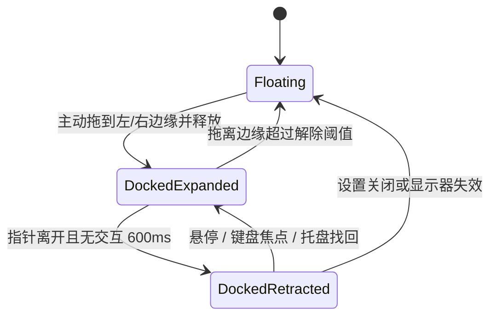
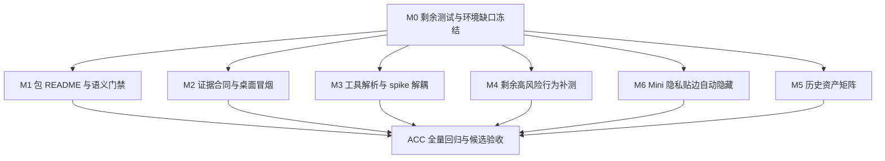

# LetsMakeMoney Windows v1.0.4 PRD

## 0. 文档信息

| 项目 | 内容 |
| --- | --- |
| 对外入口 | `/prd` |
| PRD 类型 | 正式推进型工程治理与隐私能力 PRD |
| 目标版本 | Windows v1.0.4 Stable |
| 当前公开版本 | Windows v1.0.3 Stable |
| 开发基线 | `main`，HEAD `09f838d05c67efb5219437ec2208920e441f3f52` |
| 上游需求池 | `doc/releases/v1.0.4/idea-pool.md` |
| 文档状态 | 完整 PRD 已由项目所有者确认；开发承接文档已生成 |
| 产品功能变化 | 新增 Mini 隐私贴边自动隐藏；除此之外无产品功能变化 |
| 用户界面变化 | Mini 左右贴边收起态、Settings 开关及对应反馈；其余界面不变 |
| 数据库影响 | 无数据库影响 |
| 最后更新 | 2026-07-31 |

本 PRD 将 v1.0.4 定义为一轮发布可信度、测试可信度、开发可复现性和局部可维护性优化，并承接一个边界严格受控的隐私能力：Mini 隐私贴边自动隐藏。除该能力外，本版不改变收入、日历、主题或其他窗口行为，也不恢复宠物能力。

## 1. 版本判断

### 1.1 背景

v1.0.3 Stable 的应用主链路、tag、Release 和附件身份一致，无撤回依据；但发布后 Review 已确认四类工程问题：

1. 便携 Zip 直接复制仓库根 README，导致包内说明残留旧版本口径和不可达的仓库相对链接。
2. 原始验收证据默认保存在被 Git 忽略的临时目录，目录清理后只剩结论，无法完整独立复核。
3. 当前测试已经覆盖 Runtime、配置领域、Desktop Service、生命周期、权威同步和呈现纯函数，但仍有少数组合路径依赖源码 token 或间接证据。
4. 开发环境声明和工具解析入口仍不完整，正式 Cargo fallback 仍优先读取 `spikes/v1.0-ui/`，Node/Python 仍存在 Codex 本机缓存 fallback。

PR #19 已完成 `AppRuntime`、前端 Service、Mini/WindowFrame/拖动切片，以及 Rust 收入与配置边界分层，并通过独立架构验收。v1.0.4 不重复实施这些切片，也不继续拆分 Workbench、Settings、Wizard 或 Windows 生命周期 composition root。

### 1.2 已确认决策

1. 在取得远端写操作授权后，向 v1.0.3 GitHub Release 正文追加 Zip README 快照差异说明；不替换附件、不改 tag、不改哈希。
2. 验收证据采用“仓库内永久保存脱敏摘要，外部保存原始证据”的两层合同。
3. 独立 iOS 仓库暂按“尚未完成全部所有权交接”处理；完成差异清单前不移动、不删除 Windows 仓库中的 iOS 材料。
4. 原先允许的局部模块拆分已经由 PR #19 完成首轮实施并验收；v1.0.4 不再新增第二轮切片，只将现有结果作为继承门禁。
5. 采用方案 A：Mini 隐私贴边自动隐藏进入 v1.0.4，并作为本版唯一新增产品能力；仅支持左右工作区边缘，不扩展顶部、底部或其他窗口。

### 1.3 架构基线校准

2026-07-31，PR #19 `09f838d05c67efb5219437ec2208920e441f3f52`
已经合入 `main` 并通过 `Windows v1 verification`。其成果作为 v1.0.4 的继承基线：

| 项目 | 校准结论 | 证据 |
| --- | --- | --- |
| FR-007 运行时适配入口 | 基线已完成，不重复开发 | `src/runtime/appRuntime.ts`、四个前端 Service、15/15 Runtime 行为测试 |
| FR-009 局部模块切片 | 首轮基线已完成，本版不再扩展 | `WindowFrame`、`MiniWindow`、`useWindowDrag`、Rust Command/Service/Repository 分层 |
| FR-004 高风险行为测试 | 部分完成 | 配置领域 10/10、Desktop Service 21/21、生命周期与权威同步既有行为测试 |
| FR-006 工具解析 | 部分完成 | Cargo 显式变量和 2/2 解析测试已存在；Node/Python、正式缓存、环境诊断仍缺失 |
| FR-008 spike 解耦 | 未完成 | `v10_tools.ps1` 与历史打包脚本仍引用 `spikes/v1.0-ui/` |

架构验收不是 v1.0.4 发布验收。通知区、真实 DPI、首次配置、系统睡眠和长期运行仍按本 PRD 的候选发布门禁执行。

### 1.4 版本目标

- 用户解压便携 Zip 后，即使离线也能读到与该包身份一致的启动、数据、许可和支持说明。
- 每个 Stable 候选都留下可长期复核的候选身份、门禁结果、限制和原始证据索引。
- 复用现有行为测试基线，并为仍缺少直接证据的高风险组合路径补齐可执行测试。
- 外部贡献者可依据明确环境合同，从干净 Windows 环境完成验证、构建和包体验证。
- 正式构建和验证不再依赖名称为 spike 的历史目录。
- 继承的局部治理保持 v1.0.3 已验收产品行为；v1.0.4 不再扩大架构拆分。
- 用户可将 Mini 主动拖到屏幕左侧或右侧，收起后工资信息完全离开可见工作区；悬停、焦点或托盘找回时可立即恢复。

### 1.5 成功指标

| ID | 指标 | 通过标准 |
| --- | --- | --- |
| S-001 | 包内说明一致性 | README、`BUILD-INFO.json`、Zip 文件名、EXE 产品版本和发布 tag 均为 v1.0.4 |
| S-002 | 离线可读性 | 断网环境下可从包内 README 完成启动、定位数据目录、理解许可和找到在线支持 URL |
| S-003 | 证据耐久性 | 新鲜 clone 可读取脱敏摘要并核对候选哈希、环境、结论、限制及原始证据状态 |
| S-004 | 高风险行为保护 | 现有 Runtime、配置、Service、生命周期和同步测试全部复跑；剩余失败补偿与 React 组合缺口有直接行为测试 |
| S-005 | 工具链复现 | 干净 Windows 环境可按文档运行诊断、验证、构建和包验；缺失依赖时给出明确错误 |
| S-006 | 历史目录解耦 | 正式验证和打包脚本不再读取 `spikes/v1.0-ui/` |
| S-007 | 回归稳定性 | v1.0.3 全量自动门禁、真实包启动与窗口找回回归通过 |
| S-008 | Mini 隐私保护 | 左右边缘收起态只露出约 10 逻辑像素且无工资信息；悬停展开、离开回收、拖离解除、托盘找回和显示器回落均通过 |

## 2. 用户、角色与核心场景

### 2.1 角色

| 角色 | 核心需要 |
| --- | --- |
| 普通用户 | 下载 Zip 后无需理解仓库结构即可离线启动和排查基础问题，并能在桌面场景中快速遮蔽工资信息 |
| 项目维护者 | 能证明某次 Release 来自哪个提交、通过哪些门禁、原始证据是否仍可取回 |
| 外部贡献者 | 能从干净 Windows 环境复现验证和构建，不依赖作者本机缓存 |
| 后续审查者 | 能区分原始证据、脱敏摘要、重构证据和已丢失证据 |

### 2.2 核心流程


Mini 隐私链路：



### 2.3 不变量

- v1.0.3 tag、Release、附件和哈希保持不变。
- v1.0.3 原始验收证据缺失的历史事实不得改写。
- 新增摘要不得冒充截图、录屏、完整日志或真实系统操作。
- 所有正式脚本默认只在工作区或显式临时目录内写入。
- 验证失败必须返回非零退出码。
- 任何报告不得输出 token、密码、完整用户路径或真实工资配置。
- 产品配置版本、数据目录、窗口标签及既有 Tauri command/event 名称保持兼容；FR-011 只能增加向后兼容的可选字段和专用命令/事件。

## 3. 范围与优先级

| 优先级 | FR | 范围 |
| --- | --- | --- |
| P0 | FR-001 | 便携包专用离线 README 与语义门禁 |
| P0 | FR-002 | v1.0.3 Release README 快照差异披露 |
| P0 | FR-003 | 两层验收证据耐久合同 |
| P1 | FR-004 | 既有架构基线上的高风险行为缺口补测与聚合门禁 |
| P1 | FR-005 | 打包后桌面启动与窗口找回冒烟 |
| P1 | FR-006 | 剩余可复现开发环境与统一工具解析 |
| 已完成基线 | FR-007 | 运行时适配入口与 fallback 对照夹具；v1.0.4 不重复开发 |
| P1 | FR-008 | 解除正式脚本对 spike 目录的依赖 |
| 已完成基线 | FR-009 | 首轮局部模块切片；v1.0.4 不继续扩展 |
| P2 | FR-010 | 历史资产所有权矩阵与归档门禁 |
| P1 | FR-011 | Mini 隐私贴边自动隐藏 |

`V104-IDEA-011` 本地历史分支独有提交审计属于版本外本机维护，不进入 v1.0.4 实现或发布门禁。

## 4. 总体影响矩阵

| 领域 | 影响 |
| --- | --- |
| React | 复用现有 `AppRuntime`、前端 Service 与行为测试基础；FR-011 增加 Mini 停靠状态、hover/focus/interaction 锁和 Settings 开关 |
| CSS | 仅新增 Mini 收起态隐私露出条和动画状态；其余界面样式不变 |
| Tauri API | 既有 command 和 event 字符串保持不变；FR-011 通过现有 Window Service 增加专用边缘状态接口 |
| Rust | 复用已完成的 Command/Service/Repository 分层；FR-011 增加工作区几何、停靠状态、位置分离和显示器回落，不继续拆分模块 |
| 配置 | 保持 `config_version=8` 和数据目录；增加带默认值的向后兼容可选字段，不得导致 v1.0.3 拒绝读取 |
| 日志 | 保持现有产品语义日志；FR-011 增加脱敏停靠语义事件，不记录工资和精确屏幕坐标 |
| 构建脚本 | 新增 v1.0.4 打包、包语义验证、环境诊断和桌面冒烟入口 |
| CI | 显式安装 Python；运行行为测试、环境诊断和现有回归 |
| 发布包 | 使用包专用 README；其余许可、日历、EXE、DLL 和 `BUILD-INFO.json` 边界延续 |
| 验收证据 | 新增仓库内脱敏摘要与外部原始证据索引 |
| 文档 | 更新构建环境、包说明、证据合同和历史资产矩阵 |
| 原型 | 更新 `doc/prototypes/v1.0/`，覆盖左右收起、悬停展开、Settings 开关和浅色/深色 |
| 数据库 | 无数据库影响 |

## 5. FR-001 便携包专用离线 README 与语义门禁

### 5.1 映射

- 上游：`V104-IDEA-001`
- 验收：`V104-ACC-001`

### 5.2 用户目标

用户解压便携 Zip 后，可以只依赖包内文件完成首次启动、理解数据位置、查看许可、验证版本并找到在线支持入口。

### 5.3 内容合同

包专用中文和英文模板放在 Windows v1 工程内，不再直接复制仓库首页：

- `apps/windows-v1/release-docs/portable-readme.zh-CN.md`
- `apps/windows-v1/release-docs/portable-readme.en.md`

打包时分别渲染为包根目录：

- `README.md`
- `README.en.md`

每份说明必须包含：

1. 产品名、版本、平台、发布渠道。
2. `LetsMakeMoney.exe` 启动方式。
3. `%APPDATA%\io.letsmakemoney.windows\` 配置和日志位置。
4. 便携版升级与回退提示。
5. `LICENSE`、`ASSETS_LICENSE.md`、`ASSETS_MANIFEST.md`、`THIRD_PARTY_NOTICES.md` 和 `CHANGELOG.md` 的本地入口。
6. GitHub 仓库、Release、Issue 和安全报告的绝对 HTTPS URL。
7. “本包不包含安装器、自动更新或宠物功能”的边界。

### 5.4 单一事实源

- 应用版本以 `apps/windows-v1/src-tauri/tauri.conf.json` 为权威源。
- `apps/windows-v1/package.json`、`Cargo.toml`、包名和 `BUILD-INFO.json` 必须与权威版本一致。
- README 模板使用占位符，打包脚本从权威源渲染；禁止手工维护第二份版本号。
- 生成结果中不得残留未替换占位符。

### 5.5 链接规则

- 本地相对链接只能指向同一 Zip 内真实存在的文件。
- 图片不得使用仓库相对路径；包 README 默认不依赖图片。
- 在线链接必须是完整 `https://` URL。
- 断网不影响启动、数据、许可和回退说明的阅读。

### 5.6 失败、重试与回退

- 版本源缺失、版本不一致、占位符残留、本地链接失效或必需许可缺失时，打包失败并返回非零。
- 失败不得覆盖上一份已验收 Zip。
- 修复模板或版本事实后可重新打包。
- 回退方式是恢复 v1.0.3 打包脚本和原有包内容；不得修改既有 v1.0.3 Release。

### 5.7 验收

- 自动：正常包通过；注入旧版本、错误平台、错误 EXE 名、缺失许可、残留占位符和失效相对链接时均失败。
- Computer Use：从全新解压目录打开 README，按说明启动 EXE并定位数据目录。
- 人工：中英文表达、回退说明和在线支持 URL 复核。

## 6. FR-002 v1.0.3 Release README 快照差异披露

### 6.1 映射

- 上游：`V104-IDEA-002`
- 验收：`V104-ACC-002`

### 6.2 操作合同

在项目所有者明确授权远端写操作后，只向 v1.0.3 GitHub Release 正文追加一段说明：

> 已知文档快照差异：本 Release 的便携 Zip 内 README 是打包时快照，部分版本文字和仓库相对链接可能已过期。该差异不影响应用二进制及已公布 SHA-256；最新使用说明以仓库当前 README 和本 Release 正文为准。

### 6.3 保护条件

- 不替换或重新上传 Zip。
- 不修改 `SHA256SUMS.txt`。
- 不移动或重建 `v1.0.3` tag。
- 不把差异描述成二进制缺陷。
- 未取得远端写授权时保持“待执行”，不得阻塞本地 PRD 或开发。

### 6.4 验收

- 修改前后记录 Release ID、tag、资产名、大小和 digest。
- 修改后仅 Release 正文变化，资产和 tag 身份完全一致。
- 失败时不重试覆盖正文，先重新读取远端状态再决定。

## 7. FR-003 两层验收证据耐久合同

### 7.1 映射

- 上游：`V104-IDEA-003`
- 验收：`V104-ACC-003`

### 7.2 两层结构

#### 仓库内永久摘要

每个最终候选创建：

- `doc/releases/<version>/evidence/acceptance-summary.json`
- `doc/releases/<version>/evidence/acceptance-summary.md`

JSON 至少包含：

```text
schema_version
release_version
channel
branch
commit
source_tree_dirty
artifacts[].name
artifacts[].size
artifacts[].sha256
environment.windows_version
environment.architecture
environment.dpi
environment.webview2_version
checks[].id
checks[].method
checks[].result
checks[].started_at
checks[].finished_at
checks[].evidence_ref
limitations[]
redaction
raw_archive.archive_id
raw_archive.archive_sha256
raw_archive.availability
generated_at
```

#### 外部原始证据

外部归档保存截图、录屏、完整日志、资源曲线和系统操作记录。仓库只保存不暴露本机位置的 opaque `archive_id`、归档 SHA256、可用状态和访问责任人角色。

### 7.3 状态合同

`raw_archive.availability` 只允许：

- `available`
- `restricted`
- `missing`
- `not_collected`

若原始证据丢失：

- 摘要继续保留。
- 状态改为 `missing`。
- 历史结论不被自动改写。
- 后续重构证据必须使用新的 ID，并注明“重构证据”，不得占用原始证据引用。

### 7.4 脱敏合同

仓库摘要不得包含：

- 用户名、邮箱、手机号。
- 本机绝对路径。
- 完整配置、真实月薪或个人作息。
- token、密码、私钥、证书。
- 未脱敏完整日志。

允许保留：

- 操作系统版本、架构、DPI、WebView2 版本。
- 产物名、大小、SHA256。
- 测试 ID、结论、时间和脱敏错误分类。
- 相对仓库路径和外部归档 opaque ID。

### 7.5 生成与校验

- 摘要由脚本从候选身份和验收结果生成，禁止手工重录哈希。
- JSON 必须通过 schema 校验。
- Markdown 必须由同一 JSON 渲染或交叉校验。
- 新鲜 clone 必须能验证摘要结构、产物身份和原始证据状态。
- 原始证据没有自动删除期限；若后续不可用，必须显式更新状态。

### 7.6 失败与回退

- 摘要生成、脱敏或 schema 校验失败时，不得进入发布。
- 外部归档写入失败时，候选保持待验收；不得将 `availability` 伪装为 `available`。
- 回退仅删除本次未发布候选的错误摘要并重新生成；已发布摘要通过更正记录追加，不覆盖历史。

## 8. FR-004 既有架构基线上的高风险行为缺口补测与聚合门禁

### 8.1 映射

- 上游：`V104-IDEA-004`
- 验收：`V104-ACC-004`

### 8.2 已完成基线

PR #19 已建立并通过以下直接行为证据：

- Runtime 行为测试：15/15。
- 配置领域测试：10/10。
- Desktop Service 测试：21/21。
- Dashboard 生命周期测试：8/8。
- 权威同步测试：25/25。
- Presentation 测试：18/18。
- 架构结构测试：22/22。

上述证据继续作为 v1.0.4 的继承门禁。相关实现未变化时不得为了凑数量重写或复制同义测试；一旦实现变化，对应证据立即失效并必须重测。

### 8.3 测试基础设施合同

- 继续使用现有 `esbuild + Node` 确定性行为测试入口和 `scripts/verify_architecture.ps1`。
- 现有 `AppRuntime` 与前端 Service 作为可注入 Tauri/browser 接缝，不新增第二套 runtime adapter。
- 先建立“验收条目 -> 现有测试 ID”对照；只有没有直接行为证据的条目才新增测试。
- 只有剩余场景必须依赖 DOM 事件且当前纯 TypeScript 接缝无法可靠证明时，才允许引入最小 DOM 测试运行器；必须固定精确版本、写入 lockfile，并先记录引入理由和回退方式。
- 不以源码字符串检查替代行为测试，也不以覆盖率数字替代关键场景通过。

### 8.4 必须闭合的行为合同

以下条目可以由继承证据或新增测试满足，但每项必须有唯一、可定位的直接证据：

#### 窗口生命周期

1. `lmm:window-hidden` 后停止该窗口本地 tick 和权威同步。
2. `lmm:window-shown` 后立即同步一次，只恢复一组 timer。
3. 重复 hidden/shown 事件不重复注册 timer。
4. 隐藏期间保留最后有效快照。
5. 组件卸载或窗口隐藏后的晚到异步结果不得覆盖当前状态。

#### 配置事务

1. 保存成功更新权威配置和反馈。
2. 无变化返回 unchanged，不伪装为新保存。
3. 保存失败保留用户草稿和旧权威配置。
4. 失败反馈包含可读分类，重试成功后收敛。

#### Dashboard 同步

1. 权威同步失败保留最后有效快照。
2. 初次无快照失败显示错误，而不是伪造收入。
3. 重试成功后清理错误并更新快照。
4. browser fallback 与 Tauri fixture 对相同输入返回同一领域结果。

#### Tauri command 与 event

1. command 成功、业务失败和 invoke 异常分别映射到稳定结果。
2. event listener 正确解除注册。
3. 重复挂载不产生重复 listener。

### 8.5 不做

- 不建立全量视觉回归平台。
- 不自动化 Windows 通知区鼠标操作。
- 不把源码 token 检查删除后却没有行为替代。
- 不以覆盖率数字代替高风险场景通过。

### 8.6 门禁

- 每个高风险测试在本地连续执行 10 次无随机失败。
- CI 每次 PR 和 `main`/`test` push 执行一次完整行为测试。
- 失败测试必须阻塞合并。
- 聚合入口必须同时执行 Runtime、配置领域、Desktop Service、生命周期、权威同步和剩余新增测试。
- 源码 token 检查仅保留为结构辅助证据，并在文档中标注能力边界。

## 9. FR-005 打包后桌面启动与窗口找回冒烟

### 9.1 映射

- 上游：`V104-IDEA-005`
- 验收：`V104-ACC-005`

### 9.2 执行对象

- 必须从新构建的 Zip 解压到唯一临时目录。
- 只能运行该目录内的 `LetsMakeMoney.exe`。
- 记录 Zip、EXE、DLL 的大小和 SHA256。
- 使用隔离 `%APPDATA%`；若应用边界不允许覆盖环境变量，则先备份并在结束后恢复真实目录。

### 9.3 最小冒烟

1. 进程成功启动且未立即退出。
2. 首次启动可打开 Wizard；已有配置可打开 Mini。
3. Mini 可打开 Workbench 和 Settings。
4. 关闭隐藏后可从真实通知区恢复。
5. 退出后进程完全结束。
6. 无残留临时配置、进程或测试目录。

### 9.4 自动、Computer Use 与人工边界

- 自动：包身份、进程启动、窗口枚举、退出码、残留进程和配置隔离。
- Computer Use：Wizard/Mini/Workbench/Settings 可见、关闭隐藏、通知区找回。
- 人工：任务栏策略、通知区真实鼠标行为和高 DPI 清晰度。
- 无交互桌面会话的 CI 不得把进程级冒烟写成完整桌面通过。

### 9.5 失败补偿

- 启动失败时保留脱敏日志和候选身份，不自动改用 build 目录。
- 恢复失败时强制结束候选进程并恢复配置。
- 任一残留进程或用户配置污染都判定冒烟未通过。

## 10. FR-006 剩余可复现开发环境与统一工具解析

### 10.1 映射

- 上游：`V104-IDEA-006`
- 验收：`V104-ACC-006`

### 10.2 环境合同

文档必须覆盖：

- Windows 10/11 x86_64。
- Node.js 22 与 npm lockfile。
- Python 3.12。
- Rust MSVC 工具链与 `x86_64-pc-windows-msvc` target。
- Visual Studio 2022 Build Tools、Desktop development with C++。
- 当前受支持的 Windows SDK。
- Microsoft Edge WebView2 Runtime。
- PowerShell 7 或 Windows PowerShell 的脚本兼容边界。

### 10.3 已完成与剩余边界

已完成基线：

- Cargo 支持显式环境变量解析。
- 工具解析测试 2/2 通过。
- 架构验证已经能在当前 Windows 开发环境执行。

v1.0.4 剩余工作：

- 为 Node 与 Python 增加与 Cargo 一致的显式环境变量入口。
- 去除 Codex 私有缓存和 `spikes/v1.0-ui/.toolchains` 的正式默认 fallback。
- 建立仓库根 `.toolchains/` 可选本地缓存合同。
- 增加只读环境诊断、干净环境文档和 CI 显式安装合同。
- 验证清空缓存后仍可完成测试、构建和打包。

### 10.4 统一解析优先级

所有正式脚本通过 `scripts/v10_tools.ps1` 解析工具：

1. 显式环境变量，如 `LMM_PYTHON`、`LMM_NODE`、`LMM_CARGO`。
2. 当前 `PATH`。
3. 仓库根目录下被 Git 忽略的正式缓存目录 `.toolchains/`。
4. 明确报错并停止。

不得再把 Codex 私有缓存或 `spikes/v1.0-ui/.toolchains` 作为正式默认 fallback。

### 10.5 环境诊断

新增只读环境诊断入口，输出：

- 工具名称、来源类型和脱敏路径类别。
- 版本。
- Rust target。
- MSVC 与 SDK 可用性。
- WebView2 可用性。
- 缺失项和修复方向。

诊断不得下载工具、修改 PATH 或输出用户名。

### 10.6 Rust 固定策略门禁

开发 M0 对当前成功工具链执行对照：

- 当前 stable。
- 候选固定版本。

仅当两者均通过 test/build/package，且固定版本不阻塞已锁定依赖时，才新增 `rust-toolchain.toml`。否则继续使用 stable，但将实际 `rustc -Vv` 写入 `BUILD-INFO.json` 和证据摘要。

### 10.7 CI

- 显式使用 `actions/setup-python` 安装 Python 3.12。
- Node、Python 和 Rust Action 固定到不可变 commit。
- CI 先执行环境诊断，再安装依赖和验证。
- 缓存只能提升速度，清空缓存后仍必须可构建。

## 11. FR-007 运行时适配入口与 fallback 对照夹具（架构基线已完成）

### 11.1 映射

- 上游：`V104-IDEA-007`
- 验收：`V104-ACC-007`

### 11.2 实际完成形态

PR #19 已采用以下真实实现完成该需求，不再新建计划中的 `src/runtimeAdapter.ts`：

- `src/runtime/appRuntime.ts`
- `src/runtime/timeService.ts`
- `src/services/configurationService.ts`
- `src/services/dashboardService.ts`
- `src/services/supportService.ts`
- `src/services/windowService.ts`

Runtime 统一环境判断、invoke、listen、时间与 browser fallback 接缝；Service 负责配置、Dashboard、支持和窗口调用。Runtime 行为测试 15/15、Desktop Service 测试 21/21 已通过。

### 11.3 v1.0.4 合同

- 不重复实现第二套 adapter。
- 不迁移到新的全局状态库。
- 不重命名公开 command、event、配置字段或窗口标签。
- 正式 Tauri 失败时不得静默回退到 browser 模拟实现。
- v1.0.4 只在全量验证中重跑继承测试，并在追踪矩阵记录证据身份。

### 11.4 失效与回退

- `AppRuntime`、上述 Service 或其调用者发生语义变化时，FR-007 继承证据失效。
- v1.0.4 若因其他改动引发运行时回归，优先回退本版相关改动；不得为了回退 v1.0.4 而删除已经合入主线的架构基线。
- 发布级回退仍使用 v1.0.3 Stable。

## 12. FR-008 解除正式脚本对 spike 目录的依赖

### 12.1 映射

- 上游：`V104-IDEA-009`
- 验收：`V104-ACC-008`

### 12.2 合同

- `Get-V10Cargo` 不再读取 `spikes/v1.0-ui/.toolchains`。
- 可选本地工具缓存改为仓库根 `.toolchains/`，并保持 Git 忽略。
- 打包、全量验证和 CI 对 `spikes/` 的路径扫描结果必须为 0。
- 删除依赖不等于删除 `spikes/v1.0-ui/`；历史 Spike 是否归档由 FR-010 后续决定。

### 12.3 验收

1. 临时重命名 `spikes/v1.0-ui/` 后，全量验证和打包仍通过。
2. PATH 工具、显式 `LMM_CARGO` 和正式 `.toolchains/` 三条解析路径分别验证。
3. 缺少 Cargo 时给出单一明确错误，不回退到私人目录。

## 13. FR-009 首轮局部模块切片（架构基线已完成，本版不扩展）

### 13.1 映射

- 上游：`V104-IDEA-008`
- 验收：`V104-ACC-009`
- 状态：继承完成，不是 v1.0.4 新开发范围

### 13.2 已完成切片

PR #19 已完成：

- `components/WindowFrame.tsx`
- `features/mini/MiniWindow.tsx`
- `hooks/useWindowDrag.ts`
- Runtime 与前端 Service 分层
- Rust 配置和收入链路的 Command/Service/Repository/Model 分层

对应架构结构测试 22/22、Presentation 测试 18/18、Rust 全量测试和独立 GUI 架构验收均已通过。

### 13.3 v1.0.4 禁止范围

- 不整体拆分 `App.tsx`、`model.ts` 或 `lib.rs`。
- 不引入新的全局状态库。
- 不改变 React 信息架构。
- 不借机重命名大量符号或格式化无关文件。
- 不以 FR-009 为理由继续拆分第二轮模块。
- 后续新发现的拆分需求必须进入下一版本 Idea 或独立技术 Spike。

## 14. FR-010 历史资产所有权矩阵与归档门禁

### 14.1 映射

- 上游：`V104-IDEA-010`
- 验收：`V104-ACC-010`

### 14.2 产物

新增 `doc/releases/v1.0.4/historical-assets.md`，逐项记录：

- 路径。
- 内容类型。
- 当前事实源。
- 当前维护仓库。
- 代码、脚本或文档引用。
- 许可和隐私状态。
- 建议：保留、待迁移、待归档、删除候选或必须保留。
- 前置验证。
- 项目所有者签核状态。

### 14.3 必查范围

- `spikes/v1.0-ui/`。
- `doc/prototypes/v0.9-polished/` 与 Figma Development Plugin。
- Windows 仓库中的 iOS 原型。
- 用户手册、历史 release 文档、bugfix log 和验收摘要。
- v0.9 桌宠与动画合同。

### 14.4 门禁

- 本版只建立矩阵，不移动或删除任何资产。
- iOS 同名文件必须做路径级 diff、引用扫描和许可复核。
- Windows 独有内容为 0，或已迁入独立 iOS 仓库并由所有者签核后，才可在后续版本提出清理。
- 文件年龄、体积和目录名称不能单独作为删除依据。

## 15. FR-011 Mini 隐私贴边自动隐藏

### 15.1 映射

- 上游：`V104-IDEA-012`
- 验收：`V104-ACC-011`
- 优先级：P1
- 数据库影响：无数据库影响

### 15.2 用户目标与边界

当工资 Mini 长期停留在桌面时，用户可以把它主动拖到当前显示器工作区的左侧或右侧。窗口在用户离开后自动收起到屏幕外，只保留一个不含工资信息的窄露出条；用户把鼠标移到露出条、通过键盘聚焦或从托盘找回时，Mini 完整展开。

本需求只处理：

- `mini` 窗口。
- Windows 工作区的左、右边缘。
- 工资信息的快速遮蔽与恢复。

本需求不处理：

- 顶部或底部停靠。
- Workbench、Settings 或 Wizard 的自动隐藏。
- 多窗口磁吸、分屏布局、桌面组件或通用停靠框架。
- 原生隐藏、进程暂停或 Dashboard timer 暂停。

### 15.3 入口、默认状态与正常流程

入口一：用户拖动 Mini。

1. `mini_edge_auto_hide=true`。
2. 用户通过现有全窗口拖动主动移动 Mini。
3. 指针释放时，Mini 的正常边界距离当前显示器左侧或右侧工作区边界不超过 `16` 逻辑像素。
4. 两侧同时满足时选择距离更近的一侧；距离相同时保持原停靠侧，否则选择右侧。
5. 进入 `docked_expanded_left` 或 `docked_expanded_right`。
6. 指针离开窗口且没有交互锁、焦点、菜单或活动拖动时，启动 `600ms` 回收计时。
7. 计时结束后进入对应 `docked_retracted_*`，仅保留 `10` 逻辑像素隐私露出条。

入口二：用户恢复 Mini。

- 指针进入露出条。
- Mini 获得键盘焦点。
- 托盘“显示 / 隐藏迷你收入”或其他窗口找回路径要求显示 Mini。

满足任一入口时，Mini 在建议 `180ms` 内展开到已保存的正常边界；恢复期间不清空最后有效快照。

默认状态：

- 新用户和旧配置：`mini_edge_auto_hide=true`。
- 未停靠：`mini_edge_dock=none`。
- 开启功能不等于自动停靠；必须由用户主动拖动并释放触发。

### 15.4 状态机

| 状态 | 含义 | 可见内容 | 允许转移 |
| --- | --- | --- | --- |
| `floating` | 普通悬浮 | 完整 Mini | 主动贴边后进入展开停靠 |
| `docked_expanded_left` | 左侧停靠且展开 | 完整 Mini | 离开后收起、拖离后悬浮 |
| `docked_retracted_left` | 左侧停靠且收起 | 右侧 10px 露出条 | 悬停/焦点/找回后展开 |
| `docked_expanded_right` | 右侧停靠且展开 | 完整 Mini | 离开后收起、拖离后悬浮 |
| `docked_retracted_right` | 右侧停靠且收起 | 左侧 10px 露出条 | 悬停/焦点/找回后展开 |

以下状态不是持久化状态，只是并发保护：

- `reveal_animating`
- `retract_pending`
- `drag_active`
- `interaction_locked`

任何时刻最多只能存在一个回收 timer。晚到 timer、晚到动画完成事件和窗口重建不得覆盖更新后的状态。

### 15.5 几何与显示器合同

- 所有阈值先以逻辑像素定义，再按当前窗口 `scale_factor` 转为物理像素。
- 边缘检测使用 Windows 显示器 **work area**，不得使用包含任务栏的完整 monitor bounds。
- 支持主屏左右两侧的负坐标显示器。
- 正常展开位置和收起物理位置必须分离：
  - 正常位置用于用户拖动、重启恢复和解除停靠。
  - 收起位置只用于运行时展示，不得写回 `mini_window_position`。
- 左侧收起：完整窗口右侧仅有 10 逻辑像素留在 work area 内。
- 右侧收起：完整窗口左侧仅有 10 逻辑像素留在 work area 内。
- 正常展开位置仍需满足既有安全夹取；收起位置使用 FR-011 专用几何规则，不得再次被普通 `safe_window_position` 夹回屏内。
- DPI 或工作区变化时重新计算物理坐标，不得按旧物理像素直接复用。
- 保存的显示器不存在、工作区无效或坐标无法映射时：
  1. 取消停靠。
  2. 将完整 Mini 放回主屏安全可见区域。
  3. 记录 `restore_fallback`。
  4. 不允许停留在屏幕外。

### 15.6 拖动、点击与交互保护

- Mini 保留“非交互区域全窗口可拖动”的现有行为。
- 拖动开始时立即：
  - 取消回收 timer。
  - 展开 Mini。
  - 进入 `drag_active`。
- 从停靠边缘向工作区内拖离超过 `24` 逻辑像素时解除停靠，并将新位置作为普通悬浮位置保存。
- 拖动结束后才执行边缘检测；移动过程中不反复吸附。
- 以下情况禁止回收：
  - 指针仍在窗口或露出条内。
  - pointer capture 或拖动未结束。
  - 按钮、链接或其他交互控件正在激活。
  - Mini 或其子节点持有键盘焦点。
  - 与 Mini 关联的菜单、确认框或模态交互尚未结束。
- 展开态点击 Mini 继续打开 Workbench；拖动产生的 click 仍由现有 `consumeDraggedClick()` 屏蔽。
- 收起态露出条不提供金额、状态、日期或可识别工资的缩略内容。

### 15.7 Settings 事务

位置：Settings → 窗口与启动 → 窗口。

控件：

- 标签：`贴边自动隐藏`
- 说明：`靠近屏幕左右边缘后收起，悬停时展开`
- 类型：开关
- 默认：开启

事务语义：

- 开关进入现有配置草稿。
- 保存成功后同步到所有应用窗口。
- 无变化保存返回现有 `unchanged` 语义。
- 取消、关闭放弃或保存失败时恢复已持久化行为，用户草稿按现有 Settings 规则保留或撤销。
- 从开启改为关闭并保存时：
  1. 立即展开 Mini。
  2. 清除停靠侧。
  3. 完整窗口留在对应边缘的安全可见位置。
- 从关闭改为开启时不立即移动窗口；用户下次主动拖到边缘才停靠。

### 15.8 配置与兼容

首选在 `config_version=8` 内增加带默认值的向后兼容字段：

```json
{
  "mini_edge_auto_hide": true,
  "mini_edge_dock": "none"
}
```

约束：

- `mini_edge_auto_hide`：布尔值，缺失时默认为 `true`。
- `mini_edge_dock`：`none | left | right`，缺失或非法时回退 `none`。
- Rust `serde` 必须为缺失字段提供默认值；不能仅依赖完整 defaults JSON。
- v1.0.3 必须仍能读取带这两个未知字段且 `config_version=8` 的 v1.0.4 配置。
- 若测试证明 v1.0.3 会拒绝、污染或无法安全保存该配置，则不得直接升级 `config_version`；改为使用版本化 `window-state.json` 保存停靠运行时状态。
- 旧版本保存配置时可能丢弃未知字段；v1.0.4 再次启动必须依靠默认值安全恢复，不得判为配置损坏。
- `mini_window_position` 只保存完整展开位置，不保存收起坐标。

### 15.9 Tauri、Rust 与窗口生命周期

- 通过 `WindowService` 暴露专用停靠命令，不在 React 中直接拼接物理坐标。
- Rust 负责：
  - monitor/work-area 选择。
  - 逻辑/物理像素转换。
  - 左右边缘检测。
  - 展开与收起位置计算。
  - 显示器变化回落。
  - 正常位置与收起位置分离。
- React 负责：
  - pointer/focus/interaction 状态。
  - 600ms 回收 timer。
  - Settings 草稿与可见反馈。
- 边缘收起属于“窗口仍可见的隐私状态”，不是原生隐藏：
  - 不发送 `lmm:window-hidden`。
  - 不暂停 1 秒本地 tick 或 30 秒权威同步。
  - 不触发 WebView suspend。
  - Mini 继续保持 `skip_taskbar=true`。
- 托盘找回先确保窗口原生可见，再强制进入展开停靠态；指针离开后可重新收起。

### 15.10 加载、错误与失败补偿

- loading、normal、rest 和 error 高度都使用同一停靠合同；窗口高度变化后重新计算收起坐标。
- 工作区读取失败：保持完整窗口可见，不执行收起。
- 原生移动失败：恢复上一次完整可见位置并显示非阻塞反馈；不得反复重试导致抖动。
- timer 注册失败或页面重建：保持展开，隐私自动隐藏可以暂时失效，但窗口不能丢失。
- 配置保存失败：恢复已持久化开关和停靠行为，旧配置不被污染。
- 显示器断开：取消停靠并回落主屏；用户可再次主动停靠。

### 15.11 日志与隐私

新增语义事件：

- `mini.edge_dock.detected`
- `mini.edge_dock.retracted`
- `mini.edge_dock.revealed`
- `mini.edge_dock.canceled`
- `mini.edge_dock.restore_fallback`
- `mini.edge_dock.failed`

日志只记录：

- 事件。
- 停靠侧。
- 触发来源。
- 结果或脱敏错误分类。

日志不得记录：

- 工资、收入或工作时间。
- 完整用户路径。
- 可用于还原个人桌面布局的精确屏幕坐标。

### 15.12 自动测试

Rust 几何和配置测试必须覆盖：

- 左右边缘检测和 16px 阈值。
- 10px 露出条位置。
- 主屏、负坐标副屏和不同 work area。
- 100%、125%、150% scale factor。
- loading/error 高度变化。
- 显示器缺失与主屏回落。
- 收起坐标不写入 `mini_window_position`。
- v8 旧配置缺字段默认值。
- v1.0.3 读取 v1.0.4 配置兼容夹具。

TypeScript 行为测试必须覆盖：

- 离开后 600ms 收起。
- 进入、焦点和托盘找回展开。
- 交互锁和拖动取消回收。
- 重复事件不会注册多个 timer。
- 晚到 timer 不覆盖新状态。
- 设置保存、无变化、失败、取消和关闭。

### 15.13 Computer Use 与人工验收

真实 Windows 候选包至少执行：

1. 主屏左侧停靠、收起、悬停展开、离开回收。
2. 主屏右侧同一流程。
3. 收起态截图确认没有金额、状态或日期可见。
4. 展开后点击 Workbench。
5. 停靠态拖离并确认解除停靠、位置持久化。
6. 托盘隐藏与找回；找回时完整展开。
7. 重启后恢复已保存停靠侧，且窗口可找回。
8. 开关关闭后立即完整可见；重新开启后不自动移动。
9. 100%、125%、150% DPI 下的阈值、露出宽度和动画稳定性。
10. 多显示器、负坐标和断开显示器；环境不具备时标记待人工补证。
11. loading/error 长文案下无裁切、抖动或不可找回。
12. 浅色、深色和 reduced-motion。

通过标准：

- 收起态不暴露工资信息。
- 展开和收起无连续抖动。
- 窗口在任何失败路径都能回到完整可见位置。
- 不产生重复 timer、位置污染或隐藏生命周期事件。
- v1.0.3 配置兼容门禁通过。

## 16. 数据、配置、日志与安全

### 16.1 配置

- `%APPDATA%\io.letsmakemoney.windows\` 位置不变。
- FR-011 优先在 `config_version=8` 内增加带 serde 默认值的 `mini_edge_auto_hide` 与 `mini_edge_dock`；其余 schema 不变。
- 配置保存、无变化、失败补偿和迁移事务不变。
- 必须证明 v1.0.3 可读取 v1.0.4 配置；无法证明时改用独立窗口状态文件，不得仓促提升配置版本。
- 测试使用隔离配置，不修改用户真实配置。

### 16.2 BUILD-INFO 扩展

在现有字段基础上增加或确认：

- `toolchain.node`
- `toolchain.python`
- `toolchain.rustc`
- `toolchain.target`
- `toolchain.msvc`
- `toolchain.windows_sdk`
- `toolchain.webview2`
- `package_readme_sha256`
- `acceptance_summary_sha256`

若验收摘要在构建之后生成，`acceptance_summary_sha256` 放入发布清单而非回写 Zip，避免循环哈希。

### 16.3 日志

- 产品 `debug.log` 不增加构建工具路径或外部证据位置。
- 行为测试输出测试 ID、阶段、结果和脱敏错误分类。
- 桌面冒烟记录进程、窗口和恢复阶段，不记录用户窗口标题或个人路径。
- Mini 停靠日志只记录侧别、触发来源和脱敏结果，不记录精确屏幕坐标或工资信息。
- 所有临时日志在摘要生成后按既有清理规则处理。

### 16.4 安全与隐私

- 外部归档不得公开访问。
- 仓库摘要进入 Git 前执行敏感信息和绝对路径扫描。
- 工具解析只接受现有文件，不执行远程下载或脚本注入。
- 包 README 不包含本机路径、账号或测试数据。
- Mini 收起态必须将完整工资内容移出工作区；隐私露出条不得包含金额、日期、进度或工作状态。

## 17. 兼容、迁移与回滚

### 17.1 v1.0.3 兼容

- 除 FR-011 外，所有产品功能、UI、配置、数据目录、日历数据和窗口行为必须保持等价。
- FR-011 默认开启，但未主动贴边时 Mini 行为与 v1.0.3 等价。
- v1.0.3 必须能读取 v1.0.4 保存的配置；旧版本丢弃未知停靠字段后，v1.0.4 以安全默认值恢复。
- v1.0.3 继续作为直接回滚包。
- v1.0.4 不读取或修改 v0.9 宠物配置。

### 17.2 分层回滚

| 变更 | 回滚方式 |
| --- | --- |
| 包 README | 恢复旧复制逻辑并保留新版模板，不触碰已发布包 |
| 证据合同 | 恢复旧验收流程；已生成摘要保留并标记废弃，不伪删 |
| 行为测试 | 测试基础设施可单独回退，不删除已发现缺陷记录 |
| Runtime/Service 架构基线 | v1.0.4 不新增该变更；发生发布回归时回退本版相关改动或整体回退至 v1.0.3 |
| 工具解析 | 恢复上一版 `v10_tools.ps1`；不得恢复私人绝对路径 |
| 首轮局部切片 | 继承已合入主线的基线，本版不继续拆分或单独回退 |
| 历史资产矩阵 | 文档回退，不移动真实资产 |
| Mini 隐私贴边 | 关闭默认开关、清除停靠侧并恢复完整可见位置；保留兼容字段或独立状态文件，不修改收入配置 |

### 17.3 发布回滚

若 v1.0.4 发布后出现运行时回归：

1. 停止推荐 v1.0.4。
2. 指向 v1.0.3 Stable Release。
3. 保留 v1.0.4 失败包、哈希和证据摘要。
4. 不覆盖 v1.0.4 tag 或附件；通过后续修复版本处理。

## 18. 自动化与验收总矩阵

| 验收 ID | 核心内容 | 自动测试 | Computer Use | 人工 |
| --- | --- | --- | --- | --- |
| V104-ACC-001 | 包 README 与身份一致 | 必须 | 启动与数据目录 | 中英文文案 |
| V104-ACC-002 | v1.0.3 Release 披露 | 远端身份复核 | 无 | 正文语义 |
| V104-ACC-003 | 两层证据合同 | schema、脱敏、哈希 | 证据采集流程 | 外部取回 |
| V104-ACC-004 | 继承行为证据与剩余缺口 | 聚合门禁必须 | 真实窗口补证 | 异常反馈 |
| V104-ACC-005 | 新解压桌面冒烟 | 进程与身份 | 必须 | 通知区/任务栏 |
| V104-ACC-006 | 干净环境复现 | 环境诊断、CI | 必要时 | 干净机说明 |
| V104-ACC-007 | Runtime/Service 架构继承门禁 | 15/15、21/21 与聚合验证 | 受影响路径回归 | 无 |
| V104-ACC-008 | spike 解耦 | 路径扫描、三路解析 | 无 | 无 |
| V104-ACC-009 | 首轮局部切片继承门禁 | 22/22、18/18 与聚合验证 | 受影响路径回归 | 不继续扩展确认 |
| V104-ACC-010 | 历史资产矩阵 | 引用和路径扫描 | 无 | 所有权签核 |
| V104-ACC-011 | Mini 隐私贴边 | 几何、配置、状态机和 timer | 左右停靠、悬停、拖离、托盘、DPI | 多显示器和隐私观感 |

### 18.1 必须保留的真实桌面回归

- 首次启动 Wizard。
- Mini 启动、拖动和位置持久化。
- Workbench、Settings 显示与关闭。
- 关闭隐藏与通知区找回。
- 浅色、深色配置保留。
- Mini 左右贴边收起、悬停展开、拖离解除、托盘找回和重启恢复。
- 真实 Windows 100% DPI；125%/150% 使用既有 v1.0.3 证据加受影响页面定向复核。

### 18.2 文档和编码门禁

- 文档状态检查。
- UTF-8 严格解码。
- 常见乱码扫描。
- Markdown 本地链接检查。
- `git diff --check`。
- 当前树敏感信息和本机绝对路径扫描。

## 19. 开发前实施顺序



### 19.1 M0 必须产出

- FR-004 每条验收标准与现有测试 ID 的对照，以及真实剩余缺口。
- 当前 stable 与候选 Rust 固定版本的对照结果。
- 正式 `.toolchains/` 与环境变量解析合同。
- FR-007、FR-009 架构继承证据身份与失效条件。
- 是否确需引入 DOM 测试运行器的 go/no-go 记录；默认不引入。
- FR-011 work-area 几何、逻辑/物理像素、v8 配置兼容和正常/收起位置分离的 go/no-go 证据。

M0 不得修改用户可见行为。

## 20. 发布门禁

v1.0.4 只有同时满足以下条件才可进入发布收口：

1. FR-001、FR-003 至 FR-006、FR-008、FR-010 和 FR-011 全部通过。
2. FR-002 已执行，或因未授权明确列为远端文档待办；不得伪造完成。
3. FR-007 与 FR-009 的架构继承门禁重跑通过，且本版没有重复实现或扩大拆分。
4. FR-010 所有权矩阵完成，但不要求本版迁移资产。
5. 从干净提交重新构建，`source_tree_dirty=false`。
6. Zip、EXE、DLL、README、`BUILD-INFO.json` 和证据摘要哈希齐全。
7. 新解压桌面冒烟通过，用户配置和进程已恢复。
8. v1.0.3 全量产品回归通过。
9. CI、文档、UTF-8、链接、敏感信息和 `git diff --check` 全部通过。
10. 发布附件只包含便携 Zip 和 `SHA256SUMS.txt`。
11. Mini 收起态隐私截图、左右边缘、托盘找回、配置兼容和 100%/125%/150% DPI 验收通过。

## 21. 非目标

- 除 FR-011 外，不新增或改变产品功能。
- 不恢复宠物或 PetManager。
- 不新增账号、云同步、安装器、静默更新或多平台。
- 不做全量 UI 自动化。
- 不重写全局状态管理。
- 不整体重构 React/Tauri/Rust 主链路。
- 不批量删除、移动或归档历史文档、原型和脚本。
- 不清理本地历史分支。
- 不修改 v1.0.3 tag、附件或哈希。
- 不把 FR-011 扩展为顶部/底部停靠、其他窗口自动隐藏、磁吸布局或通用桌面停靠系统。

## 22. 风险与停止条件

| 风险 | 处理 |
| --- | --- |
| 重复引入测试框架导致 CI 复杂化 | 优先复用现有 esbuild + Node 门禁；DOM 依赖需单独证明必要性 |
| 已完成架构基线被重新开发 | FR-007、FR-009 只作为继承门禁；出现新拆分诉求立即转入下一版本 |
| Rust 固定版本阻塞依赖 | 不强制 pin，保留 stable 并记录真实版本 |
| 外部原始证据不可取回 | 标记 `missing`，不得写为完整通过 |
| 工具解析清理误伤本地构建 | 同时验证显式变量、PATH、`.toolchains/` 和无缓存失败路径 |
| iOS 材料仍有 Windows 独有内容 | 保留原位，矩阵记录，后续再决策 |
| 收起坐标被普通安全夹取覆盖 | normal/retracted 坐标分离；专用 work-area 几何测试后才接入窗口命令 |
| Mini 无法找回或 hover 抖动 | 托盘强制展开、单 timer、交互锁、失败回落主屏完整可见 |
| 配置版本破坏回滚 | 保持 v8 向后兼容并用 v1.0.3 夹具验证；不通过则使用独立窗口状态文件 |

## 23. 开发承接状态

本 PRD 已按 `09f838d05c67efb5219437ec2208920e441f3f52` 架构基线完成校准。FR-007、FR-009 作为已完成继承基线，不再进入新开发任务；FR-004、FR-006 只承接真实剩余缺口；FR-011 作为唯一新增产品能力独立实施和回滚。

项目所有者已于 2026-07-31 确认本 PRD。开发承接已生成：

- `doc/releases/v1.0.4/dev_plan_v1.0.4.md`
- `doc/releases/v1.0.4/progress_v1.0.4.md`
- `doc/logs/dev_log_v1.0.4.md`

下一阶段从 `V104-M0-001` 至 `V104-M0-010` 开始，只完成事实冻结、测试缺口、工具链、几何和配置兼容门禁。未获得独立授权前，不执行 v1.0.3 Release 远端写操作、提交、推送、tag 或 Release。
