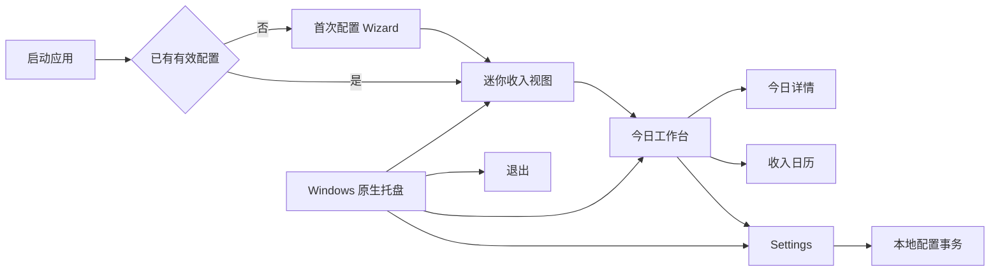
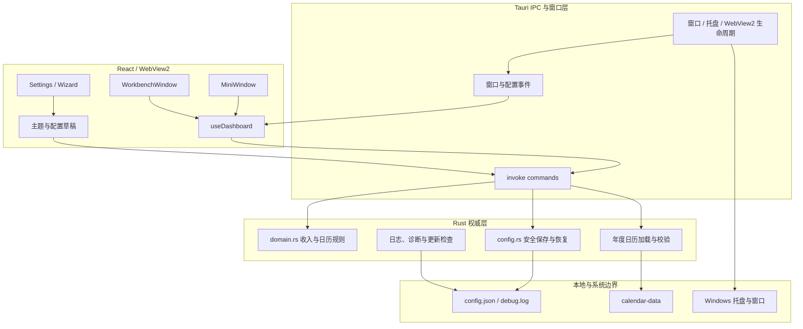

# LetsMakeMoney Windows v1.0.4 深度 Review

入口：`/review`

## Review 判断

- 自动识别类型：Project Review。
- 辅助通路：Implementation Review、文档与事实一致性 Review、Release Readiness Review、Repository Governance Review。
- 审查对象：当前 `main`、已发布的 v1.0.3 Stable、React/Tauri/Rust 主链路、验证与打包体系、版本文档和历史资产。
- 未覆盖范围：未修改业务代码；未执行破坏性测试；未替换 v1.0.3 Release 资产；未重新验证真实睡眠、系统时间跳变和两小时运行。
- 总体结论：没有发现需要撤回 v1.0.3 的运行时 Blocker。实际发布包可启动，Mini、今日详情、日历和 Settings 主链路可用。
- 当前主要风险：发布包内说明仍为 v1.0.2 口径；原始验收证据目录已丢失；GUI 与 WebView2 关键行为缺少稳定的自动测试层；几个核心模块已显著集中。
- 下一阶段判断：具备进入 v1.0.4 `/idea` 的条件。v1.0.4 应定位为发布工程、可验证性和可维护性修订，不需要扩展产品功能。

## v1.0.3 真实基线

| 项目 | 事实 |
| --- | --- |
| 当前分支 | `main` |
| 当前 HEAD | `eb57e0b3af726f552afe68acccaa927345714da9` |
| 远端 | `origin/main` 与当前 HEAD 一致 |
| 当前工作树 | Review 开始时干净 |
| 当前版本 | v1.0.3 Stable |
| v1.0.3 tag | `87f6766a33fd6ff284f0fb3a42dc18c5a7292bf4` |
| 当前 HEAD 与 tag | 当前 HEAD 在 tag 后 3 个文档提交，无业务代码差异 |
| 发布 Zip | `LetsMakeMoney-v1.0.3-windows-x86_64.zip` |
| Zip SHA-256 | `259CAE23D785FC7712CAC0EFD42991C8EE210C0BCEA1EB5C07FC171DFB993B28` |
| 解压 EXE SHA-256 | `41BB11FCBC95C3789AD283D0F85E67DB0E17D4BC769B133B317FDB1804607237` |
| 远端 CI | 当前 HEAD 的 `Windows v1 verification` 通过 |
| 发布平台 | Windows x86_64 便携 Zip |
| 数据边界 | 本地配置、本地日志、离线年度日历数据；无账号和数据库 |

本轮实际运行了从 GitHub Release 下载并全新解压的 v1.0.3 EXE。观察到 Mini、今日收入、收入日历、Settings 五个页签和窗口切换均可工作，没有发现新的发布阻塞。

## 产品与工程地图

### 产品流程

### 运行时边界

### 主要模块

| 模块 | 入口 | 职责 | 当前状态 | 主要风险 |
| --- | --- | --- | --- | --- |
| React 窗口 | `apps/windows-v1/src/App.tsx` | Mini、Workbench、Today、Calendar、Wizard、Settings 与弹窗 | 可用 | 单文件承担过多界面与窗口职责 |
| Dashboard 模型 | `apps/windows-v1/src/model.ts` | 权威同步、本地 tick、时间边界、日历与展示模型 | 可用 | 计算、生命周期和格式化集中；浏览器回退有重复业务逻辑 |
| 配置模型 | `configModel.ts`、`theme.ts` | 草稿、主题、保存与迁移 | 可用 | Tauri 环境判断重复 |
| Tauri 运行时 | `src-tauri/src/lib.rs` | commands、托盘、窗口、WebView2 生命周期 | 可用 | IPC、窗口策略和系统能力集中 |
| Rust 领域层 | `domain.rs` | 收入、跨夜 owner date、工作日与日期调整 | 测试较完整 | 文件较大，但属于应谨慎拆分的权威规则 |
| 配置事务 | `config.rs` | 版本迁移、安全写入、恢复和默认值 | 测试较完整 | 不宜为瘦身破坏兼容合同 |
| 验证与发布 | `scripts/`、`.github/workflows/` | 聚合验证、打包、包体验证、CI | 可用 | 本地依赖声明和发布包文档语义校验不足 |

## 当前进度真实性

| 维度 | 判断 | 证据状态 |
| --- | --- | --- |
| 代码与版本号 | `package.json`、Cargo、Tauri 配置均为 1.0.3 | 已确认 |
| tag 与发布产物 | tag、Zip digest、BUILD-INFO 和 GitHub Release 一致 | 已确认 |
| 当前 main | tag 后仅有文档提交，仍是 v1.0.3 Stable | 已确认 |
| 运行时主链路 | 本轮真实启动 Release EXE 并检查 Mini、工作台、日历与 Settings | 已确认 |
| 发布包用户说明 | 包内 README 仍为 v1.0.2，且引用包内不存在的 `assets/`、`doc/` | 已确认 |
| 最终验收证据 | 文档引用的两个原始 `.tmp_acceptance` 目录已不存在，仅有后建的重构证据 | 已确认 |
| 自动门禁 | 当前 HEAD 远端 CI 通过；本地 TS/文档/合同门禁通过 | 已确认 |
| 本地完整复现 | 本机缺少 Cargo，聚合验证未在本机完整复跑 | 已确认 |

## 关键发现

| ID | 文件或符号 | 现象 | 证据状态 | 影响 | 严重度 | 建议 | 去向 |
| --- | --- | --- | --- | --- | --- | --- | --- |
| V104-REV-001 | v1.0.3 Release Zip `README.md`；`scripts/package_v103.ps1:65` | 已发布 Zip 内 README 仍写 v1.0.2，且图片和内部文档链接在包内不可用 | 已确认 | 用户下载后得到错误版本说明和失效入口，削弱发布可信度 | Major | 不篡改历史哈希；在 v1.0.4 引入包内专用 README 或链接重写，并验证版本语义和链接 | 进入 `/idea` |
| V104-REV-002 | `verification.md:27-29`、`manual-verification.md:21-133`、`progress_v1.0.3.md:161` | 验收文档指向已丢失且被忽略的本地证据目录 | 已确认 | 无法独立复核睡眠、时间跳变、托盘左键和环境恢复的原始证据 | Major | 保留历史通过结论但标注原始证据不可用；建立可长期保存的脱敏证据清单和摘要 | 进入 `/idea` |
| V104-REV-003 | `apps/windows-v1/tests/verify_webview_suspend_v103.py` 等 | 多个关键门禁以源码 token/顺序检查为主，不能证明真实 React/Tauri/WebView2 行为 | 已确认 | 重构后可能通过静态合同却破坏窗口、事件或用户操作 | Major | 增加少量高风险行为测试：窗口生命周期、配置事务、关键 React 状态和 IPC 失败 | 进入 `/idea` |
| V104-REV-004 | `App.tsx`、`model.ts`、`src-tauri/src/lib.rs` | 三个文件分别集中多窗口 UI、Dashboard 生命周期和原生 commands/窗口策略 | 已确认 | 修改一个区域需要理解过大的上下文，增加跨窗口与状态回归成本 | Major | 先补 characterization tests，再按窗口、展示选择器和原生能力边界做渐进拆分 | 技术设计候选 |
| V104-REV-005 | `README.md:51-52`、`verify_v103.ps1`、CI 与打包脚本 | 开发环境未声明 Python；部分脚本绕过统一 Python 解析；Rust 编译器只写 `stable` | 已确认 | 新环境复现失败或未来 stable 漂移时难以定位差异 | Minor | 补齐工具链说明，统一调用 helper，并评估锁定 Rust toolchain | 直接修文档并进入 `/idea` |
| V104-REV-006 | `model.ts:135`、`configModel.ts:74`、`theme.ts:10` | `isTauri()` 重复；浏览器 fallback 复制部分日历和收入展示逻辑，未见与 Rust 的跨实现一致性测试 | 高度可能 | 原型或浏览器模式可能与桌面权威结果漂移 | Minor | 合并运行时适配器；保留 fallback 前先增加共享 fixture 或明确其非权威边界 | 进入 `/idea` |
| V104-REV-007 | `spikes/v1.0-ui/` 与 `scripts/v10_tools.ps1`、打包脚本 | 已完成的技术 Spike 仍承载本地工具链和 node_modules 回退路径 | 已确认 | 无法安全归档 Spike，开发环境边界不清晰 | Minor | 先把仍需的工具链回退迁入正式开发工具目录，再评估归档 Spike | 需补测试后清理 |
| V104-REV-008 | `doc/prototypes/v0.9-polished/`、`doc/prototypes/ios-v0.1/` | Windows 主仓库仍包含旧桌宠 Figma 插件和 iOS 原型，历史价值存在但当前归属不清晰 | 已确认 | 增加搜索噪音，容易被误作当前 v1 事实源 | Minor | 明确 historical 标识；确认跨仓库链接后再迁移或归档 | 继续验证 |
| V104-REV-009 | 本地 stale branches | 本地仍有历史 agent、feature、release 分支；远端仅保留四条目标分支 | 已确认 | 只影响本机维护和误操作概率，不影响公开仓库 | Suggestion | 核对未合入提交后清理本地分支 | 本地治理 |

## 发布后事实差距

v1.0.3 的程序身份是正确的，问题集中在发布包的文档快照：

1. tag 上的 README 仍展示 v1.0.2 文案。
2. 打包脚本直接复制仓库 README。
3. 包体验证只检查 README 存在且非空，没有检查版本号、包内可达链接或离线使用说明。
4. 当前 main 已修正 README，但这不会改变已经发布的 Zip 和哈希。

合理处理方式是把它记录为 v1.0.3 已知文档差异，并在 v1.0.4 修复打包合同。直接替换 v1.0.3 附件会改变已发布哈希，不应在 Review 阶段执行。

## 测试与可复现性

本轮只读验证结果：

| 检查 | 结果 | 边界 |
| --- | --- | --- |
| 文档状态检查 | 通过 | `verify_docs.py` |
| 代码/文档合同检查 | 通过，6 项 | `verify_contracts.py` |
| TypeScript 行为测试 | 通过，44/44 | 日历、权威同步、窗口生命周期等纯逻辑 |
| Vite production build | 通过 | 本轮临时安装前端依赖后执行 |
| Rust 本地测试 | 未执行 | 本机没有 Cargo；当前 HEAD 的远端 CI 已通过 |
| `git diff --check` | 通过 | Review 写入前基线 |

当前测试分层并非空白：Rust 领域测试和 TypeScript 纯逻辑测试对收入、跨夜、日期调整和生命周期提供了有效保护。缺口主要位于 React 组件行为、Tauri event/command 组合以及真实 WebView2 生命周期。

## 文档与目录治理

- `doc/current.md` 仍是当前事实源，职责明确。
- `doc/releases/v1.0.3/` 保留完整 PRD、开发计划、进度、验收和发布记录，历史价值高。
- `.tmp_acceptance` 不适合整体跟踪，但最终证据至少应保留脱敏摘要、哈希和关键截图索引。
- `doc/prototypes/v0.9-polished/` 和 iOS 原型应先标记历史归属，不能只因版本旧直接删除。
- `spikes/v1.0-ui/` 仍被脚本依赖，当前不具备直接归档条件。
- `releases/` 中的小型历史说明不构成体积风险，应保留。

## v1.0.4 候选主线

1. **发布包文档合同**：为便携包生成独立、离线可读、版本准确的 README，并验证链接和版本。
2. **验收证据耐久性**：定义脱敏证据清单、摘要、哈希、截图和长期保存边界。
3. **高风险行为测试**：补齐 React/Tauri/WebView2 关键路径，不追求全面 UI 测试。
4. **渐进式模块治理**：只拆分本版会触及的窗口、选择器和原生能力，避免整体重写。
5. **工具链复现**：补齐 Python，统一解析入口，评估固定 Rust toolchain。
6. **历史资产分层**：先标记、解除依赖和验证引用，再决定迁移或归档。

## 不进入 v1.0.4

- 新业务功能、账号、云同步、安装器或自动更新重做。
- 宠物功能或 PetManager 回归。
- 全量状态管理、UI 或技术栈重写。
- 未经引用和回归验证的大规模历史文件删除。
- 修改 v1.0.3 tag、历史 Release 哈希或重写既有验收结论。

## 需要项目所有者确认

1. 是否在 v1.0.3 GitHub Release 说明中追加“Zip 内 README 为 v1.0.2 快照”的已知差异，而不替换附件。
2. v1.0.4 是否接受跟踪少量脱敏验收证据，还是只跟踪机器可读摘要与外部证据位置。
3. iOS 原型是否已由独立 iOS 仓库完整接管；确认后才能规划从 Windows 主仓库迁移。

## 下一阶段建议

进入 v1.0.4 `/idea`，只围绕六条候选主线做价值和范围收敛。优先级建议为：发布包文档合同、证据耐久性、高风险行为测试、工具链复现、局部模块治理、历史资产分层。
