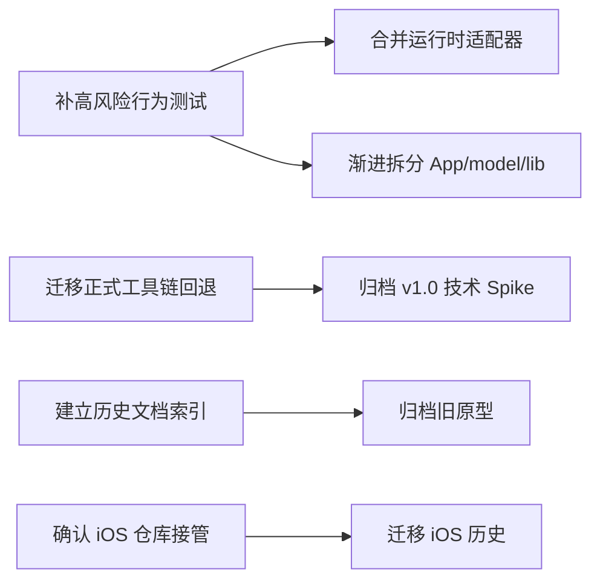

# LetsMakeMoney v1.0.4 瘦身候选

## 目标与边界

本清单的目标是降低当前 Windows v1 项目的理解、验证和维护成本，不追求单纯减少文件数。本轮没有删除、移动或取消跟踪任何项目文件。

候选判断至少结合了调用、脚本依赖、文档引用、历史版本作用和测试保护。一次文本搜索不足以判定可删除。

## 当前规模

| 路径 | 跟踪文件数 | 当前职责 |
| --- | ---: | --- |
| `doc/` | 333 | 当前与历史产品、开发、验收、原型和用户文档 |
| `apps/` | 82 | Windows v1 React/Tauri/Rust 产品实现 |
| `spikes/` | 46 | v1.0 技术栈选择与 UI 验证样例 |
| `scripts/` | 28 | v1.0-v1.0.3 构建、验证和打包入口 |
| `shared/` | 16 | 共享版本与日历等合同 |
| `assets/` | 5 | README 等公共素材 |
| `releases/` | 5 | 小型历史发布说明 |

## 候选清单

| ID | 文件或符号 | 当前作用 | 调用者或引用 | 删除/合并证据 | 收益 | 风险 | 验证方法 | 建议 |
| --- | --- | --- | --- | --- | --- | --- | --- | --- |
| V104-SLIM-001 | 三处 `isTauri()` | 判断桌面运行时 | `model.ts`、`configModel.ts`、`theme.ts` | 实现语义重复 | 降低运行时判断漂移 | 低；错误合并会影响浏览器原型与 Tauri | 浏览器和 Tauri 双模式测试 | 需要补测试后合并 |
| V104-SLIM-002 | `model.ts` 浏览器 fallback 计算 | 支持非 Tauri 预览和测试 | Dashboard、Calendar、主题和配置 | 与 Rust 权威计算存在部分重复，未见跨实现 fixture | 降低双实现维护成本 | 高；直接删除会破坏浏览器原型和部分测试 | 先盘点调用并建立 Rust/TS parity fixture | 技术 Spike |
| V104-SLIM-003 | `App.tsx` 1380 行 | 所有窗口和主要页面 | 应用入口 | 多个窗口、页面、对话框和设置面板共处一文件 | 降低界面改动理解成本 | 中高；拆分可能影响状态闭包与窗口行为 | 组件 characterization tests、视觉回归、真实窗口冒烟 | 需要补测试后分阶段拆分 |
| V104-SLIM-004 | `model.ts` 1029 行 | Dashboard、日历、时间边界、格式化 | Mini、Workbench、Calendar | 生命周期、请求、fallback 和呈现选择器集中 | 降低状态漂移和并发理解成本 | 高；这是收入显示关键链路 | 先锁定 snapshot、时间跳变和窗口生命周期行为 | 需要补测试后分阶段拆分 |
| V104-SLIM-005 | `src-tauri/src/lib.rs` 1327 行 | IPC、窗口、托盘和 WebView2 | Tauri 入口 | 原生能力边界集中，但职责可识别 | 降低 Windows 能力维护成本 | 高；窗口策略回归影响发布 | Rust 单元/集成测试加真实托盘与窗口冒烟 | 暂不直接拆分 |
| V104-SLIM-006 | `spikes/v1.0-ui/` | 技术选型证据、工具链缓存回退 | v1.0 文档、`v10_tools.ps1`、部分打包脚本 | 不只是历史样例，仍被正式脚本引用 | 解除主仓库技术债和本地缓存依赖 | 中；直接归档会破坏本地构建 | 先迁移工具链解析和依赖缓存策略，再跑全量门禁 | 需迁移后归档 |
| V104-SLIM-007 | `doc/prototypes/v0.9-polished/` | v0.9 桌宠原型、动画合同和 Figma 插件 | v0.9 文档、历史设计说明 | v1 主线不再使用宠物，但历史设计仍可追溯 | 降低当前原型搜索噪音 | 中；删除会造成历史文档断链 | 建立历史索引、重写链接并从 tag 验证可恢复 | 继续验证后归档 |
| V104-SLIM-008 | `doc/prototypes/ios-v0.1/` 与 iOS 文档 | iOS 产品原型与历史规划 | iOS 文档、部分跨平台说明 | 已有独立 iOS 仓库，但是否完整接管待确认 | 明确 Windows/iOS 仓库边界 | 中；可能丢失唯一历史资料 | 对比独立仓库文件与 Git 历史，确认所有者 | 待确认后迁移 |
| V104-SLIM-009 | v1.0-v1.0.3 多代验证脚本 | 各版本回归与发布身份检查 | 聚合验证、CI、历史复验 | 脚本有重复，但承担版本化合同 | 统一工具入口、减少修补重复 | 高；合并会削弱历史包复验 | 建立参数化 runner，同时保留版本 fixture | 暂不处理 |
| V104-SLIM-010 | `doc/user-guide/v1.0/` 截图与说明 | 用户手册和真实操作证据 | README/用户文档 | 当前版本已到 v1.0.3，但手册仍是 v1.0 | 降低误用旧说明 | 中；仍是唯一完整用户手册 | 标记适用版本并抽查当前 UI 差异 | 必须保留，后续更新 |
| V104-SLIM-011 | 历史 release 文档和 bugfix log | 版本决策与验收追溯 | Review、回滚、发布核对 | 不是当前事实源，但具备审计价值 | 删除收益很低 | 高；破坏历史事实链 | 不适用 | 必须保留 |
| V104-SLIM-012 | 本地 agent/feature/release 分支 | 本机历史工作入口 | 仅本地 Git | 远端已只保留目标分支 | 降低误操作和分支列表噪音 | 中；可能含未合入提交 | 逐分支检查 merge-base、唯一提交和 worktree | 可直接清理，但需先核对 |

## 分类结论

### 可直接清理

- 当前跟踪树中没有仅凭现有证据即可直接删除的项目文件。
- 本地 stale branches 可以成为直接清理对象，但必须先核对唯一提交和 worktree 占用。
- `node_modules`、`dist` 等忽略缓存不属于仓库内容，可按需重建，不应纳入 Git。

### 需要先补测试

- `isTauri()` 重复实现。
- `App.tsx`、`model.ts` 的渐进拆分。
- `lib.rs` 的原生边界拆分。
- 版本验证脚本的参数化合并。

### 需要技术 Spike

- 浏览器 fallback 是否保留、收敛或替换。
- `spikes/v1.0-ui/` 的工具链依赖迁出。
- GUI/Tauri/WebView2 测试层的最小选型。

### 必须保留

- Rust 领域与配置兼容逻辑。
- v1.0-v1.0.3 发布、验收和 bugfix 历史。
- 当前唯一完整的用户手册，直到有新版本替代。
- calendar-data、许可、BUILD-INFO 和发布包验证合同。

### 暂不处理

- 大规模合并历史版本脚本。
- 仅因文件行数较高而整体重写 React、Rust 或 CSS。
- 在未确认 iOS 仓库接管前迁移 iOS 历史。
- 在未解除正式脚本依赖前归档技术 Spike。

## 推荐执行顺序

优先执行测试与工具链边界，再处理代码和历史资产。这样可以避免为了目录整洁削弱回归能力。
