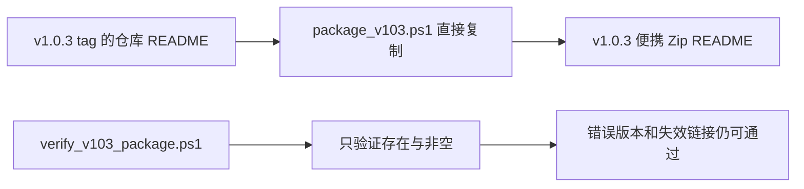

# LetsMakeMoney v1.0.3 发布后差距

## 目的

本文记录 v1.0.3 已发布程序、发布包说明、验收证据和复现门禁之间的实际差距。它不改变 v1.0.3 Stable 的发布结论，也不是 v1.0.4 PRD。

## 发布对象

| 项目 | 值 |
| --- | --- |
| GitHub Release | v1.0.3 Stable |
| tag commit | `87f6766a33fd6ff284f0fb3a42dc18c5a7292bf4` |
| Zip | `LetsMakeMoney-v1.0.3-windows-x86_64.zip` |
| Zip SHA-256 | `259CAE23D785FC7712CAC0EFD42991C8EE210C0BCEA1EB5C07FC171DFB993B28` |
| Zip 大小 | 3,204,791 字节 |
| EXE SHA-256 | `41BB11FCBC95C3789AD283D0F85E67DB0E17D4BC769B133B317FDB1804607237` |
| BUILD-INFO | 版本 1.0.3、source commit 为 tag commit、dirty 为 false |

## 实际运行观察

本轮从 GitHub Release 下载并解压到全新临时目录，只运行解压目录中的 EXE。实际观察：

- Mini 正常显示“今日工作已结束”、当天金额和 100% 进度。
- 单击 Mini 能打开 Workbench。
- 今日页显示当天收入、月累计、工作日数和 08:00/12:00/14:00/18:00 时间线。
- 日历页显示 2026 年 7 月官方数据、工作日/休息日图例和月份导航。
- Settings 可打开收入与作息、日历、外观、窗口与启动、数据与支持五个页签。

该观察证明发布包基本可运行，不替代原 v1.0.3 最终验收，也没有重新验证系统睡眠、时间跳变、真实托盘左键或两小时运行。

## GAP-001 发布包 README

### 现象

发布 Zip 内的 `README.md` 来自 v1.0.3 tag，但内容仍以 v1.0.2 为当前版本：

- 版本说明仍写 v1.0.2。
- 构建产物路径仍指向 `releases/v1.0.2`。
- 文档结构仍指向 v1.0.2。
- README 引用 `assets/readme/` 和 `doc/`，但便携包没有包含这些目录。

### 根因链

### 影响

- 不影响 EXE 运行。
- 影响用户确认版本、查找帮助和理解构建来源。
- 使发布包的文档身份弱于 BUILD-INFO 和哈希身份。

### 建议

v1.0.4 建立包内专用 README，至少包含版本、平台、启动方式、数据目录、许可、哈希核对和在线文档链接。包体验证应检查：

1. 当前版本字符串唯一且准确。
2. 不存在包内不可达的相对图片或文档链接。
3. BUILD-INFO、README 和文件名版本一致。
4. 文档使用 UTF-8 且无空内容。

## GAP-002 验收证据不可持续

### 现象

v1.0.3 文档仍引用：

- `.tmp_acceptance/v1.0.3-final-20260730-014452/`
- `.tmp_acceptance/v1.0.3-release-20260730-181127/`

这两个目录当前均不存在，且 `.tmp_acceptance` 被 Git 忽略。当前只剩：

- `.tmp_acceptance/v1.0.3-reconstructed-20260730-192654/`

重构证据说明原始目录曾意外丢失，并只重建了包身份、自动门禁和部分 GUI 冒烟；睡眠、系统时间、时区、真实托盘左键和 7201 秒样本的原始证据没有被重建。

### 正确表述

- v1.0.3 的历史验收结论保持“通过”。
- 原始系统级证据当前不可独立访问。
- 后建重构证据不能冒充原始验收证据。
- 这是证据治理缺口，不是本轮新发现的产品失败。

### 建议

v1.0.4 建立两层证据：

| 层级 | 是否跟踪 | 内容 |
| --- | --- | --- |
| 永久摘要 | 是 | 候选身份、哈希、环境、结论、时间、证据 SHA-256、脱敏日志片段 |
| 原始大文件 | 视策略而定 | 截图、录屏、资源曲线和完整日志，可放外部存储或受控归档 |

文档链接必须能区分“仓库内证据”“外部证据”“本机临时证据”和“证据已不可用”。

## GAP-003 自动测试层级

### 已有能力

- Rust 领域测试覆盖收入、工作日、跨夜 owner date、带薪/不带薪和日期调整。
- TypeScript 行为测试覆盖日历加载、权威同步和窗口生命周期等纯逻辑。
- CI 在当前 HEAD 通过。
- v1.0.3 曾完成真实 GUI 与系统级人工验收。

### 缺口

若干 Python 验证器主要读取源码并检查 token、函数顺序或文案存在。例如 WebView2 suspend 合同可以确认代码结构，但不能执行：

- 托盘隐藏后 timer 是否真的停止。
- 恢复后是否只注册一组 timer。
- Tauri event 是否到达正确 WebView。
- React 错误、loading 和恢复状态是否正确渲染。
- IPC 失败是否保留上一份有效快照。

### 建议

不需要引入全面端到端测试。优先补四组高风险行为：

1. hidden/shown 事件与 timer 生命周期。
2. 配置保存成功、无变化、失败与旧值保护。
3. Dashboard 权威快照失败后保留最后有效状态。
4. 打包后启动、窗口找回和版本身份的轻量桌面冒烟。

## GAP-004 本地复现合同

README 当前声明 Node.js 和 Rust，但完整验证还依赖 Python。部分脚本使用统一 `Get-V10Python`，部分仍直接调用 `python`。Rust 使用 `stable` 通道，没有仓库级 toolchain 文件。

当前 HEAD 的远端 CI 已通过，因此本项不是构建失败；它表示外部贡献者和新机器更容易遇到环境差异。

v1.0.4 应明确：

- Node、pnpm/npm、Python、Rust、MSVC/Windows SDK 和 WebView2 的要求。
- 推荐版本与最低版本。
- 离线或缓存路径。
- 统一的 Python 和 Cargo 解析方式。
- 是否引入 `rust-toolchain.toml`。

## 发布判断

- v1.0.3 程序：保持已发布。
- v1.0.3 Zip：可继续下载，存在已确认的说明快照差异。
- v1.0.3 tag 与哈希：不得修改。
- v1.0.4：应关闭包内说明、证据耐久性和高风险行为测试三项核心缺口后再发布。
