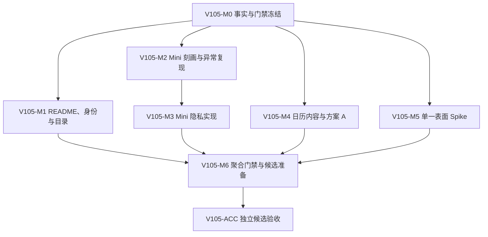

入口判断：/prd（开发承接）

# LetsMakeMoney Windows v1.0.5 开发计划

## 追踪信息

- 当前状态：V105-M0 至 V105-M3 已完成；等待 V105-M4 确认
- 目标版本：Windows v1.0.5 Stable
- 上游来源：`doc/releases/v1.0.5/prd.md`
- 需求追踪：`doc/releases/v1.0.5/traceability.md`
- 下游承接：`doc/releases/v1.0.5/progress_v1.0.5.md`、独立 `/acceptance`
- 对应开发日志：`doc/logs/dev_log_v1.0.5.md`
- 高保真原型：`doc/prototypes/v1.0/index.html`
- 代码开发基线：`main` / `8a63da7836fb24c3b7f8ff12f896ac40571adeb7`
- 当前公开版本：Windows v1.0.4 Stable
- GitHub 正式 v1.0.4 Zip SHA256：`C4F28892831891A4266C4D9B12D432CD5C970BB3C9B36A6B8DB21FA2566DE50E`
- 当前事实源：PRD 定义需求；本文定义实施顺序；progress 定义实时状态
- 最后更新：2026-07-31

## 1. 开发范围

### 1.1 版本目标

v1.0.5 是“隐私与发布可信度维护 + 限定范围视觉精修”的正式小版本。实施目标是：

1. Mini 首次拖至左右工作区边缘后，无需额外交互即可按合同收起工资信息。
2. 收起态保留 28 逻辑像素非金额隐私竖条，并能通过指针、键盘和托盘可靠找回。
3. 候选包、验收证据、本地正式附件缓存与 GitHub Release 具备不可混淆的身份合同。
4. normal official 日历来源提示退出首屏，风险状态保持明确；“今天”采用已确认的方案 A。
5. Workbench、Settings、Wizard 先经过真实 Tauri 壳 Spike，再决定是否采用单一窗口表面。
6. 对全部变更建立行为、隐私、DPI、窗口和发布身份门禁。

### 1.2 本次包含

| FR | 内容 | 实施性质 |
| --- | --- | --- |
| FR-001 | 公开 README 当前事实收口 | 文档与自动门禁 |
| FR-002 | Candidate / Published Identity 合同 | 发布工程 |
| FR-003 | Mini 首次贴边自动收起 | P0 Bugfix |
| FR-004 | focus / explicit shown 语义分离 | 条件 Bugfix；先复现 |
| FR-005 | 非金额隐私倒计时竖条 | 隐私与体验 |
| FR-006 | 日历 normal official 提示收敛 | 内容呈现 |
| FR-007 | 日历复合导航视觉方案 A | 视觉与可访问性 |
| FR-008 | 三个窗口单一表面校准 | 技术 Spike；允许回退 |
| FR-009 | 高风险发布与体验门禁 | 横切测试治理 |
| FR-010 | 本地证据与产物目录合同 | 目录与证据治理 |

### 1.3 本次不包含

- 不恢复宠物、PetManager 或桌宠入口。
- 不新增账号、云同步、安装器、静默更新、多平台或新收入模式。
- 不改变收入公式、日历数据源、日期调整事务、主题范围和配置 schema。
- 不重写 React 全局状态、Rust/Tauri 主链路、技术栈或完整设计系统。
- 不把 FR-004 在未复现前当作已确认缺陷实施。
- 不因 FR-008 Spike 失败而强行修改窗口表面。
- 不删除本地 dirty v1.0.4 candidate，不修改 v1.0.4 tag、Release、附件或哈希。
- 不批量移动、删除或归档历史脚本、文档、原型和证据。

### 1.4 实施原则

1. 稳定性与工资隐私高于视觉新颖度。
2. 每个里程碑只修改其允许范围；相关测试先于行为修改。
3. Mini 的业务快照、原生几何、交互意图和视觉呈现继续分层，不在组件内重新计算收入。
4. 候选身份验证必须能够拒绝 dirty 源、错误 HEAD、错误版本和错误哈希。
5. 竖条 DOM、可访问性文本和日志均不得出现收入、薪资、进度、带薪或不带薪信息。
6. 方案 A 是 FR-007 唯一实现目标；方案 B 只保留为原型历史。
7. FR-008 通过真实壳门禁才实施；失败时保留 v1.0.4 表面即为正确完成路径。
8. 外部写操作、dirty candidate 删除和发布动作继续等待独立授权。

## 2. PRD 对照

| PRD 需求 | 开发批次 | 验收 | 覆盖方式 |
| --- | --- | --- | --- |
| FR-001 | V105-M1 | V105-ACC-001 | 三 README + docs gate |
| FR-002 | V105-M0、M1、M6 | V105-ACC-002、012 | candidate/published 双模式 |
| FR-003 | V105-M2、M3 | V105-ACC-003、004 | characterization test 后定向修复 |
| FR-004 | V105-M2；条件进入 M3 | V105-ACC-005 | 20 次真实复现决定是否实现 |
| FR-005 | V105-M3 | V105-ACC-006、007 | 状态选择器、28px 竖条、隐私扫描 |
| FR-006 | V105-M4 | V105-ACC-008 | official 静默、风险状态保留 |
| FR-007 | V105-M4 | V105-ACC-009 | 方案 A 与复合状态/ARIA |
| FR-008 | V105-M5 | V105-ACC-010 | 真实 Tauri 壳 Spike 与可回退实装 |
| FR-009 | V105-M0 至 M6 | V105-ACC-011 | 自动、Computer Use、人工三层门禁 |
| FR-010 | V105-M1 | V105-ACC-002 | 目录 schema、唯一证据保护、只读处置记录 |

## 3. 文件与模块影响

| 模块 / 文件 | 计划改动 | 边界 |
| --- | --- | --- |
| `README.md`、`README.en.md`、`apps/windows-v1/README.md` | 当前公开版本、有效命令和下载入口 | 不改历史版本文档结论 |
| `apps/windows-v1/src/features/mini/miniEdgeAutoHide.ts` | 首次贴边、收起资格、timer generation | 不加入收入计算 |
| `apps/windows-v1/src/features/mini/useMiniEdgeAutoHide.ts` | pointer/focus/drag/menu/modal 与原生事件接线 | 不建立新全局状态库 |
| `apps/windows-v1/src/features/mini/MiniWindow.tsx` | 28px 竖条、键盘与 ARIA | 禁止金额和工资制度泄露 |
| `apps/windows-v1/src/hooks/useWindowDrag.ts` | 拖动完成后的真实指针意图与收起触发 | 保留全窗口拖动能力 |
| `apps/windows-v1/src/services/windowService.ts` | 显式 shown source 与窗口事件类型 | 不扩大为通用窗口总线重写 |
| `apps/windows-v1/src/presentation.ts` | 隐私阶段文案与日历复合状态选择器 | 只消费既有领域快照 |
| `apps/windows-v1/src/calendarCoverage.ts`、`calendarState.ts` | official/risk 提示和今天方案 A | 不改日历数据源和优先级 |
| `apps/windows-v1/src/components/WindowFrame.tsx` | 单一表面 Spike 与条件实现 | 仅 Workbench、Settings、Wizard |
| `apps/windows-v1/src/App.tsx` | 日历/窗口呈现最小接线 | 禁止整体拆分或状态重写 |
| `apps/windows-v1/src/styles.css` | 隐私条、日历复合状态、三窗表面 | 浅/深、DPI、reduced motion 同步覆盖 |
| `apps/windows-v1/src-tauri/src/lib.rs`、`platform.rs` | 原生事件来源、Mini 几何与窗口表面 Spike | 不改变收入和配置事务 |
| `apps/windows-v1/tests/` | Mini、焦点、隐私、日历、窗口与身份行为测试 | 优先扩展现有行为测试体系 |
| `scripts/package_v105.ps1` | v1.0.5 唯一候选打包入口 | 隔离输出，禁止覆盖 published cache |
| `scripts/verify_v105.ps1` | 聚合自动门禁 | 继承 v1.0.4 全部有效回归 |
| `scripts/verify_v105_package.ps1` | dirty/HEAD/版本/BUILD-INFO/哈希验证 | candidate 与 published 模式分离 |
| `scripts/verify_v10_docs.ps1` | README 当前事实门禁扩展到 v1.0.5 | 保留历史版本事实源 |
| `doc/releases/v1.0.5/evidence/` | 脱敏摘要、外部原始证据索引、Spike 结果 | 不保存秘密、收入或完整本机路径 |
| `.gitignore` / 本地目录说明 | candidate/evidence/published cache 所有权 | 不用 ignore 掩盖已跟踪或历史问题 |
| 数据库 | 无改动 | 项目无数据库 |

## 4. 核心实施合同

### 4.1 Mini 状态机

布局状态：`floating | docked_left | docked_right`。

呈现状态：`expanded | retract_pending | retracted_tab | revealing | fallback_expanded`。

交互锁：`dragging | pointer_inside | focus_inside | menu_open | modal_open`。

- 拖动完成后必须以释放时真实指针意图重新计算 `pointer_inside`，不能继承拖动前旧值。
- `docked + auto_hide=true + 无交互锁` 才能进入 `retract_pending`。
- 单一 600ms timer 触发收起；180ms 视觉过渡只影响呈现，不改变业务状态。
- 晚到 timer、异步窗口事件和旧 generation 不得覆盖新状态。
- 原生几何失败、显示器失效或窗口不可见时进入 `fallback_expanded`，保证完整窗口可找回。

### 4.2 隐私竖条

- 逻辑宽度固定 28px；左右边缘仅调整阅读方向与圆角，不镜像文字字形。
- 正常工作阶段只显示：距离上班、距离休息、距离复工、距离下班或今日工作结束。
- 普通休息、带薪休息和不带薪休息统一显示“今日休息”。
- loading 显示“正在同步”；error 显示“点击查看”。
- 时间精度最高到分钟；不得显示工资、金额、进度、日薪、时薪、月薪或带薪属性。
- 指针进入、点击、Enter/Space、托盘显式找回立即展开；移开且无锁后重新收起。

### 4.3 focus 与 explicit shown

- `focus` 只表示普通焦点变化，不能默认等同于显式找回。
- 托盘找回、启动恢复、用户点击隐私条和原生显式 show 必须携带可区分 source。
- FR-004 在 M2 完成 20 次“打开并关闭 Workbench”事件链前不得修改生产语义。
- 若 0/20 且没有异常界面证据，任务以“未复现、保留观测”关闭，不得宣称修复。

### 4.4 日历

- normal official 不显示常驻来源块；estimated、stale、loading、error 保持明确状态区。
- 业务状态、导航状态与交互状态分层组合。
- 今天采用方案 A：单元格左上“今”角标 + 日期数字加粗。
- 当前选中日期继续使用整格边框；工作/休息/手动调整底色或标记不得被今天覆盖。
- hover、focus-visible、disabled 和 stale 必须具备非颜色线索和正确 ARIA。

### 4.5 单一窗口表面 Spike

- 目标窗口仅限 Workbench、Settings、Wizard。
- 对照 v1.0.4 基线与单一表面候选，验证透明根、圆角、阴影、拖动、关闭、浅/深主题及 100/125/150% DPI。
- Spike 结果必须写入独立证据；浏览器原型通过不能替代真实 Tauri 壳。
- 任一关键门禁失败则撤销候选实现并保留 v1.0.4 表面，其他 FR 可继续。

### 4.6 发布身份与目录

- `candidate`：允许验收但必须记录 source HEAD、dirty 状态、构建时间、文件大小和 SHA256。
- `published cache`：只能由 GitHub Release 回下载产生，必须记录 tag、URL、下载时间和远端哈希。
- 验收证据：仓库内仅存脱敏摘要；原始截图、录屏和完整日志使用外部索引并声明可用状态。
- 本地 dirty v1.0.4 candidate 只登记，不删除；删除需项目所有者另行授权。

## 5. 依赖与实施顺序

实施顺序：

1. V105-M0 必须先完成，冻结发布对象、PRD 决策、测试缺口和证据新鲜度。
2. M1、M2、M4、M5 在 M0 后可按文件所有权并行，但默认一轮只执行一个里程碑。
3. M3 必须继承 M2 的 characterization tests 和 FR-004 复现结论。
4. M5 的“回退到 v1.0.4 表面”是允许的正式完成结果。
5. M6 只聚合已经关闭的实现和条件项，不把未复现问题伪装为修复。
6. ACC 只接收从干净提交重新构建的唯一候选。

## 6. 里程碑与最小任务

### V105-M0 事实、决策与门禁冻结（8 项）

- [x] `V105-M0-001` 记录分支、HEAD、工作树、remote、tag 与 v1.0.4 GitHub 正式对象身份。
- [x] `V105-M0-002` 记录本地 dirty v1.0.4 candidate 的路径、大小、SHA256、BUILD-INFO 与处置状态，不删除。
- [x] `V105-M0-003` 固化 PRD 确认、日历方案 A 和 FR-008 Spike 回退决策。
- [x] `V105-M0-004` 映射 FR-001 至 FR-010 的现有实现、测试和缺口。
- [x] `V105-M0-005` 冻结 Mini v1.0.4 状态、事件、timer、几何和配置兼容基线。
- [x] `V105-M0-006` 建立 FR-004 20 次真实复现表、窗口标签和事件来源采集合同。
- [x] `V105-M0-007` 建立浅/深、100/125/150% DPI、左右边缘与多显示器证据矩阵。
- [x] `V105-M0-008` 建立 v1.0.5 聚合验证骨架与继承证据失效条件。

完成标准：事实身份无歧义；条件项、回退项和发布阻塞面可独立判定；未修改用户可见行为。

完成证据：`m0-baseline.md`、`fr004-reproduction-contract.md`、`evidence-matrix.md`、`verification.md` 与 `evidence/m0-baseline.json`；聚合门禁通过，业务代码差异为 0。下一批仅在确认后进入 V105-M1。

### V105-M1 README、发布身份与目录合同（8 项）

- [x] `V105-M1-001` 同步根中英文 README 与应用 README 的公开版本和有效命令。
- [x] `V105-M1-002` 扩展 docs gate，拒绝旧版本、旧脚本、失效 Release 链接和乱码。
- [x] `V105-M1-003` 定义 candidate、acceptance evidence、published cache 的目录与命名合同。
- [x] `V105-M1-004` 扩展 BUILD-INFO，锁定 source HEAD、dirty 状态、版本、构建时间与文件哈希。
- [x] `V105-M1-005` 实现 candidate 模式验证及 dirty、错误 HEAD、错误版本负向测试。
- [x] `V105-M1-006` 实现 published 模式验证及 tag、远端 URL、回下载 SHA 负向测试。
- [x] `V105-M1-007` 建立仓库脱敏摘要、外部原始证据索引和唯一副本保护规则。
- [x] `V105-M1-008` 记录 dirty v1.0.4 candidate 的未来删除前置条件，不执行清理。

完成标准：三个 README 当前事实一致；同名 Zip 无法仅凭内部自洽被认作正式附件；目录与证据合同可自动验证。

完成证据：`artifact-and-evidence-contract.md`、`evidence/m1-contract.json`、四份 v105 schema、candidate/published 双模式验证器及合成包负向夹具；M1 聚合门禁通过，业务代码差异为 0，未构建或打包，dirty v1.0.4 candidate 保持原位。

### V105-M2 Mini 行为刻画与条件异常复现（10 项）

- [x] `V105-M2-001` 建立拖动前后 pointer/focus/drag/menu/modal 状态夹具。
- [x] `V105-M2-002` 增加“拖到边缘但没有 pointerleave”失败刻画测试。
- [x] `V105-M2-003` 增加左右边缘首次收起、取消、拖回与晚到 timer 测试。
- [x] `V105-M2-004` 增加托盘显式找回、普通 focus 和原生 shown source 组合测试。
- [x] `V105-M2-005` 在隔离候选运行 20 次 Workbench 打开/关闭复现并记录窗口标签。
- [x] `V105-M2-006` 采集 focus、blur、shown、hidden、reveal 和 native source 脱敏时间线。
- [x] `V105-M2-007` 判断 V105-BUG-001 根因并锁定最小修复边界。
- [x] `V105-M2-008` 判断 FR-004 是否进入 M3；20/20 复现，进入最小修复。
- [x] `V105-M2-009` 证明 v1.0.4 托盘找回、位置持久化和配置事务基线未变化。
- [x] `V105-M2-010` 更新 progress、verification 入口和 dev log，不写入排查流水到 progress。

完成标准：FR-003 有可复现失败测试；FR-004 有真实证据结论；后续实现不依赖猜测。

完成证据：8 状态交互夹具、左右边缘 characterization、预期红灯目标测试、20/20 Workbench 关闭复现、脱敏事件摘要和用户环境恢复记录。FR-003 与 FR-004 均已确认但未修复，最小修复范围转交 V105-M3；业务代码差异保持为 0。

### V105-M3 Mini 首次收起与隐私竖条（10 项）

- [x] `V105-M3-001` 修正拖动完成后的真实 pointer intent 和收起资格计算。
- [x] `V105-M3-002` 实现 generation/token 安全的单 timer 状态机。
- [x] `V105-M3-003` 保持原生几何、正常位置和物理收起位置分离。
- [x] `V105-M3-004` 实现 28px 左右隐私竖条与浅色/深色样式。
- [x] `V105-M3-005` 实现全业务状态的非金额文案选择器和分钟精度。
- [x] `V105-M3-006` 接入 hover、点击、Enter/Space、托盘找回和移开收回。
- [x] `V105-M3-007` 接入 drag、focus、menu、modal 交互锁和 reduced motion。
- [x] `V105-M3-008` 若 M2 证实 FR-004，仅实施证据支持的 focus/shown 最小修复。
- [x] `V105-M3-009` 增加 DOM、ARIA、日志的收入与工资制度泄露负向扫描。
- [x] `V105-M3-010` 通过 TS、Rust、配置兼容、左右几何和状态机定向测试。

完成标准：首次贴边无需额外点击即收起；竖条零收入泄露且始终可找回；失败安全回到完整窗口。

完成证据：Mini 状态机 `37/37`、隐私文案选择器 `10/10`、Rust `54/54` 通过；TypeScript strict、Vite build、clippy、fmt、架构与隐私扫描通过。受控候选 `V105-M3-20260801-015617` 的真实 Windows 定向验证覆盖左右首次收起、指针与点击找回、移开收回、普通焦点及关闭 Workbench 回归；键盘、通知区显式找回、深色主题、故障回退与多显示器由独立 ACC 继续补证。

### V105-M4 日历内容与复合导航方案 A（8 项）

- [ ] `V105-M4-001` normal official 状态移除常驻来源块并保持布局稳定。
- [ ] `V105-M4-002` 保留 estimated、stale、loading、error 的完整状态、重试和 ARIA。
- [ ] `V105-M4-003` 实现方案 A 的左上“今”角标与日期数字加粗。
- [ ] `V105-M4-004` 分离业务状态、选中状态、今天状态和交互状态映射。
- [ ] `V105-M4-005` 覆盖手动工作日、带薪休息、不带薪休息、普通工作/休息叠加。
- [ ] `V105-M4-006` 覆盖 hover、focus-visible、disabled、stale 与键盘导航。
- [ ] `V105-M4-007` 完成浅/深、长内容和 100/125/150% DPI 行为测试。
- [ ] `V105-M4-008` 对照原型与真实界面完成 Computer Use 定向复验。

完成标准：正常官方态安静；风险态不弱化；今天、选中与业务状态可同时辨认且不只依赖颜色。

### V105-M5 三窗单一表面真实壳 Spike（8 项）

- [ ] `V105-M5-001` 锁定 Workbench、Settings、Wizard v1.0.4 四角、阴影、拖动和 DPI 基线。
- [ ] `V105-M5-002` 建立单一表面最小候选，不改变窗口尺寸、内容结构或功能。
- [ ] `V105-M5-003` 在真实 Tauri 壳验证透明根、圆角、阴影和边框职责。
- [ ] `V105-M5-004` 验证三窗拖动、关闭、焦点、模态和托盘找回。
- [ ] `V105-M5-005` 验证浅色/深色与 100/125/150% DPI，无裁切和模糊。
- [ ] `V105-M5-006` 验证 Windows 10/11 能力边界；环境不足时标记待补证。
- [ ] `V105-M5-007` 给出通过或失败结论；失败时撤销候选并保留 v1.0.4 表面。
- [ ] `V105-M5-008` 将 Spike 结果、截图索引、回退结论和失效条件写入证据摘要。

完成标准：Spike 通过才保留单一表面改动；失败回退且无残留同样视为里程碑完成。

### V105-M6 聚合门禁与候选准备（10 项）

- [ ] `V105-M6-001` 统一应用、npm、Cargo、README 和 BUILD-INFO 的 1.0.5 身份。
- [ ] `V105-M6-002` 建立 `verify_v105.ps1` 并继承 v1.0.4 全部有效回归。
- [ ] `V105-M6-003` 建立 `package_v105.ps1` 的隔离候选输出与事务式替换。
- [ ] `V105-M6-004` 建立 `verify_v105_package.ps1` 的 candidate/published 双模式。
- [ ] `V105-M6-005` 聚合 README、Mini、日历、窗口表面和目录合同测试。
- [ ] `V105-M6-006` 运行 TypeScript strict、行为测试与 Vite production build。
- [ ] `V105-M6-007` 运行 cargo test、fmt、clippy 与 release build。
- [ ] `V105-M6-008` 运行 UTF-8、乱码、链接、敏感路径、隐私文本与 `git diff --check`。
- [ ] `V105-M6-009` 从干净提交构建唯一候选并锁定 Zip、EXE、WebView2Loader 与 README 哈希。
- [ ] `V105-M6-010` 更新 verification、manual verification、release checklist 与 release notes 的候选身份。

完成标准：唯一候选来自干净提交，全部自动门禁通过；没有把未执行 GUI 项写成通过。

### V105-ACC 独立候选验收与状态收口（12 项）

- [ ] `V105-ACC-001` 核对分支、HEAD、dirty 状态、Zip/EXE/DLL/README/BUILD-INFO 哈希。
- [ ] `V105-ACC-002` 新目录解压并仅运行候选 EXE，备份与恢复用户环境。
- [ ] `V105-ACC-003` 真实验证左右边缘首次收起、延迟、hover、点击、键盘和拖回。
- [ ] `V105-ACC-004` 真实验证全部阶段隐私竖条、浅/深主题和零收入泄露。
- [ ] `V105-ACC-005` 复核 Workbench 关闭事件结论及托盘显式找回不回归。
- [ ] `V105-ACC-006` 验证 official/risk 日历状态与方案 A 复合日期状态。
- [ ] `V105-ACC-007` 验证三窗表面最终采用或回退结果及 100/125/150% DPI。
- [ ] `V105-ACC-008` 回归收入、日历、日期调整、Settings、Wizard、主题、托盘与更新检查。
- [ ] `V105-ACC-009` 完成多显示器硬件补证，或由项目所有者明确记录延期且不得写成通过。
- [ ] `V105-ACC-010` 验证脱敏证据摘要、外部原始证据索引和环境恢复。
- [ ] `V105-ACC-011` 更新 progress、verification、manual verification、current 和 release checklist。
- [ ] `V105-ACC-012` 给出发布收口判断并停止，不执行 commit、push、tag 或 Release。

完成标准：无发布阻塞；待补证/暂不验证项准确记录；候选身份和用户环境恢复闭合。

## 7. 测试与验收计划

### 7.1 自动化

- TypeScript：Mini 状态机、timer generation、事件来源、隐私文案、日历状态与 README/身份合同。
- Rust：work-area、DPI、左右收起/恢复、显示器回落、原生窗口事件 source。
- 组合行为：隐藏/显示、拖动/focus、菜单/modal、配置跨窗口、托盘找回。
- 发布工程：dirty、错误 HEAD、错误 tag、错误 SHA、错误 BUILD-INFO、published cache 来源负向测试。
- 静态门禁：TypeScript strict、Vite build、cargo test/fmt/clippy、UTF-8、乱码、链接、隐私扫描、`git diff --check`。

### 7.2 Computer Use

- 新解压候选的 Mini、Workbench、Settings、Wizard、日历和托盘完整操作。
- 左右边缘首次收起、隐私竖条、键盘找回、拖回解除停靠。
- 浅色/深色、100%/125%/150% DPI、长金额和错误状态。
- 三窗单一表面四角、边框、阴影、拖动与关闭。

### 7.3 人工补证

- Windows 通知区真实鼠标输入。
- 真实多显示器、负坐标工作区和显示器移除回落。
- Windows 10/11 差异；当前环境不具备时不得冒充通过。
- 项目所有者对单一表面最终观感签核。

### 7.4 发布回归

- v1.0.4 收入、日历、日期调整、跨夜、主题、配置事务和更新检查行为保持。
- Mini 关闭自动隐藏后完整显示，重启持久化不变。
- FR-008 回退路径必须与 v1.0.4 窗口表面等价。

## 8. 开发日志约定

- 使用 `doc/logs/dev_log_v1.0.5.md` 记录实施过程、技术取舍、异常、Spike 结果和验证。
- progress 只记录 checklist、状态、阻塞、最近验证与证据入口。
- 已确认缺陷的复现、根因、修复和定向复验进入 `doc/logs/v1.0.5-bugfix-log.md`；首次发现时再创建。
- FR-008 的详细试验过程可进入 `doc/releases/v1.0.5/window-surface-spike.md`，progress 只引用结论。

## 9. 风险与回退

| 风险 | 影响 | 回退 / 处理 |
| --- | --- | --- |
| 释放指针仍在窗口内导致收起/展开循环 | 隐私功能抖动 | 真实 pointer intent、单 timer generation、失败回到完整窗口 |
| 竖条泄露收入或工资制度 | 隐私与信任损害 | 统一休息文案、禁用词扫描、DOM/ARIA/日志三层门禁 |
| focus 拆分破坏托盘找回 | 用户无法恢复窗口 | FR-004 先复现；explicit source 独立；通知区真实回归 |
| 方案 A 覆盖日期业务状态 | 日历误读 | 三层状态映射、复合 fixture、非颜色表达与 ARIA |
| 单一表面在真实壳裁切 | 窗口质感下降或功能损坏 | Spike 失败即撤销，保留 v1.0.4 表面 |
| 同名 Zip 再次混淆 | 验收或发布对象错误 | 双模式 verifier、目录隔离、回下载 SHA |
| 唯一原始证据被清理 | 历史不可复核 | 先索引与唯一副本保护；删除始终独立授权 |

## 10. 开放问题与授权

- PRD、方案 A 和 FR-008 回退边界已确认，无开发承接阻塞。
- FR-004 是否实施由 V105-M2 的 20 次复现证据决定，不需要项目所有者猜测。
- v1.0.4 dirty candidate 的删除仍未授权；所有里程碑均不得执行。
- 真实多显示器证据若环境仍不具备，需在 ACC 由项目所有者明确决定补证或延期。
- 本计划不授权 commit、push、tag、GitHub Release 或修改既有 Release。

## 11. 实施启动门禁

开始 V105-M0 前必须：

1. 读取 `prd.md`、本文、`progress_v1.0.5.md` 与 `doc/logs/dev_log_v1.0.5.md`。
2. 核对项目路径、分支、HEAD、工作树和 v1.0.4 正式 Release 身份。
3. 说明本轮只执行指定里程碑和任务 ID，不重写 PRD。
4. 不覆盖或撤销来源不明的现有修改。
5. 完成后更新 progress；实施过程写入 dev log；缺陷写入 bugfix log。
6. 运行该里程碑规定的最小验证，并在停止点等待下一批确认。
