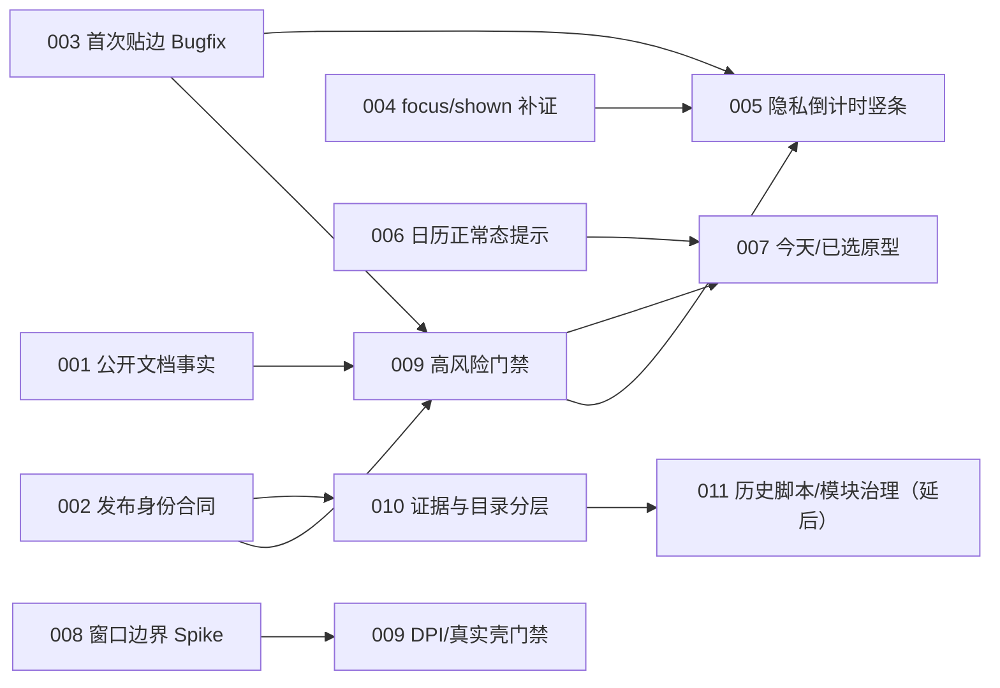

入口判断：/idea

# LetsMakeMoney Windows v1.0.5 候选需求池

## 追踪信息

- 当前状态：Idea 推荐方案与完整 PRD 已由项目所有者确认；开发承接文档已建立，实施未开始。
- 目标版本：Windows v1.0.5。
- 当前公开版本：Windows v1.0.4 Stable。
- 当前分支 / HEAD：`main` / `8a63da7836fb24c3b7f8ff12f896ac40571adeb7`。
- 上游来源：`review.md`、`issue-pool.md`、`slimming-candidates.md`、项目所有者真实发布包反馈与当前代码/测试/发布身份。
- 当前事实源：`doc/current.md` 与 `doc/releases/v1.0.4/`；本文件只负责候选价值和范围判断。
- 下游承接：`dev_plan_v1.0.5.md`、`progress_v1.0.5.md` 与 `doc/logs/dev_log_v1.0.5.md`；首批只执行 V105-M0。
- 最后更新：2026-07-31。

## Idea 阶段判断

v1.0.5 有必要继续，但不适合被定义为一次“大而全的视觉升级”。当前最强证据集中在三条可信链：

1. **公开事实可信链**：三个 README 仍以 v1.0.3 为当前版本，属于已确认事实错误。
2. **发布对象可信链**：本地同名 v1.0.4 Zip 与 GitHub 正式附件身份不同，而现有包验只能证明包内自洽。
3. **Mini 隐私可信链**：首次贴边不及时收起与代码中的 `pointerInside` 资格条件吻合，影响工资信息的隐私承诺。

日历正常态提示、今天标记和窗口“框中框”也是真实体验候选，但其中只有正常态提示和窗口边界有直接实现/截图证据；“今天应该长什么样”仍属于方案选择，不能仅凭观感直接进入开发。

**推荐版本主线：把 v1.0.5 定位为“隐私与发布可信度维护 + 限定范围视觉精修”的正式小版本。** 先关闭 P0，再将隐私竖条、日历和窗口边界作为有原型/实机门禁的 P1；不夹带全量设计系统、主状态管理、历史脚本或桌宠恢复重构。

项目所有者已确认采用推荐方案：v1.0.5 定位为正式小版本；纳入非金额隐私倒计时竖条；允许后续在保留身份摘要后处置本地 dirty candidate；窗口质感限定在 Workbench、Settings、Wizard；桌宠继续留在独立版本讨论。关闭 Workbench 后的异常界面身份仍未知，因此只作为条件需求进入 PRD，复现关闭前不得实现。完整 PRD 已确认，今天标记采用方案 A，窗口单层表面 Spike 允许失败后保留 v1.0.4 实现；开发承接已完成，业务实施尚未开始。

## 上游证据摘要

### 证据映射

| 来源证据 | 对应候选 | 证据等级 | 能推出的结论 | 不能推出的结论 |
| --- | --- | --- | --- | --- |
| `V105-REV-001`、三个 README | V105-IDEA-001、009 | 强 | 公开版本与命令已经过期，门禁存在漏检 | 不能说明应用运行功能有缺陷 |
| `V105-REV-002`、本地/远端 SHA256 与 BUILD-INFO | V105-IDEA-002、009、010 | 强 | 同名本地包不是正式附件，现有包验缺少发布身份层 | 不能说明 GitHub 正式附件被污染或应撤回 |
| 项目所有者真实操作、`dragCompleted()` 与 `eligible()` | V105-IDEA-003 | 中偏强 | `pointerInside` 是高度可能根因，值得优先补定向测试 | 未通过新测试和 GUI 复现前不能宣称根因已确认 |
| 项目所有者真实操作、`handleShown()` 同时监听 focus/shown | V105-IDEA-004 | 中 | sibling 关闭后的焦点转移可能触发展开 | 尚不能确认用户看到的是 Mini、隐私入口还是托盘菜单 |
| v1.0.4 已有 20px 恢复标签、项目所有者明确诉求 | V105-IDEA-005 | 中偏强 | 可在现有能力上验证非金额倒计时标签 | 不能证明所有状态文案都低敏感、可读且不误导 |
| 截图、`CalendarCoverageNotice`、日历 CSS | V105-IDEA-006、007 | 006 中偏强；007 弱 | normal official 块确实常驻；今天与选中使用两种轮廓 | 不能凭单次观感确定最佳今天标记方案 |
| 截图、透明根容器、`WindowFrame` 与 CSS | V105-IDEA-008 | 中偏强 | 双层边界观感存在，调整会触及透明裁切和 DPI | 不能证明只改某个 CSS 属性就能生产级解决 |
| 现有行为测试、docs gate、版本化脚本 | V105-IDEA-009、010、011 | 强 | 两条 Mini 组合场景和 README 身份断言缺失；历史脚本不可贸然删除 | 不能据此要求整体模块或脚本重写 |

### 数据证据包

- 决策问题：哪些问题真实、值得在 v1.0.5 处理，哪些只应继续验证或延后。
- 数据来源：项目所有者对 v1.0.4 Stable 的真实操作与截图；2026-07-31 当前代码、测试、发布文档、BUILD-INFO 和 SHA256。
- 统计对象与粒度：单个产品所有者、单台真实 Windows 环境、当前发布包与当前 Git 树；不是用户群体统计。
- 时间范围与新鲜度：证据均来自 v1.0.4 发布后，当前 HEAD 未发生业务源码变化，证据对本轮判断仍新鲜。
- 数据质量：发布身份、README 和代码证据可重复核对；两条 Mini 异常缺新鲜事件日志和稳定复现次数；视觉证据主要是所有者截图与自用反馈。
- 关键发现：P0 的真实性较高；P1 的用户价值成立，但视觉实现方案尚未关闭。
- 反证 / 替代解释：首次贴边也可能受原生窗口事件时序影响；关闭 Workbench 后的界面可能不是 Mini；“今天”圆环本身满足非颜色表达，只是与选中状态观感冲突。
- 当前证据不能推出：不能推断所有外部用户都频繁遇到；不能证明恢复标签能提高普遍留存；不能证明整体设计系统需要重写。
- 对价值与时机的影响：P0 适合现在关闭；P1 适合限定范围验证；P2 不应挤占本版。

## 候选需求池

### 需求总览

| ID | 标题 | 类型 | 证据状态 / 等级 | 严重度 | 压力测试 | 分档结论 | 建议去向 | 最小下一步 |
| --- | --- | --- | --- | --- | ---: | --- | --- | --- |
| V105-IDEA-001 | 修正公开 README 当前版本事实 | 文档 / 发布可信度 | 已确认 / 强 | Major | 38/40 | 高价值 | 直接修文档 | 同步中英 README 和工程 README，再给门禁加断言 |
| V105-IDEA-002 | 建立 candidate 与 published identity 合同 | 发布工程 | 已确认 / 强 | Major | 36/40 | 高价值 | 进入 PRD | 定义双层验证和不可混淆的本地目录/命名合同 |
| V105-IDEA-003 | 修复 Mini 首次贴边不及时收起 | Bug / 隐私 | 高度可能 / 中偏强 | Major | 36/40 | 高价值 | Bugfix | 先写无 `pointerleave` 的 characterization test 并实机复现 |
| V105-IDEA-004 | 拆分 focus 与显式 shown 的展开语义 | Bug / 隐私 | 高度可能 / 中 | Major | 30/40 | 中价值 | 继续验证 | 记录关闭 Workbench 时窗口标签、focus/shown 和 reveal 时间线 |
| V105-IDEA-005 | 非金额隐私倒计时竖条 | 隐私 / 体验 | 已确认 / 中偏强 | Major | 32/40 | 高价值但需合同 | 进入 PRD | 先定状态文案矩阵与左右边缘可交互原型 |
| V105-IDEA-006 | 收敛日历 normal official 提示 | 内容 / 体验 | 已确认 / 中偏强 | Minor | 34/40 | 高性价比 | 进入 PRD | normal official 不占首屏，风险状态继续常驻 |
| V105-IDEA-007 | 重做“今天 / 已选 / 业务状态”视觉层级 | 视觉 / 可访问性 | 主观判断 / 弱 | Minor | 27/40 | 待验证 | 继续验证 | 输出至少两套浅/深主题原型并做叠加状态检查 |
| V105-IDEA-008 | 单一窗口表面与透明边界校准 | 视觉 / Windows 窗口 | 已确认 / 中偏强 | Minor | 29/40 | 部分通过 | 技术 Spike | 对限定窗口做四角/DPI 原型与真实壳验证 |
| V105-IDEA-009 | 增加发布身份、README 与 Mini 高风险门禁 | 测试治理 | 已确认 / 强 | Major | 36/40 | 高价值 | 进入 PRD | 明确自动、包验和真实桌面三层覆盖 |
| V105-IDEA-010 | 本地验收证据与发布副本分层 | 目录 / 证据治理 | 已确认 / 强 | Minor | 30/40 | 中价值 | 进入 PRD | 先定义证据摘要、candidate 和 published cache 的所有权 |
| V105-IDEA-011 | 参数化历史脚本并切片大编排模块 | 工程治理 | 已确认 / 中 | Suggestion | 20/40 | 当前不推进 | 暂不处理 | 仅在相关需求触碰时补测试后局部治理 |

### 候选详情

| ID | 当前问题与证据 | 用户 / 贡献者价值 | 影响范围 | 依赖 | 主要风险 | 测试缺口 | 成本 | 压力测试结论 |
| --- | --- | --- | --- | --- | --- | --- | --- | --- |
| V105-IDEA-001 | 三个 README 仍写 v1.0.3、v103 命令和路径；current 与元数据已为 v1.0.4 | 避免用户下载旧版、贡献者执行旧门禁 | 中英 README、工程 README、docs gate | 无 | 手工同步再次漂移 | 当前门禁未断言 README 版本、链接和脚本 | 小 | 证据充分、成本低，直接修文档；不必包装成产品 PRD |
| V105-IDEA-002 | 本地 Zip `C67E...` 且 dirty，远端正式附件 `C4F288...`；包验仅检查内部哈希 | 防止验收和发布拿错同名包 | package/verify 脚本、BUILD-INFO、发布 checklist、本地目录 | 009、010 | 误删唯一证据；把 candidate 校验误当发布身份 | 没有 dirty=false、source commit、锁定 SHA/remote digest 组合门禁 | 中 | 必须进入版本合同；不能修改 v1.0.4 历史附件 |
| V105-IDEA-003 | `dragCompleted()` 清除 dragging lock 后保留 `pointerInside`；`eligible()` 要求 false | 让工资隐私贴边承诺首次即可生效 | Mini controller/hook、原生 completeDrag、日志与测试 | 009 | 释放后立即收起再被当前指针反复唤出；左右边缘不一致 | 缺“拖到边缘且无 pointerleave”及真实窗口时序 | 小到中 | 高价值；先证实根因，再定向 Bugfix，不扩大成状态管理重写 |
| V105-IDEA-004 | `focus` 与 `lmm:window-shown` 共用 `reveal + refresh`；用户描述的目标界面未锁定 | 避免关闭详情后再次暴露信息或打断操作 | Mini hook、窗口服务、Workbench close、原生焦点日志 | 009；与 003 共享状态矩阵 | 修错目标、破坏托盘显式找回 | 缺窗口标签、事件序列和稳定复现 | 中 | 只部分通过；复现前不能进入确定实现 |
| V105-IDEA-005 | 收起态现有 20px 空白点击面，缺可发现且不含金额的状态信息 | 隐藏工资同时保留可找回入口和工作节奏 | Mini UI/CSS、Dashboard 边界、原生 retracted 尺寸、DPI、主题、ARIA | 003；004 复现；009 | 常驻文案仍可能泄露工作制度；长文案导致尺寸膨胀 | 缺左右边缘、全阶段、跨夜、错误、休息日和 DPI 原型 | 中 | 可进入 PRD，但需把“非金额”进一步收紧为“非收入且不误导” |
| V105-IDEA-006 | official 状态在 Dashboard/日历多个入口常驻绿色块 | 减少日历首屏噪音，将空间还给日期任务 | App.tsx、日历布局、风险状态文案、主题 | 009 | 误删 estimated/stale/error 可信提示 | 缺正常/风险态回归和长文案检查 | 小 | 高性价比；只收敛 normal official，不弱化异常状态 |
| V105-IDEA-007 | 今天数字圆环与已选单元格边框邻近时层级竞争 | 提升日期导航和业务状态辨识 | 日历 cell contract、CSS、图例、ARIA、浅/深主题 | 006；009 | 仅换颜色、覆盖工作/休息/调整状态 | 缺方案对比和叠加矩阵 | 小到中 | 证据强度低于 3，触发证据闸门；最高只能原型验证 |
| V105-IDEA-008 | 透明 WebView 根、WindowFrame 边框/阴影和标题栏叠加形成框中框 | 提升桌面窗口成品质感 | WindowFrame、CSS tokens、Tauri transparent/decorations、四窗口 DPI | 009 | 透明角裁切、阴影消失、拖拽区域和深色主题回归 | 缺真实壳 100%/125%/150% 四角证据 | 中 | 先做限定窗口 Spike；不能以“质感”名义重写全设计系统 |
| V105-IDEA-009 | 自动门禁通过但 README 漂移、Mini 两个组合场景缺失、包身份层未验证 | 防止同类回归再次进入 Stable | TS/Rust 测试、docs gate、package verifier、Computer Use | 001-004、006-008 | 过度依赖文本测试或把 GUI 冒充自动通过 | 缺 sibling close、原生焦点、DPI、正式对象身份 | 中 | 作为所有实现的共同门禁进入 PRD |
| V105-IDEA-010 | 忽略目录约 41.6 MiB，本地正式名目录混入 candidate，部分原始证据可能唯一 | 降低工作区认知成本，同时保留可追溯性 | `.tmp_acceptance`、`releases/`、BUILD-INFO、文档索引 | 002、009 | 先删后发现证据唯一；published cache 再被覆盖 | 缺证据清单、远端回下载和失效条件 | 中 | 本版只定义目录与所有权合同，不执行批量清理 |
| V105-IDEA-011 | 版本脚本重复，App/model/lib 仍长，但均有真实调用和历史复验价值 | 长期降低维护成本 | React/Rust 编排、package/verify 脚本、历史 spike | 009、010 | 回归范围远大于本版用户价值 | 缺历史等价包和真实桌面全链路证明 | 大 | 当前 20/40；延后，需求触碰时再局部处理 |

## Mini 隐私状态机

### 候选状态合同

以下是供 PRD/定向 Bugfix 收敛的候选合同，不代表当前实现已经具备：

| 状态 | 可见面 | 允许事件 | 应有结果 |
| --- | --- | --- | --- |
| `floating_expanded` | 完整 Mini | 拖拽、点击详情、托盘隐藏 | 拖到边缘后进入 `docked_expanded`；不自动生成隐私竖条 |
| `docked_expanded` | 完整 Mini，已贴左/右边 | 指针停留、移开、拖回、显式找回 | 无交互锁且延迟到期后进入 `retracted_tab` |
| `retract_pending` | 完整 Mini | pointer enter、focus inside、menu/modal、drag | 任何明确交互取消 pending；晚到 timer 不得收起 |
| `retracted_tab` | 非金额恢复标签 | pointer enter、单击、托盘显式找回 | 展开；不得因 sibling 窗口关闭的普通焦点转移自动展开 |
| `revealing` | 原生恢复过渡 | 新输入、失败 | 成功回到 docked expanded；失败进入 fallback expanded 并可诊断 |
| `fallback_expanded` | 完整 Mini + 可读反馈 | 重试、关闭自动隐藏 | 不反复抖动或永久失去找回入口 |

### 事件语义边界

1. `pointer_enter`、隐私标签单击和托盘显式找回应允许 reveal。
2. 普通 `focus` 只表示 WebView 得到焦点，不应自动等价于原生 `window-shown`。
3. sibling Workbench/Settings/Wizard 关闭导致焦点回到 Mini 时，若 Mini 已收起，不应仅凭 focus 展开。
4. `dragCompleted` 必须根据原生返回的 dock 状态和真实指针资格重新计算，不能继承一份永远等待 `pointerleave` 的旧快照。
5. 所有 timer 必须单实例、可取消，并抵御 late completion。

### 隐私竖条文案矩阵

| 业务阶段 | 候选文案 | 隐私边界 |
| --- | --- | --- |
| 上班前 | `距离上班 1小时` | 不显示工资、日期或单位收入 |
| 工作中且休息未开始 | `距离休息 45分钟` | 不显示今日已赚或进度百分比 |
| 休息中 | `距离恢复工作 30分钟` | 使用“休息”，不暴露午休制度名称 |
| 休息结束后的工作中 | `距离下班 2小时` | 跨夜仍按真实下一业务边界 |
| 今日工作结束 | `今日工作已结束` | 不显示今日金额 |
| 普通/带薪/不带薪休息 | `今日休息` | 不区分带薪与否，避免披露收入属性 |
| loading | `正在同步` | 不显示旧金额 |
| error / 无边界 | `点击展开查看` | 不在窄条中展示错误详情 |

左右边缘的文字方向、最小宽度、hover 热区和是否允许常驻完整句，必须先经可交互原型和 100%/125%/150% DPI 验证；当前不在 Idea 阶段指定像素实现。

## 发布对象身份合同

### 两级验证

| 层级 | 证明对象 | 必须检查 | 不能证明 |
| --- | --- | --- | --- |
| Candidate 自洽 | 某个本地 Zip 内部一致 | 版本、channel、文件、许可、README、EXE/DLL/日历哈希、BUILD-INFO | 该 Zip 就是 GitHub 正式附件 |
| Published identity | 某个候选可作为指定 Release 附件 | Candidate 全部通过；`source_tree_dirty=false`；source HEAD 等于发布提交；tag 指向；锁定 Zip SHA；远端 digest/附件名一致 | 未来其他版本也自动有效 |

### 目录与命名原则

- Candidate 输出不得静默覆盖“已发布缓存”语义的同名目录。
- Published cache 必须来自 GitHub 附件或与锁定哈希完全一致的干净发布构建，并带来源摘要。
- 验收必须显式接收对象路径和 SHA256，不得从“最新文件”或固定同名路径猜测。
- 清理本地 dirty candidate 前先保存脱敏 BUILD-INFO 和哈希摘要；本轮不删除。
- v1.0.4 历史 tag、Release 和附件保持不可变。

具体目录名和命令参数留给 PRD/开发承接定义，Idea 阶段只锁定不可混淆、不静默覆盖和双层证明三条原则。

## 日历与窗口视觉候选

### 日历

- normal official：不再使用占据首屏高度的绿色成功块；官方来源可保留在诊断、说明或不占位入口中。
- estimated / stale / error：继续在任务发生处明显提示，不得因为“界面简洁”被删除。
- 业务状态：工作日、休息日、官方调休、手动工作、带薪休息、不带薪休息继续由单元格底色/标记表达。
- 导航状态：“已选日期”继续用完整单元格轮廓；“今天”需要独立的非颜色线索，但具体采用角标、短标签或边缘标记需原型比较。
- 可访问性：继续保留 `aria-current=date`、`aria-pressed` 和完整日期状态说明。

### 窗口边界

- 目标是一个窗口只出现一个主要视觉表面，由明确单层负责圆角、边框和阴影。
- 优先检查 Workbench、Settings 和 Wizard；Mini 只在确认同样存在双层边界时调整。
- 不能修改原生 transparent/decorations 或根 overflow 后只看浏览器预览；必须进入 Tauri 壳检查。
- 浅色、深色以及 100%/125%/150% DPI 的四角、阴影、标题栏、拖拽区和内容裁切必须同时成立。

## 测试与治理候选

### 本版应增加

1. README 当前 Stable、Release 链接、当前 package/verify 命令和输出目录断言。
2. Candidate 自洽与 Published identity 两类失败夹具：dirty、错误 source HEAD、错误锁定 SHA、同名不同包。
3. Mini 指针仍在窗口内拖到左右边缘、无 `pointerleave` 的测试。
4. sibling 窗口关闭导致 Mini focus 的组合测试，但只有真实复现锁定事件语义后才固定预期。
5. 隐私标签所有业务阶段不得包含金额、月薪、日薪、时薪、预计应发和百分比的内容检查。
6. 日历 normal/risk 状态、今天/已选/业务状态叠加测试。
7. 窗口边界的 Tauri 实机 100%/125%/150% DPI 截图与四角裁切检查。

### 本版不做

- 不参数化全部 v1.0-v1.0.4 历史脚本。
- 不拆分全局 React 状态管理。
- 不以文件行数为理由重构 Rust/Tauri 主链路。
- 不清理尚未建立证据索引的 `.tmp_acceptance`、历史发布副本或 `spikes/v1.0-ui`。

## 压力测试结果

评分维度依次为：痛点、场景、证据、频率、核心目标、替代方案、成本、验证速度。

| ID | 8 维评分 | 总分 | 主要得分依据 | 低分项与闸门 |
| --- | --- | ---: | --- | --- |
| 001 | 4/5/5/4/5/5/5/5 | 38 | 已确认公开事实错误，修复小且可自动验证 | 无证据闸门 |
| 002 | 5/5/5/4/5/4/3/5 | 36 | 同名不同身份会直接破坏验收可信度 | 目录迁移和历史证据保全使成本仅 3 |
| 003 | 5/5/4/4/5/4/4/5 | 36 | 隐私核心路径、真实反馈、代码高度吻合 | 根因仍需定向测试确认 |
| 004 | 4/4/3/3/5/3/4/4 | 30 | 影响隐私且有实现线索 | 目标界面和稳定复现未锁定，只能继续验证 |
| 005 | 4/5/4/4/5/3/3/4 | 32 | 所有者明确需求，现有 20px 能力可复用 | 文案隐私、跨夜和 DPI 合同仍重，必须收敛 |
| 006 | 3/5/4/3/4/5/5/5 | 34 | 问题明确、替代方案更小、验证快 | 痛点不阻塞，因此仅 P1 |
| 007 | 2/5/2/3/3/3/4/5 | 27 | 场景明确、原型验证快 | 痛点与证据均低于 3，最高只能小范围验证 |
| 008 | 3/4/4/4/4/3/3/4 | 29 | 所有者截图与实现均支持问题存在 | 生产解法、DPI 和透明壳风险未关闭 |
| 009 | 4/5/5/4/5/4/4/5 | 36 | 门禁漏检已经发生，可快速构造反例 | 真实 Windows 行为不能全由纯测试替代 |
| 010 | 3/4/5/3/4/4/3/4 | 30 | 本地身份漂移与空间统计明确 | 证据保全要求使清理成本和风险中等 |
| 011 | 2/3/4/2/2/2/2/3 | 20 | 存在维护成本，但无当前用户阻塞 | 成本不可控性低于 3，必须延后 |

## 承重假设与最小实验

| 假设 ID | 承重主张 | 若何时失败 | 支持 / 反证 | 当前状态 | 最小实验 | 继续阈值 | 停止 / 转向阈值 |
| --- | --- | --- | --- | --- | --- | --- | --- |
| V105-H-001 | `pointerInside` 是首次贴边不收起的主因 | 新测试仍能正常收起，或实机异常发生但 controller 状态不受 pointer 影响 | 代码资格条件与用户反馈吻合；无新鲜日志 | 部分支持 | 构造 pointerEntered → dragStarted → docked dragCompleted，且不调用 pointerLeft；左右边缘各做实机复现 | 测试稳定失败且修正资格后左右各连续 3 次按时收起 | 不能复现则转查原生 completeDrag、窗口 focus 和事件顺序 |
| V105-H-002 | 关闭 Workbench 后的异常由 Mini focus 触发 reveal | 异常界面不是 Mini，或事件时间线上没有 focus/reveal | `focus` 和 shown 共用 handler；用户描述目标不明确 | 未知 | 记录窗口 label、close、focus、shown、reveal、tray menu 事件并重复关闭 5 次 | 同一事件链稳定出现且禁用 focus-reveal 后消失 | 若目标是托盘菜单或隐私标签，则转向对应原生入口，不改 Mini focus |
| V105-H-003 | 带倒计时的窄条既能保护工资又能提高可找回性 | 用户仍找不到、文案泄露敏感状态、长文案使热区明显侵入桌面 | 所有者明确需求；现有空标签可点击 | 部分支持 | 左右边缘浅/深主题可交互原型，覆盖 9 类业务状态和三档 DPI | 所有者能在两侧快速找回，且内容检查不含任何收入字段 | 任一核心状态必须展示收入或标签需显著变宽，则缩为无文案图形入口 |
| V105-H-004 | 单层视觉表面可改善框中框且不破坏透明窗口 | 真实壳出现黑角、阴影缺失、拖拽失效或任一 DPI 裁切 | 截图和 CSS 支持双层观感；未有修正版实机证据 | 未知 | Workbench/Settings/Wizard 做单层表面 Spike，真实 Tauri 壳三档 DPI 截图 | 三窗口、两主题、三档 DPI 均无裁切且所有者认可观感改善 | 任一窗口需要独立原生 hack，则缩到单窗口或延后 |
| V105-H-005 | 本地 dirty candidate 可在保留摘要后安全清理 | 它包含唯一原始验收证据或无法从远端恢复正式对象 | 远端附件和发布文档已锁定；本地 BUILD-INFO 说明是 dirty | 部分支持 | 建立本地证据清单，保存哈希/BUILD-INFO，验证可按远端 SHA 下载恢复 | 无文档/验收依赖唯一指向该 Zip，远端恢复哈希一致 | 发现唯一证据则移动到 candidate archive，不删除 |

## 最小方案

### 范围

1. V105-IDEA-001：修正三个 README。
2. V105-IDEA-002：建立 Candidate / Published identity 双层合同。
3. V105-IDEA-003：补定向测试并修复 Mini 首次贴边收起。
4. V105-IDEA-009：只增加上述三项所需门禁。

### 不包含

- 不做隐私倒计时竖条。
- 不处理关闭 Workbench 后的异常，除非补证证明它是同一 P0 根因。
- 不改日历和窗口视觉。
- 不清理历史文件。

### 判断

最适合作为紧凑维护版，风险最低；但无法覆盖项目所有者已经明确提出的可找回性和质感诉求。

## 推荐方案

### 范围

1. 完成最小方案全部内容。
2. V105-IDEA-004：先复现；证据关闭后进入同批定向 Bugfix，否则保留待验证。
3. V105-IDEA-005：实现经原型确认的非金额隐私倒计时标签。
4. V105-IDEA-006：移除 normal official 首屏占位，保留风险态提示。
5. V105-IDEA-007：只在原型通过后实现选中的“今天”表达，不预先锁定样式。
6. V105-IDEA-008：限定 Workbench、Settings、Wizard 的单层表面校准；Mini 仅回归，不自动重做。
7. V105-IDEA-009：补齐发布、Mini、日历和 DPI 行为门禁。
8. V105-IDEA-010：只建立目录/证据所有权合同和处置清单，本版不批量删除。

### 判断

推荐方案能同时关闭信任问题和高频自用体验，但必须坚持“先 P0、再原型、后视觉实现”。如果把 V105-IDEA-004 的未知直接写成确定修复，或把 V105-IDEA-008 扩大到全设计系统，方案会立即失控。

## 过大方案

以下内容不适合 v1.0.5：

- 全量窗口与设计系统重写。
- React 全局状态管理、Rust/Tauri 主链路整体重构。
- 一次参数化或删除全部历史 package/verify 脚本。
- 批量迁移 `spikes/v1.0-ui`、Figma、iOS、v0.9 动画与历史验收证据。
- 恢复桌宠、接入 PetManager 或重新生成动画。
- 账号、云同步、安装器、静默更新、多平台或主题市场。

这些事项成本大、回归面广，与本版本“隐私和发布可信度”主线没有最小依赖关系；强行合并会使验收对象难以锁定。

## 优先级与依赖

### P0

- V105-IDEA-001：公开事实修正。
- V105-IDEA-002：发布身份合同。
- V105-IDEA-003：首次贴边隐私收起。

### P1

- V105-IDEA-004：关闭 sibling 窗口后的异常，前提是复现关闭。
- V105-IDEA-005：隐私倒计时竖条。
- V105-IDEA-006：日历 normal official 提示收敛。
- V105-IDEA-007：今天/已选视觉层级，先原型。
- V105-IDEA-008：限定窗口边界校准，先 Spike。
- V105-IDEA-009：贯穿 P0/P1 的高风险门禁。

### P2

- V105-IDEA-010：证据和本地目录治理。
- V105-IDEA-011：脚本参数化与模块局部切片，暂不进入正式范围。

### 依赖图

### 推荐实施顺序

1. 直接修正文档事实，并先扩展 docs gate。
2. 定义发布对象双层身份与失败夹具。
3. 为 Mini 两条异常建立状态矩阵、定向测试和实机日志。
4. 只修复已被证据关闭的 Mini Bug。
5. 完成隐私竖条和日历状态原型确认。
6. 完成窗口边界技术 Spike。
7. 再决定 P1 实现范围并进入完整 PRD。

## 已确认的项目所有者决策

1. **版本定位**：采用“隐私与发布可信度维护 + 限定视觉精修”的推荐方案，作为正式小版本推进。
2. **隐私竖条**：纳入非金额倒计时竖条；休息日统一显示“今日休息”，不区分带薪或不带薪。
3. **dirty candidate**：允许后续先保留 SHA256、BUILD-INFO 和处置摘要，再删除本地 dirty v1.0.4 candidate；本阶段不执行删除。
4. **异常界面身份**：当前仍未知。V105-IDEA-004 仅作为条件需求进入 PRD，必须先稳定复现并识别事件链。
5. **窗口覆盖范围**：只对 Workbench、Settings、Wizard 开展单层表面技术 Spike 与限定校准；Mini 仅实现隐私能力并做回归。
6. **桌宠边界**：桌宠与 PetManager 继续作为独立版本方向，不进入 v1.0.5。

## v1.0.5 开发承接状态

- 候选问题、证据、价值、压力测试、依赖和三档范围已经建立，推荐方案已经确认。
- 完整 PRD 已输出至 `doc/releases/v1.0.5/prd.md`，追踪矩阵已输出至 `doc/releases/v1.0.5/traceability.md`。
- 高保真交互原型已经补充 Mini 隐私状态、日历正常/风险状态、今天 A/B 方案和窗口单层表面 Spike。
- V105-IDEA-004、007、008 的未关闭假设继续保留复现、项目所有者选择或技术 Spike 门禁，没有被改写成已确认实现方案。
- 项目所有者已经确认 PRD、今天标记方案 A 与窗口单层表面 Spike 回退边界。
- 开发计划、进度看板和开发日志已经生成；共 8 个里程碑、74 个最小任务。
- 当前状态为：**开发承接已完成，实施未开始。**

## 下一阶段建议

1. 按 `dev_plan_v1.0.5.md` 只执行 `V105-M0-001` 至 `V105-M0-008`，冻结事实、决策和验证门禁。
2. M0 完成后更新 progress 与 dev log，并停在下一批实施批准点。
3. dirty v1.0.4 candidate 的删除仍需独立授权；不得借开发承接直接清理本地证据或发布副本。
