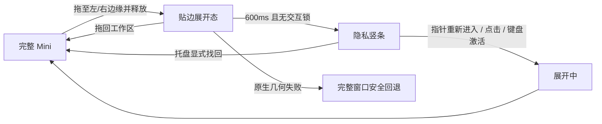
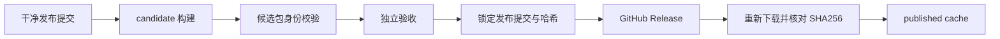
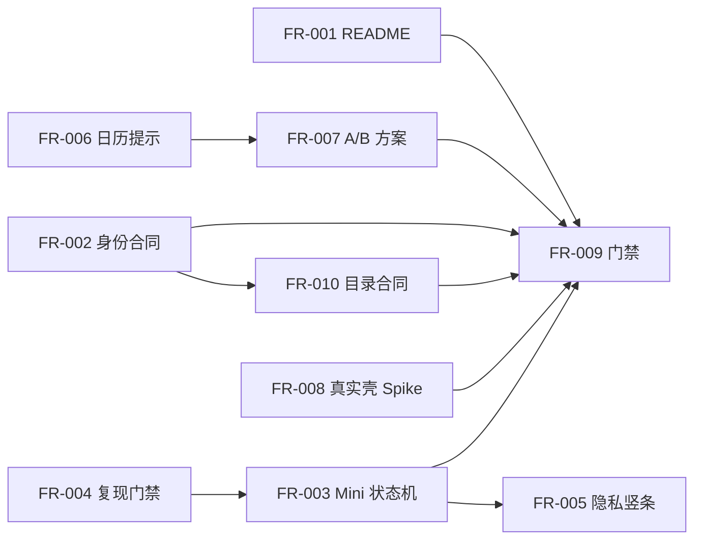

入口判断：/prd

# LetsMakeMoney Windows v1.0.5 产品需求文档

## 0. 文档信息

| 项目 | 内容 |
| --- | --- |
| PRD 类型 | 正式推进型（含条件 Bugfix、技术 Spike 与原型门禁） |
| 目标版本 | Windows v1.0.5 Stable |
| 当前公开版本 | Windows v1.0.4 Stable |
| 开发基线 | `main` / `8a63da7836fb24c3b7f8ff12f896ac40571adeb7` |
| 上游需求池 | `doc/releases/v1.0.5/idea-pool.md` |
| 当前状态 | 项目所有者已确认；进入开发承接，实施未开始 |
| GitHub 正式 v1.0.4 Zip SHA256 | `C4F28892831891A4266C4D9B12D432CD5C970BB3C9B36A6B8DB21FA2566DE50E` |
| 数据库影响 | 无数据库影响 |
| 最后更新 | 2026-07-31 |

本 PRD 采用 Idea 阶段的推荐方案，将 v1.0.5 定位为“隐私与发布可信度维护 + 限定范围视觉精修”的正式小版本。版本主线是可靠隐藏工资信息、避免拿错发布对象、收敛日历导航语义，并校准 Workbench、Settings、Wizard 的窗口表面；不恢复宠物，不扩展产品主能力。

**本轮不以低保真线框替代。** 用户可见变化必须在现有 `doc/prototypes/v1.0/` 高保真交互原型中表达，并经过真实 Tauri 壳、浅色/深色主题和 DPI 验证后才能实现或验收。

## 1. 版本判断

### 1.1 已确认事实

1. `README.md`、`README.en.md`、`apps/windows-v1/README.md` 仍残留 v1.0.3 版本和 `v103` 命令，已与 v1.0.4 公开事实漂移。
2. 本地 `releases/v1.0.4` 同名 Zip 是 dirty candidate，不是 GitHub 正式附件；二者 SHA256 不同。
3. Mini 首次拖至左右工作区边缘后，当前状态机可能因拖动前遗留的 `pointerInside=true` 而等待额外点击或 `pointerleave`，延长工资可见时间。
4. 当前 10 逻辑像素空白触发条能恢复 Mini，但不可读、可发现性弱，不能满足项目所有者确认的非金额倒计时竖条需求。
5. normal official 日历来源块持续占用首屏；estimated、stale、loading、error 则仍必须明显展示。
6. “今天”的数字圆环与“已选日期”的整格边框虽然语义不同，但视觉层级仍需项目所有者在两套高保真方案中选择。
7. Workbench、Settings、Wizard 的透明根容器、窗口表面、边框、圆角和阴影存在叠层观感；仅凭浏览器 CSS 无法证明真实 Tauri 壳可安全调整。

### 1.2 已确认决策

1. v1.0.5 是包含隐私能力和限定视觉优化的正式小版本。
2. 非金额隐私倒计时竖条进入正式范围。
3. 普通休息日、带薪休息和不带薪休息在竖条上一律显示“今日休息”，不得暴露工资制度。
4. 后续可以删除本地 dirty v1.0.4 candidate，但必须先保存 SHA256、`BUILD-INFO.json`、来源和处置记录，并确认正式附件可重新下载；本 PRD 阶段不删除。
5. 窗口表面精修只覆盖 Workbench、Settings、Wizard；Mini 只处理隐私状态机和回归保护。
6. 宠物与 PetManager 留给独立版本。
7. 关闭 Workbench 后出现的异常界面尚未确认身份，必须先复现和标记窗口，不能预设根因。
8. 日历“今天”采用方案 A：左上“今”角标与数字加粗；方案 B 仅保留为已否决的原型对照。
9. FR-008 采用真实 Tauri 壳 Spike 先行；若关键门禁失败，保留 v1.0.4 窗口表面，不阻塞其他已完成范围。

### 1.3 版本目标

- Mini 首次贴边后无需额外点击即可在约定延迟内收起工资信息，并始终可找回。
- 收起状态只显示低敏感度、非金额、不可反推出工资制度的阶段信息。
- 普通焦点转移不再被误当作用户显式找回窗口。
- 候选包、验收证据、本地正式附件缓存和 GitHub Release 的身份不可混淆。
- normal official 日历保持安静；数据可信度存在风险时仍明确提醒。
- “今天”“选中日期”和日期业务状态可叠加辨认，不仅依赖颜色。
- Workbench、Settings、Wizard 在真实 Windows 桌面中形成单一清晰表面，无“框中框”、四角裁切或 DPI 模糊。

### 1.4 非目标

- 不恢复宠物、PetManager 或任何桌宠入口。
- 不加入账号、云同步、安装器、静默更新、多平台或新业务模式。
- 不重写设计系统、React 全局状态、Rust/Tauri 主链路或技术栈。
- 不参数化或删除全部历史脚本，不批量迁移历史文档、原型和证据。
- 不修改 v1.0.4 tag、Release、附件和既有哈希。
- 不改变收入公式、日历数据源、主题范围或日期调整事务。

## 2. 用户与核心场景

| 角色 | 核心需要 |
| --- | --- |
| 普通用户 | 在办公室桌面持续查看节奏，但能快速隐藏工资并可靠找回 Mini |
| 注重隐私的用户 | 屏幕边缘只保留非金额、低敏感度信息，不暴露收入和工资制度 |
| 维护者 | 能证明候选包、发布提交、正式附件和验收证据属于同一身份 |
| 外部贡献者 | 从 README 执行当前有效命令，并理解当前公开版本和产品边界 |
| 验收者 | 能区分真实缺陷、条件 Bugfix、原型选型和真实壳技术门禁 |

### 2.1 隐私黄金路径

### 2.2 发布身份黄金路径

## 3. 正式范围与追踪

| FR | IDEA | 标题 | 优先级 | 进入条件 |
| --- | --- | --- | --- | --- |
| FR-001 | V105-IDEA-001 | 公开 README 当前事实收口 | P0 | 无 |
| FR-002 | V105-IDEA-002 | Candidate / Published Identity 合同 | P0 | 无 |
| FR-003 | V105-IDEA-003 | Mini 首次贴边自动收起 | P0 | characterization tests 先行 |
| FR-004 | V105-IDEA-004 | focus / explicit shown 语义分离 | P1 条件项 | 20 次复现与界面身份关闭 |
| FR-005 | V105-IDEA-005 | 非金额隐私倒计时竖条 | P1 | FR-003 状态机稳定 |
| FR-006 | V105-IDEA-006 | 日历 normal official 提示收敛 | P1 | 无 |
| FR-007 | V105-IDEA-007 | 日历复合导航视觉 | P1 | 已确认方案 A |
| FR-008 | V105-IDEA-008 | 单一窗口表面校准 | P1 Spike 门禁 | 真实 Tauri 壳技术 Spike 通过 |
| FR-009 | V105-IDEA-009 | 高风险发布与体验门禁 | P0/P1 横切 | 随相关 FR 同步建立 |
| FR-010 | V105-IDEA-010 | 本地证据与产物目录合同 | P2 | 不执行批量删除 |

## 4. FR-001：公开 README 当前事实收口

### 4.1 用户目标与流程

- 入口：GitHub 仓库根 README、英文 README、`apps/windows-v1/README.md`。
- 默认：展示当前公开版本 v1.0.4 Stable，并将 v1.0.5 明确为开发中而非可下载版本。
- 正常：用户从 README 进入 v1.0.4 Release，贡献者执行真实存在的当前验证、构建和包验命令。
- 失败：版本、命令、脚本路径或 Release 链接不一致时 docs gate 返回非零；不得发布。
- 出口：三个 README 与 `doc/current.md`、脚本目录和 Release 链接一致。

### 4.2 合同

1. 中文和英文 README 的当前公开版本、产品边界、下载链接和无宠物事实一致。
2. 工程 README 只列出当前有效脚本，不继续使用失效 `v103` 命令作为默认入口。
3. v1.0.5 在发布前必须称为“开发中”，发布后由发布收口任务统一切换为 Stable。
4. 历史 Release 文档保留原始口径，不追溯重写。

### 4.3 验收

- AUTO：解析三个 README，核对版本、脚本存在性、中英文关键事实、Release URL 和 UTF-8。
- MAN：人工复核中英文含义无漂移。
- 发布门禁：任一 README 指向旧命令、无效链接或错误当前版本即失败。

## 5. FR-002：Candidate / Published Identity 合同

### 5.1 身份模型

| 对象 | 定义 | 是否可称为正式发布 |
| --- | --- | --- |
| candidate | 从指定工作树和提交构建、待验收的候选包 | 否 |
| acceptance evidence | 针对唯一 candidate 产生的脱敏摘要与外部原始证据索引 | 否 |
| release staging | 验收通过后从干净提交重新构建的待发布对象 | 否 |
| GitHub Release asset | 由锁定 tag 发布到 GitHub 的正式附件 | 是 |
| published cache | 从 GitHub Release 重新下载并通过哈希复核的本地缓存 | 是，但仅代表该附件副本 |

### 5.2 `BUILD-INFO.json` 必需字段

- `version`
- `platform`
- `architecture`
- `source_head`
- `source_tree_dirty`
- `build_timestamp_utc`
- `executable_sha256`
- `webview2_loader_sha256`
- 包内 README 与日历资源身份

### 5.3 候选验证

1. 文件名、版本、平台、架构和包内目录一致。
2. `source_head` 等于实际构建提交；`source_tree_dirty` 可以为 true，但必须被明确记录。
3. Candidate 不得放入会与 published cache 混淆的目录，也不得仅凭同名 Zip 或内部自洽宣称正式。
4. EXE、DLL、README、许可和日历资源哈希与 `BUILD-INFO.json` 一致。

### 5.4 正式发布验证

1. `source_tree_dirty=false`。
2. `source_head` 等于锁定发布提交和 tag 指向提交。
3. Zip、EXE、WebView2Loader 和 `SHA256SUMS.txt` 一致。
4. GitHub 上传后必须重新下载附件，再计算 SHA256；本地 staging 自洽不能替代此步骤。
5. 发现同名异身份文件时应中止并输出两者路径、哈希和来源，不覆盖任何文件。

### 5.5 v1.0.4 dirty candidate 处置

本版仅定义后续操作：先保存 SHA256、`BUILD-INFO.json`、来源提交、dirty 状态和处置原因；再确认 GitHub 正式附件可重新下载且哈希为 `C4F...6DE50E`；最后由单独清理授权删除 dirty candidate。任一步失败都保留原文件。本 PRD 不执行删除。

### 5.6 验收

- AUTO：干净候选通过；dirty 候选只能通过 candidate 模式、必须被 publish 模式拒绝；错误 source HEAD、同名异哈希、远端下载哈希不符均失败。
- CU：新目录解压并启动候选；验证窗口、版本和进程身份。
- MAN：发布前核对 tag、Release、资产清单和回下载结果。

## 6. FR-003：Mini 首次贴边自动收起

### 6.1 状态机

| 状态 | 含义 | 可见内容 |
| --- | --- | --- |
| `floating_expanded` | 未停靠、完整 Mini | 完整收入信息 |
| `docked_expanded` | 已吸附边缘但暂未收起 | 完整 Mini |
| `retract_pending` | 正等待收起延迟 | 完整 Mini |
| `retracted_tab` | 已收起，仅保留隐私竖条 | 非金额阶段信息 |
| `revealing` | 正从竖条展开 | 过渡内容；不得闪现错误边 |
| `fallback_expanded` | 原生几何或状态失败后的安全回退 | 完整 Mini + 可读反馈 |

### 6.2 工作区与吸附

- 仅支持当前显示器工作区左边缘和右边缘，不支持顶部、底部。
- 吸附阈值继承 16 逻辑像素，解除停靠阈值继承 24 逻辑像素；真实位置由 Rust/Tauri 工作区几何计算，CSS 不负责判断。
- 必须支持 Windows 任务栏占用后的工作区、负坐标工作区和显示器移除后的安全回落；后两项环境不具备时只能标记待人工补证。
- 位置继续使用 v1.0.4 配置字段 `mini_edge_auto_hide` 与 `mini_edge_dock`，不新增数据库或破坏 v8 配置。

### 6.3 首次收起规则

1. 拖动完成后先读取原生停靠结果，再清除 `dragging` 锁。
2. 状态机必须重新计算或显式重置拖动后的指针资格；不得依赖未来的 `pointerleave` 才启动首次收起。
3. 若已停靠且无焦点、菜单、对话框或新一轮拖动锁，立即进入 `retract_pending`，延迟 600ms 后收起。
4. 在延迟期间发生新的有效指针进入、键盘焦点、菜单、对话框或拖动时，取消该代 timer，恢复 `docked_expanded`。
5. timer 必须带 generation/token；晚到回调和原生异步结果不得覆盖新状态。
6. 拖动释放后即使指针物理上仍位于窗口原区域，也不得形成“收起后同一静止指针立即反复展开”的抖动。收起后只有新的离开再进入、竖条点击、键盘激活或显式找回才允许展开。

### 6.4 展开与找回语义

| 事件 | 是否展开 | 说明 |
| --- | --- | --- |
| 隐私竖条新的 pointer enter | 是 | 必须是收起后的新进入 |
| 点击或键盘激活竖条 | 是 | 显式用户动作 |
| 托盘“显示/恢复” | 是 | 显式找回 |
| 用户主动打开 Mini | 是 | 显式找回 |
| 普通窗口 focus | 否 | 不等同于找回 |
| sibling Workbench 关闭后的焦点返回 | 否 | 不得泄露收入 |
| 配置更新 | 否 | 只刷新状态，不改变可见性 |
| 应用启动 | 按持久化停靠状态 | 不以启动 focus 强制展开 |

### 6.5 原生失败与恢复

- 原生状态读取、几何移动或收起失败时进入 `fallback_expanded`，保证完整窗口处于工作区内并可操作。
- 反馈使用“贴边隐藏暂不可用，已恢复完整窗口”，4 秒后可消失；错误原因写入脱敏日志。
- 禁止失败后只剩不可点击空白边、将窗口移出所有工作区或持续重试刷日志。

### 6.6 日志

- `mini.edge.drag.completed`
- `mini.edge.dock.changed`
- `mini.edge.retract.scheduled/cancelled/completed`
- `mini.edge.reveal.requested/completed`
- `mini.edge.fallback`

日志记录停靠侧、状态、事件来源、timer generation 和错误分类；不记录工资、精确屏幕坐标或用户名。

## 7. FR-004：focus 与 explicit shown 语义分离（条件项）

### 7.1 复现门禁

在修改实现前，对以下路径各执行至少 20 次，并记录窗口标签、可见性和事件时间线：

- 鼠标关闭 Workbench。
- 快捷键或系统关闭 Workbench。
- 托盘切换 Workbench。
- 关闭时 Mini 为完整、贴边展开、已收起三种状态。

必须记录 `focus`、`blur`、`lmm:window-shown`、原生 show/hide、reveal source 和当前窗口标签。截图必须能确认异常界面是完整 Mini、隐私竖条、托盘菜单还是其他窗口。

### 7.2 条件处理

- 若稳定复现并证明普通 `focus` 与显式 `shown` 共用 reveal 是根因：分离事件；普通 focus 只更新焦点锁，不展开，只有带显式 source 的 shown/restore 才展开。
- 若根因不同：按证据写最小修复，仍须满足 FR-003 展开矩阵。
- 若 20 次均无法复现：保留诊断事件和 `/acceptance` 待补证项，不得写为“已修复”，不阻塞其他已确定范围。

### 7.3 回归保护

托盘显式找回、首次启动显示、隐私竖条激活必须保持可用；关闭 sibling 窗口、普通 Alt-Tab 或配置更新不得强制展开收起态 Mini。

## 8. FR-005：非金额隐私倒计时竖条

### 8.1 视觉与尺寸

- 收起后在工作区内保留 28 逻辑像素宽的竖条，物理像素随 DPI 转换；高度与当前 Mini 合同一致。
- 左右边缘均使用从上到下的可读中文，右侧不得镜像文字。
- 整个竖条是同一点击/hover/键盘目标；最小命中区域即完整 28px × Mini 高度。
- 竖条使用现有浅色/深色主题令牌，焦点环可见；不使用金额图标、工资颜色或能暗示薪资等级的进度长度。
- 动画沿用 180ms；启用减少动态效果时立即切换或不超过 50ms。

### 8.2 文案矩阵

| 业务状态 | 竖条文案 |
| --- | --- |
| `before_work` | `距离上班 {时长}` |
| `working` 且休息未开始 | `距离休息 {时长}` |
| `rest` | `距离恢复工作 {时长}` |
| `working` 且休息已结束或零休息 | `距离下班 {时长}` |
| `after_work` | `今日工作已结束` |
| `rest_day` / `paid_rest` / `unpaid_rest` | `今日休息` |
| `loading` | `正在同步` |
| `error` / 无下一边界 | `点击展开查看` |

### 8.3 时间格式与隐私

- 竖条按分钟级展示，不显示秒：`1小时30分`、`45分钟`；不足一分钟使用“即将上班/休息/恢复工作/下班”。
- 超过 99 小时使用 `99+小时`，防止长内容破坏布局。
- 跨夜班次继续消费权威快照的下一业务边界，不自行按自然日推算。
- 禁止显示月薪、今日已赚、日薪、时薪、预计收入、收入进度、带薪/不带薪类型。
- ARIA 使用完整自然语言，例如“距离下班还有一小时三十分钟，按 Enter 展开迷你收入视图”。

### 8.4 交互

- 新的 pointer enter 展开；pointer leave 且无锁后延迟 600ms 收回。
- 单击、Enter、Space 立即展开并把焦点移至完整 Mini 的首个有意义控件。
- 展开后焦点不得留在已移出屏幕的竖条节点。
- 错误态点击仅展开完整窗口，不自动重试收入计算。

## 9. FR-006：日历 normal official 提示收敛

### 9.1 合同

- 官方数据正常可用时，移除日历首屏常驻绿色来源块和同等重复说明，不再下压星期栏与日期网格。
- 官方来源、数据版本和哈希仍可从数据与支持、诊断摘要或关于信息查询。
- estimated、stale、loading、error 必须继续显示独立状态区；不得为了视觉简化掩盖可信度风险。
- loading 保留稳定占位，避免日历网格上下跳动；error 提供重试；stale 说明继续使用上一份有效数据。

### 9.2 状态文案

| 状态 | 标题 | 说明 / 操作 |
| --- | --- | --- |
| official | 不显示首屏块 | 来源可在数据与支持查看 |
| estimated | `当前年份使用估算日历` | 说明依据用户休息模式，不是官方数据 |
| stale | `日历数据可能已过期` | 保留旧数据并提供重试 |
| loading | `正在加载日历` | 不提供无意义重复操作 |
| error | `日历暂时无法加载` | 提供重试，保护已有有效内容 |

## 10. FR-007：日历复合导航视觉

### 10.1 状态分层

每个日期格由三层组成，禁止互相覆盖：

1. 业务层：普通工作日、普通休息日、官方调休工作日、手动工作日、带薪休息、不带薪休息。
2. 导航层：今天、当前选中日期。
3. 交互层：hover、keyboard focus、disabled、stale。

优先级：keyboard focus > selected > today cue；业务背景和业务标记始终保留。stale 降低整体强调但不抹掉日期类型。

### 10.2 高保真候选

- **方案 A（推荐）**：日期格左上角小型“今”角标 + 日期数字加粗；选中日期使用完整 2px 轮廓。角标不占业务标记位置。
- **方案 B**：日期数字下方显示短签“今天” + 日期数字加粗；选中日期仍使用完整 2px 轮廓。

两套方案必须同时覆盖浅色、深色、工作日、休息日、手动调整、selected、focus 和 stale。项目所有者确认其一后才能进入开发；未确认前 FR-007 不进入实现排期。

### 10.3 可访问性

- `aria-current="date"` 表示今天，`aria-selected` 表示选中，标签同时朗读业务类型和手动调整来源。
- 今天、选中和业务状态至少通过形状、文字或边框中的两类线索区分，不能只靠颜色。
- 键盘方向键、Enter 和 Escape 行为保持 v1.0.4 合同。

## 11. FR-008：Workbench / Settings / Wizard 单一窗口表面

### 11.1 技术 Spike

在业务实现前制作真实 Tauri 壳实验，只允许调整容器职责，不重排页面信息架构。需要比较：

- 现状：透明根容器 + `WindowFrame` + 内层边框/圆角/阴影。
- 目标：仅一个可见表面负责背景、边框、圆角和阴影，其余容器透明且不重复绘制。

Spike 必须回答：

1. 原生窗口、透明 WebView 根节点和 `WindowFrame` 中哪一层负责圆角。
2. 哪一层负责边框与阴影；是否能在 Windows 10/11 保持一致可接受。
3. 四角透明裁切、窗口拖动、关闭按钮、模态遮罩和焦点环是否完整。
4. 浅色、深色、减少动态、100%/125%/150% DPI 是否无边缘像素、阴影裁切和模糊。

### 11.2 实现与回退门禁

- Spike 通过：只把选定表面合同应用到 Workbench、Settings、Wizard，并逐窗截图比对。
- Spike 未通过：保留 v1.0.4 窗口表面，不阻塞 FR-001/002/003/005/006/009/010；记录为延期体验债。
- Mini 不套用通用表面修改，只做视觉回归，避免破坏贴边几何。
- 禁止借机调整导航、表单结构、主题令牌体系或整体组件库。

## 12. FR-009：高风险门禁

### 12.1 自动测试

1. 首次贴边且没有 `pointerleave` 仍按约定收起。
2. 拖动完成后 stale `pointerInside` 不阻塞首次收起。
3. timer 唯一、可取消，晚到异步结果不覆盖新状态。
4. pointer 静止时收起后不形成反复 reveal/retract。
5. 普通 focus 不展开，显式 tray restore / tab activate 可展开。
6. 关闭 Workbench 组合路径按 FR-004 的已确认结果断言。
7. 隐私竖条全部状态文案不包含金额、进度、带薪/不带薪。
8. normal official 不显示常驻块，四种风险态仍显示。
9. 今天、选中、业务状态、focus、stale 叠加的 class/ARIA 行为。
10. Candidate 模式接受已标注 dirty 包，Publish 模式拒绝 dirty 包。
11. source HEAD、tag、锁定 SHA、README 和脚本存在性负向夹具。

### 12.2 Computer Use

- 左右边缘首次收起、hover、移开、点击、键盘和托盘找回。
- 拖回工作区、关闭自动隐藏、重启恢复和原生失败安全回退。
- Workbench 关闭 20 次复现与界面身份记录。
- 日历浅色/深色的 official/risk 状态和 A/B 方案。
- 三个窗口的现状/目标表面对照及四角检查。
- 新解压 candidate 启动、版本、窗口和进程身份。

### 12.3 人工补证

- 真实通知区鼠标操作。
- 125%/150% DPI。
- 多显示器、负坐标工作区和显示器移除回落；环境不具备时必须标记“待人工补证”，不得伪造通过。
- Windows 10/11 的窗口表面差异；缺少其中一套环境时记录限制。

### 12.4 结论词

每项只允许：`通过`、`部分通过`、`未通过`、`待人工补证`、`暂不验证`。

## 13. FR-010：证据与本地目录所有权

### 13.1 目录合同

| 目录 | 所有权与用途 | Git |
| --- | --- | --- |
| `.artifacts/candidates/v1.0.5/<candidate-id>/` | 构建任务；候选包和 BUILD-INFO | 忽略 |
| `.artifacts/acceptance/v1.0.5/<candidate-id>/` | 验收任务；原始截图、录屏、日志 | 忽略、外部留存 |
| `doc/releases/v1.0.5/evidence/<candidate-id>/` | 版本文档；脱敏摘要、哈希、环境、结论和外部索引 | 跟踪 |
| `.artifacts/published/v1.0.5/<tag>/<downloaded-at>/` | 发布任务；从 GitHub 回下载的正式附件缓存 | 忽略 |
| `releases/v1.0.5/` | 发布收口 staging；只在发布任务中产生 | 按既有仓库策略，不等同 published cache |

### 13.2 证据摘要

永久摘要至少记录：candidate ID、分支、source HEAD、dirty 状态、Zip/EXE/DLL 哈希、环境、自动/CU/人工结论、暂不验证项、原始证据位置及其可用状态。不得保存用户名、完整本机路径、Token 或未脱敏日志。

### 13.3 清理保护

- 本版只建立合同、检查和处置清单，不删除历史资产。
- 原始证据丢失时必须标记“原始证据不可用”，不能用后续重构证据冒充。
- Candidate、published cache 和仓库内脱敏摘要由不同任务写入，禁止互相覆盖。

## 14. 数据、配置与兼容

### 14.1 配置

- 延续配置 schema v8 的 `mini_edge_auto_hide: boolean` 与 `mini_edge_dock: none|left|right`。
- 不新增隐私竖条开关；启用贴边自动隐藏即使用竖条合同。
- v1.0.4 旧配置读取后行为升级为 28px 文案竖条；关闭自动隐藏时清除停靠并恢复完整窗口。
- 非法 dock 值回退 `none`；原生位置无效时回退当前工作区内完整窗口。
- 保存、取消、关闭和保存失败继续使用现有配置事务；失败不得污染旧配置。

### 14.2 运行数据

- 竖条消费现有权威 Dashboard snapshot 的业务阶段与下一边界，不自行计算收入或班次。
- normal official 日历只改变呈现，不修改数据源或缓存。
- 日历 A/B 只改变导航视觉，不修改日期调整事务。

### 14.3 安全与隐私

- 竖条不展示或记录收入、工资制度和精确坐标。
- 发布证据不得包含用户名、Token、完整绝对路径或未脱敏日志。
- 无网络新增、无账号、无数据库、无遥测变化。

### 14.4 回滚

- FR-003/005 可通过关闭 `mini_edge_auto_hide` 恢复完整 Mini；代码回滚保留 v1.0.4 配置兼容。
- FR-006/007 回滚只影响呈现，不改日历数据。
- FR-008 Spike 或实装失败直接保留 v1.0.4 窗口表面。
- 发布异常回滚至 v1.0.4 GitHub 正式附件，不使用本地 dirty candidate。

## 15. 逐项影响范围

| FR | React / Hooks | Rust / Tauri | CSS / 主题 | 配置 / 数据 | 日志 | 测试 / 脚本 / 文档 | 数据库 |
| --- | --- | --- | --- | --- | --- | --- | --- |
| FR-001 | 无 | 无 | 无 | 无 | 无 | 三个 README、docs gate | 无影响 |
| FR-002 | 无 | 只读版本/窗口身份 | 无 | BUILD-INFO | 构建/发布日志 | package、package verify、Release checklist | 无影响 |
| FR-003 | `miniEdgeAutoHide`、Hook、MiniWindow | work-area、dock/retract 命令 | 收起/展开过渡 | 复用 v8 字段 | `mini.edge.*` | TS 状态机、Rust 几何、CU | 无影响 |
| FR-004 | Hook 事件映射 | shown/hide source | 无 | 无 | 窗口事件时间线 | 20 次复现、组合测试 | 无影响 |
| FR-005 | Mini 竖条呈现选择器 | 复用几何 | 浅/深、DPI、reduced motion | 消费 snapshot | 不记录文案数值 | 隐私负向、CU、ARIA | 无影响 |
| FR-006 | CalendarCoverageNotice | 无 | 状态区稳定占位 | 不改数据源 | 沿用 coverage 日志 | 状态矩阵 | 无影响 |
| FR-007 | Calendar cell presenter | 无 | A/B、focus、selected、today | 不改业务状态 | 无新增生产日志 | 原型选择、ARIA、视觉回归 | 无影响 |
| FR-008 | WindowFrame 与三个页面根容器 | 真实壳透明/阴影策略 | 单一表面 | 无 | Spike 结果 | 真实壳/DPI 截图 | 无影响 |
| FR-009 | 测试 fixture | Rust/desktop fixture | 视觉快照/行为 | 隔离 fixture | 测试日志 | CI、验收文档 | 无影响 |
| FR-010 | 无 | 无 | 无 | 证据元数据 | 脱敏摘要 | ignore、schema、目录说明 | 无影响 |

## 16. 原型合同

现有 `doc/prototypes/v1.0/` 原地增量更新，不创建风格割裂的第二套原型：

1. Mini：完整、左侧竖条、右侧竖条、hover 展开、移开收回、loading、error、before_work、working、rest、after_work、休息日。
2. 日历：official 正常态无来源块；estimated/stale/loading/error 可见；A/B 两套今天表达与 selected、业务状态叠加。
3. Workbench、Settings、Wizard：现状边界与单一表面目标可切换对照。
4. 浅色、深色、长内容、100%/125%/150% DPI 控件继续可交互。
5. 原型不得用运行截图替代结构；验证控制条不是产品界面。

原型验证必须覆盖桌面宽屏、窄窗口、键盘焦点、减少动态效果和浏览器控制台零错误。浏览器通过不等同于 FR-008 真实 Tauri 壳 Spike 通过。

## 17. 开发前验收目标

| ID | 对应 FR | 验收目标 | 通过标准 | 不通过处理 |
| --- | --- | --- | --- | --- |
| V105-ACC-001 | 001 | README 事实一致 | 三文件版本、命令、链接、边界一致 | 阻塞发布 |
| V105-ACC-002 | 002/010 | 候选与正式对象不可混淆 | dirty/错误 HEAD/异哈希负向全部失败 | 阻塞发布 |
| V105-ACC-003 | 003 | 首次贴边无需额外交互收起 | 左右边缘均在 600ms + 180ms 容差内收起 | 阻塞发布 |
| V105-ACC-004 | 003/004 | 可找回且无抖动 | hover、点击、键盘、托盘可恢复；普通 focus 不展开 | 阻塞发布 |
| V105-ACC-005 | 004 | 异常界面身份关闭 | 有 20 次真实证据；若不可复现则明确待补证 | 不得伪称修复 |
| V105-ACC-006 | 005 | 竖条零收入泄露 | 全状态文本与 DOM/ARIA 不含禁用字段 | 阻塞发布 |
| V105-ACC-007 | 005 | DPI 与左右边缘可读 | 100/125/150% 无裁切，左右不镜像 | 失败则回退空白条并阻塞正式需求完成 |
| V105-ACC-008 | 006 | 正常态安静、风险态清楚 | official 无首屏块；四类风险态完整 | 阻塞发布 |
| V105-ACC-009 | 007 | 日期复合状态可辨认 | 所有叠加状态具备非颜色线索和正确 ARIA | 阻塞 FR-007 |
| V105-ACC-010 | 008 | 单一表面真实壳通过 | 三窗四角、阴影、拖动、主题、DPI 通过 | 回滚 v1.0.4 表面，可不阻塞其余范围 |
| V105-ACC-011 | 全部 | v1.0.4 回归 | 收入、日历、日期调整、Settings、Wizard、托盘与主题无回归 | 阻塞发布 |
| V105-ACC-012 | 002/009 | GitHub 回下载身份 | 发布后回下载 Zip SHA 等于清单 | 阻塞发布完成 |

## 18. 实施顺序与依赖

推荐顺序：

1. M0：README、身份与目录合同；建立失败夹具。
2. M1：Mini characterization tests 与 FR-004 复现观测。
3. M2：FR-003 状态机修复与原生回退。
4. M3：FR-005 隐私竖条。
5. M4：FR-006 与经确认后的 FR-007。
6. M5：FR-008 真实壳 Spike；通过才实施。
7. M6：聚合自动门禁、真实桌面验收和候选身份锁定。

## 19. 发布门禁

以下任一项未通过，v1.0.5 不得发布：

- P0 README、发布身份或首次贴边隐私收起未关闭。
- 竖条出现任何收入、进度或带薪/不带薪信息。
- Mini 无法通过竖条或托盘可靠找回，或失败后落到不可见工作区。
- official/risk 日历状态混淆导致数据可信度误导。
- 候选 `source_tree_dirty=true` 或 source HEAD 与发布提交不符。
- v1.0.4 核心收入、日期调整、主题、Settings、Wizard、托盘回归失败。

FR-007 未获项目所有者样式确认时可从 v1.0.5 实现范围撤下并保持 v1.0.4 表达；FR-008 Spike 未通过时必须回滚既有表面，二者不允许用未经确认的实现强行发布。

## 20. 风险与缓解

| 风险 | 缓解 |
| --- | --- |
| 拖动释放后同一指针引发收起/展开循环 | 新进入意图、timer generation、定向状态机测试 |
| 竖条文案反推出工资制度 | 统一“今日休息”，禁用金额/进度字段，DOM/ARIA 负向扫描 |
| focus 语义修改破坏托盘找回 | 先锁定 explicit source 矩阵，真实通知区回归 |
| 窗口表面 CSS 在 Tauri 四角裁切 | 真实壳 Spike，失败即不实施 |
| 同名 Zip 再次被误认正式附件 | candidate/published 双模式、回下载哈希、目录隔离 |
| 日历视觉只在一种主题可辨 | A/B 同时覆盖浅/深和复合状态，可访问性门禁 |

## 21. 已确认决策与后续独立授权

1. 日历“今天”采用方案 A：“今”角标与数字加粗。
2. FR-008 按“真实 Tauri 壳 Spike 先行、失败则保留 v1.0.4 表面”进入开发计划。
3. 完成后对 v1.0.4 dirty candidate 的实际删除仍需单独授权；本 PRD 只建立处置合同，不授权删除。

关闭 Workbench 后异常界面身份不要求项目所有者提前猜测，由 FR-004 的 20 次复现证据回答。

## 22. 是否具备生成开发计划的条件

PRD、FR/IDEA 追踪、状态机、发布身份、验收和原型合同已经完整；项目所有者已确认方案 A 与 FR-008 Spike 回退边界，**具备生成开发承接文档的条件**。

开发承接不构成业务代码实施、dirty candidate 删除、构建、打包、提交、推送、tag 或 Release 授权。上述动作仍按实施批次和外部写操作门禁分别执行。
